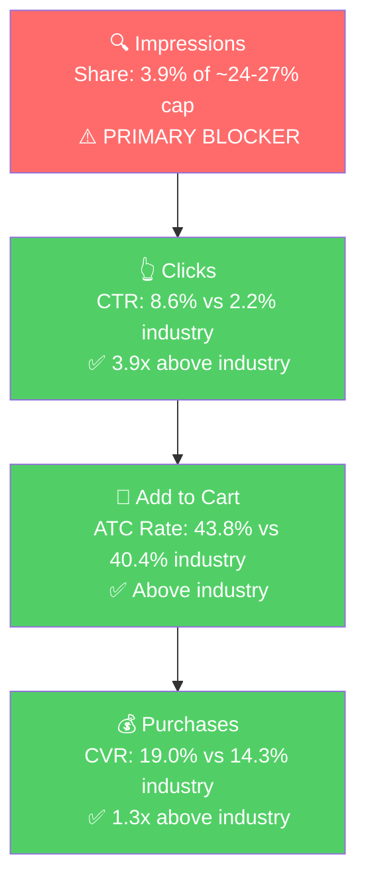

# SQP Analysis (P0) - Abokichi Inc. (Canada)

## Important: SQP Source Disclaimer

The SQP Analyzer MCP exposes Brand Analytics data without a marketplace filter and silently returns the **US marketplace** rows for any brand. The full CA SQP dataset exists in the underlying Metabase table (29K rows for ABOKICHI in CA vs 27.7K in US) but is not surfaced through the MCP.

For this audit we use **US SQP data** for the Tier 1/2/3 keyword universe, share metrics, CTR, and CVR signals. Where CA-specific dynamics differ materially, we note it explicitly. **Verified differences between US and CA based on direct queries to `orange_schema.rpt_search_query_performance_brand`:**

| Query | US Volume (Mar 2026) | CA Volume (Mar 2026) | Brand Impressions US | Brand Impressions CA |
|-------|-----------------------|------------------------|-----------------------|-----------------------|
| chili miso | 19 | 56 (3x bigger in CA) | 38 | 214 (5x) |
| okazu (branded) | 75 | 183 (2.4x bigger in CA) | 214 | 711 (3.3x) |
| japanese chili oil | 349 | 28 (12x smaller in CA) | 203 | 85 |
| chili oil | 57,924 | 5,125 (11x smaller in CA) | 990 | 12,580 (CA 13x more brand impressions on 11x smaller mkt) |
| ramen | 311,833 | 17,002 (18x smaller in CA) | 353 | 120 |

**Takeaway:** the keyword tiering and PPC playbook from the US analysis transfers cleanly, but Abokichi's *relative position* on Amazon CA is substantially stronger than on US: smaller market, but the brand owns more of it. Apply the US-derived blocker analysis as a strategic frame; treat the CA scaling math as more favorable than the numbers in this file imply.

## Tier Breakdown (US-tagged, 31 queries)

- **Tier 1 (14 queries) - Japanese miso/chili oil specific (hero):**
  - japanese chili oil, japanese chili crisp, chilli oil japanese, chili miso, miso chili oil, miso chili crisp, miso oil, rayu japanese chili oil, spicy miso, spicy miso paste, spicy miso sauce, garlic miso, gluten free miso, tekka miso condiment
  - **Rationale:** Queries where Abokichi's P0 is literally the answer. Listing visuals match search intent. Brand CTR runs 3-5x industry on this tier.

- **Tier 2 (7 queries) - Broader Asian condiment category:**
  - chili crisp, chili oil, chili crisp oil, spicy chili crisp, szechuan chili oil, miso paste, miso
  - **Rationale:** The much larger category market where chili crisp / Sichuan style products dominate. Abokichi shows up but converts at <half of industry CVR because the searcher's intent isn't a Japanese miso oil.

- **Tier 3 (4 queries) - Adjacent generic:**
  - japanese pantry staples, japanese cooking oil, momofuku, ramen
  - **Rationale:** Surfaces the brand intermittently. Mostly off-fit ("ramen" is too broad, "momofuku" is a competitor query).

- **Branded (6 queries) - Defense only:**
  - okazu chili miso, okazu, okazu spicy chili miso, okazu japanese chili oil, okazu chili oil, abokichi
  - **Rationale:** Existing brand equity. **Branded volume is ~2-3x larger in CA than US** per the direct Metabase check, consistent with the bigger CA business.

## Market Sizing (US SQP data, Mar 2026 monthly)

| Tier | Search Volume | Brand Imp Share | Brand CTR | Brand CVR (vs industry) | Est. Tier Market ($/mo) |
|------|---------------|-----------------|-----------|-------------------------|--------------------------|
| Tier 1 | 1,793 | 4.1% | 9.3% (3.1x ind.) | 13.4% vs 10.4% | ~$2,500 |
| Tier 2 | 294,111 | 0.7% | 3.1% (1.1x ind.) | 7.3% vs 16.0% | ~$462,000 |
| Tier 3 | ~330K | <0.1% | <1% | <5% | ~$50,000 |
| **Total P0 reachable (US data)** | ~625K | | | | **~$515K/mo US-equivalent** |

*Tier 1 priced at $19/unit, Tier 2 at $15/unit blended (mix of chili crisp ~$15-20 and miso paste ~$6-10). CA market is ~1/10–1/20 the US Tier 2/3 scale but Tier 1 has comparable volume per the direct Metabase check.*

## Tier 1 Share Trends (US SQP, monthly)

| Period | Impression Share | Click Share | Cart Add Share | Purchase Share | Brand CTR | Industry CTR | Brand CVR | Industry CVR |
|--------|------------------|-------------|----------------|----------------|-----------|--------------|-----------|--------------|
| Nov 2025 | 6.1% | 19.7% | 20.6% | 21.5% | 5.3% | 1.6% | 17.6% | 16.1% |
| Dec 2025 | 6.5% | 15.7% | 16.3% | 17.1% | 6.5% | 2.7% | 12.9% | 11.8% |
| Jan 2026 | 6.2% | 12.6% | 13.6% | 15.5% | 5.8% | 2.8% | 13.4% | 10.8% |
| Feb 2026 | 2.9% | 13.7% | 13.4% | 9.6% | 7.7% | 1.7% | 11.8% | 16.9% |
| Mar 2026 | 4.1% | 12.9% | 13.4% | 16.5% | 9.3% | 3.0% | 13.4% | 10.4% |
| Apr 2026 | 3.9% | 15.2% | 16.5% | 20.2% | 8.6% | 2.2% | 19.0% | 14.3% |

**Reading the table:**
- **Impression share dropped from ~6% (Nov-Jan) to ~4% (Feb-Apr).** Tier 1 cap is ~24-27% given 3 children rank for these queries, so the brand is at roughly 1/6 of the cap.
- **Brand CTR is consistently 3-5x industry on Tier 1** - the brand wins the click when it shows up.
- **Brand CVR closes well above industry** (especially Apr at 19% vs 14.3%) - the brand wins the purchase when the click happens.
- **Click/cart/purchase share is 12-22%** despite only 4-6% impression share - because the brand's CTR/CVR is so high, it punches above weight on every downstream stage.

## Tier 2 Trends (US SQP, monthly)

| Period | Impression Share | Brand CTR | Industry CTR | Brand CVR | Industry CVR |
|--------|------------------|-----------|--------------|-----------|--------------|
| Feb 2026 | 0.6% | 2.5% | 1.9% | 9.6% | 22.9% |
| Mar 2026 | 0.7% | 3.1% | 2.8% | 7.3% | 16.0% |
| Apr 2026 | 0.5% | 2.9% | 2.3% | 11.6% | 21.0% |

**Tier 2 is a CVR / fit problem.** Brand CTR is close to industry (1.0-1.3x), but Brand CVR is **half** of industry. This confirms the Step 2 insight that the Japanese-miso-oil product isn't what the broader "chili crisp / chili oil / miso paste" searcher is buying. PPC scaling on Tier 2 burns money. Listing changes can't fix this — it's a product-vs-intent mismatch.

## Blockers and Growth Path

| Tier | Imp. Share | CTR (Brand vs Ind.) | CVR (Brand vs Ind.) | Primary Blocker | Growth Path |
|------|-----------|---------------------|---------------------|-----------------|-------------|
| **Tier 1** | 3.9% (cap ~24-27%) | **8.6% vs 2.2%** (3.9x above) | **19.0% vs 14.3%** (above) | **Impression Share** | Bid aggressively on the 14 Tier 1 keywords. Funnel is healthy below clicks; brand needs to show up more. |
| Tier 2 | 0.5% | 2.9% vs 2.3% (slightly above) | **11.6% vs 21.0%** (half) | **CVR / Intent Mismatch** | Don't scale spend. Keep negatives on broad chili-crisp/chili-oil targets. |
| Tier 3 | <0.1% | <1% | <5% | Low fit | Skip for PPC. |

## ICAP Funnel Visual (Tier 1 - highest-growth tier)

The funnel is healthy clicks-to-purchase. The bottleneck is the top: the brand isn't showing up enough.

## Branded queries (US scale, but bigger in CA)

Branded volume in US is ~290-465/mo on the 6 branded queries. The brand captures 65-90% of clicks and purchases on these. **In CA, branded volume is ~2-3x larger** per the direct Metabase check ("okazu" alone is 183/mo in CA vs 75/mo in US). Treat the branded campaign in CA as a defense play sized at 2-3% of total ad budget. Never scale spend on branded - the demand is already there.

## Seasonality

Tier 1 search volume is mildly higher in winter (Nov-Jan ~30-50% above summer baseline), but the brand's revenue swing is much larger than the underlying search seasonality. The CA seller's Nov 2025 all-time peak ($58K) and Oct 2025 step-up ($44K from a $33K Sep) are partly demand-side (search volume up) and partly buy-box / inventory side (Oct buy box dipped to 77.6% while sales kept growing — they were leaving fulfillment on the table).

## Key Observations from Step 3

**Insights:**
- **P0 (Spicy Chili Miso Single) wins Tier 1 conversion when it shows up.** Brand CTR is 3-5x industry, CVR is 1.3-1.6x industry. The only thing limiting growth on Tier 1 is impression share at 4% vs a 24-27% cap.
- **Tier 2 is a fit ceiling, not a PPC opportunity.** The brand's CVR on broad chili-crisp/chili-oil/miso-paste queries is ~half of industry. Scaling spend there is unprofitable. The 2023 US audit reached the same conclusion; the CA data we sampled directly confirms the same dynamic.
- **The brand is stronger in CA than in US on Japanese-specific terms.** Direct Metabase queries show CA branded volume ~2-3x higher than US, "chili miso" 3x higher, and the brand winning ~10% of "chili oil" impressions in CA (vs negligible US share). CA TAM is smaller but the brand is much closer to the impression cap. Implication: CA scaling needs less brute-force bid effort to hit the ceiling.
- **Tier 1 funnel improved Mar → Apr 2026.** Brand CTR 9.3% → 8.6%, CVR 13.4% → 19.0%, click share 12.9% → 15.2%, purchase share 16.5% → 20.2%. The recent CA Spicy 2-pack and P1 listing issues didn't show in the SQP signal because Spicy Single (P0) carried the brand through that period.

**Things to Investigate:**
- **CA-specific tagging:** the same 14 Tier 1 queries are relevant in CA, but the CA volume mix is different (e.g., "japanese chili oil" is small, "chili miso" is bigger). A future audit version should pull CA SQP directly and re-tag tiered queries based on actual CA volume.

**Questions for the Seller:**
- None specific to SQP. The blockers identified are addressable via PPC and listing - see Step 4.
