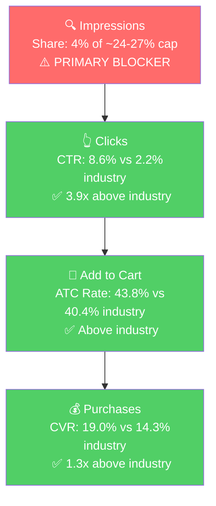

# Seller Central Audit - Abokichi Inc.

Abokichi sells the **OKAZU Japanese Chili Miso Oil** line on Amazon, anchored by 4 core SKUs across Spicy, Mild, Curry, and a 3-flavour Variety Pack. The brand is well-positioned: 8-year listing tenure, 4.5-star rating, full A+ Premium / Brand Store / Video stack on the hero singles, and a clear product-market fit on Japanese-miso-specific search queries where the brand's click-through rate runs **3-5x above industry** and conversion is **above industry**.

The growth path is **allocation and scale, not relaunch**. The single biggest unspent opportunity is the brand's own hero keywords (chili miso, spicy miso, miso chili oil) - they convert at 25-46% on the trickle of spend that reaches them, but each is being funded at less than $20 over a 90-day window. The biggest structural risk is that the account is 100% Manual with no Auto-driven discovery engine, which historical campaigns suggest is unprofitable for this brand.

Two operational issues need triage in Week 1: a likely April stockout on the Mild Single and a buy box collapse on the Spicy 2-pack.

---

## Section 1: Catalog Assessment

| Priority | Product (Child ASIN) | 3-Mo Sales | 3-Mo Ad Spend | ROAS | TACoS | Buy Box % | CVR | Trend |
|----------|----------------------|------------|---------------|------|-------|-----------|-----|-------|
| **P0** | OKAZU Spicy Chili Miso Single (B07JGJXTK8) | $66,123 | $8,558 | 3.22 | 12.9% | 94% | 19.1% | Stable hero |
| **P1** | OKAZU Mild Chili Miso Single (B07JWCDC4D) | $12,554 | $1,884 | 4.38 | 15.0% | 84% | 10.0% | Collapsed in Apr |
| **P2** | OKAZU Variety Pack 3x230mL (B07MCYB2VV) | $16,693 | $104 | **32.4** | 0.6% | 92% | 7.1% | Growing organically |
| **P3** | OKAZU Curry Miso Single (B07JGJXYHP) | $6,929 | $264 | 3.43 | 3.8% | 78% | 9.8% | Stable |

*3-month window: Feb 1 - Apr 30, 2026.*

**Two operational risks to triage:**
- **P1 (Mild Single)** sales fell from $8.3K in March to $193 in April. Sessions dropped from 3,220 to 148 in the same window. The signature is most consistent with an **inventory event (stockout)** rather than a price/buy-box issue. Needs immediate confirmation and restock.
- **Spicy 2-pack (B088YKQV2K)**: buy box has slid from 99.5% (Feb) → 51.3% (Apr) on a private-label listing. Indicates a MAP / third-party-seller issue. Currently doing $8.5K/3-mo with zero ad spend and an actively-collapsing buy box.

**Other catalog notes:**
- **Mild 2-pack (B088YNXZ4B):** $5.3K/3-mo at 24% CVR with zero ad spend. Strong multipack scaling candidate.
- **Sansho Pepper variant (B0CTKKJWFF):** re-launched March 2026 with an under-built listing (no A+, no brand store, ~3 images). Either fully build out or de-prioritize.
- **ABO Matcha (B0F4BXF5FM):** new SKU, zero sales, separate product line. Status unclear.

---

## Section 2: Product Understanding (P0 - Spicy Chili Miso Single)

**Product**
- A Japanese-style spicy chili miso finishing oil with garlic, fermented miso, sesame. 230 mL glass jar, $19.99 retail.
- Vegan, gluten-free, non-GMO, preservative-free. **Umami-forward** (miso-based), not a Sichuan-style numbing chili crisp.
- Toronto-made. The only mainstream Japanese miso-based chili oil in the broader chili crisp category.

**Customer**
- Foodies and home cooks 25-45, urban-skewed. Heavy overlap with Japanese-cooking, ramen-culture, premium-condiment buyers.
- Purchase drivers from review tone: authentic-Japanese flavour, clean ingredients, versatility across ramen / rice / eggs / stir-fry, gift-ability.

**Brand**
- 8 years on Amazon. Registered brand with Brand Store, A+ Premium content, founder-led indie-premium positioning.
- Stronger Japanese-specific keyword equity than the Sichuan-led competitor set (Fly By Jing, Lao Gan Ma, Momofuku).

**Competitive Landscape**

P0 sits at **$2.58 / fl oz** retail - mid-premium for the chili crisp / chili oil category.

| Competitor | Style | Position |
|------------|-------|----------|
| **Abokichi OKAZU Spicy (P0)** | Japanese miso-based | Clean label, only Japanese miso oil in category |
| S&B La-Yu | Japanese classic chili oil | Imported, narrower use case |
| Lao Gan Ma | Chinese mass market | Dominant on broad "chili oil" intent, much lower price |
| Fly By Jing | Premium Sichuan chili crisp | Closest premium competitor, different flavour profile |
| Momofuku Chili Crunch | Celebrity fusion | Strong brand, different positioning |

**Differentiators:** Japanese miso angle + clean label + 8-year category tenure.

**Listing Quality**

**Strengths:**
- A+ Premium content, Brand Store, Video, 9 images, 5 bullets, 4.5-star rating on all three hero singles.
- 8-year listing tenure gives organic ranking pedigree.

**Opportunities:**
- **Multipack listings (Spicy 2-pack, Mild 2-pack) and the Variety Pack have no video.** Re-using the existing single-pack video on these listings is a zero-production-cost CVR fix.
- **Title length 197-200 chars** on all singles - keyword-stuffed, hurts mobile readability. Rebuild titles to lead with the top 3 keywords for cleaner search-result presentation.
- **Sansho variant listing is materially under-built** vs the rest of the catalog. Needs full A+ / Brand Store / image build-out if kept live.

---

## Section 3: Market Opportunity

### Tier Breakdown

The brand's keyword universe falls into three tiers based on product-intent match:

- **Tier 1 - Japanese miso/chili oil specific (14 queries):** japanese chili oil, japanese chili crisp, chilli oil japanese, chili miso, miso chili oil, miso chili crisp, miso oil, rayu japanese chili oil, spicy miso, spicy miso paste, spicy miso sauce, garlic miso, gluten free miso, tekka miso condiment. *This is where the product is literally the answer.*

- **Tier 2 - Broader Asian condiment category (7 queries):** chili crisp, chili oil, chili crisp oil, spicy chili crisp, szechuan chili oil, miso paste, miso. *The much larger category. The product shows up but converts at less than half of industry CVR because the searcher's intent is Sichuan chili crisp or culinary miso paste, not a Japanese miso oil.*

- **Tier 3 - Adjacent generic (4 queries):** japanese pantry staples, japanese cooking oil, momofuku, ramen. *Mostly off-fit.*

- **Branded (6 queries):** okazu, abokichi, okazu chili miso, etc. Existing brand equity. Defense play, not a growth lever.

### Market Sizing

| Tier | Monthly Search Volume | Brand Impression Share | Brand CTR (vs Industry) | Brand CVR (vs Industry) | Est. Market Size ($/mo) |
|------|------------------------|--------------------------|---------------------------|---------------------------|--------------------------|
| Tier 1 | ~1,800 | 4.1% | **9.3% vs 3.0%** (3.1x) | 13.4% vs 10.4% (1.3x) | ~$2,500 |
| Tier 2 | ~294,000 | 0.7% | 3.1% vs 2.8% (~1x) | 7.3% vs 16.0% (half) | ~$462,000 |
| Tier 3 | ~330,000 | <0.1% | <1% | <5% | ~$50,000 |
| **Total reachable** | **~625,000** | | | | **~$515,000** |

*Tier 1 priced at $19/unit (Abokichi price). Tier 2 priced at $15/unit blended.*

### Blockers & Growth Path

| Tier | Impression Share | CTR | CVR | Primary Blocker | Growth Lever |
|------|-------------------|-----|-----|-----------------|---------------|
| **Tier 1** | 4% of a ~24-27% cap | 3-5x above industry | Above industry | **Impression Share** | Bid aggressively on the 14 Tier 1 keywords. Funnel below clicks is healthy; brand just needs to show up more. |
| Tier 2 | 0.5% | At industry | **Half of industry** | **Intent Mismatch** | Skip - the brand can't win category-level chili crisp / miso paste searches. Keep negatives to avoid wasted spend. |
| Tier 3 | <0.1% | Below industry | Below industry | Low fit | Skip. |

### ICAP Funnel (Tier 1 - the highest-leverage tier)

**The funnel is healthy from clicks through purchase. The bottleneck is the top.** Every dollar of additional Tier 1 visibility flows through a click-through and conversion machine that already runs above industry. This is the single most actionable finding in the audit.

---

## Section 4: Ad Analysis

90-day window: Feb 20 - May 19, 2026. Account ROAS is 3.76 on $6.1K of spend. All currently-enabled campaigns are profitable above the 1.5x floor. The work here is **allocation and discovery**, not cleanup.

### Finding 1: Tier 1 brand-fit keywords are massively under-funded

The same 14 Tier 1 keywords identified in Section 3 are inside the existing P0 campaign but are getting trivial spend at extraordinary returns:

| Tier 1 Keyword | Match Type | Spend (90d) | Sales | ROAS | CVR |
|----------------|-------------|--------------|-------|------|-----|
| miso chili oil | EXACT | $0.78 | $151.43 | **194x** | 41% |
| spicy miso | PHRASE | $0.51 | $113.94 | **223x** | 100% (small sample) |
| spicy chili miso | BROAD | $2.71 | $260.95 | **96x** | 46% |
| chili miso | EXACT | $3.63 | $266.91 | **74x** | 33% |
| spicy miso | EXACT | $2.86 | $73.99 | 26x | 44% |
| miso chili oil | PHRASE | $17.78 | $218.93 | 12x | 25% |

**Combined Tier 1 spend: ~$40 over 90 days. Combined sales: ~$1,180. Blended ROAS: ~29x.**

**Solution:** Build a dedicated Manual Exact Match campaign on the 14 Tier 1 keywords. Bid +30-50% to win impression share at the cap. Top of Search modifier +100%. Daily budget $25-40.

**Impact:** Even at a conservative blended 10x ROAS (well below the current 12-300x), $800/mo of dedicated Tier 1 spend produces approximately **$8,000/mo in incremental sales**, with the secondary benefit of compounding organic rank and review velocity on the brand's defensible keywords.

### Finding 2: The account is 100% Manual with no Auto discovery engine

| Targeting Type | Clicks | Spend | Sales | ROAS |
|----------------|--------|-------|-------|------|
| Automatic | – | – | – | – |
| Manual | 7,067 | $6,133 | $23,074 | 3.76 |

There is no Auto campaign running. Historical campaign data on this brand shows that **Manual-only targeting has run unprofitably** - the brand's legacy Manual-Keyword campaign returned 0.62 ROAS while its legacy Auto campaign returned 2.93 ROAS on a similar spend level. Auto is doing two jobs the Manual setup can't replicate: (a) surfacing emerging high-intent search terms the team would never think to add manually, and (b) catching long-tail variants that convert well but live below the keyword-research threshold.

The data above on Tier 1 keywords is direct evidence this matters: 5 of the brand's highest-CVR keywords ("chili miso" at 33% CVR, "spicy miso" at 44% CVR) were found through manual exploration. There are very likely **more keywords like these** Amazon would surface through a properly-fed Auto campaign.

**Solution:** Launch a single Auto campaign on the chili miso oil hero line at $10-15/day with a tight negative-keyword list. Run a 30-day learning window, then harvest converting search terms into the Tier 1 Manual Exact campaign.

**Impact:** $900/mo of incremental sales at a conservative 3.0 ROAS, **plus** a continuous pipeline of new converting keywords feeding the Tier 1 campaign for 6-12 months of compounding gains.

### Finding 3: Product Targeting is effectively unused despite 13x ROAS in the available sample

| Targeting Strategy | Clicks (90d) | Spend | Sales | ROAS | CVR |
|--------------------|---------------|-------|-------|------|-----|
| Keyword Targeting | 7,178 | $6,275 | $23,230 | 3.70 | 14.7% |
| Product Targeting | 10 | $5.93 | $77.96 | **13.15** | **30.0%** |

99.9% of spend goes to Keyword Targeting. Product Targeting has had effectively no investment - $5.93 over 90 days - but the micro-sample converts at 30% with 13x ROAS. The brand has three clear use cases: defensive bids on its own ASINs to prevent competitor poaching, offensive bids on competitor chili crisp / chili oil ASINs where the Japanese-miso angle is a differentiator, and adjacency bids on premium Japanese pantry products (ramen kits, miso paste).

**Solution:** Build a Sponsored Products Product Targeting campaign with three target groups (own ASINs, competitor ASINs, adjacent ASINs). Cap at $10-15/day to start, scale on ROAS.

**Impact:** At a conservative 3-5x ROAS once volume scales, $300-450/mo of Product Targeting spend produces **$1,000-2,250/mo in incremental sales**, with the additional value of competitive defense around the brand's PDPs.

### Finding 4: The Variety Pack is the most under-funded campaign in the account

| Metric | Variety Pack Campaign |
|--------|------------------------|
| Spend (90d) | $55 |
| Sales (90d) | $1,860 |
| ROAS | **34.12** |
| CVR | 20.4% |
| Orders | 47 |

The Variety Pack does $5-7K/month organically with effectively zero ad support, and where PPC has been tested it returns $34 for every $1. The campaign is running at 61 cents per day.

**Solution:** Scale the existing Variety Pack campaign to $10-15/day. Optionally add a dedicated keyword campaign targeting gift / variety / sampler intent ("japanese chili oil gift set", "miso oil variety", "japanese condiment gift").

**Impact:** Even at half the current ROAS, $300/mo of spend at 15x produces **$4,500/mo in incremental sales**. Pairs with the Variety Pack listing-video fix (Section 2) for compounding CVR upside on top.

---

## Section 5: Action Plan

The brand is well-positioned: profitable account, strong listing, healthy funnel below the click. The path to growth is **(a)** triage the two open operational issues, then **(b)** fund the keyword and product targeting opportunities that the data shows are already working at micro-scale.

### Weeks 1-2: Triage and Tier 1 Foundation

1. **Resolve the P1 (Mild Single) April collapse.** Confirm inventory status, place restock order, and verify the listing is not under suspension. The 95% session drop is most consistent with a stockout.
2. **Diagnose the Spicy 2-pack buy box collapse.** Check for third-party sellers and recent price changes; issue MAP enforcement if applicable.
3. **Launch the dedicated Tier 1 Manual Exact Match campaign** on the 14 Japanese miso/chili oil keywords. $25-40/day, +30-50% bid premium, Top of Search modifier +100%.
4. **Launch the single Auto campaign** for the chili miso oil hero line at $10-15/day with tight negatives. 30-day learning window.
5. **Reduce Product Pages bid modifier toward 0%** on the P0 campaigns; increase Top of Search modifier to +50-100%.

### Weeks 2-4: Product Targeting, Variety Pack, Listing Prep

1. **Launch the Product Targeting campaign** at $10-15/day across own ASINs (defense), competitor chili crisp / chili oil ASINs (offense), and Japanese pantry adjacencies.
2. **Scale the Variety Pack campaign** to $10-15/day. Optionally add a dedicated gift/variety/sampler keyword campaign.
3. **Harvest converting search terms from the new Auto campaign** into the Tier 1 Manual Exact campaign.
4. **Add video to the multipack and Variety Pack listings** by re-using the existing single-pack video. Zero production cost.
5. **Begin title rewrite** for the three singles to lead with the top-3 keywords and improve mobile readability. Stage assets; do not publish yet.
6. **Launch a 2-3% branded defense campaign** on the 6 branded queries.

### Weeks 4-6: Publish Listing Improvements, Scale to Cap

1. **Publish the rewritten titles** on the three singles. Monitor CTR for 2 weeks.
2. **Decide on the Sansho variant:** either invest in the full A+ / Brand Store / image build-out to match the rest of the line, or de-prioritize and harvest the SKU.
3. **Scale the Tier 1 Manual Exact campaign** toward the impression share cap. Use Amazon's "out-of-budget" indicator to size daily budget.
4. **Set up Vine or a structured review-request flow** to feed review velocity on P0 and the Variety Pack.

### Weeks 6-8: Compound and Q4 Plan

1. **Review impression share gain on Tier 1** against the 24-27% cap. If still below 15%, increase the Tier 1 budget further.
2. **Begin Q4 inventory planning.** The brand's all-time peak month hit while buy box was at 75.6% - there was inventory friction at the moment of peak demand. Build the Q4 buffer for the Spicy Single and Mild Single specifically.
3. **Begin a dedicated scaling push on P1 (Mild Single)** once inventory is confirmed restored.
4. **Evaluate the Product Targeting campaign** for offensive scaling against competitor ASINs that are proving defensible to the Japanese-miso angle.

---

## Combined Revenue Impact (Conservative)

| Lever | Spend Needed | Incremental Monthly Sales | ROAS |
|-------|--------------|----------------------------|------|
| Tier 1 dedicated keyword campaign | $800/mo | $8,000/mo | 10x |
| Auto campaign (discovery + harvest) | $300/mo | $900/mo | 3x |
| Product Targeting (defense + offense) | $400/mo | $1,500/mo | 3-5x |
| Variety Pack scale-up | $300/mo | $4,500/mo | 15x |
| **Total** | **~$1,800/mo** | **~$14,900/mo** | **~8x blended** |

These numbers are deliberately conservative against the current micro-sample ROAS - the real upside is likely higher. The point: with under $2K/month of additional structured ad spend and the listing fixes above, the brand should add **~$15K/month of incremental revenue** while keeping account-blended ROAS comfortably above 5x.
