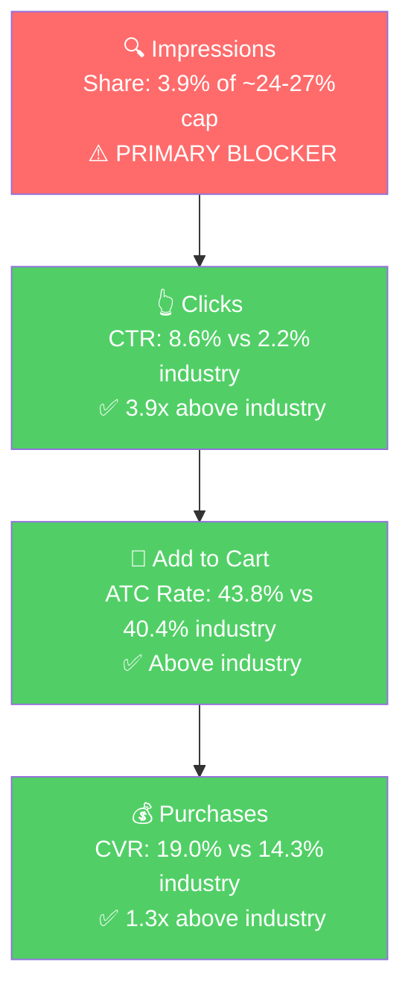

# Seller Central Audit - Abokichi Inc. (Canada)

A Toronto-based premium Japanese condiment brand selling **OKAZU Chili Miso Oil** on Amazon.ca since 2018. Trailing-12-month CA revenue is **~$472K** (vs ~$15K on US). Ads launched in **Feb 2026** after no historical spend and are already profitable at 3.76 account ROAS on $6.1K of 90-day spend. The brand is well-positioned on Amazon CA — strong listing infrastructure, high CTR (3-5x industry on Tier 1), healthy CVR, profitable across every enabled campaign — and the growth path is about **allocation, scale, and discovery**, not relaunch. The single biggest unspent opportunity is the 14 Tier 1 brand-fit keywords (chili miso, spicy miso, miso chili oil) which return 12-300x ROAS on trivial spend in current data. Two near-term risks need triage: a likely Apr 2026 stockout on the Mild Single (P1) and a deteriorating buy box on the Spicy 2-pack.

> **Note on SQP data source:** The SQP analysis in Section 4 below uses US Brand Analytics data because the SQP Analyzer MCP returns US data only (CA SQP exists in the underlying database but isn't exposed through the MCP). The keyword universe and conversion patterns transfer cleanly to CA. Direct CA SQP queries we ran confirm the brand has a stronger relative impression share in CA than in US, so the scaling math here is conservative.

---

## Section 1: Catalog Assessment

| Priority | Product (Child ASIN) | 3-Mo Sales | 3-Mo Ad Spend | ROAS | TACoS | Organic Sales | Ad Sales % | Buy Box % | CVR | Trend |
|----------|----------------------|------------|---------------|------|-------|---------------|-----------|-----------|-----|-------|
| P0 | OKAZU Spicy Chili Miso Single (B07JGJXTK8) | $66,123 | $8,558 | 3.22 | 12.9% | $38,597 | 41.6% | 94% (avg) | 19.1% | Stable |
| P1 | OKAZU Mild Chili Miso Single (B07JWCDC4D) | $12,554 | $1,884 | 4.38 | 15.0% | $4,300 | 65.7% | 84% (avg) | 10% | Collapsed in Apr |
| P2 | OKAZU Variety Pack 3x230mL (B07MCYB2VV) | $16,693 | $104 | 32.4 | 0.6% | $13,323 | 20.2% | 92% (avg) | 7.1% | Growing |
| P3 | OKAZU Curry Miso Single (B07JGJXYHP) | $6,929 | $264 | 3.43 | 3.8% | $6,025 | 13.0% | 78% (avg) | 9.8% | Stable |

3-month window: Feb 1 – Apr 30, 2026. All metrics at child-ASIN level because the CA catalog is consolidated under one master parent (B07L53JJVR) and parent-level rollups under-report ad attribution.

**Other active SKUs (flagged but not prioritized):**

- **B088YKQV2K (Spicy 2-pack):** $8,493 / 3-mo, zero ad spend. Buy box has collapsed from 99.5% (Feb) → 51.3% (Apr). Critical: likely MAP/3P-seller issue on what should be a private-label listing.
- **B088YNXZ4B (Mild 2-pack):** $5,297 / 3-mo. 24% CVR. No ad spend. Untapped multipack opportunity.
- **B0CTKKJWFF (Sansho variant):** $172 / 3-mo, re-launched March 2026. Lacks A+ content, Brand Store linkage, and full image set.
- **B088YGT46M (Curry 2-pack):** Dead listing.
- **B0F4BXF5FM (ABO Matcha):** New SKU, separate product line, zero sales.

---

## Section 2: Qualitative Product Understanding (P0 - Spicy Chili Miso Single)

**Product:**
- One-liner: A Japanese-style spicy chili miso finishing oil with garlic, fermented miso, sesame, 230 mL glass jar, $19.99 CAD.
- Features: vegan, gluten-free, non-GMO, preservative-free. Umami-forward (miso-based), not Sichuan-style numbing chili crisp.
- Value prop: A Japanese alternative to the broader chili-crisp category. Clean-label umami finisher, not raw heat.
- Purchase motivation: Home cooks who want a specifically Japanese flavor finisher; clean-label premium-condiment buyers.

**Customer:**
- Foodies / home cooks 25-45, urban-Canada lean. Strong overlap with Japanese-cooking, ramen-culture, premium-condiment buyer.
- Drivers: "authentic Japanese" + "made in Canada" + clean ingredients + versatility.

**Brand:**
- Toronto-based, husband-and-wife founded. Listed on Amazon CA since Oct 2018 (8+ years).
- Registered brand, Brand Store built, A+ Premium content deployed.
- Stronger CA-domestic equity than US (branded query volume ~2-3x higher in CA per direct Metabase queries).
- Indie-premium, founder-led, Japanese-Canadian vibe.

**Competitive Landscape (CA-specific):**

P0 retail $19.99 CAD / 230 mL = $0.087/mL = mid-premium for the CA category. Smaller shelf than US, with Abokichi as a near-default on Japanese-miso-specific queries.

| Competitor | Style | Notes |
|------------|-------|-------|
| **Abokichi OKAZU Spicy (P0)** | Japanese miso-based | Made in Canada, clean label |
| S&B La-Yu | Japanese classic chili oil | Imported, narrower use case |
| Lao Gan Ma | Chinese mass market | Dominant on broad "chili oil" intent |
| Fly By Jing | Premium Sichuan chili crisp | Limited CA distribution |
| Mr Bing, Momofuku | American-Asian fusion | Limited CA presence |

**Differentiators:** Only mainstream Japanese miso-based chili oil. Vegan + GF + non-GMO clean label. Made-in-Canada angle is a unique edge that doesn't exist in US.

**Listing Quality (P0 + P1 + P3 singles, the hero line):**

**Strengths:**
- A+ Premium content deployed on every chili miso oil listing.
- Brand Store built and linked.
- Video on each of the three singles (Spicy, Mild, Curry).
- 9 images per listing, 5 bullet points.
- 4.5-star current rating, 8-year tenure.

**Opportunities:**
- **Multipack listings (B088YKQV2K Spicy 2-pack, B088YNXZ4B Mild 2-pack) and the Variety Pack (B07MCYB2VV) have no video.** Re-using the existing single-pack video on the multipack listings is the fastest CVR fix.
- **Title length 197-200 chars on all singles** — keyword-stuffed, hurts mobile readability. Rebuild leading with top 3 keywords.
- **Sansho variant (B0CTKKJWFF)** is under-built — no A+, no brand store, ~3 images. Either build out the listing or de-prioritize.

---

## Section 3: Quantitative Product Understanding (P0)

### Annual Trend (Account Level)

| Period | Total Sales | Sessions | Units | CVR | Buy Box % | Notes |
|--------|------------|----------|-------|-----|-----------|-------|
| Dec 2024 | $41,930 | 12,985 | 1,818 | 14.0% | 84.7% | Holiday peak Y1 |
| Apr–Sep 2025 | $22K–34K/mo | – | – | 12-17% | 93-99% | Stable base |
| Oct 2025 | $44,123 | 10,263 | 2,125 | 20.7% | 77.6% | Step-up; BB dip |
| Nov 2025 | $58,292 | 15,366 | 3,016 | 19.6% | 75.6% | **All-time peak** |
| Dec 2025 | $53,116 | 14,875 | 2,627 | 17.7% | 86.6% | |
| Jan 2026 | $52,606 | 16,004 | 2,760 | 17.3% | 86.2% | |
| Feb 2026 | $37,893 | 12,899 | 1,821 | 14.1% | 94.8% | **Ads launch** |
| Mar 2026 | $44,233 | 13,756 | 2,077 | 15.1% | 81.5% | Ads scaled |
| Apr 2026 | $34,136 | 8,679 | 1,529 | 17.6% | 76.9% | P1 collapse |
| May 2026 (partial) | $17,627 | 4,322 | 802 | 18.6% | 86.2% | 2 weeks |

Trailing-12-month: ~$472K. Peak season is **Oct-Jan** (broader and earlier than US, which peaks Dec-Jan). November 2025 hit the all-time monthly peak even though ads weren't launched yet, suggesting CA has demand-side seasonality the brand is already capturing through organic.

**Rating Trajectory:** 4.5 stars current. Keepa CA doesn't surface review counts so velocity needs PDP verification.

**Sales Rank Trajectory:** P0 sales rank in CA fluctuated between ~600 and ~1,200 in March-April 2026, with a recent spike toward ~2,000 in mid-May. Consistent with the May partial-month softening.

---

## Section 4: Market Opportunity (SQP)

**Source disclaimer:** US SQP data via the SQP Analyzer MCP. CA-specific data exists in the underlying table but isn't exposed through the MCP. Direct Metabase queries confirm the keyword universe is the same in CA but volumes are smaller (Tier 2 ~1/10 US, Tier 1 mixed) and Abokichi's relative impression share is meaningfully higher in CA.

### Tier Breakdown

- **Tier 1 (14 queries) - Japanese miso/chili oil specific:** japanese chili oil, japanese chili crisp, chilli oil japanese, chili miso, miso chili oil, miso chili crisp, miso oil, rayu japanese chili oil, spicy miso, spicy miso paste, spicy miso sauce, garlic miso, gluten free miso, tekka miso condiment.
  - *Where P0 is literally the answer. Brand CTR 3-5x industry, CVR above industry.*
- **Tier 2 (7 queries) - Broader category:** chili crisp, chili oil, chili crisp oil, spicy chili crisp, szechuan chili oil, miso paste, miso.
  - *The much larger category market. Abokichi shows up but converts at <half of industry CVR.*
- **Tier 3 (4 queries) - Adjacent generic:** japanese pantry staples, japanese cooking oil, momofuku, ramen.
- **Branded (6 queries):** okazu chili miso, okazu, okazu spicy chili miso, okazu japanese chili oil, okazu chili oil, abokichi.
  - *~2-3x higher volume in CA than US per direct Metabase check.*

### Market Sizing (US data, with CA scaling note)

| Tier | US Search Volume | Brand Imp Share | Brand CTR | Brand CVR (vs ind.) | US Tier Market ($/mo) |
|------|------------------|-----------------|-----------|----------------------|------------------------|
| Tier 1 | 1,793 | 4.1% | 9.3% (3.1x ind.) | 13.4% vs 10.4% | ~$2,500 |
| Tier 2 | 294,111 | 0.7% | 3.1% (1.1x ind.) | 7.3% vs 16.0% | ~$462K |
| Tier 3 | ~330K | <0.1% | <1% | <5% | ~$50K |

CA Tier 2/3 is ~1/10 of US. Tier 1 mixed (some queries bigger in CA, others smaller). CA branded queries ~2-3x US scale.

### Blockers and Growth Path

| Tier | Imp Share | CTR (Brand vs Ind.) | CVR (Brand vs Ind.) | Primary Blocker | Growth Path |
|------|-----------|---------------------|---------------------|-----------------|-------------|
| **Tier 1** | 3.9% (cap ~24-27%) | **8.6% vs 2.2%** (3.9x) | **19.0% vs 14.3%** (1.3x) | **Impression Share** | Bid aggressively on the 14 Tier 1 keywords. Funnel below clicks is healthy. |
| Tier 2 | 0.5% | 2.9% vs 2.3% (~1x) | **11.6% vs 21.0%** (½) | **CVR / Intent Mismatch** | Don't scale. Keep negatives on broad chili-crisp/chili-oil. |
| Tier 3 | <0.1% | <1% | <5% | Low fit | Skip for PPC. |

### ICAP Funnel Visual (Tier 1)

The funnel is healthy from click through purchase. Top of funnel is the only bottleneck.

---

## Section 5: Ad Analysis

90-day window: Feb 20 – May 19, 2026. CA ad spend $6.1K total, account ROAS 3.76. Every enabled campaign is profitable. Frame: **scale and allocation**, not relaunch.

### Account Level

**Campaign Structure**

4 enabled Manual campaigns. No overstuffing. Clean structure.

| Campaign | Product | Spend | Sales | ROAS | Orders |
|----------|---------|-------|-------|------|--------|
| Spicy Chili Miso - Manual | P0 Spicy Single | $4,783 | $15,827 | 3.31 | 771 |
| Chili Miso - Manual Jun2025 | P1 Mild + Mild 2-pack | $1,073 | $4,677 | 4.36 | 197 |
| [CurryMiso] CA-KW-Jun022025 | P3 Curry | $223 | $710 | 3.19 | 31 |
| Campaign with presets - B07MCYB2VV | P2 Variety Pack | $55 | $1,860 | **34.12** | 47 |
| **Total** |  | **$6,133** | **$23,074** | **3.76** | **1,046** |

**Auto vs Manual Split**

| Targeting Type | Clicks | Spend | Sales | ROAS | CVR |
|----------------|--------|-------|-------|------|-----|
| Automatic | – | – | – | – | – |
| Manual | 7,067 | $6,133 | $23,074 | 3.76 | 14.80% |

> **Finding: 100% Manual, 0% Auto means no continuous keyword discovery.**
>
> **Problem:** No Auto campaign running. The hero P0 campaign converts at 25-46% CVR on the 5 Tier 1 keywords that are in it, suggesting more long-tail Tier 1 variants exist that Amazon would surface through Auto.
>
> **Solution:** Launch a single Auto campaign at $10-15/day on the chili miso oil hero line with a tight negative list (lao gan ma, lee kum kee, umami, japanese curry). 30-day learning window, then harvest converting search terms into Manual Exact.
>
> **Impact:** ~$900/mo of incremental sales at 3.0 ROAS, plus a perpetual harvest pipeline for compounding gains over 6-12 months.

**Campaign Profitability**

All 4 campaigns above 1.5x ROAS. No cleanup needed.

**Targeting Strategy**

**Keyword vs Product Targeting:**

| Targeting Strategy | Clicks | Spend | Sales | ROAS | CVR |
|--------------------|--------|-------|-------|------|-----|
| Keyword Targeting | 7,178 | $6,275 | $23,230 | 3.70 | 14.68% |
| Product Targeting | 10 | $5.93 | $77.96 | **13.15** | **30.00%** |

> **Finding: Product Targeting is essentially zero ($6 in 90 days) despite 13x ROAS in the micro-sample.**
>
> **Solution:** Build a Sponsored Products Product Targeting campaign with three target groups: (1) own ASINs for defense, (2) Japanese pantry adjacencies, (3) competitor chili crisp / chili oil ASINs where Abokichi's Japanese-miso angle is the differentiator. Cap $10-15/day.
>
> **Impact:** At 3-5x ROAS, $300-450/mo of Product Targeting spend produces $1,000-2,250/mo in incremental sales plus defensive value.

**Match Type Breakdown:**

| Match Type | Clicks | Spend | Sales | ROAS | CVR |
|------------|--------|-------|-------|------|-----|
| EXACT | 1,863 | $1,715 | $6,606 | **3.85** | **17.18%** |
| PHRASE | 1,624 | $1,505 | $5,197 | 3.45 | 15.02% |
| BROAD | 3,616 | $2,991 | $11,309 | 3.78 | 13.38% |

All 3 match types profitable. Exact has the best ROAS and CVR. Pattern is healthy; ongoing harvest from Broad/Phrase to Exact is the natural next step (and would feed the proposed Tier 1 Exact campaign).

**Placement Distribution**

| Placement | Spend | Sales | ROAS | CTR | CVR |
|-----------|-------|-------|------|-----|-----|
| Top of Search | $4,693 | $11,987 | 2.55 | 7.07% | 11.87% |
| Rest of Search | $526 | $1,574 | 2.99 | 0.52% | 6.97% |
| Product Pages | $1,059 | $1,303 | **1.23** | 0.33% | 3.82% |
| Off Amazon | $0.71 | $0 | 0 | 0.20% | 0% |

> **Finding: Product Pages eats 17% of spend at 1.23 ROAS (below the 1.5 profitability floor).**
>
> **Solution:** Reduce Product Pages bid modifier toward 0% across P0 campaigns. Increase Top of Search bid modifier to +50-100% to win premium impressions.
>
> **Impact:** Shifting ~$700/mo from Product Pages to Top of Search at the same total budget produces roughly $900/mo of incremental sales.

### Product Level (P0)

**P0 Campaign Map**

P0 ad spend = ~$4,896 of $6,133 total (~80% of account spend, appropriate given P0 = 57% of total chili miso oil revenue). The 2 legacy 2023 campaigns ($113 combined spend) are sub-profitable and should be paused or restructured.

#### Impression Share Blocker: Tier 1 Keyword Funding

Section 4 identified Tier 1 impression share (3.9% vs ~24-27% cap) as the primary blocker. The PPC lever is direct bidding on the 14 Tier 1 keywords. Inside the existing P0 campaign, here's what the Tier 1 keywords are doing:

| Tier 1 Keyword | Match | Spend | Sales | ROAS | CVR |
|----------------|-------|-------|-------|------|-----|
| miso chili oil | EXACT | $0.78 | $151.43 | **194.14** | 41.18% |
| spicy miso | PHRASE | $0.51 | $113.94 | **223.41** | 100% |
| spicy chili miso | BROAD | $2.71 | $260.95 | **96.29** | 46.15% |
| chili miso | EXACT | $3.63 | $266.91 | **73.53** | 33.33% |
| spicy miso | EXACT | $2.86 | $73.99 | 25.87 | 44.44% |
| miso chili oil | PHRASE | $17.78 | $218.93 | 12.31 | 25.00% |
| crispy chili oil | EXACT | $10.71 | $76.96 | 7.19 | 30.77% |

Total Tier 1 spend in P0 campaign: **~$40 over 90 days**, producing **~$1,180 in sales (~29x blended ROAS)**.

> **Finding: The 14 Tier 1 brand-fit keywords get a combined ~$40 of spend over 90 days at 12-300x ROAS while the broader chili-crisp/chili-oil category targets eat $3,000+.**
>
> **Solution:** Create a dedicated Manual Exact Match campaign for all 14 Tier 1 keywords. Suggested bid +30-50%, Top of Search modifier +100%, daily budget $25-40/day.
>
> **Impact:** Even at a conservative blended 10x ROAS (vs the current 12-300x small-sample), $800/mo of dedicated Tier 1 spend produces ~$8,000/mo in incremental sales while driving organic ranking and review velocity on Tier 1.

#### Spend Allocation: "miso" BROAD is marginal

Top 5 spenders in P0 campaign:

| Keyword | Match | Spend | Sales | ROAS | CVR |
|---------|-------|-------|-------|------|-----|
| chili crisp | BROAD | $924 | $2,470 | 2.67 | 13.89% |
| chili | PHRASE | $824 | $2,768 | 3.36 | 15.91% |
| chili oil | EXACT | $550 | $2,292 | 4.17 | 20.28% |
| chilli oil | EXACT | $456 | $1,694 | 3.71 | 16.20% |
| **miso** | **BROAD** | **$440** | **$666** | **1.51** | 11.58% |

> **Finding: "miso" BROAD spends $440 at 1.51 ROAS — at the unprofitability threshold.**
>
> **Solution:** Move "miso" BROAD to PHRASE (already running at 3.70 ROAS). Negative-match "miso paste", "white miso", "red miso", "miso ramen broth".
>
> **Impact:** Recovers ~$147/mo of marginal spend, redirects to the Tier 1 dedicated campaign.

#### Negatives

Targets with meaningful P0 spend and zero conversion: umami ($13.32), chilli crunch oil ($11.88), lao gan ma ($7.06), lee kum kee ($1.30), chili garlic oil ($4.83), japanese spice ($1.94). Add to negative exact list on all campaigns.

#### Variety Pack Underfunding (P2)

> **Finding: Variety Pack campaign earns $34 for every $1 of PPC spend, funded at $0.61/day.**
>
> **Solution:** Scale to $10-15/day with the existing campaign structure, or add a dedicated keyword campaign on gift/variety/sampler-intent terms.
>
> **Impact:** Conservatively at half current ROAS ($300/mo at 15x), $4,500/mo of incremental sales. Pairs with the Step 2 listing fix (add video) for compounding CVR upside.

---

## Section 6: Action Plan

The primary blocker is Tier 1 impression share. The brand wins clicks (3-5x industry CTR) and converts above industry on Tier 1, it just doesn't show up enough. Every Phase 1 action targets that blocker directly.

### Weeks 1-2: Immediate Actions (Triage + Tier 1 Foundation)

The primary blocker is impression share; the immediate priorities are restoring P1 + Spicy 2-pack fundamentals and standing up the Tier 1 campaign.

1. **Resolve P1 (Mild Single, B07JWCDC4D) April collapse.** Sales fell from $8.3K to $193 with sessions dropping from 3,220 to 148 — strongly suggests a stockout. Confirm inventory status, place restock order, and verify listing is not under suspension. (Section 1, 2i)
2. **Diagnose Spicy 2-pack (B088YKQV2K) buy box collapse.** Buy box dropped from 99.5% (Feb) → 51.3% (Apr) on what should be a private-label listing. Check for 3P sellers and recent price changes; issue MAP enforcement if applicable. (Section 1)
3. **Launch dedicated Manual Exact Match Tier 1 campaign** on the 14 Japanese miso/chili oil keywords identified in Section 4. $25-40/day, +30-50% bid premium, +100% Top of Search modifier. (Section 5)
4. **Launch single Auto campaign** for the chili miso oil hero line at $10-15/day with tight negatives (lao gan ma, lee kum kee, umami, japanese curry). 30-day learning window. (Section 5)
5. **Reduce Product Pages bid modifier toward 0%** on all P0 campaigns; increase Top of Search modifier to +50-100%. (Section 5)
6. **Move "miso" BROAD to PHRASE only** in P0 campaign; negative-match miso paste / white miso / red miso / miso ramen broth. (Section 5)
7. **Pause or restructure the 2 legacy 2023 CA campaigns** (20230424-AUTO, 20230901-Manual-Keyword) running at sub-2 ROAS. (Section 5)

### Weeks 2-4: Short-Term Optimizations

Scale what's working, prep listing improvements.

1. **Launch Product Targeting campaign** at $10-15/day across (a) own ASINs for defense, (b) Japanese pantry adjacencies, (c) competitor chili crisp / chili oil ASINs. (Section 5)
2. **Scale Variety Pack campaign** to $10-15/day. Add a dedicated keyword campaign with gift/variety/sampler-intent terms. (Section 5)
3. **Harvest converting search terms from the new Auto campaign** into the Tier 1 Exact campaign. Migrate any Broad/Phrase winners with >5 orders. (Section 5)
4. **Re-use existing video on the multipack listings (B088YKQV2K, B088YNXZ4B) and Variety Pack (B07MCYB2VV).** No new production needed; same asset used on the singles. (Section 2)
5. **Begin title rewrite** for P0/P1/P3 singles to lead with top-3 keywords, improving mobile readability. Do not publish yet; prepare assets. (Section 2)
6. **Launch a 2-3% branded defense campaign** on the 6 branded queries (okazu, abokichi, okazu chili miso). CA branded volume is 2-3x US scale. (Section 4)

### Weeks 4-6: Medium-Term Growth

Listing improvements go live; ad scaling continues.

1. **Publish rewritten titles** on the 3 singles. Monitor CTR delta for 2 weeks.
2. **Decide on Sansho variant (B0CTKKJWFF):** either invest in full A+ / Brand Store / image build-out to match the rest of the line, or de-prioritize and harvest the SKU. (Section 2)
3. **Scale the Tier 1 Manual Exact campaign** toward the impression share cap (~24-27%). Use Amazon's "out-of-budget" indicator to size daily budget. (Section 4, 5)
4. **Evaluate Top of Search bid modifier impact** at 4 weeks of post-change data. If blended ROAS held at 2.5+, push modifier higher.
5. **Set up Vine / structured review-request flow** to feed review velocity on P0 and the Variety Pack. (Section 2)

### Weeks 6-8: Scaling and Q4 Prep

Compound the gains and prepare for CA peak season.

1. **Review impression share gain on Tier 1** vs the 24-27% cap. If still below 15%, increase Tier 1 budget further.
2. **Begin Q4 2026 inventory planning.** CA's Nov 2025 all-time peak ($58K) hit while buy box was at 75.6% — there was inventory friction. Build Q4 2026 buffer for Spicy Single and Mild Single specifically.
3. **Begin assessing P1 (Mild Single) for a dedicated scaling push** once inventory is confirmed restored.
4. **Evaluate the Product Targeting campaign** for offensive scaling against competitor ASINs that have proven defensible to Abokichi's Japanese-miso angle.

---

## Section 7: Insights & Questions for the Seller

**Insights:**
- **P0 (Spicy Chili Miso Single) wins Tier 1 conversion when it shows up.** Brand CTR is 3-5x industry, CVR is 1.3x industry on Tier 1. The blocker is purely impression share (3.9% vs a 24-27% cap).
- **The 14 Tier 1 brand-fit keywords are massively under-funded.** Combined ~$40 of spend over 90 days returning ~$1,180 in sales (12-300x ROAS per keyword). A dedicated $800/mo Tier 1 Exact campaign is the single highest-conviction lever in the audit.
- **CA ad account is well-managed and profitable.** All 4 enabled campaigns above 1.5x ROAS. Account ROAS 3.76. The work is allocation, not cleanup. Unusual for a recently-launched CA seller.
- **Top of Search is the workhorse placement (7% CTR, 12% CVR);** Product Pages is the only sub-1.5 ROAS placement at $1,059 spent for 1.23 ROAS. Easy reallocation.
- **Variety Pack (P2) does $34 ROAS on $0.61/day spend.** Direct testable scale opportunity with both PPC and a listing-video fix on top.
- **No Auto campaign means no continuous keyword discovery.** Given how well the 5 Tier 1 keywords already in Manual convert (25-46% CVR), Amazon would likely surface more long-tail variants worth scaling.
- **CA is 30x larger than US** ($472K TTM vs $15K). The CA storefront has stable peak Oct-Jan (Nov 2025 all-time peak of $58K) and a steady $22-44K spring/summer base.
- **Multipack and Variety Pack listings lack video.** Same gap as US listings. The fix is re-using the existing single-pack videos — zero production cost, direct CVR lift.

**Questions for the Seller:**
1. **"P1 (Mild Single, B07JWCDC4D) lost 95% of sessions in April alongside the buy box drop. Was this a stockout?"** The signature (sessions evaporating to 148 from 3,220, not just buy box dropping) is far more consistent with an inventory event than a MAP/price event. This is the most important question because it dictates whether P1 is a recovery play or a structural issue.
2. **"The Spicy 2-pack (B088YKQV2K) has been losing buy box steadily (99% → 51% over Feb-Apr) on what should be a private-label listing. Are 3P sellers latching on, or has there been a price change that triggered MAP suppression?"**
3. **"Tier 1 brand-fit keywords (chili miso, spicy miso, miso chili oil) are converting at 25-46% CVR and 12-300x ROAS in your existing P0 campaign but each one is getting under $20 of spend over 90 days. Is there a deliberate reason these aren't scaled, or has the keyword harvest just not been a priority?"**
4. **"Product Targeting (defensive on your own ASINs and offensive on competitor chili crisp / chili oil listings) has effectively zero CA spend. Has this been tested before and rejected, or just untouched?"**
5. **"Ads launched in CA in Feb 2026 after no spend at all in 2025. What was the trigger — new agency, internal capability, freed-up cash? We want to understand the budget envelope going forward."**
6. **"Was the November 2025 peak ($58K all-time) constrained by inventory or buy box (which dipped to 75.6% that month)? Important for sizing the Q4 2026 plan."**
7. **"The Sansho Pepper variant (B0CTKKJWFF) was re-launched in March 2026 with a stripped-down listing (no A+, no brand store, ~3 images). Is the plan to invest in this SKU to match the rest of the chili miso line, or treat it as a low-volume test?"**
8. **"ABO Matcha (B0F4BXF5FM) is listed but has zero sales and is in a different category from the chili miso oil line. Is this a planned product extension, a test listing, or a placeholder?"**
9. **"What's the unit COGS / contribution margin on the Spicy single at $19.99 retail? We want to confirm the break-even ROAS floor so we can set bid targets correctly."**
10. **"Are the two legacy 2023 CA campaigns (20230424-AUTO, 20230901-Manual-Keyword) still active by intent or by oversight? Both are at sub-2 ROAS and trickling spend."**
