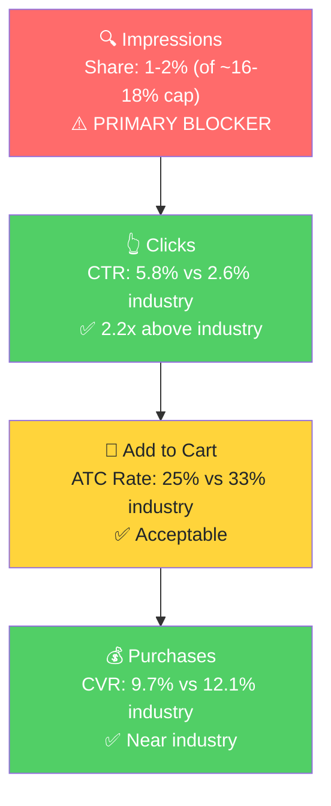

# SQP Analysis - Abokichi (P0)

## P0: OKAZU Mild Chili Miso Oil 230mL (B07JWCDC4D, under parent B0F57PYS5L)

Note: P0's parent also contains a Curry Miso Oil child (B07JGJXYHP). The Curry's keyword universe (japanese curry, japanese curry cube, gluten free japanese curry) is distinct and is treated separately at the end of this document. The tier structure below focuses on the Mild Chili Miso Oil.

## Tier Breakdown

**Tier 1 (Hero - Japanese miso chili oil specific):**
- **Keywords:** japanese chili oil, rayu japanese chili oil, japanese chili crisp, chilli oil japanese, miso chili oil, miso chili crisp, chili miso, miso oil, spicy miso, spicy miso paste, spicy miso sauce, garlic miso, gluten free miso, tekka miso condiment
- **Rationale:** Where the P0 product is literally the answer. The customer searching here wants a Japanese chili-miso-style finishing oil. Brand's listing and visuals match what these searchers expect.

**Tier 2 (Core - broader chili oil / chili crisp / miso category):**
- **Keywords:** chili crisp, chili oil, chili crisp oil, spicy chili crisp, szechuan chili oil, miso paste, miso
- **Rationale:** Where the broader Asian condiment finisher market lives. Searchers here are looking for *any* chili crisp/oil or miso paste, often defaulting to Sichuan-style (chili crisp) or culinary miso (paste). Abokichi's miso-oil-style product is in the category but doesn't match the dominant visual expectation, which depresses CTR.

**Tier 3 (Adjacent - generic / competitor):**
- **Keywords:** japanese pantry staples, japanese cooking oil, momofuku, ramen
- **Rationale:** Buyer-intent queries that surface the brand intermittently. "momofuku" is a competitor brand query. "ramen" is too broad (312K vol/mo, mostly noodle shoppers, not topping shoppers). Not a meaningful growth tier.

**Branded (defense only, not a growth tier):**
- **Keywords:** okazu chili miso, okazu, okazu spicy chili miso, okazu japanese chili oil, okazu chili oil, abokichi
- **Rationale:** Customers who already know the brand. Convert at ~25-30% CVR with ~70-90% click and purchase share to the brand. Volume is small (~290-465 searches/mo) but high-intent. No growth opportunity here, only defense.

## Catalog Overlap (Step 3a Phase 5)

For Tier 1 (Japanese-specific chili miso queries): Abokichi has **at least 2 directly relevant products** (B07JWCDC4D Mild + B07JGJXTK8 Spicy single, both 230mL). The Spicy 2-pack (B088YKQV2K) sometimes ranks too. **Adjusted impression share cap: ~16-18% with 2 products, up to ~24-27% if all three rank.**

For Tier 2 (broad chili crisp/oil/miso): Same 2-3 products can rank. Cap is the same in theory (~16-27%), but as the analysis below shows, the bigger constraint is whether the listing matches search intent, not the impression cap.

## Market Sizing

| Tier | Monthly Search Volume (Mar 2026) | Monthly Cart Adds (Total Market) | Monthly Purchases (Total Market) | Est. Market Size ($/mo) |
|------|----------------------------------|----------------------------------|----------------------------------|--------------------------|
| Tier 1 | ~1.6K (14 queries) | 308 | 111 | ~$2,100 |
| Tier 2 | ~270K (7 queries) | 67,379 | 29,565 | ~$440,000 |
| Tier 3 | ~330K (4 queries, mostly "ramen") | ~10K | ~3K | ~$50,000 |
| **Total P0-relevant** | ~600K | ~78K | ~33K | ~$490,000 |

*Tier 1 sized at $19/unit (Abokichi's typical price). Tier 2 sized at $15/unit (mix of chili crisp ~$15-20 and miso paste ~$6-10). Tier 3 priced loosely at $15/unit.*

**Reading the numbers:**
- Tier 1 is a small but high-fit market: ~$2.1K/mo total category value. If Abokichi captured the impression-share ceiling here (16-18%), realistic monthly capture is ~$300-400.
- Tier 2 is the giant ($440K/mo) but Abokichi has structural intent-mismatch on these queries. Even a 1% share = ~$4.4K/mo, but achieving that requires CTR/CVR improvements that may exceed what's possible with the current Japanese-miso visual identity.

## Blockers and Growth Path

**Aggregated trailing 3-month performance (Feb-Apr 2026):**

| Tier | Impression Share (avg) | Adjusted Cap | Brand CTR | Industry CTR | Brand CVR | Industry CVR | Primary Blocker |
|------|------------------------|---------------|-----------|---------------|-----------|---------------|-----------------|
| **Tier 1** | ~1.5% (recent), 4.7% (12-mo peak) | 16-18% | 5.8% (avg Mar-Apr) | 2.6% (avg) | 9.7% (avg Mar-Apr) | 12.1% (avg) | **Impression Share** |
| **Tier 2** | 0.04% | 16-18% | 0.7% | 2.3% | 0% (recent) | 17-22% | **CTR** (intent mismatch) |
| **Tier 3** | <0.1% | — | <0.5% | 2-3% | 0% | — | Skip - low fit |

**Tier 1 (Hero) - Detailed:**
- Brand CTR is **2-2.5x above industry** consistently (5-7% brand vs 2-3% industry).
- Brand cart-to-purchase rate (35-50%) is on par with or above industry.
- Brand purchase share (1-8% trailing 12 months) tracks impression share, confirming that **the brand wins when it shows up**. The blocker is being shown.
- Impression share has crashed from 5.6% peak (Dec 2025) to 1.1% (Apr 2026), tracking the buy box and listing-health issues identified in Step 1.

**Growth Path for Tier 1:** Impression share is the bottleneck. With buy box restored on the P0 listing, the next lever is bidding aggressively on the 14 Tier 1 keywords. Even capturing the 8-9% per-product cap on 2 products (16-18% combined) on a $2.1K/mo Tier 1 market is only ~$350/mo of incremental sales, BUT this is also the highest-intent traffic that will produce the strongest review velocity and BSR momentum.

**Tier 2 (Core) - Detailed:**
- Brand CTR is 1/3 to 1/4 of industry (0.7% brand vs 2.3-3% industry).
- Brand barely converts (0 brand purchases on Tier 2 queries in Feb and Apr 2026).
- The product visually doesn't match what "chili crisp" or "miso paste" searchers expect. "Chili crisp" buyers expect the iconic Sichuan red oil; "miso paste" buyers expect a tub of paste for cooking, not a finishing oil.
- Cap matters less here than search-intent fit.

**Growth Path for Tier 2:** Limited. Don't bid heavily here. The exception is "miso chili oil" and "miso chili crisp" specifically - lower volume but better fit - which are already in Tier 1.

**Tier 3 (Adjacent):** Skip for PPC. Generic "ramen" is too broad to convert at acceptable cost. "Momofuku" is a competitor query - small defensive spend at most.

## ICAP Funnel Visual (Tier 1 - highest growth potential)

The brand wins decisively when shown. Doubling or tripling impression share on Tier 1 directly translates to revenue.

## Seasonality Test (CLAUDE.md requirement)

Per the seasonality detection guidance, search volume is the authoritative test. Volume trends on the two pivot keywords across 16 months:

| Keyword | Apr 2025 | Jul 2025 | Oct 2025 | Jan 2026 | Apr 2026 |
|---------|----------|----------|----------|----------|----------|
| japanese chili oil | 309 | 350 | 298 | 585 | 290 |
| chili crisp | 36,345 | 49,404 | 51,435 | 100,408 | 72,820 |

- "japanese chili oil" has **mild winter seasonality** (Jan peak ~2x trough). Not dramatic.
- "chili crisp" has **modest winter seasonality** (Jan peak ~3x April trough).

**This DOES NOT explain Abokichi's revenue collapse from May-October 2025.** Total category search volume was 40K-55K/mo on chili crisp during that window, well within the brand's reachable range. The brand's revenue went to $0 not because demand disappeared but because the brand was not winning the impression share auction (or was out of stock, or had a listing suppression - to be confirmed with seller). **The 5-month gap is a supply/listing-side issue, not seasonality.**

## Branded Defense Status

Branded queries (okazu, abokichi, etc.) total 290-465 vol/mo with the brand already capturing 65-90% of clicks and purchases. **Brand defense is in good shape**, even without dedicated branded campaign spend (no current ad spend on branded terms). Risk is low because volume is small and competitors haven't moved in. **Recommendation: launch a small (2-3% of budget) branded defense campaign as a precaution** once paid ads ramp on Tier 1. Do not scale branded spend further.

## Insights and Open Questions (Step 3)

**Insights:**
- The Japanese-specific chili miso oil tier is a **defensible niche** for Abokichi. Brand outperforms industry CTR by 2-2.5x. The path to growth is impression share, which currently sits at 1-5% against a 16-18% cap.
- The broader chili crisp/oil category is structurally not winnable for this product without listing repositioning. Don't burn budget on "chili crisp" or "chili oil" as standalone targets.
- Seasonality is mild (~2-3x winter peak) and **does not explain the seller's revenue swings**. The brand's 5-month dead zone in 2025 was a self-inflicted gap, likely stockout or listing suspension.

**Questions for the Seller:**
- "Tier 1 impression share crashed from 5.6% (Dec 2025) to 1.1% (Apr 2026), tracking your buy box drop on the Mild listing. We have a clear hypothesis (buy box recovery + Tier 1 PPC spend reopens the funnel), but: is there a current ad budget cap on these listings? We'd want to know what spend ceiling to plan against."

## Curry Sister Product (B07JGJXYHP) - Separate Analysis

The P0 parent includes a Curry Miso Oil child with its own distinct keyword universe (Japanese curry queries). This is noted for completeness; the Curry product has not been deep-dived because it is not the hero ASIN.

| Keyword | Mar 2026 Vol | Brand CTR | Industry CTR | Brand CVR |
|---------|--------------|-----------|---------------|-----------|
| japanese curry | 18,271 | 0.83% | 2.68% | 0% |
| japanese curry cube | 2,769 | 2.33% | 2.81% | 0% |
| gluten free japanese curry | 514 | 1.08% | 2.68% | 0% |
| japanese curry mild | 473 | 1.06% | 4.65% | 0% |
| curry oil | 140 | 1.68% | 2.71% | 0% |

The Curry product gets meaningful impressions on broad "japanese curry" (1,557 brand impressions in Mar 2026) but **converts at 0%**. Reason: "Japanese curry" shoppers want roux cubes or pre-made curry sauce/paste, not a chili-miso curry-flavored oil. The Curry SKU has a more severe intent mismatch problem than the Mild. A separate audit should consider whether this product is viable as a standalone listing or whether it should be repositioned. Not the focus of the P0 plan.
