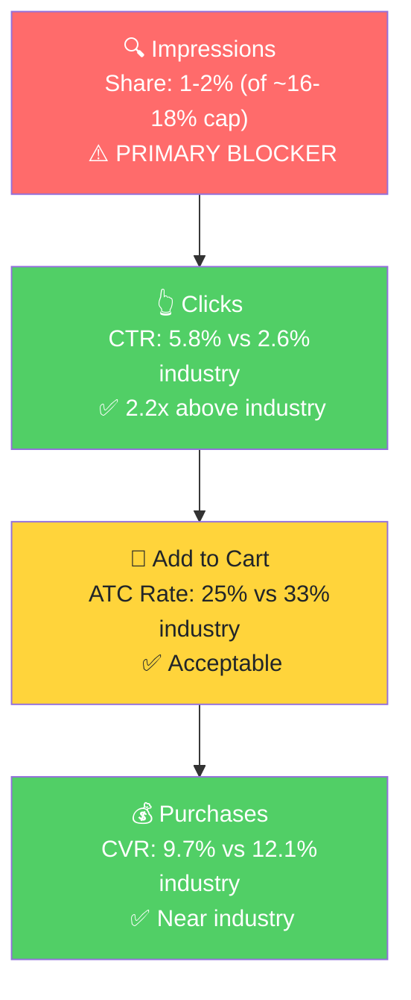

# Seller Central Audit - Abokichi Inc.

A Toronto-based premium Japanese condiment brand selling **OKAZU Chili Miso Oil** on Amazon US since 2017. Currently doing ~$15K trailing-12-month revenue across 5 parent ASINs, with peaks in Dec-Jan months ($3.5-4.5K/mo) and significant inventory/listing-driven gaps mid-year. PPC effort is functionally nonexistent ($147 YTD 2026). The brand has a defensible Japanese-specific niche, healthy 4.4-4.6 star ratings, and a fully built-out listing infrastructure (A+ Premium, Brand Store), but is leaving most of its growth potential on the table due to (a) buy-box volatility, (b) zero meaningful ad spend, and (c) review velocity stagnation.

---

## Section 1: Catalog Assessment

| Priority | Product | 3-Mo Sales | 3-Mo Ad Spend | ROAS | TACoS | Organic Sales | Ad Sales % | Buy Box % | CVR | Trend |
|----------|---------|-----------|---------------|------|-------|---------------|-----------|-----------|-----|-------|
| P0 | OKAZU Mild Chili Miso Oil (B0F57PYS5L, w/ Curry child) | $468 | $7.75 | 0.0 | 1.7% | $468 | 0% | 49% (avg) | 11% | Declining |
| P1 | OKAZU Spicy/Original 230mL Single (B07JGJXTK8) | $390 | $19.25 | 1.01 | 4.9% | $370 | 5% | 92% (avg) | ~10% | Recovering |
| P2 | OKAZU Spicy 2-Pack (B088YKQV2K) | $597 | $0 | – | 0% | $597 | 0% | 98% | 23% | Stable |
| P3 | OKAZU Variety Pack 3x230mL (B07MCYB2VV) | $316 | $0 | – | 0% | $316 | 0% | 97% | 14% | Stable |

**Not prioritized:**
- **OKAZU Sansho Pepper Variant (B0CTKKJWFF):** Zero sales over the full 12 months. Listed Jan 2024, last price change Jul 2024. Effectively a dead listing experiment. Recommend ignoring or removing.

**P0 selection rationale:** B0F57PYS5L (Mild) carries ~$10K of the brand's ~$15K trailing 12-month revenue, has the most sessions, and is the only parent (besides P1 Spicy single) with any ad spend. The Spicy 2-pack (B088YKQV2K) has higher recent 3-mo sales but is a derivative of P1. P0 + P1 form the Mild and Spicy heroes; P2 is an extension of P1.

---

## Section 2: Qualitative Product Understanding (P0)

**Product:**
- One-line: OKAZU Mild Chili Miso Oil 230mL - a Japanese-style chili-miso finishing oil with garlic, sesame, and fermented miso, sold in a glass jar.
- Key features: vegan, gluten-free, non-GMO, preservative-free. Miso-based (not Sichuan peppercorn or fermented broad bean) - the umami driver is fermented miso.
- Value prop: a Japanese alternative to chili crisp. Umami-forward instead of numbing-spicy. Clean label. Premium positioning.
- Purchase motivation: home cooks who want a Japanese-specific flavor finisher for ramen, eggs, rice, stir-fry; cleaner-label condiment shoppers.

**Customer:**
- Foodies/home cooks aged 25-45, interested in Japanese cuisine and ramen culture. Skews urban, slightly female lean. Likely overlap with Fly By Jing, Momofuku, premium-miso buyers.
- Purchase driver: "authentic Japanese flavor" + clean ingredients. Reviewers cite versatility across eggs, rice, ramen, dumplings, dressings.

**Brand:**
- Registered brand on Amazon since 2017. Toronto-based, husband-and-wife founded. Brand name roughly translates to "avocado boy" in Japanese.
- Established: 8+ years on Amazon US. Brand Store built. A+ Premium content deployed.
- Notable signals: real DTC website, indie premium positioning. Not a mass-market or white-label brand.
- Brand vibe: founder-led Japanese-Canadian indie. Premium-but-approachable.

**Competitive Landscape:**

Price positioning: P0 at $19.49 / 230mL = $2.51 per fl oz. Mid-premium for the chili crisp / chili oil category.

| Competitor | Style | Price/fl oz | Amazon Reviews |
|------------|-------|-------------|-----------------|
| **Abokichi OKAZU Mild (P0)** | Japanese, miso-based | $2.51 | 348 (Mild) + 910 (Curry sibling) |
| S&B Layu | Japanese, classic chili oil | $3-5 | 1,437 |
| Fly By Jing Sichuan Chili Crisp | Chinese-Sichuan, premium | $2.50-2.83 | 10K+ |
| Momofuku Chili Crunch | Chinese-fusion, celebrity brand | $2.50-3.00 | hundreds |
| Lao Gan Ma | Chinese, mass market | $0.50-0.70 | (very high) |
| Mr Bing Chili Crisp | American-Asian fusion | similar tier | 2,442 (mild) |

**Differentiators:** Only mainstream Japanese miso-based chili oil in this niche on Amazon. Vegan + gluten-free + non-GMO is a clean differentiator. **Gaps:** Review count is modest vs. category leaders. Brand awareness is limited; the brand depends on the narrower "japanese chili oil" and "chili miso" keyword universe rather than the much larger "chili crisp" universe.

**Listing Quality:**

**Strengths:**
- Premium A+ Content (7 modules, 9 module images) on all primary listings.
- Brand Store built and linked.
- 5 full-length bullets (1,623 chars total).
- 9-10 images per listing.
- 4.4-4.6 star rating with 348-910 reviews on the two P0 children.

**Opportunities:**
- **No video on the primary Mild P0 listing (B07JWCDC4D)**, although the Curry sibling has one. Adding/repurposing the existing video to the Mild ASIN is the single-highest-leverage CVR fix.
- **A+ content has 437 words of standalone text** across 7 modules. Current best practice is image-first A+ with any text designed into the images themselves. Rebuild A+ to remove standalone text modules.
- **Title readability score 35/100** - heavily keyword-stuffed, hurts mobile scannability. Rebuild title with top-3 keywords first and clean reading order.
- **No active coupon** despite having had coupons historically. A standing 5-10% coupon is a known CTR/CVR boost on this price point.
- **Review velocity stalled** at 0.19 reviews per 180 days at 4.6 stars. Vine enrollment and a structured review-request flow would re-engage the social-proof flywheel.

---

## Section 3: Quantitative Product Understanding (P0)

### Annual Trend

Inflection points for the P0 parent (B0F57PYS5L) across the last 18 months:

| Metric | Dec 2024 (Peak 1) | Feb 2025 (Peak) | Jul-Oct 2025 (Dead Zone) | Jan 2026 (Peak 2) | Apr-May 2026 (Recent) |
|--------|---------|----------|---------------|----------|---------------|
| Total Sales | $2,159 | $2,355 | $0 | $1,823 | $195 / $136 |
| Sessions | 736 | 551 | 0 | 498 | 126 / 46 |
| Units | 114 | 126 | 0 | 96 | 10 / 7 |

Two consecutive winters each peaked at $2K/month for this single SKU; summer is much smaller. The Jul-Oct 2025 dead zone (4 months of $0) is the major anomaly. Per Step 3 SQP analysis, search volume on the brand's core keywords stayed steady during those months, so the gap was **supply/listing-side, not demand-side**. Likely a stockout or listing suspension.

**Rating Trajectory:** Stable but stalled at 4.6 stars (Mild) / 4.4 stars (Curry). Review velocity has flatlined; no new reviews in 90 days. Social proof is fine but not growing.

**Sales Rank Trajectory:** Declining over the trailing 90 days (~99.7% deterioration per Keepa). Coincides with the buy-box collapse in late March-April 2026. Per CLAUDE.md, sales rank alone is not a reliable seasonality indicator - the seller's revenue volatility is supply-driven, not demand-driven.

---

## Section 4: Market Opportunity (SQP)

### Tier Breakdown

- **Tier 1 (Hero - Japanese miso chili oil specific):**
  - **Keywords:** japanese chili oil, rayu japanese chili oil, japanese chili crisp, chilli oil japanese, miso chili oil, miso chili crisp, chili miso, miso oil, spicy miso, spicy miso paste, spicy miso sauce, garlic miso, gluten free miso, tekka miso condiment
  - **Rationale:** Where the P0 product is literally the answer. Listing and visuals match search intent. Brand outperforms industry CTR by 2-2.5x here.

- **Tier 2 (Core - broader category):**
  - **Keywords:** chili crisp, chili oil, chili crisp oil, spicy chili crisp, szechuan chili oil, miso paste, miso
  - **Rationale:** Where the much larger Asian condiment market lives. Searchers default to Sichuan-style chili crisp or culinary miso paste; Abokichi's miso-oil-style product is in the category but doesn't match the dominant visual expectation, which depresses CTR.

- **Tier 3 (Adjacent - generic):**
  - **Keywords:** japanese pantry staples, japanese cooking oil, momofuku, ramen
  - **Rationale:** Surfaces the brand intermittently but not high-fit. "ramen" is too broad; "momofuku" is a competitor query. Not a growth tier.

- **Branded (defense only):** okazu chili miso, okazu, okazu spicy chili miso, okazu japanese chili oil, okazu chili oil, abokichi. Volume ~290-465/mo. Brand already captures 65-90% of clicks and purchases. Healthy, no growth lever.

### Market Sizing

| Tier | Monthly Search Volume | Monthly Cart Adds (Market) | Monthly Purchases (Market) | Est. Market Size ($/mo) |
|------|----------------------|-------------------------------|---------------------------|------------------------|
| Tier 1 | ~1.6K | 308 | 111 | ~$2,100 |
| Tier 2 | ~270K | 67,379 | 29,565 | ~$440,000 |
| Tier 3 | ~330K | ~10K | ~3K | ~$50,000 |
| **Total P0 reachable** | ~600K | ~78K | ~33K | ~$490,000 |

*Tier 1 priced at $19/unit (Abokichi price). Tier 2 priced at $15/unit (mix of chili crisp ~$15-20 and miso paste ~$6-10). Mar 2026 data.*

Tier 1 is the small-but-winnable niche. Tier 2 is the giant the brand can only partially access without major repositioning.

### Blockers and Growth Path

| Tier | Impression Share | CTR (Brand vs Industry) | CVR (Brand vs Industry) | Primary Blocker | Growth Path |
|------|-----------------|------------------------|------------------------|-----------------|-------------|
| **Tier 1** | 1-5% (vs ~16-18% cap) | **5.8% vs 2.6%** (above) | 9.7% vs 12.1% (near) | **Impression Share** | Bid aggressively on the 14 Tier 1 keywords. Restore buy box. Brand wins when shown. |
| Tier 2 | 0.04% | 0.7% vs 2.3% (1/3 of industry) | 0% vs 17% | **CTR (intent mismatch)** | Don't fight this tier directly. Skip "chili crisp" / "chili oil" as standalone bids. |
| Tier 3 | <0.1% | <0.5% | 0% | Low fit | Skip for PPC. |

### ICAP Funnel Visual (Tier 1 - highest growth potential)

The funnel is healthy from clicks through purchases. The blocker is upstream: the brand simply isn't showing up enough times for its winning conversion mechanics to take effect. Tier 1 impression share crashed from 5.6% (Dec 2025) to 1.1% (Apr 2026), tracking the buy box and listing-health issues from Section 1.

**Seasonality:** Mild winter peak (~2-3x for "chili crisp", ~2x for "japanese chili oil"). Does NOT explain the seller's revenue volatility - the 5-month dead zone in 2025 was supply/listing-side. Confirmed by steady SQP search volume during the dead zone.

---

## Section 5: Ad Analysis

The brand has effectively not advertised in 2026. YTD ad spend across all efforts is $147.56 with 5 ad-attributed orders. Historical (now-paused) campaigns from 2023 provide a useful baseline.

### Account Level

**Campaign Structure**

There is no live campaign structure of consequence to restructure. The 2023 Auto campaign is the model to copy when relaunching:

| Campaign | Status | Impressions | Clicks | Spend | Sales | Orders | ROAS | ACOS |
|----------|--------|-------------|--------|-------|-------|--------|------|------|
| 20230424- AUTO | PAUSED | 82,968 | 366 | $273.67 | $802.58 | 40 | **2.93** | 34% |
| 20230901 - Manual - Keyword | PAUSED | 55,230 | 187 | $371.88 | $228.88 | 12 | 0.62 | 162% |

**Auto vs Manual Split**

Insufficient current data; the historical comparison above is the relevant signal. Auto outperformed Manual by ~5x ROAS in the seller's own history. Consistent with the SQP finding that the brand wins on long-tail Japanese-specific queries that auto naturally surfaces.

**Campaign Profitability**

> **Finding: The proven-profitable 2023 Auto campaign has been paused for over 2 years.**
>
> **Problem:**
> - 2023 Auto campaign: 40 orders, 2.93 ROAS, $274 spend.
> - Currently paused. 2026 YTD spend across all campaigns is $147.
>
> **Solution:**
> - Restart the Auto at $10-15/day with a 30-day learning window.
> - Apply a strong negative keyword list (ramen, soy sauce, japanese mayo, mayo, hotpot, food recipies, sesame oil, prik nam mun, layu, lao gan ma, japanese curry cube).
>
> **Impact:**
> - If it returns to historical 2.93 ROAS at $10/day, that's $300/mo spend producing ~$880/mo ad sales (~45 orders).
> - Alone this 2x's the brand's current monthly revenue.

**Targeting Strategy**

**Keyword vs Product Targeting (Jan 1 - May 15, 2026):**

| Targeting Strategy | Clicks | Spend | Sales | ROAS | AOV | CPC | CVR |
|--------------------|--------|-------|-------|------|-----|-----|-----|
| Keyword Targeting | 111 | $141.63 | $155.92 | 1.10 | $19.49 | $1.28 | 7.2% |
| Product Targeting | 10 | $5.93 | $77.96 | **13.15** | $25.99 | $0.59 | **30%** |

**Match Type Breakdown:**

| Match Type | Clicks | Spend | Sales | ROAS | AOV | CPC | CVR |
|------------|--------|-------|-------|------|-----|-----|-----|
| BROAD | 20 | $40.80 | $38.98 | 0.96 | $19.49 | $2.04 | 10% |
| PHRASE | 16 | $37.03 | $0 | 0 | $0 | $2.31 | 0% |
| EXACT | 0 | $0 | $0 | – | – | – | – |

> **Finding: Phrase Match is burning budget on zero conversions; Exact Match is unused.**
>
> **Problem:**
> - PHRASE: $37 spent, 0 orders.
> - EXACT: 42 impressions, 0 clicks. Untested.
>
> **Solution:**
> - Pause all Phrase Match keywords.
> - Build Exact Match on the 14 Tier 1 winners.
> - Migrate converting search terms (crispy chili oil, ramen chili) from auto/broad to Exact Match for tight bid control.
>
> **Impact:**
> - Recovers ~$37/mo of wasted Phrase spend.
> - Exact Match on high-CTR Tier 1 queries should convert at the brand's documented 5-7% CTR and 9-12% CVR.

### Product Level (P0)

**P0 Campaign Map:** No currently-enabled P0-specific campaigns of meaningful spend. The micro-test spending of the last 5 months largely fell on broad chili oil queries via legacy auto/broad targeting.

**Placement Distribution (Account-wide; P0-relevant):**

| Placement | Impressions | Clicks | CTR | Spend | Sales | ROAS | CVR |
|-----------|-------------|--------|-----|-------|-------|------|-----|
| **Top of Search** | 1,735 | 31 | **1.79%** | $53.70 | $58.47 | **1.09** | **9.7%** |
| Rest of Search | 17,189 | 57 | 0.33% | $54.85 | $19.49 | 0.36 | 1.8% |
| Product Pages | 11,781 | 28 | 0.24% | $38.30 | $19.49 | 0.51 | 3.6% |
| Off Amazon | 2,223 | 5 | 0.22% | $0.71 | $0 | 0 | 0% |

#### Impression Share Blocker: Tier 1 Bidding

Section 4 identified impression share as the primary blocker on Tier 1 (1-5% vs 16-18% cap). The PPC lever is direct bidding on these 14 Tier 1 keywords. The 2 search terms that converted in this micro-test window returned 9-17x ROAS:

| Tier 1 Search Term (with ad spend) | Spend | Sales | ROAS |
|-------------------------------------|-------|-------|------|
| crispy chili oil | $2.15 | $19.49 | **9.07** |
| ramen chili | $1.12 | $19.49 | **17.40** |
| japanese chili oil | $4.20 | $0 | 0 (small sample, 2 clicks) |

> **Finding: Tier 1 keywords are barely funded but the few that converted returned 9-17x ROAS.**
>
> **Problem:**
> - Tier 1 spend totals well under $20 across 5 months.
> - "japanese chili oil" had only 21 impressions despite 9.52% CTR.
>
> **Solution:**
> - Build a dedicated Manual Exact Match campaign for the 14 Tier 1 keywords.
> - Suggested bid + 20% to win impression share; Top of Search bid modifier +200%.
> - Daily budget $15/day (~$450/mo).
>
> **Impact:**
> - At brand's 5.8% CTR and 9.7% Top-of-Search CVR, this campaign should produce 1-3 incremental orders/day at meaningful ROAS once it reaches the impression cap.
> - More importantly, drives review velocity and BSR momentum on Tier 1 - the indirect benefit (organic ranking + reviews) is larger than the direct sales.

#### CTR Blocker: Tier 2 Mismatch

Section 4 identified CTR as the Tier 2 blocker. Current ad data confirms: ~$18 spent across 5 Tier 2 keywords, 0 orders.

| Tier 2 Search Term | Spend | Sales | ROAS |
|---------------------|-------|-------|------|
| chili oil | $6.47 | $0 | 0 |
| chili crisp oil | $5.01 | $0 | 0 |
| chilli oil | $4.50 | $0 | 0 |
| chili crisp | $1.12 | $0 | 0 |
| miso paste | $0.60 | $0 | 0 |

> **Finding: Broad chili oil/crisp keywords have eaten 100%+ of their spend with zero conversions.**
>
> **Problem:**
> - Confirms the SQP intent-mismatch finding.
>
> **Solution:**
> - Pause "chili oil", "chili crisp", "chilli oil", "chili crisp oil" as standalone targets.
> - Add to negative keywords on Auto so it doesn't re-discover them.
>
> **Impact:**
> - Saves ~$18-30/mo at relaunch budget that would otherwise be wasted.

#### Placement Lever: Top of Search

> **Finding: Top of Search is the only profitable placement; everything else is sub-1.0 ROAS.**
>
> **Problem:**
> - 64% of current spend is on Rest of Search / Product Pages, producing 33% of orders.
>
> **Solution:**
> - Set Top of Search bid modifier to +200-300%.
> - Reduce Product Pages and Rest of Search bid modifiers toward 0%.
>
> **Impact:**
> - Shifting placement weight moves blended ROAS from 0.66 to ~1.0+ at the same spend.
> - On a $300/mo relaunch budget, $200 redirected to Top of Search at 1.09 ROAS = ~$218/mo sales vs ~$66/mo from current placement mix at 0.4-0.5 ROAS.

#### Product Targeting Lever

> **Finding: Product Targeting converts at 30% CVR / 13x ROAS in a small sample but is barely funded.**
>
> **Problem:**
> - Product Targeting in current window: 10 clicks, 3 orders, $5.93 spend, $77.96 sales.
>
> **Solution:**
> - Build a Sponsored Products Product Targeting campaign with three target groups:
>   1. Own ASINs (defense against competitors poaching browsers).
>   2. Adjacent Japanese pantry ASINs (premium miso, ramen kits).
>   3. Competitor chili oil / chili crisp ASINs where Abokichi's Japanese-miso angle is a clear differentiator (S&B Layu, Momofuku).
> - Cap daily at $5-10 to start.
>
> **Impact:**
> - Even at conservative 2-3x ROAS once volume scales, this is high-margin growth.
> - The 13x ROAS in current data is unstable but directionally consistent with SQP's finding that the brand converts well when buyers are already in the category.

---

## Section 6: Action Plan

The primary blocker is impression share on Tier 1, compounded by an effectively-zero ad spend and a recent buy-box collapse on P0. Phase 1 focuses on restoring fundamentals (buy box, ad relaunch) and capturing Tier 1. Phases 2-4 build the listing improvements that compound CVR over time.

### Weeks 1-2: Immediate Actions (Fundamentals)

The primary blocker is impression share, so the first actions are about restoring the ability to show up.

1. **Diagnose and resolve the P0 (Mild) buy box drop.** Buy box on B0F57PYS5L hit 26-47% for 4 weeks in late March-April 2026 before recovering. Confirm with seller whether this was a MAP/price issue and lock in a stable retail price. (Section 1)
2. **Restart the 2023 Auto campaign** at $10-15/day with a tight negative keyword list (ramen, soy sauce, japanese mayo, mayo, hotpot, food recipies, sesame oil, prik nam mun, layu, lao gan ma, japanese curry cube). The campaign produced 2.93 ROAS historically. (Section 5)
3. **Launch a Manual Exact Match Tier 1 campaign** on the 14 Japanese miso/chili oil keywords identified in Section 4. $15/day, suggested bid +20%, Top of Search modifier +200%. (Section 5)
4. **Set Top of Search bid modifiers to +200-300% across all live campaigns.** Reduce Product Pages and Rest of Search modifiers toward zero. (Section 5)
5. **Pause all Phrase Match keyword targets** and add the 5 unprofitable Tier 2 broad terms (chili oil, chili crisp, chilli oil, chili crisp oil, miso paste) to negatives. (Section 5)
6. **Add the missing P0 video to the Mild listing (B07JWCDC4D)**, repurposed from the Curry sibling's existing video. (Section 2)

### Weeks 2-4: Short-Term Optimizations

Scale what's working from the relaunch, and start preparing listing improvements.

1. **Launch the Product Targeting campaign**: $5-10/day across own ASINs (defense), Japanese pantry adjacencies, and competitor chili crisp ASINs (S&B Layu, Momofuku). (Section 5)
2. **Migrate the 2 proven converters** (crispy chili oil, ramen chili) from auto into dedicated Exact Match targets in the Tier 1 campaign. (Section 5)
3. **Enroll P0 (B07JWCDC4D) in Amazon Vine** to seed fresh review velocity. (Section 2)
4. **Begin A+ content rewrite** to remove standalone text modules (~437 words currently) and replace with image-with-overlay-text design. Do not publish yet; prepare assets. (Section 2)
5. **Begin title rewrite** for both P0 children, prioritizing top-3 keywords first for mobile scannability. Do not publish yet. (Section 2)
6. **Launch a small branded defense campaign** (2-3% of total ad budget) on the 6 branded queries (okazu, okazu chili miso, abokichi). (Section 4)

### Weeks 4-6: Medium-Term Growth

Listing improvements go live; ad scaling continues.

1. **Publish the rebuilt A+ content** (image-first, no standalone text modules) on B07JWCDC4D and B07JGJXYHP. (Section 2)
2. **Publish the rewritten titles** on both P0 children. Monitor CTR delta for 2 weeks. (Section 2)
3. **Add a standing 5-10% coupon** on the P0 Mild listing. The brand has had coupons before but has none active. (Section 2)
4. **Scale the Tier 1 Manual Exact campaign** to whatever budget Amazon's "out-of-budget" signal indicates is needed to hit the 16-18% impression share cap.
5. **Evaluate the Tier 1 + Top of Search ROAS combination** at 6 weeks of data. If above 1.5, increase daily budget proportionally.

### Weeks 6-8: Scaling and Evaluation

Compound the gains and look at the next ASIN.

1. **Review BSR and review velocity on P0** after 6-8 weeks of fresh ad-driven traffic and the listing refresh. The brand's BSR trajectory should improve as impression share recovers.
2. **Begin assessing P1 (OKAZU Spicy 230mL Single, B07JGJXTK8)** for the next phase. Same playbook applies (it shares the Japanese chili miso keyword universe with P0).
3. **Plan for the Q4 2026 winter season**: P0 has shown ~2-3x lift in Dec-Jan vs spring/summer. Build inventory and budget accordingly to capture the brand's strongest seasonal window.
4. **Decide on the Curry sister product (B07JGJXYHP)**: it's getting impressions on "japanese curry" but converting at 0% because shoppers want roux cubes, not a chili-miso oil. Either reposition the listing (lean into "curry-flavored finishing oil") or accept the Curry as a low-priority SKU.

---

## Section 7: Insights & Questions for the Seller

**Insights:**
- **P0 (OKAZU Mild)** owns a defensible niche on Japanese-specific chili-miso queries: brand CTR is 2-2.5x industry on Tier 1. The growth lever is purely impression share. Currently 1-5% vs a 16-18% cap.
- **The brand is functionally not advertising.** Total YTD 2026 ad spend is $147. The 2023 Auto campaign was profitable at 2.93 ROAS and has been paused for 2+ years - there's a proven playbook to restart from.
- **The 5-month revenue dead zone (Jul-Oct 2025) was supply/listing-side, not seasonality.** SQP search volume on the brand's core keywords stayed steady during that window.
- **Top of Search is the only profitable placement** (1.09 ROAS, 9.7% CVR). 64% of current spend is going to placements producing 33% of orders.
- **Product Targeting (defensive + competitor) converts at 30% CVR / 13x ROAS** in a small sample - the strongest untapped lever after Tier 1 keyword targeting.
- **P0 (Mild) is missing a video** while its Curry sibling has one. Highest-leverage CVR fix on the listing side.
- **A+ Content is text-heavy** (437 words of standalone text). Best practice is image-first; needs rebuilding.
- **Review velocity is stalled** at 0.19 reviews per 180 days on a 4.6-star, 348-review listing. Vine + a structured review-request flow are appropriate levers.

**Questions for the Seller:**
1. "Sales went to zero from July through October 2025 and have been recovering since November. Was this a stockout, a deliberate pause, or a listing-level issue? We need to know whether the 2024 holiday peak is your true ceiling or whether availability gaps capped 2025."
2. "P0 (OKAZU Mild) lost buy box for about a month in late March-April 2026, dropping below 30% on a private-label listing. Were there recent price changes that could have triggered MAP-related buy box suppression?"
3. "The 2023 Auto campaign was profitable at 2.93 ROAS and was paused. Do you remember why? Margin/COGS reason, inventory constraint, or something else? Important for sizing the relaunch."
4. "What's the unit cost / contribution margin per OKAZU jar at $19.49 retail? We want to set ROAS targets that protect margin."
5. "Why is there no video on the primary Mild listing (B07JWCDC4D) when the Curry sibling has one? Backlog item or deliberate?"
6. "Are you enrolled in Amazon Vine? Review velocity has stalled at 0.19 reviews per 180 days despite a 4.6-star product."
