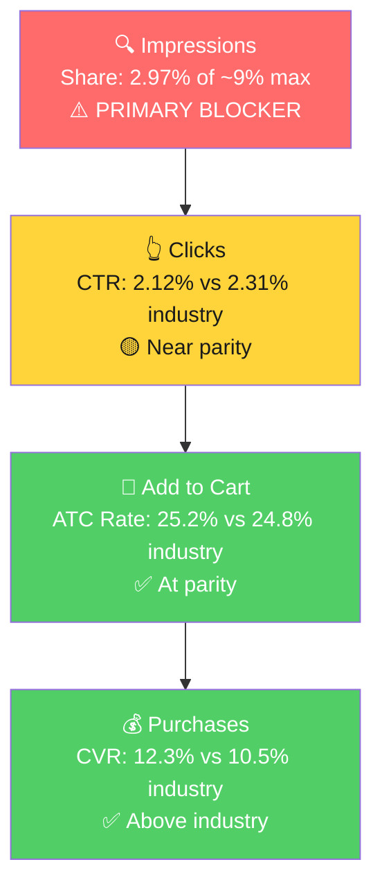

# Seller Central Audit - Beauticone Trends

## Section 1: Catalog Assessment

Three-month window: Jan-Mar 2026. Ad-related columns are blank because the full 90-day ad window only became available on upload (Jan 22 - Apr 20, 2026); those findings are in Section 5.

| Priority | Product | 3-Mo Sales | 3-Mo Ad Spend | ROAS | TACoS | Organic Sales | Ad Sales % | Buy Box % | CVR | Trend |
|----------|---------|-----------|---------------|------|-------|---------------|-----------|-----------|-----|-------|
| P0 | Straight Razors for Men | $14,537 | See §5 | See §5 | See §5 | See §5 | See §5 | 95% (Mar: 85%) | 11.9% | Declining |
| P1 | Hair Cutting Scissors | $4,294 | See §5 | See §5 | See §5 | See §5 | See §5 | 99% | 6.8% | Volatile |
| P2 | Natural Terracotta Pumice Stone | $2,303 | See §5 | See §5 | See §5 | See §5 | See §5 | 99% | 24.4% | Growing (new launch) |

No P3 - the catalog only has three products. P2 (Pumice Stone) launched in Feb 2026 and is already converting at 21-24% CVR on growing traffic, making it the second most interesting product despite low revenue today.

## Section 2: Qualitative Product Understanding (P0 - Straight Razors for Men)

**Product:**
- Professional-grade straight edge razor kit for men, with 10 replaceable single-edge blades, 1.2mm blade exposure, ergonomic ultra-lightweight handle, and a pouch-style gift box.
- Premium stainless steel, black coating, 1-ounce handle weight, non-slip grip. Shipped in gift-ready packaging.
- Value prop: Barbershop-quality shave without the maintenance burden of traditional fixed-blade razors. Replaceable blades eliminate stropping and honing.
- Purchase motivation: Two jobs-to-be-done. (1) Working or aspiring barbers needing a daily-use tool. (2) Gift buyers purchasing for men who shave, concentrated around Father's Day and holiday season.

**Customer:**
- Men aged 25-55 and gift buyers purchasing for them. Primary use cases are professional barbering, enthusiast home wet shaving, and gifting.
- Purchase drivers: control and shave quality at a budget price point for the professional/enthusiast; presentation (gift box, pouch) and heritage aesthetic for the gift buyer.

**Brand:**
- Registered private-label brand. Owns beauticone.com and has been selling straight razors on Amazon since at least 2022 (multiple older ASINs in the same line).
- Established Amazon-native brand, not a first-time seller. DTC site exists but Amazon is clearly the primary volume channel.
- Brand vibe: Professional barbershop aesthetic, black/silver palette, utility-focused. Reads as "working barber tool," not aspirational grooming lifestyle.

**Competitive Landscape:**
- Price positioning: Inferred ASP ~$8-12 per order, placing Beauticone in the **budget-to-mid tier** of the Amazon straight razor market.

| Competitor | Product | Tier | Notes |
|------------|---------|------|-------|
| Facón | Straight razor kit with 100 blades | Budget/Mid | Direct competitor, wooden handle variant |
| Gravity Razors | Professional kit with 0.5mm / 1.2mm / 2mm exposure options | Mid | Differentiates on blade exposure tiers |
| The Beard Club | Straight edge razor kit with leather case | Mid | Brand-led, subscription audience |
| DOVO / Feather | German / Japanese heritage brands | Premium | $100+, not direct Amazon competitors |

- Clearest differentiation: bilingual targeting (Spanish keywords like "navajas para barbero" in title and bullets) is a real edge in the Hispanic barber segment that most English-first competitors miss.
- Weakness: no heritage or craft story; no single dominant safety or quality positioning.

**Listing Quality:**

**Strengths:**
- **Rating:** 4.6 stars with an improving trajectory over the last 10 months (launched at 4.0, dipped to 2.7, climbed back and stabilized). Strong and getting stronger. Real asset on the search results page.
- **Video:** Present, 61 seconds, demonstrating the razor in use. Critical for a tactile-purchase category.
- **A+ Content:** Present, image-driven (consistent with A+ best practice).
- **Keyword surface area in title:** Covers the core English terms (straight razor, barber, professional, kit, blades) plus Spanish variants. Strong search index coverage.

**Opportunities:**
- **Bullet copy quality:** All 5 bullets are used, but the writing is keyword-stuffed and grammatically rough. Reads as machine-translated SEO copy, which erodes trust in a category where precision and quality matter. Rewrite with clean English, lead each bullet with a benefit in caps, and weave keyword variants (including Spanish) naturally.
- **Title structure:** "1.2 mm Exposed" is buried at the end. For an experienced straight razor buyer, blade exposure is a top decision factor (Gravity Razors makes this their whole positioning). Restructure to surface exposure and skill-level fit earlier.
- **Description field:** Empty. Still indexed for search and shown on mobile before A+ loads. Wasted surface.
- **A+ depth:** Only 1 module. Competitors use 4-6 modules (home vs barbershop use, blade replacement walkthrough, brand story). Thin for a tactile purchase.

## Section 3: Quantitative Product Understanding (P0)

**Annual Trend:**

| Metric | Jul 2025 (launch ramp) | Oct-Nov 2025 (peak) | Dec 2025 - Feb 2026 (plateau) | Mar 2026 (latest) |
|--------|------------------------|---------------------|-------------------------------|--------------------|
| Total Sales | $6,101 | $9,012 avg | $5,429 avg | $3,926 |
| Sessions | 5,860 | 8,362 avg | 6,149 avg | 4,284 |
| CVR | 15.2% | 16.3% avg | 12.2% avg | 12.3% |
| Buy Box % | 99.5% | 99.7% avg | 99.8% avg | 85.2% |

- March 2026 sales are 57% below the Nov peak. The decline is driven by both reduced traffic (sessions down 49% from peak) and worse CVR (16% → 12%). Both levers broke at once.
- **March introduces a third issue:** buy box fell from 99.8% to 85.2%. As a private-label brand with no competing sellers on the listing, this points to a MAP-related suppression following a recent price change.

**Rating Trajectory:** Improving. 4.0 at launch (Jun 2025) → 4.6 (Apr 2026). Customer satisfaction is a strength, not a problem.

**Sales Rank Trajectory:** Declining but still strong. Straight Razors subcategory BSR: peak #10-15 (Oct-Nov 2025) → #20 (Mar 2026). Beauty & Personal Care overall BSR: ~20K peak → ~39K now. Rank decline mirrors the revenue decline and confirms it is real, not a data artifact.

## Section 4: Market Opportunity (SQP)

**Tier Breakdown:**

- **Tier 1 (Hero):**
  - **Keywords:** straight razor, straight razors for men, straight edge razor, single blade razor, single blade razors for men, navajas para barbero, barber razor
  - **Rationale:** Queries where a straight razor is exactly what the shopper wants. P0 is the direct answer.

- **Tier 2 (Core razor market):**
  - **Keywords:** razor, razors for men, shaving razor, one blade razor, razor knife
  - **Rationale:** Broader razor queries where a straight razor is one option among several (cartridge, safety, electric). Mixed intent.

- **Tier 3 (Adjacent barber space):**
  - **Keywords:** barber, barber accessories, barber supplies, razor blades for men
  - **Rationale:** Barber/grooming supplies queries where a straight razor is one item among many (scissors, clippers, capes). Low razor-specific intent.

**Market Sizing (12-month averages):**

| Tier | Monthly Search Volume | Monthly Add to Carts (Market) | Monthly Purchases (Market) | Est. Market Size ($/mo) |
|------|----------------------|-------------------------------|----------------------------|-------------------------|
| Tier 1 | 218,000 | 29,500 | 12,200 | $354K |
| Tier 2 | 486,000 | 88,800 | 49,900 | $1.07M |
| Tier 3 | 250,000 | 36,600 | 7,300 | $439K |
| **Total P0** | **~954,000** | **~154,900** | **~69,400** | **~$1.86M** |

*Estimated using $12 avg product price based on competitive landscape ($10-15 range for kit format).*

**Seasonality check:** Tier 1 market search volume and market purchases are stable to slightly growing across the 12-month window. Market purchases went 10,746 in Apr 2025 to 14,242 in Mar 2026. **The Oct-Nov sales peak and subsequent decline is NOT a category-wide seasonal pattern.** It is brand-specific.

**Blockers & Growth Path:**

| Tier | Impression Share | CTR (Brand vs Industry) | CVR (Brand vs Industry) | Primary Blocker | Growth Path |
|------|-----------------|------------------------|------------------------|-----------------|-------------|
| Tier 1 | 2.97% (of ~9% max) | 2.12% vs 2.31% (healthy) | 12.3% vs 10.5% (above industry) | **Impression Share** | PPC scaling. Converts above industry when visible; needs to show up more. |
| Tier 2 | 0.06% (negligible) | 2.41% vs 1.64% (above) | 14.0% vs 24.6% (below) | **CVR intent mismatch** | Not a primary target. Broad razor queries are cartridge/electric dominated. |
| Tier 3 | 0.13% (of ~17% max) | 1.36% vs 1.68% (slightly below) | 6.9% vs 7.3% (parity) | Impression Share (low leverage) | Low priority. Volume too small to move the needle. |

**ICAP Funnel Visual (Tier 1):**

**The single biggest finding in this audit:** Beauticone converts above industry on Tier 1 when visible. The only broken link is top-of-funnel visibility. Impression share dropped from 5.98% (Oct 2025 peak) to 2.14% (Mar 2026) while the market grew. This is a visibility collapse, not a market or product problem.

## Section 5: Ad Analysis

**Window:** 2026-01-22 to 2026-04-20 (89 days, full available data).
**Enabled account spend:** $6,128 // sales $8,897 // ROAS 1.45.

### Campaign Structure

Campaign structure is clean and systematic. Naming convention is `SO | {Product} | {ASIN} | SPM | {Theme} | {Match Type}`. Not overstuffed. No action needed here.

### Auto vs Manual Split

| Targeting Type | Clicks | Spend | Sales | ROAS | AOV | CPC | CVR |
|----------------|--------|-------|-------|------|-----|-----|-----|
| Manual | 7,320 | $6,128.49 | $8,897.06 | 1.45 | $7.42 | $0.84 | 16.38% |
| Automatic | 0 | $0 | $0 | - | - | - | - |

> **Finding: Zero auto campaigns running. No discovery loop in place.**
>
> **Problem:**
> - The account bids only on keywords the team has manually chosen. There is no mechanism for Amazon's algorithm to surface new high-intent converting search terms.
> - Every emerging or long-tail converting term is invisible to the account today.
>
> **Solution:**
> - Launch a small auto campaign per hero product (P0 and P2) at $10-15/day with all targeting groups enabled.
> - Harvest converting terms from the search term report weekly into new manual exact campaigns.
>
> **Impact:** 10-20% lift in P0 ad-attributed sales within 4-6 weeks as the harvesting loop begins. Structural gap - the exact dollar value is hard to predict, but missing it entirely is the issue.

### Campaign Profitability

Below-threshold campaigns (ROAS < 1.5x, meaningful spend):

| Campaign | Spend | Sales | ROAS | Clicks | Orders |
|----------|-------|-------|------|--------|--------|
| P0 PT Top Competitors Exact (B0F839C7CT) | $2,282.64 | $2,991.34 | 1.31 | 2,409 | 387 |
| P2 SK "pumice stone for feet" Exact | $1,543.97 | $2,231.15 | 1.45 | 1,483 | 326 |
| P1 PT Converting ASINs | $400.66 | $425.60 | 1.06 | 506 | 44 |
| P0 GTEX BS3 | $360.12 | $442.30 | 1.23 | 449 | 58 |
| **Total below-threshold** | **$4,587** | **$6,090** | **1.33** | | |

> **Finding: 75% of enabled ad spend is below the 1.5x ROAS profitability floor.**
>
> **Problem:**
> - The P0 PT Top Competitors campaign alone is 37% of account spend at 1.31 ROAS.
> - At 387 orders and 16% CVR, it drives volume, but every sale loses margin.
>
> **Solution:**
> - Do not pause the P0 PT campaign; it is the P0 volume engine. Instead, lower bids on the lowest-converting ASIN targets inside it (current CPC $0.95), negate ASIN targets with 30+ clicks and zero orders.
> - Reallocate saved spend to the 2.13 ROAS P0 Broad Scavenger campaign and to a new Tier 1 SK Exact campaign (see below).
>
> **Impact:** A 10-15% bid reduction on PT Top Competitors preserves ~90% of orders while cutting spend by ~$250/month. Redeploying to 2.13 ROAS campaigns adds ~$500 in monthly sales. Net: ~$2,000 in annualized P0 ad sales from reallocation alone.

### Targeting Strategy

**Keyword vs Product Targeting (includes paused):**

| Targeting Strategy | Clicks | Spend | Sales | ROAS | AOV | CPC | CVR |
|-------------------|--------|-------|-------|------|-----|-----|-----|
| Keyword Targeting | 7,255 | $5,724.07 | $7,236.59 | 1.26 | $7.59 | $0.79 | 13.15% |
| Product Targeting | 9,141 | $7,207.44 | $8,464.05 | 1.17 | $7.66 | $0.79 | 12.09% |

**Match Type Breakdown (includes paused):**

| Match Type | Clicks | Spend | Sales | ROAS | AOV | CPC | CVR |
|------------|--------|-------|-------|------|-----|-----|-----|
| EXACT | 3,161 | $3,038.59 | $4,039.85 | 1.33 | $7.05 | $0.96 | 18.13% |
| BROAD | 2,216 | $1,350.29 | $1,703.20 | 1.26 | $8.56 | $0.61 | 8.98% |
| PHRASE | 190 | $109.18 | $146.70 | 1.34 | $8.15 | $0.57 | 9.47% |

Both splits look reasonable. Exact dominates keyword spend with best CVR (18%), as expected. No major reallocation needed on targeting type or match type mix.

### P0 Campaign Map

| Campaign | Spend | Sales | ROAS | Clicks | Orders | CVR |
|----------|-------|-------|------|--------|--------|-----|
| PT Top Competitors Exact (B0F839C7CT) | $2,282.64 | $2,991.34 | 1.31 | 2,409 | 387 | 16.1% |
| GTEX BS3 (B0F839C7CT) | $360.12 | $442.30 | 1.23 | 449 | 58 | 12.9% |
| Broad Scavenger (B0FKD87MTR) | $149.35 | $362.72 | 2.43 | 505 | 48 | 9.5% |
| Broad Scavenger (B0F839C7CT) | $148.40 | $316.58 | 2.13 | 434 | 41 | 9.4% |
| Converting Keywords (B0FKD87MTR) | $77.49 | $161.84 | 2.09 | 143 | 23 | 16.1% |
| Other (small Phrase/Exact Scavengers) | $29.32 | $29.80 | 1.02 | 96 | 4 | 4.2% |
| **P0 Total** | **$3,047** | **$4,304** | **1.41** | **4,036** | **561** | **13.9%** |

P0 is ~50% of account ad spend. Structural observation: **P0 has no dedicated SK (keyword) exact campaign on Tier 1 terms.** P2 has the equivalent campaign ("SK | pumice stone for feet | Exact") at $1,544 spend. The hero product is missing its hero keyword campaign.

### Impression Share Blocker: P0 Keyword Spend vs. Tier 1 Queries

From SQP: Tier 1 impression share is 2.97% of a ~9% cap. PPC lever is bidding on the Tier 1 keywords. Current Tier 1 keyword-level spend:

| Tier 1 Search Term | SQP Volume/mo | Ad Spend (90d) | Ad Sales | ROAS | Clicks | Orders | Ad CVR |
|-------------------|---------------|----------------|----------|------|--------|--------|--------|
| straight razor | 102K | $147 | $215 | 1.46 | 241 | 27 | 11.2% |
| straight razors for men | 35K | $157 | $113 | 0.72 | 193 | 15 | 7.8% |
| single blade razor | 43K | $13 | $21 | 1.61 | 22 | 3 | 13.6% |
| single blade razors for men | 15K | $21 | $29 | 1.37 | 38 | 4 | 10.5% |
| straight edge razor | 14K | $26 | $58 | 2.25 | 39 | 8 | 20.5% |
| barber razor | 12K | $195 | $196 | 1.01 | 252 | 27 | 10.7% |
| navajas para barbero | 12K | $23 | $22 | 0.96 | 41 | 3 | 7.3% |
| **Tier 1 total** | **~233K** | **$582** | **$654** | **1.12** | **826** | **87** | **10.5%** |

> **Finding: The hero ASIN is not bidding meaningfully on its own hero keywords.**
>
> **Problem:**
> - Total P0 keyword-level spend on Tier 1 is ~$582 over 90 days (~$6.50/day).
> - The single largest Tier 1 query "straight razor" (102K monthly searches) gets $1.63/day in spend.
> - This is the direct mechanical cause of the 2.97% impression share on Tier 1.
> - High-efficiency variants are dramatically underfunded: "straight edge razor" (2.25 ROAS, $26 spend), "mens straight razor" (2.83 ROAS, $8 spend), "beard straight razor" (2.76 ROAS, $10 spend).
>
> **Solution:**
> 1. Launch **SO | Straight Razor | B0F839C7CT | SPM | SK | Tier 1 | Exact** with the 7 Tier 1 keywords as separate exact targets. Start at $30-40/day. Template off the P2 Pumice Stone SK campaign.
> 2. Within 2 weeks, scale SK Tier 1 budget to $60-80/day based on early ROAS.
> 3. Add a +50% Top of Search bid modifier to fix "straight razors for men" (currently 0.72 ROAS; likely driven by weak placement since Top of Search CVR is 16% vs Product Pages at 10%).
> 4. Negate: "professional straight razor" ($79 at 0.44 ROAS), "magnetic straight razor" ($10 at 0 ROAS), "porta navajas para barbero" ($9 at 0 ROAS, shopper wanted a razor HOLDER).
>
> **Impact:** Moving Tier 1 spend from $582 to ~$1,800 over 90 days at a blended 1.6 ROAS (scaling the high-efficiency variants) adds ~$2,880 in ad sales per quarter. Adding a 3% CVR lift from better placements on "straight razors for men" adds another ~$700. **Combined quarterly incremental P0 ad sales from the Tier 1 PPC fix: ~$3,500-$4,500.**

## Section 6: Action Plan

**The primary blocker is Tier 1 impression share on P0.** The first actions focus on fixing that via PPC, then layering listing improvements in weeks 4-6. Listing changes take longer to land and their impact is harder to predict; PPC is the faster lever.

### Weeks 1-2: Immediate PPC Fixes

- **Launch P0 Tier 1 SK Exact campaign.** 7 keywords (straight razor, straight razors for men, straight edge razor, single blade razor, single blade razors for men, navajas para barbero, barber razor), each as its own exact target. Starting daily budget $30-40.
- **Add Top of Search bid modifier (+50%)** on the new Tier 1 SK campaign and on existing campaigns where Product Pages placement dominates. Account-wide, Top of Search CVR is 16% vs Product Pages 10%.
- **Negate wasted terms** on existing P0 campaigns: "professional straight razor," "magnetic straight razor," "porta navajas para barbero." Saves ~$30/month at current pace.
- **Lower bids on P0 PT Top Competitors campaign** by 10-15% to pull ROAS closer to the 1.5x floor. Monitor order volume daily to catch any outsized drop.
- **Launch a small auto campaign for P0** at $10/day. Pure discovery; harvest converting terms weekly.
- Investigate buy box drop on Straight Razors (99% to 85% in March) with the seller. Likely MAP-related. Resolve before scaling PPC.

### Weeks 2-4: Scale What's Working

- **Scale P0 Tier 1 SK campaign** to $60-80/day if early ROAS stays above 1.5x. Prioritize the high-efficiency terms ("straight edge razor," "mens straight razor," "beard straight razor") with dedicated exact campaigns or higher bids.
- **Harvest auto search terms** into new manual exact campaigns as they cross 5+ converting clicks.
- **Begin P0 listing copy rewrite.** Clean up bullet grammar, lead with benefits in caps, weave keywords (including Spanish) naturally. Keep Spanish positioning since it is the most defensible differentiator.
- Expand P2 Pumice Stone campaign structure (replicate P0 learnings if PPC uplift works on P0).

### Weeks 4-6: Listing Publish and Tier 1 Saturation

- **Publish P0 listing rewrites:** new title (surface "1.2mm exposure" earlier), new bullets, populated description field, additional A+ modules (use cases: home vs barbershop, blade replacement walkthrough, brand story).
- Monitor P0 CVR daily for 2 weeks post-publish. If CVR improves from 12% toward the 16% peak, that is a ~$1,200-1,500/month incremental organic revenue lift at current session volume.
- Continue scaling P0 Tier 1 PPC until impression share approaches 6-7% (near the adjusted cap).
- Launch branded defense campaign (2-3% of total spend) if data in auto/search terms shows any competitor bidding on "Beauticone."

### Weeks 6-8: Evaluate Secondary Products and Prepare for Father's Day

- Re-evaluate P0 impression share; expected to be 5-7% by this point vs 2.97% at start.
- **Prepare for Father's Day (mid-June):** this is the next natural demand peak for men's grooming gifts. Pre-scale P0 Tier 1 budgets and A+ positioning ("Perfect Father's Day gift") 2-3 weeks ahead.
- Begin P1 (Hair Cutting Scissors) CVR investigation: 5-8% CVR vs P0's 12-16% is not a traffic problem, it is a product page problem. Listing audit for P1 if budget allows.
- Apply lessons from P0 to structure P1 and P2 accounts similarly.

## Section 7: Insights & Questions for the Seller

### Insights

- **P0 (Straight Razors) sales decline is a visibility problem, not a market or product problem.** Tier 1 market purchases grew from 10.7K in Apr 2025 to 14.2K in Mar 2026. Beauticone's share fell from 6% to 2% in the same window. The product converts above industry (12.3% vs 10.5%) when shown; it is just showing up less.
- **P0 (Straight Razors) has no dedicated SK Tier 1 exact campaign despite being 50% of ad spend.** P2 (Pumice Stone) has exactly this kind of campaign, driving 326 orders/quarter. Replicating the structure for P0 is the single highest-leverage change in the audit.
- **P0 (Straight Razors) has a real CVR moat.** 4.6 rating on an improving trajectory, above-industry ATC and CVR, and unique bilingual targeting. Incremental Tier 1 traffic will convert, not burn. This is what makes the PPC-scaling play high-confidence.
- **Account has no auto campaigns.** No discovery loop, every bid is manually chosen. This is both a quality ceiling today and a structural reason Tier 1 impression share cannot self-heal.
- **P1 (Hair Cutting Scissors) has a CVR problem, not a traffic problem.** 5-8% CVR on 800-2,800 sessions/mo is half what P0 does. The product detail page is the likely blocker; not prioritized for phase 1 because P0 lift is larger and faster.
- **P2 (Pumice Stone) is the strongest new launch in the catalog.** 21% CVR on 1,665 March sessions is statistically meaningful and well above category norms. Should be scaled aggressively once P0 stabilizes.

### Questions for the Seller

- **P0 buy box dropped from 99.8% to 85.2% in March 2026.** As a private-label brand with no competing sellers, this points to a MAP-related suppression. Were there recent price changes?
- **Tier 1 impression share collapsed from 5.98% (Oct 2025) to 2.14% (Mar 2026).** Our ad data only goes back to Jan 22, 2026, so we cannot see Oct-Dec 2025 ad activity. Was ad spend cut or reallocated during Nov-Dec 2025?
- **The account has zero auto campaigns.** Is that deliberate, or was auto turned off at some point?
- **The Marble variant (B0FKD87MTR) PT Top Competitors campaign is paused.** Q726 shows it ran $1,356 at 0.99 ROAS. Why was it paused, and is there a plan to restart it?
- **Current P0 retail price and cost basis?** The PT Top Competitors campaign sits at 1.31 ROAS, below our default 1.5x threshold. Knowing actual margin lets us set a precise break-even target rather than using the default assumption.
