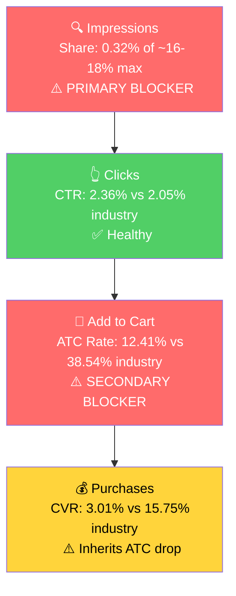

# Seller Central Audit - Bi-Crackie

## Section 1: Catalog Assessment

Bi-Crackie is a **single-product brand**: one parent ASIN (B0D86S4HNF) with 5 SKU variants of the same BICRACKIE Stand-Up Crack Weeding Tool. Priority below is at the variant level; deep-dive in subsequent sections is on the parent listing as one product.

| Priority | Product | 3-Mo Sales | 3-Mo Ad Spend | ROAS | TACoS | Organic Sales | Ad Sales % | Buy Box % | CVR | Trend |
|----------|---------|-----------|--------------|------|-------|---------------|-----------|-----------|-----|-------|
| P0 | BICRACKIE Weeding Tool (original, B0C9KWVCTY) | $179.96 | n/a | n/a | n/a | $179.96 | 0% | 98.1% | 2.26% | Seasonal off-season trough |
| P1 | Purple Paver Weeder (B0D868RNVJ) | $269.94 | n/a | n/a | n/a | $269.94 | 0% | 100% | 7.32% | Seasonal off-season trough |
| P2 | Original & Paver Weeder Set (B0D86DYYC6) | $79.99 | n/a | n/a | n/a | $79.99 | 0% | 100% | 2.78% | Seasonal off-season trough |
| P3 | BICRACKIE Junior (B0D86DVNYH) | $0 | n/a | n/a | n/a | $0 | 0% | 100% | 0% | Dead |

**Why P0 over P1 even though P1 has more 3-Mo sales:** Q1 2026 is the off-season trough; rankings are noisy. On a 12-month rolling view (Apr 2025 to Mar 2026), P0 has $3,959 in revenue (vs $3,329 for P1) and 40% more sessions (2,470 vs 1,748). P0 is also the parent listing's primary face. P1's strong Q1 CVR (7.3%) is noted as a signal in Section 2.

**P3 (Junior) is functionally dead:** 600+ sessions across the trailing 12 months and only 1 unit sold. Not deep-dived in subsequent sections.

## Section 2: Qualitative Product Understanding (P0)

**Product:**
- A 60" stand-up weeding tool with a steel blade tipped at both ends (5" tapered, 1/4" wide for driveway/sidewalk cracks and 1/16" wide for tight paver joints) for removing weeds without bending or kneeling.
- Steel blade, fiberglass casing, 60" pole. Optional short handle for general garden use.
- Made in USA. Heavily emphasized in title, bullets, and A+ content.
- Solves the back-pain / time-sink of getting on hands and knees to scrape weeds from cracks. The 60" stand-up pole is the core differentiator vs the short-handle weeders that dominate the category.

**Customer:**
- Homeowners with paver patios, driveways, or sidewalks where weeds grow in cracks and joints.
- Skews older / back-pain-conscious. The "save your back" pitch is the lead bullet.
- Chemical-averse DIY gardeners. A+ specifically positions the tool as a no-chemicals alternative to herbicides.

**Brand:**
- Real founder-led brand. Bill Pinho founded Bi-Crackie in 2021 after experiencing back pain weeding his own driveway. Purple Paver line added in 2023.
- Direct-to-consumer Shopify site at bicrackie.com, also sold on Walmart. Not Amazon-only.
- Made in USA is a substantiated claim, not generic marketing.
- **Brand vibe:** practical, friendly, "homeowner solved a homeowner problem." Approachable rather than premium-luxury, but the price point ($44.99) is premium for the category.

**Competitive Landscape:**

Average crack-weeder on Amazon (short-handle): ~$15-25 | P0 (Bi-Crackie original): $44.99 | ~80-200% above the short-handle average. Premium stand-up segment.

| Brand | Product | Format | Approx Price |
|-------|---------|--------|-------------|
| GREBSTK | Crack Weeder Crevice Weeding Tool (beech handle) | Short handle | $15-20 |
| BARAYSTUS | 3-in-1 Crack Weeder telescoping | Adjustable 30-58" | $20-30 |
| Hanaoyo | 49.2" Long Handle Crack Weeder | Long handle adjustable | $25-30 |
| Lothee Garden | 54" Long Handle Crack Weeder L-shaped | Long handle | $20-30 |
| Gardena | Crack Weeder (premium German brand) | Short handle | $30-60 |

**Key differentiator:** Bi-Crackie is one of very few true stand-up (rigid 60" pole) crack weeders. Most competitors are short-handle. Telescoping alternatives exist but tend to be lower quality and cheaper. The "stand-up + Made in USA + steel blade" combination is genuinely defensible. There is also a market gap, no premium telescoping option exists.

**Listing Quality:**

**Strengths:**
- **Bullets:** All 5 used, benefit-led with caps lead and explanation. Distinct value props per bullet (back-saving, USA durability, dual-blade, multi-purpose, USA quality reinforcement). Length is reasonable.
- **A+ Content:** 7 image-only modules including a "Before & After" module. Per the 2026 best practice (image-only A+, no text-only modules), this is correctly executed. Modules cover the right topics: USA-made trust signal, before/after proof, dimension callouts, no-chemicals positioning.
- **Video:** Present, 29 seconds. Critical for this product because the value prop ("easy stand-up weed removal") is impossible to convey through static images.
- **Rating:** 4.7 stars currently, on the high end of the category. Recovered from a 3.9 dip in early 2025.
- **Title:** Communicates the differentiators clearly: "Stand-Up", "60" Steel Pole", "2-Sized 5" Tapered Ends", "Made in USA". Includes the right keywords.

**Opportunities:**
- **Main image is a critical CTR risk.** The current main image is an in-use close-up of the green plastic handle pressed into a paver crack with weeds being pulled. The full product is not visible, the 60" pole is not visible, the dual-blade design is not visible, no white background. This violates Amazon's main image guideline and, worse, fails to communicate the single biggest differentiator (the 60" stand-up pole). On the search results page, a buyer scanning crack weeders sees a green handle in a crack and cannot tell this is a stand-up tool versus a short-handle one. Replace with a clean white-background hero shot showing the full 60" pole, both blade ends, and ideally a person at standing height for scale.
- **No brand store referenced in Keepa data.** With a real DTC site and brand story, a brand store would help cross-sell variants and tell the founder story. Confirm with seller.
- **Bullet 4 (Multi-Purpose) is undersold.** The "optional short handle for weeding, planting seeds, cleaning decks" mention is buried mid-bullet. The fact that this tool converts from a stand-up crack weeder into a multi-purpose garden tool is a strong second-use case that could expand the addressable market.

## Section 3: Quantitative Product Understanding (P0)

**Annual Trend (Account Level, P0 represents most of revenue):**

| Metric | Mar 2025 (peak ramp) | Jun 2025 (peak) | Aug 2025 (drop) | Mar 2026 (current) |
|--------|---------------------|-----------------|-----------------|--------------------|
| Total Sales | $1,205 | $2,150 | $390 | $305 |
| Sessions | 729 | 1,268 | 263 | 181 |
| CVR | 3.57% | 3.86% | 3.04% | 3.31% |
| Buy Box % | 99.79% | 99.74% | 99.38% | 100.0% |

- **Year-over-year decline at the same seasonal point:** Mar 2025 ($1,205) vs Mar 2026 ($305) is a 75% drop, with sessions down 75%. The brand has lost organic visibility. Likely connected to the absence of advertising and to the rating dip in early 2025 that cost the brand momentum into the 2025 peak.
- **August 2025 drop:** sales fell 75% July to August, sessions 67%. Cause unknown from data, candidates are stockout, ad pause, or listing issue. Question for the seller.

**Rating Trajectory:** Improving. Rating dipped to 3.9 in early 2025 (likely due to a quality issue or bad batch) and has steadily climbed back to 4.7 by April 2026. The brand has put the dip behind them.

**Sales Rank Trajectory:** Stable to slightly declining. Manual Weeders rank held #440 to #850 from late December 2025 through mid-March 2026 but has drifted to #985 to #1,240 in April 2026. Wrong direction at the wrong time. Competitors are ramping into season and Bi-Crackie is not.

## Section 4: Market Opportunity (SQP)

**Tier Breakdown:**

- **Tier 1 (Hero):**
  - **Keywords:** crack weeder, crack weeder tool, crevice weeding tool, sidewalk crack weeder, paver weed removal tool, driveway weed removal tool, weed puller tool for pavers, weed puller tool for cracks, driveway crack weeder, crack weeder crevice weeding tool, tool for weeding between pavers, paver weeder
  - **Rationale:** Queries where the customer is searching for exactly a paver/crack/driveway-specific weeding tool. Bi-Crackie is the direct answer.

- **Tier 2 (Core market):**
  - **Keywords:** weed puller tool, weed puller, weeder tool, weeding tool, long handle weed puller, stand up weeder, weed scraper, weed remover tool
  - **Rationale:** Broader weed-puller intent. Bi-Crackie is one valid answer among short-handle and telescoping alternatives. Same need, broader competitive set.

- **Tier 3 (Adjacent):**
  - **Keywords:** gardening hand tools, garden tools, gardening tools, pavers
  - **Rationale:** Generic gardening / paver-related queries where Bi-Crackie can technically appear but is not the primary intent.

**Market Sizing (12-Month Avg, Apr 2025 to Mar 2026):**

| Tier | Monthly Search Volume | Monthly Add to Carts (Market) | Monthly Purchases (Market) | Est. Market Size ($/mo) |
|------|----------------------|-------------------------------|---------------------------|------------------------|
| Tier 1 (Hero) | 11,568 | 2,344 | 958 | ~$59k |
| Tier 2 (Core market) | 183,771 | 34,537 | 15,225 | ~$863k |
| Tier 3 (Adjacent) | 81,010 | 4,895 | 992 | ~$122k |
| **Total addressable (T1 + T2)** | **195,339** | **36,881** | **16,183** | **~$922k** |

*Estimated using $25 average product price (mid-market, between short-handle $15-25 and stand-up $30-50).*

**Seasonality confirmed market-driven:** Tier 1 search volume cycles ~16x from peak (28,255 in July) to trough (1,733 in December). Bi-Crackie's revenue follows the same shape. The peak window is April through July, we are entering it now.

**Blockers and Growth Path (3-Month: Jan to Mar 2026):**

| Tier | Impression Share | CTR (Brand vs Industry) | CVR (Brand vs Industry) | Primary Blocker | Growth Path |
|------|-----------------|------------------------|------------------------|-----------------|-------------|
| Tier 1 | 0.32% (12-mo, of ~16-18% adj. cap) | 2.36% vs 2.05% (Healthy) | 3.01% vs 15.75% (Blocker, 80% gap) | Impression share, then CVR | Fix main image first (CVR lever), then PPC scale on Tier 1 keywords (impression share lever) |
| Tier 2 | 0.002% | n/a (insufficient brand clicks) | n/a (insufficient brand clicks) | Impression share | After Tier 1 stabilizes, scale PPC into Tier 2. 15x larger market but more competitive on price. |
| Tier 3 | 0.0006% | n/a | n/a | Intent mismatch | Skip. Generic gardening queries are not the right fit for a $44.99 specialized tool. |

**Adjusted impression share cap:** Bi-Crackie has 4 selling SKU variants (Original Green, Purple Paver, Set, Junior), 2-3 surface per query. Adjusted cap ~16-18% on Tier 1 and Tier 2.

**Why CVR is a real secondary blocker on Tier 1:** Brand 12-month rates show CTR is fine (2.36% vs 2.05% industry), but ATC rate is 12.41% vs 38.54% industry, a 67% gap at the click-to-cart stage. People click but bounce off the PDP. Connects to Section 2: the main image fails to communicate the product, and the price ($44.99) is 80-200% above short-handle alternatives on the same SERP, so the value differentiation needs to be visually obvious from the gallery the moment they land.

**ICAP Funnel Visual (Tier 1, the highest-growth-potential tier):**

- The brand is essentially invisible across the entire weed-puller search universe. Even on hero queries that match the product exactly, the brand captures less than 1 in every 200 impressions.
- Tier 2 is 15x larger than Tier 1 by addressable market size and is the second-phase opportunity once Tier 1 is performing.
- **No branded queries appear in the SQP data with meaningful volume.** This is consistent with a small brand. No branded defense campaign is warranted yet.

## Section 5: Ad Analysis

### Account Level

**No ad data is available in the system for Bi-Crackie.** `ads_day_count: 0`. Q699 (campaign view, last 90 days) and Q698 (monthly campaign performance, all time) both return zero rows.

This means none of the standard account-level ad analyses can be performed: campaign structure, auto vs manual split, profitability, targeting strategy. There is nothing to analyze.

**Two possible interpretations of the absence:**
1. No ads have been running in the last ~90 days. Seller Analytics retains only the last 90 days of advertised product reports. Historical activity beyond that window cannot be inferred from the absence.
2. The seller has never run paid ads on Amazon, or the ad account was never connected to the integration.

Confirming with the seller is required (see Section 7).

### Product Level (P0)

Cannot be performed without ad data.

The SQP data does suggest a possible historical pattern: Tier 1 brand impressions ramped from 2,213 (Apr 2025) to 3,081 (Jun 2025) and then collapsed to 716 (Aug 2025) and 242 (Sep 2025). This is consistent with both seasonal organic ranking and with paid campaigns being seasonally enabled. Without ad data we cannot distinguish.

### Implications for the Action Plan

The biggest single growth lever for Bi-Crackie right now is **starting to advertise**, not optimizing existing ads. The action plan below is structured around the launch.

## Section 6: Action Plan

The primary blocker is **impression share on Tier 1**, with a secondary blocker on **CVR / ATC rate** driven by the listing's main image and price-vs-alternative communication. The general rule (PPC levers first, listing levers later) is **inverted here** because the secondary blocker (CVR) would cause paid traffic to bleed money before it converts. Listing fix comes first, then PPC scaling.

The action plan is also tighter than usual because there is no existing ad activity to optimize. There is no campaign reallocation, no negation of wasted spend, no reshuffling. The plan is: fix the listing fast, launch ads at peak season, scale, evaluate.

### Weeks 1-2: Listing Fix and Ad Account Prep

The primary blocker is impression share, but the ATC rate gap (12% vs 38.5% industry) means scaling ads without fixing the main image will burn budget. Both tracks run in parallel.

- **Replace the P0 main image.** Clean white-background hero shot showing the full 60" pole, both blade ends (1/4" and 1/16"), and ideally a person standing while using the tool. The 60" stand-up differentiator must be visible at thumbnail size on the search results page. (Justified by Section 2 Listing Opportunities and the 67% click-to-cart gap in Section 4.)
- **Audit the rest of the gallery and update if needed.** Confirm the full product is visible across at least 2-3 gallery images, and that one image directly compares Bi-Crackie's stand-up format vs short-handle alternatives to justify the price differential.
- **Confirm brand store status.** If absent, plan a launch in Weeks 4-6 to support cross-sell across Original, Purple Paver, and Set. (Question for the seller first.)
- **Confirm advertising history.** Get the seller's prior campaign structure if any existed. This affects launch strategy. (See Section 7.)

### Weeks 2-4: Tier 1 PPC Launch

Once the new main image is live, launch Sponsored Products on the Tier 1 hero keywords to capture impression share at peak season.

- **Launch one Sponsored Products campaign per match type (Exact, Phrase) on the 12 Tier 1 keywords.** Use a conservative starting budget and monitor weekly. (Justified by Section 4 Tier 1 impression share = 0.32% vs ~16-18% adjusted cap.)
- **Launch one Sponsored Products Auto campaign as a discovery layer** to surface long-tail variations and harvest into manual exact in later weeks.
- **Bid for Top of Search placements.** The CTR data on Tier 1 shows the brand converts at industry rates when shown, so the goal is showing up at the highest-converting placement.
- **Top of P0 SKUs to advertise:** B0C9KWVCTY (Original) and B0D868RNVJ (Purple Paver). The Set (B0D86DYYC6) can be a third campaign for upsell. Junior (B0D86DVNYH) is dead and should not be advertised.

### Weeks 4-6: Listing Polish and Tier 2 Expansion

- **Restructure Bullet 4 to elevate the multi-purpose use case.** Either pull the "optional short handle for weeding/planting/decks" out into its own bullet or move it to bullet position 2-3. (Justified by Section 2 Listing Opportunities.) This expands the perceived addressable use case.
- **Launch Brand Store** if not already present. (Pending seller confirmation.)
- **Launch Tier 2 PPC campaigns.** Once Tier 1 is converting at acceptable ROAS, layer in Sponsored Products on Tier 2 keywords (weed puller tool, weeder tool, weeding tool, long handle weed puller, stand up weeder). Tier 2 is a 15x larger market but requires winning on price-vs-cheap-alternative differentiation. Start at a conservative bid and expect lower ROAS than Tier 1 initially.
- **Sponsored Display defensive product targeting on own ASINs** (Original + Purple Paver) at low spend (under 5% of budget) to prevent competitors from poaching customers already on the PDP.

### Weeks 6-8: Scaling and Evaluation

- **Scale Tier 1 budgets on the keywords with positive ROAS** based on Weeks 2-6 performance. This is the peak-season window, May to July is when search volume is highest.
- **Harvest converting search terms from the Tier 1 Auto campaign** into Tier 1 Manual Exact campaigns with dedicated budgets.
- **Evaluate P1 (Purple Paver Weeder) for separate ad scaling.** Q1 CVR was 7.3% vs P0's 2.3%, suggesting P1 may convert better when shown. If Tier 1 ad data confirms this, the Purple Paver gets its own dedicated PPC strategy.
- **Plan for the August drop.** August 2025 saw a 75% revenue collapse (cause unknown). If the cause was a stockout or operational, prevent it. If the cause was ad pause or seasonality, plan how the brand stays visible through the off-season at lower spend rather than going dark again.

## Section 7: Insights and Questions for the Seller

**Insights:**

- **Bi-Crackie is effectively invisible in its own market.** P0 (BICRACKIE Weeding Tool) has 0.32% impression share on hero queries against a 16-18% achievable cap, even with two SKUs ranking. Even at peak season last year, impression share never crossed 0.5%. The brand is participating in a market it doesn't see.
- **No ads + entering peak season = highest-leverage moment of the year.** P0 (BICRACKIE Weeding Tool) market searches cycle 16x from December (1,733) to July (28,255). The audit is happening at the moment search volume is starting to climb. Every week between now and June without ads costs material revenue.
- **The main image is the single highest-leverage CTR fix.** P0 (BICRACKIE Weeding Tool) main image is an in-use close-up that fails to show the 60" stand-up pole, the product's primary differentiator. This drives the 12% ATC rate vs 38.5% industry. Replacing it is a one-time fix that lifts the entire funnel.
- **Listing fundamentals beyond the main image are above-average.** P0 (BICRACKIE Weeding Tool) has all 5 bullets, 7-module image-only A+ content, video, and a 4.7 rating recovered from a 3.9 dip in early 2025. This is not a "fix the listing" story; the gap is concentrated in main image and traffic.
- **Sales rank is slipping in April (#985 to #1,240) at the moment competitors ramp into season.** Without action, the brand will miss peak again the same way August 2025 collapsed. The peak window is 8-10 weeks long and starts now.
- **P3 (BICRACKIE Junior) is functionally dead.** 600+ sessions across the trailing 12 months and 1 unit sold. Either the variant has a structural issue (price, listing, product fit at a smaller size) or it is mis-positioned. Worth flagging for discontinue or relaunch decision.

**Questions for the Seller:**

- Have you ever run Sponsored Products / Sponsored Brands / Sponsored Display ads on Amazon? If yes, when did you last run them, what was the rough monthly spend, and which products did you advertise? (We have no ad data in the system.)
- Sales dropped 75% from July 2025 ($1,535) to August 2025 ($390), with sessions falling 67%. Was this a stock-out, inventory issue, ad pause, or something else? This affects how we plan the August transition this year.
- Buy box fell to 73.6% account-wide in December 2025 (otherwise 95-99% all year). On a private-label single-seller listing this typically points to a price/MAP event. Was there a price change or pricing rule that may have triggered buy box suppression?
- Is there a brand store on Amazon currently? If yes, can you share the link? If not, we want to launch one to support variant cross-sell and brand storytelling.
- BICRACKIE Junior accumulated 600+ sessions over the trailing 12 months and sold 1 unit. Is this variant being intentionally maintained, and is there a reason it converts so poorly compared to the original?
