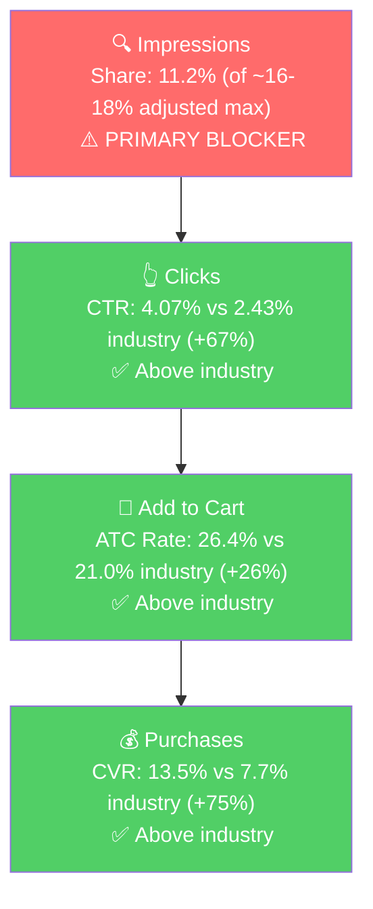

# Seller Central Audit - Blue Sky Studios

**Marketplace:** Amazon UK (£) | **Catalog:** 113 parent ASINs, 222 children | **Audit window:** Feb-Mar 2026 (biz), Jan 29 - Apr 28 2026 (ads)

---

## Section 1: Catalog Assessment

| Priority | Product | 3-Mo Sales | 3-Mo Ad Spend | ROAS | TACoS | Organic Sales | Ad Sales % | Buy Box % | CVR | Trend |
|---|---|---|---|---|---|---|---|---|---|---|
| P0 | Harry Potter Magic Levitating Wand Pen (B0FT54R9CP) | £6,772 | £1,567 | 2.96 | 23.1% | £2,135 | 68.5% | 70.7% | 11.4% | Growing (+8%) |
| P1 | Pop Culture Desk Mat - multi-license (B0FMKGCFXG) | £4,128 | £546 | 1.61 | 13.2% | £3,250 | 21.3% | 83.6% | 5.0% | Growing (+36%) |
| P2 | A5 Notebook & Pen Set - multi-license (B0FMQDK2HQ) | £3,162 | £1,080 | 1.44 | 34.1% | £1,609 | 49.1% | 99.6% | 8.1% | Flat (+7%) |
| P3 | Harry Potter Self-Stirring Cauldron Mug (B0G15RSDPQ) | £1,733 | £261 | 1.87 | 15.1% | £1,245 | 28.1% | 49.8% | 7.6% | Declining (-18%) |

*"3-Mo" actually represents 2 complete months (Feb + Mar 2026). The seller only has monthly biz data in the system, and only Feb and March 2026 have full ad-data overlap (ads started Jan 29, 2026).*

**Account snapshot (Feb-Mar 2026):** £67K total sales (~£33.5K/mo), £9.9K ad spend, account ROAS 2.08, account TACoS 14.7%, ad sales 30.6%. 61 of 113 parents had any sales in the 2-month window. ~40 parents launched in 2025 have not yet ramped.

**Tail of catalog:** Beyond P0-P3 there are ~6 products in the £500-£1,400 range (Character Mood Lights, Mug & Sock Gift Sets, Pen & Pencil Holders, Drink Bottles, Mini LED Lamps). Same multi-IP variants-under-one-parent structure. Insights from P1-P3 are likely to transfer to these.

---

## Section 2: Qualitative Product Understanding (P0)

The Quad Wand Pack child (B0F9FRV1MM, £13.92 avg price) drives 91% of parent revenue. The other children (Triple Pack, single Levitating Wand) and the parent placeholder are minor. The parent-level 70.7% buy box is dragged down by an underperforming sibling, not the hero child (which sits at 99.9% buy box).

**Product:**
- A licensed Harry Potter merchandise gift set: a collectible Ollivanders-style display box containing 4 wand-shaped rollerball pens themed after Harry, Hermione, Dumbledore, and Voldemort.
- Dual identity as collectible and functional rollerball pen.
- The "set of 4 in a display box" format at £13.92 is the structural differentiator. Most competitors sell single wand pens or non-functional wand replicas.
- Purchase motivation is gifting first, self-purchase second. Q4 holiday season concentrates demand.

**Customer:**
- Harry Potter fans (the millennial cohort that grew up with the franchise) buying for themselves or for younger fans.
- Gift buyers (parents, partners, friends) shopping for Harry Potter fans. Birthday and Christmas seasonality dominates.
- Secondary: students and office workers wanting a fun, functional desk item.

**Brand:**
- "Blue Sky Studios" is the Amazon brand name, but customers buying these products are buying "Harry Potter," not "Blue Sky Studios." The brand identity is the IPs themselves.
- Seller operates as an Amazon-native licensee: holds rights to Harry Potter, Spongebob, South Park, Sanrio, Hello Kitty, Wednesday Addams, TMNT, Transformers, Pochacco, Kuromi, Snoopy, Emily in Paris, and produces stationery / desk / homeware around them.
- No meaningful DTC presence. The catalog strategy (rapid SKU launches in 2025) is consistent with an aggressive Amazon-native license play.
- Brand vibe: pop-culture gift novelty.

**Competitive Landscape:**
- Price positioning: avg Harry Potter wand pen ~£10-£18 (single pens £4-£7, character collectible sets £10-£20) | P0 at £13.92 | mid-range, well below officially licensed Wizarding World wand replicas (£25+) which serve a different intent.
- Top competitors:

| Competitor | Product | Notes |
|---|---|---|
| Other HP wand pen sellers (small) | Single wand pens | P0's "set of 4" is structural advantage |
| The Noble Collection | Premium wand replicas | £25-£40, no writing function, premium positioning |
| Other novelty stationery (sorting hat keychains, Marauder's Map notebooks) | Various | Complementary, not direct |

- Differentiator: 4-pack with 4 distinct iconic characters in a display box. The risk is supply: any seller with a Wizarding World license can replicate.

**Listing Quality:**

> Note: Keepa's listing-signal extraction has not run on this child ASIN, so structured signals (image count, A+ module count) are not in the database. Assessments below are based on title, bullet content, and confirmed presence of A+ content and 1 video.

**Strengths:**
- Rating 4.6 stars across all 3 wand-pen children. Strong, no decline.
- Bullets: 5 used (full slot allocation), all leading with all-caps benefit phrase. Structure follows 2026 best practice.
- Video present. Critical for a novelty product where the "wand-feel writing" needs demonstration.
- A+ Content present.

**Opportunities:**
- **Title is missing the brand and has formatting issues.** Current: "Harry Potter Wand Pen Set of 4 - Harry, Hermione, Dumbledore, Voldemort Quad Wand Pack - Licensed Merchandise -Stationery Gifts". Issues: (1) "Blue Sky Studios" not in title; (2) the segment "-Stationery Gifts" has no space after the hyphen (looks careless); (3) "gift set" is missing despite gifting being the dominant intent. Suggested rewrite: "Harry Potter Wand Pen Set of 4 - Hermione, Harry, Dumbledore, Voldemort Quad Pack Gift Set - Licensed Hogwarts Stationery & Collectible Merchandise".
- **Bullet 3 has a comma splice** ("...office, these collectible pens combine..."). Trivial fix.
- **Bullets do not lead with the gift use case until Bullet 5.** Reorder so "PERFECT GIFT FOR FANS" leads, followed by set composition, then writing function, then display box.

---

## Section 3: Quantitative Product Understanding (P0)

### Annual Trend

| Metric | Apr 2025 (start) | Sep 2025 (pre-peak) | Nov 2025 (BB crisis) | Dec 2025 (peak) | Mar 2026 (current) |
|---|---|---|---|---|---|
| Total Sales | £385 | £2,682 | £17,778 | £35,891 | £3,514 |
| Sessions | 238 | 1,724 | 10,294 | 16,601 | 2,088 |
| Units | 35 | 242 | 1,293 | 3,069 | 263 |
| CVR | 14.7% | 14.0% | 12.6% | 18.5% | 12.6% |
| Buy Box % (parent) | 99% | 83% | 53.7% | 98.9% | 74.8% |
| Ad Spend | £0 | £0 | £0 | £0 | £758 |

- **The wand grew 90x from launch to Q4 peak with zero ads.** The entire Q4 2025 explosion (£17.8K Nov + £35.9K Dec) ran 100% organic. Ad spend started January 2026, after the holiday window had closed.
- **Buy box collapsed to 53.7% in November during peak demand.** This represents an estimated multi-thousand-pound sales loss during the most valuable month of the year. The collapse was specific to November, recovered to 99% by December, and is now sitting at 67-75% in Feb-Mar 2026. The hero child (Quad Wand Pack) shows 99.9% buy box at child-level, so the parent-level number is being dragged down by a sibling.

### Rating Trajectory

Stable at 4.4-4.6 across the available history (Oct 2025 to Jan 2026). No decline.

### Sales Rank Trajectory

Strong improvement followed by seasonal compression. Launched at rank ~70K in UK Office Products in Sept 2025. Hit **#2-#7 in the Pens subcategory** during Nov-Dec 2025 peak. Currently rank 30-60 in Pens off-season, which is still top-tier. The product has clear product-market fit.

---

## Section 4: Market Opportunity (SQP)

### Tier Breakdown

- **Tier 1 (Hero):**
  - **Keywords:** harry potter wand pen, harry potter wand pens, harry potter wand pen set, harry potter wand pen set of 4, harry potter wand pen set of 3, harry potter pen wand, wand pen, wand pens, harry potter levitating wand pen, harry potter pens set, harry potter pen set, harry potter's wand ballpoint pen, elder wand pen, wand pens harry potter
  - **Rationale:** Customer is searching for a wand-shaped pen or wand pen set themed on Harry Potter. The product is the exact answer. 14 queries.
- **Tier 2 (Core market):**
  - **Keywords:** harry potter pen, harry potter pens, harry potter notebook and pen, harry potter quill pen
  - **Rationale:** Customer wants a Harry Potter pen, our wand pen is one option among quill pens, character pens, or novelty pens. The notebook & pen set (P2) also competes here. 4 queries.
- **Tier 3 (Broad/adjacent):**
  - **Keywords:** harry potter gifts, harry potter gifts for women, harry potter gifts for girls
  - **Rationale:** Customer wants any Harry Potter gift. The wand pen is one of many gift options across the BSS catalog. Multi-product play. 3 queries.

**Excluded - intent mismatch:** "harry potter wand", "harry potter wand that shoots fire", "elder wand", "draco malfoy wand" represent customers wanting toy wand replicas. The wand pen is structurally not the answer. Brand has 2-4% impression share but converts poorly. Skipping these is a deliberate choice, not an oversight.

### Catalog Overlap (Adjusted Caps)

- Tier 1: Multiple wand-pen child variants rank. Adjusted cap: ~16-18%.
- Tier 2: Wand pen + Notebook & Pen Set (P2) both rank. Adjusted cap: ~16-18%.
- Tier 3: 5+ Harry Potter products across catalog rank. Adjusted cap: ~24-27%.

### Market Sizing (12-month avg)

| Tier | Monthly Search Volume | Monthly Cart Adds (Market) | Monthly Purchases (Market) | Est. Market Size (£/mo) |
|---|---|---|---|---|
| Tier 1 | 1,210 | 157 | 58 | £2,189 |
| Tier 2 | 3,618 | 601 | 216 | £8,360 |
| Tier 3 | 114,000 | 13,687 | 3,865 | £190,527 |
| **Total P0-relevant** | 118,828 | 14,445 | 4,139 | £201,076 |

*Estimated using £13.92 avg product price (Quad Wand Pack). Tier 3's £190K is a "visibility opportunity" headline, not directly capturable since "Harry Potter gifts" includes products from £5 stickers to £150+ collector items at avg prices well above £13.92.*

**Seasonality:** Tier 3 search volume goes 57K -> 355K -> 49K (April -> December -> March). Tier 1 goes 789 -> 3,131 -> 1,130. The market is intensely Q4-seasonal, matching the seller's revenue pattern. The wand is market-seasonal, not brand-seasonal.

### Blockers & Growth Path

| Tier | Impression Share | CTR (Brand vs Industry) | CVR (Brand vs Industry) | Primary Blocker | Growth Path |
|---|---|---|---|---|---|
| Tier 1 | 11.19% (of ~16-18% cap) | 4.07% vs 2.43% (Healthy, +67%) | 13.48% vs 7.71% (Healthy, +75%) | Impression Share | PPC scaling. Brand crushes the funnel when seen. Bid harder on Tier 1 queries. |
| Tier 2 | 5.69% (of ~16-18% cap) | 2.24% vs 2.08% (Parity) | 9.47% vs 8.82% (Parity) | Impression Share | PPC scaling. At industry rates, more impressions means proportional more sales. |
| Tier 3 | 4.01% (of ~24-27% cap) | 1.72% vs 1.75% (Parity) | 7.22% vs 7.61% (Parity) | Impression Share | Catalog-wide Q4 gift play. Bid up across HP gift terms ahead of Q4 with multiple products as anchors. |

### ICAP Funnel - Tier 1 (Highest Growth Potential)

**Reading this funnel:** The wand pen wins decisively at every step that follows the impression. The constraint is simply visibility. Every 100 incremental impressions delivers ~4 clicks (vs 2.4 for the average competitor) and ~0.5 purchases (vs 0.2 for the average). The growth lever is deterministic: more impressions through PPC bidding on Tier 1 queries.

**Additional context:**
- Tier 1 impression share grew from 4.3% (Apr 2025) to 13.6% (Feb 2026) entirely organically. With paid spend, hitting the 16-18% cap on Tier 1 should be a working assumption rather than a stretch.
- Tier 2 share dropped from 8.6% (Dec 2025) to 4.3% (Mar 2026), partly seasonal collapse and partly competitor presence year-round. Worth verifying whether the seller cut bids or whether competitors stepped in.

---

## Section 5: Ad Analysis

### Account Level

**Campaign Structure**

> **Finding: 422 historical campaigns / 142 currently enabled, with 92% having only one targeting line.**
>
> **Problem:**
> - Median targets per campaign: 1. P90: 1. Mean: 1.6.
> - 389 of 422 campaigns are single-target. Only 13 have 5+ targets.
> - For P0 alone: 55 unique campaigns, many at £0-£4 spend (created and abandoned).
> - With £25/day account-wide active spend split across 142 enabled campaigns, most campaigns get nothing. Very little budget control.
>
> **Solution:**
> - Pause every active campaign with under £5 spend in 90 days and zero orders. Pure clutter.
> - Consolidate the survivors into 2-3 well-funded Phrase + Exact campaigns per tier per hero ASIN.
> - PT campaigns (19-36 ASIN targets per campaign) are fine and should remain.
>
> **Impact:** Hard to quantify directly. Mechanism is clarity: clean account, dense budgets per surviving campaign, manageable optimization workload.

**Auto vs Manual Split**

| Targeting Type | Clicks | Spend | Sales | ROAS | AOV | CPC | CVR |
|---|---|---|---|---|---|---|---|
| Manual | 7,852 | £3,612 | £9,582 | 2.65 | £11.84 | £0.46 | 10.3% |
| Auto | very small (~£70 across all autos) | <£100 | trace | n/a | n/a | n/a | n/a |

> **Finding: There is no working Auto -> Manual harvest loop. Auto spend is ~1% of the account.**
>
> **Solution:** Stand up one well-funded Auto campaign per hero ASIN at £15-25/day. Run for 30-60 days. Mine converted search terms and promote winners into dedicated Manual Phrase / Exact campaigns. Negate harvested terms from Auto.
>
> **Impact:** The discovery engine that systematically expands the keyword list. Expect 5-15 harvested winners per hero ASIN per quarter at this volume.

**Campaign Profitability**

6 currently-enabled campaigns running below 1.5x ROAS with 30+ clicks:

| Campaign | Spend | Sales | ROAS | Clicks | Orders |
|---|---|---|---|---|---|
| SP/M/Br/Harry Potter Gifts/DO (broad all-Harry) | £318 | £437 | 1.37 | 546 | 36 |
| SP_EX_B0D2S9BF2S - harry potter gifts (cauldron mug) | £61 | £82 | 1.36 | 128 | 6 |
| B0D2S9BF2S/SP/M/Br/Harry potter self stirring mug | £34 | £42 | 1.24 | 70 | 3 |
| SP_BR_wednesday gift_B0D14YZG5G_Wednesday Desk Tidy | £32 | £36 | 1.10 | 36 | 3 |
| Desk Lamps B0F9FQNK7V - snoopy gifts for women | £23 | £11 | 0.47 | 37 | 1 |
| B0F2JQCYK8/SP/M/EX/harry potter pen | £22 | £23 | 1.06 | 38 | 2 |
| **Total wasted** | **£491** | **£632** | | | |

> **Solution:** Pause all 6. Reallocate £491 to Tier 1 wand-pen-specific Phrase campaigns currently running at 5-10x ROAS.
>
> **Impact:** £491 reallocated to ~5x ROAS Tier 1 = £2,450 sales (vs £632 today). Net gain: ~£1,800 sales over 90 days, ~£7K annualized.

**Targeting Strategy**

**Keyword vs Product Targeting:**

| Targeting Strategy | Clicks | Spend | Sales | ROAS | AOV | CPC | CVR |
|---|---|---|---|---|---|---|---|
| Keyword Targeting | 11,970 | £6,357 | £12,542 | 1.97 | £11.55 | £0.53 | 9.07% |
| Product Targeting | 1,448 | £675 | £1,162 | 1.72 | £13.51 | £0.47 | 5.94% |

Healthy split. No reallocation needed at this layer.

**Match Type Breakdown:**

| Match Type | Clicks | Spend | Sales | ROAS | AOV | CPC | CVR |
|---|---|---|---|---|---|---|---|
| EXACT | 4,459 | £3,122 | £5,849 | 1.87 | £10.97 | £0.70 | 11.95% |
| BROAD | 4,973 | £2,195 | £4,277 | 1.95 | £12.33 | £0.44 | 6.98% |
| PHRASE | 1,962 | £660 | £2,179 | 3.30 | £11.59 | £0.34 | 9.58% |

> **Finding: Phrase ROAS is 76% above Exact, 69% above Broad, but Phrase only takes 11% of keyword spend.**
>
> **Solution:** Move budget from Exact (1.87 ROAS) into expanded Phrase coverage on Tier 1 / Tier 2 keywords. Specifically scale the proven Phrase performers (e.g., "harry potter wand pen" Phrase at 10.45 ROAS, currently £10 spend over 90 days).
>
> **Impact:** Shifting Phrase share from 11% to 30% (~£1,440 incremental Phrase spend over 90 days at 3.30 ROAS) generates ~£4,750 sales vs ~£2,840 if held in Exact/Broad. Net gain: ~£1,900 sales / 90 days.

**Placement Performance**

| Placement | Spend | % of Spend | Sales | ROAS | CTR | CVR |
|---|---|---|---|---|---|---|
| Top of Search | £2,408 | 34% | £5,791 | 2.40 | 3.12% | 12.42% |
| Rest of Search | £3,032 | 43% | £6,577 | 2.17 | 0.77% | 8.91% |
| Product Pages | £1,589 | 23% | £1,348 | 0.85 | 0.25% | 3.57% |

> **Finding: Top of Search converts at 12.4% (3.5x Product Pages) and clicks at 3.12% (12x Product Pages), but only takes 34% of placement budget. Product Pages is unprofitable at 0.85 ROAS.**
>
> **Solution:** Increase Top of Search bid modifier to +50%-+100% on top P0 campaigns. Reduce or zero out Product Pages modifier on Tier 1 keyword campaigns. Keep Product Pages active for brand-defense and competitor-conquesting only.
>
> **Impact:** £1,589 from Product Pages (0.85 ROAS) shifted to Top of Search (2.40 ROAS) generates £3,815 vs £1,348. Net gain: ~£2,500 sales / 90 days, ~£10K annualized.

### Product Level (P0)

**P0 Campaign Map**

55 unique campaigns advertise the wand parent over 90 days. Total: £2,464 spend / £6,619 sales / 2.69 ROAS / 4,854 clicks / 571 orders. **P0 takes 35% of account ad spend but generates 48% of ad sales.** Top campaigns:

| Campaign | Spend | Sales | ROAS | Clicks | Orders |
|---|---|---|---|---|---|
| B0F2JQCYK8 SP M EX harry potter gifts (Triple Pack) | £729 | £2,199 | 3.02 | 1,201 | 192 |
| B0F9FRV1MM SP Phrase SKW (harry potter) (Quad Pack) | £498 | £1,711 | 3.43 | 1,679 | 145 |
| Ballpoint Pens B0F9FRV1MM - **harry potter lego** (PT) | £376 | £615 | **1.64** | 445 | 56 |
| B0F9FRV1MM SP M Br harry potter wand pen | £83 | £198 | 2.39 | 88 | 18 |
| Ballpoint Pens B0F9FRV1MM - harry potter (PT) | £85 | £77 | **0.90** | 83 | 7 |
| Collectible Props B0F9FRV1MM - **harry potter wand that shoots fire** | £49 | £0 | **0.00** | 82 | 0 |
| Collectible Props B0F9FRV1MM - harry potter wand pens | £46 | £211 | 4.55 | 84 | 18 |
| SP M Br wand Pen Harry Potter pen | £43 | £186 | 4.32 | 93 | 15 |

**Blocker-Specific Findings**

**Impression Share Blocker (Tier 1 + Tier 2): Wand-pen-specific keyword spend is starved.**

Section 4 identified Tier 1 impression share (11.19% of ~16-18% adjusted cap) as the primary blocker. Brand wins every funnel stage above industry. The PPC lever is to bid harder on Tier 1 keywords. The actual ad data:

| Search Term | Tier | Spend (90d) | Sales | ROAS | Clicks | CVR |
|---|---|---|---|---|---|---|
| harry potter wand pen | T1 | £36 | £158 | 4.46 | 71 | 19.7% |
| harry potter wand pens | T1 | £22 | £132 | 6.00 | 36 | 33.3% |
| harry potter wand pen set | T1 | £4 | £52 | 13.03 | 10 | 40.0% |
| harry potter pens | T2 | £19 | £193 | 10.22 | 48 | 29.2% |
| harry potter pen | T2 | £28 | £166 | 5.88 | 70 | 18.6% |
| harry potter pen set | T1 | £7 | £22 | 3.15 | 9 | 22.2% |
| harry potter pens set | T1 | £12 | £61 | 5.05 | 20 | 30.0% |
| wand pen | T1 | £13 | £52 | 4.01 | 23 | 21.7% |
| harry potter levitating wand pen | T1 | £4 | £25 | 6.17 | 6 | 33.3% |
| **Tier 1 + Tier 2 wand-pen subtotal** | | **~£170** | **~£900** | **~5.3** | **~310** | |

**Problem:** £170 over 90 days (~2.4% of total ad budget) on the highest-ROAS terms in the account. Meanwhile £928 (13%) on "harry potter gifts" at 2.19 ROAS, and £387 on "harry potter lego" at 1.76 ROAS. Capital allocation is upside-down.

**Solution:**
- Increase Tier 1 / Tier 2 wand-pen-specific bids and budgets by 4-5x.
- Move keywords currently buried in tiny fragmented campaigns (5-15 of them) into 2-3 well-funded Phrase + Exact campaigns at the Tier 1 level.
- Pull existing Phrase campaign on "harry potter wand pen" (10.45 ROAS, £10 spend) up to £150-£250 daily and observe scaling efficiency.

**Impact:** Conservatively, scaling Tier 1 wand-pen spend from £170 to £1,000 / 90 days at half the current ROAS (2.5x instead of 5.3x for diminishing returns) generates ~£2,500 incremental sales. Annualized: ~£10K. The bigger prize is Q4 2026, when Tier 1 search volume is 3x today's level. Properly funded Tier 1 campaigns going into November-December would materially raise the Q4 ceiling above the £53K organic-only result of Q4 2025.

**Wasted Spend on Intent Mismatch: ~£600 / 90d on toy-wand and LEGO search terms.**

| Search Term | Spend | Sales | ROAS | Orders |
|---|---|---|---|---|
| harry potter lego | £387 | £680 | 1.76 | 62 |
| harry potter (broad) | £201 | £286 | 1.42 | 28 |
| harry potter wand (toy intent) | £61 | £53 | 0.87 | 5 |
| harry potter wand that shoots fire | £19 | £0 | 0.00 | 0 |
| harry potter wand shoots fire | £16 | £12 | 0.73 | 1 |
| Other fire-wand variants | £5 | £0 | <1 | 0 |
| **Subtotal** | **£689** | **£1,031** | **1.50** | **96** |

**Solution:** Negate "fire wand", "shoots fire", "lego" (and variants) as exact-match negatives in the Quad Wand Pack and Triple Wand Pack campaigns.

**Impact:** £689 reallocated. At 50% redirected to Tier 1 (avg 5x ROAS): £344 -> £1,720 sales vs £516 at current 1.5 ROAS. Net gain: ~£1,200 sales / 90 days.

> **Zero-Converting ASIN Search Terms: £137 / 90d on raw ASIN strings.**
>
> Customers search ASIN strings (e.g., "b0f2jk7jr8") looking for specific competitor products. The wand pen showing up there doesn't sell.
>
> **Solution:** Add ASIN-format negatives (regex pattern: 10-char alphanumeric starting with B0) on Auto and Phrase/Broad campaigns.
>
> **Impact:** Small (£137/90d = ~£550/year), but free.

---

## Section 6: Action Plan

The primary blocker across the wand opportunity is Tier 1 impression share, with capital currently allocated to lower-ROAS broad and intent-mismatch terms. The first weeks are PPC reallocation. Listing fixes layer on top because the listing is already reasonable, just polish-able. Q4 2026 prep starts in Weeks 6-8 because the off-season is the right time to test bid floors and structure before scale.

### Weeks 1-2: Immediate Actions (PPC reallocation, no listing changes yet)
- Pause the 6 unprofitable campaigns identified in Section 5 (£491 reclaimed).
- Pause every active P0 campaign with under £5 spend in 90 days and zero orders (~50+ campaigns of clutter).
- Add negative keywords to Quad Wand Pack and Triple Wand Pack campaigns: "fire wand", "shoots fire", "lego", "wand replica", "noble collection", "elder wand" (where appropriate), and a regex/list of B0XXXXXXXX-format ASIN strings.
- Increase Top of Search bid modifier to +75% on the top 3 P0 keyword campaigns. Reduce Product Pages modifier to 0% on Tier 1 wand-pen campaigns.
- Pull the proven "harry potter wand pen" Phrase campaign (10.45 ROAS, £10 spend) up to £150-£250/day.

### Weeks 2-4: Short-Term Optimizations (PPC restructure, listing prep)
- Restructure P0 campaigns into a clean Tier 1 / Tier 2 / Tier 3 structure. Target: 2-3 well-funded Phrase + Exact campaigns per tier.
- Stand up an Auto campaign on the Quad Wand Pack at £20/day to start the discovery loop.
- Scale Phrase match share account-wide from 11% to 25-30% by raising daily budgets on the proven Phrase performers across P0, P1 (Desk Mat), and P2 (Notebook & Pen Set).
- Begin listing rewrite drafts (not published yet) for the Quad Wand Pack: title rewrite, bullet reordering, "Blue Sky Studios" brand insertion, comma-splice fix on Bullet 3.

### Weeks 4-6: Medium-Term Growth (Publish listing, monitor CVR)
- Publish listing improvements on Quad Wand Pack child. Apply same template fixes (title format, brand inclusion) to Triple Pack and Levitating Wand children.
- Audit A+ content quality on the Quad Wand Pack. If it relies on standalone text modules, swap for image-driven modules (per 2026 best practice).
- Mine the Auto campaign search terms from Weeks 2-4. Promote top 5-8 converted terms into dedicated Manual Phrase campaigns. Negate the harvested terms from Auto.
- Address P3 (Cauldron Mug) buy box: dig into child-level data to identify the BB-suppressed child, surface root cause to seller (likely MAP / pricing).

### Weeks 6-8: Scaling and Q4 2026 Prep
- Scale Tier 1 budget aggressively (target 5x current Tier 1 spend, ~£1K/90d -> ~£5K/90d) and observe scaling efficiency. The hypothesis is ROAS holds above 3.0x at this volume.
- Launch a small branded defense campaign (~2-3% of total ad budget) on "blue sky studios" branded queries to prevent competitor poaching.
- Q4 2026 inventory plan with seller: Q4 2025 did 3,069 units in December organic, with ads layered in for Q4 2026 the run-rate could 1.5-3x. Confirm Warner Bros licensing capacity and FBA stock plan.
- Evaluate P1 (Desk Mat, multi-IP variants) for Phase 2: child-level winners, top variants, listing fixes, PPC structure.

---

## Section 7: Insights & Questions for the Seller

### Insights

- **P0 (Quad Wand Pen Pack) is a category winner with proven product-market fit.** Top 10 in the UK Pens subcategory during Q4 with zero ad spend. 4.6 rating. CTR 67% above industry, CVR 75% above industry on Tier 1 queries. The product side is solid; growth comes from better visibility and capacity.
- **The brand has a strong PPC product but a weak PPC operation.** The wand pen converts at 5-13x ROAS on its specific keywords. The data has been telling the seller this for 90 days, but spend is going to "harry potter gifts" generic, "harry potter lego" mismatch, and toy-wand intent terms. Reallocating £1,000-£1,500 over 90 days from underperforming queries to Tier 1 is the highest-leverage action in the audit.
- **Q4 2026 is the prize, not Q1-Q2 2026.** Q4 2025 did £53.7K on the wand alone in Nov + Dec, all organic. With Tier 1 PPC properly funded, listing polished, and the November buy-box collapse prevented from recurring, Q4 2026 has a materially higher ceiling. Time to prepare is now (off-season), not in October.
- **P0 is a child-level story.** The Quad Wand Pack drives 91% of parent revenue at 99.9% buy box. The 70.7% parent-level buy box is sibling drag, not a hero issue. Recommendations should specify child ASINs, not parent.
- **The catalog is a license aggregator.** 113 parents, multi-IP variants under most multi-child parents (Desk Mat with 10 IP variants, Notebook & Pen Set with 8, etc.). The audit framework here for P0 (license-driven gift product, Q4 seasonal, gift-buyer customer) likely transfers across most of the top-revenue catalog.
- **Phrase match is structurally underused.** Account-wide Phrase ROAS is 3.30 (76% above Exact). At 11% spend share, this is the most asymmetric allocation in the account. Lean in.

### Questions for the Seller

- **November 2025 buy box drop to 53.7%:** What happened? Stockout, MAP price triggered by a deal, or competing FBM offers? Single biggest lever for next Q4 if it can be prevented from recurring.
- **Q4 2026 inventory and licensing capacity:** December 2025 = 3,069 units organic. With ads layered in, the run-rate could 1.5-3x. Is FBA stock and Warner Bros licensing capacity in place?
- **P3 (Cauldron Mug) 49.8% buy box on a private-label-style listing:** Have there been recent price changes that could have triggered MAP-related buy box suppression?
- **Ad budget posture:** Currently active spend is ~£40/day on a brand doing £33K/month. Is there a hard cap, or open to scaling proportional to ROAS? Shapes the Q4 plan materially.
- **Campaign management cadence:** 142 active manual campaigns and no auto discovery loop. Who is currently optimizing bids and harvesting search terms? If it's the seller themselves, manual workload may be the binding PPC constraint.
- **Catalog launch cadence:** 40+ recently launched parents (B0F*/B0G*) have no meaningful sales yet. Deliberate "throw against the wall" approach, or is there a launch playbook that has stalled?
- **Listing brand-name on children:** "Blue Sky Studios" appears in the parent title but not in the Quad Wand Pack child title. Intentional, or oversight?
