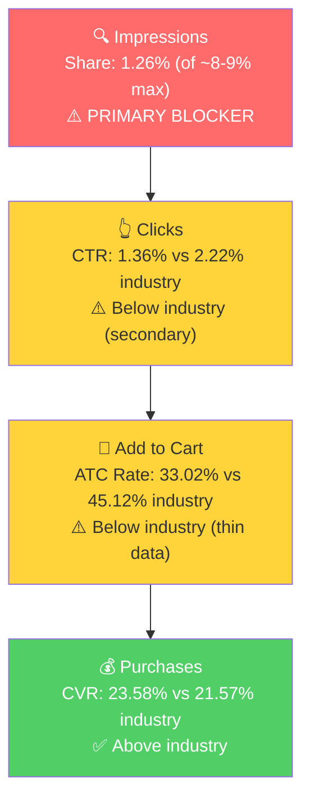

# SQP Analysis - Celebration Stadium (P1: 100 Tall Gold Birthday Candles)

## Tagging Rationale

- **P1 Tier 1 (Hero - Gold Birthday Candles):** Queries where the customer is searching for gold birthday candles specifically. The product is a direct match by its defining attribute (gold color). Queries: gold birthday candles, birthday candles gold.

- **P1 Tier 2 (Core Market - General & Bulk Birthday Candles):** Two sub-segments combined. First, the massive general birthday candle market where the brand competes as one option among many types, colors, and sizes. The product stands out here through its 100-count quantity and gold premium positioning. Second, "bulk" queries that signal B2B purchasing intent (event planners, restaurants, party supply companies). B2B is the primary growth driver per the seller. Queries: birthday candles, birthday candles for cake, birthday candles bulk, bulk birthday candles, birthday candles in bulk, birthday candles bulk packs, birthday candles for cake bulk, bulk pack gold birthday candles, gold birthday candles bulk, bulk gold birthday candles, gold candles bulk.

- **P1 Tier 3 (Adjacent - Attribute & 100-Count Queries):** Queries matching the product's physical characteristics (tall, long, thin, elegant, slow burning) or specific count (100). The product appears but converts weakly on these queries, likely because the gold attribute is what differentiates this product, not "tall" or "long" (many competitors also sell tall candles). Queries: tall birthday candles, long birthday candles, tall birthday candles for cakes, elegant birthday candles, thin birthday candles, 100 candles, 100 candle, 100th birthday candles, 100 count birthday candles, 100 birthday candles, 100 pack birthday candles, slow burning birthday candles.

## Market Sizing

| Tier | Monthly Search Volume | Monthly Add to Carts (Market) | Monthly Purchases (Market) | Est. Market Size ($/mo) |
|------|----------------------|-------------------------------|---------------------------|------------------------|
| P1 Tier 1 (Gold Birthday Candles) | ~7,775 | ~1,918 | ~911 | ~$46,000 |
| P1 Tier 2 (General & Bulk) | ~197,178 | ~30,848 | ~15,322 | ~$308,000* |
| P1 Tier 3 (Attribute & 100-Count) | ~6,993 | ~1,225 | ~484 | ~$15,000 |
| **Total P1** | **~211,946** | **~33,991** | **~16,717** | **~$369,000** |

*Tier 2 market size is estimated at ~$10 average price across the general birthday candle market (mix of $5-8 small packs and $15-25 larger packs). At Celebration Stadium's $24 price point, each captured purchase is worth more than the market average.

**Seasonality:** Search volume is relatively stable across the year. Tier 1 ranged from 6,267/mo (Jun) to 9,466/mo (Jan), roughly a 50% seasonal swing. Tier 2 is steadier at 163K-227K/mo. No dramatic seasonal peaks or troughs, which is consistent with birthday candles being a year-round need (unlike, say, Halloween decorations).

**The contrast with P0 is stark.** The candle holder's addressable market was ~$35,000/month on a single tiny tier. The candles operate in a market 10x that size, with a $46K/month hero tier and access to a $308K/month general market where the brand already converts.

## Market Share and Potential

| Tier | Impression Share | Click Share | Cart Share | Purchase Share | Trend |
|------|-----------------|-------------|------------|---------------|-------|
| P1 Tier 1 | 1.26% | 0.77% | 0.57% | 0.85% | Volatile (thin data) |
| P1 Tier 2 | 0.19% | 0.11% | 0.08% | 0.07% | Stable (near zero) |
| P1 Tier 3 | 0.61% | 0.41% | 0.32% | 0.29% | Volatile (thin data) |

The brand is essentially invisible across all tiers. On Tier 2 (the $308K/month market), the brand captures 0.19% of impressions and 0.07% of purchases. Even on the hero Tier 1, impression share is only 1.26% against a theoretical maximum of ~8-9%.

**The opportunity:** Purchase share exceeds click share on Tier 1 (0.85% vs 0.77%), meaning when the brand does get clicked, it converts at a higher rate than the market average. This is the clearest signal that the product is competitive but underexposed.

## Blockers & Growth Path

| Tier | Impression Share | CTR (Brand vs Industry) | CVR (Brand vs Industry) | Primary Blocker | Growth Path |
|------|-----------------|------------------------|------------------------|-----------------|-------------|
| P1 Tier 1 | 1.26% (of ~8-9% max) | 1.36% vs 2.22% | 23.58% vs 21.57% (above) | Impression Share | PPC scaling: product converts ABOVE industry when it shows up. Scale impressions aggressively through PPC on "gold birthday candles." |
| P1 Tier 2 | 0.19% (of ~8-9% max) | 1.04% vs 1.80% | 10.93% vs 17.24% | Impression Share | PPC scaling with monitoring. Brand converts below industry on this broad market (expected: many searchers want different candle types). But 33 purchases in 3 months at $24/ea from 0.19% impression share means even small share gains yield significant revenue. B2B bulk queries within this tier are the highest-value targets. |
| P1 Tier 3 | 0.61% (of ~8-9% max) | 1.50% vs 2.10% | 8.77% vs 13.12% | Impression Share + CVR | Small market ($15K/mo), weak CVR. Not the priority. Only 5 purchases in 3 months. Deprioritize until Tier 1 and Tier 2 are scaled. |

**The critical finding: P1 Tier 1 CVR is ABOVE industry (23.58% vs 21.57%).** This is the exact opposite of the candle holder (P0), where the product couldn't convert on its target queries due to price mismatch. The candles are competitively priced at $24/100-pack and convert better than the category average when shoppers find them. The growth path is straightforward: increase impression share through PPC.

**Tier 2 CVR context:** The below-industry CVR on Tier 2 (10.93% vs 17.24%) is expected. "Birthday candles" is an extremely broad query encompassing sparklers, number candles, novelty candles, and every color/size. Most searchers want something other than a 100-pack of gold candles. The brand will never match industry CVR on this query. But with 155K monthly searches, even a low conversion rate produces meaningful volume. The 33 purchases from 302 clicks in 3 months at $24 average price = ~$792 in attributable sales from essentially zero targeted effort.

**B2B amplifier:** SQP counts purchases (orders), not units. A B2B buyer purchasing 5 packs in one session counts as 1 purchase but 5 units ($120). The actual revenue impact of these 33 Tier 2 purchases is likely 2-3x higher than the order count suggests, given the product's B2B buyer profile.

### ICAP Funnel: P1 Tier 1 (Gold Birthday Candles)

**Tier 2 is the bigger prize and it's wide open.** The Tier 1 funnel above shows above-industry CVR on "gold birthday candles," but the real scale opportunity is Tier 2. On "birthday candles" alone (155K searches/month), the brand generated 27 purchases from just 179 clicks over 3 months, converting at rates comparable to or above industry. The ad data confirms this: "birthday candles" drives $941 in ad sales at 4.06 ROAS, and "gold birthday candles" drives $957 at 11.37 ROAS. The brand currently captures 0.19% impression share on Tier 2, against a theoretical max of ~8-9%. This means the brand is showing up in roughly 1 out of every 500 possible impressions on the largest birthday candle queries. There is no CVR problem here. There is no listing problem. The product converts when it shows up. It just doesn't show up. Every percentage point of impression share gained on Tier 2 translates directly to revenue, and the ad data already proves the unit economics work.

## Insights

- **P1 (Gold Candles) is the polar opposite of P0 (Candle Holder) in SQP terms.** P0 had a tiny market where the product couldn't convert. P1 has a massive market ($46K Tier 1, $308K Tier 2) where the product converts above industry on hero queries. The growth path is clear and capital-efficient: increase visibility through PPC.
- **The B2B channel amplifies every share point gained.** Because B2B buyers purchase in multi-unit orders, each incremental "purchase" captured in SQP is worth more in revenue than a typical single-unit consumer order. This makes PPC scaling on bulk queries particularly valuable.
- **Branded searches are not a factor for candles.** Unlike the candle holder (where branded queries drove most sales), the candles sell through generic search discovery. This means PPC on non-branded queries is the primary growth lever, not branded defense.
- **The product converts on "birthday candles" (155K/mo) despite being a niche offering in that space.** The likely mechanism: B2B bulk buyers scrolling for quantity see the "100 GOLD BIRTHDAY CANDLES" listing and click because it stands out from the 12-24 count competition. This is a naturally occurring differentiation that PPC can amplify.

## Things to Investigate Further

- Is ad spend currently going to "gold birthday candles" and "birthday candles" (the queries that convert), or is it concentrated on lower-volume/non-converting terms? (Step 4)
- What search terms are driving the auto campaign's 4.37 ROAS? These should be harvested into dedicated manual campaigns. (Step 4)
- Is there an opportunity to bid on "birthday candles bulk" (2,366/mo) where the brand has 54 clicks and 2 purchases but no dedicated campaign? (Step 4)

## Questions for the Seller

- What percentage of candle orders are Amazon Business (B2B) vs regular consumer? If we scale PPC on bulk queries, understanding the B2B order size helps us calculate the real ROI beyond what SQP shows (orders vs units).
