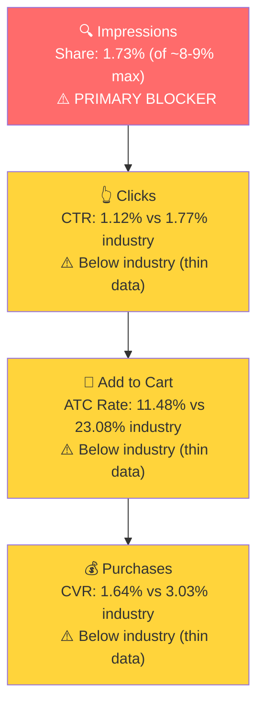

# SQP Analysis - Celebration Stadium (P0: Candle Holder)

## Tagging Rationale

- **Tier 1 (Hero):** Queries where the customer is searching for exactly a birthday candle holder. The product is the direct answer to the search. Queries: birthday candle holder, birthday candle holders, birthday cake candle holders, birthday candle holder stand, birthday candle holders for cake, birthday candle holders reusable, reusable birthday candle holders, birthday candle holder grandstand.

- **Tier 2 (Core market - Milestone Decorations 70-100):** Queries for milestone birthday decorations at ages where 70-100 individual candles is a realistic concept. The candle holder is one possible product but not the primary intent. Shoppers here are looking for party supplies (balloons, banners, plates, table decor). Queries: 70th birthday decorations, 80th birthday decorations, 90th birthday decorations, 100th birthday decorations, and gender-specific variants.

- **Tier 3 (Broad/Adjacent - Milestone Decorations 50-60):** Broader milestone birthday queries at lower ages where the "one candle per year" concept is less compelling. Even less relevant to the candle holder. Queries: 50th birthday decorations, 60th birthday decorations, and gender-specific variants.

- **Branded:** Celebration Stadium, candle stadium, birthday candle stadium, stadium candle holder for birthday, etc. These are shoppers who already know the brand. Tagged separately. Not counted in market sizing.

**Honest assessment of tier relevance:**
- Tier 1 is the only tier where the product matches search intent. But it is a tiny market.
- Tier 2 and Tier 3 have massive volume but the product is a poor intent match. When someone searches "80th birthday decorations," Amazon shows balloons, banners, plates, and party supplies at $10-25. A $90 candle holder grandstand is not what they expect or want. The brand gets impressions but essentially never converts.
- Branded queries drive the majority of actual candle holder sales. The product's primary sales channel is awareness-driven (DTC, social, word of mouth), not Amazon search discovery.

## Market Sizing

| Tier | Monthly Search Volume | Monthly Add to Carts (Market) | Monthly Purchases (Market) | Est. Market Size ($/mo) |
|------|----------------------|-------------------------------|---------------------------|------------------------|
| Tier 1 (Birthday Candle Holder) | ~4,700 | ~390 | ~62 | ~$35,000 |
| Tier 2 (70-100th Birthday Decorations) | ~225,600 | ~50,000 | ~15,700 | Not addressable* |
| Tier 3 (50-60th Birthday Decorations) | ~296,700 | ~62,300 | ~18,900 | Not addressable* |

*Tier 2 and Tier 3 market sizes are calculated at the ~$25 avg price of birthday decorations. The candle holder at $90 is not competing in these markets. These tiers are listed for context but are not capturable revenue.

**Tier 1 is the candle holder's addressable market on Amazon search: approximately $35,000/month.** Even capturing a dominant share (20%) would yield ~$7,000/month in incremental sales. The product is currently doing $2,700-4,600/month in total (including branded searches and ads), so there is some room to grow within Tier 1, but the ceiling is inherently low.

**Seasonality note:** Tier 1 search volume roughly doubled in Jan-Feb 2026 (~10K/mo) vs the Mar-Nov 2025 average (~3,500/mo). This may indicate a seasonal bump in early-year birthday planning, or it could be an artifact of the SQP query matching more queries in that period. The 12-month average smooths this out.

## Market Share and Potential

| Tier | Impression Share | Click Share | Cart Share | Purchase Share | Trend |
|------|-----------------|-------------|------------|---------------|-------|
| Tier 1 | 1.73% | 1.09% | 0.54% | 0.59% | Declining |
| Tier 2 | 0.02% | 0.02% | <0.01% | <0.01% | Negligible |
| Tier 3 | 0.02% | 0.02% | <0.01% | <0.01% | Negligible |

**Tier 1** is the only tier with any meaningful brand presence, and even there, share is low and declining:
- Impression share dropped from 2.1% (Dec) to 1.3% (Feb)
- Click share dropped from 1.6% (Dec) to 0.7% (Feb)
- Purchase share: 2 total brand purchases in 3 months across all Tier 1 queries

**Tier 2 and Tier 3** share is essentially zero. The brand is invisible in these markets, and this is expected given the intent mismatch.

## Blockers & Growth Path

| Tier | Impression Share | CTR (Brand vs Industry) | CVR (Brand vs Industry) | Primary Blocker | Growth Path |
|------|-----------------|------------------------|------------------------|-----------------|-------------|
| Tier 1 | 1.73% (of ~8-9% max) | 1.12% vs 1.77% | 1.64% vs 3.03% | Impression Share | Low impression share + below-industry CVR. PPC lever: bid on "birthday candle holder" queries. But the market is small (~$35K/mo total), so the absolute growth potential is limited. |
| Tier 2 | 0.02% | 2.15% vs 2.08% | 3.33% vs 12.01% | Intent Mismatch | Not capturable. The product does not match the search intent for "birthday decorations" queries. Scaling impressions here would burn budget without converting. |
| Tier 3 | 0.02% | N/A | N/A | Intent Mismatch | Same as Tier 2. Even broader queries with even less relevance. Skip. |

**Blocker detail for Tier 1:**
- Impression share is the primary blocker at 1.73%, well below the ~8-9% max. The brand is not showing up enough.
- CVR is a secondary concern: 1.64% brand vs 3.03% industry (46% below). However, the base numbers are extremely thin (122 brand clicks, 2 purchases in 3 months), so this CVR comparison is not statistically significant. The CVR gap could reflect the product's $90 price point vs cheaper alternatives in search results rather than a listing issue.
- CTR is also below industry (1.12% vs 1.77%, 37% gap) but again, thin data makes this unreliable.

**Statistical significance caveat:** All Tier 1 brand metrics are based on ~40 clicks and <1 purchase per month. These numbers are too small to draw confident conclusions about CTR or CVR blockers. The impression share finding (1.73%) is the most reliable metric because it's based on thousands of impressions.

### ICAP Funnel: Tier 1 (Birthday Candle Holder)

## Insights

- **P0 (Candle Holder) has a very small addressable search market on Amazon.** The total "birthday candle holder" query universe is ~4,700 searches/month with ~$35K/month in market-wide cart value. This is an inherently niche product with limited search-driven discovery potential. The growth ceiling through Amazon search optimization alone is low.
- **Branded searches drive the majority of candle holder sales.** Queries like "celebration stadium," "candle stadium," and "birthday candle grandstand" (all branded) account for far more carts and purchases than non-branded Tier 1 queries. The product sells to people who already know it exists, not to people discovering it through category search.
- **Tier 2/3 milestone birthday decoration queries are not capturable.** Despite massive volume (225K-297K searches/mo), the product is a $90 specialty item competing against $10-25 balloons and banners. The intent mismatch means scaling ads on these queries would waste budget. The brand already gets some impressions on these queries and almost never converts.

## Things to Investigate Further

- Are the current ad campaigns targeting Tier 1 "birthday candle holder" queries, or is spend going to the broad/irrelevant Tier 2/3 queries that cannot convert? (Step 4)
- What is the spend vs return on branded keyword campaigns? If branded searches are the main conversion driver, is there a branded defense campaign in place? (Step 4)

## Questions for the Seller

- Given the small addressable market on Amazon search, what is driving new customer awareness? Is it social media, DTC marketing, press, word of mouth? Understanding this helps determine whether the growth strategy should be Amazon-focused (PPC/listing optimization) or awareness-focused (off-Amazon marketing driving branded searches).
