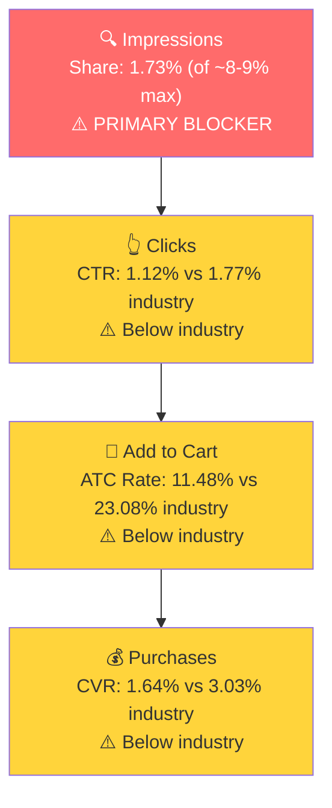
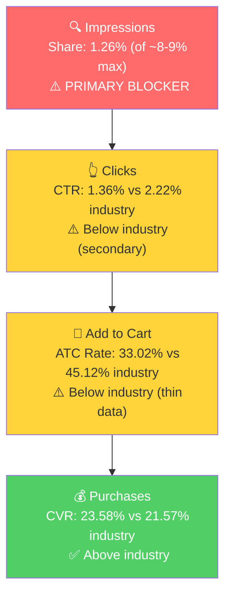

# Seller Central Audit - Celebration Stadium

## Section 1: Catalog Assessment

| Priority | Product | 3-Mo Sales | 3-Mo Ad Spend | ROAS | TACoS | Organic Sales | Ad Sales % | Buy Box % | CVR | Trend |
|----------|---------|-----------|--------------|------|-------|---------------|-----------|-----------|-----|-------|
| P0 | Candle Holder Grandstand and Tray | $10,004 | $2,405 | 1.75 | 24.0% | $5,799 | 42% | ~100%* | 2.1% | Declining |
| P1 | 100 Tall Gold Birthday Candles | $29,819 | $1,524 | 3.32 | 5.1% | $24,762 | 17% | ~100% | 35.6% | Stable |
| P2 | Birthday Cake Tray | $872 | $73 | 7.53 | 8.4% | $322 | 63% | 66.7% | 5.8% | Growing (small) |
| P3 | Custom Cake Topper | $0 | $0 | - | - | $0 | - | 0% | - | Dead |

*Buy box is ~100% on all actual selling children. The 75% reported at parent level is a data artifact from a virtual parent ASIN with 0% buy box and <2 sessions/month.

The catalog has 9 additional parent ASINs (bundle variations in silver, white, and mirror finishes). All generated $0 in sales over the 3-month window. These appear to be fragmented listings that could benefit from consolidation.

## Section 2: Product Understanding

### P0 - Candle Holder Grandstand and Tray ($90)

A modular, flame-resistant candle holder grandstand that displays up to 100 birthday candles surrounding a cake. Patented design with 10 stackable modules. Purchase motivation is emotional and event-driven: milestone birthdays (50th through 100th) where the blowing-out moment is the celebration centerpiece. No direct competitors exist. Celebration Stadium created and owns this niche.

### P1 - 100 Tall Gold Birthday Candles ($24)

A 100-pack of 3.25-inch tall gold birthday candles. Slow burn, minimal drip, premium metallic finish. Originally designed as a companion product for the candle holder, but has outgrown it in revenue (3x the sales). Two buyer segments: Celebration Stadium ecosystem buyers (candle refills) and B2B bulk buyers (event planners, restaurants, party supply companies). B2B is the primary growth driver. Competitively priced at $0.24/candle vs PHD CAKE (#1 Best Seller) at $0.21/candle for 24-count packs. The 100-count pack size is the key differentiator, no premium competitor offers this quantity.

### Annual Trends

**P0 (Candle Holder):**

| Metric | Mar 2025 (Peak) | Jun 2025 | Sep 2025 | Dec 2025 | Feb 2026 (Latest) |
|--------|----------------|----------|----------|----------|-------------------|
| Total Sales | $7,131 | $6,292 | $6,272 | $2,675 | $2,669 |
| Sessions | 4,319 | 2,759 | 2,235 | 1,346 | 1,100 |
| CVR | 1.76% | 2.39% | 2.95% | 2.08% | 2.73% |

Sales declined ~63% from peak. The product was generating $5-7K/month organically with zero ad spend through most of 2025, but has been declining steadily. CVR is inherently low (2-3%) for a $90 niche product.

**P1 (Gold Candles):**

| Metric | Dec 2024 | Mar 2025 | Jul 2025 | Nov 2025 (Peak) | Feb 2026 (Latest) |
|--------|----------|----------|----------|----------------|-------------------|
| Total Sales | $2,802 | $4,709 | $5,522 | $7,756 | $5,500 |
| Sessions | 379 | 866 | 764 | 1,138 | 546 |
| CVR | 26.9% | 21.7% | 26.7% | 27.6% | 43.4% |
| Organic % | 100% | 100% | 100% | 100% | 60.7% |

Strong organic growth: sales nearly tripled from $2.8K/month to $7.8K/month over 12 months with zero ad spend. The 43.4% CVR in Feb 2026 is a B2B signal, bulk orders drive high CVR because one session purchases multiple units. Ads were only introduced in Dec 2025.

### Listing Quality

**Strengths (both products):**
- Premium A+ content with lifestyle imagery and product ecosystem cross-sells
- Brand store active. Multiple videos including setup guides and product demos
- Good bullet point structure with all-caps first word for scannability

**Opportunities (both products):**
- **Lifestyle images are missing.** This is a brand that sells on emotion. A daughter buying a candle holder for her grandfather's 80th birthday, a family gathered around 100 lit candles, the moment before the blow. These images trigger the emotional purchase decision and are currently absent from both listings. The product images are functional but not aspirational.
- **Titles are not optimized for mobile.** Key information like "100 Pieces" and "3.25 Inches" needs to be in the first 80 characters, where mobile shoppers see the title. Currently, this information is buried toward the end and gets cut off on mobile.
- **Bullet points are too long.** Dense, paragraph-length bullets reduce readability and hurt conversion. Shorter, punchier bullets that lead with the benefit and close with the proof point convert better on Amazon.
- **Infographic design quality needs improvement.** The current infographics are functional but don't match the premium positioning of the brand. Higher-quality design with cleaner layouts, better typography, and more polished visuals would strengthen the brand perception, especially against competitors like PHD CAKE with polished listings.

## Section 3: Market Opportunity (SQP)

### P0 - Candle Holder

**Tier Breakdown:**

- **Tier 1 (Hero):**
  - **Keywords:** birthday candle holder, birthday candle holders, birthday cake candle holders, birthday candle holder stand, birthday candle holders for cake, birthday candle holders reusable, reusable birthday candle holders, birthday candle holder grandstand
  - **Rationale:** Exact product-type queries. The customer is looking for a birthday candle holder. The product is the direct answer.

- **Tier 2/3 (Milestone Birthday Decorations):**
  - **Keywords:** 50th/60th/70th/80th/90th/100th birthday decorations (plus gender-specific variants)
  - **Rationale:** Milestone birthday decoration queries across all milestone ages. Massive search volume. The candle holder can appear as a premium, differentiated option among party supplies.

**Market Sizing:**

| Tier | Monthly Search Volume | Monthly Add to Carts (Market) | Monthly Purchases (Market) | Est. Market Size ($/mo) |
|------|----------------------|-------------------------------|---------------------------|------------------------|
| Tier 1 (Birthday Candle Holder) | ~4,700 | ~390 | ~62 | ~$35,000 |
| Tier 2/3 (Milestone Decorations) | ~522,300 | ~112,300 | ~34,600 | ~$500,000 |
| **Total P0** | **~527,000** | **~112,690** | **~34,662** | **~$535,000** |

**Blockers & Growth Path:**

| Tier | Impression Share | CTR (Brand vs Industry) | CVR (Brand vs Industry) | Primary Blocker | Growth Path |
|------|-----------------|------------------------|------------------------|-----------------|-------------|
| Tier 1 | 1.73% (of ~8-9% max) | 1.12% vs 1.77% | 1.64% vs 3.03% | Impression Share | PPC scaling with dedicated exact match campaigns and proper budget per keyword. The product has never been properly tested on these queries. |
| Tier 2/3 | 0.02% | N/A (thin data) | N/A (thin data) | Impression Share | Large market to test. The brand has some early conversions on milestone decoration queries. Requires structured testing with proper campaigns. |

**ICAP Funnel: Tier 1 (Birthday Candle Holder)**

The funnel is weak at every stage, but the base numbers are extremely thin (122 brand clicks, 2 purchases in 3 months). Statistical significance is too low to draw definitive conclusions. The impression share blocker must be solved first before we can accurately measure CTR and CVR performance.

---

### P1 - Gold Candles

**Tier Breakdown:**

- **P1 Tier 1 (Hero - Gold Birthday Candles):**
  - **Keywords:** gold birthday candles, birthday candles gold
  - **Rationale:** Direct product match by the defining attribute (gold color). The product is exactly what the shopper is looking for.

- **P1 Tier 2 (Core Market - General & Bulk Birthday Candles):**
  - **Keywords:** birthday candles, birthday candles for cake, birthday candles bulk, bulk birthday candles, birthday candles in bulk, birthday candles bulk packs, birthday candles for cake bulk, bulk pack gold birthday candles, gold birthday candles bulk, bulk gold birthday candles, gold candles bulk
  - **Rationale:** The massive general birthday candle market plus bulk/B2B queries. The product stands out through its 100-count quantity and gold premium positioning. B2B buyers searching for quantity find this product naturally.

- **P1 Tier 3 (Adjacent - Attribute & 100-Count):**
  - **Keywords:** tall birthday candles, long birthday candles, tall birthday candles for cakes, elegant birthday candles, thin birthday candles, 100 candles, 100 candle, 100th birthday candles, 100 count birthday candles, 100 birthday candles, 100 pack birthday candles, slow burning birthday candles
  - **Rationale:** Queries matching the product's physical attributes or count. Product appears but converts weakly, because "gold" is the differentiating attribute, not "tall."

**Market Sizing:**

| Tier | Monthly Search Volume | Monthly Add to Carts (Market) | Monthly Purchases (Market) | Est. Market Size ($/mo) |
|------|----------------------|-------------------------------|---------------------------|------------------------|
| P1 Tier 1 (Gold Birthday Candles) | ~7,775 | ~1,918 | ~911 | ~$46,000 |
| P1 Tier 2 (General & Bulk) | ~197,178 | ~30,848 | ~15,322 | ~$308,000 |
| P1 Tier 3 (Attribute & 100-Count) | ~6,993 | ~1,225 | ~484 | ~$15,000 |
| **Total P1** | **~211,946** | **~33,991** | **~16,717** | **~$369,000** |

**Blockers & Growth Path:**

| Tier | Impression Share | CTR (Brand vs Industry) | CVR (Brand vs Industry) | Primary Blocker | Growth Path |
|------|-----------------|------------------------|------------------------|-----------------|-------------|
| P1 Tier 1 | 1.26% (of ~8-9% max) | 1.36% vs 2.22% | 23.58% vs 21.57% (above) | Impression Share | PPC scaling: product converts ABOVE industry when it shows up. Scale impressions aggressively. |
| P1 Tier 2 | 0.19% (of ~8-9% max) | 1.04% vs 1.80% | 10.93% vs 17.24% | Impression Share | PPC scaling. 33 purchases in 3 months from 0.19% impression share. Massive upside. |
| P1 Tier 3 | 0.61% (of ~8-9% max) | 1.50% vs 2.10% | 8.77% vs 13.12% | Impression Share + CVR | Small market, deprioritize until Tier 1 and 2 are scaled. |

**ICAP Funnel: P1 Tier 1 (Gold Birthday Candles)**

**P1 Tier 2 is the biggest growth opportunity in this entire audit.** On "birthday candles" alone (155K searches/month), the brand generated 27 purchases from just 179 clicks over 3 months, converting at rates comparable to industry. The ad data confirms this: "birthday candles" drives $941 in ad sales at 4.06 ROAS, and "gold birthday candles" drives $957 at 11.37 ROAS. The brand currently captures 0.19% impression share on Tier 2, against a theoretical max of ~8-9%. There is no CVR problem. There is no listing problem. The product converts when it shows up. It just does not show up. Every percentage point of impression share gained on Tier 2 translates directly to revenue, and the ad data already proves the unit economics work.

## Section 4: Ad Analysis

### Account Level

**Auto vs Manual Split**

| Targeting Type | Clicks | Spend | Sales | ROAS | AOV | CPC | CVR |
|----------------|--------|-------|-------|------|-----|-----|-----|
| Automatic | 3,011 | $3,192 | $9,316 | 2.92 | $63.38 | $1.06 | 4.88% |
| Manual | 1,286 | $1,341 | $5,113 | 3.81 | $70.04 | $1.04 | 5.68% |

> **Finding: 70% of ad spend is on auto, indicating passive account management**
>
> **Problem:**
> - A single catch-all auto campaign ("SP - Auto - Catch All - Top 5 ASINs") consumes $2,506, which is 55% of the entire account's ad budget
> - Manual campaigns outperform auto (3.81 ROAS vs 2.92 ROAS, 5.68% CVR vs 4.88% CVR) but only receive 30% of spend
> - This pattern indicates the harvest-and-scale loop is not functioning. Amazon's algorithm is finding customers through auto, but the winning search terms are never being extracted into dedicated manual campaigns with controlled bids and budgets
>
> **Solution:**
> - Mine the auto campaign's converting search terms and launch dedicated manual exact campaigns
> - Reduce the auto catch-all daily budget to prevent it from consuming the majority of spend
> - Negate harvested terms from auto to avoid duplicate spend
>
> **Impact:**
> - Every $100 shifted from Auto (2.92 ROAS) to Manual (3.81 ROAS) yields ~$89 more in sales

**Match Type Breakdown**

| Match Type | Clicks | Spend | Sales | ROAS | AOV | CPC | CVR |
|------------|--------|-------|-------|------|-----|-----|-----|
| BROAD | 1,579 | $1,608 | $2,465 | 1.53 | $68.47 | $1.02 | 2.28% |
| PHRASE | 1,005 | $886 | $2,481 | 2.80 | $72.98 | $0.88 | 3.38% |
| EXACT | 101 | $96 | $329 | 3.42 | $54.81 | $0.95 | 5.94% |

> **Finding: Broad match gets 62% of manual spend at borderline ROAS, while Exact match is almost completely unfunded**
>
> **Problem:**
> - Broad match burns $1,608 at just 1.53 ROAS and 2.28% CVR. This is the mechanism behind the impression share blocker: spend is scattered across hundreds of broad-matched terms, so no single keyword gets enough budget to build meaningful impression share
> - Exact match, which delivers the best ROAS (3.42) and CVR (5.94%), receives only $96 in total spend, just 4% of what Broad gets
> - This is why impression share is 1.26-1.73% across both products: the budget is spread thin over hundreds of loosely matched keywords instead of concentrated on the queries that actually convert
>
> **Solution:**
> - Identify top converting search terms from Broad/Phrase and create dedicated Exact match campaigns
> - Reduce Broad match budgets across the account
> - Each Exact campaign should have 2-3 keywords max with its own daily budget
>
> **Impact:**
> - Shifting $500 from Broad (1.53 ROAS) to Exact (3.42 ROAS) yields ~$945 more in sales from the same spend

**Keyword vs Product Targeting:**

| Targeting Strategy | Clicks | Spend | Sales | ROAS | AOV | CPC | CVR |
|-------------------|--------|-------|-------|------|-----|-----|-----|
| Keyword Targeting | 5,210 | $4,820 | $12,411 | 2.57 | $65.67 | $0.93 | 3.63% |
| Product Targeting | 1,832 | $1,796 | $3,650 | 2.03 | $68.86 | $0.98 | 2.89% |

Keyword targeting outperforms product targeting on ROAS (2.57 vs 2.03) and CVR (3.63% vs 2.89%). Focus scaling efforts on keyword targeting.

**Placement Performance:**

| Placement | Spend | Sales | ROAS | CTR | CVR |
|-----------|-------|-------|------|-----|-----|
| Top of Search | $2,479 | $9,474 | 3.82 | 2.51% | 6.98% |
| Rest of Search | $2,211 | $3,609 | 1.63 | 0.48% | 2.12% |
| Product Pages | $1,801 | $2,888 | 1.60 | 0.29% | 2.36% |
| Off Amazon | $115 | $90 | 0.78 | 0.30% | 0.18% |

Top of Search is overwhelmingly the strongest placement: 3.82 ROAS and 6.98% CVR. It generates 59% of ad sales from 37% of spend. Increasing Top of Search bid modifiers across all campaigns is the single highest-impact efficiency lever.

**Campaign Profitability**

| Campaign | Spend | Sales | ROAS | Clicks | Orders |
|----------|-------|-------|------|--------|--------|
| SP - ASIN - COMP - Exact - Tall Gold Candles | $66 | $80 | 1.21 | 84 | 2 |
| SP - KW - Broad Mod - Tall Gold Candles | $37 | $40 | 1.08 | 40 | 1 |
| SP - KW - Phrase - Gold Birthday Candle (Scavenger) | $59 | $40 | 0.68 | 75 | 1 |
| SP - SQP - KW - Broad - Tall Gold Candles MAG 3 | $49 | $0 | 0.00 | 56 | 0 |
| SP - SQP - KW - Phrase - Tall Gold Candles MAG 2 | $36 | $0 | 0.00 | 37 | 0 |
| **Total unprofitable** | **$247** | **$160** | **0.65** | **292** | **4** |

These campaigns should be paused or restructured. The $247 in spend on below-threshold campaigns can be reallocated to proven keywords.

---

### Product Level: P0 (Candle Holder)

**P0 Campaign Map**

| Product | Spend | Sales | ROAS | Clicks | Orders | % of Account |
|---------|-------|-------|------|--------|--------|-------------|
| P0 - Candle Holder | $4,066 | $6,351 | 1.56 | 4,579 | 73 | 61% |
| P1 - Gold Candles | $2,206 | $6,787 | 3.08 | 1,889 | 127 | 33% |
| Other | $344 | $2,922 | 8.49 | 569 | 42 | 5% |

P0 consumes 61% of total ad spend but returns only 1.56 ROAS. The low ROAS is a direct result of the campaign structure problems identified above: broad match, scavenger campaigns with hundreds of targets, and no keyword-level budget control.

**Impression Share Blocker: Scattered Spend Instead of Focused Keywords**

SQP identified impression share as the primary blocker on Tier 1 queries (1.73% of ~8-9% max). The PPC lever is to bid on those keywords with dedicated budget. Here is what the current agency has been doing instead:

| Search Term | Spend | Sales | Clicks | Orders | Issue |
|-------------|-------|-------|--------|--------|-------|
| birthday candle holder | $137 | $0 | 109 | 0 | Spent through broad/scavenger, never tested in dedicated exact |
| birthday candle holder cake | $82 | $0 | 86 | 0 | Same issue |
| reusable birthday candles | $77 | $0 | 44 | 0 | Wrong product (candles, not holder) |
| number candle holder | $51 | $0 | 33 | 0 | Irrelevant product |
| number candle holder set | $48 | $0 | 43 | 0 | Irrelevant product |
| 60th birthday decorations | $47 | $90 | 38 | 1 | Broad match leakage |
| sparkler candles | $27 | $0 | 29 | 0 | Irrelevant product |
| cake sparklers | $22 | $0 | 26 | 0 | Irrelevant product |
| **Total wasted** | **$491** | **$90** | **408** | **1** | |

The agency spread $4,066 across scavenger campaigns with 234+ targets in a single campaign, used broad match that bled into irrelevant queries, and never negated non-converting terms for 90 days. The relevant candle holder keywords ("birthday candle holder," "birthday candle holders for cake") were never given dedicated exact match campaigns with proper budget. With a $90 AOV product, you need at least $90-180 per keyword before you can determine if it converts. Most keywords never reached that threshold because the budget was split across hundreds of targets.

The impression share blocker is real and solvable. The keywords have not been properly tested yet.

---

### Product Level: P1 (Gold Candles)

**P1 Campaign Map**

| Campaign | Spend | Sales | ROAS | Clicks | Orders |
|----------|-------|-------|------|--------|--------|
| SP - Auto - Catch All - Top 5 ASINs | $1,117 | $4,889 | 4.37 | 832 | 86 |
| SP - SKW - Broad - gold birthday candles | $307 | $602 | 1.96 | 191 | 12 |
| SP - KW - Phrase - Gold Candles | $111 | $199 | 1.79 | 53 | 5 |
| All other manual P1 campaigns (25+) | $671 | $1,097 | 1.64 | 786 | 24 |
| **P1 Total** | **$2,206** | **$6,787** | **3.08** | **1,862** | **127** |

The auto catch-all generates 72% of P1 ad revenue. This is the same pattern as the account level: Amazon's auto algorithm has found the winning terms, but they have never been harvested into manual campaigns.

**Impression Share Blocker: Auto Found the Winners, Nobody Scaled Them**

SQP identified impression share as the primary blocker on P1 Tier 1 (1.26%) and Tier 2 (0.19%). The auto campaign has already identified the keywords that convert:

**Top converters inside the auto catch-all:**

| Search Term | Tier | Spend | Sales | ROAS | Clicks | Orders |
|-------------|------|-------|-------|------|--------|--------|
| birthday candles | P1 Tier 2 | $149 | $742 | 4.98 | 78 | 16 |
| gold birthday candles | P1 Tier 1 | $49 | $867 | 17.69 | 26 | 13 |
| gold candles | Adjacent | $17 | $355 | 21.09 | 11 | 4 |
| slow burning birthday candles | P1 Tier 3 | $9 | $180 | 19.51 | 4 | 2 |

**Wasted spend in the same auto campaign:**

| Search Term | Spend | Sales | Clicks | Orders |
|-------------|-------|-------|--------|--------|
| b00b51budo (competitor ASIN) | $78 | $0 | 68 | 0 |
| b08x6lyl5v (competitor ASIN) | $59 | $0 | 40 | 0 |
| b00hw59wku (competitor ASIN) | $52 | $0 | 38 | 0 |
| number candle holder set | $28 | $0 | 16 | 0 |
| birthday decorations (various) | $58 | $0 | 23 | 0 |
| sparkler/firework candles | $30 | $0 | 24 | 0 |
| **Total wasted** | **$305** | **$0** | **209** | **0** |

> **Finding: "gold birthday candles" converts at 17.69 ROAS in auto but has never been given a dedicated campaign**
>
> **Problem:**
> - The auto campaign discovered that "gold birthday candles" generates $867 from $49 in spend (17.69 ROAS) and "birthday candles" generates $742 from $149 (4.98 ROAS)
> - These winners are competing for budget with $305 in completely wasted spend on non-converting ASINs, milestone decoration queries, and sparkler candle queries
> - The manual campaigns target "tall gold candles" variations instead, which collectively generate 2.07 ROAS across $280 in spend
> - "Birthday candles bulk" (2,366/mo search volume, B2B-relevant) has zero dedicated campaigns
>
> **Solution:**
> - Harvest: Create dedicated exact campaigns for "birthday candles" and "gold birthday candles"
> - Expand: Create a "birthday candles bulk" campaign targeting B2B queries
> - Negate: Remove wasted ASINs and irrelevant terms from auto
> - Pause: Unprofitable "tall gold candles" campaigns ($144 combined below-threshold spend)
>
> **Impact:**
> - "gold birthday candles" scaled from $49 to $200/month at a conservative 10x ROAS = $2,000/month in sales
> - "birthday candles" scaled from $149 to $400/month at 4x ROAS = $1,600/month in sales
> - Combined: $3,600+/month in incremental ad sales from keyword reallocation alone

**Seller-Level Search Term Performance (P1):**

| Search Term | Tier | Spend | Sales | ROAS | Orders |
|-------------|------|-------|-------|------|--------|
| birthday candles | P1 Tier 2 | $232 | $941 | 4.06 | 20 |
| gold birthday candles | P1 Tier 1 | $84 | $957 | 11.37 | 14 |
| gold candles | Adjacent | $45 | $435 | 9.60 | 6 |
| gold candles birthday | P1 Tier 1 | $20 | $40 | 2.02 | 1 |
| birthday candles gold | P1 Tier 1 | $18 | $40 | 2.14 | 1 |

These are the keywords the account should be scaling. Combined: $399 spend, $2,412 sales, 6.05 ROAS.

## Section 5: Action Plan

**The common thread across both products:** Impression share is the primary blocker. The current agency manages the account passively: 70% of spend on auto, manual campaigns using broad/phrase match that scatters budget across hundreds of keywords, zero negative keyword management, and no dedicated exact match campaigns for proven winners. The fix is straightforward: concentrate spend on the keywords that convert using exact match campaigns with proper budgets and Top of Search placement.

#### Weeks 1-2: PPC Restructure (Stop the Waste)

**Clean the auto campaign:**
- Negate all non-converting ASIN targets (b00b51budo, b08x6lyl5v, b00hw59wku) from auto
- Negate irrelevant keyword categories: sparkler/firework candles, number candle holders, milestone decoration queries
- Reduce auto catch-all daily budget to prevent it from consuming 55% of account spend

**Pause unprofitable campaigns:**
- Scavenger campaigns (474 combined targets, $429 spend, $90 sales = 0.21 ROAS)
- "Gold Birthday Candle" Scavenger ($59, 0.68 ROAS)
- Zero-sales "Tall Gold Candles" campaigns ($85 combined, $0 sales)
- Exclude Off Amazon placement account-wide ($115, 0.78 ROAS)

**Launch dedicated exact match campaigns for P1 (candles):**
- "birthday candles" (Exact) with Top of Search bid modifier. This keyword drives $941 at 4.06 ROAS and has 155K monthly searches. It has never had its own campaign.
- "gold birthday candles" (Exact) with Top of Search bid modifier. $957 at 11.37 ROAS. The best-converting keyword in the entire account.
- "birthday candles bulk" (Exact + Phrase). B2B-relevant query with 2,366/mo search volume. No campaign exists for this today.

**Increase Top of Search bid modifiers** across all remaining campaigns. This placement runs at 3.82 ROAS and 6.98% CVR vs 1.6 ROAS elsewhere.

**Set up branded defense:**
- Small exact match campaign for "celebration stadium" and "candle stadium" ($2-3/day). These convert at 15+ ROAS. Not growth spend, just protection.

**Estimated budget freed from waste: ~$800-1,000/quarter**

#### Weeks 2-4: PPC Scaling and Candle Holder Test

**Scale P1 (candles) on proven keywords:**
- Monitor the new exact campaigns from Week 1. As data comes in, increase budgets on keywords maintaining above 3x ROAS
- Add "gold candles" as an exact match campaign (currently $435 in sales at 9.60 ROAS across the account, no dedicated campaign)
- Negate harvested terms from auto to avoid duplicate spend

**Build proper candle holder (P0) campaigns:**
- Create 2-3 dedicated exact match campaigns for candle holder Tier 1 keywords:
  1. "birthday candle holder" (Exact) with $10-15/day budget and Top of Search modifier
  2. "birthday candle holders for cake" + "birthday cake candle holders" (Exact)
  3. "birthday candle holder stand" + "birthday candle holder grandstand" (Exact)
- Max 2-3 keywords per campaign, dedicated budget per keyword
- Run for minimum 3 weeks before evaluating

**Test Tier 2/3 for candle holder:**
- Create a small-budget campaign targeting milestone birthday decoration queries (70th, 80th, 90th, 100th birthday decorations) in exact match
- Low daily budget ($5-10/day) as a structured test
- Evaluate after 3-4 weeks with sufficient data

#### Weeks 4-6: Listing Optimization

**Listing improvements for both products:**
- Create lifestyle images that trigger emotional purchase motivation. Scenes of family celebrations, the moment before blowing out candles, multi-generational birthday settings. These images are critical for a brand that sells on emotion.
- Optimize titles for mobile: key product details (100 Pieces, 3.25 Inches, Milestone Birthdays) in the first 80 characters
- Shorten bullet points for better scannability and conversion
- Upgrade infographic design quality to match the premium brand positioning

**Monitor PPC results:**
- Evaluate candle holder Tier 1 exact match test: each keyword should have spent at least 2x AOV ($180) by now
- If keywords are converting above 3% CVR: scale budgets
- If keywords are below 1% CVR after $180+ spend: pause and reallocate to candles
- Scale candle campaigns based on ROAS performance from Weeks 1-4

#### Weeks 6-8: Scale and Expand

**Scale winning PPC campaigns:**
- Increase budgets on all exact match campaigns maintaining above 3x ROAS
- Add phrase match variants of winning keywords for incremental reach
- Harvest new converting terms from auto and create dedicated campaigns

**Monitor listing impact:**
- Track CVR changes after the listing improvements from Weeks 4-6
- If CVR improves, validate the listing lever and plan the next round (A+ content refresh, additional videos)

**Evaluate secondary products:**
- Assess P2 (Birthday Cake Tray) for ad scaling potential based on P0/P1 learnings
- Review bundle variations for consolidation opportunities

**Seasonal preparation:**
- Birthday product search volume peaks in spring (March-May). Ramp budgets ahead of this window.

## Section 6: Insights & Questions for the Seller

**Insights:**

- **Both products have the same primary blocker: impression share.** P0 (Candle Holder) is at 1.73% and P1 (Gold Candles) is at 1.26% on their hero queries, against a theoretical max of ~8-9%. The brand barely shows up on Amazon search. The root cause is the same for both: ad spend scattered across hundreds of broad-matched keywords and auto campaigns instead of being concentrated on the queries that matter.

- **P1 (Gold Candles) is the immediate growth engine.** The candles convert above industry on hero queries (23.58% vs 21.57%) and the ad data proves it: "gold birthday candles" at 17.69 ROAS and "birthday candles" at 4.06 ROAS are the best-performing keywords in the account, yet they have no dedicated campaigns. This is the lowest-hanging fruit.

- **The account is being managed passively.** 70% of spend on auto, 62% of manual keyword spend on Broad match at 1.53 ROAS, zero Exact match investment ($96 total), no negative keyword management in 90 days, and scavenger campaigns with 234+ targets in a single campaign. The winning search terms are being discovered by Amazon's algorithm but never harvested and scaled.

- **Top of Search is the account's strongest placement** (3.82 ROAS, 6.98% CVR vs 1.6 ROAS elsewhere). No campaigns currently have Top of Search bid modifiers. Adding these across all campaigns is the single highest-impact efficiency improvement.

- **P1's B2B tailwind amplifies PPC scaling.** B2B bulk buyers purchase multiple units per order, meaning each incremental "order" is worth 2-3x a typical consumer order. Scaling PPC on bulk queries ("birthday candles bulk," 2,366/mo search volume, currently untargeted) specifically captures this high-value segment.

**Questions for the Seller:**

- The candle holder sales declined from $7K/month (March 2025) to $2.7K/month (February 2026) while running zero ads for most of that period. Was there a change in DTC marketing, social media activity, or press coverage that correlated with the decline?

- What percentage of candle orders come through Amazon Business (B2B) vs regular consumer? Understanding the B2B order size helps us calculate the true ROI of scaling bulk keyword campaigns.

- There are 9+ parent ASINs with zero sales that appear to be bundle variations. Are these intentionally separate listings, or would consolidating them reduce fragmentation?
