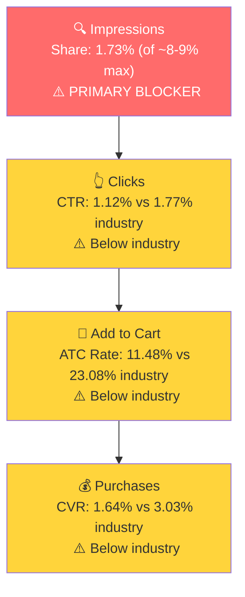

# Seller Central Audit - Celebration Stadium

## Section 1: Catalog Assessment

| Priority | Product | 3-Mo Sales | 3-Mo Ad Spend | ROAS | TACoS | Organic Sales | Ad Sales % | Buy Box % | CVR | Trend |
|----------|---------|-----------|--------------|------|-------|---------------|-----------|-----------|-----|-------|
| P0 | Candle Holder Grandstand and Tray | $10,004 | $2,405 | 1.75 | 24.0% | $5,799 | 42% | ~100%* | 2.1% | Declining |
| P1 | 100 Tall Gold Birthday Candles | $29,819 | $1,524 | 3.32 | 5.1% | $24,762 | 17% | ~100% | 35.6% | Stable |
| P2 | Birthday Cake Tray | $872 | $73 | 7.53 | 8.4% | $322 | 63% | 66.7% | 5.8% | Growing (small) |
| P3 | Custom Cake Topper | $0 | $0 | - | - | $0 | - | 0% | - | Dead |

*Buy box is ~100% on all actual selling children. The 75% reported at parent level is a data artifact from a virtual parent ASIN with 0% buy box and <2 sessions/month.

The catalog has 9 additional parent ASINs (bundle variations in silver, white, and mirror finishes). All generated $0 in sales over the 3-month window. These appear to be fragmented listings that could benefit from consolidation.

**The client requested P0 focus on the Candle Holder for growth.** This audit fully evaluates that opportunity and presents an honest assessment of the growth paths available.

## Section 2: Qualitative Product Understanding (P0)

**Product:**
- A modular, flame-resistant candle holder grandstand that displays up to 100 birthday candles surrounding a cake. Patented design. Includes 100 gold candles. Built from 10 stackable modules.
- Solves a real problem: no other way to put 50-100 individual candles on/around a birthday cake. Each candle = one year of life.
- Purchase motivation is emotional and event-driven. Customers buy for milestone birthdays (50th, 60th, 70th, 80th, 90th, 100th) where the blowing-out moment is the celebration centerpiece.

**Customer:**
- Adult children, grandchildren, or event planners organizing a milestone birthday party for someone 50+
- Purchase driver: the desire to create a special, photo-worthy birthday moment

**Brand:**
- Registered brand with genuine identity. Founded by Knight Merritt (Seattle), a custom model builder who designed the original for a friend's 80th birthday. Now run by family. Patented design.
- DTC-first (celebrationstadium.com), expanded to Amazon, Walmart, Etsy
- Instagram ~1,169 followers (significantly underutilized for a product with strong visual/viral potential)
- Brand vibe: Heartfelt, family-oriented, celebratory. Premium positioning.

**Competitive Landscape:**
- **No direct competitors exist.** Celebration Stadium created and owns the "milestone birthday candle holder" niche. Patented design creates a moat.
- Adjacent competitors are small 9-candle novelty candelabras ($5-15) or number-shaped candles ($5-10), which serve entirely different functions.
- The lack of competition is a double-edged sword: no price pressure, but also no established category awareness. Customers must discover the concept exists before they can search for it.

| Competitor | Product | Price | Notes |
|-----------|---------|-------|-------|
| Genuine Fred | Cake Candelabra | $7-13 | Novelty, 9 candles only |
| LITAUS / generic | Number-Shaped Candles | $5-10 | Completely different concept |
| **No direct competitor** | Large-capacity milestone holder | - | Only Celebration Stadium |

**Listing Quality:**

**Strengths:**
- 9 images, 7 videos (including setup guides and customer video), Premium A+ with 7 modules
- 5 bullets covering key selling points. Brand store active. Rating stable at 4.5 stars.
- Comprehensive content that demonstrates the product concept well

**Opportunities:**
- Main image has text callout clutter at the bottom. A cleaner lifestyle image (candles lit, birthday setting) without text overlay could improve CTR
- Bullet #3 leads with "MADE IN CHINA" before mentioning the patented design, which undermines the premium positioning

## Section 3: Quantitative Product Understanding (P0)

**Annual Trend:**

| Metric | Mar 2025 (Peak) | Jun 2025 | Sep 2025 | Dec 2025 | Feb 2026 (Latest) |
|--------|----------------|----------|----------|----------|-------------------|
| Total Sales | $7,131 | $6,292 | $6,272 | $2,675 | $2,669 |
| Sessions | 4,319 | 2,759 | 2,235 | 1,346 | 1,100 |
| CVR | 1.76% | 2.39% | 2.95% | 2.08% | 2.73% |
| Buy Box % | 99.6% | 99.9% | 99.6% | 100%* | 99.7%* |

*Child-level buy box (B0C2WQ8G64, the primary seller generating ~80% of parent sales).

- Sales declined ~63% from peak ($7,131 in Mar to $2,669 in Feb). Sessions dropped even more steeply (4,319 to 1,100). The product was generating $5-7K/month organically with zero ad spend through most of 2025.
- CVR has always been low (1.8-3.0%). For a $90 niche product, this is partially inherent to the category.

**Rating Trajectory:** Stable at 4.5 stars. Oscillated between 4.3-4.7 since late 2023.

**Sales Rank Trajectory:** Moderate. Currently ~1,400-1,700 in Birthday Candles. Stable with normal daily fluctuation.

## Section 4: Market Opportunity (SQP)

**Tier Breakdown:**

- **Tier 1 (Hero):**
  - **Keywords:** birthday candle holder, birthday candle holders, birthday cake candle holders, birthday candle holder stand, birthday candle holders for cake, birthday candle holders reusable, reusable birthday candle holders, birthday candle holder grandstand
  - **Rationale:** Exact product-type queries. The customer is looking for a birthday candle holder. The product is the direct answer.

- **Tier 2 (Core market):**
  - **Keywords:** 70th/80th/90th/100th birthday decorations (plus gender-specific variants), 100th birthday candle holder
  - **Rationale:** Milestone birthday decoration queries at ages where 70-100 individual candles is realistic. The candle holder is one possible product, but shoppers primarily expect balloons, banners, and party supplies.

- **Tier 3 (Broad/adjacent):**
  - **Keywords:** 50th/60th birthday decorations (plus gender-specific variants)
  - **Rationale:** Broader milestone queries at lower ages where the "one candle per year" concept is less compelling.

**Market Sizing:**

| Tier | Monthly Search Volume | Monthly Add to Carts (Market) | Monthly Purchases (Market) | Est. Market Size ($/mo) |
|------|----------------------|-------------------------------|---------------------------|------------------------|
| Tier 1 | ~4,700 | ~390 | ~62 | ~$35,000 |
| Tier 2 | ~225,600 | ~50,000 | ~15,700 | Not addressable* |
| Tier 3 | ~296,700 | ~62,300 | ~18,900 | Not addressable* |
| **Total P0 (Addressable)** | **~4,700** | **~390** | **~62** | **~$35,000** |

*Tier 2 and Tier 3 are birthday decoration markets at ~$25 avg price. The candle holder at $90 does not compete here. The brand gets impressions on these queries but almost never converts (<0.02% impression share, 0-2 purchases per quarter).

**The candle holder's addressable search market on Amazon is approximately $35,000/month.** This is a small market. Even capturing a dominant 20% share would yield ~$7,000/month.

**Blockers & Growth Path:**

| Tier | Impression Share | CTR (Brand vs Industry) | CVR (Brand vs Industry) | Primary Blocker | Growth Path |
|------|-----------------|------------------------|------------------------|-----------------|-------------|
| Tier 1 | 1.73% (of ~8-9% max) | 1.12% vs 1.77% | 1.64% vs 3.03% | Impression Share | Low visibility, but ad data proves the product doesn't convert on these queries even when shown (109 clicks, 0 orders on "birthday candle holder"). **Not scalable through PPC.** |
| Tier 2 | 0.02% | N/A (thin data) | N/A | Intent Mismatch | Not capturable. Shoppers want party supplies, not a $90 candle holder. |
| Tier 3 | 0.02% | N/A | N/A | Intent Mismatch | Skip. |

**ICAP Funnel: Tier 1 (Birthday Candle Holder)**

- **The funnel is weak at every stage**, but the base numbers are extremely thin (122 brand clicks, 2 brand purchases over 3 months on all Tier 1 queries). Statistical significance is low.
- **The ad data provides the definitive proof:** $137 spent on "birthday candle holder" with 109 clicks and 0 orders. The product does not convert on its own category query through PPC. The likely cause is price mismatch: shoppers expect a $10-20 product, not a $90 grandstand.
- **Branded queries** (celebration stadium, candle stadium) drive the vast majority of actual candle holder conversions. The product sells to people who already know it exists.

## Section 5: Ad Analysis

### Account Level

**Auto vs Manual Split**

| Targeting Type | Clicks | Spend | Sales | ROAS | AOV | CPC | CVR |
|----------------|--------|-------|-------|------|-----|-----|-----|
| Automatic | 3,011 | $3,192 | $9,316 | 2.92 | $63.38 | $1.06 | 4.88% |
| Manual | 1,286 | $1,341 | $5,113 | 3.81 | $70.04 | $1.04 | 5.68% |

> **Finding: Auto campaigns consume 70% of spend at lower ROAS**
>
> **Problem:**
> - A single catch-all auto campaign ("SP - Auto - Catch All - Top 5 ASINs") spends $2,506 (55% of account budget) at 2.45 ROAS
> - Manual campaigns outperform (3.81 vs 2.92 ROAS) but only get 30% of budget
>
> **Solution:**
> - Mine auto search terms, harvest top converters into manual exact/phrase campaigns
> - Reduce auto catch-all daily budget
>
> **Impact:**
> - Every $100 shifted from Auto (2.92 ROAS) to Manual (3.81 ROAS) yields ~$89 more in sales

**Targeting Strategy**

**Keyword vs Product Targeting:**

| Targeting Strategy | Clicks | Spend | Sales | ROAS | AOV | CPC | CVR |
|-------------------|--------|-------|-------|------|-----|-----|-----|
| Keyword Targeting | 5,210 | $4,820 | $12,411 | 2.57 | $65.67 | $0.93 | 3.63% |
| Product Targeting | 1,832 | $1,796 | $3,650 | 2.03 | $68.86 | $0.98 | 2.89% |

**Match Type Breakdown:**

| Match Type | Clicks | Spend | Sales | ROAS | AOV | CPC | CVR |
|------------|--------|-------|-------|------|-----|-----|-----|
| BROAD | 1,579 | $1,608 | $2,465 | 1.53 | $68.47 | $1.02 | 2.28% |
| PHRASE | 1,005 | $886 | $2,481 | 2.80 | $72.98 | $0.88 | 3.38% |
| EXACT | 101 | $96 | $329 | 3.42 | $54.81 | $0.95 | 5.94% |

> **Finding: Broad match is borderline profitable, Exact match is underfunded**
>
> **Problem:**
> - Broad match gets 62% of manual keyword spend at 1.53 ROAS and 2.28% CVR
> - Exact match has 3.42 ROAS and 5.94% CVR but gets only $96 in spend
>
> **Solution:**
> - Graduate winning Broad/Phrase terms into Exact match campaigns
> - Reduce Broad budgets on candle holder campaigns where the terms are too broad to convert
>
> **Impact:**
> - Shifting $500 from Broad (1.53 ROAS) to Exact (3.42 ROAS) yields ~$945 more in sales

### Product Level (P0)

**P0 Campaign Map**

| Product | Spend | Sales | ROAS | Clicks | Orders | % of Account |
|---------|-------|-------|------|--------|--------|-------------|
| P0 - Candle Holder | $4,066 | $6,351 | 1.56 | 4,579 | 73 | 61% |
| P1 - Gold Candles | $2,206 | $6,787 | 3.08 | 1,889 | 127 | 33% |
| Other | $344 | $2,922 | 8.49 | 569 | 42 | 5% |

P0 consumes 61% of total ad spend but returns only 1.56 ROAS. P1 gets 33% of spend and returns 3.08 ROAS.

**Impression Share Blocker: Underspent and Mismanaged Keywords**

SQP identified impression share as the primary blocker on Tier 1 queries (1.73% of ~8-9% max). The PPC lever is to bid on those keywords. Here is what the current agency has spent on candle holder search terms:

| Search Term | Spend | vs AOV ($90) | Sales | Clicks | Orders | Verdict |
|-------------|-------|-------------|-------|--------|--------|---------|
| birthday candle holder | $137 | 1.5x | $0 | 109 | 0 | Needs structured testing |
| birthday candle holder cake | $82 | 0.9x | $0 | 86 | 0 | Under-tested |
| reusable birthday candles | $77 | 0.9x | $0 | 44 | 0 | Wrong product (candles, not holder) |
| number candle holder | $51 | 0.6x | $0 | 33 | 0 | Irrelevant (different product) |
| number candle holder set | $48 | 0.5x | $0 | 43 | 0 | Irrelevant (different product) |
| 60th birthday decorations | $47 | 0.5x | $90 | 38 | 1 | Intent mismatch but did convert once |
| 50th birthday decorations | $39 | 0.4x | $0 | 30 | 0 | Intent mismatch |
| number candle holders | $33 | 0.4x | $0 | 45 | 0 | Irrelevant (different product) |
| 70th birthday decorations | $32 | 0.4x | $0 | 33 | 0 | Intent mismatch |
| candle holder | $28 | 0.3x | $0 | 26 | 0 | Under-tested (too broad alone) |
| sparkler candles | $27 | 0.3x | $0 | 29 | 0 | Irrelevant (different product) |
| birthday candle holders for cake | $23 | 0.3x | $0 | 31 | 0 | Under-tested |
| cake sparklers | $22 | 0.2x | $0 | 26 | 0 | Irrelevant (different product) |

**The critical insight: with a $90 AOV product, you need to spend at least $90-180 per keyword before you can determine if it converts.** Nearly every candle holder keyword has been spent well below this threshold. The agency never gave these keywords a proper test.

Worse, this spend was scattered across "Scavenger" campaigns (129-234 targets per campaign) and broad match, where Amazon's algorithm starves most keywords of budget. The spend also landed primarily in low-CVR placements (Product Pages at 2.36% CVR, Rest of Search at 2.12% CVR) instead of Top of Search (6.98% CVR).

**What the agency got wrong:**
- Relevant keywords ("birthday candle holder," "birthday candle holder cake," "birthday candle holders for cake") were never tested in dedicated exact match campaigns with proper budget
- Irrelevant keywords ("number candle holder," "sparkler candles," "cake sparklers") were never negated, bleeding $250+ to wrong-product queries
- Three "Scavenger" campaigns with 474 combined targets generated $90 in total sales from $429 in spend (0.21 ROAS)
- Amazon's auto-suggested keyword groups were accepted without vetting
- No negative keyword management for 90 days

**What needs to happen:** The candle holder keywords need to be properly tested: dedicated exact match campaigns, sufficient budget per keyword (2-3x AOV), Top of Search bid modifiers, and irrelevant terms negated. The impression share blocker (1.73% of ~8-9% max) means the product barely shows up. We cannot conclude these keywords don't work until they've been tested correctly.

**Placement Performance (Account Level):**

| Placement | Spend | Sales | ROAS | CTR | CVR |
|-----------|-------|-------|------|-----|-----|
| Top of Search | $2,479 | $9,474 | 3.82 | 2.51% | 6.98% |
| Rest of Search | $2,211 | $3,609 | 1.63 | 0.48% | 2.12% |
| Product Pages | $1,801 | $2,888 | 1.60 | 0.29% | 2.36% |
| Off Amazon | $115 | $90 | 0.78 | 0.30% | 0.18% |

Top of Search generates 59% of ad sales from 37% of spend. Increasing Top of Search bid modifiers would improve overall account efficiency.

## Section 6: Action Plan

**The core thesis:** The candle holder's primary blocker is impression share (1.73% of ~8-9% max on Tier 1 queries). The current agency has never properly tested whether PPC can solve this, because the spend was scattered across scavenger campaigns with hundreds of irrelevant targets, broad match types, and low-CVR placements. Before concluding the candle holder can't grow on Amazon, we need to test it correctly.

The action plan has two tracks:
1. **Fix and properly test the candle holder (P0)** with clean campaign structure, correct keywords, and sufficient budget per keyword
2. **Stop the waste and optimize the account** to free up budget for proper testing

#### Weeks 1-2: Immediate Actions (Stop the Waste)

**Kill the waste campaigns:**
- Pause all three Scavenger campaigns immediately. They have 474 combined targets, $429 total spend, and $90 total sales (0.21 ROAS). These are hemorrhaging money on single-word broad targets like "birthday" and "cake stand."
- Negate all irrelevant search terms that will never convert for the candle holder: "number candle holder/set/holders" (different product entirely), "sparkler candles," "cake sparklers," "reusable birthday candles" (candle query, not holder), "happy birthday," "cake stand," "birthday decoration" (standalone). This stops ~$250/quarter in pure waste on wrong-product queries.
- Negate Tier 2/3 birthday decoration queries from candle holder campaigns: "50th/60th/70th/80th birthday decorations." The current agency is targeting "+60th birthday decorations" as a broad match modifier for the candle holder, spending $68 with 0 sales. These are intent mismatches.
- Pause the candle holder's loose match auto campaign ("SP - Auto - Loose - Candle Centerpiece - B07FDLYPLN"): $182 spend, 1.48 ROAS, below profitability.
- Exclude Off Amazon placement account-wide ($115 spend, 0.78 ROAS).

**Reduce the auto catch-all overdependence:**
- Reduce daily budget on "SP - Auto - Catch All - Top 5 ASINs" (currently consuming $2,506, 55% of total account spend, at 2.45 ROAS). This single auto campaign should not be the primary revenue driver.
- Increase Top of Search bid modifiers across all remaining campaigns. Top of Search runs at 3.82 ROAS and 6.98% CVR vs 1.6 ROAS elsewhere. This is the account's biggest efficiency lever.

**Estimated budget freed: ~$800-1,000/quarter** from paused waste campaigns and negated terms, available for proper candle holder testing.

#### Weeks 2-4: Candle Holder Structured Test

**Build proper candle holder campaigns from scratch:**

The impression share blocker means the candle holder barely shows up on its hero keywords. The current agency scattered spend across 129+ targets in a single campaign. The fix is isolated, keyword-specific campaigns with sufficient budget.

Create 3 dedicated exact match campaigns for the candle holder (B0C2WQ8G64):

1. **"birthday candle holder" (Exact)** - The hero keyword. ~4,700 monthly search volume. Currently at 1.73% impression share. Allocate $180-270 budget (2-3x AOV) to properly test this keyword in isolation with a Top of Search bid modifier.

2. **"birthday candle holders for cake" + "birthday cake candle holders" (Exact)** - Secondary Tier 1 queries. ~1,500-2,000 combined monthly volume. Allocate $180 budget to test.

3. **"birthday candle holder stand" + "birthday candle holder grandstand" (Exact)** - Long-tail Tier 1 queries with higher purchase intent. Allocate $90-180 budget.

**Campaign structure rules:**
- Max 2-3 keywords per campaign (dedicated budget per keyword)
- Exact match only (no broad leakage)
- Top of Search bid modifier at 50-100% (pushing to the 6.98% CVR placement)
- $10-15/day budget per campaign
- Run for a minimum of 3 weeks before evaluating

**Listing prep (before scaling PPC):**
- Optimize candle holder main image: remove text callout clutter at the bottom ("Modular Birthday Candle Holder," "Perfect For: 40th, 50th..."). Replace with a clean lifestyle image showing candles lit in a birthday setting. This directly impacts CTR on search results.
- Rewrite bullet #3: remove the "MADE IN CHINA" lead-in. Lead with the patented design and quality messaging instead.

**Branded defense:**
- Maintain a small branded exact match campaign for "celebration stadium" and "candle stadium" ($2-3/day). These convert at 15+ ROAS and protect against competitor poaching. This is not growth spend, it's defensive.

#### Weeks 4-6: Read Results and Scale or Pivot

**Evaluate the structured test:**
- Each keyword should have spent at least 2x AOV ($180) by now. With Top of Search placement:
  - If CVR is above 3% (industry average on Tier 1): the keyword works. Scale budget.
  - If CVR is 1-3%: borderline. Check ROAS vs the 1.5 threshold. Optimize bids.
  - If CVR is below 1% after $180+ spend: the keyword genuinely doesn't convert. Pause it.

**If Tier 1 keywords convert (the growth path):**
- Increase impression share from 1.73% toward 5-6% by scaling the exact match campaigns
- Add phrase match variants of the winning keywords for incremental reach
- The Tier 1 market is ~$35K/month. Capturing 10-15% share = $3,500-5,250/month in candle holder sales through search. Combined with the existing branded/organic sales (~$2,700/month), the candle holder could reach $6,000-8,000/month.

**If Tier 1 keywords don't convert (the pivot):**
- The data will be clean and conclusive (exact match, sufficient budget, Top of Search placement). If it still doesn't convert, the candle holder's growth on Amazon is genuinely limited to branded awareness.
- Pivot ad budget to candle (P1) campaigns where ROAS is proven (4-11x). Candle growth feeds the candle holder funnel: customers buy candles, discover the brand, and find the candle holder through the listing, A+ content, and brand store.

#### Weeks 6-8: Scaling Phase

**Scale what's working:**
- For winning candle holder keywords: expand to phrase match, test additional Tier 1 long-tail queries, increase daily budgets
- Harvest converting search terms from the auto catch-all campaign and add to the manual candle holder campaigns
- Test product targeting on relevant competitor ASINs (birthday candelabras, milestone birthday products), but in dedicated campaigns with controlled budget

**Candle (P1) optimization (parallel track):**
- Regardless of candle holder results, implement the candle campaign improvements: harvest "birthday candles" and "gold birthday candles" from auto into dedicated exact campaigns (these run at 4-11x ROAS and are underfunded)
- Shift candle campaigns from Broad (1.53 ROAS) to Exact (3.42 ROAS)
- The candle business is the brand's Amazon engine and should be scaling regardless

**Listing and content improvements:**
- Monitor CVR impact from the main image and bullet changes made in Week 2-4
- If CVR improves, that validates the listing lever and justifies the next round of listing optimization (A+ content refresh, additional videos)

**Seasonal preparation:**
- Birthday product search volume appears to peak in spring (March-May). Ramp candle holder and candle budgets ahead of this window to capture the seasonal uplift.

## Section 7: Insights & Questions for the Seller

**Insights:**

- **P0 (Candle Holder) has never been properly tested on Amazon PPC.** The current agency scattered $4,066 across scavenger campaigns with 234+ targets, broad match on irrelevant terms, and low-CVR placements. With a $90 AOV, most keywords haven't even received one order's worth of spend. The impression share blocker (1.73% of ~8-9% max) is real and solvable. Before writing off the candle holder, it needs to be tested with dedicated exact match campaigns, sufficient budget per keyword, and Top of Search placement.

- **The current agency is wasting 23% of total ad spend.** $1,528 out of $6,616 (across 93 search terms with zero sales) is going to irrelevant queries that have never been negated. Three "Scavenger" campaigns with 474 combined targets generated $90 from $429 in spend. Amazon's auto-suggested keyword groups were accepted without vetting. No negative keyword management in 90 days.

- **The candle holder's ad spend is misstructured, not necessarily misallocated.** P0 at 1.56 ROAS looks unprofitable, but this is the result of $646 being wasted on irrelevant terms (number candle holders, sparkler candles, birthday decorations) and scavenger campaigns. The relevant keywords ("birthday candle holder," "birthday candle holders for cake") have simply not been given a fair test.

- **Top of Search is the account's strongest placement** (3.82 ROAS, 6.98% CVR vs 1.6 ROAS elsewhere). The candle holder's PPC test must be concentrated in this placement. The current campaigns have no Top of Search bid modifiers.

- **P1 (Gold Birthday Candles) should scale in parallel.** The candles generate strong ROAS (4-11x on core terms) and are underfunded. Candle growth also feeds the candle holder funnel: customers discover the brand through candles and find the candle holder through the listing, A+ content, and brand store.

**Questions for the Seller:**

- The candle holder sales declined from $7K/month (March 2025) to $2.7K/month (February 2026) while running zero ads for most of that period. Was there a change in DTC marketing, social media activity, or press coverage that correlated with the decline? Understanding what drove the peak helps determine whether it can be recreated.

- What is currently driving new customer discovery for the candle holder? Is it social media, DTC site, press, word of mouth, events? Understanding this helps design the right mix of on-Amazon PPC and off-Amazon awareness driving.

- There are 9+ parent ASINs with zero sales that appear to be bundle variations of the candle holder and tray. Are these intentionally separate listings? Consolidating them under fewer parents could reduce session fragmentation and simplify the catalog.
