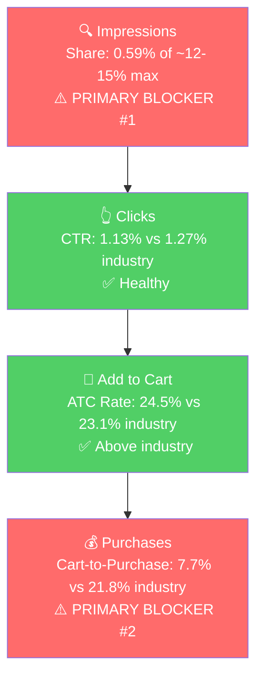

# Step 3: SQP Analysis - P0 (Dog Balloon Animal Piggy Bank)

## Tagging Rationale

The brand has 300+ products in the SQP universe touching everything from picture frames and pizza cutters to cutting boards and jewelry boxes. P0 specifically lives in two adjacent intent worlds: **piggy banks** and **balloon dog decor**. The tier structure separates those.

- **Tier 1 (Hero):** Queries that match the exact product, a ceramic balloon dog piggy bank. The customer is looking for this product specifically. *Queries: dog piggy bank, ceramic balloon dog, ceramic piggy bank.*
- **Tier 2 (Core market):** Generic piggy bank queries. The customer is looking for a piggy bank, P0 is one option among many shapes (pig, unicorn, kids, adult, etc.). Volume is large, intent is less specific. *Queries: piggy bank, piggy bank for adults, piggy bank for kids, piggy banks, adult piggy bank, cute piggy bank, large piggy bank.*
- **Tier 3 (Adjacent / decor):** Balloon dog decor queries. The customer wants a Jeff Koons-style balloon dog as a decor piece, not necessarily as a piggy bank. P0 can serve this audience because the product *is* a balloon dog sculpture, but the listing currently doesn't speak to this buyer. *Queries: balloon dog, balloon dog decor, gold balloon dog, jeff koons balloon dog, balloon dog statue, balloon dog sculpture, balloon animal.*

**Branded queries (skipped as a tier):** "creative gifts international" peaks at ~40 searches/month. Despite the seller mentioning "creative gifts" as a big keyword, the SQP data shows it's a non-meaningful traffic source. Don't build a branded strategy on it.

### Catalog Overlap Check

- **Tier 1:** "dog piggy bank" and "ceramic balloon dog" are dog-specific, only P0 ranks (cap ~8-9%). "ceramic piggy bank" is generic enough that the other ceramic banks in the catalog (Sloth, Flamingo, Swan with Crown, Ombre Unicorn) would also rank, lifting the cap. Adjusted cap for Tier 1 as a whole: **~12-15%** (weighted toward the 8-9% single-product cap because the bigger query, "ceramic piggy bank," is a smaller share of Tier 1 carts than "dog piggy bank" / "ceramic balloon dog" combined).
- **Tier 2:** Generic piggy bank queries. All seven banks in the catalog (Dog Balloon, Noah's Ark, Swan with Crown, Puffy Unicorn, Sloth, Flamingo, Ombre Unicorn) would rank for "piggy bank" / "piggy bank for kids" / "piggy banks." Adjusted cap: **~24-27%** (3+ products).
- **Tier 3:** Only the Dog Balloon Animal Piggy Bank ranks for "balloon dog" / "jeff koons balloon dog" / etc. Cap: **~8-9%**.

## Market Sizing (12-month avg unless noted)

| Tier | Monthly Search Volume | Monthly Cart Adds (Market) | Monthly Purchases (Market) | Est. Market Size ($/mo) |
|------|----------------------|----------------------------|----------------------------|-------------------------|
| Tier 1 | 8,409 | 590 | 128 | ~$16,500 |
| Tier 2 | ~276,000 | ~29,000 (3-mo avg) | ~7,300 | ~$725,000 |
| Tier 3 | 2,815 | ~625 (3-mo avg) | ~95 | ~$22,000 |
| **Total P0 universe** | ~287,000 | ~30,200 | ~7,500 | **~$760,000/mo** |

*Estimated using $28 avg price for Tier 1 (matches P0 listing price ~$24-30), $25 for Tier 2 (broader piggy bank average, lower-end included), and $35 for Tier 3 (balloon dog statues skew premium).*

**Seasonality:** Tier 1 and Tier 2 search volume both lift in Q4 (Nov-Dec ~12-15k for Tier 1, peak in Dec for Tier 2). Tier 3 is flatter. P0's Step 1 sales data also showed a Q4 lift (Dec 2025 sessions hit 608, the year's high), so the product *is* market-seasonal. The recent March 2026 sales spike, however, is not seasonal (Tier 1 search volume actually fell in March vs. peak), it's ad-driven.

## Market Share and Potential (Most Recent 3 Months: Jan-Mar 2026)

| Tier | Impression Share | Click Share | Cart Share | Purchase Share | Trend |
|------|-----------------|-------------|------------|----------------|-------|
| Tier 1 | 0.59% (vs ~12-15% cap) | 0.52% | 0.68% | 0% | Improving (Mar hit 1.34%, the highest in the window) |
| Tier 2 | 0.028% (vs ~24-27% cap) | 0.021% | 0.017% | 0% | Improving from 0.004% in Jan to 0.07% in Mar |
| Tier 3 | 0.23% (vs ~8-9% cap) | 0.067% | 0.05% | 0% | Flat / declining |

The brand is essentially absent across all three tiers. Even on the most direct hero queries (Tier 1), impression share is under 1% against a ceiling 20-25x higher. Tier 2 (the big market) is functionally invisible. Tier 3 has some impressions but doesn't convert clicks.

**Annual Tier 1 trend (Apr 2025 - Mar 2026):** Brand impression share has been climbing. Brand impressions on Tier 1 went from 244-447/month in mid-2025 to 1,300-2,100/month in Q4 2025 and again in March 2026. This tracks the seller's ad ramp. Even with that climb, it's still a tiny fraction of available impressions.

## Blockers & Growth Path

Rates below are 12-month volume-weighted for Tier 1 (3-month brand sample is too thin), and 3-month for Tiers 2 and 3.

| Tier | Impression Share | CTR (Brand vs Industry) | CVR (Brand vs Industry) | Primary Blocker | Growth Path |
|------|-----------------|-------------------------|-------------------------|-----------------|-------------|
| Tier 1 | 0.59% (Blocker, cap ~12-15%) | 1.13% vs 1.27% (Healthy) | 1.89% vs 5.03% (Blocker, cart-to-purchase 7.7% vs 21.8%) | **Impression Share + CVR** | Fix listing CVR first (Gold-only conversion problem, weak title positioning), then scale impressions via PPC |
| Tier 2 | 0.028% (Blocker, cap ~24-27%) | 1.01% vs 1.36% (Borderline) | n/a (0 brand purchases on 82 clicks, sample too thin to score CVR but ATC rate 18% vs industry 22% suggests the listing under-converts the broader piggy bank shopper) | **Impression Share** | Brand essentially does not show up. Defer until Tier 1 is healthy, then scale into Tier 2 |
| Tier 3 | 0.23% (vs 8-9% cap) | 0.39% vs 1.35% (Blocker, ~3.5x below) | n/a (1 brand cart on 4 clicks) | **CTR (listing/positioning)** | Listing repositioning: lead with the design-object angle so the decor buyer clicks. Likely requires category change to Home & Kitchen |

### Tier 1 detail

- Brand CTR is at industry level (1.13% vs 1.27%). When the brand shows up on a hero query, customers click at a normal rate.
- Brand ATC rate is at/above industry (24.5% vs 23.1%). Customers add to cart at a healthy rate after clicking.
- The break is at cart-to-purchase: brand 7.7% vs industry 21.8%. Carts are abandoning rather than converting. Combined with what we saw in Step 2 (Gold variant converts at 34.83% but every other color is at 1-6%), the most likely explanation is that traffic landing on non-Gold variants doesn't convert. Pricing differences across variants are also worth checking.
- This is the "low impression share + poor CVR" pattern from the playbook. Fix CVR first (variant-level pricing/imagery, listing repositioning toward decor buyer), then scale PPC.

### Tier 2 detail

- The market is ~17x bigger than Tier 1 in cart adds (~29k/mo vs ~590/mo), so it's where the long-term ceiling is.
- Brand has 0 purchases over 3 months on 82 clicks. The fundamental issue is that with 0.028% impression share, the brand barely shows up. Even if conversion were healthy, the math doesn't work yet.
- This tier is **not the first action**, but it's the destination once Tier 1 is fixed and PPC/listing changes have stabilized.

### Tier 3 detail

- Brand has 1,028 impressions over 3 months on these decor queries but only 4 clicks (CTR 0.39% vs industry 1.35%). The brand *is* showing up because Amazon is matching the product to "balloon dog" queries, but the listing presentation (kids piggy bank framing, Toys & Games category) sends the wrong signal to the decor shopper.
- The fix is the listing repositioning identified in Step 2: Home & Kitchen category, design-led title and bullets, lifestyle imagery for adult decor use. Expect this to also lift the Tier 1 cart-to-purchase rate (the Gold variant is the one that converts, plausibly because Gold is the most "Jeff Koons-like" color, attracting the decor buyer).

## ICAP Funnel - Tier 1 (Primary Growth Tier)

The funnel has two breaks: very low visibility on hero queries, and carts that don't close. Both have to be fixed in sequence. Closing carts (listing fixes) comes first because pouring impressions into a leaky funnel just burns ad budget.

## Insights

- **P0 (Dog Balloon Animal Piggy Bank), the brand has 0% purchase share across all three tiers in the most recent 3 months despite over 1,000 brand impressions per month on Tier 1.** The product is being shown to the right audience (impressions and clicks at industry rates), but cart-to-purchase is collapsing at ~1/3 the industry rate. This dovetails with the Step 2 finding that all variants except Gold convert below 6%.
- **P0 (Dog Balloon Animal Piggy Bank), Tier 2 is a $725k/mo market and the brand has 0.028% impression share.** This is the biggest visible ceiling in the audit. It is not the first move, but the action plan should converge on Tier 2 once Tier 1 is healthy.
- **P0 (Dog Balloon Animal Piggy Bank), Tier 3 (balloon dog decor) tells the listing-repositioning story clearly.** Brand impressions are present but CTR is 3.5x below industry. The Jeff Koons balloon dog buyer sees the listing and doesn't recognize it as what they're looking for. This is fixable through title/category/imagery, not through ads.

## Things to Investigate Further

- Cross-reference Tier 1 ad spend in Step 4. Is the brand bidding on "dog piggy bank," "ceramic piggy bank," "ceramic balloon dog"? If yes, are bids competitive? If no, this is the easiest win.
- Check Step 4 for whether ad spend is currently being directed at Tier 3 (balloon dog decor) queries despite the listing not converting that audience. Spend on Tier 3 today is wasted until the listing is repositioned.
- Confirm whether the variant-level price gap is what's driving Gold-only conversion in Tier 1 (already raised in Step 2 as a question for the seller).

## Questions for the Seller

- The seller mentioned "creative gifts" as a big Amazon keyword. The data shows 21-40 searches/month on the brand name. Is the seller seeing strong sales attribution to branded search through Seller Central, or is this an offline brand-recognition assumption that hasn't translated to Amazon?
