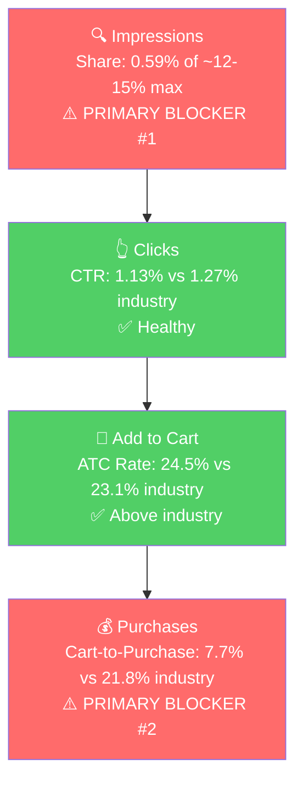

# Seller Central Audit, Creative Gifts International

**Prepared:** April 28, 2026
**Hero ASIN (P0):** Dog Balloon Animal Piggy Bank (B0BK5QQCML)
**Analysis window:** Feb 1, Mar 31, 2026 for sales and SQP, Feb 1, Apr 21, 2026 for ad data

## Section 1: Catalog Assessment

| Priority | Product | 2-Mo Sales | 2-Mo Ad Spend | ROAS | TACoS | Organic Sales | Ad Sales % | Buy Box % | CVR | Trend |
|----------|---------|-----------|---------------|------|-------|---------------|-----------|-----------|-----|-------|
| P0 | Dog Balloon Animal Piggy Bank (B0BK5QQCML) | $984 | $105 | 2.29 | 10.7% | $744 | 24.4% | 99% (child) | 1.56% → 6.21% | Growing (4.1x Feb → Mar) |
| P1 | Custom Vanity Set (B0BM8SKGYL) | $924 | $0 | n/a | 0% | $924 | 0% | **1-2%** | 1.52% → 5.32% | Growing (3x Feb → Mar) |
| P2 | Noah's Ark and Animals Coin Bank (B009W24ZBC) | $765 | $22 | 34.1 | 2.9% | $225 | 70.5% | 72-96% | 2.63% → 13.64% | Growing (7.5x Feb → Mar) |
| P3 | Silverplated Baby's First Sippy Cup (B000X24Z10) | $526 | $54 | 4.46 | 10.3% | $286 | 45.6% | 66-77% | 5.15% → 3.81% | Growing (2.2x Feb → Mar) |

**Notable products not prioritized:**

- *Optic Glass Trophy Point* ($608, almost no ads, 46% CVR): a quietly profitable corporate-award product. Sessions are 17-26/month, so the ceiling is small.
- *Ceramic Swan with Crown Piggy Bank* ($308): TACoS is 45.7% and ROAS 1.81. Smaller and less efficient than the other banks.
- *Other piggy banks* (Puffy Unicorn, Sloth, Flamingo, Ombre Unicorn): each $60-$200 over 2 months. Combined, the bank category is ~$2.5k of ~$6.9k Amazon revenue (~36%). They are distinct products and should not be merged into a single parent (a customer searching for "unicorn piggy bank" doesn't want a "dog piggy bank").

## Section 2: Product Understanding (P0)

**Product:** 8.5" x 8.5" ceramic balloon-dog coin bank, 7 metallic colors, gift-boxed. Inspired visually by Jeff Koons' balloon dog sculptures.

**Customer:** Dual buyer, parents/grandparents shopping for nursery decor or baby-shower gifts, plus adults buying it as a design-piece gift. Driver is the visual aesthetic.

**Competitive Landscape:**

Avg standalone balloon dog ceramic bank (Made By Humans, Interior Illusions): ~$28-35 | P0: ~$24 | ~20-30% below the leader.

| Brand | Product | Notes |
|-------|---------|-------|
| Made By Humans | Balloon Dog Money Bank (high-gloss ceramic, multiple colors) | Dominant player. Listed in Home & Kitchen, signaling premium decor positioning. |
| Interior Illusions Plus | Pink Mini Ceramic Dog Piggy Bank (7.5") | Smaller, lower-price tier. |
| Creative Gifts International (P0) | 8.5" ceramic balloon dog, 7 metallic colors, gift box | Same form factor as Made By Humans, lower price, but listed in Toys & Games > Money Banks. |

Two notable gaps vs. the leader:
- **Category placement:** Made By Humans lives in Home & Kitchen / decor. P0 lives in Toys & Games. The Toys placement orients the listing around "kids piggy bank" buyers and likely cuts off the higher-AOV adult decor buyer.
- **Listing tone:** Made By Humans leans into the design-object aesthetic. P0's title and bullets read like a generic kids' product.

**Listing Quality:**

**Strengths:**
- *Title:* 157 characters, includes brand and key descriptors.
- *Bullets:* All 5 slots used, ALL-CAPS lead-ins, scannable format.
- *Rating:* 4.8 stars and trending up (4.1 → 4.4 → 4.8 over the past 14 months).
- *Video:* Two influencer videos (39s and 43s) attached.

**Opportunities:**
- *Title positioning:* Reads as a kids' bank. Drops the design-object angle that competitors lean into. Customers searching "modern piggy bank," "designer piggy bank," or "balloon dog decor" don't see it as their answer.
- *Bullets:* Bullet 1 talks about a "fun dog balloon shape." Should anchor on the design aesthetic ("BALLOON DOG SCULPTURE THAT DOUBLES AS A COIN BANK"). Bullet 4 (Versatile Décor) should target adult buyers (offices, shelves, console tables), not just kids' rooms.
- *A+ Content:* Inconsistent across variants. Image alt text is generic boilerplate, suggesting brand-story carousel rather than rich modules tailored to this product.
- *Listing category:* Toys & Games > Money Banks. Made By Humans is in Home & Kitchen. Switching category, or adding Home Décor as secondary, would unlock the adult decor buyer.

## Section 3: Quantitative Trend (P0)

| Metric | Aug 2025 (Summer Peak) | Dec 2025 (Holiday Peak) | Feb 2026 (Trough) | Mar 2026 (Latest) |
|--------|-----------------------|-------------------------|-------------------|-------------------|
| Total Sales | $456 | $528 | $192 | $792 |
| Sessions | 296 | 608 | 513 | 773 |
| CVR | 6.42% | 3.62% | 1.56% | 6.21% |
| Buy Box % | 97.6% | 93.4% | 97.0% | 85.1% (parent, child-level is 99%) |

- Sales swing widely month-to-month over the past year ($192 - $792). There is a real Q4 holiday lift (Oct → Dec sessions climb from 248 to 608). The March 2026 spike, however, is ad-driven, not seasonal, since Tier 1 SQP search volume actually fell in March vs. peak.
- Feb 2026 was a steep CVR collapse (1.56%) despite buy box being healthy. The recovery in March (CVR 6.21%) tracks with ad spend going from $17 to $87.

**Rating Trajectory:** Improving (4.1 → 4.8 over 14 months). Quality is not a blocker.

**Sales Rank Trajectory:** Improving and recently at all-time best. The Money Banks category rank historically fluctuated 800-2000, hit 527 on March 27, 2026, the best in 3+ years of history. Consistent with the recent ad ramp.

## Section 4: Market Opportunity (SQP)

**Tier Breakdown:**

- **Tier 1 (Hero):**
  - **Keywords:** dog piggy bank, ceramic balloon dog, ceramic piggy bank
  - **Rationale:** The customer is searching for exactly a ceramic balloon-dog piggy bank. P0 is the direct answer.

- **Tier 2 (Core market):**
  - **Keywords:** piggy bank, piggy bank for adults, piggy bank for kids, piggy banks, adult piggy bank, cute piggy bank, large piggy bank
  - **Rationale:** Generic piggy bank queries. The customer wants a piggy bank, P0 is one option among many shapes. Volume is large, intent is less specific.

- **Tier 3 (Adjacent / decor):**
  - **Keywords:** balloon dog, balloon dog decor, gold balloon dog, jeff koons balloon dog, balloon dog statue, balloon dog sculpture, balloon animal
  - **Rationale:** Decor intent. The customer wants a Jeff Koons-style balloon dog as a decor piece, not necessarily as a piggy bank.

**Market Sizing (12-month avg):**

| Tier | Monthly Search Volume | Monthly Cart Adds (Market) | Monthly Purchases (Market) | Est. Market Size ($/mo) |
|------|----------------------|----------------------------|----------------------------|-------------------------|
| Tier 1 | 8,409 | 590 | 128 | ~$16,500 |
| Tier 2 | ~276,000 | ~19,200 | ~4,700 | ~$480,000 |
| Tier 3 | 2,815 | ~625 | ~95 | ~$22,000 |
| **Total P0 universe** | ~287,000 | ~20,400 | ~4,900 | **~$520,000/mo** |

*Estimated using $28 avg price for Tier 1, $25 for Tier 2, $35 for Tier 3.*

**Blockers & Growth Path:**

| Tier | Impression Share | CTR (Brand vs Industry) | CVR (Brand vs Industry) | Primary Blocker | Growth Path |
|------|-----------------|-------------------------|-------------------------|-----------------|-------------|
| Tier 1 | 0.59% (cap ~12-15%) | 1.13% vs 1.27% (Healthy) | 1.89% vs 5.03%; cart-to-purchase 7.7% vs 21.8% (Blocker) | **Impression Share + CVR** | Fix listing/variant CVR, then scale impressions via PPC |
| Tier 2 | 0.013% annual (cap ~24-27%) | 1.15% vs 1.31% (~Healthy) | ATC rate 16.8% vs 22.9% (Blocker, 26% below industry) | **Impression Share + ATC** | Listing under-converts the broad piggy bank shopper at click-to-cart. Same listing fixes lift this tier |
| Tier 3 | 0.23% (cap ~8-9%) | 0.39% vs 1.35% (Blocker, 3.5x below) | n/a | **CTR (listing/positioning)** | Reposition listing toward decor buyer (category change to Home & Kitchen, design-led copy) |

**ICAP Funnel, Tier 1 (Primary Growth Tier):**

The funnel has two breaks: very low visibility on hero queries, and carts that don't close. Both have to be fixed in sequence.

- The brand has 0% purchase share across all three tiers in the most recent 3 months despite over 1,000 brand impressions per month on Tier 1. Cart-to-purchase is collapsing at ~1/3 the industry rate.
- Tier 2 has a second listing-side blocker beyond impression share: ATC rate is 26% below industry at the annual level. The same listing fixes that lift Tier 1 should also lift Tier 2, broadening the impact of the listing work.
- Tier 2 is a ~$480k/mo market and the brand has 0.013% impression share. Biggest visible ceiling in the audit.

## Section 5: Ad Analysis

### Account Level

#### Campaign Structure

> **Finding: There is no manual ad targeting in the account.**
>
> **Problem:**
> - Manual targeting: 4 impressions, 0 clicks, $0 spend over 80 days. Effectively non-existent.
> - Automatic targeting: 600,115 impressions, 4,345 clicks, $1,587 spend, $3,303 sales, ROAS 2.08.
> - The account is letting Amazon's algorithm pick keywords. There is no way to bid harder on the queries that matter (dog piggy bank, ceramic piggy bank, balloon dog) because no keyword has its own campaign.
> - This is the structural cause of the 0.59% impression share on Tier 1 queries.
>
> **Solution:**
> - Build manual keyword campaigns for each P0 tier (Exact, Phrase, Broad), 3-5 keywords per campaign with dedicated bids.
> - Harvest top-performing search terms from auto into manual exact campaigns and negate from auto so spend does not duplicate.
>
> **Impact:**
> - The "All Products / Auto / SP" campaign currently does $782 spend → $2,300 sales at 2.94 ROAS. Moving the top converters to manual exact at controlled bids typically lifts ROAS 30-50%, so the same $782 could reasonably do $2,990-$3,450 in sales (a $700-$1,150 lift).

#### Auto vs Manual Split

| Targeting Type | Clicks | Spend | Sales | ROAS | AOV | CPC | CVR |
|----------------|--------|-------|-------|------|-----|-----|-----|
| Automatic | 4,345 | $1,586.52 | $3,303.00 | 2.08 | $30.30 | $0.37 | 2.51% |
| Manual | 0 | $0.00 | $0.00 | 0 | n/a | n/a | n/a |

100% of working spend is on auto.

#### Campaign Profitability

| Campaign | Spend | Sales | ROAS | Clicks | Orders |
|----------|-------|-------|------|--------|--------|
| Wedding Products / Auto / SP | $112.48 | $0.00 | 0.00 | 195 | 0 |
| SP / Easter - Bunny Boards/Banks | $211.40 | $123.96 | 0.59 | 335 | 5 |
| Children and Baby Gifts / Auto / SP | $178.94 | $224.93 | 1.26 | 359 | 9 |
| **Total wasted** | **$502.82** | **$348.89** | **0.69** | | |

> **Finding: 32% of ad spend is on unprofitable campaigns.**
>
> **Solution:**
> - Pause Wedding Products and Easter, Bunny Boards/Banks immediately.
> - Restructure Children and Baby Gifts around the sippy cup and Noah's Ark coin bank, the children/baby products that *do* convert (sippy cup ROAS in the dedicated Bottles/Cups/Mugs campaign is 2.55).
>
> **Impact:**
> - Reallocating the $502.82 to All Products Auto SP at its 2.94 ROAS generates **$1,478 in additional sales**. Net gain: $1,129 in sales for the same total ad budget.

#### Targeting Strategy

**Keyword vs Product Targeting:**

| Targeting Strategy | Clicks | Spend | Sales | ROAS | AOV | CPC | CVR |
|-------------------|--------|-------|-------|------|-----|-----|-----|
| Keyword Targeting | 2,861 | $1,114.32 | $2,237.30 | 2.01 | $31.07 | $0.39 | 2.52% |
| Product Targeting | 1,913 | $743.70 | $1,244.63 | 1.67 | $28.29 | $0.39 | 2.30% |

Keyword is materially better. Most product-targeting spend is the two "Conquesting" campaigns (Pearhead, Child to Cherish), covered below at the P0 level.

**Match Type Breakdown:** All match types (EXACT, PHRASE, BROAD) report 0 clicks and 0 spend. Match type is a manual-targeting concept and the account has no working manual targeting; this becomes a live metric once manual campaigns launch.

#### Placement Performance

| Placement | Impressions | Clicks | Spend | Sales | ROAS | CTR | CVR |
|-----------|-------------|--------|-------|-------|------|-----|-----|
| Top of Search | 7,133 | 192 | $102.76 | $317.90 | **3.09** | 2.69% | 6.25% |
| Rest of Search | 202,066 | 2,285 | $943.93 | $1,790.44 | 1.90 | 1.13% | 2.80% |
| Product Pages | 415,483 | 2,186 | $791.03 | $1,333.59 | 1.69 | 0.53% | 1.78% |
| Off Amazon | 29,445 | 109 | $19.51 | $0.00 | 0.00 | 0.37% | 0.00% |

> **Finding: Top of Search is the best placement by a wide margin and is being severely underfunded.**
>
> **Solution:**
> - Increase Top of Search bid modifiers on the auto campaigns.
> - Set new manual keyword campaigns with aggressive Top of Search modifiers from day one.
> - Disable Off Amazon placement on all campaigns.
>
> **Impact:**
> - Shifting half of Product Pages spend ($396) to Top of Search at 3.09 ROAS moves expected sales from $668 to $1,222. Net gain: ~$554 in sales.

### Product Level (P0)

#### P0 Campaign Map

| Campaign | Type | Spend | Sales | ROAS | Clicks | Orders |
|----------|------|-------|-------|------|--------|--------|
| All Products / Auto / SP | Auto | $121.46 | $335.86 | 2.77 | 428 | 15 |
| Child to Cherish Piggy Banks / Conquesting / SP | Product Targeting | $21.26 | $23.99 | 1.13 | 25 | 1 |
| Pearhead Piggy Banks / Conquesting / SP | Product Targeting | $19.10 | $0.00 | 0.00 | 23 | 0 |
| Piggy Bank / Auto / SP | Auto | $5.96 | $23.99 | 4.02 | 28 | 1 |
| **Total P0** | | **$167.78** | **$383.84** | **2.29** | 504 | 17 |

P0 receives 11% of total account ad spend ($168 of $1,587) despite being the #1 revenue product. There is no manual keyword campaign for P0 anywhere.

#### Variant-Level Spend (P0)

| Color | Clicks | Spend | Sales | Orders | CVR |
|-------|--------|-------|-------|--------|-----|
| Rose Gold | 156 | $46.04 | $143.94 | 6 | 3.85% |
| Pink | 109 | $40.10 | $71.97 | 3 | 2.75% |
| Black | 53 | $18.55 | $0.00 | 0 | 0.00% |
| Blue | 50 | $17.36 | $0.00 | 0 | 0.00% |
| Gold | 47 | $14.91 | $23.99 | 1 | 2.13% |
| Silver | 41 | $8.50 | $71.97 | 3 | 7.32% |
| White/Gold | 27 | $10.11 | $47.98 | 3 | 11.11% |
| **Total P0** | **483** | **$155.57** | **$359.85** | **16** | **3.31%** |

Gold organically converts at 34.83% (the conversion hero), but in ads gets the smallest budget among the colors that sell. Rose Gold and Pink absorb 3-4x more ad spend at 1/10th the conversion rate.

## Section 6: Action Plan

The blockers on P0 are impression share (visibility) and conversion (carts not closing). The plan starts with PPC fixes to stop wasted spend and capture the piggy bank market via new manual campaigns, then addresses the listing in parallel, then scales what is working.

### Weeks 1-3: PPC Fixes + Tier 1/Tier 2 Capture

The first three weeks stop the bleeding on existing campaigns and aggressively capture the piggy bank market via new manual campaigns. The goal is to protect existing revenue while opening new visibility.

**Stop wasted spend and rebalance:**
- Pause Wedding Products / Auto and Easter, Bunny Boards/Banks. Reclaim ~$200/month in wasted spend.
- Pause both Conquesting campaigns (Pearhead, Child to Cherish) for P0 until the listing is repositioned.
- Increase Top of Search bid modifiers across all auto campaigns. Top of Search is at 3.09 ROAS with only 6.5% of spend.
- Disable Off Amazon placement on every campaign.
- Restructure Children and Baby Gifts / Auto: cut spend on non-converting products, focus on the sippy cup and Noah's Ark coin bank.
- On the All Products auto campaign for P0, set very low bids on Black, Blue, Pink, Rose Gold variants. Concentrate spend on Gold.

**Launch new manual campaigns to capture the piggy bank market:**
- **Tier 1 / Exact** campaign: dog piggy bank, ceramic balloon dog, ceramic piggy bank. Aggressive Top of Search bid modifier.
- **Tier 1 / Phrase** campaign: same root keywords, phrase match for long-tail discovery.
- **Tier 1 / Broad** campaign: same root keywords, broad match for further discovery and harvesting.
- **Tier 2 / Exact** campaign: piggy bank, piggy bank for adults, piggy bank for kids. The Tier 2 market is ~$480k/mo and the brand has 0.013% share, this is where most of the visibility upside lives.
- **Tier 2 / Phrase + Broad** campaigns: same root keywords for discovery and search-term harvesting.
- Negate harvested terms from auto so spend does not duplicate.

The aim is to plant a flag across the piggy bank market in weeks 1-3 so the data starts flowing while the listing changes are being prepared.

### Weeks 3-6: Listing Optimization

These actions address the conversion blocker. Listing changes take weeks to publish and stabilize, so they run in parallel with the PPC capture from Weeks 1-3. Same fixes also lift the Tier 2 ATC-rate gap, broadening the impact.

- **Title rewrite:** lead with the design-object angle (e.g., "Balloon Dog Ceramic Piggy Bank | Modern Decor | High-Gloss Metallic Finish | 8.5" Coin Bank | Gift Box Included | Gold"). Move "kids' room" framing to a secondary position so the adult decor buyer recognizes the listing.
- **Bullets rewrite:** bullet 1 anchors on the design aesthetic ("BALLOON DOG SCULPTURE THAT DOUBLES AS A COIN BANK"), bullet 4 reframes for adult buyers (offices, console tables, shelves), bullets 2-3-5 keep functional product benefits.
- **A+ content rework:** standardize across all 7 color variants (currently inconsistent). Move from generic brand-story carousel to lifestyle imagery showing the product as adult decor: balloon dog on a console table, in an office, paired with books and a candle, etc. Premium A+ if Brand Registry tier supports it.
- **Main image and gallery refresh:** lead image is the Gold variant on a clean background. Gallery images include scale (next to a hand or coffee cup), lifestyle shots, gift-box reveal, and a close-up of the metallic finish.
- **Brand Story / Brand Store optimization:** add a "Balloon Dog Decor Collection" subpage that groups Gold, Rose Gold, White/Gold, etc., styled as decor first.
- **Variant pricing audit:** confirm Gold is priced consistently with the other colors. The 10x organic CVR gap between Gold and the other colors is too large to be explained by image quality alone, pricing differences are the most likely cause.
- **Category change request:** add Home & Kitchen as a secondary category alongside Toys & Games > Money Banks. Made By Humans (the leader) is in Home & Kitchen, and SQP shows the brand's CTR on "balloon dog decor" queries is 3.5x below industry, this is the fix.
- **Reviews:** enroll Gold and the other top-converting variants in Amazon Vine. Set up Request a Review automation for every order. The product already has 4.8 stars, more reviews compound the conversion advantage.
- **P1 (Custom Vanity Set):** investigate the 1-2% buy box and fix it. This is the single biggest unlocked lever in the entire account ($924 over 2 months on $0 ad spend with broken buy box). Once buy box is consistently above 80%, begin a small ad campaign on the gift-set queries (vintage hair brush, vintage brush and mirror set, brush comb mirror set).

### Week 6+: Scale and Evaluate

Once the listing changes are live and CVR data is starting to trend, scale what is working and prune what is not.

- **Scale winning manual campaigns** from Weeks 1-3 by raising daily budgets and Top of Search modifiers on the campaigns showing the strongest ROAS.
- **Harvest top search terms** from Broad / Phrase / Auto into dedicated Exact campaigns. Negate harvested terms from the source campaigns.
- **Scale P2 (Noah's Ark Coin Bank)** ad spend. Currently 30x ROAS on $22 of spend, room to scale 2-3x before ROAS deteriorates.
- **Evaluate P3 (Sippy Cup)** ad restructuring. Consolidate spend into the Bottles/Cups/Mugs campaign (2.55 ROAS) and pull from the underperforming Children and Baby Gifts campaign (0.45 ROAS).
- **Sponsored Brands defensive campaign** on the brand's own ASINs at small budget (under 5% of P0 budget) to protect against competitor bidding on "creative gifts" branded queries.
- **Evaluate P1 (Custom Vanity Set)** once buy box is fixed. Begin Tier 1 manual campaign on vintage hair brush, vintage brush and mirror set, brush comb mirror set.

### ~3-Month Mark: Seasonal Product Expansion

Around the 3-month mark, start identifying seasonal products to ramp for September and Q4. The goal is to have wins teed up for the peak gifting period, when search volume across the catalog lifts.

- Pull SQP and historical seller data to identify which catalog products have a clear Q4 lift pattern (graduation gifts, baby shower gifts, Christmas-themed banks, holiday cutting boards, ornaments, etc.).
- For each identified seasonal product, set up a launch plan: listing prep in August, manual campaigns live by early September, peak spend in October-December.
- Q4 should be additive to the P0/P1/P2/P3 progress from the first 3 months, not a replacement of focus.

## Section 7: Insights

- **P0 (Dog Balloon Animal Piggy Bank), buy box is not a problem at the child level.** The 85% parent-level number is diluted by inactive variants. Every active selling color is at 98-99% buy box.
- **P0 (Dog Balloon Animal Piggy Bank), Gold is doing all the work and getting the smallest ad budget.** Gold organically converts at 34.83% on 89 sessions (58% of parent sales on 12% of parent sessions). In ads it gets $15 of spend while Rose Gold and Pink get 3-4x more. Concentrating ad spend on Gold is a same-day fix.
- **P0 (Dog Balloon Animal Piggy Bank), the entire account has zero working manual keyword targeting.** All $1,587 of working spend is on auto. This is the single structural cause of the 0.59% Tier 1 impression share against a ~12-15% ceiling.
- **P0 (Dog Balloon Animal Piggy Bank), Top of Search ROAS is 3.09 but only gets 6.5% of spend.** Bidding it up is one of the highest-leverage same-week actions in the audit.
- **P0 (Dog Balloon Animal Piggy Bank), the listing fix has compounding impact on Tier 2.** Tier 2 ATC rate is 16.8% vs industry 22.9% (annual). The same listing fixes that lift Tier 1 cart-to-purchase also lift Tier 2 ATC rate, broadening the return on the listing work.
- **P1 (Custom Vanity Set), buy box is at 1-2% with zero ad spend, yet the product still does $924 over 2 months on organic traffic alone.** This is the single biggest unlocked lever in the catalog. The fix is almost certainly MAP / pricing related.
- **P2 (Noah's Ark Coin Bank), 30x ROAS in March on $22 of ad spend with 80% of sales ad-attributed.** Far below the efficient frontier. Room to scale 2-3x before ROAS deteriorates.
- **Account level, $502.82 (32% of total ad spend) is on three unprofitable campaigns.** Includes an Easter campaign still running 3 weeks past Easter. Same-day reclaim.

## Section 8: Questions for the Seller

- **P1 (Custom Vanity Set):** buy box is at 1-2% despite this being a private-label product. Have there been recent price changes, MAP violations, or anyone else listing on the ASIN?
- **P0 (Dog Balloon Animal Piggy Bank):** is the price the same across all 7 color variants, or are some priced higher? The CVR gap between Gold (34.83%) and the other colors (1-6%) looks too large to be explained by image quality alone.
- **All product-level:** given the design-object angle that Made By Humans leans into, is there appetite to reposition the Amazon listing toward adult decor buyers (Home & Kitchen category, design-led copy and lifestyle imagery), or is the current "kids gift" positioning a strategic choice tied to the offline/distributor channel?
- **Account level:** the Easter campaign was active 3 weeks past Easter. Affects how we structure future seasonal campaigns (graduation, Mother's Day, Q4).
- **Account level:** when did you start running ads on each of these products? Our data only goes back to Feb 1.
