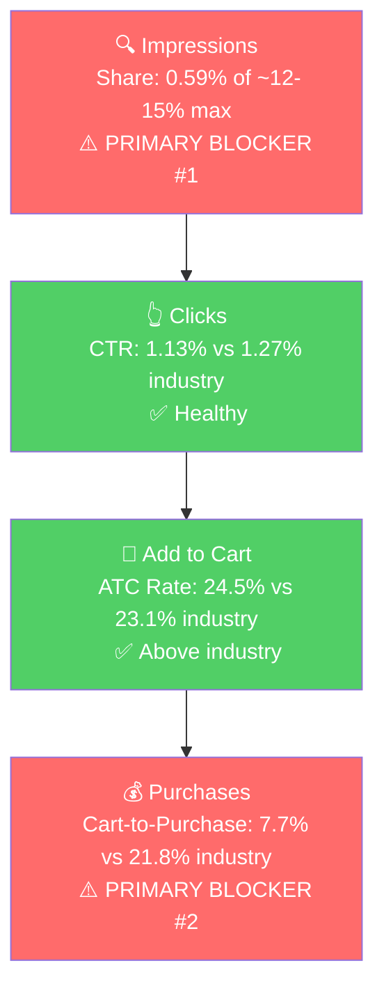

# Seller Central Audit - Creative Gifts International

**Prepared:** April 27, 2026
**Hero ASIN (P0):** Dog Balloon Animal Piggy Bank (B0BK5QQCML)
**Analysis window:** Feb 1 - Mar 31, 2026 for sales/SQP/share, Feb 1 - Apr 21, 2026 for ad data

> **Note on data scope:** Reported Amazon revenue is ~$3.4k/month and Amazon ad spend is ~$500/month, both materially below the seller's stated $6-7k/month revenue and $500/week ad spend. The gap is consistent with the seller's offline / wholesale / distributor business being the larger channel. This audit covers the Amazon side only.

## Section 1: Catalog Assessment

| Priority | Product | 2-Mo Sales | 2-Mo Ad Spend | ROAS | TACoS | Organic Sales | Ad Sales % | Buy Box % | CVR | Trend |
|----------|---------|-----------|---------------|------|-------|---------------|-----------|-----------|-----|-------|
| P0 | Dog Balloon Animal Piggy Bank (B0BK5QQCML) | $984 | $105 | 2.29 | 10.7% | $744 | 24.4% | 99% (child) | 1.56% → 6.21% | Growing (4.1x Feb → Mar) |
| P1 | Custom Vanity Set (B0BM8SKGYL) | $924 | $0 | n/a | 0% | $924 | 0% | **1-2%** | 1.52% → 5.32% | Growing (3x Feb → Mar) |
| P2 | Noah's Ark and Animals Coin Bank (B009W24ZBC) | $765 | $22 | 34.1 | 2.9% | $225 | 70.5% | 72-96% | 2.63% → 13.64% | Growing (7.5x Feb → Mar) |
| P3 | Silverplated Baby's First Sippy Cup (B000X24Z10) | $526 | $54 | 4.46 | 10.3% | $286 | 45.6% | 66-77% | 5.15% → 3.81% | Growing (2.2x Feb → Mar) |

**Notable products not prioritized:**

- *Optic Glass Trophy Point* ($608, almost no ads, 46% CVR): a quietly profitable corporate-award product, not aligned with the evergreen-gifting thesis. Sessions are tiny (17-26/month) so the ceiling is small.
- *Ceramic Swan with Crown Piggy Bank* ($308): the seller flagged it, but TACoS is 45.7% and ROAS 1.81. Smaller and less efficient than the other banks.
- *Other piggy banks* (Puffy Unicorn, Sloth, Flamingo, Ombre Unicorn): each $60-$200 over 2 months. Combined, the bank category is ~$2.5k of the ~$6.9k Amazon revenue (~36%). They are distinct products and should not be merged into a single parent (a customer searching for "unicorn piggy bank" doesn't want a "dog piggy bank").

## Section 2: Qualitative Product Understanding (P0)

**Product:**
- 8.5" x 8.5" ceramic coin bank shaped like a "balloon animal" dog, inspired visually by Jeff Koons' famous balloon dog sculptures.
- Sold in 7 metallic ceramic colors (Gold, Rose Gold, Silver, Pink, Black, Blue, White/Gold). Gold is the dominant seller.
- Comes in a gift box. Positioned as both a kids' room / nursery decor piece and a giftable money bank.
- Value prop: a $200+ designer-object aesthetic at a $25-30 price point.

**Customer:**
- Dual buyer: parents/grandparents shopping for baby shower or nursery decor, and adults buying it as a design piece for themselves or as a gift.
- Driver is the visual aesthetic. Coin storage is secondary.

**Brand:**
- Established offline gifting business with a large wholesale/distributor footprint. Amazon is the smaller channel.
- Brand vibe on Amazon listings is generic gifting, not curated decor. Listing copy emphasizes "gift ready" and product specs rather than the design-object aesthetic.
- Not Amazon-native, no clear DTC presence visible from listings.

**Competitive Landscape:**

Avg standalone balloon dog ceramic bank (Made By Humans, Interior Illusions): ~$28-35 | P0: ~$24 | ~20-30% below the leader.

| Brand | Product | Notes |
|-------|---------|-------|
| Made By Humans | Balloon Dog Money Bank (high-gloss ceramic, multiple colors) | The dominant player. Listed in Home & Kitchen, signaling premium decor positioning. |
| Interior Illusions Plus | Pink Mini Ceramic Dog Piggy Bank (7.5") | Smaller, lower-price tier. |
| Creative Gifts International (P0) | 8.5" ceramic balloon dog, 7 metallic colors, gift box | Same form factor as Made By Humans, lower price, but listed in Toys & Games > Money Banks. |

Two notable gaps vs. the leader:
- **Category placement:** Made By Humans lives in Home & Kitchen / decor. P0 lives in Toys & Games. The Toys placement orients the listing around "kids piggy bank" buyers and likely cuts off the higher-AOV adult decor buyer.
- **Listing tone:** Made By Humans leans into the design-object aesthetic. P0's title and bullets read like a generic kids' product.

**Listing Quality:**

**Strengths:**
- *Title:* 157 characters, includes brand and key descriptors.
- *Bullets:* All 5 slots used, ALL-CAPS lead-ins, scannable format.
- *Rating:* 4.8 stars and trending up (4.1 → 4.4 → 4.8 over the past 14 months).
- *Video:* Two influencer videos (39s and 43s) attached, better than the typical Creative Gifts listing.

**Opportunities:**
- *Title positioning:* Reads as a kids' bank. Drops the design-object angle that competitors lean into. Customers searching "modern piggy bank," "designer piggy bank," or "balloon dog decor" don't see it as their answer.
- *Bullets:* Bullet 1 talks about a "fun dog balloon shape." Should anchor on the design aesthetic ("BALLOON DOG SCULPTURE THAT DOUBLES AS A COIN BANK"). Bullet 4 (Versatile Décor) should target adult buyers (offices, shelves, console tables), not just kids' rooms.
- *A+ Content:* Inconsistent across variants. Image alt text is identical generic boilerplate ("celebrations milestones everyday occasions present"), suggesting brand-story carousel rather than rich modules tailored to this product.
- *Listing category:* Toys & Games > Money Banks. Made By Humans is in Home & Kitchen. Switching category, or adding Home Décor as secondary, would unlock the adult decor buyer.

## Section 3: Quantitative Product Understanding (P0)

**Annual Trend (Dog Balloon Animal Piggy Bank):**

| Metric | Aug 2025 (Summer Peak) | Dec 2025 (Holiday Peak) | Feb 2026 (Trough) | Mar 2026 (Latest) |
|--------|-----------------------|-------------------------|-------------------|-------------------|
| Total Sales | $456 | $528 | $192 | $792 |
| Sessions | 296 | 608 | 513 | 773 |
| CVR | 6.42% | 3.62% | 1.56% | 6.21% |
| Buy Box % | 97.6% | 93.4% | 97.0% | 85.1% (parent, child-level is 99%) |

- Sales swing widely month-to-month over the past year ($192 - $792). There is a real Q4 holiday lift (Oct → Dec sessions climb from 248 to 608). The March 2026 spike, however, is ad-driven, not seasonal, Tier 1 SQP search volume actually fell in March vs. peak.
- Feb 2026 was a steep CVR collapse (1.56%) despite buy box being healthy. The recovery in March (CVR 6.21%) tracks with ad spend going from $17 to $87.

**Rating Trajectory:** Improving (4.1 → 4.8 over 14 months). Quality is not a blocker.

**Sales Rank Trajectory:** Improving and recently at all-time best. The Money Banks category rank historically fluctuated 800-2000, hit 527 on March 27, 2026, the best in 3+ years of history. Consistent with the recent ad ramp.

## Section 4: Market Opportunity (SQP)

**Tier Breakdown:**

- **Tier 1 (Hero):**
  - **Keywords:** dog piggy bank, ceramic balloon dog, ceramic piggy bank
  - **Rationale:** The customer is searching for exactly a ceramic balloon-dog piggy bank. P0 is the direct answer.

- **Tier 2 (Core market):**
  - **Keywords:** piggy bank, piggy bank for adults, piggy bank for kids, piggy banks, adult piggy bank, cute piggy bank, large piggy bank
  - **Rationale:** Generic piggy bank queries. Customer wants any piggy bank, P0 is one option among many shapes. Volume is large, intent is less specific.

- **Tier 3 (Adjacent / decor):**
  - **Keywords:** balloon dog, balloon dog decor, gold balloon dog, jeff koons balloon dog, balloon dog statue, balloon dog sculpture, balloon animal
  - **Rationale:** Decor intent. Customer wants a Jeff Koons-style balloon dog as a decor piece, not necessarily as a piggy bank. P0 *is* this product, but the listing currently doesn't speak to this buyer.

**Market Sizing (12-month avg):**

| Tier | Monthly Search Volume | Monthly Cart Adds (Market) | Monthly Purchases (Market) | Est. Market Size ($/mo) |
|------|----------------------|----------------------------|----------------------------|-------------------------|
| Tier 1 | 8,409 | 590 | 128 | ~$16,500 |
| Tier 2 | ~276,000 | ~19,200 | ~4,700 | ~$480,000 |
| Tier 3 | 2,815 | ~625 | ~95 | ~$22,000 |
| **Total P0 universe** | ~287,000 | ~20,400 | ~4,900 | **~$520,000/mo** |

*Estimated using $28 avg price for Tier 1, $25 for Tier 2 (broader piggy bank avg), $35 for Tier 3 (balloon dog statues skew premium).*

**Blockers & Growth Path:**

| Tier | Impression Share | CTR (Brand vs Industry) | CVR (Brand vs Industry) | Primary Blocker | Growth Path |
|------|-----------------|-------------------------|-------------------------|-----------------|-------------|
| Tier 1 | 0.59% (cap ~12-15%) | 1.13% vs 1.27% (Healthy) | 1.89% vs 5.03%; cart-to-purchase 7.7% vs 21.8% (Blocker) | **Impression Share + CVR** | Fix listing/variant CVR first, then scale impressions via PPC |
| Tier 2 | 0.013% annual (cap ~24-27%) | 1.15% vs 1.31% (~Healthy) | ATC rate 16.8% vs 22.9% (Blocker, 26% below industry); cart-to-purchase too thin (0/18 over 12 months) | **Impression Share + ATC** | Brand functionally absent. Listing under-converts the broader piggy bank shopper at click-to-cart. Defer scaling until Tier 1 listing fixes are live |
| Tier 3 | 0.23% (cap ~8-9%) | 0.39% vs 1.35% (Blocker, 3.5x below) | n/a | **CTR (listing/positioning)** | Reposition listing toward decor buyer (category change to Home & Kitchen, design-led copy) |

**ICAP Funnel - Tier 1 (Primary Growth Tier):**

The funnel has two breaks: very low visibility on hero queries, and carts that don't close. Both have to be fixed in sequence. Closing carts (listing fixes) comes first because pouring impressions into a leaky funnel just burns ad budget.

- The brand has 0% purchase share across all three tiers in the most recent 3 months despite over 1,000 brand impressions per month on Tier 1. Cart-to-purchase is collapsing at ~1/3 the industry rate.
- Tier 2 has a second listing-side blocker beyond impression share: ATC rate is 26% below industry at the annual level. Same variant/listing fixes that lift Tier 1 should also lift Tier 2, broadening the impact of the listing work.
- Tier 2 is a ~$480k/mo market and the brand has 0.013% impression share. Biggest visible ceiling in the audit, but destination for later, not the first move.
- The seller mentioned "creative gifts" as a big Amazon keyword. Data shows 21-40 searches/month on the brand name. This is not a meaningful traffic lever.

## Section 5: Ad Analysis

### Account Level

#### Campaign Structure

> **Finding: There is no manual ad targeting in the account.**
>
> **Problem:**
> - Manual targeting: 4 impressions, 0 clicks, $0 spend over 80 days. Effectively non-existent.
> - Automatic targeting: 600,115 impressions, 4,345 clicks, $1,587 spend, $3,303 sales, ROAS 2.08.
> - The seller is letting Amazon's algorithm pick keywords. There is no way to bid harder on the queries that matter (dog piggy bank, ceramic piggy bank, balloon dog) because no keyword has its own campaign.
> - This is the structural cause of the 0.59% impression share on Tier 1 queries.
>
> **Solution:**
> - Build manual keyword campaigns for each P0 tier. Limit each to 3-5 keywords with dedicated bids.
> - Harvest top-performing search terms from auto into manual exact campaigns and negate them from auto so spend does not duplicate.
>
> **Impact:**
> - The "All Products / Auto / SP" campaign currently does $782 spend → $2,300 sales at 2.94 ROAS. Moving the top converters to manual exact at controlled bids typically lifts ROAS 30-50%, so the same $782 could reasonably do $2,990-$3,450 in sales (a $700-$1,150 lift).

#### Auto vs Manual Split

| Targeting Type | Clicks | Spend | Sales | ROAS | AOV | CPC | CVR |
|----------------|--------|-------|-------|------|-----|-----|-----|
| Automatic | 4,345 | $1,586.52 | $3,303.00 | 2.08 | $30.30 | $0.37 | 2.51% |
| Manual | 0 | $0.00 | $0.00 | 0 | n/a | n/a | n/a |

100% of working spend is on auto. See Campaign Structure for the fix.

#### Campaign Profitability

| Campaign | Spend | Sales | ROAS | Clicks | Orders |
|----------|-------|-------|------|--------|--------|
| Wedding Products / Auto / SP | $112.48 | $0.00 | 0.00 | 195 | 0 |
| SP / Easter - Bunny Boards/Banks | $211.40 | $123.96 | 0.59 | 335 | 5 |
| Children and Baby Gifts / Auto / SP | $178.94 | $224.93 | 1.26 | 359 | 9 |
| **Total wasted** | **$502.82** | **$348.89** | **0.69** | | |

> **Finding: 32% of ad spend is on unprofitable campaigns.**
>
> **Problem:**
> - $502.82 spent below the 1.5x ROAS profitability floor over 80 days.
> - Wedding Products: 195 clicks, 0 orders.
> - Easter - Bunny Boards/Banks: ROAS 0.59. Still running 3 weeks past Easter (Apr 5).
> - Children and Baby Gifts: ROAS 1.26.
>
> **Solution:**
> - Pause Wedding Products and Easter - Bunny Boards/Banks immediately.
> - Restructure Children and Baby Gifts around the sippy cup and Noah's Ark coin bank, the children/baby products that *do* convert.
>
> **Impact:**
> - Reallocating the $502.82 to All Products Auto SP at its 2.94 ROAS generates **$1,478 in additional sales**. Net gain: $1,129 in sales for the same total ad budget.

#### Targeting Strategy

**Keyword vs Product Targeting:**

| Targeting Strategy | Clicks | Spend | Sales | ROAS | AOV | CPC | CVR |
|-------------------|--------|-------|-------|------|-----|-----|-----|
| Keyword Targeting | 2,861 | $1,114.32 | $2,237.30 | 2.01 | $31.07 | $0.39 | 2.52% |
| Product Targeting | 1,913 | $743.70 | $1,244.63 | 1.67 | $28.29 | $0.39 | 2.30% |

Keyword is materially better. Most of the product-targeting spend is the two "Conquesting" campaigns (Pearhead, Child to Cherish), covered below at the P0 level.

**Match Type Breakdown:** All match types (EXACT, PHRASE, BROAD) report 0 clicks and 0 spend. Match type is a manual-targeting concept and the account has no working manual targeting; this becomes a live metric once manual campaigns launch.

#### Placement Performance

| Placement | Impressions | Clicks | Spend | Sales | ROAS | CTR | CVR |
|-----------|-------------|--------|-------|-------|------|-----|-----|
| Top of Search | 7,133 | 192 | $102.76 | $317.90 | **3.09** | 2.69% | 6.25% |
| Rest of Search | 202,066 | 2,285 | $943.93 | $1,790.44 | 1.90 | 1.13% | 2.80% |
| Product Pages | 415,483 | 2,186 | $791.03 | $1,333.59 | 1.69 | 0.53% | 1.78% |
| Off Amazon | 29,445 | 109 | $19.51 | $0.00 | 0.00 | 0.37% | 0.00% |

> **Finding: Top of Search is the best placement by a wide margin and is being severely underfunded.**
>
> **Problem:**
> - Top of Search ROAS 3.09 vs Product Pages ROAS 1.69. Top of Search converts at 6.25% vs 1.78%, a 3.5x gap.
> - Despite that, only 6.5% of spend ($103 of $1,587) is hitting Top of Search.
> - Off Amazon spend is wasted: 0 sales on 109 clicks.
>
> **Solution:**
> - Increase Top of Search bid modifiers on the auto campaigns.
> - Set new manual keyword campaigns with aggressive Top of Search modifiers from day one.
> - Disable Off Amazon placement on all campaigns.
>
> **Impact:**
> - Shifting half of Product Pages spend ($396) to Top of Search at 3.09 ROAS moves expected sales from $668 to $1,222. Net gain: ~$554 in sales.

### Product Level (P0)

#### P0 Campaign Map

| Campaign | Type | Spend | Sales | ROAS | Clicks | Orders |
|----------|------|-------|-------|------|--------|--------|
| All Products / Auto / SP | Auto | $121.46 | $335.86 | 2.77 | 428 | 15 |
| Child to Cherish Piggy Banks / Conquesting / SP | Product Targeting | $21.26 | $23.99 | 1.13 | 25 | 1 |
| Pearhead Piggy Banks / Conquesting / SP | Product Targeting | $19.10 | $0.00 | 0.00 | 23 | 0 |
| Piggy Bank / Auto / SP | Auto | $5.96 | $23.99 | 4.02 | 28 | 1 |
| **Total P0** | | **$167.78** | **$383.84** | **2.29** | 504 | 17 |

P0 receives 11% of total account ad spend ($168 of $1,587) despite being the brand's #1 revenue product. There is no manual keyword campaign for P0 anywhere.

#### Impression Share Blocker: P0 Has No Manual Keyword Campaigns Bidding on Tier 1 Terms

Section 4 identified impression share as the primary blocker on Tier 1 (0.59% of a ~12-15% cap). The PPC lever is bidding on the keywords where impression share is low, and that lever isn't being pulled at all:

- "Piggy Bank / Auto / SP" is the only campaign whose name suggests piggy-bank intent, but it's auto-targeted and only spent **$5.96 on P0** over 80 days. Auto cannot be tuned to bid hard on "dog piggy bank" specifically.
- "All Products / Auto / SP" does the heavy lifting (ROAS 2.77 on P0) but spreads across the whole catalog.
- Zero exact-match or phrase-match keyword campaigns for "dog piggy bank," "ceramic balloon dog," or "ceramic piggy bank."

> **Solution:**
> - Build a "P0 / Tier 1 / Exact" manual campaign with three keywords: dog piggy bank, ceramic balloon dog, ceramic piggy bank. Aggressive Top of Search bid modifier from day one.
> - Build a smaller "P0 / Tier 1 / Phrase" campaign for discovery on long-tail variations.
> - Sequence this *after* the listing CVR fixes from Section 2. Otherwise the new impressions feed a leaky funnel.

#### CVR Blocker: Conquesting Campaigns and Non-Gold Variants Are Wasted Spend

Section 4 also identified CVR as a co-primary blocker (cart-to-purchase 7.7% vs 21.8% industry). Section 2 narrowed the cause to the variant-level conversion gap.

| Color | Clicks | Spend | Sales | Orders | CVR |
|-------|--------|-------|-------|--------|-----|
| Rose Gold | 156 | $46.04 | $143.94 | 6 | 3.85% |
| Pink | 109 | $40.10 | $71.97 | 3 | 2.75% |
| Black | 53 | $18.55 | $0.00 | 0 | 0.00% |
| Blue | 50 | $17.36 | $0.00 | 0 | 0.00% |
| Gold | 47 | $14.91 | $23.99 | 1 | 2.13% |
| Silver | 41 | $8.50 | $71.97 | 3 | 7.32% |
| White/Gold | 27 | $10.11 | $47.98 | 3 | 11.11% |
| **Total P0** | **483** | **$155.57** | **$359.85** | **16** | **3.31%** |

Two distinct problems:

1. **Gold gets less ad budget than every selling color except Silver/White/Gold.** Step 2 showed Gold is the conversion hero (34.83% CVR organic). In ads it has $15 spend and 47 clicks. Rose Gold and Pink get 3-4x the budget at 1/10th the organic conversion rate.
2. **Conquesting campaigns are mostly wasted.** Pearhead: $19.10 / 0 orders. Child to Cherish: $21.26 / 1 order at ROAS 1.13. The product-targeting strategy of placing P0 ads on competitor pages doesn't work when the click-through experience doesn't convert.

> **Solution:**
> - Pause both Conquesting campaigns until the listing is repositioned.
> - In the new manual Tier 1 campaign, advertise Gold as the headline variant. Let the variant picker on the listing surface other colors organically.
> - On auto campaigns, set very low bids or add negative ASINs for the under-converting variants for now.
>
> **Impact:**
> - Reallocating the $40 conquesting + ~$80 of non-Gold variant spend (~$120) to a Gold-led Tier 1 manual campaign at ~2.94 ROAS generates ~$352 in sales (vs $24 those campaigns produced). Net gain: ~$330.

## Section 6: Action Plan

The primary blockers on P0 are impression share and CVR. The PPC levers (manual campaigns, Top of Search bidding) are largely untouched. The listing levers (variant pricing/imagery, decor positioning, category change) are also untouched. The plan sequences quick PPC reclaim first, then listing fixes, then PPC scaling on the improved foundation.

### Weeks 1-2: Immediate Reclaim (PPC quick wins)

The first two weeks claw back wasted spend and rebalance toward the placements and products that already work.

- Pause Wedding Products / Auto and Easter - Bunny Boards/Banks. Reclaim ~$200/month in wasted spend.
- Pause both Conquesting campaigns (Pearhead, Child to Cherish) for P0. They are unwinnable until the listing is repositioned.
- Increase Top of Search bid modifiers across all auto campaigns. Top of Search is at ROAS 3.09 with only 6.5% of spend.
- Disable Off Amazon placement on every campaign.
- Restructure Children and Baby Gifts / Auto: cut spend on non-converting products, focus on the sippy cup and Noah's Ark coin bank.
- On the All Products auto campaign for P0, set very low bids on Black, Blue, Pink, Rose Gold variants. Concentrate spend on Gold.

### Weeks 2-4: Listing Repositioning (Listing levers, in parallel with PPC harvest)

These actions address the CVR blocker. Listing changes take weeks to publish and stabilize, so we start them now while the PPC reclaim from Weeks 1-2 plays out. The same fixes also address the Tier 2 ATC-rate blocker, broadening the impact.

- Rewrite the P0 title to lead with the design-object angle (e.g., "Balloon Dog Ceramic Piggy Bank | Modern Decor | High-Gloss Metallic Finish | 8.5" Coin Bank | Gift Box Included | Gold").
- Rewrite bullets: bullet 1 anchors on the design aesthetic, bullet 4 reframes for adult buyers (offices, console tables).
- Begin A+ content rework. Standardize across all 7 variants (currently inconsistent). Move from generic brand-story carousel to lifestyle imagery showing the product as adult decor.
- File a category change request to add Home & Kitchen as a secondary or primary category.
- Audit prices across the 7 color variants. Confirm whether Gold is priced differently from the others (this is one of the open questions for the seller).
- P1 (Custom Vanity Set): investigate the 1-2% buy box and fix it. This is the single biggest unlocked lever in the entire account ($924 over 2 months on $0 ad spend with broken buy box).

### Weeks 4-6: Manual Campaign Build (PPC scaling on improved listing)

Once listing changes are live and CVR data is starting to trend, launch the manual campaigns that close the impression-share blocker.

- Launch "P0 / Tier 1 / Exact" manual campaign with 3 keywords (dog piggy bank, ceramic balloon dog, ceramic piggy bank). Aggressive Top of Search bid modifier.
- Launch "P0 / Tier 1 / Phrase" for long-tail discovery.
- Harvest top-converting search terms from "All Products / Auto / SP" into manual exact campaigns. Negate harvested terms from auto to prevent budget overlap.
- Set up a small Sponsored Brands campaign on the brand's own ASINs as defensive coverage (under 5% of P0 budget per CLAUDE.md guidance).
- Scale P2 (Noah's Ark Coin Bank) ad spend. Currently at 30x ROAS on $22, it's far below the efficient frontier and can absorb 2-3x the budget before ROAS deteriorates.

### Weeks 6-8: Tier 2 Expansion and Catalog Evaluation

With Tier 1 funnel improvements in place, this phase pushes into the larger Tier 2 market and assesses what else in the catalog deserves attention.

- Launch "P0 / Tier 2 / Exact" manual campaign on "piggy bank," "piggy bank for adults," "piggy bank for kids", but only if Tier 2 ATC rate has moved closer to industry (currently 16.8% vs 22.9%) on the back of the listing fixes. Tier 2 is a ~$480k/mo market but the brand can't compete there until conversion is healthy.
- Test a small Tier 3 manual campaign on "balloon dog," "balloon dog decor," "jeff koons balloon dog", but only after the listing has been fully repositioned for the decor buyer (category change live, lifestyle imagery published). If the click-through experience still reads as "kids piggy bank," skip Tier 3 entirely.
- Evaluate P1 (Custom Vanity Set) once buy box is fixed. Begin a small ad campaign once the buy box is consistently above 80%.
- Evaluate P3 (Silverplated Baby's First Sippy Cup) ad campaign restructuring. Currently the "Children and Baby Gifts / Auto" campaign for the sippy cup is at ROAS 0.45, while the dedicated "Bottles, Cups, Mugs / Auto" campaign is at 2.55. Consolidate spend on the campaign that works.

## Section 7: Insights & Questions for the Seller

### Insights

- **P0 (Dog Balloon Animal Piggy Bank), buy box is not a problem at the child level.** The 85% parent-level number is diluted by inactive variants. Every active selling color is at 98-99% buy box. We should not flag buy box on this ASIN.
- **P0 (Dog Balloon Animal Piggy Bank), Gold is doing all the work and getting the smallest ad budget.** Gold organically converts at 34.83% on 89 sessions (58% of parent sales on 12% of parent sessions). In ads it gets $15 of spend while Rose Gold and Pink get 3-4x more. Concentrating ad spend on Gold is a same-day fix.
- **P0 (Dog Balloon Animal Piggy Bank), the entire account has zero working manual keyword targeting.** All $1,587 of working spend is on auto. This is the single structural cause of the 0.59% Tier 1 impression share against a ~12-15% ceiling.
- **P0 (Dog Balloon Animal Piggy Bank), Top of Search ROAS is 3.09 but only gets 6.5% of spend.** Bidding it up is one of the highest-leverage same-week actions in the audit.
- **P0 (Dog Balloon Animal Piggy Bank), the listing is mispositioned for half its market.** Tier 3 (balloon dog decor) brand impressions are present but CTR is 3.5x below industry. The Jeff Koons buyer sees the listing and doesn't recognize it. Fixable through title, category, and lifestyle imagery, not through ads.
- **P0 (Dog Balloon Animal Piggy Bank), the listing fix has compounding impact on Tier 2.** Tier 2 ATC rate is 16.8% vs industry 22.9% (annual). The same variant-pricing/imagery fixes that lift Tier 1 cart-to-purchase should also lift Tier 2 ATC rate, broadening the return on the listing work.
- **P1 (Custom Vanity Set), buy box is at 1-2% and the seller is running zero ads, yet the product still does $924 over 2 months on organic traffic alone.** This is the single biggest unlocked lever in the catalog. The fix is almost certainly MAP / pricing related (per the workflow's domain note on private-label buy box loss).
- **P2 (Noah's Ark Coin Bank), 30x ROAS in March on $22 of ad spend with 80% of sales ad-attributed.** Textbook signal that ad spend is far below the efficient frontier. Room to scale 2-3x before ROAS deteriorates.
- **Account level, $502.82 (32% of total ad spend) is on three unprofitable campaigns.** Includes an Easter campaign still running 3 weeks past Easter. Same-day reclaim.
- **Account level, "creative gifts" is not a meaningful Amazon search term despite the seller's pitch.** Branded query peaks at 21-40 searches/month. Amazon brand recognition has not translated from the offline business; the growth strategy should not lean on branded volume.

### Questions for the Seller

- **P1 (Custom Vanity Set),** buy box is at 1-2% despite this being your private-label product. Have there been recent price changes, MAP violations, or anyone else listing on the ASIN? This is likely the single highest-impact fix in the account.
- **P0 (Dog Balloon Animal Piggy Bank),** is the price the same across all 7 color variants, or are some priced higher? The CVR gap between Gold (34.83%) and the other colors (1-6%) looks too large to be explained by image quality alone.
- **All product-level,** given the clear "design object" angle that Made By Humans leans into, is there appetite to reposition the Amazon listing toward adult decor buyers (Home & Kitchen category, design-led copy and lifestyle imagery), or is the current "kids gift" positioning a strategic choice tied to your offline/distributor channel?
- **Account level,** the Easter campaign was active 3 weeks past Easter. Was that an oversight, or is there a reason to keep seasonal campaigns running outside their season? Affects how we structure future seasonal campaigns (graduation, Mother's Day).
- **Account level,** the two "Conquesting" campaigns target Pearhead and Child to Cherish (direct piggy bank competitors). Strategic choice based on past performance, or set up speculatively? We're recommending pausing them until the listing is repositioned.
- **Account level,** when did you start running ads on each of these products? Our data only goes back to Feb 1. Knowing the actual ad ramp date will help calibrate how much of the recent revenue lift is real growth vs the ad data appearing.
- **Account level,** Cindy mentioned "creative gifts" was a big Amazon keyword. Are you seeing strong sales attribution to branded search inside Seller Central, or is this an offline brand-recognition assumption? The SQP data shows the branded query is negligible.
