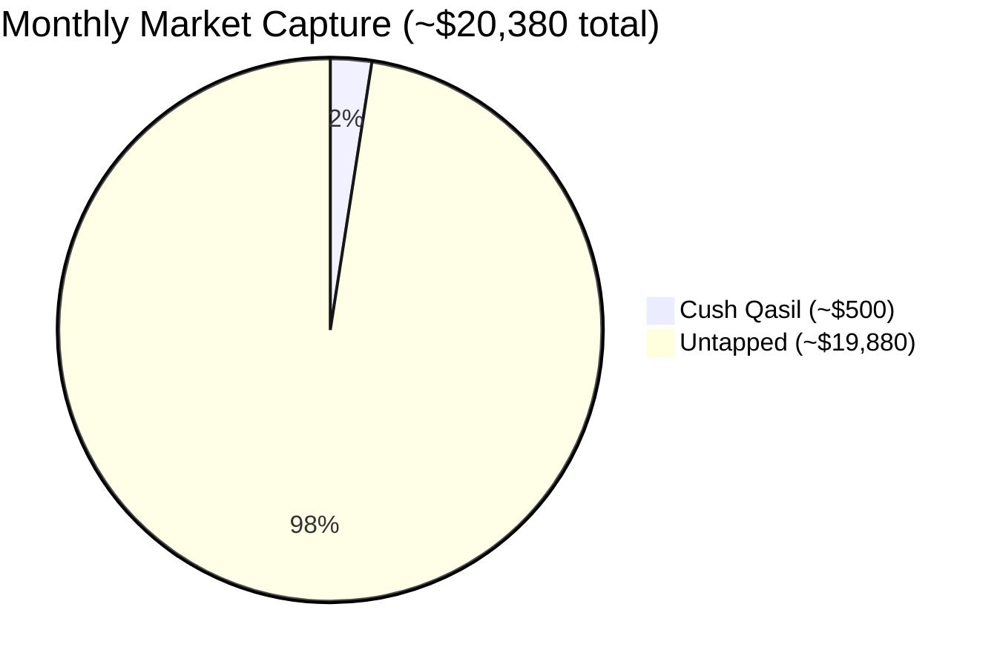
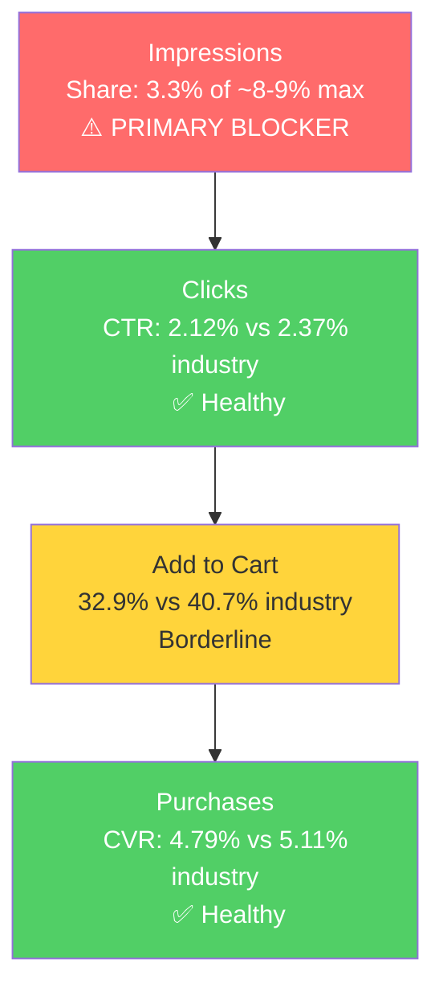

# Cush Qasil x MerchantBots: Proposal

As covered on the call: the product converts. Visibility is the problem. Here's the opportunity, the fix, and what it costs.

## The Opportunity

You're capturing ~$500/month out of a ~$20,000/month addressable market on qasil-related searches. That's roughly 2.5% of the pie.

The 97.5% isn't going to a competitor with a better product. It's going to whoever shows up first in the search results. Right now, that's not you.

## Where the Funnel Breaks (Tier 1: core "qasil powder" searches)

**Reading the funnel:** You lose the battle at the very top. Only 3.3 out of every 100 shoppers searching "qasil powder" ever see your listing. But once they do see it, they click at near-market rate, add to cart, and buy at near-market rate. The product works. The funnel works. It just starts far too narrow.

**What this means for the fix:** You don't need a new product, new images, or a new story. You need to show up more. PPC solves that on day one. And because every paid sale lifts your organic rank, paid visibility compounds into free visibility over time. That's the growth engine we're turning on.

## Listing Optimisations (The Other Lever)

PPC gets more shoppers to your listing. These changes get more of those shoppers to buy. Specifics we've already identified:

**Title** - Currently a 180-character pipe-separated keyword dump with a typo ("somalia Powder"). Your strongest differentiator (patented ionization + lab testing) isn't even in it.
- *Current:* "...Deep Cleansing | Brightens | Minimizes Pores | Reduces Acne..."
- *Proposed:* "Cush Qasil Powder for Face, Hair & Body, 100% Pure Organic Somali Qasil, Patented Ionization Cleaned & Lab Tested, Natural Facial Cleanser, Pore Minimizer, Skin Brightening Mask (2.0 oz)"

**Bullets** - All 5 are 280+ characters with a readability score of 19.2 (extremely low). Phrases like "coveted beauty elixir" and "versatile marvel" sound AI-generated. Skincare buyers want clear ingredient and safety info, not flowery copy. We'll rewrite with allcaps lead-ins ("LAB TESTED PURITY - ...") and lead with your differentiator, not bury it in bullet 2.

**A+ Content** - Two of your nine modules are duplicate text-only FAQ blocks. That's ~22% of your premium A+ real estate wasted. The lab-testing/patent module (your strongest trust builder) is buried last where most shoppers never scroll. We'll restructure so it leads, replace duplicate FAQs with visual content, and push key messaging onto the images themselves per 2026 best practice.

**Brand Store** - Missing. This blocks you from running Sponsored Brand ads and loses brand equity from returning customers.

**Compliance Fix** - The listing currently claims "US-manufactured," which you confirmed isn't accurate. Needs correcting to avoid compliance risk. Quick fix, high priority.

## Action Plan

**Weeks 1-2 (covered by onboarding):**
- Launch Tier 1 exact match campaign: "qasil powder", "qasil", "organic qasil powder"
- Launch auto-discovery campaign to surface winning search terms
- Launch branded defense on "cush qasil"
- Rewrite title (currently a 180-char keyword dump)
- Set up Request-a-Review automation

**Weeks 3-4:**
- Tier 2 campaign on use-case queries (qasil for face, qasil for hair)
- Adjacent product page ads on top "powder face wash", "exfoliating powder", "organic face mask" listings (10,000+ monthly searches where qasil has never appeared)
- Rewrite bullets for scannability

**Weeks 5-8:**
- A+ content redesigned as image-only
- Sponsored Brand Video launched using your existing videos
- Brand store built
- Scale spend on proven ROAS, cut what isn't working

## Pricing

- **Onboarding: $500** one-time, covers everything in Weeks 1-2
- **Management fee: 6% of gross sales**
- **Ad spend (paid by you to Amazon):**
  - Month 1: $25/day (~$750) - learning mode
  - Month 2: Scale to $1,500/month **only if profitable**. If Month 1 doesn't prove ROAS, we stay lean until it does.

No lock-in on scale-up. We only spend more when the data justifies it.
