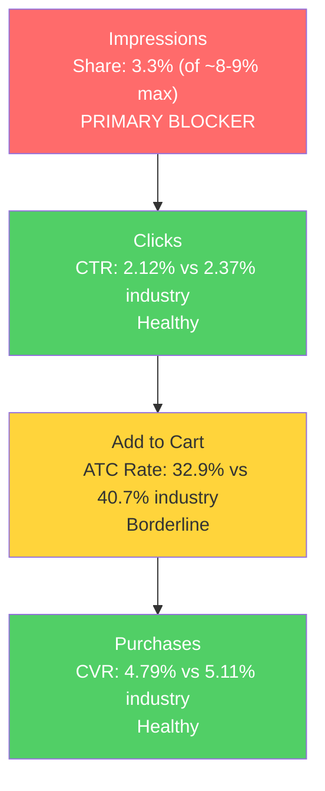

# SQP Analysis: P0 - Cush Qasil Organic Qasil Powder

## Tagging Rationale

- **Tier 1 (Hero):** Queries where the customer is searching specifically for qasil powder. The product is the exact answer. Includes: "qasil powder", "qasil powder organic", "qasil", "organic qasil powder".
- **Tier 2 (Use-case specific):** Queries that add a specific use case (face, hair, beard) to the qasil search. Same product, narrower intent. Includes: "qasil powder organic for face", "qasil powder for face", "qasil powder for hair", "qasil powder organic for hair", "qasil face mask", "qasil hair mask", "qasil powder hair growth", "qasil powder natural face cleanser".
- **Tier 3 (Misspellings):** Common misspellings of qasil. Includes: "quasil", "quasil powder", "kesil powder organic". Small volume but 100% intent match.
- **Branded:** "cush" (branded query, not a growth lever).

**Important context:** The brand also appears with 1-5 impressions on massive broad queries like "body wash" (1.1M volume), "hair mask" (300k), "soap" (280k), "face cleanser" (95k). It has zero clicks on any of these. These are NOT tagged because the product is not competitive in these markets. A qasil powder listing will never win clicks against mainstream face cleansers and hair masks. The entire addressable market is the qasil niche.

## Catalog Overlap Check

Single-product brand. Only one product ranks for all tagged queries. No adjustment to impression share cap needed. Cap remains at ~8-9% for all tiers.

## Market Sizing (12-month average, Apr 2025 - Mar 2026)

| Tier | Monthly Search Volume | Monthly Add to Carts (Market) | Monthly Purchases (Market) | Est. Market Size ($/mo) |
|------|----------------------|-------------------------------|---------------------------|------------------------|
| Tier 1 | 3,913 | 814 | 95 | $16,280 |
| Tier 2 | 727 | 190 | 19 | $3,800 |
| Tier 3 | ~90 | ~15 | ~3 | ~$300 |
| **Total P0** | **~4,730** | **~1,019** | **~117** | **~$20,380** |

*Estimated using $20 avg product price based on competitive landscape analysis.*

**Seasonality:** Tier 1 search volume shows a notable spike in Dec 2025 (6,016 vs ~3,000-4,000 average). This is likely holiday gifting rather than a seasonal use pattern. The brand's revenue dip in Sep 2025 ($560) aligns with a search volume trough that month (3,057), suggesting some market-level seasonal variation.

## Market Share and Potential (Jan - Mar 2026)

| Tier | Impression Share | Click Share | Cart Share | Purchase Share | Trend |
|------|-----------------|-------------|------------|---------------|-------|
| Tier 1 | 3.3% | 2.9% | 2.5% | 2.7% | Declining from 2025 peak |
| Tier 2 | 3.2% | 3.6% | 2.2% | 5.0% | Volatile, low base |

**Key observations:**
- Tier 1 impression share at 3.3% is well below the ~8-9% single-product cap. The brand is only capturing about 37% of its potential impression share.
- Purchase share (2.7% on Tier 1) roughly aligns with impression share, meaning the brand converts at approximately the market rate when it shows up. This confirms the product is competitive; the constraint is visibility.
- Tier 2 numbers are too small for reliable rate analysis (44 brand clicks, 3 purchases across 3 months).
- Annual context: In mid-2025, the brand was getting 117-133 clicks/month on Tier 1. By Q1 2026, that dropped to 44-62 clicks/month. Impression share has been declining as organic rankings erode without PPC support.

## Blockers & Growth Path

**Blocker Detection (Tier 1, volume-weighted 3-month rates):**

| Metric | Brand | Industry | Gap | Assessment |
|--------|-------|----------|-----|------------|
| Impression Share | 3.3% | (cap ~8-9%) | -56% of cap | **Primary Blocker** |
| CTR | 2.12% | 2.37% | -11% | Healthy (within range) |
| ATC Rate | 32.9% | 40.7% | -19% | Secondary concern |
| CVR | 4.79% | 5.11% | -6% | Healthy |

| Tier | Impression Share | CTR (Brand vs Industry) | CVR (Brand vs Industry) | Primary Blocker | Growth Path |
|------|-----------------|------------------------|------------------------|-----------------|-------------|
| Tier 1 | 3.3% (of ~8-9% max) | 2.12% vs 2.37% | 4.79% vs 5.11% | Impression Share | PPC scaling: converts at market rate when visible, needs more visibility. No listing fix required before scaling. |
| Tier 2 | 3.2% (of ~8-9% max) | 3.67% vs 3.18% | 6.82% vs 4.92% | Impression Share | PPC scaling: same pattern as Tier 1. Note: Tier 2 rates based on very small sample (44 clicks), treat directionally. |
| Tier 3 | N/A | N/A | N/A | N/A | Too small to analyze separately. Misspellings will capture organically as Tier 1 visibility improves. |

**Growth path summary:** This is a textbook "low impression share + decent CVR" pattern. The brand converts competitively when it shows up but only captures 3.3% of available impressions. PPC is the direct lever. With zero ad spend currently, launching even a modest campaign on Tier 1 keywords would roughly double the brand's visibility on these queries. Beyond search ads, product page targeting on adjacent ASINs (powder cleansers, exfoliating powders, organic face masks) opens a significant product discovery channel, exposing qasil to shoppers who have never heard of it but are browsing the same product format.

## Insights

- P0 (Qasil Powder) currently captures ~2.7% purchase share on core qasil queries (~$540/mo from search), which is consistent with Seller Analytics data showing ~$400-460/mo in recent months. Significant growth upside exists both from increasing share on core queries and from product discovery in adjacent categories (powder cleansers, exfoliating powders) through product page targeting.
- The primary blocker is impression share (3.3% of ~8-9% max), not conversion. With zero PPC, all visibility is organic, and organic rankings have been eroding over the past 12 months. This directly explains the revenue decline from $1,200-1,800/mo to $300-460/mo.
- The ATC rate gap (32.9% vs 40.7% industry) is a secondary concern but could be addressed through listing bullet improvements. The current bullets are nearly unreadable (readability score 19.2) and may be hurting the add-to-cart decision after shoppers click through.

## Things to Investigate Further

- The ATC rate gap of ~19% below industry suggests the listing may be losing shoppers between click and cart. This could be driven by: (a) bullet readability issues making it hard to confirm purchase intent, (b) per-ounce pricing shock when comparing to larger competitor containers, or (c) low review count (96) vs competitors. Listing optimization before PPC scaling would maximize ROI.

## Questions for the Seller

- Are there plans to expand the product line (e.g., larger sizes, pre-mixed formulations, complementary products)? Product line expansion combined with the PPC and product discovery strategy would compound the growth opportunity.
