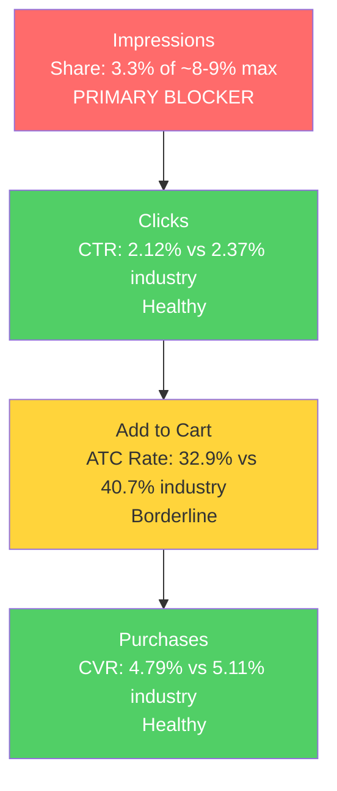

# Seller Central Audit: Cush Qasil

## Section 1: Catalog Assessment

| Priority | Product | 3-Mo Sales | 3-Mo Ad Spend | ROAS | TACoS | Organic Sales | Ad Sales % | Buy Box % | CVR | Trend |
|----------|---------|-----------|--------------|------|-------|---------------|-----------|-----------|-----|-------|
| P0 | Qasil Powder (B0BTTDY2ML) | $1,120 | $0 | N/A | N/A | $1,120 (100%) | 0% | 90.5% | 11.5% | Declining |

Single-product catalog. No P1, P2, or P3. Revenue has declined ~74% from peak ($1,779/mo in Dec 2024 to $460/mo in Mar 2026). The entire decline is driven by traffic loss, not conversion. The brand has never run ads on Amazon.

## Section 2: Qualitative Product Understanding (P0)

**Product:**
- 100% pure organic qasil powder (2.0 oz, $19.99). Qasil is a traditional Somali beauty ingredient from the Gob tree, used for centuries as a natural skin cleanser and hair treatment.
- Single-ingredient, multi-use: face cleanser, face mask, body mask, hair mask, beard mask, shampoo alternative.
- Key differentiator: lab-tested in US accredited labs, US-manufactured under FDA/GMP guidelines, proprietary ionization technology for purity. Air-shipped for freshness.
- Purchase motivation: cultural connection to Somali beauty traditions combined with clean beauty appeal. Replaces multiple products with one natural ingredient.

**Customer:**
- Primary: Somali and East African diaspora seeking familiar beauty products on Amazon.
- Secondary: Natural/organic skincare enthusiasts and beard care users.
- Purchase driver: purity, safety, and cultural authenticity. Subscribe & Save enabled for repeat buyers.

**Brand:**
- Legitimate DTC brand with website (cushqasil.com), Amazon, and Etsy presence. Not white-label.
- Cohesive identity: premium gold/green aesthetic across packaging, images, and website.
- FDA/GMP compliance and third-party lab testing prominently featured.
- Brand vibe: premium natural, culturally rooted. Bridges traditional Somali heritage with modern clean beauty positioning.

**Competitive Landscape:**
- Price positioning: Competitors sell 4-5 oz for $22-28 (~$5-6/oz). Cush Qasil at $19.99/2 oz ($10/oz) is ~2x premium per ounce, justified by purity/safety claims.

| Competitor | Product | Price | Size | Differentiator |
|-----------|---------|-------|------|---------------|
| Huda Organics | Organic Qasil Powder | ~$22 | 4 oz | UK-based, organic certified |
| E.A. Skin Solutions | Qasil Powder | ~$25 | 5 oz | Larger size, value positioning |
| Qasil Organics | Pure Qasil | ~$24 | 4 oz | Organic focus |
| Uhuru Naturals | Qasil Powder | ~$22 | 4 oz | Broader African beauty line |

- Cush Qasil has the strongest safety/purity story in the market. No competitor matches the lab testing and ionization claims.

**Listing Quality:**

**Strengths:**
- Premium main image and packaging communicate quality at first glance
- Full 8-image gallery with comparison chart, lab certificates, use-case infographics
- 2 videos (>30 sec)
- Premium A+ content (9 modules)
- 4.4-star rating from 96 reviews (71% five-star)
- Subscribe & Save enabled

**Opportunities:**
- Title is a 180-character keyword dump with low readability. "somalia Powder" at the end is oddly capitalized. Needs restructuring to lead with product type and key benefit.
- Bullets are 280-335 characters each with a readability score of 19.2 (extremely low). Dense text walls that shoppers will skip. Need rewriting with scannable allcaps headers and concise copy under 200 characters each.
- A+ content has 938 words of text with duplicated FAQs. Should be redesigned as image-only with text overlaid on images per 2026 best practice.
- No brand store, a missed opportunity for Sponsored Brand ad destinations.

## Section 3: Quantitative Product Understanding (P0)

**Annual Trend:**

| Metric | Dec 2024 (Peak) | Apr 2025 (Plateau) | Sep 2025 (Trough) | Mar 2026 (Latest) |
|--------|----------------|-------------------|-------------------|-------------------|
| Total Sales | $1,779 | $1,219 | $560 | $460 |
| Sessions | 796 | 414 | 214 | 181 |
| CVR | 11.3% | 15.0% | 13.1% | 13.3% |
| Buy Box % | 99.0% | 96.8% | 98.4% | 93.2% |

- Revenue decline of 74% over 15 months is entirely traffic-driven. Sessions dropped from 796 to 181 while CVR remained stable (11-15%). The product converts when found.
- Buy box was rock-solid (97-99%) through 2025 but has become volatile in Q1 2026 (dipping to 84% in Feb). This is a new development. For a private label brand with no competing sellers, this likely indicates pricing-related suppression.

**Rating Trajectory:** Improving. Dropped from initial 5.0 to 3.9 (May 2024) as early negative reviews hit hard on a small base, then recovered to 4.4 by Jan 2026.

**Sales Rank Trajectory:** Volatile, no clear trend. Face Washes subcategory rank fluctuates between ~1,500 and ~3,000. Consistent with a low-volume product where a few daily orders significantly move the rank.

## Section 4: Market Opportunity (SQP)

**Tier Breakdown:**

- **Tier 1 (Hero):**
  - **Keywords:** qasil powder, qasil powder organic, qasil, organic qasil powder
  - **Rationale:** Core product-type queries. Someone searching these is looking for exactly what Cush Qasil sells.

- **Tier 2 (Use-case specific):**
  - **Keywords:** qasil powder organic for face, qasil powder for face, qasil powder for hair, qasil powder organic for hair, qasil face mask, qasil hair mask, qasil powder hair growth, qasil powder natural face cleanser
  - **Rationale:** Same product, narrower intent. Shoppers specifying face, hair, or mask use case.

- **Tier 3 (Misspellings):**
  - **Keywords:** quasil, quasil powder, kesil powder organic
  - **Rationale:** Common misspellings. Too small to analyze separately; visibility will improve organically as Tier 1 performance improves.

**Market Sizing:**

| Tier | Monthly Search Volume | Monthly Add to Carts (Market) | Monthly Purchases (Market) | Est. Market Size ($/mo) |
|------|----------------------|-------------------------------|---------------------------|------------------------|
| Tier 1 | 3,913 | 814 | 95 | $16,280 |
| Tier 2 | 727 | 190 | 19 | $3,800 |
| Tier 3 | ~90 | ~15 | ~3 | ~$300 |
| **Total P0** | **~4,730** | **~1,019** | **~117** | **~$20,380** |

*Estimated using $20 avg product price based on competitive landscape analysis.*

This is a very small market. The entire qasil powder market on Amazon generates approximately $20,000/month across all brands.

**Blockers & Growth Path:**

| Tier | Impression Share | CTR (Brand vs Industry) | CVR (Brand vs Industry) | Primary Blocker | Growth Path |
|------|-----------------|------------------------|------------------------|-----------------|-------------|
| Tier 1 | 3.3% (of ~8-9% max) | 2.12% vs 2.37% | 4.79% vs 5.11% | Impression Share | PPC scaling: converts at market rate, needs more visibility |
| Tier 2 | 3.2% (of ~8-9% max) | 3.67% vs 3.18% | 6.82% vs 4.92% | Impression Share | PPC scaling: same pattern (small sample, directional only) |

**ICAP Funnel Visual (Tier 1):**

- Impression share is the clear bottleneck. The brand only shows up for 3.3% of searches on its core keywords. Without PPC, organic visibility has been declining steadily, explaining the 74% revenue drop over 15 months.
- CTR and CVR are healthy, meaning the product competes well when visible. The growth path is straightforward: increase visibility through PPC.
- The ATC rate gap (32.9% vs 40.7% industry, ~19% below) is a secondary concern. Likely driven by bullet readability issues or per-ounce pricing comparison. Listing optimization would close this gap before scaling traffic.

## Section 5: Ad Analysis

### Account Level

**No campaigns exist.** Cush Qasil has never run Amazon PPC. This is the primary finding: a product with healthy conversion metrics and a clear impression share blocker has zero paid support.

### Product Level (P0)

**Impression Share Blocker: Zero PPC Addressing Tier 1/2 Queries**

Section 4 identified impression share as the primary blocker on Tier 1 (3.3% of ~8-9% max). The PPC lever is bidding on the keywords where impression share is low. Currently, there are no ads bidding on any keywords.

**Finding: No PPC support on a product with declining organic visibility**

**Problem:**
- Zero ad spend across the entire account history
- Organic impressions on Tier 1 queries have declined from ~3,800/mo (May 2025) to ~2,300/mo (Mar 2026), a 40% drop
- Without PPC, the brand has no mechanism to halt or reverse the organic rank decline
- This is a "death spiral" pattern: fewer organic impressions lead to fewer sales, which lowers organic rank, which leads to even fewer impressions

**Solution:**
- Launch Tier 1 exact match campaign targeting "qasil powder", "qasil powder organic", "qasil", "organic qasil powder"
- Launch Tier 2 exact match campaign targeting use-case specific queries
- Launch auto campaign for long-tail discovery
- Launch small branded defense campaign
- Total starting budget: $12-22/day (~$400-660/month)

**Impact:**
- At current industry CTR (2.37%) and CVR (5.11%), every 1,000 additional impressions generates ~1.2 sales (~$24 in revenue)
- Doubling impression share from 3.3% to ~6-7% would add ~2,400 monthly impressions on Tier 1 alone, yielding ~3 additional sales/month (~$60/mo in direct PPC revenue)
- The real impact is the organic halo: PPC-driven sales velocity improves organic ranking, which increases free impressions. The PPC investment pays for itself by restoring organic visibility.
- Subscribe & Save amplifies this: each PPC-acquired customer generates repeat revenue at zero acquisition cost.

**What PPC Cannot Solve:**
- Market size ceiling. Even with dominant impression share, the total market is ~$20k/mo. Maximum realistic P0 revenue with optimized PPC and organic is ~$1,000-1,500/month.
- Per-ounce pricing gap versus competitors (Cush Qasil at ~$10/oz vs competitors at ~$5-6/oz).
- Low review count (96 after 3+ years).

## Section 6: Action Plan

The primary blocker is impression share. The brand has zero PPC, declining organic visibility, and a product that converts at market rate. The first actions focus on launching PPC to break the organic decline spiral, followed by listing optimizations to maximize conversion from the increased traffic.

### Weeks 1-2: Immediate Actions

- **Launch Tier 1 Exact Match Campaign** targeting "qasil powder", "qasil powder organic", "qasil", "organic qasil powder". Start bids at $1.50-2.00 for Top of Search placement. Budget: $5-10/day. (Addresses: impression share blocker, Section 4)
- **Launch Auto Campaign** at $3-5/day for keyword discovery. Amazon's algorithm may surface long-tail qasil variations the brand hasn't identified. (Addresses: discovery of additional search terms)
- **Launch Branded Defense Campaign** on "cush qasil" and "cush" at $1-2/day to prevent competitor poaching. (Addresses: branded defense, low priority but easy to set up)
- **Enable Request a Review** automation for all orders. With only 96 reviews after 3+ years, accelerating review collection is critical. (Addresses: low review count, Section 2 listing opportunity)

### Weeks 2-4: Short-Term Optimizations

- **Launch Tier 2 Exact Match Campaign** targeting use-case queries (qasil powder for face, qasil powder for hair, etc.). Budget: $3-5/day. (Addresses: impression share on Tier 2, Section 4)
- **Rewrite title** to improve readability and keyword positioning. Lead with "Cush Qasil Organic Qasil Powder" and structure for both search relevance and shopper comprehension. (Addresses: title readability, Section 2 listing opportunity)
- **Rewrite bullets** with allcaps scannable headers and concise copy under 200 characters each. Priority order: (1) purity/safety, (2) multi-use versatility, (3) results, (4) how to use, (5) lab testing. (Addresses: bullet readability score of 19.2, Section 2; ATC rate gap, Section 4)
- **Review search term report** from auto campaign. Graduate any converting terms to manual exact match campaigns. Negate irrelevant terms.

### Weeks 4-6: Medium-Term Growth

- **Redesign A+ content** as image-only. Remove standalone text modules and FAQs. Design key selling points (purity, multi-use, lab testing, comparison vs competitors) directly onto images. Remove duplicated FAQ sections. (Addresses: A+ text-heavy design, Section 2 listing opportunity)
- **Monitor CVR impact** from title and bullet changes (weeks 2-4). If CVR improves, this validates the listing optimization before further scaling.
- **Adjust PPC bids** based on 4 weeks of data. Reduce bids on keywords that aren't converting, increase on high-ROAS terms. Move from aggressive launch bids to efficient steady-state bids.
- **Consider Vine enrollment** if eligible. With only 96 reviews, even 10-15 additional reviews would meaningfully increase social proof.

### Weeks 6-8: Scaling and Evaluation

- **Scale PPC** on keywords with proven ROAS from weeks 1-6. Increase daily budgets on converting campaigns.
- **Create brand store** on Amazon. Use it as a Sponsored Brand ad landing page to tell the brand story (Somali heritage, lab testing, multi-use). (Addresses: no brand store, Section 2)
- **Evaluate product line expansion opportunity.** With the qasil market capped at ~$20k/month, long-term growth for the brand on Amazon requires either: (a) larger size options to capture price-sensitive customers, (b) pre-mixed formulations (ready-to-use qasil face mask), or (c) complementary products (qasil-based body wash, shampoo bar). Flag this as a strategic conversation for the call.
- **Assess organic rank recovery.** Compare Tier 1 impression share at week 8 vs. baseline 3.3%. If PPC has lifted organic visibility (expected), begin testing lower PPC spend while maintaining organic position.

## Section 7: Insights & Questions for the Seller

**Insights:**

- P0 (Qasil Powder) is a well-differentiated product with a genuine competitive moat (lab testing, US manufacturing, ionization technology) that converts at market rate when shoppers find it. The 74% revenue decline is entirely a visibility problem caused by zero ad support while organic rankings eroded.
- The total addressable qasil market on Amazon is ~$20,000/month. This is a fundamental ceiling for a single-product brand. Even with perfect execution, P0 revenue caps at roughly $1,000-1,500/month. Transformative growth requires product line expansion.
- Per-ounce pricing is approximately 2x competitors ($10/oz vs $5-6/oz). This premium is justified by the safety/purity story but creates a potential conversion headwind when shoppers compare options. The listing currently does not make the size-to-value tradeoff clear enough.
- The brand has strong assets (premium packaging, lab certificates, 2 videos, Premium A+) but the text elements (title, bullets, A+ copy) are holding back their impact. Readability improvements are low-effort, high-impact changes.

**Questions for the Seller:**

- The brand has never run ads. Is this a conscious decision (margin constraints, budget limitations, lack of expertise), or has PPC simply not been explored? Understanding the reason will shape how aggressively we recommend scaling. If margins are tight at $19.99, we need to know the floor before recommending ad spend.
- Review count is 96 after 3+ years. Has there been any review generation effort (Vine, Request a Review, inserts)? If not, this is an easy win. If yes and reviews are still slow, the low order volume may be the root cause, which PPC would help address.
- The total qasil market is small (~$20k/month). Are there plans to expand the product line? Larger sizes, pre-mixed formulations, or complementary products would dramatically increase the brand's addressable market on Amazon.
- Buy box has dropped from 97-99% historically to 84-93% in Q1 2026. Have there been recent price changes or any listing issues flagged by Seller Central? For a private label product with no competing sellers, this volatility is unusual and worth investigating.
