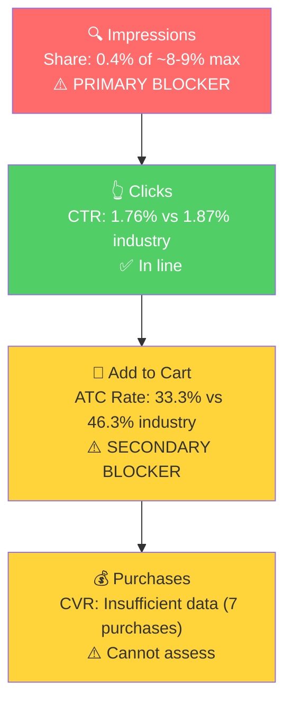

# SQP Analysis: P0 - Dabbldoo Kids Food Picks

## Tagging Rationale

- **Tier 1 (Hero):** "food picks for kids", "kids food picks", "food picks", "fruit picks". Queries where the customer is searching for exactly what this product is: food picks designed for children. Dabbldoo is a direct answer to these searches.

- **Tier 2 (Core market):** "toddler eating utensils", "feeding therapy", "kid utensils", "kids utensils", "kids utensil set", "toddler utensils", "toddler utensils 3 year old". Broader feeding utensil queries where Dabbldoo is one solution among many (forks, spoons, chopsticks). Larger market but the product competes against a wider set of alternatives.

- **Tier 3 (Adjacent):** "kids lunch accessories", "bento accessories", "lunchbox accessories for kids", "lunch box accessories for kids", "bento box accessories", "toddler chopsticks". Lunchbox and bento accessory queries where the product can appear but is not the primary intent. These shoppers are looking for lunchbox gear broadly, not specifically food picks for picky eaters.

**Catalog Overlap Check:** Single-product catalog. No overlap. All tiers use the default impression share cap of ~8-9%.

**Important context on Tier 2:** The Tier 2 search volumes are volatile because the query count varies by month (1-7 queries contributing). Months with higher query counts (Jun, Aug, Sep, Nov, Dec) show much higher search volumes. This means some Tier 2 queries only appear in certain months, likely because the brand only earns enough impressions to be included in SQP data during months with higher activity.

## Market Sizing

12-month averages (Mar 2025 - Feb 2026):

| Tier | Avg Monthly Search Volume | Avg Monthly Cart Adds (Market) | Avg Monthly Purchases (Market) | Est. Market Size ($/mo) |
|------|--------------------------|-------------------------------|-------------------------------|------------------------|
| Tier 1 | ~8,200 | 1,685 | 457 | $25,275 |
| Tier 2 | ~23,000 | 5,058 | 1,788 | $75,870 |
| Tier 3 | ~18,500 | 3,713 | 524 | $55,695 |
| **Total P0** | **~49,700** | **10,456** | **2,769** | **$156,840** |

*Estimated using $15 avg product price based on competitive landscape analysis. The market is split between bulk plastic picks ($7-10) and premium feeding utensils ($15-30), with bulk products dominating volume.*

**Seasonality note:** Tier 1 search volume shows a notable spike in Aug 2025 (19,621 vs typical 4,000-10,000). Tier 2 shows spikes in Aug-Sep and Nov-Dec. This aligns with back-to-school (Aug-Sep) and holiday gift-giving (Nov-Dec) patterns. The seller's revenue spike in Nov 2025 partially aligns with the holiday SQP volume increase, but the magnitude of the seller's spike (10x+) far exceeds the market volume increase (~2x), suggesting external traffic was the primary driver.

## Market Share and Potential

3-month share (Dec 2025 - Feb 2026):

| Tier | Impression Share | Click Share | Cart Share | Purchase Share | Trend |
|------|-----------------|-------------|------------|---------------|-------|
| Tier 1 | 0.30-0.56% | 0.33-0.47% | 0.19-0.21% | 0.31-0.34% | Recovering (Jan was dead) |
| Tier 2 | 0.01-0.05% | 0-0.05% | 0-0.02% | 0-0.03% | Near zero |
| Tier 3 | 0.01-0.10% | 0-0.10% | 0-0.10% | 0% | Near zero |

The brand is essentially invisible across all tiers. Even on Tier 1 hero queries, impression share is under 1% against a cap of ~8-9%. On Tier 2 and Tier 3, the brand barely registers.

**Nov 2025 was an exception:** During the traffic spike month, Tier 1 impression share reached ~0.97% (2,625 impressions out of 270,836) and Tier 2 reached ~0.10%. Even at its peak visibility, the brand captured less than 1% of Tier 1 impressions.

## Blockers & Growth Path

| Tier | Impression Share | CTR (Brand vs Industry) | CVR (Brand vs Industry) | Primary Blocker | Growth Path |
|------|-----------------|------------------------|------------------------|-----------------|-------------|
| Tier 1 | 0.4% (of ~8-9% max) | 1.76% vs 1.87% (in line) | ATC: 33.3% vs 46.3% (28% below) | Impression Share | PPC launch on hero keywords. Secondary: address ATC gap via review building and brand video. |
| Tier 2 | <0.05% (of ~8-9% max) | N/A (32 clicks annual) | N/A (1 purchase annual) | Impression Share | PPC expansion after Tier 1 validated. Much larger market ($75K/mo) but broader competition. |
| Tier 3 | <0.1% (of ~8-9% max) | N/A (20 clicks annual) | N/A (0 purchases annual) | Impression Share | Lower priority. Test after Tier 1 and 2 show traction. Intent mismatch risk is higher here. |

**Statistical significance and annual fallback:** 3-month brand volumes were too thin (30 clicks on Tier 1, 11 on Tier 2). Falling back to the full 12-month data per workflow guidance:

**Tier 1 annual blocker detection (87 brand clicks, 29 carts, 7 purchases over 12 months):**
- **CTR:** Brand 1.76% vs Industry 1.87%. Essentially in line. **Not a blocker.**
- **ATC Rate:** Brand 33.3% vs Industry 46.3%. 28% below industry. **Secondary blocker.** Shoppers who click are not adding to cart at the expected rate. Likely driven by (1) low review count (8 reviews vs competitors with hundreds) reducing trust at the PDP level, and/or (2) price shock when shoppers see $24 for 2 picks after clicking from a search page showing bulk picks at $7.
- **CVR (Click-to-Purchase):** Brand 8.0% vs Industry 12.5%. 36% gap, but only 7 purchases over 12 months. Not statistically significant even at the annual level. Move up the funnel to ATC rate (above).

**Tier 2 and Tier 3:** Still insufficient even at annual level (32 and 20 clicks respectively). Cannot assess.

**ICAP Funnel Visual (Tier 1):**

**Growth potential:** Tier 1 alone has ~$25K/mo in market cart adds. If the brand can reach 5% impression share (from 0.4%) through PPC, the revenue opportunity is significant. However, the ATC gap (33% vs 46%) means the listing will underconvert clicks into carts until the review count and/or price perception issue is addressed. This reinforces that Vine enrollment and brand video should happen in parallel with PPC launch, not after.

## Insights

- P0 (Kids Food Picks) has a clear, solvable problem: near-zero visibility. The product is essentially not showing up on Amazon search. With 0.4% impression share on Tier 1 and <0.05% on Tier 2, the brand is leaving almost all addressable market demand on the table.
- The total addressable market across all three tiers is approximately $157K/mo in cart add value. Even modest impression share gains (e.g., reaching 3-4% on Tier 1) represent a meaningful revenue opportunity for a brand currently doing ~$1,450/mo.
- The Nov 2025 spike was not driven by SQP search volume increases. Market search volume was only modestly higher in Nov, while the brand's sessions jumped 10x+. This confirms the spike was driven by an external traffic source, not organic Amazon search discovery.

## Questions for the Seller

- Has the brand explored Amazon PPC at all? The zero ad spend combined with near-zero organic impression share means the product is essentially undiscoverable on Amazon search. PPC is the fastest path to visibility.
