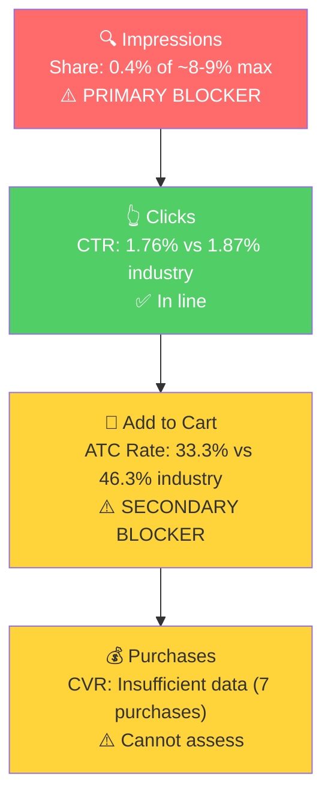

# Seller Central Audit: Dabbldoo

## Section 1: Catalog Assessment

| Priority | Product | 3-Mo Sales | 3-Mo Ad Spend | ROAS | TACoS | Organic Sales | Ad Sales % | Buy Box % | CVR | Trend |
|----------|---------|-----------|--------------|------|-------|---------------|-----------|-----------|-----|-------|
| P0 | Kids Food Picks | $2,098 | $0 | N/A | N/A | $2,098 (100%) | 0% | ~100% | 6.1% | Growing |

Single-product brand. No P1/P2/P3 exist. All revenue comes from one parent ASIN (B0FXXTL4FN) with three children: a 2-Pack, 3-Pack, and third variant.

Note: Jan 2026 was essentially dead ($0 sales), so the 3-month total understates the current trajectory. Feb + Mar alone = $2,098, with Mar at $1,450 (the strongest recent month).

## Section 2: Qualitative Product Understanding (P0)

**Product:**
- Animal-shaped food picks and brush set for toddlers (3+): Frog pick, Chameleon pick, and a unique Snake sauce brush for self-applying dips and dressings
- Made from food-grade silicone and reinforced nylon. BPA-free, phthalate-free, dishwasher safe
- Designed by a registered dietitian using a "poke & explore" method to reduce mealtime anxiety through play
- Purchase motivation: parents frustrated with picky eaters seeking tools that make food exploration feel like play, not pressure

**Customer:**
- Primary: parents of toddlers/young children (ages 3-6) who struggle with picky eating. Likely moms, age 25-40
- Secondary: occupational therapists and feeding therapists using these as clinical tools

**Brand:**
- Registered brand (Amazon Brand Registry). DTC-first, recently expanding to Amazon
- Founded by Ellie, a registered pediatric dietitian and mom of three based in Lehi, Utah
- Professional Shopify website (dabbldoo.com). Active Instagram (@dabbldoo). No TikTok presence
- Featured on Your Kid's Table, a major pediatric OT blog. Endorsed by occupational therapists
- Brand vibe: warm, playful but premium. Cream/orange tones, clean design. Clinical credibility meets play-based feeding

**Competitive Landscape:**

Dabbldoo competes in the **premium ergonomic feeding tools** segment, not the bulk disposable picks segment that dominates Amazon search.

Price positioning: Avg premium feeding utensil set: $13-20 | Dabbldoo 3-Pack: ~$29.99 | 2-Pack: ~$23.99 | 50-80% above segment average

| Competitor | Product | Price | Key Differentiator |
|-----------|---------|-------|--------------------|
| NumNum GOOtensils | Pre-spoon + fork set | $13-20 | Established brand, retail (Target), stainless steel |
| Grabease | Self-feeding utensil set | $12-15 | Mom-founded, Target/Walmart distribution |
| FATLODA | 100-156 piece plastic picks | $6-10 | Category leader by review count, disposable |
| Vicuna R | 150 piece plastic picks | $6-10 | 2,000+ reviews, generic bulk |

Key differentiators: only brand with credentialed founder (pediatric dietitian), unique snake sauce brush (no competitor has this), premium materials, therapeutic positioning. Key gap: dramatic price premium vs bulk alternatives ($12/pick vs $0.05/pick).

**Listing Quality:**

**Strengths:**
- Main image: clean, professional product photography clearly showing all 3 animal picks
- Gallery images (9): strong mix of product shots and lifestyle imagery with kids
- Bullets (7): exceptionally well-written, benefit-driven headers with Unicode formatting, covering key purchase concerns
- A+ Content (5 modules): professional founder story with Ellie's photo, competitor comparison, safety messaging
- Customer video: 158-second authentic review ("Game changer for picky eaters!!!")

**Opportunities:**
- Rating: 5.0 stars from only 8 reviews. Perfect rating but fragile. Low review count is likely the biggest listing-level CVR constraint
- Title: missing "Dabbldoo" brand name, "Kids Food Picks" repeated twice
- No brand video demonstrating the "poke & explore" method in action

## Section 3: Quantitative Product Understanding (P0)

**Annual Trend:**

| Metric | Nov 2025 (Peak) | Dec 2025 (Crash) | Jan 2026 (Dead) | Mar 2026 (Current) |
|--------|----------------|-----------------|----------------|-------------------|
| Total Sales | $2,683 | $642 | $0 | $1,450 |
| Sessions | 2,242 | 285 | 23 | 1,134 |
| Units | 152 | 38 | 0 | 74 |
| CVR | 6.78% | 13.33% | 0% | 6.53% |
| Buy Box % | 97.14% | 48.22% | 100% | 99.95% |

- Prior to Nov 2025, this was a very small product (5-30 sessions/week, 0-3 units/week). Something drove a massive traffic spike in Nov 2025 (likely external, not organic Amazon search), proving the product has strong demand when visible.
- Dec 2025 buy box crash to 48% killed sales. Jan 2026 was dead (possible stock-out or listing suppression). Feb-Mar 2026 shows a strong recovery with buy box restored to 100%.

**Rating Trajectory:** Stable at 5.0 stars since Aug 2024. Too few reviews to identify a meaningful trend.

**Sales Rank Trajectory:** Baby Products rank ~25,000-32,000 in late Mar 2026. Moderate for the subcategory, consistent with a few sales per day.

## Section 4: Market Opportunity (SQP)

**Tier Breakdown:**

- **Tier 1 (Hero):**
  - **Keywords:** food picks for kids, kids food picks, food picks, fruit picks
  - **Rationale:** Exact product-type searches. Dabbldoo is the direct answer to these queries.

- **Tier 2 (Core market):**
  - **Keywords:** toddler eating utensils, feeding therapy, kid utensils, kids utensils, kids utensil set, toddler utensils, toddler utensils 3 year old
  - **Rationale:** Broader feeding utensil queries. Larger market but wider competitive set (forks, spoons, chopsticks).

- **Tier 3 (Adjacent):**
  - **Keywords:** kids lunch accessories, bento accessories, lunchbox accessories for kids, lunch box accessories for kids, bento box accessories, toddler chopsticks
  - **Rationale:** Lunchbox/bento accessory queries. Product can appear but is not the primary intent for most searchers.

**Market Sizing:**

| Tier | Monthly Search Volume | Monthly Add to Carts (Market) | Monthly Purchases (Market) | Est. Market Size ($/mo) |
|------|----------------------|-------------------------------|---------------------------|------------------------|
| Tier 1 | ~8,200 | 1,685 | 457 | $25,275 |
| Tier 2 | ~23,000 | 5,058 | 1,788 | $75,870 |
| Tier 3 | ~18,500 | 3,713 | 524 | $55,695 |
| **Total P0** | **~49,700** | **10,456** | **2,769** | **$156,840** |

*Estimated using $15 avg product price based on competitive landscape analysis. Market split between bulk plastic picks ($7-10) and premium feeding utensils ($15-30).*

**Blockers & Growth Path:**

| Tier | Impression Share | CTR (Brand vs Industry) | CVR (Brand vs Industry) | Primary Blocker | Growth Path |
|------|-----------------|------------------------|------------------------|-----------------|-------------|
| Tier 1 | 0.4% (of ~8-9% max) | 1.76% vs 1.87% (in line) | ATC: 33.3% vs 46.3% (28% below) | Impression Share | PPC launch on hero keywords. Secondary: address ATC gap via review building and brand video. |
| Tier 2 | <0.05% (of ~8-9% max) | N/A (32 clicks annual) | N/A (1 purchase annual) | Impression Share | PPC expansion after Tier 1 validated. 3x larger market. |
| Tier 3 | <0.1% (of ~8-9% max) | N/A (20 clicks annual) | N/A (0 purchases annual) | Impression Share | Lower priority. Test after Tier 1 and 2 show traction. |

3-month brand volumes were too thin for blocker detection (30 clicks on Tier 1). Falling back to 12-month data: Tier 1 had 87 brand clicks, 29 carts, 7 purchases over 12 months. CTR is in line with industry (not a blocker). ATC rate is 28% below industry (33.3% vs 46.3%), likely driven by low review count and/or price shock at the PDP. CVR cannot be assessed (only 7 purchases). Tier 2 and Tier 3 remain insufficient even at annual level.

Impression share is the primary blocker. ATC rate is a secondary blocker that reinforces the need for review building (Vine) and brand video in parallel with PPC launch.

**ICAP Funnel Visual (Tier 1):**

- The Nov 2025 traffic spike was not driven by SQP search volume increases. Market volume was only modestly higher, while the brand's sessions jumped 10x+. This confirms the spike was driven by an external traffic source (likely social media or PR from the Your Kid's Table feature), not organic Amazon discovery.
- Total addressable market across all tiers is ~$157K/mo. The brand currently captures less than 0.5% of even Tier 1. With zero PPC, there is massive headroom for growth.

## Section 5: Ad Analysis

**No advertising data exists for this seller.** Dabbldoo has never run Amazon PPC.

This is the single biggest lever available. There are no campaigns to restructure, no waste to cut, no auto-to-manual harvesting to perform. This is a greenfield PPC launch.

**Why PPC is the right first move:**
- Impression share is 0.4% on Tier 1 (cap: ~8-9%). The product doesn't show up
- The listing is already strong (professional images, A+ content, founder story, customer video)
- CVR is 6-7% when the product gets visibility
- Buy box is 100% with no competing sellers
- The only missing ingredient is traffic, and PPC is the fastest, most controllable way to deliver it

**Recommended PPC Launch Structure:**

**Phase 1 (Weeks 1-2): Tier 1 campaigns**

| Campaign | Type | Keywords | Match Type | Daily Budget |
|----------|------|----------|------------|-------------|
| Dabbldoo - Food Picks - Exact | Manual SP | food picks for kids, kids food picks | Exact | $15 |
| Dabbldoo - Food Picks - Broad | Manual SP | food picks for kids, kids food picks | Broad | $10 |
| Dabbldoo - Auto Discovery | Auto SP | N/A (auto) | Auto | $10 |

**Phase 2 (Weeks 3-4): Tier 2 expansion**

| Campaign | Type | Keywords | Match Type | Daily Budget |
|----------|------|----------|------------|-------------|
| Dabbldoo - Toddler Utensils - Exact | Manual SP | toddler eating utensils, kids utensils, toddler utensils | Exact | $10 |
| Dabbldoo - Feeding Therapy - Exact | Manual SP | feeding therapy, picky eater tools | Exact | $10 |

**Phase 3 (Weeks 5-8): Tier 3 and Product Targeting**

| Campaign | Type | Keywords/Targets | Match Type | Daily Budget |
|----------|------|-----------------|------------|-------------|
| Dabbldoo - Lunchbox Accessories | Manual SP | kids lunch accessories, bento accessories | Broad | $10 |
| Dabbldoo - Competitor Targeting | Manual SP | NumNum, Grabease, FATLODA ASINs | Product Targeting | $10 |

**Key risk:** The product's premium price ($24 for 2 picks) will be shown alongside bulk picks ($7 for 150 picks) on generic "food picks" searches. PPC success depends on bidding on specific "picky eater" and "feeding therapy" keywords where the premium is justified, and letting the strong listing do the conversion work.

## Section 6: Action Plan

The primary blocker is impression share across all tiers. The brand has zero advertising and near-zero organic visibility. The growth path is straightforward: launch PPC to gain visibility, let the already-strong listing convert the traffic.

### Weeks 1-2: PPC Foundation

- **Launch Tier 1 PPC campaigns** (3 campaigns: exact, broad, auto) on "food picks for kids" and "kids food picks" at $35/day combined ($1,050/mo). Starting bids: $0.75-1.00 CPC
- **Add "Dabbldoo" to the listing title** on both 2-Pack and 3-Pack variants. Current titles omit the brand name, missing branded search equity and differentiation on the search results page
- **Remove duplicate keyword** from title ("Food Picks for Kids" and "Kids Food Picks for Lunchbox" both appear). Replace with "feeding therapy" or "picky eater" to capture Tier 2 keyword coverage
- **Enroll in Amazon Vine** (if eligible) to accelerate review count. 8 reviews is critically low for PPC efficiency. Target: 25+ reviews within 6-8 weeks

### Weeks 2-4: Tier 1 Optimization and Tier 2 Expansion

- **Harvest converting search terms** from auto and broad campaigns into exact match campaigns
- **Negate irrelevant search terms** (e.g., "toddler toys", "play food", "kitchen") that will consume budget without converting
- **Launch Tier 2 PPC campaigns** targeting "toddler eating utensils", "kids utensils", and "feeding therapy" keywords. This is the 3x larger market ($76K/mo)
- **Monitor CVR** on Tier 2 keywords closely. These broader queries have higher competition from cheaper alternatives, so conversion may be lower than Tier 1

### Weeks 4-6: Content and Scaling

- **Create a brand video** (30-60 seconds) showing the "poke & explore" method in action: a toddler going from refusing food to happily eating with the picks. This is the product's strongest value prop and currently has no video demonstration
- **Launch competitor product targeting** on NumNum, Grabease, and top FATLODA listings. Shoppers browsing these products are in-market for feeding tools
- **Scale budget on winning campaigns** based on ROAS data from Weeks 1-4. Increase daily budgets on campaigns achieving >2.0 ROAS

### Weeks 6-8: Expansion and Evaluation

- **Launch Tier 3 campaigns** (lunchbox accessories, bento accessories) as a test. Monitor CVR, because intent match is weaker on these queries
- **Evaluate Sponsored Brand campaigns** to build brand awareness at the top of search results. The founder story (pediatric dietitian) is a strong hook for Sponsored Brand headlines
- **Review overall PPC performance:** Target metrics at Week 8: Tier 1 impression share above 3%, TACoS under 25%, total PPC-driven sales >$1,000/mo
- **Assess TikTok opportunity.** The brand has no TikTok presence in a category where mom influencer content drives significant discovery. If the brand is open to it, a TikTok content strategy could replicate the Nov 2025 external traffic spike in a more sustainable way

## Section 7: Insights & Questions for the Seller

**Insights:**

- P0 (Kids Food Picks) is a well-executed product with a genuinely differentiated positioning (dietitian-designed, unique snake brush) and strong listing quality. The product is not broken. The problem is purely visibility: near-zero impression share with zero advertising.
- The total addressable market across food picks, toddler utensils, and lunchbox accessories is approximately $157K/mo. The brand currently captures less than 0.5% of even its hero keywords. Even modest PPC-driven impression share gains (e.g., 3-5% on Tier 1) represent a meaningful revenue multiplier for a brand doing ~$1,450/mo.
- The Nov 2025 traffic spike ($2,683 in one month) was driven by external traffic, not organic Amazon search. This proves the product has strong demand when it gets visibility, but also shows the brand is reliant on unpredictable external events for traffic. PPC provides a controllable, scalable alternative.
- The 8-review count is the biggest listing-level risk. It is both a CVR constraint (shoppers trust review volume) and a PPC efficiency risk (paying for clicks that bounce due to low social proof). Review building should happen in parallel with PPC launch.

**Questions for the Seller:**

- Has PPC been intentionally avoided, or has it not been explored yet? Understanding the reason helps calibrate the launch approach. If margin is the concern, starting with a small budget ($30-35/day) on high-intent keywords minimizes risk while testing.
- What drove the Nov 2025 traffic spike ($2,683, 2,242 sessions)? Was it a specific event (TikTok, influencer post, Your Kid's Table feature)? If that channel is repeatable, pairing it with PPC creates a compounding growth loop.
- Buy box dropped to 48% in Dec 2025 and the listing was dead in Jan 2026. Was there a stock-out, listing suppression, or price change during this period?
- The brand has no TikTok presence despite being in a category where mom influencer content drives significant discovery. Is there a plan to build TikTok, or has it been deprioritized?
