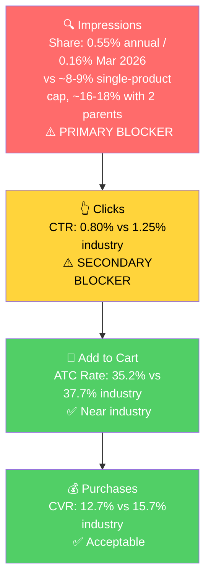

# Seller Central Audit: Ecodrop (UK)

**Marketplace:** Amazon UK | **Business report coverage:** Jul 2024 - Apr 2026 | **Ad data coverage:** Jan 24 - Apr 23 2026 (90 days)

**Current state:** £28-30k/month (last 3 months) | FY2025 avg ~£33-36k/month | **Goal:** £60k/month | **Margin:** 12% net | **Landed COGS:** £2.25 | **Ad spend target:** 10% of revenue (£4-5k/month)

## Section 1: Catalog Assessment

Catalog is 94 parents / 143 children. The top 3 parents drive 40% of FY2025 sales. Top 10 drive 59%.

Figures are from the last two complete months reported by Amazon in the seller analytics system (Jan 2026 + Mar 2026 = 2 months, Feb is incomplete in the monthly rollup). Ad metrics are 90 days (Jan 24 - Apr 23).

| Priority | Product | 3-Mo Sales | 3-Mo Ad Spend | ROAS | TACoS | Organic % | Buy Box % | CVR | Trend |
|---|---|---:|---:|---:|---:|---:|---:|---:|---|
| P0 | Reed Diffuser 100ml (B0CNSC2D85) | £7,231 | £1,370 | 2.30 | 19% | 60% | 80-99% | 21-25% | **Declining 56% Q4→Q1** |
| P1 | Lions Mane / Organic Mushroom Extract (B08GV9ZVVZ) | £9,152 | £456 | 3.63 | 5% | 82% | 90-94% | 19-25% | Stable |
| P2 | Essential Oils (category: 20+ SKUs combined, incl. B09GNS958T, B077WJ243V Rose, B01NCVIC53 Sandalwood, B08GHCJFYH Frankincense, etc.) | ~£16,000 | ~£2,800 | ~2.3 | ~18% | ~65% | 90-99% | 20-30% | Declining |
| P3 | Reed Diffuser 250ml (B0GTWLTMFH, new Nov 2025) | £1,808 | £146 | 2.99 | 8% | 67% | 22% → 82% | 26% | Ramping |

**Not prioritized:**
- Candle and diffuser launches (B0FQV6C7DK, B0G1SGS826) are too new and too small to audit meaningfully; revisit in Month 3 if they gain traction.
- Long tail of 80+ parents each doing under £500/month — no near-term growth lever.

## Section 2: Qualitative Product Understanding (P0 - Reed Diffuser 100ml)

**Product:**
- Ecodrop Reed Diffuser set, 100ml bottle + 6 wooden reed sticks, available in 8 scents (Coconut & Sandalwood, Coffee Vanilla, Lavender, Orange Bergamot, Rose Absolute, Spicy Frankincense, Vanilla Violet, Wood Sage & Sea Salt) with matching 100ml refills
- Natural essential oil blend, glass bottle, UK-made fragrance
- Value prop: sustained passive home fragrance without electricity or flame; refillable to reduce waste
- Purchase motivation: home spa gifting, entry-level aromatherapy, bedroom/bathroom/living-room scent

**Customer:**
- UK home-fragrance buyer, mid-market price point (£7-15), often gifting or self-treat purchase
- Purchase driver: specific scent (Rose, Frankincense) or functional want (relaxation, freshen a room)

**Brand:**
- Ecodrop, UK seller, listed since 2022 for this parent
- Established brand with years of reviews on core scents (all children rated 3.7-4.8, most in the 3.9-4.3 range)
- UK-focused, agency: Eventuring
- Positioning: home-spa / natural / sustainable reed diffuser

**Competitive Landscape:**
- Crowded category. Direct UK rivals include Wax Lyrical, Jo Malone, Neom, Rituals, Molton Brown, St Eval, White Company
- Price positioning: Ecodrop sits mid-market (~£7-15) well below premium brands (Jo Malone, Neom £30-60) and slightly above mass market (wax lyrical supermarket lines)
- Key differentiator: refillable format + natural essential oil blend, at a gift-appropriate price

**Listing Quality (P0):**

Strengths:
- A+ content is built on all 16 scent children
- Broad scent range covers the most-searched scents (Lavender, Rose, Frankincense, Vanilla, Bergamot)
- Refill + Set format doubled up per scent (customer retention lever built-in)

Opportunities:
- No video on any child ASIN — gap for a gifting/home-fragrance category where visual ambiance matters
- Main image may be losing the click battle at Rest of Search (CTR 0.51% vs Top of Search 5.08%, see Section 5) — lifestyle/scent cues could be stronger
- Category tree is split: some children live in Home & Kitchen > Home Fragrance, others in Health & Personal Care > Aromatherapy. This fragments BSR and search discovery
- The 100ml parent is categorised in "Drugstore" product group on at least one child (B0DQQD4JN2) — likely a tagging error

## Section 3: Quantitative Product Understanding (P0)

**Annual Trend - Reed Diffuser 100ml (B0CNSC2D85):**

| Metric | Oct 2025 | Dec 2025 | Jan 2026 | Mar 2026 |
|---|---:|---:|---:|---:|
| Total Sales | £6,378 | £7,095 | £3,777 | £3,454 |
| Sessions | est. 1,800 | est. 2,000 | 1,344 | 1,201 |
| CVR | ~22% | ~22% | 21% | 25% |
| Buy Box % | ~95% | ~96% | 80% | 99% |

- The Reed Diffuser 100ml peaked Nov 2025 at £9,386 (holiday) and Dec 2025 at £7,095
- Q1 2026 (Jan-Mar combined) came in at £10,098 vs Q4 2025 £22,858 — a 56% drop quarter-on-quarter
- CVR and buy box are intact or improving, so the issue is not conversion — it's visibility (see Section 4)

**Rating Trajectory:** Stable. Ratings across the 16 children range 3.7-4.8 with median around 4.0. No child has dropped sharply in recent months. Reviews are an asset, not a drag.

**Sales Rank Trajectory:** **Declining.** Sales rank in the Home Fragrance Accessories sub-category roughly doubled (worsened) across every child between Q3 2025 and Q1 2026:

| Child | Variant | Q3 2025 avg BSR | Q1 2026 avg BSR |
|---|---|---:|---:|
| B0BP3L6782 | Lavender Set | 63 | 130 |
| B0BPRB8G4K | Bergamot Set | 64 | 130 |
| B0BQGJBMQL | Rose Set | 106 | 270 |
| B0BQGK9N9H | Wood Sage Set | 88 | 251 |
| B0CR7W9QRH | Vanilla Violet Set | 61 | 128 |

The sub-category BSR collapse is the direct mechanism: lower rank → fewer organic impressions → fewer clicks → lower velocity → lower rank. A classic rank spiral that started in early December 2025.

## Section 4: Market Opportunity (SQP)

**Tier Breakdown:**

- **Tier 1 (Hero - Reed Diffuser core intent):**
  - **Keywords:** reed diffuser, reed diffuser refill, diffuser refills, reed diffusers for home, reed diffusers, diffuser refill, diffuser oil refill, reed diffuser oil, diffuser reed, christmas reed diffuser, reed diffuser bottles
  - **Rationale:** Direct reed-diffuser intent. The buyer wants this exact product format.

- **Tier 2 (Core market - broad diffuser intent):**
  - **Keywords:** diffuser, oil diffusers, diffuser oil, essential oils for diffusers for home, diffusers for home, essential oil diffuser, diffusers, oil diffuser, diffuser sticks, room diffuser, aromatherapy diffuser, oil for diffuser, aroma diffuser, diffuser oils, scent diffuser, bathroom diffuser, diffuser set, fragrance diffuser, essential oil diffusers for home, oil diffuser essential oils, christmas essential oils for diffusers for home, christmas oils for diffusers
  - **Rationale:** Relevant but broader — buyer may equally want electric/USB/aromatherapy diffusers. Reed diffuser is one of several answers.

- **Tier 3 (Scent-led niche):**
  - **Keywords:** lavender diffuser, vanilla diffuser, vanilla reed diffuser
  - **Rationale:** Scent-specific buyers. Small volume, but brand already out-converts industry (CVR 22.7% vs 17.4%).

Branded queries ("ecodrop", "ecodrop reed diffuser" etc.) are treated as a defense line, not a growth tier.

**Market Sizing:**

| Tier | Monthly Search Volume | Monthly Purchases (Market) | Est. Market Size (£/mo) |
|---|---:|---:|---:|
| Tier 1 | ~141,700 | ~6,950 | ~£97k |
| Tier 2 | ~332,500 | ~11,000 | ~£154k |
| Tier 3 | ~3,170 | ~206 | ~£2.9k |
| **Total P0-relevant** | **~477,400** | **~18,200** | **~£254k** |

*Estimated using £14 AOV from competitive landscape analysis.*

Ecodrop's Reed Diffuser does ~£6k/month today against a £97k/month Tier 1 market. Under 3% capture rate on the hero tier.

**Blockers & Growth Path:**

| Tier | Impression Share | CTR (Brand vs Industry) | CVR (Brand vs Industry) | Primary Blocker | Growth Path |
|---|---:|---:|---:|---|---|
| Tier 1 | 0.55% annual / **0.16% Mar 2026** | 0.80% vs 1.25% | 12.7% vs 15.7% | **Impression Share** | Scale PPC + recover BSR |
| Tier 2 | 0.11% | 0.60% vs 1.40% | 12.8% vs 9.7% | Fit (reed not wanted) | Deprioritize |
| Tier 3 | 1.67% | 0.76% vs 1.37% | 22.7% vs 17.4% | CTR | Small scale-up |

**Impression share collapsed in Q1 2026.** From 1.10% in Oct 2025 to 0.16% in Mar 2026 — an 85% drop. This directly caused the Reed Diffuser revenue drop the client is worried about.

**ICAP Funnel Visual (Tier 1):**

**Notable context:**
- The listing structure "split" the client is concerned about applies to essential oils, not to Reed Diffuser. The 100ml parent has been stable since 2022 and did not go through a merge/split transition. What we're seeing on Reed Diffuser is a BSR collapse of its own, not a split-artifact.
- With a second parent (250ml B0GTWLTMFH) now ranking for some reed-diffuser queries, the theoretical impression share ceiling could rise toward 16-18% once both parents are competitive. Today only the 100ml ranks meaningfully.
- Branded search volume dropped 33% for "ecodrop essential oils" and 74% for "ecodrop reed diffuser" between Q4 2025 and Q1 2026 — a lagging indicator consistent with fewer people seeing the brand overall.

## Section 5: Ad Analysis

**Account overview (90d, ENABLED):** £5,742 spend | £17,707 sales | ROAS 3.08 | TACoS ~6% (well below 10% target — budget headroom available)

### Account Level

**Campaign Structure**

Not a headline issue. 426 ENABLED campaigns, 312 with spend. Top campaigns are not egregiously overstuffed. Move on.

**Auto vs Manual Split**

| Targeting Type | Clicks | Spend | Sales | ROAS | AOV | CPC | CVR |
|----------------|-------:|-------:|-------:|-----:|------:|------:|------:|
| Automatic | 1,044 | £349 (6%) | £1,752 | 5.02 | £13.27 | £0.33 | 12.6% |
| Manual | 6,999 | £5,393 (94%) | £15,955 | 2.96 | £10.80 | £0.77 | 21.1% |

Auto ROAS (5.02) is well above Manual (2.96), suggesting some converting search terms in auto haven't been harvested into dedicated manual campaigns. Worth mining, but auto is only £349 of spend — small absolute impact (~£200-300/month lift from harvesting).

**Campaign Profitability**

16 campaigns with ≥10 clicks are running below 1.5x ROAS, consuming £458 of spend over 90 days. Top wasters:

| Campaign | Spend | Sales | ROAS |
|---|---:|---:|---:|
| EV - SP - Ylang Ylang - Broad | £163 | £243 | 1.49 |
| S. - Essential Oil - Gift Set - Broad | £73 | £77 | 1.04 |
| S. - Essential Oil - Gift Set - Exact | £37 | £38 | 1.04 |
| S. - Essential Oil - Vanilla - Broad | £26 | £21 | 0.80 |

> **Problem:** £458 of wasted spend (~£150/month).
>
> **Solution:** Pause these. Reallocate to the Tier 1 Reed Diffuser campaigns (see product-level).
>
> **Impact:** ~£150/month reallocated at 3.10 ROAS (account profitable avg) = ~£470/month in additional sales.

**Targeting Strategy**

**Keyword vs Product Targeting:**

| Targeting Strategy | Clicks | Spend | Sales | ROAS | AOV | CPC | CVR |
|-------------------|-------:|-------:|-------:|-----:|------:|------:|------:|
| Keyword Targeting | 7,432 | £6,890 (78%) | £16,186 | 2.35 | £10.97 | £0.93 | 19.85% |
| Product Targeting | 2,805 | £1,986 (22%) | £5,443 | 2.74 | £10.93 | £0.71 | 17.75% |

Product targeting slightly outperforms keyword on ROAS at lower CPC. Mild reallocation opportunity, not a major finding.

**Match Type Breakdown:**

| Match Type | Clicks | Spend | Sales | ROAS | AOV | CPC | CVR |
|------------|-------:|-------:|-------:|-----:|------:|------:|------:|
| EXACT | 1,647 | £1,964 (29%) | £3,911 | 1.99 | £10.71 | £1.19 | 22.16% |
| PHRASE | 1,048 | £1,119 (17%) | £2,820 | 2.52 | £11.56 | £1.07 | 23.28% |
| BROAD | 4,184 | £3,624 (54%) | £8,314 | 2.29 | £10.59 | £0.87 | 18.76% |

EXACT has the highest CVR but the lowest ROAS because CPC is 36% higher than BROAD and 11% higher than PHRASE. The exact-keyword bids are overpriced. PHRASE has the best all-around metrics but gets only 17% of spend.

**Placement Performance**

| Placement | Impressions | CTR | CVR | Spend | Sales | ROAS | ACoS |
|---|---:|---:|---:|---:|---:|---:|---:|
| Top of Search | 83,815 | **5.08%** | **26.81%** | £3,876 (44%) | £12,221 | **3.15** | 31.72% |
| Rest of Search | 818,710 | 0.51% | 15.99% | £3,544 (40%) | £7,624 | 2.15 | 46.49% |
| Product Pages | 1,063,976 | 0.17% | 9.01% | £1,453 (16%) | £1,804 | **1.24** | **80.54%** |

> **Finding: Product Pages placement is unprofitable and wastes 16% of ad spend.**
>
> **Problem:** Product Pages ROAS is 1.24 (below breakeven). CTR 0.17% vs 5.08% at Top of Search. Ecodrop's ads don't win attention on competitor PDPs.
>
> **Solution:** Reduce Product Pages bid modifier sharply (or to zero). Reallocate to Top of Search via a higher Top-of-Search bid modifier.
>
> **Impact:** £1,453 reallocated to Top of Search at 3.15 ROAS would generate £4,577 in sales (vs current £1,804). Net gain: **~£2,770 over 90 days = ~£920/month** from the same budget.

### Product Level (P0 - Reed Diffuser)

**P0 Campaign Map:**

| Parent | Spend (90d) | Sales | ROAS | Clicks | Orders | Share of account spend |
|---|---:|---:|---:|---:|---:|---:|
| Reed Diffuser 100ml (B0CNSC2D85) | £1,370 | £3,148 | 2.30 | 1,404 | 242 | 15.4% |
| Reed Diffuser 250ml (B0GTWLTMFH) | £146 | £437 | 2.99 | 205 | 35 | 1.6% |
| **Combined P0** | **£1,516** | **£3,585** | **2.36** | 1,609 | 277 | **17.0%** |

P0 gets 17% of account ad spend, roughly proportional to its 17% share of revenue. But given it's the #1 product and has the biggest visibility blocker, the allocation is the wrong shape.

**Blocker-Specific Findings**

> **Impression Share Blocker: Tier 1 Keyword Spend vs. SQP Demand**
>
> Section 4 identified impression share as the primary blocker on Tier 1 (0.16% vs ~8-9% single-product cap). The PPC lever is bidding on those Tier 1 keywords. Here's what the ad data shows.

| Search Term | Tier | SQP Monthly Volume | Spend (90d) | Sales | ROAS | Clicks | Orders | CVR |
|---|---|---:|---:|---:|---:|---:|---:|---:|
| reed diffuser | T1 | ~75k | £39 | £167 | **4.26** | 50 | 13 | 26.0% |
| reed diffuser refill | T1 | ~24k | £25 | £154 | **6.14** | 37 | 12 | 32.4% |
| reed diffusers for home | T1 | ~10k | £28 | £52 | 1.83 | 18 | 4 | 22.2% |
| diffuser refill | T1 | ~5k | £10 | £22 | 2.07 | 12 | 2 | 16.7% |
| reed diffuser oil | T1 | ~3k | £7 | £32 | **4.40** | 7 | 3 | 42.9% |
| diffuser refills | T1 | ~13k | £6 | £11 | 1.88 | 7 | 1 | 14.3% |
| (5 more T1 terms) | T1 | - | £14 | £23 | - | 12 | 2 | - |
| **Total Tier 1** | | **~142k** | **£129** | **£461** | **3.58** | 143 | 37 | **25.9%** |

> **Problem:** Ecodrop spent £129 over 90 days (£43/month) on the Tier 1 reed-diffuser search terms that are the account's primary visibility blocker. ROAS on "reed diffuser" is 4.26 and "reed diffuser refill" is 6.14 — among the strongest terms in the account. Meanwhile £162 went to "frankincense oil" alone (ROAS 2.11) and £96 to "frankincense essential oil" (ROAS 1.61). The budget allocation fights against the P0 growth goal.
>
> **Solution:**
> 1. Build dedicated manual PHRASE and EXACT campaigns for each Tier 1 keyword. One keyword per campaign for independent bid and budget control.
> 2. Scale combined Tier 1 spend from £43/month to ~£500/month. Budget comes from: (a) killing Product Pages placement (~£480/month freed), (b) pausing 16 unprofitable campaigns (~£150/month), (c) pausing 4 sub-1.5x Reed Diffuser campaigns (~£90/month), (d) TACoS headroom to 10% target (~£1,200-1,500/month available if more is needed).
> 3. Set Top of Search bid modifiers high on these campaigns. The 5.08% CTR at Top of Search vs 0.17% at Product Pages proves this is where impressions convert.
> 4. Add small PHRASE campaigns for Tier 3 (lavender diffuser, vanilla reed diffuser, vanilla diffuser) — Ecodrop already out-converts industry here, just needs to show up.
>
> **Impact:** £500/month at 3.58 ROAS = **£1,790/month in incremental sales (~£21.5k/year).** Plus the organic halo as velocity rebuilds BSR over 2-3 months. This is the single biggest ad-side growth lever.

> **CTR Blocker: Placement Distribution**
>
> Section 4 showed brand CTR on Tier 1 is 0.80% vs industry 1.25%. The placement data (see Account Level above) explains the gap: Ecodrop is getting only 44% of ad spend to Top of Search, where CTR is 5.08%. The rest is diluted in Rest of Search (0.51%) and Product Pages (0.17%).
>
> **Already covered by the Product Pages reallocation in the account-level section.** Pushing Top of Search bid modifiers higher on Tier 1 campaigns addresses this as a secondary benefit.
>
> The listing-side CTR levers (main image refresh, ratings visibility on SERP thumbnail, consider a video) are covered in Section 2 Listing Opportunities.

### Summary of Ad Actions, Ranked by Impact

| # | Action | Monthly Sales Impact |
|---|---|---:|
| 1 | Scale Tier 1 reed diffuser spend £43 → £500/month | **+£1,790** |
| 2 | Kill Product Pages placement, reallocate to Top of Search | **+£920** |
| 3 | Pause 16 unprofitable campaigns, reallocate | +£470 |
| 4 | Scale 250ml Competitor PAT campaigns (Orange Blossom, White Jasmine — both ROAS >4.5) | +£200 |
| 5 | Shift EXACT → PHRASE match type | +£160 |
| 6 | Harvest auto campaign winners into manual | +£200 |
| **Combined ad-side incremental** | | **~£3,740/month** |

All of this is reachable with existing budget plus the headroom to 10% TACoS. No new budget request required.

## Section 6: Action Plan

The primary blocker on the P0 is impression share, caused by a BSR collapse that started Dec 2025. PPC can recover impressions fast; listing fixes compound over weeks. PPC actions front-loaded, listing actions mid-plan, scaling and evaluation back-half.

### Weeks 1-2: Immediate Actions (PPC quick wins)

1. **Kill Product Pages placement** across all P0 Reed Diffuser campaigns. Set bid modifier to -100% (or as close as Amazon allows). Addresses the CTR blocker and frees ~£480/month. [Section 5, account level]
2. **Pause 16 unprofitable campaigns** (ROAS <1.5 with ≥10 clicks). Top offenders: EV - SP - Ylang Ylang - Broad, S. - Essential Oil - Gift Set - Broad/Exact, Vanilla Broad. Frees ~£150/month. [Section 5]
3. **Pause sub-1.5x Reed Diffuser campaigns:** EV - SP Reed Diffuser Refills Broad (ROAS 0.89), SP - B0BPRCHJGZ Gold Panning (0.84), SP - Reed Diffusers Broad Multi Kw (0.80), Reed Diffuser Oil Set Rose Exact (0.80). Frees ~£90/month. [Section 5]
4. **Build Tier 1 manual campaigns** for P0 Reed Diffuser. One campaign per keyword (reed diffuser, reed diffuser refill, diffuser refills, reed diffuser oil, diffuser refill) in PHRASE and EXACT match. Start with £2-3/day per campaign. High Top-of-Search bid modifiers. [Section 4, Section 5]
5. **Audit B0G362BD89** (250ml Orange Blossom Set, 2.6-star rating). Fix or exclude from any promotions. Blocks the merge discussion and drags 250ml's average. [Section 2]

### Weeks 2-4: Short-Term Optimizations

6. **Scale Tier 1 spend** on the new campaigns toward £500/month combined as performance holds. Goal: get impression share from 0.16% to 2-3% within 4-6 weeks. [Section 4, Section 5]
7. **Build 250ml A+ content** (the client asked for this). Use the 100ml A+ as the template for information architecture; elevate visuals for the "luxury" positioning implied by the 250ml scent range (Amber Allure, White Jasmine, English Pear & Freesia). [Section 2]
8. **Write P0 listing refresh:** new main image (scent + size callout, lifestyle context), tightened title leading with "Reed Diffuser", refreshed bullet points. Prepare assets now, publish in Week 4-5. [Section 2, Section 4]
9. **Normalize P0 category placement.** All 17 children should live in Home & Kitchen > Home Fragrance > Home Fragrance Accessories (or both, consistently). Resolve the Drugstore/Home split flagged in Section 2.
10. **Scale 250ml Competitor PAT campaigns** (Orange Blossom at ROAS 6.08, White Jasmine at ROAS 4.65). Small budget increase (£2-3/day each) while the 100ml changes bed in.

### Weeks 4-6: Medium-Term Growth

11. **Publish 100ml listing refresh** (images, title, bullets). Monitor CVR for impact. [Section 2]
12. **Publish 250ml A+ content.** Launch 250ml standalone. Monitor impression share on the 250ml-specific scent queries. [Section 2]
13. **Harvest auto campaign winners** into dedicated manual campaigns, negate them out of auto. Lift ~£200/month. [Section 5]
14. **Build P1 Lions Mane campaign.** Currently gets £456 over 90d (5% of account spend) despite being the #2 parent at £68k/year. Create dedicated Tier 1 campaigns on "lions mane", "lion's mane mushroom", "organic mushroom extract", "mushroom tincture" with £3-5/day. This is a parallel growth lever outside P0 but critical to the £60k goal.
15. **Start mining Tier 3 scent queries.** Dedicated campaigns for "lavender diffuser", "vanilla reed diffuser", "vanilla diffuser". [Section 4]

### Weeks 6-8: Scaling and Evaluation

16. **Evaluate P0 recovery.** If Reed Diffuser 100ml is back to £6-8k/month and impression share >1%, hold pattern and scale further. If still suppressed, investigate Step 7 questions (did something break that we haven't identified?).
17. **Evaluate P1 Lions Mane.** If it's responded to PPC support, carry the same playbook to Essential Oils category in Month 3.
18. **Essential Oils decision.** If P0 and P1 together aren't on pace for £60k by end of Month 3, open up the Essential Oils category audit (Rose, Sandalwood, Frankincense as the top three individual SKUs by sales).
19. **Diffuser merge decision.** Revisit whether to merge the 250ml parent (B0GTWLTMFH) into the 100ml parent (B0CNSC2D85). Only if 250ml has plateaued and the 2.6-star SKU is resolved. See Section 7 Questions.
20. **Prepare seasonal Q4 plan.** Reed Diffuser sales peaked Oct-Nov 2025 (£6.4k and £9.4k). Budget for H2 ramp should be set in Month 3 so campaigns are seasoned by September.

## Section 7: Insights & Questions for the Seller

### Insights

- **P0 (Reed Diffuser 100ml) revenue drop of 56% Q4→Q1 is caused by an impression share collapse, not by the essential-oils listing split.** Impression share on Tier 1 queries fell from 1.10% in Oct 2025 to 0.16% in Mar 2026. This was driven by a parent-level BSR collapse in Home Fragrance Accessories (all 16 children's rank roughly doubled between Q3 2025 and Q1 2026). The listing converts fine; it just isn't showing up.
- **P0 (Reed Diffuser) is dramatically underfunded on its own hero keywords.** Only £129 of ad spend (£43/month) went to Tier 1 reed-diffuser search terms over 90 days, against ROAS of 3.58-6.14. Meanwhile £258 went to the top two Frankincense-oil search terms. Misallocation, not a budget ceiling — account TACoS is 6% vs 10% target.
- **Product Pages placement is bleeding £480/month.** ROAS 1.24, CTR 0.17%. Ecodrop's ads can't win attention on competitor PDPs. Reallocating to Top of Search (CTR 5.08%, ROAS 3.15) is worth ~£920/month at existing budget.
- **P1 (Lions Mane / Organic Mushroom Extract) is the account's biggest hidden lever.** £68k/year at ROAS 3.63 on only £456 of ad support in 90 days. The client framed essential oils as hero, but the data says Lions Mane is the second pillar and is almost completely unsupported by ads.
- **Essential oils as a category is ~£15-17k/month across 20+ SKUs.** Individually no single oil beats Reed Diffuser or Lions Mane, but collectively they are the biggest category. The client's instinct to treat them as hero is right; the structure is just fragmented across many ASINs after the split. Deferred to Month 3 per the client's framing.
- **The £60k/month goal is reachable without new budget.** Ad-side reallocation unlocks ~£3.7k/month in incremental sales. BSR recovery on the 100ml parent adds more. Lions Mane scaling adds a parallel £2-4k/month. Essential oils + candles/250ml diffuser are not critical-path; they are upside.

### Questions for the Seller

- **What changed for the Reed Diffuser 100ml listing around late November / early December 2025?** Possible causes: stockout, listing edit rejected by Amazon, price change, competitor launch, review event, or an agency-side campaign pause. The BSR collapse across all 16 children suggests a parent-level trigger, but the data alone can't identify which. This is the single most important question for the call.
- **Is Eventuring running a dedicated PPC plan for P0 Reed Diffuser?** £1,370 of spend on the 100ml parent over 90 days against a 56% revenue drop doesn't match a recovery playbook. We want to understand whether the low Tier 1 spend is a deliberate strategic choice or a gap.
- **Do you want us to merge the 250ml parent (B0GTWLTMFH) into the 100ml parent (B0CNSC2D85)?** Our recommendation is not to merge in the current plan: the 250ml has premium positioning and a 2.6-star SKU that would drag the 100ml's review average. The A+ content you wanted to inherit can be built directly on the 250ml. If you still want to merge, we'd do it in Month 3-4 after A+ is built, the 2.6-star SKU is fixed, and with a 2-week rank-dip contingency.
- **Buy box on some Reed Diffuser children sat around 80% in Jan 2026.** For a private-label brand where there are no competing sellers on the listing, this is often caused by recent price changes triggering MAP-related buy box suppression. Were there any pricing moves on the 100ml Reed Diffuser in Dec 2025 or Jan 2026 that could have done this?
- **Lions Mane (Organic Mushroom Extract, B08GV9ZVVZ) is your #2 parent at £68k/year with almost no ad support.** Is there a reason it's not being scaled, or is it simply not on the current agency brief? This is a large growth lever we'd propose adding to the brief.
