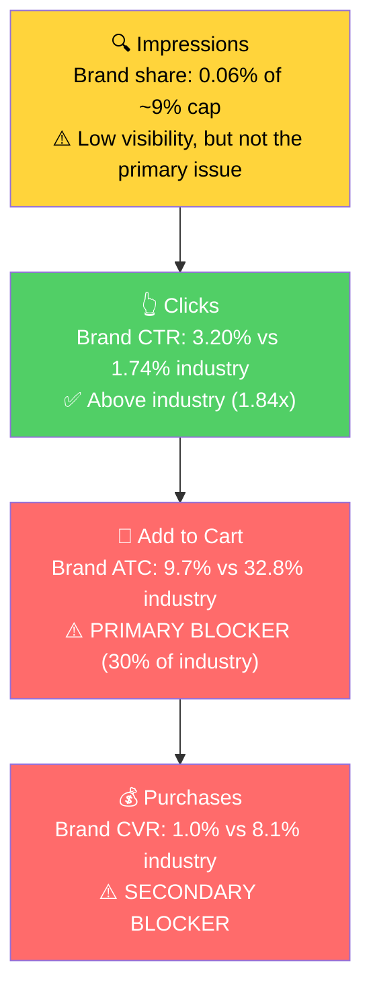

# Seller Central Audit - FMLaGame

**Prepared for:** Sales call with Brian (FMLaGame founder)
**Audit window:** Business data Dec 2024 - Apr 2026; Ads data Jan 26 - Apr 24, 2026
**Date:** April 28, 2026

## Context (from intake call)

- TikTok-driven brand. December is the peak (~$8K MRR target).
- Previously paid Sophie Society ~$1K/month. Goal: recover historical performance.
- Hard constraints: **Sponsored Display not allowed.** PPC (Sponsored Products) allowed. **Profit-first** posture.
- Landed COGS $4-5. At $19.95 retail: contribution margin ~$8.96 (45%). **Break-even ROAS = 2.23.**
- Single-ASIN account: B0CTXKBB6X.

## Important: Data Caveats

- **5 weeks of business-report data are missing** in the source system: Jan 25 - Feb 21, 2026 (4 weeks) and Apr 19-25, 2026 (1 week). For those weeks, sessions and CVR are approximated from the closest weeks with data.
- **Ads data is limited to 89 days** (Jan 26 - Apr 24, 2026). Anything before that period - including Dec 2024 viral peak and Dec 2025 holiday - cannot be reconstructed from ads data. Where the historical strategy is relevant, it shows up as a question for Brian.

---

## Section 1: Catalog Assessment

Single-ASIN account. P0 is automatic.

| Priority | Product | 3-Mo Sales | 3-Mo Ad Spend | ROAS | TACoS | Organic Sales | Ad Sales % | Buy Box % | CVR | Trend |
|----------|---------|-----------|--------------|------|-------|---------------|-----------|-----------|-----|-------|
| P0 | FMLaGame Adult Card Game (B0CTXKBB6X) | $1,284 | $724 | 0.65 | 56.4% | $815 | 36.5% | 99.7% | 1.0% | Declining |

No P1, P2, P3.

---

## Section 2: Qualitative Product Understanding (P0)

**Product:**
- A storytelling adult party card game. 99 problem cards + 69 solution cards. Each round, players draw a problem and pitch the group on how their solution solves it. The funnier the pitch, the better the player does.
- Anti-toxic-positivity framing ("FML"), irreverent voice, competitive party gameplay.
- Differentiates from Cards Against Humanity (meme-match) and What Do You Meme by having a creative storytelling mechanic instead of caption-matching.
- Comes with cards and a storage box.

**Customer:**
- Adults 18+, Gen Z and millennials. Buys for adult game nights, family gatherings, holiday parties.
- Two purchase modes: gifting (especially Q4) and self-purchase after seeing TikTok content.

**Brand:**
- Indie single-product brand. DTC site at fmlagame.com. Distinct mascot (humanoid figure in ski goggles), bold black-and-white "FML" packaging.
- TikTok-native content style. Has invested in 6 listing videos including a 30+ second creative.
- Brand vibe: punky, anti-corporate, made-on-a-couch energy. Distinctive enough to be memorable. The TikTok audience already knows this brand voice.

**Competitive Landscape:**

Avg market price for adult party card game: $19-25 | P0: $19.95 | competitively priced at the low end of mid-range.

| Competitor | Approx Price | Reviews | Differentiator |
|------------|--------------|---------|----------------|
| Cards Against Humanity | $25 | 140K+ at 4.8 | Category-defining incumbent, massive review moat |
| What Do You Meme | $25 | 80K+ at 4.7 | Meme-match mechanic, internet culture |
| Drunk Stoned or Stupid | $15-20 | 30K+ at 4.7 | "Who's most likely to" mechanic |
| Joking Hazard | $25 | 25K+ at 4.7 | Comic-building, Cyanide & Happiness IP |

P0 cannot win on review count (76 reviews vs CAH's 140K). It has to win on differentiated mechanic, video-first content, and TikTok-led off-Amazon discovery.

**Listing Quality:**

**Strengths:**
- Premium A+ Content (7 modules, image-based with alt text)
- 6 product videos including 30+ second main video (rare for a small brand)
- 12 product images
- Buy box at 99-100% (no MAP / pricing issues)
- Distinctive brand visual identity that earns clicks (1.84x industry CTR per Step 3)

**Opportunities:**
- **No Brand Store** despite a clear brand identity. Significant gap.
- **Title is keyword-stuffed.** "FMLaGame Adult Games for Game Night - Card Games for Adults, Adult Party Games for Adults Card Game Enthusiasts. Viral Funny & Hilarious Card Games, Top Games. Slaps!" repeats "card games" / "adult games" multiple times and never explains the unique 99 problems / 69 solutions storytelling mechanic.
- **Bullets average 254 characters of dense paragraph text.** No ALL-CAPS lead-ins. Not scannable in the 2 seconds shoppers give them.
- **No backend description** (description field is empty).
- **A+ has one text-only "Brief History" module** that violates the image-only A+ best practice and adds no purchase value.
- **Main image** likely doesn't communicate gameplay scale; the AI-suggested fix is a "99 Problems / 69 Solutions" badge with cards fanned out.
- **Rating: 4.3 from 76 reviews** (below 4.7-4.8 competitors). 9.2% one-star rate. Review acquisition needs to run as a parallel workstream.

---

## Section 3: Quantitative Product Understanding (P0)

**Annual Trend:**

The brand launched in Dec 2024 with a clear viral peak that has not been replicated since.

| Metric | Dec 2024 (Launch peak) | Apr 2025 (Secondary peak) | Dec 2025 (Holiday return) | Mar 2026 (Latest, ads on) |
|--------|------------------------|---------------------------|---------------------------|---------------------------|
| Total Sales | $6,587 | $2,169 | $2,890 | $519 |
| Units | 270 | 111 | 146 | 42 |
| Sessions | 11,218 | 3,281 | 6,559 | 2,441 |
| CVR | 2.41% | 3.38% | 2.23% | 1.72% |
| Buy Box % | 99.98% | 99.92% | 99.94% | 99.73% |
| Ad Spend | $0 (no ads) | $0 (no ads) | $0 (no ads) | $394 |

- **Dec 2024 viral peak ($6,587, 270 units, no ads) was a one-time event.** Likely TikTok-creator-driven. Dec 2025 holiday returned to only $2,890 - down 56% YoY despite the same seasonal tailwind.
- **CVR has degraded across the timeline.** Dec 2024: 2.4% on 11K sessions. Dec 2025: 2.2% on 6.6K sessions. Mar 2026: 1.7% on 2.4K sessions. Even pre-ads, CVR was 2-3%; the current 1% range is well below the brand's own historical norm.
- **Buy box is healthy throughout.** Not a constraint anywhere.

**Rating Trajectory:** Stable at 4.2-4.4 since Feb 2025. Started at 5.0 with very few reviews, settled into the current band over a year ago. Not declining, but plateaued well below competitors (4.7-4.8).

**Sales Rank Trajectory:** Declining in April 2026. Best rank during the Mar 2026 price-drop period (~1,088 in Card Games on Mar 8, when price dropped to ~$9). Once price restored to $19.95 in mid-March, rank slid back toward 4,000-4,600. The ad spend is not arresting the slide.

---

## Section 4: Market Opportunity (SQP)

**Tier Breakdown:**

- **Tier 1 (Hero):**
  - **Keywords:** adult party games, adult card games, card games for adults, games for adults, board games for adults, cards against humanity
  - **Rationale:** Direct adult-party-card-game intent. Includes "cards against humanity" because shoppers searching the incumbent are the highest-intent audience for an alternative.

- **Tier 2 (Core market):**
  - **Keywords:** card games, board games
  - **Rationale:** Broader card and board game queries; the customer is shopping for "a game," not specifically an adult-themed party card game.

- **Tier 3 (Adjacent / gift):**
  - **Keywords:** gag gifts, gag gifts funny adult, white elephant gifts for adults, white elephant gifts for adults funny, white elephant christmas gifts, funny gifts, christmas games
  - **Rationale:** Gift-occasion queries where the product surfaces as one option. Highly Q4-seasonal.

**Market Sizing (12-month avg, Apr 2025 - Mar 2026):**

| Tier | Avg Monthly Search Volume | Avg Monthly Add to Carts (Market) | Avg Monthly Purchases (Market) | Est. Avg Market Size ($/mo) |
|------|---------------------------|-----------------------------------|--------------------------------|------------------------------|
| Tier 1 | ~508,000 | ~68,400 | ~16,900 | ~$1.37M |
| Tier 2 | ~960,000 | ~139,400 | ~28,200 | ~$2.78M |
| Tier 3 (Q4-heavy) | ~860,000 (avg, ~9M in Dec) | ~159,000 (avg, ~896K in Dec) | ~44,800 | ~$3.18M |

*Estimated using $20 avg product price (mid-range of competitive landscape).*

**Seasonality is real and confirmed.** Tier 1 search volume runs 340-510K/mo Apr-Oct, jumps to 1.08M (Nov) and 1.37M (Dec), then collapses to 204K in Jan. That 4x peak vs trough matches the brand's own revenue pattern (Dec 2024 viral peak, Dec 2025 holiday, Apr 2025 secondary). Q4 is genuinely the prize.

**Blockers and Growth Path:**

| Tier | Brand vs Industry CTR | Brand vs Industry ATC Rate | Brand vs Industry CVR | Primary Blocker | Growth Path |
|------|-----------------------|----------------------------|----------------------|-----------------|-------------|
| Tier 1 | 3.20% vs 1.74% (1.84x, **strong**) | 9.72% vs 32.82% (30% of industry, **broken**) | 1.01% vs 8.13% (12% of industry, **broken**) | **CVR / ATC Rate** | **Listing fix first, then PPC scaling for Q4 2026** |
| Tier 2 | 3.10% vs 1.20% | 11.29% vs 42.61% | 0.81% vs 8.63% | Impression share + CVR | Skip - dominated by CAH-tier incumbents, can't be won economically |
| Tier 3 | 4.17% (low base) | 5.88% | 0% (3 carts, 0 purchases over 12mo) | Intent mismatch | Skip - gift queries, intent is too broad to convert |

**Tier 1 funnel visual:**

**Reading the funnel:** When the brand shows up on Tier 1 queries, it wins clicks at 1.84x industry CTR. The distinctive FML packaging and TikTok-style branding earn the click. **The funnel breaks AFTER click, on the product detail page.** ATC rate is 30% of industry; CVR is 12%. Pushing more impressions onto a broken PDP just burns ad budget. Listing fixes have to come before PPC scaling.

**Other notes:**
- Tier 1 impression share peaked at 3.6% in Dec 2025 (still less than half of the 9% cap). There IS room to grow visibility, but only after the PDP is converting at industry rates.
- Tier 2 (broader card/board game queries) is dominated by Cards Against Humanity, Exploding Kittens, and similar incumbents. Even at maximum bid spend, the brand cannot break through economically.
- Tier 3 gift queries explode in Q4 (Dec 2025: 9M searches, 896K market cart adds) but the brand had 785 impressions and 0 purchases. Cracking Tier 3 requires brand recognition and off-Amazon demand generation, not Amazon PPC.

---

## Section 5: Ad Analysis

**Window:** Jan 26 - Apr 24, 2026 (89 days, full ads-data availability)
**Total spent:** $855.98 | **Total ad sales:** $568.49 | **Account ROAS:** 0.66 | **Break-even ROAS:** 2.23
**Net ad cash burn over 89 days:** -$601 (annualized: -$2,463/year)

### Account Level

#### Campaign Structure

5 active campaigns, all targeting the single ASIN. Sophie Society set up the manual campaigns ("SO | FML | B0CTXKBB6X | SPM | ..." naming); Sellozo runs the auto. Structure is clean (3-5 keywords per campaign, no overstuffing). The problem isn't structure - it's bid placement modifiers and the unit economics underneath.

#### Auto vs Manual Split

| Targeting Type | Clicks | Spend | Sales | ROAS | AOV | CPC | CVR |
|----------------|--------|-------|-------|------|-----|-----|-----|
| Automatic | 1,762 | $267.26 | $209.44 | 0.78 | $14.96 | $0.15 | 0.79% |
| Manual | 1,946 | $588.72 | $359.05 | 0.61 | $15.61 | $0.30 | 1.18% |

> **Finding: Auto outperforms Manual on ROAS despite Manual being supposed to do the heavy lifting.**
>
> **Problem:**
> - Auto ROAS 0.78 vs Manual ROAS 0.61 (auto is 27% more efficient).
> - Manual CPC is 2x auto CPC ($0.30 vs $0.15).
>
> **Solution:** Reduce manual exact bids to bring CPC closer to $0.20 (auto sits at $0.15). This is Sophie Society's TOS 60% / PP 80% modifier set on "Adult Card Games SKW" - the modifiers are over-bidding.
>
> **Impact:** Bringing manual CPC from $0.30 to $0.20 on the same click volume saves ~$195/quarter at unchanged sales. Lifts blended ROAS from 0.66 to ~0.86. Still below break-even, but stops a chunk of the bleed.

#### Targeting Strategy

**Keyword vs Product Targeting:**

| Targeting Strategy | Clicks | Spend | Sales | ROAS | AOV | CPC | CVR |
|-------------------|--------|-------|-------|------|-----|-----|-----|
| Keyword Targeting | 3,552 | $839.63 | $558.52 | 0.67 | $15.51 | $0.24 | 1.01% |
| Product Targeting | 156 | $16.35 | $9.97 | 0.61 | $9.97 | $0.10 | 0.64% |

98% of spend is keyword targeting. Product targeting is essentially inactive.

**Match Type Breakdown (Manual only - Auto excluded):**

| Match Type | Clicks | Spend | Sales | ROAS | CVR |
|------------|--------|-------|-------|------|-----|
| EXACT | 1,927 | $583.55 | $359.05 | 0.62 | 1.19% |

100% exact match. No broad or phrase. This is intentional but means there's no harvest pipeline outside the auto campaign.

#### Campaign Profitability

Every active campaign is below break-even (2.23 ROAS). Two campaigns are pure waste:

| Campaign | Spend | Sales | ROAS | Clicks | Orders |
|----------|-------|-------|------|--------|--------|
| Funny Card Games SKW (Exact, ROS 400%) | $37.13 | $0.00 | 0.00 | 55 | 0 |
| PT Would you rather (Product Targeting) | $5.17 | $0.00 | 0.00 | 19 | 0 |
| **Total wasted** | **$42.30** | **$0** | | **74** | **0** |

> **Finding: Two campaigns with statistically meaningful click volume and zero conversions.**
>
> **Solution:** Pause both immediately. Annualized savings ~$170. Same-day fix.

### Product Level (P0)

Single ASIN account: 100% of ad spend goes to P0. Total P0 spend $856 / sales $568.

#### CVR Blocker: Placement Distribution

> Step 3 identified CVR (post-click) as the primary blocker. The PPC lever for CVR is biasing spend toward Top of Search, which converts best. (Sponsored Display defensive - the textbook CVR fix - is blocked by seller constraint.)

| Placement | Spend | Sales | ROAS | CTR | CVR | Spend Share |
|-----------|-------|-------|------|-----|-----|-------------|
| **Top of Search** | $20.08 | $9.97 | 0.50 | **12.59%** | **1.89%** | 2.3% |
| Rest of Search | $225.73 | $69.82 | 0.31 | 2.11% | 0.36% | 26.4% |
| Product Pages | $608.03 | $249.35 | 0.41 | 0.86% | 0.59% | 71.0% |

> **Finding: The placement with the best CTR and CVR is getting 2.3% of spend.**
>
> **Problem:** Top of Search delivers 12.6% CTR (15x Product Pages) and 1.89% CVR (3x Product Pages), but Sophie Society's bid modifiers (TOS 60%, PP 80%, ROS 400% on one campaign) push spend AWAY from TOS.
>
> **Solution:** Increase TOS bid modifier on "Adult Card Games SKW" from 60% to 150-200%. Reduce PP modifier on "All Suggested Low Bid" from 80% to ~30-40%. Cap aggressive ROS modifiers (the 400% ROS on Funny Card Games is gone with the campaign pause).
>
> **Impact:** This is a hygiene fix. Won't flip the campaign profitable on its own (the listing CVR is the real blocker), but it stops the Product Pages bleed and improves blended placement quality. Quantified impact only meaningful after listing fixes land.

#### CVR Blocker: Wasted Targeting + Irrelevant Search Terms

Targets with meaningful spend (>$3) and zero conversions in 89 days:

| Campaign | Targeting | Spend | Clicks | Orders |
|----------|-----------|-------|--------|--------|
| Funny Card Games SKW | funny card games | $37.13 | 55 | 0 |
| Auto - Sellozo | substitutes | $11.18 | 137 | 1 |
| All Suggested Low Bid | party card game | $10.16 | 23 | 0 |
| All Suggested Low Bid | go fucl yourself card game | $7.70 | 29 | 0 |
| PT Would you rather | asin "B0BRT58L5W" | $5.15 | 18 | 0 |
| All Suggested Low Bid | adult games dirty | $4.93 | 20 | 0 |
| All Suggested Low Bid | drinking card games | $4.67 | 21 | 0 |
| All Suggested Low Bid | bachelorette party games | $3.90 | 21 | 0 |
| Auto - Sellozo | close-match | $3.53 | 33 | 0 |
| **Total wasted** | | **$88.35** | **357** | **1** |

Plus auto-driven irrelevant search terms (top examples): "sex games", "family games", "jenga game for adults", "truth or dare card game for adults", "do or drink", "freaky couple games", "adult monopoly game naughty". Combined: ~$57 over 89 days.

> **Solution:** Pause the two zero-conversion campaigns; negate the wasted manual targets; add the 15 irrelevant search terms as exact-match negatives in auto.
>
> **Impact:** ~$760/year in eliminated waste. Blended ROAS lifts from 0.66 to ~0.78. Still below break-even, but a real 12% of current spend reclaimed.

#### Hidden Win: One Profitable Target

| Target | Spend | Sales | ROAS | Clicks | Orders | CVR |
|--------|-------|-------|------|--------|--------|-----|
| adult games for game night (Exact) | $6.69 | $19.95 | **2.98** | 49 | 1 | 2.04% |

> **Finding: The only profitable target in the account ($6.69 lifetime spend, ROAS 2.98 - above the 2.23 break-even).**
>
> **Solution:** Carve "adult games for game night" out of the "All Suggested Low Bid" campaign and into its own dedicated SP exact campaign with TOS-biased bidding. Test scaling to ~$60-80/quarter.
>
> **Impact:** If ROAS holds at 2.5+ as spend scales, $300/quarter on this term could generate $750/quarter in sales at break-even or better. This is the single most actionable PPC opportunity in the account.

---

## Section 6: Action Plan

The primary blocker is CVR (post-click conversion). The PDP is breaking the funnel between click and add-to-cart. Per CLAUDE.md domain knowledge ("Low impression share + poor CVR" pattern with strong CTR caveat): **listing fix first, then PPC scaling for Q4 2026.** The plan reflects that sequence.

The secondary motion is review acquisition - 76 reviews vs 140K for Cards Against Humanity is too wide a trust gap to leave untouched while we work on the listing.

### Weeks 1-2: Stop the Bleeding (PPC Hygiene)

The primary blocker is CVR, but PPC waste is bleeding cash daily. These actions are reversible same-day fixes.

- **Pause "Funny Card Games SKW" and "PT Would you rather" campaigns** ($42 over 89 days, 0 orders).
- **Negate 9 wasted manual targets** (party card game, go fucl yourself card game, adult games dirty, drinking card games, bachelorette party games, etc.) - $88 of waste.
- **Negate 15 irrelevant auto search terms** (sex games, family games, jenga, truth or dare, freaky couple games, do or drink, etc.) - $57 of waste.
- **Reduce manual exact bids** on "Adult Card Games SKW" to bring CPC from $0.30 to ~$0.20 (closer to auto's $0.15). Saves ~$195/quarter at same click volume.
- **Carve out "adult games for game night"** into its own SP exact campaign with $5-10/day budget and TOS-biased bidding. Only profitable target in the account.

Quantified impact: ~$760/year in eliminated waste + $195/quarter from bid right-sizing. Blended ROAS lifts from 0.66 to ~0.86.

### Weeks 2-4: Listing Foundation Fix

The CVR gap (1% brand vs 8% industry) is the actual problem. These are content fixes; not all are visible to shoppers immediately, but they're the load-bearing changes.

- **Rewrite the title** to lead with the differentiator (99 problems / 69 solutions storytelling) instead of keyword-stuffed repetition. Suggested: "FMLaGame - Adult Party Card Game with 99 Problems & 69 Solutions - Hilarious Storytelling Game for Game Night, Family Gatherings, and Adults 18+ - Made for People Who Are Over It"
- **Rewrite all 5 bullets** to scannable ALL-CAPS-lead format. Each ~150 chars. Cover: (1) gameplay mechanic, (2) target audience differentiator, (3) practical ease of play, (4) gift use cases, (5) brand voice / vs Cards Against Humanity.
- **Redesign main image** to communicate gameplay scale: cards fanned out, badge "99 Problems / 69 Solutions". CTR is already strong but a CVR-conscious main image sets accurate PDP expectations.
- **Remove or redesign the text-only "Brief History" A+ module.** Replace with an image-led "How It Plays" comparison or competitor comparison module (vs Cards Against Humanity). A+ should be image-only per category best practice.
- **Launch Brand Store.** Brand has clear identity (mascot, FML aesthetic, 6 videos) but no Brand Store. Unlocks Sponsored Brand placements, defensive search-term coverage, and a destination URL for off-Amazon TikTok traffic.
- **Set up review acquisition machinery**: insert card with QR to follow-up review request, Amazon "Request a Review" automation, post-purchase email if accessible. Goal: get from 76 to 200+ reviews before Q4 2026.

### Weeks 4-6: Publish + Test

- **Publish title, bullet, A+ changes.** Monitor weekly: sessions (should hold), CVR (should rise), buy box (should remain stable).
- **Publish Brand Store** and add Sponsored Brand campaign on Tier 1 queries (small budget, $5-10/day).
- **Increase TOS bid modifier** on "Adult Card Games SKW" from 60% to 150%. Reduce PP modifier on "All Suggested Low Bid" from 80% to 30%. With listing fixes live, the placement quality lever has more leverage.
- **Begin testing branded ad spend.** Brand search ("fml") has tiny volume but is unprotected. Start a defensive Sponsored Products campaign on branded terms at <5% of total ad budget. Pure protection, not growth.

### Weeks 6-8: Evaluate and Position for Q4

- **Measure CVR impact from listing changes.** If CVR has moved from 1.0% toward 2-3%, the path is unblocked. If CVR is unchanged, the listing fixes are wrong / insufficient and we re-diagnose.
- **Scale the "adult games for game night" target** if ROAS is holding at 2.5+ at $5-10/day.
- **Q4 2026 prep planning.** Six months from peak season. Decide: run lean off-season (Jul-Sep) at minimum spend while reviews accumulate, then ramp aggressively in Oct-Nov 2026. The window between Weeks 6-8 of this plan and the Q4 ramp is for sustained listing iteration and review-pipeline buildout, not aggressive PPC.

**Honest framing for the call:** With CVR at 1.0% and break-even ROAS at 2.23, no amount of PPC tuning gets the account profitable in the off-season. The goal of Weeks 1-8 is not to flip the account profitable now - it's to stop the bleed, fix the foundation, and have a tested listing + ad engine ready by the time Q4 2026 demand arrives.

---

## Section 7: Insights & Questions for the Seller

### Insights

- **The Dec 2024 viral peak ($6,587 in one month, no ads) hasn't been repeated.** Dec 2025 holiday returned at $2,890 (down 56% YoY). The TikTok-driven moment that powered launch decayed and has not been replaced by paid demand generation. Any plan to "recover" what the brand was doing before has to address how Dec 2024 happened in the first place.
- **P0 (FMLaGame) wins the click but loses the PDP.** Tier 1 brand CTR is 3.20% vs industry 1.74% (1.84x stronger), confirming the listing's branding and main image work on the search results page. ATC rate then drops to 30% of industry and CVR to 12% of industry. The drop happens after click, on the product detail page itself. Listing fixes (title, bullets, A+, Brand Store, reviews) carry the load for fixing this.
- **The PPC architecture is clean; the unit economics are broken.** Sophie Society set up well-named exact campaigns; Sellozo runs a competent auto. But every active campaign is below break-even (ROAS 0.66 vs break-even 2.23). The fix is not better PPC - it's higher PDP CVR so that any bid converts at profitable rates.
- **One target is already profitable** ("adult games for game night" at ROAS 2.98) but is buried in a 14-keyword campaign with a low bid floor. Carving it out is the highest-leverage PPC action in the account.
- **The Mar 2026 price drop to ~$9 produced a sales rank spike but no durable improvement.** Once price restored to $19.95 in mid-March, rank slid faster than before. Discounting is not a sustainable lever for this product; it trains the algorithm and shoppers to expect a lower price.
- **Q4 seasonality is real and confirmed.** Tier 1 search volume is 4x higher in Nov-Dec than the off-season average. The brand's Dec revenue spikes track market demand surges, not brand-specific factors. The audit's planning horizon is Q4 2026; the off-season is the fix-and-test window.
- **Sponsored Display being off-limits removes the textbook CVR lever.** SD defensive (own-listing retargeting, abandoned-cart recovery) is the standard answer for cart-to-purchase-rate problems. With SD ruled out, the listing-side fixes carry more of the load.

### Questions for the Seller

- **What drove the Dec 2024 viral peak?** Was it one TikTok creator, a coordinated influencer push, or organic virality? Knowing the trigger informs whether it's repeatable. (Hypothesis: a single creator video; the Dec 2025 absence of similar peak suggests no organized off-Amazon motion is currently running.)
- **What's the current TikTok / Instagram strategy?** The listing has 6 videos and a clear brand identity, suggesting active content creation. How much external traffic is being driven to the listing today, and which formats convert best?
- **What does the 1-star review content look like?** 9.2% of 76 reviews are 1-star, which is high. Common themes? (Hypothesis: most are "expected Cards Against Humanity, got something different" expectation mismatches that better listing positioning would prevent.)
- **Was Sophie Society running ads during Dec 2024 / Dec 2025?** The 89-day ad window can't see those periods, so we cannot tell whether the historical peaks were organic-only or ad-supported. If ads were running, the strategy then vs now is informative.
- **The Buy Box has been at 99-100% throughout, so MAP isn't the issue. But have there been any review-velocity issues or listing suppression events?** Reviews have plateaued at 76 across 14+ months despite continued sales (the brand has sold 600+ units in that window per business reports). That gap between sales and reviews is unusual. Is anything blocking the review collection pipeline?
- **Are you open to materially reducing ad spend in the off-season (May-Sep 2026)** while listing fixes are implemented, then re-scaling for Q4 2026? Profit-first execution likely requires this.
- **Brand Store is missing despite a clear brand identity.** Was this a deliberate choice or a known gap from Sophie Society's tenure?
