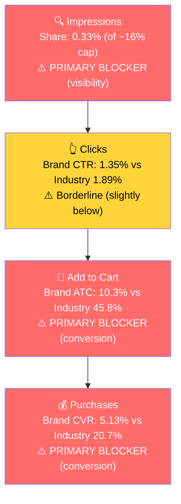

# Seller Central Audit, Food Earth

**Audit window:** Feb 15 - May 14, 2026 (ad data); Jul 2024 - May 3, 2026 (business data)

---

## Section 1: Catalog Assessment

| Priority | Product | 3-Mo Sales | 3-Mo Ad Spend | ROAS | TACoS | Organic Sales | Ad Sales % | Buy Box % | CVR | Trend |
|----------|---------|-----------|--------------|------|-------|---------------|-----------|-----------|-----|-------|
| **P0** | Ready to Eat Indian Cuisine Bundle (B0GX9VV9ST) | $14,455 | $2,399 | 1.22 | 16.6% | $11,521 | 20.3% | 79.3% | 6.0% | Growing |
| **P1** | Indian Simmer Sauce (B0GMP7GG3S) | $7,958 | $819 | 1.84 | 10.3% | $6,449 | 19.0% | 83.0% | 7.1% | Growing |
| **P2** | Hug in a Bowl Soup, Five Lentil Coconut (B0FCBXWGF2) | $2,231 | $850 | 1.19 | 38.1% | $1,220 | 45.3% | 98.7% | 6.3% | Flat |
| **P3** | Hong Kong Noodle (B0GY96D8CX) | $926 | $1,361 | **0.48** | **147%** | $279 | 69.9% | 99.7% | 6.3% | New launch, burning |

**Note:** All other parent ASINs have under $325 in 3-month revenue and are not prioritized. Several (A Perfect Marriage Soup, Lentil Quinoa Soup, multiple dip parents) have ad spend with negligible sales and are addressed at campaign level in Section 3.

**Critical caveat on P0 parent structure:** The Ready-to-Eat Bundle parent (B0GX9VV9ST) groups 9 distinct meal SKUs that are not true variants. The deep-dive focus for this audit is the **Six Flavor Variety Pack child (B0D8Q9MMT9)**, highest revenue child ($5,333 / 3-mo), highest CVR, healthy buy box, and the natural entry product for new customers.

---

## Section 2: P0 Competitive Landscape & Listing Quality (Six Flavor Variety Pack)

### Competitive Landscape

- **Price positioning:** Six Flavor Variety Pack at $35.69 ($5.95/meal). Market range $25-45. Upper-mid tier, ~20% above Tasty Bite, on par with Maya Kaimal, ~10% below Deep Indian Kitchen.

| Brand | Competing Product | Indicative Price | Positioning |
|-------|-------------------|------------------|-------------|
| Tasty Bite (Mars) | Variety Pack of 6 (curry pouches, no rice) | ~$25-30 | Category leader, 25+ yr brand, mass-market |
| Maya Kaimal | Everyday Dal Variety Pack of 6 | ~$30-40 | Premium, vegan-first, founder-led |
| Kitchens of India (ITC) | Dinner Variety Pack of 6 | ~$25-35 | Heritage Indian, ITC-backed |
| Deep Indian Kitchen | Ready meals (organic) | ~$35-45 | Newer premium entrant |

- **Real differentiator (undersold):** Food Earth is the only major variety pack with a **full meal in one tray (curry + rice)**. Tasty Bite and Maya Kaimal variety packs are curry pouches that require rice prep. This is genuinely different and currently only implicitly communicated.
- **Real gap:** Tasty Bite has 10K+ Amazon reviews. Food Earth has under 100. Competitors sit at 4.2-4.5 stars. Food Earth at 3.7 stars. Competing as an undersized challenger in a mature category with a star-rating disadvantage.

### Listing Quality

**Strengths:**
- **Title:** Includes brand, format, key claims (Organic, Microwavable), pack size. Well-structured.
- **Bullets:** 5 bullets, each a distinct angle. Structure is right.
- **A+ Content:** Present, multi-module (hero, brand pillars, How to Prepare infographic, comparison table, flavor showcase). Image-led format.
- **Buy Box (97.6% at the child level):** Healthy on this specific SKU.

**Opportunities:**
- **Rating (3.7 stars, stuck since Jul 2024):** Biggest CVR ceiling. 0.5-0.8 stars below comp. Listing tweaks cannot fully overcome this. Need to investigate review themes (taste, texture, portion size) and fix the underlying product issue.
- **Image slot #2 is a wasted brand-authorization certificate** signed by Iqbal Fazlani attesting Fazlani Exports as the official Amazon seller. Zero purchase-decision value, prime mobile-swipe real estate. **Highest-impact single fix.** Replace with a hero food shot (open tray with steaming curry and rice, fork or naan, lifestyle context).
- **No video.** Ready-to-eat ethnic food is a "does it look appetizing?" purchase. A 30-second peel-microwave-reveal clip addresses the main hesitation.
- **Main image food visibility:** 6 sealed packs dominate; the food itself is barely visible from a mobile thumbnail. Comp variety packs lead with food prominence.
- **Bullets are too short (60-100 chars each).** Miss the "complete meal vs curry pouch" differentiator and do not address spice / portion / texture concerns.
- **A+ "What Sets Us Apart" comparison module is weak.** Compares Food Earth (Yes / Yes / Yes / Yes) vs generic "Other Ready-to-Eat Meals" (No / No / No / No) on attributes that Tasty Bite, Maya Kaimal, etc. actually have. Replace with a real comparison: complete meal vs curry pouch, 6 flavors vs 4, India-origin recipes.
- **No founder / origin story.** Multi-generation Mumbai export family is a sellable narrative absent from the A+.

---

## Section 3: Market Opportunity (SQP)

### Tier Breakdown

- **Tier 1 (Hero):**
  - **Keywords:** indian food, tasty bites indian food, deep indian kitchen
  - **Rationale:** Direct intent for ready-to-eat Indian meals. "indian food" is the largest broad search; the two competitor-brand queries signal shoppers actively hunting for the exact product format P0 sells.

- **Tier 2 (Core market):**
  - **Keywords:** ready to eat meals, meals ready to eat, microwave meals, microwavable food, prepared meals ready to eat
  - **Rationale:** Ready-to-eat / microwave meals broadly. Cuisine-agnostic queries where P0 is one solution alongside frozen meals, MREs, and Kevin's Natural Food. Lower fit.

- **Tier 3 (Adjacent):**
  - **Keywords:** indian, biryani
  - **Rationale:** "indian" is very broad (could be any Indian product). "biryani" is specific to one flavor in the variety pack plus a dedicated child. Small but high-relevance niches.

### Market Sizing (12-month average)

| Tier | Monthly Search Volume | Monthly Add to Carts (Market) | Monthly Purchases (Market) | Est. Market Size ($/mo) |
|------|----------------------|-------------------------------|---------------------------|------------------------|
| Tier 1 | 26,400 | 5,860 | 2,630 | **~$175,800** |
| Tier 2 | 147,200 | 29,750 | 13,990 | ~$892,500 |
| Tier 3 | ~30,000 | ~1,100 | ~500 | ~$33,000 |
| **Total P0** | **~203,600** | **~36,700** | **~17,120** | **~$1.1M** |

*Estimated using $30 avg product price based on competitive landscape analysis.*

**Seasonality:** Tier 1 volume peaks Nov/Dec/Jan (28-35K) and troughs Apr/May (20-21K). Q4 is the next major opportunity window. The brand needs to be ready (listing fixed, ad budget planned) by September to capture it.

### Blockers & Growth Path

| Tier | Impression Share | CTR (Brand vs Industry) | CVR (Brand vs Industry) | Primary Blocker | Growth Path |
|------|-----------------|------------------------|------------------------|-----------------|-------------|
| Tier 1 | 0.33% (cap ~16%), Blocker | 1.35% vs 1.89%, Borderline | 5.13% vs 20.7%, **Blocker** | **CVR + Impression Share (compound)** | Fix CVR first (listing fixes from Section 2), then scale PPC on Indian-specific terms. |
| Tier 2 | 0.05% (cap ~24%), Blocker | 1.29% vs 1.82%, Borderline | 1.45% vs 20.8%, **Blocker** | CVR + product-query fit | **Not capturable.** Variety pack is not what most "ready to eat meals" searchers want. Skip aggressive investment. |
| Tier 3 | ~0.9% on biryani, Healthy | 1.11% vs 0.67%, **Healthy** | 5.3% vs 14.5%, Below | CVR | Small but defensible incremental win. Bid lightly on "biryani" + "vegetable biryani". |

### ICAP Funnel Visual (Tier 1, Primary Growth Opportunity)

The compound blocker is the core challenge. The brand barely shows up AND when it does, conversion craters at the cart-add stage (10.3% vs 45.8% industry). Spending more on PPC before CVR is fixed will burn budget at 4x the cost per conversion. The order is: fix CVR drivers first, then deploy PPC capital.

**Market context:**

- The brand grew Tier 1 impression share 6x over 3 months (0.10% > 0.62% in Apr) as ad spend ramped. Visibility growth is real but conversion isn't absorbing it (purchase share is flat at 0.05%).
- Branded queries don't appear meaningfully, the brand is too small to have its own significant branded volume yet. No defensive ad campaign needed at this scale.

---

## Section 4: Ad Analysis

**Account context:** 8 enabled campaigns, $7,621 / 90-day spend, $7,810 / 90-day ad sales, blended ROAS **1.02**. Only 1 of 8 campaigns is profitable (above 1.5x ROAS). The account is destroying margin on every ad dollar at current performance.

### Account Level

**Campaign Structure**

**Finding: Two manual campaigns are massively overstuffed, starving high-ROAS keywords of budget.**

| Campaign | Targets | Spend | ROAS |
|----------|---------|-------|------|
| EcomC - Ramadan - Manual - Noodles | **30** | $576 | 0.67 |
| EcomC - Manual - Dips, Simmer, Soup | **25** | $1,456 | 0.96 |

**Problem:** Inside the 25-target Dips/Simmer/Soup campaign, "soup" PHRASE alone eats $705 (48% of campaign spend) at ROAS 1.04. Meanwhile, "organic lentil soup" PHRASE has ROAS 4.63 from $15.53 spend, starved. Same pattern in Noodles: "noodle" PHRASE eats $368 (64%) while everything else gets $0-$2.

**Solution:** Extract proven high-ROAS keywords into dedicated 3-5 keyword campaigns with their own budgets. Negate the harvested keywords from the parent campaigns.

**Impact:** "organic lentil soup" alone at $200/mo spend (current ROAS 4.63) = ~$926 in monthly sales vs the $80 it generates today. Applied to 3-4 starved keywords across both campaigns: **$1,500-$2,500/mo incremental sales without new spend.**

**Auto vs Manual Split**

| Targeting Type | Clicks | Spend | Sales | ROAS | AOV | CPC | CVR |
|----------------|--------|-------|-------|------|-----|-----|-----|
| Automatic | 3,423 | $4,390 (58%) | $4,590 | **1.05** | $25.22 | $1.28 | **5.32%** |
| Manual | 2,737 | $3,230 (42%) | $3,218 | 1.00 | $28.99 | $1.18 | 4.06% |

> **Problem: Auto is outperforming Manual on ROAS and CVR.** This pattern is backwards. Auto should be the smaller discovery channel; Manual should be where proven winners are scaled with controlled bids. Auto winning means Amazon's algorithm is finding better matches than the agency's manual keyword selection. The harvest-and-scale loop is broken.
>
> **Solution:** Mine the Auto search terms (the data already surfaces several winners: "indian food", "indian food ready to eat", "coconut curry sauce"), migrate top converters into dedicated Manual EXACT campaigns, negate from Auto.
>
> **Impact:** Lifting Manual ROAS from 1.00 to 1.5 at current spend = **~$1,610/mo incremental sales.** This is a steady, compounding gain.

**Campaign Profitability**

**Problem: 7 of 8 campaigns are below the 1.5x profitability threshold. Noodle campaigns alone burned $913 net over 90 days.**

| Campaign | Spend | Sales | ROAS | Net |
|----------|-------|-------|------|-----|
| EcomC - Ramadan - Auto - Noodles | $1,147 | $423 | **0.37** | -$724 |
| EcomC - Ramadan - Manual - Noodles | $576 | $387 | 0.67 | -$189 |
| SPA - Dip - Hero Desi Fiery | $162 | $138 | 0.85 | -$24 |
| EcomC - Auto - All Top rat Listings | $396 | $317 | 0.80 | -$79 |
| EcomC - Manual - Dips, Simmer, Soup | $1,456 | $1,398 | 0.96 | -$58 |
| SPA - Meals - Hero Master VP (P0) | $1,657 | $1,904 | 1.15 | +$247 |
| SPM - Meals - Hero Master VP (P0) | $1,197 | $1,434 | 1.20 | +$237 |
| **SPA - Simmer - Hero - Coconut VP** | **$1,029** | **$1,809** | **1.76** | **+$780** |

The Noodle category received $1,723 of ad investment to deliver $810 in sales. That is 22.6% of total ad spend producing 10.4% of ad sales. The product has not found product-market fit on Amazon (per Section 1, P3 TACoS was 147%).

**Solution:** Pause both Noodle campaigns immediately. Reallocate the freed $574/mo to the only proven profitable campaign (SPA Simmer Coconut VP at 1.76 ROAS).

**Impact:** $574/mo of reallocated budget at 1.76 ROAS = $1,010 in additional monthly sales. Net swing vs current loss: **$1,584/mo improvement** with no new budget.

**Match Type Breakdown**

| Match Type | Clicks | Spend | Sales | ROAS | AOV | CPC | CVR |
|------------|--------|-------|-------|------|-----|-----|-----|
| PHRASE | 2,444 | $2,873 (93%) | $3,017 | 1.05 | $29.29 | $1.18 | 4.21% |
| EXACT | 174 | $224 (7%) | $171 | 0.76 | $24.42 | $1.29 | 4.02% |
| BROAD | **0** | **$0** | **$0** | - | - | - | - |

> **Problem:** Two structural issues here.
>
> 1. **EXACT match is barely used and underperforms PHRASE.** $224 in EXACT vs $2,873 in PHRASE (only 7% of keyword spend). EXACT should normally outperform PHRASE because it is the most precise targeting. Its underperformance here means the wrong keywords were placed in EXACT, and there is no functioning harvest-and-scale loop from PHRASE/Auto into EXACT.
> 2. **BROAD match is entirely unused.** Zero spend on BROAD match across the account. This is a missed discovery lever. BROAD match is one of the cheapest ways to surface new converting keywords because Amazon shows your ad against semantically related queries you haven't manually selected. The healthy structure is: BROAD for discovery (find new terms) → PHRASE for validation (test bids) → EXACT for scale (lock in winners). Without BROAD, the account has no systematic way to expand its keyword universe beyond what's already been guessed manually.
>
> **Solution:** Launch 1-2 small BROAD-match campaigns (~$10-15/day each) seeded with the highest-intent Tier 1 keywords ("indian food", "ready to eat indian meals"). Mine the resulting search terms weekly and promote winners into PHRASE, then EXACT.

### Placement

| Placement | Spend | Sales | ROAS | CTR | CVR |
|-----------|-------|-------|------|-----|-----|
| Top of Search | $3,893 (51%) | $2,743 | 0.70 | **2.71%** | 4.42% |
| Rest of Search | $1,817 (24%) | $1,383 | 0.76 | 0.74% | 3.85% |
| Product Pages | $1,605 (21%) | $861 | **0.54** | 0.30% | 2.89% |
| Off Amazon | $300 (4%) | $0 | **0.00** | 0.34% | 0.00% |

**Problem: Product Pages and Off Amazon are bleeding.**

- Product Pages ($1,605 spend) converts at 2.89% CVR and ROAS 0.54. This is the worst placement and absorbs 21% of budget. CTR is just 0.30%, meaning the listing doesn't compete well when shown alongside another product on a PDP.
- Off Amazon ($300) has produced zero sales in 90 days. Pure waste.
- Top of Search has the best CTR (2.71%) and tied-best CVR (4.42%), but at a high CPC ($1.58) the ROAS is only 0.70. It is the premium placement but expensive.

**Solution:**

- Disable Off Amazon placement entirely. $300 saved over 90 days, no sales lost.
- Reduce Product Pages bid modifier aggressively. Reallocate to Top of Search where the CTR is 9x better.
- Note: even Top of Search converts at 4.42% CVR, far below SQP industry CVR of ~20%. This confirms the issue is structural to the listing/rating (per Section 2), not the placement. PPC alone cannot fix this. Listing fixes from Section 2 must come first.

**Impact:** Eliminating Off Amazon + reducing Product Pages by 50% saves ~$1,100 / 90 days. Redirected to Top of Search at its current ROAS of 0.70 yields ~$770 sales. Net swing: roughly neutral on sales but eliminates clearly wasted spend, frees ~$370 / 90 days for better placements once listing CVR improves.

---

## Product Level (P0: Six Flavor Variety Pack)

### P0 Campaign Map

The "Ready to Eat Indian Cuisine Bundle (Pack of 6)" parent is advertised by 3 campaigns. **Within this parent, ~96% of ad spend goes to Vegetable Biryani (B086WPJGXQ), not the actual revenue-leader Six Flavor Variety Pack (B0D8Q9MMT9).**

| Campaign | Advertised Child | Spend | Sales | ROAS | Orders |
|----------|------------------|-------|-------|------|--------|
| SPA - Meals - Hero Master VP | Vegetable Biryani (B086WPJGXQ) | $1,657 | $1,904 | 1.15 | 58 |
| SPM - Meals - Hero Master VP | Vegetable Biryani (B086WPJGXQ) | $1,197 | $1,434 | 1.20 | 34 |
| EcomC - Auto - All Top rat Listings | Six Flavor Variety Pack (B0D8Q9MMT9) | $107 | $174 | **1.62** | 5 |
| EcomC - Auto - All Top rat Listings | Vegetable Biryani | ~$30 | small | small | 1 |
| **Total P0** | | **~$2,991** | **~$3,512** | **1.17** | **98** |

Total P0 ad spend is **39% of total account spend ($2,991 of $7,621)**. Within P0, **96% goes to Vegetable Biryani (B086WPJGXQ)** and **4% to the Six Flavor Variety Pack (B0D8Q9MMT9)**, even though the Variety Pack is the higher-revenue child organically ($5,333 vs $4,017 / 3-mo), the higher-ROAS child in the small spend it does receive (1.62 vs 1.15-1.20), and the natural entry SKU for new customers.

### Blocker-Specific Findings

**Impression Share Blocker: Keyword Spend vs Tier 1/2/3 Queries**

Section 3 identified impression share as half of the primary Tier 1 blocker (0.33% vs ~16% cap). The PPC lever is bidding on the keywords where impression share is low.

| Search Term | Tier | Spend | Sales | ROAS | Clicks | Orders | CVR |
|-------------|------|-------|-------|------|--------|--------|-----|
| indian food | Tier 1 | $107 | $134 | **1.25** | 53 | 4 | 7.5% |
| indian food ready to eat | Tier 1 (close) | $62 | $62 | 1.00 | 25 | 2 | 8.0% |
| ready to eat meals | Tier 2 | $162 | $261 | **1.60** | 88 | 6 | 6.8% |
| tasty bites indian food | Tier 1 | not visible | - | - | - | - | - |
| deep indian kitchen | Tier 1 | not visible | - | - | - | - | - |
| Targeting: "indian ready to eat meals" (PHRASE, SPM Meals Hero VP) | | **$11.54** | $168 | **14.55** | 6 | 4 | **67%** |

> **Problem:** "indian food", the highest-volume Tier 1 query, gets $107 over 90 days and converts at the account-best ROAS of 1.25. "tasty bites indian food" and "deep indian kitchen" don't appear, meaning the brand isn't bidding on competitor-brand terms. Inside SPM Meals Hero VP, the target "indian ready to eat meals" PHRASE has **ROAS 14.55 on $11.54 of spend**, starved by the broad "meals" PHRASE in the same campaign that absorbs $1,083 of spend at ROAS 1.14.
>
> **Solution:**
> 1. Extract "indian ready to eat meals" into its own EXACT-match campaign with $30/day budget.
> 2. Launch dedicated campaigns bidding on Tier 1 keywords: "indian food", "tasty bites indian food", "deep indian kitchen", "tasty bites", "indian variety pack", "indian meals".
> 3. Reallocate budget from broad "meals" PHRASE (captures non-Indian intent) toward Indian-specific terms.
>
> **Impact:** Even at a heavily-discounted scaled ROAS of 5 (vs current 14.55) on the extracted "indian ready to eat meals" keyword, $900/mo spend = **$4,500/mo in sales** from just this one keyword. Adding the other Tier 1 terms at conservative ROAS 2.0 with $500/mo spend = additional $1,000/mo. The ceiling lifts further once listing CVR is fixed.

**CVR Blocker: P0 Child Misallocation**

Section 3 also identified CVR as the other half of the Tier 1 blocker (5.13% vs 20.7% industry). The structural fix is on the listing side (rating, image #2, video, A+). The PPC lever is correctly allocating spend to the child that already converts best.

> **Problem:** 96% of P0 ad budget supports Vegetable Biryani (ROAS 1.15-1.20). The Six Flavor Variety Pack, higher organic revenue, higher ROAS in test spend (1.62), near-100% buy box, natural entry product, gets 4%. The allocation appears inherited from how the campaign was originally set up, not from a data-driven decision.
>
> **Solution:**
> 1. Launch a dedicated Sponsored Products campaign for B0D8Q9MMT9 (Variety Pack) with the Tier 1 Indian-themed keywords.
> 2. Reduce existing Biryani-only campaign budgets by 30-50%, redirect to the Variety Pack.
> 3. Add Sponsored Display product targeting on the Variety Pack's own listing (defense) and on top competitor ASINs (Tasty Bite, Maya Kaimal, Kitchens of India variety packs).
>
> **Impact:** $800/mo shifted from Biryani (ROAS 1.18) to Variety Pack (assume scaled ROAS 1.5 based on current 1.62 small-sample): **$256 incremental monthly sales** at zero additional budget. Bigger compounding value comes from positioning the right SKU as the brand's ad-supported hero.

**CTR Blocker: Placement Distribution**

CTR is borderline (Section 3 showed brand 1.35% vs industry 1.89%, not the primary blocker). The placement-level findings (Off Amazon at zero ROAS, Product Pages bleeding) are covered in the account-level Placement section above and apply directly to P0.

---

## Section 5: Action Plan

The action plan addresses the blockers in two phases: PPC corrections in the first 4 weeks (where the changes can be made in the ad console and start producing results quickly), then listing improvements in weeks 5-8 (where the work takes longer to design, publish, and show CVR impact).

### Weeks 1-2: Stop the Bleeding (PPC Quick Wins)

Goal: Eliminate clearly wasted spend and shift budget to proven winners. All actions are ad-platform changes.

- **Pause both Noodle campaigns** (EcomC Ramadan Auto and Manual Noodles). $1,723 / 90-day spend recovered, $913 net loss eliminated.
- **Disable Off Amazon placement** across all campaigns. $300 / 90-day pure waste eliminated.
- **Reduce Product Pages bid modifier by 60%.** Reallocate to Top of Search.
- **Reallocate freed budget (~$2,300 / 90-day) to SPA Simmer Coconut VP** (the only profitable campaign at ROAS 1.76). Expected impact: **$1,584/mo additional net sales**.
- **Investigate the P0 child-level buy box issues from Section 1** (B086VPCC7N Chickpeas Curry at 14% BB, B0CQLYTFPK Bombay Lentil at 56% BB). Verify whether MAP-related pricing changes or external channel pricing are causing suppression on these single-flavor Pack-of-6 SKUs.

### Weeks 3-4: Redirect to What Works (PPC Restructure)

Goal: Fix the misallocation. Move budget to the right child, restructure overstuffed campaigns, harvest winning keywords, open the discovery loop.

- **Launch a dedicated Sponsored Products campaign for the Six Flavor Variety Pack (B0D8Q9MMT9)** with $30-50/day budget. Seed with Tier 1 keywords: "indian food", "indian ready to eat meals", "tasty bites indian food", "deep indian kitchen", "indian variety pack".
- **Extract "indian ready to eat meals" PHRASE** from SPM Meals Hero VP into its own EXACT-match campaign. Current ROAS 14.55 at $11.54 spend. Scale to $30/day.
- **Launch 1-2 small BROAD-match discovery campaigns** ($10-15/day each) seeded with the highest-intent Tier 1 keywords. Mine the resulting search terms weekly and promote winners into PHRASE, then EXACT. This opens the discovery loop the account has never used.
- **Reduce SPA and SPM Meals Hero VP campaign budgets by 30%.** These are Vegetable Biryani-only and the Variety Pack is the higher-leverage child.
- **Break out the 25-target Dips/Simmer/Soup campaign.** Extract top-ROAS keywords into 2-3 dedicated 3-5 keyword campaigns.
- **Launch a Sponsored Display product-targeting campaign on top competitor ASINs:** Tasty Bite Variety Pack (B00S5M3LF6), Maya Kaimal Everyday Dal (B07WLRJJKS), Kitchens of India Dinner Variety (B002GQ6OEM). Defensive on Food Earth's own listings too.
- **Begin listing content preparation in parallel** (writing only, no publishing yet): replacement image #2 (hero food shot), 30-second product video, revised A+ comparison module. This sets up Week 5-6 publishing.
- Expected combined impact from Weeks 3-4: **additional $2,000-$3,000/mo from PPC restructure** if listing CVR stays at current levels.

### Weeks 5-6: Fix the Listing (CVR Drivers)

Goal: Address the structural CVR gap. The biggest single CVR lift the audit identified comes from listing changes, not PPC.

- **Replace image slot #2** with the new hero food shot (open tray, steaming curry, lifestyle context). Single highest-impact change.
- **Publish the 30-second product video** (peel-microwave-reveal sequence with the finished food clearly visible).
- **Revise the A+ "What Sets Us Apart" module** to compare Food Earth against named competitors on real differentiators (complete meal vs curry pouch, 6 flavors vs 4, India-origin recipes), not generic "Other Ready-to-Eat Meals" with implausible No/No/No/No claims.
- **Add a Brand Story / Founder Origin A+ module** featuring the Fazlani family / Mumbai exporter background. Humanizes the brand against corporate competitors like Mars-owned Tasty Bite.
- **Rewrite bullets to 150-200 chars each**, leading with the "complete meal" differentiator and addressing common buyer hesitations (spice level, portion size, rice quality).
- **Begin systematic review-theme analysis on the 3.7-star rating.** Pull recent negative reviews, categorize the recurring complaints (likely taste, texture, or portion-size driven). Identify what is fixable in the product itself. This is the highest-ceiling work but takes the longest to show ratings impact.
- Expected impact: CVR lift from 5% toward 8-10% (a step toward closing the gap to industry's 20%). At constant traffic, that alone could add **~$2,000-$3,500/mo in sales**.

### Weeks 7-8: Final Listing Polish & Q4 Prep

Goal: Wrap the listing overhaul, set the stage for Q4 demand, and identify the next product to deep-dive.

- **Refresh the main image** with the food more prominent (food-led layout, packaging secondary). Competitor variety packs lead with food prominence and Food Earth should match.
- **Add a Brand Store** if not already optimized, with collections grouped by use case (Lunch Pack, Variety Sampler, Dietary-Compliant Meals) rather than by SKU.
- **Begin a small branded-defense campaign** ($5-10/day) on "food earth" and "food earth meals" to prevent future competitor poaching as the brand grows.
- **Evaluate P1 (Indian Simmer Sauce) for next-phase deep dive.** P1 ROAS (1.84) is already healthier than P0 and growing fast. With the P0 playbook in place, the same approach applied to P1 could double P1 revenue in the following 90 days.
- **Prepare for Q4 2026 demand spike.** SQP confirms Indian food search volume rises ~50% from May lows to Nov/Dec peaks. The brand needs listing fixed, ad budget pre-funded, and inventory secured by September to capture this window.
