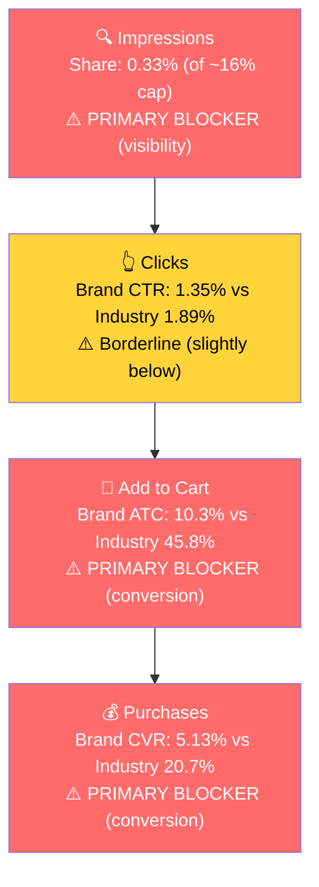

# Seller Central Audit — Food Earth

**Prepared for:** Bilal Fazlani, Food Earth (Fazlani Exports Pvt Ltd)
**Audit window:** Feb 15 - May 14, 2026 (ad data); Jul 2024 - May 3, 2026 (business data)
**Account context:** Bootstrapped, currently unprofitable. April 2026 ran $10K in sales on $3K of seller-central ad spend (plus ~$3K more in other fees per the call) at blended ROAS 0.93 and TACoS 30%. Last Amazon payout was February. Target: $20-25K/month by end of year.

---

## Section 1: Catalog Assessment

| Priority | Product | 3-Mo Sales | 3-Mo Ad Spend | ROAS | TACoS | Organic Sales | Ad Sales % | Buy Box % | CVR | Trend |
|----------|---------|-----------|--------------|------|-------|---------------|-----------|-----------|-----|-------|
| **P0** | Ready to Eat Indian Cuisine Bundle (B0GX9VV9ST) | $14,455 | $2,399 | 1.22 | 16.6% | $11,521 | 20.3% | 79.3% | 6.0% | Growing |
| **P1** | Indian Simmer Sauce (B0GMP7GG3S) | $7,958 | $819 | 1.84 | 10.3% | $6,449 | 19.0% | 83.0% | 7.1% | Growing |
| **P2** | Hug in a Bowl Soup, Five Lentil Coconut (B0FCBXWGF2) | $2,231 | $850 | 1.19 | 38.1% | $1,220 | 45.3% | 98.7% | 6.3% | Flat |
| **P3** | Hong Kong Noodle (B0GY96D8CX) | $926 | $1,361 | **0.48** | **147%** | $279 | 69.9% | 99.7% | 6.3% | New launch, burning |

**Note:** All other parent ASINs have under $325 in 3-month revenue and are not prioritized. Several (A Perfect Marriage Soup, Lentil Quinoa Soup, multiple dip parents) have ad spend with negligible sales and are addressed at campaign level in Section 5.

**Critical caveat on P0 parent structure:** The Ready-to-Eat Bundle parent (B0GX9VV9ST) groups 9 distinct meal SKUs that are not true variants. The deep-dive focus for this audit is the **Six Flavor Variety Pack child (B0D8Q9MMT9)** — highest revenue child ($5,333 / 3-mo), highest CVR, healthy buy box, and the natural entry product for new customers.

---

## Section 2: Qualitative Product Understanding (P0 — Six Flavor Variety Pack)

**Product:**
- 6 microwavable trays of organic, plant-based Indian meals: Chickpeas Curry, Madras Coconut Curry, Bombay Lentil Curry, Five Lentil Curry, Split Lentil Curry (all with rice), and Vegetable Biryani. ~10.58 oz / 300g each, 11-12g plant protein per tray.
- Shelf-stable (540-day shelf life), 90-second microwave prep, peel-and-eat tray format. Certified organic, vegan, gluten-free, dairy-free, GMO-free, no preservatives.
- Distinct from frozen (no thawing) and curry-pouch (rice included) competitors. Solves the "authentic Indian without 30 minutes of effort" need.

**Customer:**
- Health-conscious busy professionals, college students, plant-based eaters, and the Indian diaspora seeking convenient nostalgia food.
- Buys for: office lunch, late-night work meal, dietary compliance (vegan/GF) without sacrificing variety, meal prep for the week.

**Brand:**
- Registered family-owned brand by Fazlani Exports Pvt Ltd (Mumbai). Brand launched 2019, "reborn" 2025. Run by Iqbal Fazlani (father) and Bilal Fazlani (son). Family roots in sesame commodity exports (India's largest sesame exporter per the seller).
- Mid-stage: 10,000+ stores worldwide per the foodearth.com site, but US Amazon revenue is currently under $15K/month. Multi-channel (Amazon, DTC, Walmart.com, Faire, Instacart). 2026 SOFI Awards finalist.
- Brand vibe: warm, earthy, modest-premium. Green and cream palette, botanical motifs. Closer aesthetic to Maya Kaimal than to Tasty Bite. Lacks a sharp ownable hook (no founder narrative, chef story, or source-of-spice angle visible on the listing today).

**Competitive Landscape:**

- **Price positioning:** Six Flavor Variety Pack at $35.69 ($5.95/meal). Market range $25-45. Upper-mid tier, ~20% above Tasty Bite, on par with Maya Kaimal, ~10% below Deep Indian Kitchen.

| Brand | Competing Product | Indicative Price | Positioning |
|-------|-------------------|------------------|-------------|
| Tasty Bite (Mars) | Variety Pack of 6 (curry pouches, no rice) | ~$25-30 | Category leader, 25+ yr brand, mass-market |
| Maya Kaimal | Everyday Dal Variety Pack of 6 | ~$30-40 | Premium, vegan-first, founder-led |
| Kitchens of India (ITC) | Dinner Variety Pack of 6 | ~$25-35 | Heritage Indian, ITC-backed |
| Deep Indian Kitchen | Ready meals (organic) | ~$35-45 | Newer premium entrant |

- **Real differentiator (undersold):** Food Earth is the only major variety pack with a **full meal in one tray (curry + rice)**. Tasty Bite and Maya Kaimal variety packs are curry pouches that require rice prep. This is genuinely different and currently only implicitly communicated.
- **Real gap:** Tasty Bite has 10K+ Amazon reviews. Food Earth has under 100. Competitors sit at 4.2-4.5 stars. Food Earth at 3.7 stars. Competing as an undersized challenger in a mature category with a star-rating disadvantage.

**Listing Quality:**

*Strengths:*
- **Title:** Includes brand, format, key claims (Organic, Microwavable), pack size. Well-structured.
- **Bullets:** 5 bullets, each a distinct angle. Structure is right.
- **A+ Content:** Present, multi-module (hero, brand pillars, How to Prepare infographic, comparison table, flavor showcase). Image-led format.
- **Buy Box (97.6% at the child level):** Healthy on this specific SKU.

*Opportunities:*
- **Rating (3.7 stars, stuck since Jul 2024):** Biggest CVR ceiling. 0.5-0.8 stars below comp. Listing tweaks cannot fully overcome this. Need to investigate review themes (taste, texture, portion size) and fix the underlying product issue.
- **Image slot #2 is a wasted brand-authorization certificate** signed by Iqbal Fazlani attesting Fazlani Exports as the official Amazon seller. Zero purchase-decision value, prime mobile-swipe real estate. **Highest-impact single fix.** Replace with a hero food shot (open tray with steaming curry and rice, fork or naan, lifestyle context).
- **No video.** Ready-to-eat ethnic food is a "does it look appetizing?" purchase. A 30-second peel-microwave-reveal clip addresses the main hesitation.
- **Main image food visibility:** 6 sealed packs dominate; the food itself is barely visible from a mobile thumbnail. Comp variety packs lead with food prominence.
- **Bullets are too short (60-100 chars each).** Miss the "complete meal vs curry pouch" differentiator and do not address spice / portion / texture concerns.
- **A+ "What Sets Us Apart" comparison module is weak.** Compares Food Earth (Yes / Yes / Yes / Yes) vs generic "Other Ready-to-Eat Meals" (No / No / No / No) on attributes that Tasty Bite, Maya Kaimal, etc. actually have. Replace with a real comparison: complete meal vs curry pouch, 6 flavors vs 4, India-origin recipes.
- **No founder / origin story.** Multi-generation Mumbai export family is a sellable narrative absent from the A+.

---

## Section 3: Quantitative Product Understanding (P0)

### Annual Trend

| Metric | Sep 2025 | Dec 2025 | Feb 2026 | Apr 2026 |
|--------|---------|----------|----------|----------|
| Total Sales | $3,103 | $3,242 | $4,217 | $5,010 |
| Sessions | 1,714 | **3,748** | 2,977 | 2,616 |
| CVR | 6.18% | **3.20%** | 5.21% | 6.50% |
| Buy Box % | 84.08% | **58.24%** | 73.85% | 81.33% |

- **The biggest story is buy box, not ads.** Buy box collapsed from 84% to 58% between Sep and Dec 2025. Sessions doubled in Q4 (holiday + gifting traffic), but CVR halved because the brand couldn't convert visitors when it didn't hold the buy box. Sales stayed flat at ~$3K through what should have been the peak demand window.
- **Recovery preceded the ad ramp.** Buy box started recovering in February (74%), before any meaningful ad spend was deployed. The current $5K/month run rate is largely a buy box recovery story, not an ad-performance story. Ads added ~$1.3K/month in ad sales but at TACoS 21%.
- **Same pattern in P1 (Simmer Sauce):** Buy box jumped from 71% (Feb) to 89% (Mar/Apr) correlating with that product's 50% sales growth. The buy box recovery is account-wide and is the primary driver of recent growth.

### Rating Trajectory

Stable at 3.7-3.9 stars across the full 18-month history we have. Never reached 4.0. Not declining, but stuck at a level that signals quality concerns relative to category competitors (4.2-4.5).

### Sales Rank Trajectory

Stable-to-improving in the Entrees subcategory (currently #95-110, has touched #50-75 in better weeks). Weaker in the broader Grocery & Gourmet Food category (#50-65K, worst point #90,448 in late Dec 2025 during the buy box collapse).

---

## Section 4: Market Opportunity (SQP)

### Tier Breakdown

- **Tier 1 (Hero):**
  - **Keywords:** indian food, tasty bites indian food, deep indian kitchen
  - **Rationale:** Direct intent for ready-to-eat Indian meals. "indian food" is the largest broad search; the two competitor-brand queries signal shoppers actively hunting for the exact product format P0 sells.

- **Tier 2 (Core market):**
  - **Keywords:** ready to eat meals, meals ready to eat, microwave meals, microwavable food, prepared meals ready to eat
  - **Rationale:** Ready-to-eat / microwave meals broadly. Cuisine-agnostic queries where P0 is one solution alongside frozen meals, MREs, and Kevin's Natural Food. Lower fit.

- **Tier 3 (Adjacent):**
  - **Keywords:** indian, biryani
  - **Rationale:** "indian" is very broad (could be any Indian product). "biryani" is specific to one flavor in the variety pack plus a dedicated child. Small but high-relevance niches.

### Market Sizing (12-month average)

| Tier | Monthly Search Volume | Monthly Add to Carts (Market) | Monthly Purchases (Market) | Est. Market Size ($/mo) |
|------|----------------------|-------------------------------|---------------------------|------------------------|
| Tier 1 | 26,400 | 5,860 | 2,630 | **~$175,800** |
| Tier 2 | 147,200 | 29,750 | 13,990 | ~$892,500 |
| Tier 3 | ~30,000 | ~1,100 | ~500 | ~$33,000 |
| **Total P0** | **~203,600** | **~36,700** | **~17,120** | **~$1.1M** |

*Estimated using $30 avg product price based on competitive landscape analysis.*

**Seasonality:** Tier 1 volume peaks Nov/Dec/Jan (28-35K) and troughs Apr/May (20-21K). Q4 is the next major opportunity window. The brand needs to be ready (buy box stable, listing fixed, ad budget planned) by September to capture it.

### Blockers & Growth Path

| Tier | Impression Share | CTR (Brand vs Industry) | CVR (Brand vs Industry) | Primary Blocker | Growth Path |
|------|-----------------|------------------------|------------------------|-----------------|-------------|
| Tier 1 | 0.33% (cap ~16%) — Blocker | 1.35% vs 1.89% — Borderline | 5.13% vs 20.7% — **Blocker** | **CVR + Impression Share (compound)** | Fix CVR first (listing fixes from Section 2), then scale PPC on Indian-specific terms. |
| Tier 2 | 0.05% (cap ~24%) — Blocker | 1.29% vs 1.82% — Borderline | 1.45% vs 20.8% — **Blocker** | CVR + product-query fit | **Not capturable.** Variety pack is not what most "ready to eat meals" searchers want. Skip aggressive investment. |
| Tier 3 | ~0.9% on biryani — Healthy | 1.11% vs 0.67% — **Healthy** | 5.3% vs 14.5% — Below | CVR | Small but defensible incremental win. Bid lightly on "biryani" + "vegetable biryani". |

### ICAP Funnel Visual (Tier 1 — Primary Growth Opportunity)

The compound blocker is the core challenge. The brand barely shows up AND when it does, conversion craters at the cart-add stage (10.3% vs 45.8% industry). Spending more on PPC before CVR is fixed will burn budget at 4x the cost per conversion. Per the SQP playbook (CLAUDE.md "Low impression share + poor CVR" pattern): **fix CVR drivers first, then deploy PPC capital.**

**Market context:**

- The brand grew Tier 1 impression share 6x over 3 months (0.10% > 0.62% in Apr) as ad spend ramped. Visibility growth is real but conversion isn't absorbing it (purchase share is flat at 0.05%).
- Branded queries don't appear meaningfully — the brand is too small to have its own significant branded volume yet. No defensive ad campaign needed at this scale.

---

## Section 5: Ad Analysis

**Account context:** 8 enabled campaigns, $7,621 / 90-day spend, $7,810 / 90-day ad sales, blended ROAS **1.02**. Only 1 of 8 campaigns is profitable (above 1.5x ROAS). The account is destroying margin on every ad dollar at current performance.

### Account Level

**Campaign Structure**

> **Finding: Two manual campaigns are massively overstuffed, starving high-ROAS keywords of budget.**
>
> | Campaign | Targets | Spend | ROAS |
> |----------|---------|-------|------|
> | EcomC - Ramadan - Manual - Noodles | **30** | $576 | 0.67 |
> | EcomC - Manual - Dips, Simmer, Soup | **25** | $1,456 | 0.96 |
>
> **Problem:** Inside the 25-target Dips/Simmer/Soup campaign, "soup" PHRASE alone eats $705 (48% of campaign spend) at ROAS 1.04. Meanwhile, "organic lentil soup" PHRASE has ROAS 4.63 from $15.53 spend — starved. Same pattern in Noodles: "noodle" PHRASE eats $368 (64%) while everything else gets $0-$2.
>
> **Solution:** Extract proven high-ROAS keywords into dedicated 3-5 keyword campaigns with their own budgets. Negate the harvested keywords from the parent campaigns.
>
> **Impact:** "organic lentil soup" alone at $200/mo spend (current ROAS 4.63) = ~$926 in monthly sales vs the $80 it generates today. Applied to 3-4 starved keywords across both campaigns: **$1,500-$2,500/mo incremental sales without new spend.**

**Auto vs Manual Split**

| Targeting Type | Clicks | Spend | Sales | ROAS | AOV | CPC | CVR |
|----------------|--------|-------|-------|------|-----|-----|-----|
| Automatic | 3,423 | $4,390 (58%) | $4,590 | **1.05** | $25.22 | $1.28 | **5.32%** |
| Manual | 2,737 | $3,230 (42%) | $3,218 | 1.00 | $28.99 | $1.18 | 4.06% |

> **Problem: Auto is outperforming Manual on ROAS and CVR.** This pattern is backwards. Auto should be the smaller discovery channel; Manual should be where proven winners are scaled with controlled bids. Auto winning means Amazon's algorithm is finding better matches than the agency's manual keyword selection. The harvest-and-scale loop is broken.
>
> **Solution:** Mine the Auto search terms (Section 5 Product Level identifies several winners: "indian food", "indian food ready to eat", "coconut curry sauce"), migrate top converters into dedicated Manual EXACT campaigns, negate from Auto.
>
> **Impact:** Lifting Manual ROAS from 1.00 to 1.5 at current spend = **~$1,610/mo incremental sales.** This is a steady, compounding gain.

**Campaign Profitability**

> **Problem: 7 of 8 campaigns are below the 1.5x profitability threshold. Noodle campaigns alone burned $913 net over 90 days.**
>
> | Campaign | Spend | Sales | ROAS | Net |
> |----------|-------|-------|------|-----|
> | EcomC - Ramadan - Auto - Noodles | $1,147 | $423 | **0.37** | -$724 |
> | EcomC - Ramadan - Manual - Noodles | $576 | $387 | 0.67 | -$189 |
> | SPA - Dip - Hero Desi Fiery | $162 | $138 | 0.85 | -$24 |
> | EcomC - Auto - All Top rat Listings | $396 | $317 | 0.80 | -$79 |
> | EcomC - Manual - Dips, Simmer, Soup | $1,456 | $1,398 | 0.96 | -$58 |
> | SPA - Meals - Hero Master VP (P0) | $1,657 | $1,904 | 1.15 | +$247 |
> | SPM - Meals - Hero Master VP (P0) | $1,197 | $1,434 | 1.20 | +$237 |
> | **SPA - Simmer - Hero - Coconut VP** | **$1,029** | **$1,809** | **1.76** | **+$780** |
>
> The Noodle category received $1,723 of ad investment to deliver $810 in sales. That is 22.6% of total ad spend producing 10.4% of ad sales. The product has not found product-market fit on Amazon (per Step 1, P3 TACoS was 147%).
>
> **Solution:** Pause both Noodle campaigns immediately. Reallocate the freed $574/mo to the only proven profitable campaign (SPA Simmer Coconut VP at 1.76 ROAS).
>
> **Impact:** $574/mo of reallocated budget at 1.76 ROAS = $1,010 in additional monthly sales. Net swing vs current loss: **$1,584/mo improvement** with no new budget.

**Targeting Strategy**

*Keyword vs Product Targeting:*

| Targeting Strategy | Clicks | Spend | Sales | ROAS | AOV | CPC | CVR |
|-------------------|--------|-------|-------|------|-----|-----|-----|
| Keyword Targeting | 5,065 | $6,005 (79%) | $6,032 | 1.00 | $26.93 | $1.19 | 4.42% |
| Product Targeting | 1,095 | $1,615 (21%) | $1,776 | **1.10** | $25.74 | $1.48 | **6.30%** |

Product targeting converts 43% better but gets 21% of budget. Opportunity to shift more spend to Sponsored Display product targeting (own ASINs for defense, competitor ASINs for offense).

*Match Type Breakdown:*

| Match Type | Clicks | Spend | Sales | ROAS | AOV | CPC | CVR |
|------------|--------|-------|-------|------|-----|-----|-----|
| PHRASE | 2,444 | $2,873 (93%) | $3,017 | 1.05 | $29.29 | $1.18 | 4.21% |
| EXACT | 174 | $224 (7%) | $171 | 0.76 | $24.42 | $1.29 | 4.02% |

EXACT is barely used and underperforms PHRASE. Confirms no harvest-and-scale loop — winning PHRASE keywords have not been promoted to EXACT.

### Product Level (P0)

**P0 Campaign Map**

| Campaign | Advertised Child | Spend | Sales | ROAS | Orders |
|----------|------------------|-------|-------|------|--------|
| SPA - Meals - Hero Master VP | Vegetable Biryani (B086WPJGXQ) | $1,657 | $1,904 | 1.15 | 58 |
| SPM - Meals - Hero Master VP | Vegetable Biryani (B086WPJGXQ) | $1,197 | $1,434 | 1.20 | 34 |
| EcomC - Auto - All Top rat Listings | Six Flavor Variety Pack (B0D8Q9MMT9) | $107 | $174 | **1.62** | 5 |
| EcomC - Auto - All Top rat Listings | Vegetable Biryani | ~$30 | small | small | 1 |
| **Total P0** | | **~$2,991** | **~$3,512** | **1.17** | **98** |

Total P0 ad spend is **39% of total account spend ($2,991 of $7,621)**. Within P0, **96% goes to Vegetable Biryani (B086WPJGXQ)** and **4% to the Six Flavor Variety Pack (B0D8Q9MMT9)** — even though the Variety Pack is the higher-revenue child organically ($5,333 vs $4,017 / 3-mo), the higher-ROAS child in the small spend it does receive (1.62 vs 1.15-1.20), and the natural entry SKU for new customers.

**Blocker-Specific Findings**

**Impression Share Blocker: Keyword Spend vs Tier 1/2/3 Queries**

Section 4 identified impression share as half of the primary Tier 1 blocker (0.33% vs ~16% cap). The PPC lever is bidding on the keywords where impression share is low.

| Search Term | Tier | Spend | Sales | ROAS | Clicks | Orders | CVR |
|-------------|------|-------|-------|------|--------|--------|-----|
| indian food | Tier 1 | $107 | $134 | **1.25** | 53 | 4 | 7.5% |
| indian food ready to eat | Tier 1 (close) | $62 | $62 | 1.00 | 25 | 2 | 8.0% |
| ready to eat meals | Tier 2 | $162 | $261 | **1.60** | 88 | 6 | 6.8% |
| tasty bites indian food | Tier 1 | not visible | — | — | — | — | — |
| deep indian kitchen | Tier 1 | not visible | — | — | — | — | — |
| Targeting: "indian ready to eat meals" (PHRASE, SPM Meals Hero VP) | | **$11.54** | $168 | **14.55** | 6 | 4 | **67%** |

> **Problem:** "indian food" — the highest-volume Tier 1 query — gets $107 over 90 days and converts at the account-best ROAS of 1.25. "tasty bites indian food" and "deep indian kitchen" don't appear, meaning the brand isn't bidding on competitor-brand terms. Inside SPM Meals Hero VP, the target "indian ready to eat meals" PHRASE has **ROAS 14.55 on $11.54 of spend** — starved by the broad "meals" PHRASE in the same campaign that absorbs $1,083 of spend at ROAS 1.14.
>
> **Solution:**
> 1. Extract "indian ready to eat meals" into its own EXACT-match campaign with $30/day budget.
> 2. Launch dedicated campaigns bidding on Tier 1 keywords: "indian food", "tasty bites indian food", "deep indian kitchen", "tasty bites", "indian variety pack", "indian meals".
> 3. Reallocate budget from broad "meals" PHRASE (captures non-Indian intent) toward Indian-specific terms.
>
> **Impact:** Even at a heavily-discounted scaled ROAS of 5 (vs current 14.55) on the extracted "indian ready to eat meals" keyword, $900/mo spend = **$4,500/mo in sales** from just this one keyword. Adding the other Tier 1 terms at conservative ROAS 2.0 with $500/mo spend = additional $1,000/mo. The ceiling lifts further once listing CVR is fixed.

**CVR Blocker: P0 Child Misallocation**

Section 4 also identified CVR as the other half of the Tier 1 blocker (5.13% vs 20.7% industry). The structural fix is on the listing side (rating, image #2, video, A+). The PPC lever is correctly allocating spend to the child that already converts best.

> **Problem:** 96% of P0 ad budget supports Vegetable Biryani (ROAS 1.15-1.20). The Six Flavor Variety Pack — higher organic revenue, higher ROAS in test spend (1.62), near-100% buy box, natural entry product — gets 4%. The allocation appears inherited from how the campaign was originally set up, not from a data-driven decision.
>
> **Solution:**
> 1. Launch a dedicated Sponsored Products campaign for B0D8Q9MMT9 (Variety Pack) with the Tier 1 Indian-themed keywords.
> 2. Reduce existing Biryani-only campaign budgets by 30-50%, redirect to the Variety Pack.
> 3. Add Sponsored Display product targeting on the Variety Pack's own listing (defense) and on top competitor ASINs (Tasty Bite, Maya Kaimal, Kitchens of India variety packs).
>
> **Impact:** $800/mo shifted from Biryani (ROAS 1.18) to Variety Pack (assume scaled ROAS 1.5 based on current 1.62 small-sample): **$256 incremental monthly sales** at zero additional budget. Bigger compounding value comes from positioning the right SKU as the brand's ad-supported hero.

**CTR Blocker: Placement Distribution**

| Placement | Spend | Sales | ROAS | CTR | CVR |
|-----------|-------|-------|------|-----|-----|
| Top of Search | $3,893 (51%) | $2,743 | 0.70 | **2.71%** | 4.42% |
| Rest of Search | $1,817 (24%) | $1,383 | 0.76 | 0.74% | 3.85% |
| Product Pages | $1,605 (21%) | $861 | **0.54** | 0.30% | 2.89% |
| Off Amazon | $300 (4%) | $0 | **0.00** | 0.34% | 0.00% |

CTR is borderline (Section 4 showed brand 1.35% vs industry 1.89%, not the primary blocker). But there's clear placement waste:

> **Problem:** Off Amazon spent $300 over 90 days for zero sales. Product Pages absorbs 21% of spend at ROAS 0.54 and CVR 2.89%.
>
> **Solution:** Disable Off Amazon entirely. Reduce Product Pages bid modifier aggressively. Redirect to Top of Search (best CTR by 9x, best CVR tied).
>
> **Impact:** ~$1,100 / 90 days of clearly-wasted spend recaptured. At Top of Search's current ROAS (0.70), that yields $770 in sales. Net change is roughly neutral on sales but eliminates waste and frees ~$370 / 90 days for higher-value placement once listing CVR improves.

---

## Section 6: Action Plan

The primary blockers are: (1) buy box stability at the child level, (2) CVR ceiling driven by 3.7-star rating + listing gaps, and (3) ad budget misallocated to the wrong child and the wrong product category. The action plan addresses these in the right sequence: stop the bleeding first (Weeks 1-2), redirect to what works (Weeks 2-4), fix the listing (Weeks 4-6), then scale on the improved foundation (Weeks 6-8).

### Weeks 1-2: Stop the Bleeding (PPC Quick Wins)

Goal: Eliminate clearly wasted spend and shift budget to proven winners. All actions are ad-platform changes, no listing work yet.

- **Pause both Noodle campaigns** (EcomC Ramadan Auto and Manual Noodles). $1,723 / 90-day spend recovered, $913 net loss eliminated.
- **Disable Off Amazon placement** across all campaigns. $300 / 90-day pure waste eliminated.
- **Reduce Product Pages bid modifier by 60%.** Reallocate to Top of Search.
- **Reallocate freed budget (~$2,300 / 90-day) to SPA Simmer Coconut VP** (the only profitable campaign at ROAS 1.76). Expected impact: **$1,584/mo additional net sales**.
- **Investigate the P0 child-level buy box issues from Step 1** (B086VPCC7N Chickpeas Curry at 14% BB, B0CQLYTFPK Bombay Lentil at 56% BB). Verify with the seller whether MAP-related pricing changes or external channel pricing are causing suppression on these single-flavor Pack-of-6 SKUs.

### Weeks 2-4: Redirect to What Works (PPC Restructure)

Goal: Fix the misallocation. Move budget to the right child, restructure overstuffed campaigns, harvest winning keywords.

- **Launch a dedicated Sponsored Products campaign for the Six Flavor Variety Pack (B0D8Q9MMT9)** with $30-50/day budget. Seed with Tier 1 keywords: "indian food", "indian ready to eat meals", "tasty bites indian food", "deep indian kitchen", "indian variety pack".
- **Extract "indian ready to eat meals" PHRASE** from SPM Meals Hero VP into its own EXACT-match campaign. Current ROAS 14.55 at $11.54 spend. Scale to $30/day.
- **Reduce SPA and SPM Meals Hero VP campaign budgets by 30%.** These are Vegetable Biryani-only and the Variety Pack is the higher-leverage child.
- **Break out the 25-target Dips/Simmer/Soup campaign.** Extract top-ROAS keywords into 2-3 dedicated 3-5 keyword campaigns.
- **Launch a Sponsored Display product-targeting campaign on top competitor ASINs:** Tasty Bite Variety Pack (B00S5M3LF6), Maya Kaimal Everyday Dal (B07WLRJJKS), Kitchens of India Dinner Variety (B002GQ6OEM). Defensive on Food Earth's own listings too.
- **Begin listing content preparation** (writing only, no publishing yet): replacement image #2 (hero food shot), 30-second product video, revised A+ comparison module.
- Expected combined impact from Weeks 2-4: **additional $2,000-$3,000/mo from PPC restructure** if listing CVR stays at current levels. Higher if listing fixes from Week 4-6 land.

### Weeks 4-6: Fix the Listing (CVR Drivers)

Goal: Address the structural CVR gap. The biggest single CVR lift the audit identified comes from listing changes, not PPC.

- **Replace image slot #2** with the new hero food shot (open tray, steaming curry, lifestyle context). Single highest-impact change.
- **Publish the 30-second product video** (peel-microwave-reveal sequence with the finished food clearly visible).
- **Revise the A+ "What Sets Us Apart" module** to compare Food Earth against named competitors on real differentiators (complete meal vs curry pouch, 6 flavors vs 4, India-origin recipes), not generic "Other Ready-to-Eat Meals" with implausible No/No/No/No claims.
- **Add a Brand Story / Founder Origin A+ module** featuring the Fazlani family / Mumbai exporter background. Humanizes the brand against corporate competitors like Mars-owned Tasty Bite.
- **Rewrite bullets to 150-200 chars each**, leading with the "complete meal" differentiator and addressing common buyer hesitations (spice level, portion size, rice quality).
- **Begin systematic review-theme analysis on the 3.7-star rating.** Pull recent negative reviews, categorize the recurring complaints (likely taste, texture, or portion-size driven). Identify what is fixable in the product itself. This is the highest-ceiling work but takes the longest to show ratings impact.
- Expected impact: CVR lift from 5% toward 8-10% (a step toward closing the gap to industry's 20%). At constant traffic, that alone could add **~$2,000-$3,500/mo in sales**.

### Weeks 6-8: Scale on the Improved Foundation

Goal: With CVR improved and the right child in front of customers, push aggressively on impression share.

- **Increase total ad budget by 30-50%** if Weeks 4-6 CVR improvements land. Direct the increase to the Variety Pack campaign + new Tier 1 keyword campaigns.
- **Scale "indian ready to eat meals" EXACT campaign** to $50-75/day if ROAS stays above 3.
- **Begin a small branded-defense campaign** ($5-10/day) on "food earth" and "food earth meals" to prevent future competitor poaching as the brand grows.
- **Evaluate P1 (Indian Simmer Sauce) for next-phase deep dive.** P1 ROAS (1.84) is already healthier than P0 and growing fast. With the P0 playbook in place, the same approach applied to P1 could double P1 revenue in the following 90 days.
- **Prepare for Q4 2026 demand spike.** SQP confirms Indian food search volume rises ~50% from May lows to Nov/Dec peaks. The brand needs buy box stable, listing fixed, ad budget pre-funded by September to capture this window. The Q4 2025 buy box collapse cost the brand its biggest seasonal opportunity. Q4 2026 is the recovery opportunity.

### Path to $20K/month

- Current run rate (Apr 2026): $10K/month total Amazon sales.
- Week 1-2 quick wins: +$1,500/mo from Noodles paused + reallocation = ~$11.5K/month.
- Week 2-4 restructure: +$2,000-$3,000/mo = ~$13.5-14.5K/month.
- Week 4-6 listing CVR fixes: +$2,000-$3,500/mo = ~$15.5-18K/month.
- Week 6-8 scaling + Q4 seasonality entering: +$2,000-$5,000/mo = **$17-23K/month by end of 8 weeks**.

The $20K/month target is reachable in the 8-week window if (a) the Noodles pause and child-level reallocation execute cleanly, (b) the image #2 replacement and video land before Q4, and (c) the seller is willing to accept TACoS in the 25-30% range during the transition while the listing CVR is being fixed. The $25K target is reasonable for Q4 if the seasonal demand spike is captured cleanly.

---

## Section 7: Insights & Questions for the Seller

### Insights

- **Last year's lost Q4 was a buy box problem, not an ads problem.** P0 (Variety Pack) buy box collapsed from 84% to 58% from Sep to Dec 2025. Sessions doubled in Q4 holiday traffic but CVR halved because the brand couldn't convert when it wasn't holding the buy box. Sales stayed flat at ~$3K through the peak demand window. The recent ad ramp coincides with the buy box recovery, but most of the sales growth is from the buy box rebound, not the ads.
- **P0 (Six Flavor Variety Pack) is funded 4% of the way it should be.** 96% of the Ready-to-Eat Bundle ad budget supports Vegetable Biryani. The Variety Pack is the natural hero — higher revenue, higher ROAS, healthier buy box, natural entry SKU for first-time buyers. This is the single largest misallocation in the account.
- **P3 (Hong Kong Noodle) is burning $574/month net.** 22.6% of ad budget on a product with 147% TACoS that has not found product-market fit. Pausing immediately and redirecting to the only profitable campaign (P1 Simmer Coconut VP) is a guaranteed $1,584/mo improvement.
- **The agency's hypothesis "CPC is the blocker" is not what the data shows.** SQP CTR is just slightly below industry (1.35% vs 1.89%), meaning shoppers click in roughly normal proportions when they see the listing. The real killer is CVR (5% vs industry 20%), and CVR is driven by listing factors (rating, image #2, video, A+) plus the structural issue of the variety pack not fitting every "indian food" search intent.
- **"indian ready to eat meals" is the brand's most under-funded high-ROAS keyword.** ROAS 14.55 on $11.54 / 90 days of spend, trapped in a 9-target campaign where a broad "meals" target absorbs $1,083 at ROAS 1.14. Extract and scale.
- **P0 (Variety Pack) has a structural rating disadvantage.** 3.7 stars vs comp 4.2-4.5 for 18+ months. No amount of PPC will fully overcome this. Listing fixes are the floor, but a real fix to whatever is driving negative reviews (taste, texture, portion) is needed for the brand to ever close the CVR gap to industry levels.

### Questions for the Seller

- **What caused the P0 buy box collapse Oct-Dec 2025?** No third-party sellers on the listing (per the call). The most common cause for private-label brands is MAP-related price suppression — either prices changed below MAP (intentionally or unintentionally), or Amazon detected lower prices on Walmart / DTC / Instacart and suppressed. Was there a pricing change, promotional event, or external-channel pricing shift in that window?
- **The Six Flavor Variety Pack rating has been stuck at 3.7-3.9 stars for the full 18 months we have data for.** Have you reviewed the recurring themes in negative reviews, and do you know if it is a taste, texture, or expectation issue? Has any formulation or packaging change been made to address it?
- **Was the decision to put 96% of the Ready-to-Eat Bundle ad budget on Vegetable Biryani (vs the Six Flavor Variety Pack) intentional, or did the agency default to it?** The data suggests this allocation is misaligned with where the search volume actually is.
- **The Noodle product launched in March, has burned $913 net over 90 days, and accounts for 22.6% of ad budget.** Is this a runway you have a defined cutoff for, or has it been on autopilot? The product has not found PMF; the ad spend is destroying account-level economics.
- **Two child SKUs have severe buy box issues (Chickpeas Curry Pack of 6 at 14%, Bombay Lentil Pack of 6 at 56%).** These are private-label with no competing sellers. Likely MAP-related. Have there been recent price changes or external-channel pricing issues on these specific SKUs?
- **You mentioned exploring a move to Vendor Central via a 3PL.** Given that Seller Central data shows real, fixable opportunities in the current account (and Vendor Central removes the control needed to fix them), is this still under active consideration after seeing this audit?
