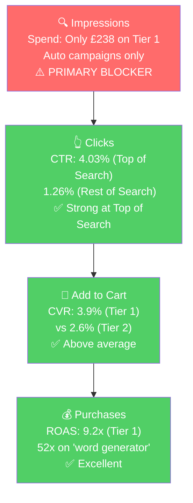

# Seller Central Audit - Ghost Hunting Kit (Spirit Shack)

**Brand:** SpiritShack (spiritshack.co.uk)
**Marketplace:** Amazon UK
**Date:** April 2026
**Analysis Period:** January - March 2026 (ad data: Jan 9 - Apr 7, 2026)

---

## Section 1: Catalog Assessment

| Priority | Product | 3-Mo Sales | 3-Mo Ad Spend | ROAS | TACoS | Organic Sales | Ad Sales % | Buy Box % | CVR | Trend |
|----------|---------|-----------|--------------|------|-------|---------------|-----------|-----------|-----|-------|
| P0 | HexCom Ghost Kit (B0D4FCKX2F) | £7,799 | £796 | 9.1 | 10% | £717 | 91% | 99% | 1.9% | Flat |
| P1 | HexBox (B0FP9KHS1Y) | £6,490 | £192 | 1.1 | 4% | £5,841 | 12% | 94% | 4.3% | Growing |
| P2 | TripWire Motion Sensors (B09NMK81DP) | £2,898 | £364 | 5.7 | 13% | £894 | 69% | 90% | 2.4% | Volatile |
| P3 | Touch Activated Ghost Bear (B08K4YSGRL) | £1,860 | £226 | 7.0 | 14% | £0 | 100% | 99% | 2.8% | Recovering |

**Note on HexCom Ad Sales %:** The 91% ad attribution reflects the Jan-Mar window only. Before January 2026, HexCom was 100% organic with zero ad spend. This is not structural ad-dependency.

**Not prioritized:** ~100 remaining products are primarily third-party resale items (P-SB7 Spirit Boxes, K2 EMF meters, voice recorders, Ouija boards) and lower-selling SpiritShack accessories. Many generate £0-500/quarter. Account total: £40,330 sales, £2,122 ad spend over 3 months.

---

## Section 2: Qualitative Product Understanding (P0)

**Product:**
- The HexCom is a handheld ITC word generator for ghost hunting. It uses a built-in EMF reader to trigger word selection from a 2,000+ word database, displaying results on a 3.5" color screen and speaking them aloud through a built-in speaker.
- Solves the clarity problem in spirit communication: traditional spirit boxes sweep radio frequencies producing garbled audio. The HexCom delivers clean, readable words.
- People buy it for interactive ghost hunting experiences, whether serious paranormal investigation or entertainment.

**Customer:**
- Ghost hunting enthusiasts in the UK, from hobbyists to semi-professional paranormal investigators. Strong gift-buying segment in Q4 (Halloween/Christmas).

**Brand:**
- SpiritShack is a registered UK company (Sheffield), established 10+ years, 20,000+ customers served. The UK's largest ghost hunting equipment shop. Professional website, active social media across 6 platforms. They manufacture proprietary products (HexCom, HexBox, TripWire, sensors) and resell third-party equipment.
- **Brand vibe:** Dark, niche, and enthusiast-driven. Green-on-black tech/hacker aesthetic for the HexCom line. Spooky but professional.

**Competitive Landscape:**

Price positioning: Avg ITC word generator: £175-250 | HexCom: £130 | 26-48% below average

| Competitor | Product | Price | Word Bank | Differentiator |
|-----------|---------|-------|-----------|----------------|
| Infraready | Alice NEO ITC Box | £250 | 10,000 words | Largest word bank, NeoPixel LED, UK-made |
| Infraready | Alice Cubik | £175 | Thousands | EMF triggered, compact design |
| Infraready | Spirit Bridge Pro | ~£200+ | 27,000 words + phonemes | Phonetic communication |
| Digital Dowsing | Ovilus 5b | ~£350-450 | Large | Gold standard ITC device, US-made |

The HexCom wins on price and convenience (USB-C rechargeable vs AA batteries, color screen). It has the smallest word bank (2,000 vs 10,000-27,000), which could be a concern for power users.

**Listing Quality:**

**Strengths:**
- 9 images with clear product photography from multiple angles. The screen with displayed words is visible, immediately communicating the product function.
- 1 video present, rare in this niche.
- 5 bullets with all-caps benefit headers.

**Opportunities:**
- **Title is keyword-stuffed and uninformative.** 200 characters of comma-separated search terms. Does not mention "word generator" or "word bank" (the core function). A shopper cannot understand what the product does from the title alone.
  - Suggested: "HexCom Word Generator - Ghost Hunting Equipment with Built-In EMF Reader, 2000+ Word Bank, 3.5" Colour Screen, Rechargeable - Spirit Communication Device by SpiritShack"
- **No A+ content.** For a £130 niche electronics product, A+ content with in-use imagery (dark room investigation, screen close-up, comparison to traditional spirit boxes) would directly address the 1.7-2.0% CVR.
- **No lifestyle/in-use images.** All 9 images are studio product shots. No images showing the HexCom during an investigation, no feature infographics, no comparison charts.
- **Rating at 3.9 stars (declining from 5.0).** Below the 4.0 threshold many shoppers use as a filter. The decline occurred during the high-volume Oct-Dec 2025 period.

---

## Section 3: Quantitative Product Understanding (P0)

**Annual Trend:**

| Metric | Apr 2025 | Aug 2025 | Oct 2025 (Peak) | Nov 2025 | Jan 2026 | Mar 2026 |
|--------|----------|----------|-----------------|----------|----------|----------|
| Total Sales | £1,170 | £1,820 | £5,200 | £5,200 | £2,600 | £2,210 |
| Sessions | 491 | 742 | 1,581 | 1,466 | 996 | 1,012 |
| CVR | 1.83% | 1.89% | 2.66% | 2.80% | 2.01% | 1.68% |
| Buy Box % | 99.8% | 99.8% | 99.6% | 99.3% | 99.0% | 98.8% |

- Revenue spiked 4.4x during Oct-Nov 2025 (Halloween season). Post-peak, sales settled at roughly double the pre-peak spring baseline, indicating the product established a higher floor after the visibility boost.
- Sessions remain elevated (~1,000/mo) compared to early 2025 (~500/mo), but CVR has dipped back to 1.7%, its lowest point. The product has more traffic but is converting it less efficiently.
- Ad spend started in January 2026 (£225-308/mo). Organic sales dropped significantly when ads launched, suggesting ad attribution is capturing conversions that would have occurred organically. This is common when launching ads on a previously organic-only product.

**Rating Trajectory:** Declining. From 5.0 (Dec 2024) to 3.9 (Mar 2026). Steepest drops during high-volume months.

**Sales Rank Trajectory:** Volatile. Swings between #91 and #428 in Multi Testers subcategory, reflecting low daily unit volume.

---

## Section 4: Market Opportunity (SQP)

**SQP data is not available for this seller.** SpiritShack operates on Amazon UK, and Brand Analytics / Search Query Performance data has not been ingested for this marketplace.

Without SQP, market sizing and ICAP funnel analysis rely on ad campaign data. The keyword tiering below is derived from search term performance in the ad campaigns.

**Tier Breakdown:**

- **Tier 1 (Hero):**
  - **Keywords:** spirit box, ghost box, word generator ghost hunting, ghost hunting kit, ghost communication device
  - **Rationale:** Customers searching for the exact product type the HexCom is. Highest purchase intent.

- **Tier 2 (Core market):**
  - **Keywords:** ghost hunting equipment, ghost hunting equipment uk, paranormal equipment, ghost equipment, ghost detector
  - **Rationale:** Customers shopping for ghost hunting gear broadly. The HexCom is one of many products that could satisfy the search.

- **Tier 3 (Broad/adjacent):**
  - **Keywords:** emf reader, rem pod, rempod, ghost hunting accessories
  - **Rationale:** Adjacent product searches from ghost hunting enthusiasts who might discover the HexCom.

**Ad-Derived Market Performance (proxy for SQP):**

| Tier | Ad Spend | Ad Sales | ROAS | Clicks | Orders | CVR |
|------|----------|----------|------|--------|--------|-----|
| Tier 1 ("spirit box", "ghost box", "word generator", "ghost hunting kit") | £238 | £2,185 | 9.2 | 778 | 30 | 3.9% |
| Tier 2 ("ghost hunting equipment", "paranormal equipment", etc.) | £912 | £3,515 | 3.9 | 2,409 | 63 | 2.6% |
| Tier 3 ("rem pod", "emf reader", etc.) | £184 | £1,366 | 7.4 | 640 | 33 | 5.2% |
| Branded ("hexcom", "spiritshack") | £34 | £1,071 | 31.3 | 109 | 13 | 11.9% |
| Competitor ("alice box", "ovilus") | £39 | £692 | 17.9 | 115 | 8 | 7.0% |

**Blockers & Growth Path (Ad-Derived):**

Without SQP impression share data, blockers are assessed through ad performance patterns:

| Tier | Primary Issue | Evidence | Growth Path |
|------|-------------|----------|-------------|
| Tier 1 | **Severe underspend** | Only £238 spend on highest-converting terms (9.2x ROAS, 3.9% CVR). "Word generator" has £4 total spend at 52x ROAS. | Create manual exact-match campaigns for Tier 1 terms. Scale aggressively. These convert and are massively underfunded. |
| Tier 2 | **Broad targeting, lower efficiency** | £912 spend at 3.9x ROAS, 2.6% CVR. "Ghost hunting equipment" drives most spend but is a broad catch-all term. | Harvest top converters from Tier 2 into manual campaigns. Negate non-converters ("ghost detector" = £34 spend, 0 orders). |
| Tier 3 | **Strong but unintentional** | 7.4x ROAS driven by "rem pod" terms (5.3% CVR). These are adjacent product searches where SpiritShack products appear via auto targeting. | Create product targeting campaigns on adjacent products. The cross-sell is already working. |

**ICAP Funnel Visual (Tier 1, estimated from ad data):**

The primary blocker is **visibility/impression share** on Tier 1 keywords. When the HexCom shows up for the right search terms, it converts well (3.9% CVR, 9.2x ROAS). It just needs to show up more. This is a PPC scaling opportunity: the product converts, it simply needs more targeted visibility through manual campaigns.

---

## Section 5: Ad Analysis

### Account Level

**Campaign Structure**

**Finding: 100% auto campaigns, zero manual campaigns**

**Problem:**
- All 23 enabled campaigns use automatic targeting. Amazon decides which search terms to show ads on.
- No keyword harvesting: high-performing search terms are not extracted into manual campaigns with controlled bids
- No negative keyword management: irrelevant terms ("hunting", "ghost detector") eat budget with 0 conversions
- £269 in confirmed wasted spend (8.2% of total) on zero-conversion search terms

**Solution:**
- Create manual exact-match campaigns for proven converters (Tier 1 keywords)
- Create manual broad/phrase campaigns for discovery with negative keyword lists
- Launch product targeting campaigns on competitor ASINs (Alice Box, Ovilus)
- Add negative keywords to auto campaigns
- Keep auto campaigns at reduced budget for discovery

**Impact:**
- Auto ROAS is 5.53x. Manual campaigns targeting proven converters should achieve 7-10x ROAS based on Top of Search placement data (9.89x ROAS). At the current £3,276 total spend, improving ROAS from 5.53x to 7x would generate an additional £4,800 in ad sales from the same budget.

**Auto vs Manual Split**

| Targeting Type | Clicks | Spend | Sales | ROAS | AOV | CPC | CVR |
|----------------|--------|-------|-------|------|-----|-----|-----|
| Automatic | 9,291 | £3,276 | £18,121 | 5.53 | £63.36 | £0.35 | 3.08% |
| Manual | 0 | £0 | £0 | n/a | n/a | n/a | n/a |

100% auto. Despite this, the 5.53x ROAS is strong, confirming the products convert well. The opportunity is not fixing broken campaigns, it is building the manual layer to scale what already works.

**Campaign Profitability**

All significant campaigns are profitable (above 1.5x ROAS). The account's overall health is good. No unprofitable campaigns need pausing. The top performers:

| Campaign | Spend | Sales | ROAS | Clicks | Orders |
|----------|-------|-------|------|--------|--------|
| HexCom (Fixed bids) | £845 | £7,316 | 8.66 | 2,457 | 82 |
| SpiritPod (Dynamic) | £188 | £1,457 | 7.73 | 646 | 28 |
| White Bear (Dynamic) | £229 | £1,512 | 6.61 | 849 | 25 |
| TripWire (Fixed bids) | £253 | £1,541 | 6.09 | 585 | 18 |

**Targeting Strategy**

**Keyword vs Product Targeting (within auto campaigns):**

| Targeting Strategy | Clicks | Spend | Sales | ROAS | AOV | CPC | CVR |
|-------------------|--------|-------|-------|------|-----|-----|-----|
| Keyword Targeting | 5,695 | £2,023 | £10,770 | 5.32 | £60.85 | £0.36 | 3.1% |
| Product Targeting | 3,754 | £1,315 | £7,393 | 5.62 | £67.21 | £0.35 | 2.9% |

Balanced and healthy split. Product targeting has slightly higher ROAS and AOV. Both are performing well. No reallocation needed at the account level.

### Product Level (P0)

**P0 Campaign Map**

| Campaign | Spend | Sales | ROAS | Clicks | Orders |
|----------|-------|-------|------|--------|--------|
| HexCom (Fixed bids) | £845 | £7,316 | 8.66 | 2,457 | 82 |
| HexCom (Dynamic) | £9 | £150 | 16.36 | 29 | 2 |
| **P0 Total** | **£854** | **£7,466** | **8.74** | **2,486** | **84** |

P0 ad spend: £854 (26% of account). P0 ad sales: £7,466 (41% of account). The HexCom is the most efficient product in the account.

**Impression Share Blocker: Tier 1 Keyword Underspend**

The primary blocker identified is visibility on Tier 1 keywords. The PPC lever is bidding on the keywords where the HexCom converts but is barely present. Here is what the ad data shows:

| Search Term | Tier | Spend | Sales | ROAS | Clicks | Orders | CVR |
|-------------|------|-------|-------|------|--------|--------|-----|
| spirit box | T1 | £147 | £915 | 6.24 | 487 | 13 | 2.7% |
| ghost box | T1 | £12 | £108 | 9.31 | 40 | 1 | 2.5% |
| ghost hunting kit | T1 | £7 | £124 | 18.7 | 22 | 2 | 9.1% |
| word generator (all terms) | T1 | £4 | £217 | 52.3 | 15 | 2 | 13.3% |
| alice box ghost hunting | Comp | £13 | £217 | 16.6 | 42 | 3 | 7.1% |
| ovilus (all terms) | Comp | £24 | £475 | 20.1 | 68 | 5 | 7.4% |
| ghost hunting equipment | T2 | £458 | £1,549 | 3.38 | 1,188 | 29 | 2.4% |
| paranormal equipment | T2 | £149 | £508 | 3.41 | 376 | 8 | 2.1% |

**Problem:**
- "Word generator" terms: £4 spend, 52x ROAS, 13.3% CVR. This is the most relevant keyword for the HexCom and it has almost zero spend.
- "Ghost hunting kit": £7 spend, 18.7x ROAS, 9.1% CVR. Another high-intent, high-converting term with negligible spend.
- "Ghost box": £12 spend, 9.3x ROAS. Relevant and converting but underfunded.
- Meanwhile, "ghost hunting equipment" absorbs £458 (the broadest, lowest-ROAS term) because auto campaigns let Amazon allocate budget wherever it wants.

**Solution:**
1. Create a manual exact-match campaign for: "word generator ghost hunting", "ghost hunting kit", "ghost box", "spirit box"
2. Set dedicated budget of £200-300/mo with Top of Search bid modifier of 75-100%
3. Create a manual product targeting campaign for competitor ASINs (Alice Box, Ovilus)

**Impact:**
- "Word generator" terms at current 52x ROAS: every £10 spent would generate £520 in sales
- Scaling Tier 1 spend from £238 to £500 (at current 9.2x ROAS) would generate £4,600 in sales vs current £2,185, an additional £2,415 in sales for £262 more in spend
- Competitor targeting at current 17.9x ROAS: scaling from £39 to £100 would generate £1,790 vs current £692, an additional £1,098 for £61 more in spend

**Placement Opportunity**

| Placement | Spend | Sales | ROAS | CTR | CVR |
|-----------|-------|-------|------|-----|-----|
| **Top of Search** | **£866** | **£8,568** | **9.89** | **4.03%** | **5.1%** |
| Rest of Search | £1,827 | £7,193 | 3.94 | 1.26% | 2.1% |
| Product Pages | £643 | £2,402 | 3.74 | 0.35% | 2.6% |

**Problem:** Top of Search delivers 2.5x the ROAS of other placements but only receives 26% of total spend.

**Solution:** Increase Top of Search bid modifiers. In manual campaigns, set 75-100% Top of Search adjustments.

**Impact:** Shifting £500 from Rest of Search to Top of Search at current performance rates: +£2,975 in additional sales from the same budget.

---

## Section 6: Action Plan

The primary blocker is **visibility on Tier 1 keywords**: the HexCom converts well when it shows up for the right terms, it just needs to show up more often. The secondary issue is **listing quality** (no A+ content, keyword-stuffed title, 3.9 rating) which suppresses CVR. PPC levers come first because they are faster and the current CVR (3.9% on Tier 1) is already decent. Listing fixes follow to push CVR higher before the next scaling phase.

### Weeks 1-2: Immediate Actions (PPC Structure)

- **Create manual exact-match campaigns for P0 Tier 1 keywords.** Priority terms: "word generator ghost hunting", "ghost box", "ghost hunting kit", "spirit box ghost hunting equipment uk". Set dedicated budget of £200-300/mo with 75-100% Top of Search bid modifier. Rationale: these terms convert at 3.9-13.3% CVR and 9-52x ROAS but have negligible spend today.
- **Create manual product targeting campaign on competitor ASINs.** Target Alice Box (Infraready), Ovilus 5, and other high-converting competitor ASINs identified in auto campaign data. Rationale: competitor terms convert at 7% CVR and 17.9x ROAS. The HexCom's price advantage wins comparison shoppers.
- **Add negative keywords to auto campaigns.** Negate "hunting" (standalone), "ghost detector", "emf" (standalone), "ghost" (standalone), and confirmed non-converting ASINs. Rationale: £269 in confirmed wasted spend.
- **Increase Top of Search bid modifier on HexCom auto campaign.** Set to +50% to shift more impressions to the 9.89x ROAS placement while manual campaigns ramp up.

### Weeks 2-4: Short-Term Optimizations

- **Harvest top-performing search terms from auto campaigns into manual campaigns.** Review the full search term report and move any term with 3+ orders and ROAS above 5x into manual exact-match campaigns. Negate harvested terms from auto to prevent spend duplication.
- **Create manual campaigns for P1 (HexBox).** HexBox has 3.38x ROAS on auto but strong organic conversion (5% CVR). Manual campaigns targeting "spirit box" and "ghost box" terms specifically for HexBox would improve ad efficiency.
- **Begin P0 listing content preparation.** Commission A+ content design: in-use imagery (ghost hunt setting, dark room, screen close-up), feature comparison (HexCom vs traditional spirit boxes), word generation process visual. Write revised title and bullet copy.
- **Create Tier 2 manual campaigns for broader ghost hunting equipment terms.** Use phrase match with negative keyword lists to capture relevant variations while blocking non-converters.

### Weeks 4-6: Medium-Term Growth

- **Publish P0 listing improvements.** Deploy A+ content, updated title, and revised bullet points. Add 2-3 lifestyle/in-use images. Monitor CVR impact over 2-week windows.
- **Scale Tier 1 manual campaign budgets.** Based on Weeks 1-4 performance data, increase daily budgets on manual campaigns hitting ROAS targets. Target total Tier 1 spend of £400-500/mo.
- **Launch Tier 2 exact-match campaigns** for proven converters from Weeks 2-4 broad/phrase discovery.
- **Investigate rating decline.** Analyze recent negative reviews to identify actionable product or expectation issues. If the rating is driven by expectation mismatch (e.g., customers not understanding what a word generator does), the listing improvements should address this.

### Weeks 6-8: Scaling and Evaluation

- **Evaluate manual vs auto performance.** By Week 6, manual campaigns should have enough data to compare. Adjust budgets: scale manual winners, further reduce auto budgets on harvested terms.
- **Assess HexBox (P1) campaign performance.** If manual campaigns for HexBox are showing improved ROAS, scale. If not, investigate whether the product's ad conversion issue is listing-related.
- **Plan for Q4 seasonal peak.** October is 3-4x normal volume. Ensure manual campaigns, budgets, and listing improvements are fully in place by September. Pre-allocate increased daily budgets for the October-December period.
- **Evaluate P2 (TripWire) and P3 (Touch Bear) for next phase.** Both have strong ROAS (5.7x, 7.0x) on auto campaigns. If P0 and P1 manual campaign structures are proven, replicate for P2/P3.

---

## Section 7: Insights & Questions for the Seller

**Insights:**

- **P0 (HexCom) is the most efficient product in the account (8.74x ROAS) but its highest-converting keywords are being starved of budget.** "Word generator" terms convert at 13.3% CVR and 52x ROAS with only £4 in total spend. "Ghost hunting kit" converts at 9.1% CVR with £7 in spend. Auto campaigns cannot prioritize these terms because Amazon's algorithm allocates budget to the highest-volume terms first, not the highest-converting ones.

- **The account is structurally sound but strategically immature.** Every significant campaign is profitable. Total ROAS is 5.53x. The issue is not wasted money or bad targeting. It is unrealized growth from the complete absence of manual campaigns. This is one of the easier problems to fix: the products already convert, they just need a manual structure to scale the winners and control the losers.

- **Top of Search is the brand's competitive advantage.** At 9.89x ROAS and 5.1% CVR, the HexCom wins when it appears at the top of search results. The products look distinctive (the green HexCom branding stands out), the price is competitive, and shoppers convert at 2.5x the rate of other placements. Manual campaigns with Top of Search bid modifiers unlock this advantage deliberately rather than accidentally.

- **Competitor conquest is already working and should be scaled.** Customers searching for Alice Box (£250) and Ovilus (£350+) are buying HexCom (£130) at 7% CVR and 17.9x ROAS. The price advantage is converting comparison shoppers. A dedicated competitor targeting campaign would scale this proven behavior.

- **Clear seasonality driven by Halloween/Christmas.** Account revenue swings 3-4x between summer trough (~£5,200/mo) and Oct-Dec peak (~£20,000/mo). Both hero products follow the same pattern. The brand should plan ad budget increases and listing improvements well in advance of the Q4 peak.

**Questions for the Seller:**

- P0 (HexCom) rating has dropped from 5.0 to 3.9 over 15 months. Are you aware of specific complaints driving the negative reviews? Hypothesis: as the customer base expanded beyond core paranormal enthusiasts during the Halloween/Christmas peak, buyers with less familiarity may have had mismatched expectations about the device.

- Are the 5 separate HexCom listings intentional (SEO strategy to capture different keyword variations), or would you prefer to consolidate? The main listing (B0D4FCKX2F) drives 74% of HexCom revenue, and the fragmentation splits reviews and sessions across listings.

- Ad campaigns started in January 2026. What prompted the decision to begin advertising, and what are your goals for PPC: growth, profitability, or both? This will inform how aggressively we scale the manual campaigns in the action plan.

- P1 (HexBox) buy box has dipped to 92-95% despite no competing sellers. Have there been recent pricing or stock changes? Hypothesis: price adjustments or stock-outs could trigger buy box suppression on a private label product.

- Is Brand Analytics / Search Query Performance data accessible in your Seller Central account for the UK marketplace? If available, uploading this data would enable market sizing and competitive positioning analysis that was not possible in this audit.
