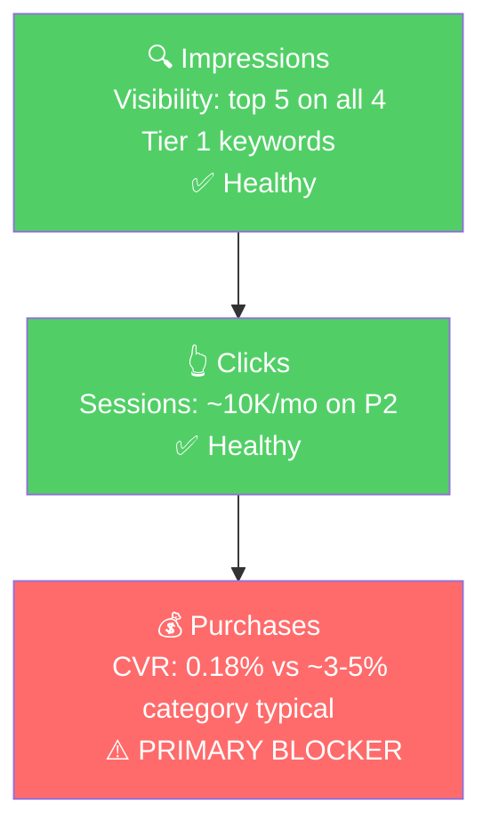

# Step 3: Keyword Analysis (via Datadive)

## Methodology Note

Search Query Performance (SQP) data is not available for GoSun (no Brand Analytics access in our system at the time of this audit). In its place, this analysis uses a Datadive niche export ([source CSV](file:///Users/aryansethi/Downloads/niche-sXThD66OH4-keywords.csv)) covering 47 keywords across 18 ASINs (5 GoSun + 13 competitors).

**What Datadive gives us (vs SQP):**
- Search volume per keyword
- Relevance % (how many of the niche's competitors rank for the term)
- Each ASIN's organic ranking position per keyword

**What we lose vs SQP:**
- True purchase volume per query (we can only estimate from SV)
- Brand-level CTR / CVR / share metrics. Datadive doesn't tell us how each brand actually converts; only where it ranks.

**Implication for blocker detection:** Without SQP funnel data, we cannot directly compute "Brand CTR vs Industry CTR" or "Brand CVR vs Industry CVR." Instead, we infer blockers from the combination of (a) ranking position in Datadive and (b) the seller-analytics CVR data per ASIN. A product that ranks well in Datadive AND gets traffic in seller-analytics AND has a low CVR has a **conversion blocker.** A product with no Datadive presence has a **visibility blocker.**

## Niche Overview

47 keywords, **30,825 monthly searches** total, split across:

| Segment | # Keywords | Total SV | Share |
|---------|-----------|---------|-------|
| English, non-branded | 25 | 24,771 | 80% |
| Spanish, non-branded | 19 | 4,750 | 15% |
| Branded (GoSun + competitor brand searches) | 3 | 1,054 | 3.5% |
| Mixed branded/competitor | 1 | 250 | 1.0% |

Category is dominated organically by **B074S74FQC (All American Sun Oven)** at #1 across nearly every English non-branded query. GoSun has a presence but rarely cracks the top 3.

## Tier Breakdown (English non-branded)

### Tier 1 (Hero) - 4 keywords, 15,556 SV/mo (50% of niche demand)

| Keyword | SV | Relev | Best GoSun Rank | #1 Competitor |
|---------|----|----|-----------------|---------------|
| solar oven | 6,578 | 0.94 | **#4** GoSun Go | All American Sun Oven |
| solar cooker | 4,903 | 0.83 | **#6** GoSun Go | All American Sun Oven |
| solar stove | 2,071 | 0.83 | **#8** GoSun Go | B08ZJNBLDX |
| solar ovens for cooking | 2,004 | 0.94 | **#2** GoSun Go | All American Sun Oven |

**Rationale:** These are the fattest head terms for the entire niche. "Solar oven" alone is 21% of total niche search volume. GoSun Go (P2) is the highest-ranking GoSun product on every Tier 1 query, but it never lands #1.

### Tier 2 (Core market) - 7 keywords, 5,715 SV/mo (18%)

| Keyword | SV | Relev | Best GoSun Rank | #1 Competitor |
|---------|----|----|-----------------|---------------|
| solar cooking stove | 1,001 | 0.33 | **#9** GoSun Go | All American |
| sun oven | 972 | 0.94 | **#5** GoSun Sport (P0) | All American |
| parabolic solar cooker | 948 | 0.33 | **#10** GoSun Go | B0C2HMMD2N |
| solar stove for cooking | 937 | 0.83 | **#9** GoSun Sport (P0) | All American |
| solar cookers | 739 | 0.39 | **#4** GoSun Go | B0B8HDY7W6 |
| solar ovens for outside | 563 | 0.61 | **#2** GoSun Go | All American |
| solar grill | 555 | 0.61 | **#2** GoSun Go | B0GKJ3R3TF |

**Rationale:** Mid-volume terms that include synonyms ("stove," "cooker," "grill") and use-case modifiers ("for cooking," "for outside"). Two notable holes: "parabolic solar cooker" (948 SV) is a different product type than GoSun's tube design. GoSun ranks #10 there but the relevance is 0.33, so most niche competitors don't rank for it either. Likely a low-conversion query for GoSun.

### Tier 3 (Long-tail / use-case) - 14 keywords, 3,500 SV/mo (11%)

Mostly portability/camping/home/synonym variants at 250 SV each. GoSun Go ranks top-10 on most of them. Notable wins: "solar oven portable" (#3 Fusion), "solar stove for camping" (#2 Go), "sun oven solar oven" (#2 Go).

### Spanish-language - 19 keywords, 4,750 SV/mo (15%)

| Keyword Cluster | Combined SV | Best GoSun Rank | Notes |
|----------------|------------|-----------------|-------|
| cocina solar / cocinas solares / cocina solar portatil / cocina solar recargable / cocina solar parabolica / cocinas solares modernas | 1,500 | #7-#11 | "Solar cooker" cluster |
| estufa solar / estufas solares / estufa solar para cocinar | 750 | #10-#12 | "Solar stove" cluster |
| horno solar / horno solar para cocinar | 500 | #8 | "Solar oven" cluster |
| fogon / fogón solar variants (incl. Cuba-specific) | 1,250 | #20-#29 | Mostly traditional Cuban stoves, not solar cookers. Low relevance |
| Other (cocina con panel solar, cosina solar, fogon solar para cuba) | 750 | mostly absent | Mixed intent |

**The Spanish cluster is a meaningful blue-ocean opportunity.** GoSun ranks 7-12 on the most relevant Spanish queries (cocina/estufa/horno solar) but is barely visible. Spanish-speaking US shoppers and Latin American buyers are an underserved market here. None of the top competitors aggressively target Spanish either, and All American Sun Oven (B074S74FQC) actually ranks #1 on most Spanish queries despite presumably not being a Spanish-language listing, meaning Amazon's algorithm is pulling its English listing for Spanish searches. A Spanish-targeted GoSun listing or campaign could capture share quickly.

### Branded - 4 keywords, 1,304 SV/mo

| Keyword | SV | Best GoSun Rank | Note |
|---------|----|-----------------|----|
| gosun | 554 | #1 (Fusion) | GoSun owns its branded query |
| gosun solar oven | 250 | #1 (Sport) | Same |
| go sun solar oven | 250 | #1 (Go) | Same |
| all american sun oven solar oven | 250 | #13 (Fusion) | Conquesting query, GoSun ranks but not aggressively |

**Branded queries are protected.** GoSun ranks #1 on its own brand searches across multiple ASINs. The "all american sun oven solar oven" query is a competitor-conquest opportunity worth a small Sponsored Brands budget once ads launch.

## GoSun Catalog Visibility Map

Across the 25 English non-branded keywords (the growth pool):

| ASIN | Product | Appearances (of 25) | Top 10 | Top 5 | Top 3 |
|------|---------|---------------------|--------|-------|-------|
| B07CJP52D6 | **GoSun Go (P2)** | 22 | 19 | **13** | **5** |
| B00KLKJB72 | GoSun Sport (P0) | 22 | 6 | 1 | 0 |
| B0DNRBHHF3 | Portable Kit (dup) | 17 | 3 | 0 | 0 |
| B0BRQY4KR4 | GoSun Go PRO | 16 | 1 | 0 | 0 |
| B07WRF6PN4 | GoSun Fusion (P3) | 15 | 5 | 1 | 1 |

**Reading this:**
- **P2 (GoSun Go) is the visibility hero of the catalog**, not P0 (Sport). It ranks in the top 5 on 13 of 25 growth keywords. This is exceptional, and yet its CVR in seller-analytics is **0.18%**, meaning a product that earns 19/25 top-10 placements is converting almost nothing.
- **P0 (Sport) shows up everywhere (22/25) but rarely high.** Sport gets brand-driven impression coverage but loses every keyword competition to GoSun Go and the broader competitor set.
- **P3 (Fusion) has the lone top-3 outside Go**, on "solar oven portable", the portability angle is a valid wedge for Fusion.
- **B0DNRBHHF3 (the duplicate listing of P1)** has no top-5 placements but appears 17 times. Its rankings are diluted by being a duplicate of B0CSWVM2W3 (P1). Consolidating these listings would compound rank for one of them.

## Market Sizing (Indicative)

Without true purchase data, we approximate:

| Tier | Monthly SV | Est. Monthly Impressions (SV × 25) | At GoSun's current best click share* | At target click share** |
|------|-----------|-----------------------------------|------------------------------------|------------------------|
| Tier 1 | 15,556 | 389K | ~5K clicks | ~12K clicks |
| Tier 2 | 5,715 | 143K | ~1.8K clicks | ~5K clicks |
| Tier 3 | 3,500 | 87K | ~1.2K clicks | ~3K clicks |
| Spanish | 4,750 | 119K | ~0.5K clicks | ~3K clicks |
| **Total non-branded** | **29,521** | **~738K** | **~8.5K clicks/mo** | **~23K clicks/mo** |

*Current click share assumption: ~1.2% blended (mix of #4-#10 placements where GoSun typically sits)
**Target click share assumption: ~3% blended (top 5 average across most growth keywords)

**Translation to revenue:**
- Today: ~8.5K clicks × current 0.5-2% blended CVR × $100 AOV = $4-17K/mo from this niche (consistent with seller-analytics actuals).
- Target (top-5 visibility + 5% CVR): ~23K clicks × 5% CVR × $100 AOV = **~$115K/mo** from this niche alone, before any expansion outside the Datadive scope.

The cap is high. The two levers are visibility (rank improvements + paid impressions) and conversion (listing fixes per Step 2).

## Blockers and Growth Path

| Tier | Primary Blocker | Why | Growth Lever |
|------|-----------------|-----|--------------|
| **Tier 1** (head terms) | **CVR on P2 (Go)** | GoSun Go ranks top 5 on all four Tier 1 keywords already. Visibility is not the issue. CVR of 0.18% on 30K monthly sessions is the issue. | **Listing fixes on P2 (Go) first** (main image, bullets, address negative review themes), then **PPC scaling** to capture additional impressions on the same keywords. Do not scale PPC before CVR is fixed; spending on a 0.2% CVR listing burns money. |
| **Tier 2** (mid-volume) | **Mixed: visibility on some, CVR on others** | Some Tier 2 keywords (sun oven, solar grill, solar ovens for outside) have GoSun in top 5 but the rest sit at #8-#10. | After P2 listing fixes, push P0 (Sport) onto Tier 2 queries via title rewrite (include "sun oven" prominently) and PPC. Sport already ranks #5 on "sun oven", small ranking pushes here are plausible. |
| **Tier 3** (long-tail) | **Visibility on portability/camping queries** | These convert better when targeted with the right ASIN. P3 (Fusion) ranks #3 on "solar oven portable", that's a winner. Many other long-tail queries are open. | Long-tail PPC campaigns. Cheap clicks, high relevance, good CVR potential. |
| **Spanish** | **Visibility / lack of localized listing** | GoSun appears at #7-#12 on the most relevant Spanish queries. No competitor is investing in this segment. | Add Spanish-language backend keywords + a Sponsored Products campaign targeting cocina solar / estufa solar / horno solar. Optionally a Spanish A+ module. Modest investment, low competition. |
| **Branded** | None, protected | GoSun ranks #1 on its branded queries. | Once paid ads launch, allocate 2-3% of budget to a branded defense campaign to prevent competitor poaching. Do not scale this beyond defense. |

## ICAP Funnel, Tier 1 (Hero), Focused on P2 (GoSun Go)

The funnel for P2 is unusual: the brand has solved the visibility problem on the highest-volume keywords (top-5 on every Tier 1 term) and has earned strong organic traffic (~10K sessions/mo on this single ASIN), but conversion drops 95% below category norms. This is a **conversion-only problem.** The fix is on the listing, not on traffic.

## Insights

- **The growth thesis for GoSun on Amazon is conversion, not visibility.** P2 (GoSun Go) already has the rankings most brands fight for. Fixing its CVR from 0.18% to even 2% (still well below industry norms for solar/outdoor in this price band) would 11x sales on that single ASIN at zero traffic cost.
- **All American Sun Oven (B074S74FQC) is the category king on Amazon**, #1 on essentially every Tier 1 and most Tier 2 keywords. GoSun is the clear #2 brand by visibility. Closing the gap means winning on listing quality and reviews, not on rank order alone.
- **Spanish-language demand is unguarded.** ~4,750 monthly searches across cocina/estufa/horno solar variants, no competitor is targeting Spanish specifically, GoSun ranks 7-12 organically already. A Spanish backend keyword push + small Sponsored Products campaign could capture this for a few hundred dollars a month in spend.
- **B0DNRBHHF3 (duplicate of P1) is fragmenting GoSun's rankings.** It appears in 17 of 25 keywords but never cracks top 5. Consolidating it into B0CSWVM2W3 (P1) would compound rank for the consolidated ASIN. This is a catalog hygiene fix that has compounding benefits across the niche.
- **P0 (Sport) is being out-ranked by its sibling P2 (Go) on every category keyword** despite Sport being the higher-revenue ASIN. Sport's revenue is from brand-name buyers; Go's revenue is from category buyers but the buyers don't convert. Reframing the go-to-market: Go should pull the category, Sport should convert the upgrade buyer once they're in the brand. Today neither part of that funnel is working efficiently.

## Things to Investigate Further

- **What are the negative review themes on P2 (GoSun Go)?** Same investigation as P0 in Step 2, but more urgent here, Go is the high-traffic listing where CVR is broken. Whatever drives the 1-2 star reviews is likely the same friction stopping conversion of high-volume Tier 1 traffic.
- **Why is P2 (Go) attracting traffic that doesn't buy?** Cross-check the Datadive top-ranking keywords for Go (solar oven, solar cooker, solar stove) against what shoppers see when they click. The mismatch may be price expectation, capacity expectation (Go is the smallest, 0.9L), or feature mismatch.

## Questions for the Seller

- "P2 (GoSun Go) ranks top 5 on every major category keyword, but we see the listing converting at 0.18%. Is there a known cookware-fit, capacity, or fulfilment issue on this product specifically?"
- "Have you ever invested in Spanish-language listings or backend keywords? Spanish queries account for ~15% of niche demand and the field is wide open on Amazon."
- "We see two listings (B0CSWVM2W3 and B0DNRBHHF3) with the same Portable Solar Oven Kit title competing in the niche. Can we consolidate or repoint one of them?"
