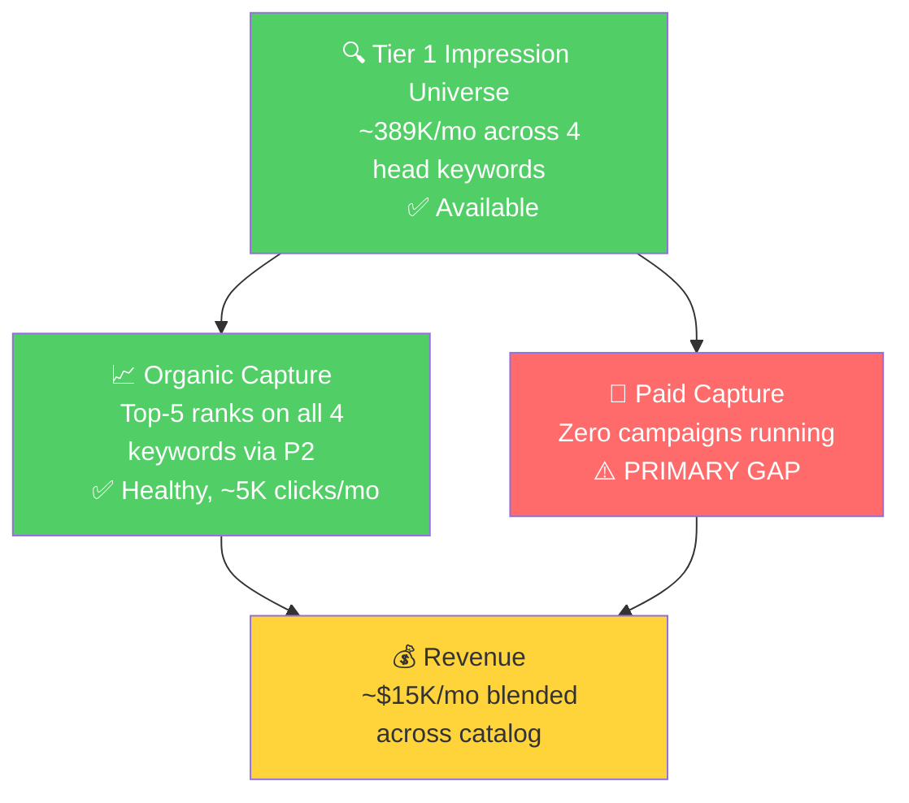

# Seller Central Audit: GoSun

## Context Notes

- **No Amazon Ads are running.** GoSun's Amazon revenue is ~$15K/mo, fully organic. Launching a structured PPC program is the single largest near-term lever in this audit.
- **No SQP (Brand Analytics) data is available.** Keyword analysis in Section 4 uses a Datadive niche export covering 47 keywords across the solar oven category. Where SQP would normally give us brand vs industry CTR/CVR, we infer blockers from organic ranking position (Datadive) plus actual session and CVR data per ASIN (seller analytics).
- **The catalog is broad but shallow on Amazon.** 23 parent ASINs are listed; 14 of them did effectively zero sales in the last 3 months. The audit focuses on the 4 active products that drive ~87% of revenue.

---

## Section 1: Catalog Assessment

| Priority | Product | 3-Mo Sales | Sessions | CVR | Buy Box % | Avg Price | Trend |
|----------|---------|-----------|----------|-----|-----------|-----------|-------|
| **P0** | GoSun Sport Solar Oven (B00KLKJB72) | $8,321 | 4,675 | 1.19% | 98.4% | ~$216 | Mixed, strong Mar surge |
| **P1** | Portable Solar Oven Kit, 1-2 Meals (B0CSWVM2W3) | $7,135 | 4,432 | 3.86% | 90.7% | ~$42 | Growing |
| **P2** | GoSun Go Portable Camping Stove (B07CJP52D6) | $5,413 | 29,771 | 0.18% | 98.6% | ~$119 | Sales growing, CVR catastrophic |
| **P3** | GoSun Fusion Solar Oven (B07WRF6PN4) | $3,312 | 3,346 | 0.41% | 98.9% | ~$356 | Mar-only spike |

**Other notable products (below P3):**
- **B0DNRBHHF3 (duplicate of P1):** $1,580 / 3 mo. Same listing title as P1. Two listings selling the same SKU is splitting traffic, ranking, and reviews. Consolidating is a quick win.
- **GoSun Go PRO (B0BRQY4KR4):** $1,299 / 3 mo, declining ($783 to $258 to $258).
- **GoSun Breeze (B0CT5DQCJH):** $790 / 3 mo, very high CVR (4-16%) on tiny session counts. Worth scaling traffic to.
- **Solar Barbecue (B082QF6WG9):** Mostly dormant, $329 in March only.
- **The cooler line, solar panels, water purifiers, tables, electric boat, accessories (14 ASINs total):** Effectively dead on Amazon. Catalog hygiene problems, not growth problems for this audit.

---

## Section 2: Qualitative Product Understanding (P0 - GoSun Sport Solar Oven)

**Product:**
- A patented tube-style solar oven that cooks 2 to 3 meals in 20 minutes by capturing sunlight through a borosilicate evacuated glass cooking tube and two foldable parabolic anodized-aluminum reflectors.
- Reaches 550°F in full sun, stays cool to the touch, completely submersible, 304 stainless steel cookware, 2-year warranty.
- Value prop: cook real food without fuel, fire, or smoke. Faster than every other solar oven (most take 1 to 3 hours).
- Purchase motivation: outdoor cooking for camping/RV/boat, off-grid living, emergency preparedness, eco-conscious novelty.

**Customer:**
- Outdoor adventurers, preppers, sustainability-minded consumers, RV/boat owners. AOV $178-$248 means an intentional, considered purchase.
- The need is to cook real meals where fire is restricted or fuel is heavy, while aligning with eco/off-grid values.

**Brand:**
- Established 10+ year DTC brand at gosun.co with broad lineup (ovens, coolers, fridges, solar tables, solar boats, panels, water purifiers, coffee makers).
- Retail distribution exists (Brookstone). Featured in Top Chef, Discovery Channel, Outside Magazine, Popular Science.
- Strong off-Amazon brand equity. The Amazon catalog is a small subset of what they actually sell.
- **Vibe:** outdoor, eco-conscious, engineering-forward. Aesthetic leans clinical/technical (clean white backgrounds, product-as-hero shots) rather than lifestyle/aspirational.

**Competitive Landscape:**

Avg market price across the top 4 competitors and GoSun's own siblings: ~$130. P0 sits at $178-$248, ~50-90% above the category midpoint, in the upper-mid premium tier.

| Competitor | ASIN | Approx Position | Notes |
|------------|------|----------------|-------|
| All American Sun Oven | B074S74FQC | #1 organic ranker on nearly every category keyword | Traditional box-style, $300+ tier, the de facto category leader |
| SunFlair / Sun Oven competitors | B07B5KX18D, B08ZJNBLDX | Consistent top-5 rankers | Lightweight fabric-based ovens, ~$50-$100, budget-to-mid tier |
| GoSun Go (sibling, P2) | B07CJP52D6 | #2-#5 on most queries | $99, smaller capacity, GoSun's actual visibility leader on Amazon |
| GoSun Sport (P0) | B00KLKJB72 | Typically #5-#15 | The premium-tier flagship in the GoSun lineup |

**Key differentiator:** GoSun Sport is the fastest solar oven on the market (20 min vs 1 to 3 hours), most compact (clamshell folds flat), safest (cool exterior). Tube/parabolic design is patented and category-distinctive.

**Listing Quality:**

**Strengths:**
- **Bullets (structure):** 5 bullets, ALLCAPS leading word, well-organized.
- **A+ Content:** Present, 5 modules, image-only (zero text words). Aligned with 2026 best practice.
- **Video assets:** 9 videos including brand, multiple influencer, and customer videos. Rare strength.
- **Brand store:** Present.
- **Image count:** 9 product images.
- **Title:** Includes brand and primary keywords, within Amazon's recommended length.

**Opportunities:**
- **Main image:** Clinical product-on-white shot with no lifestyle context. The biggest single CTR lever on the search results page. Recommend swapping to an outdoor/sunny scene with a "Cooks in 20 Minutes" badge overlay. The 20-minute speed is the strongest differentiator vs every other solar oven and the listing currently buries it in bullet 4.
- **Bullets (density):** Each bullet is 234-275 characters of run-on copy. Shoppers stop reading dense bullets above 200 characters. Recommend tightening each to allcaps benefit + 1-2 short supporting sentences (target 120-180 chars).
- **Title repeats:** "solar," "oven," "camping" each appear multiple times. Real estate could include differentiating terms like "fuel-free," "20 minutes," "550°F."
- **Rating:** 4.3 stars (209 reviews), declining trajectory (was 4.6 in 2022). 11% of reviews are 1-2 star. On a $200+ product, 4.3 is on the line where shoppers start skipping. Negative review themes need investigation and addressing in the listing.

---

## Section 3: Quantitative Product Understanding (P0)

**Annual Trend:**

| Metric | Apr 2025 | Jun 2025 (peak) | Aug 2025 (trough) | Oct 2025 | Mar 2026 |
|--------|---------|-----------------|-------------------|----------|----------|
| Total Sales | $2,358 | $4,794 | $275 | $1,631 | $4,995 |
| Sessions | 1,340 | 1,814 | 1,268 | 6,589 | 1,084 |
| CVR % | 1.12% | 1.38% | 0.16% | 0.15% | 2.58% |
| Buy Box % | 99.2% | 99.4% | 89.6% | 99.96% | 97.6% |

- The solar season for GoSun should peak in summer, but Jun 2025 was the peak and Aug 2025 cratered (sales fell 90% in a month, buy box dropped to 89.6%). Likely a stockout or pricing event. Worth confirming with the seller.
- CVR has been chronically below 1.5% across the year on a $138-$248 AOV. Mar 2026 (2.58%) is the first month above 2% in 12 months, an inflection or one-off worth watching.
- Two big session-spike-with-collapsing-CVR events (Oct 2025: 6,589 sessions at 0.15%; Feb 2026: 2,534 at 0.24%) point to low-intent traffic events that the listing did not capture.

**Rating Trajectory:** Declining. Long-term drift from 4.6 (2022) to 4.3 (Apr 2026). Gradual, not a recent cliff. Suppresses CVR on a premium-priced product.

**Sales Rank Trajectory:** Volatile, recently deteriorating. In Camping Stoves category, rank moved from #278 (mid-March 2026) to #900+ (late April 2026) over 6 weeks. Aligns with the post-March sales retreat.

---

## Section 4: Market Opportunity (Keyword Analysis via Datadive)

**Niche overview:** 47 keywords, 30,825 monthly searches total. English non-branded queries account for 80% of demand, Spanish 15%, branded 5%.

### Tier Breakdown

- **Tier 1 (Hero):** 4 keywords, 15,556 SV/mo, 50% of niche demand
  - **Keywords:** solar oven (6,578), solar cooker (4,903), solar stove (2,071), solar ovens for cooking (2,004)
  - **Rationale:** Head terms for the category. GoSun Go (P2) ranks top 5 on all four. P0 (Sport) ranks #11-#18.

- **Tier 2 (Core market):** 7 keywords, 5,715 SV/mo, 18%
  - **Keywords:** solar cooking stove, sun oven, parabolic solar cooker, solar stove for cooking, solar cookers, solar ovens for outside, solar grill
  - **Rationale:** Synonyms ("stove," "cooker," "grill") and use-case modifiers ("for cooking," "for outside"). Mixed GoSun positioning, top-5 on some, #8-#10 on others.

- **Tier 3 (Long-tail / use-case):** 14 keywords, 3,500 SV/mo, 11%
  - **Keywords:** solar oven portable, solar cooker portable, solar cooking, solar cooking devices, solar oven sun cooker, solar powered cooking devices, solar powered stove, solar powered stove for cooking, solar cooker for home, solar power stove, solar stove for camping, sun oven solar oven, solar ovens, portable camping oven
  - **Rationale:** Long-tail variants on portability and use case. Cheap, high-relevance PPC targets.

- **Spanish (untapped):** 19 keywords, 4,750 SV/mo, 15%
  - **Keywords:** cocina solar / estufa solar / horno solar variants, plus fogon solar variants. Cuba-specific terms included.
  - **Rationale:** Underserved segment. No competitor specifically targets Spanish; GoSun appears at #7-#12 organically. Wide-open opportunity.

- **Branded:** 4 keywords, 1,304 SV/mo
  - **Keywords:** gosun (554), gosun solar oven (250), go sun solar oven (250), all american sun oven solar oven (250, competitor conquest)
  - **Rationale:** GoSun ranks #1 on its own brand searches across multiple ASINs. Protected. Allocate 2-3% of paid budget to defense once ads launch.

### Catalog Visibility Map (English non-branded, 25 keywords)

| ASIN | Product | Appearances | Top 10 | Top 5 | Top 3 |
|------|---------|------------|--------|-------|-------|
| B07CJP52D6 | **GoSun Go (P2)** | 22/25 | 19 | **13** | **5** |
| B00KLKJB72 | GoSun Sport (P0) | 22/25 | 6 | 1 | 0 |
| B0DNRBHHF3 | Portable Kit (dup) | 17/25 | 3 | 0 | 0 |
| B0BRQY4KR4 | GoSun Go PRO | 16/25 | 1 | 0 | 0 |
| B07WRF6PN4 | GoSun Fusion (P3) | 15/25 | 5 | 1 | 1 |

**P2 (GoSun Go) is the visibility hero of the catalog**, with 13 top-5 and 5 top-3 placements across the growth keywords. GoSun has already won the hardest half of the Amazon battle: organic ranking on the highest-volume category keywords. The headline opportunity from here is layering paid traffic on top of these existing top-5 positions, which the account is doing zero of today. Paid impressions stack on top of organic placements rather than replacing them, so PPC scaling on Tier 1 multiplies click volume on a listing that's already winning the ranking battle.

### Market Sizing (Indicative)

| Tier | Monthly SV | Est. Monthly Impressions | Current click share* | Target click share** |
|------|-----------|--------------------------|----------------------|----------------------|
| Tier 1 | 15,556 | ~389K | ~5K clicks | ~12K clicks |
| Tier 2 | 5,715 | ~143K | ~1.8K clicks | ~5K clicks |
| Tier 3 | 3,500 | ~87K | ~1.2K clicks | ~3K clicks |
| Spanish | 4,750 | ~119K | ~0.5K clicks | ~3K clicks |
| **Total non-branded** | **29,521** | **~738K** | **~8.5K clicks/mo** | **~23K clicks/mo** |

*Current: ~1.2% blended (mix of #4-#10 placements where GoSun typically sits)
**Target: ~3% blended (top-5 average across most growth keywords)

**Revenue translation:**
- Today: ~8.5K clicks × current 0.5-2% blended CVR × $100 AOV = $4-17K/mo from this niche (matches actuals).
- Target (top-5 visibility + 5% CVR): ~23K clicks × 5% CVR × $100 AOV = **~$115K/mo** from this niche alone, before any catalog expansion outside the Datadive scope.

### Blockers and Growth Path

| Tier | Primary Blocker | Growth Lever |
|------|-----------------|--------------|
| Tier 1 | **No paid impressions** on already-healthy top-5 organic ranks | PPC scaling on the keywords GoSun Go already ranks for organically. Multiplies clicks on a winning ranking position |
| Tier 2 | Mixed: some top-5 organic, some at #8-#10, all paid-traffic absent | PPC support on Tier 2 keywords + title rewrite for P0 (Sport) to include "sun oven" / "solar grill" prominently |
| Tier 3 | Long-tail visibility + no paid traffic | Long-tail PPC campaigns. Cheap clicks, high relevance |
| Spanish | Uncontested segment, no localization or ads | Spanish backend keywords + Sponsored Products campaign on cocina/estufa/horno solar variants |
| Branded | Protected, no blocker | 2-3% of paid budget for branded defense, no scaling |

**Secondary blocker (Tier 1 specifically):** P2 (Go) converts at 0.18% on its current organic traffic, well below category norms. This means paid clicks driven to P2 in Week 1 of a PPC launch will burn budget. The listing needs a tune-up (main image, bullets, review-theme fix) before paid traffic scales, which is why Weeks 1-2 of Section 6 are ad-readiness prep, not PPC launch.

### The PPC Gap, Tier 1

GoSun has solved the hardest part of the Amazon battle: organic top-5 placements on every Tier 1 keyword. The brand is leaving roughly 12-18K additional monthly clicks on the table by not running paid traffic on top of these placements. **PPC layered on top of the existing organic foundation is the headline growth lever.** A secondary listing tune-up on P2 (Go) is needed in Weeks 1-2 to make sure paid clicks convert when campaigns turn on.

---

## Section 5: Current Ad State and Launch Plan

**Current state:** No Amazon Ads are running. Today's revenue is fully organic. GoSun has a Brand Registry and a Brand Store already in place, so the infrastructure for Sponsored Brands and Sponsored Display is ready as soon as campaigns are built.

### Why launching PPC matters here

The Datadive analysis showed that GoSun Go (P2) already ranks top-5 on every Tier 1 keyword organically, and P0 (Sport) has brand-driven coverage on 22 of 25 growth keywords. Paid impressions on the same keywords stack on top of organic placements rather than replacing them, multiplying click volume on listings that are already winning the ranking battle. Specifically:

- **Tier 1 / Tier 2 PPC unlocks 12-23K incremental clicks/month** on the existing Datadive niche, on top of the ~8.5K organic clicks GoSun gets today.
- **Branded defense (2-3% of budget)** prevents competitors from hijacking GoSun's own brand searches once ads activate in the category.
- **Spanish PPC is uncontested.** Modest spend ($300-$500/mo) on cocina/estufa/horno solar can capture an entire underserved sub-segment with no current competitor pressure.

### Launch structure (recommended)

A first-90-day Amazon Ads structure for GoSun:

| Campaign | Type | Budget Share | Target |
|----------|------|--------------|--------|
| P2 Tier 1 Exact | Sponsored Products, exact match | 30% | solar oven, solar cooker, solar stove, solar ovens for cooking |
| P2 Tier 2 Phrase | Sponsored Products, phrase | 15% | sun oven, solar cooking stove, solar grill, solar ovens for outside |
| P2 Long-tail Auto | Sponsored Products, auto | 10% | Discovery, harvest into manual |
| P0 (Sport) Brand-Aware Exact | Sponsored Products, exact | 10% | gosun sport, premium queries, "sun oven" |
| P3 (Fusion) Use-Case | Sponsored Products, exact + product | 10% | solar oven portable, hybrid solar cooker, RV/boat targeting |
| Spanish Tier | Sponsored Products, exact + phrase | 8% | cocina solar, estufa solar, horno solar variants |
| Branded Defense | Sponsored Products + Sponsored Brands | 3% | gosun, gosun solar oven, go sun |
| Competitor Conquest | Sponsored Display / Product Targeting | 8% | All American Sun Oven, SunFlair (B07B5KX18D), B08ZJNBLDX |
| Sponsored Brands | Brand banners | 6% | Tier 1 + brand discovery |

**Sequencing note:** P2 (Go) takes the largest share of the launch budget because it already ranks top-5 organically on every Tier 1 keyword. But P2 also converts at 0.18% today on its organic traffic. The Section 6 plan ships P2's main-image + bullets + review-theme fix in Weeks 1-2, before PPC scales in Week 3. This protects budget from burning on an unfixed listing while still keeping the headline launch on a 2-3 week timeline.

---

## Section 6: Account Scaling Strategy (8-Week Plan)

The account today is small (~$15K/mo) and fully organic. The headline lever is launching a structured Amazon PPC program on top of GoSun's existing top-5 organic positions. The 8-week plan sequences ad-readiness prep (Weeks 1-2), the headline PPC launch (Weeks 3-4), expansion into adjacent demand (Weeks 4-6), and scaling (Weeks 6-8).

### Weeks 1-2: Ad-Readiness Prep

Before ads turn on, the two highest-traffic listings get a tune-up and the duplicate listing is consolidated. This ensures paid clicks land on listings that convert, not on listings that burn budget.

- **P2 (GoSun Go) main image rebuild.** Replace clinical white-background image with an outdoor lifestyle shot (sunny campsite, food visible in tube, hand or person for scale). Add "Cooks in 20 Minutes" badge overlay. P2 will be the heaviest-spend ASIN in the PPC launch, so its CTR + CVR matter more than any other listing.
- **P2 (GoSun Go) bullets rewrite.** Tighten all 5 bullets to 120-180 characters each. Lead with allcaps benefit, follow with 1-2 short supporting sentences. Address the top 1 to 2 negative review themes once we know what they are (investigation item below).
- **P2 (GoSun Go) negative review investigation.** Pull the 1-2 star reviews and identify the dominant complaint. Highly likely candidates: capacity (Go is the smallest, 0.9L), weather dependence, learning curve. Address whichever is dominant in the listing copy and A+ content.
- **Listing consolidation: B0DNRBHHF3 into P1 (B0CSWVM2W3).** They share the same product title. Consolidating into the higher-CVR listing (B0CSWVM2W3 at 3.86% vs B0DNRBHHF3 at ~2%) compounds rank and reviews onto the better listing. The Amazon merge process or a redirect/discontinue can be used.
- **PPC infrastructure setup.** Build the campaign structure from Section 5 inside Amazon Ads. Bids drafted, negative keyword lists built, budgets allocated. Campaigns kept paused until Week 3.

### Weeks 3-4: PPC Launch (Headline Phase)

This is where the audit's main growth lever activates. Paid traffic layers on top of GoSun's existing top-5 organic positions across Tier 1 and Tier 2, plus structured coverage on P3, branded defense, and the long tail.

- **Launch P2 Tier 1 Exact + Tier 2 Phrase + long-tail Auto** on the keywords where Go already ranks top-5 organically. Conservative bids in week 1, watch CVR. If CVR holds above 2% after the Week 1-2 listing fixes, scale aggressively. This is the highest-impact campaign cluster in the plan.
- **Launch P3 (Fusion) Use-Case campaign.** P3 has $356 AOV and ranks #3 on "solar oven portable" already. Use-case targeting (RV, boat, off-grid) is a clean fit.
- **Launch P0 (Sport) Brand-Aware + premium-intent Exact.** Capture brand-aware buyers comparing the Sport vs other GoSun products. Smaller budget than P2 but higher-AOV traffic.
- **Launch Branded Defense.** Cheap, protective, immediate. Prevents competitors from poaching GoSun's branded queries once the brand becomes more visible in the category.
- **P0 (Sport) main image and bullets rewrite.** Same playbook as P2 but lower urgency since Sport's CVR is already ~1-2%. Same outdoor lifestyle + "20 Minutes" badge + tightened bullets approach.
- **P0 (Sport) title rewrite** to add "sun oven" prominently and trim repeated keywords. P0 already ranks #5 on "sun oven" (972 SV/mo), small ranking pushes here are plausible.

### Weeks 4-6: Spanish, Competitor Conquest, P1 Scale-up

Once the headline PPC campaigns are flowing and listings are updated, expand into adjacent demand the catalog hasn't tapped.

- **Launch Spanish Tier campaign.** Add Spanish backend keywords to P0, P2, P3 listings. Sponsored Products campaign on cocina/estufa/horno solar variants. Modest budget ($300-$500/mo). No competitor is targeting Spanish, so even small spend should claim share quickly.
- **Launch Competitor Conquest.** Sponsored Display + Product Targeting on All American Sun Oven (B074S74FQC) and the top SunFlair-style competitors. The All American listing is the category king; appearing on its product page captures shoppers in an evaluation mindset.
- **Scale P1 (B0CSWVM2W3) PPC.** P1 already converts at 3.86%, the best in the catalog. After consolidation with B0DNRBHHF3 it will have stronger reviews and rank. Open the budget on Tier 1/Tier 2 keywords for the consolidated listing.
- **Publish P0 (Sport) listing updates** (image, bullets, title, A+ refresh if needed).

### Weeks 6-8: Scale and Evaluate

By now PPC has 4-6 weeks of data, listings are updated, the consolidation has settled.

- **Scale winning campaigns** based on ROAS and TACoS data. Cut dead keywords. Shift budget toward the highest-CVR placements.
- **Evaluate dormant catalog.** The cooler line, solar panels, water purifiers, tables, electric boat (14 dead ASINs) need a strategic decision: relaunch a select few with new listings + ads, or formally deprioritize Amazon for those SKUs and keep them DTC-only.
- **Seasonal preparation.** Solar cooking peaks May to August. By Week 8 (early summer), all primary listings should be optimized and ad campaigns scaled. Plan for inventory readiness on P0, P1, P2, P3.
- **Review acquisition push.** Amazon Vine on P0 and P2 to address rating decline. Post-purchase email sequence if not already running.

---

## Section 7: Insights and Questions for the Seller

### Insights

- **Amazon PPC is the headline growth lever, and GoSun is doing zero of it today.** The brand has built strong organic visibility in the niche (P2 top-5 on every Tier 1 keyword, P0 brand-driven coverage on 22 of 25 keywords) but is leaving the entire paid-impression bucket on the table. Paid traffic stacks on top of organic placements, so PPC scaling on the keywords GoSun already ranks for is the cleanest, most deterministic path to 3-5x revenue. Indicative ceiling from the Datadive niche alone: $115K/mo at top-5 visibility + 5% blended CVR + paid traffic on top of organic, vs $15K/mo today.
- **P2 (GoSun Go) is GoSun's actual Amazon visibility leader, not P0 (Sport).** P2 ranks top-5 on 13 of 25 growth keywords; P0 ranks top-5 on 1. Today P0 has more revenue because brand-name buyers select the premium Sport at $216 AOV, but P2 captures the category-keyword traffic. This shapes the PPC launch: P2 gets the heaviest spend on Tier 1 and Tier 2 because it already ranks where the demand is.
- **P2's listing needs a tune-up before paid traffic scales.** P2 currently converts at 0.18% on its organic traffic, well below category norms. This isn't an audit-stopping problem because Section 6 sequences listing fixes (main image, bullets, negative-review-theme fix) in Weeks 1-2, before PPC scales in Week 3. But it's the reason the headline PPC launch can't start on Day 1.
- **P1 (Portable Solar Oven Kit) and B0DNRBHHF3 are duplicate listings sharing the same title.** P1 converts at 3.86%, B0DNRBHHF3 converts at 1-2%. Reviews, ranking, and ad efficiency are split across both. Consolidating into P1 before PPC launches compounds rank and reviews onto the listing that will receive the budget.
- **Spanish-language demand (4,750 SV/mo, 15% of niche) is unguarded.** No competitor specifically targets Spanish. GoSun ranks #7-#12 on Spanish queries today with no localization effort. A $300-$500/mo Sponsored Products campaign on cocina/estufa/horno solar can claim this segment cheaply once the main PPC engine is live.
- **The Amazon catalog has 14 effectively dead parent ASINs** (cooler line, solar panels, water purifiers, tables, electric boat, accessories) that get listed but produce zero meaningful revenue. Not an immediate audit focus, but represents either a Phase-2 relaunch opportunity (if the seller wants Amazon distribution for those SKUs) or a cleanup item. Worth a strategic conversation on the call.
- **All American Sun Oven (B074S74FQC) is the category king.** They rank #1 on essentially every Tier 1 keyword. GoSun is the clear #2 brand by visibility, with strong off-Amazon brand equity that hasn't yet translated to Amazon dominance. PPC + listing tune-up is the path to closing the gap.
- **Rating on P0 (Sport) is on a slow decline** (4.6 in 2022 to 4.3 in 2026). Not an emergency, but a quiet conversion drag on a $200+ premium product. Vine + a review-acquisition push is warranted in parallel with the PPC ramp.

### Questions for the Seller

- **"Have you ever run Amazon Ads on GoSun, and is there a reason you stopped or never started?"** Budget? Bad prior agency experience? Profit-margin concern? The answer shapes how aggressively we should ramp the launch and how comfortable they'll be with PPC budgets.
- **"P2 (GoSun Go) gets ~10K Amazon sessions per month and converts at 0.18%. Have you noticed this on the listing, and have you tried anything to fix it? Are there known capacity or fulfilment complaints on Go specifically?"** This is the single biggest unlock in the account; their context will accelerate the fix.
- **"P0 (Sport) sales dropped 90% in August 2025 and the buy box hit 89%. Was that a stockout, a price change, or something else?"** Tells us whether to expect a similar event in summer 2026.
- **"Two listings (B0CSWVM2W3 and B0DNRBHHF3) share the same Portable Solar Oven Kit title. Is that intentional, and which one is the primary?"** Confirms the consolidation plan.
- **"On P0 (Sport), rating has dropped from 4.6 to 4.3 over 4 years. Are you aware of any specific complaint pattern we should address in the listing or product itself?"**
- **"There are 14 parent ASINs on Amazon with effectively zero sales (coolers, solar panels, water purifiers, tables, electric boat, accessories). Are these channels you want to reactivate, or are they intentionally deprioritized in favor of DTC and retail?"**
- **"How comfortable are you investing in Spanish-language listing optimizations and a Spanish PPC campaign? It's an unguarded ~15% of the niche."**
