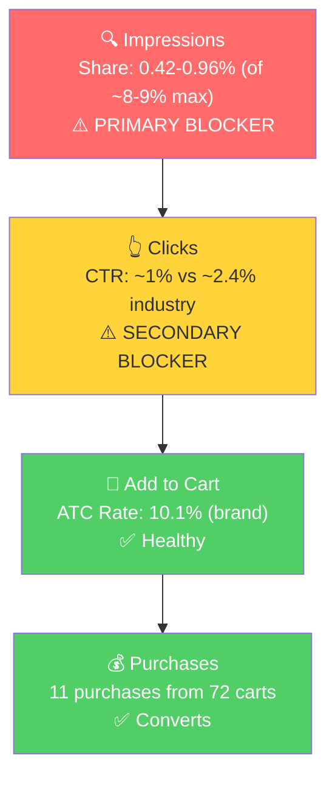

# SQP Analysis: Goal Crazy

## Tagging Rationale

**Tier 1 (Hero): Goal-specific planner and journal queries.**
Queries where the customer is searching for a goal-oriented planner or journal. Goal Crazy's product is the direct answer to this intent. The brand has its highest organic impression share here.
- goal planner, goal journal, goals journal, goal setting planner, goal setting journal, goals planner, goal tracker

**Tier 2 (Core market): Undated planner and productivity planner queries.**
Queries for the broader product type Goal Crazy competes in. The customer wants an undated or productivity planner, and Goal Crazy is one option among many (Clever Fox, Passion Planner, etc.). Larger market but more competitive.
- undated planner, undated weekly planner, undated daily planner, daily planner undated, productivity planner

**Tier 3 (Broad/adjacent): Generic planner, journal, and daily planner queries.**
Very high-volume, broad queries where Goal Crazy is one of thousands of results. The product can appear but is not the primary intent for most searchers.
- planner, daily planner, journal, weekly planner

**Branded:** "goal crazy planner" and "goal crazy 90-day undated planner & journal" (~150-250 monthly volume). Small but healthy branded search with strong conversion. Tagged separately, not analyzed as a growth tier.

## Market Sizing

12-month averages (Mar 2025 - Feb 2026), using $30 avg market price:

| Tier | Monthly Search Volume | Monthly Add to Carts (Market) | Monthly Purchases (Market) | Est. Market Size ($/mo) |
|------|----------------------|-------------------------------|---------------------------|------------------------|
| Tier 1 | 16,305 | 1,092 | 271 | $32,760 |
| Tier 2 | 67,797 | 3,882 | 864 | $116,460 |
| Tier 3 | 1,107,670 | 81,117 | 25,908 | $2,433,510 |
| **Total P0** | **1,191,772** | **86,091** | **27,043** | **$2,582,730** |

**Seasonality:** All three tiers show strong New Year seasonality. Tier 1 search volume triples from ~12K to ~42K in December. Tier 2 peaks modestly in Dec-Jan (~77-79K vs. 54-87K baseline). This matches the P0 annual trend from Step 1 where sales peaked at $5K in December. The product is definitively market-seasonal, and the Dec-Feb revenue swing is demand-driven, not a brand-specific issue.

## Market Share and Potential

3-month averages (Dec 2025 - Feb 2026):

| Tier | Impression Share | Click Share | Cart Share | Purchase Share | Trend |
|------|-----------------|-------------|------------|---------------|-------|
| Tier 1 | 0.42% | 0.11% | 0.06% | 0.09% | Declining (Feb lower than Dec) |
| Tier 2 | 0.010% | 0.006% | 0.008% | 0% | Flat (near zero) |
| Tier 3 | 0.0005% | 0.0007% | 0.0003% | 0% | Flat (invisible) |

The brand is functionally invisible across all tiers. Even on Tier 1 (goal-specific queries where the product is the most relevant), impression share is 0.42% against a theoretical max of ~8-9%. This means the brand shows up in roughly 1 out of every 2,000 impressions on its most relevant queries.

For context, the brand's ~$3K/mo in organic sales comes primarily from:
1. Branded searches ("goal crazy planner", ~200 volume, strong conversion)
2. Extremely sparse organic ranking on goal-specific queries
3. External traffic (website, podcast, social media)

The SQP data confirms there is a massive market that Goal Crazy is not participating in at all.

## Blockers & Growth Path

Aggregated all-time data provides sufficient volume for Tier 1 rate analysis (713 brand clicks, 72 cart adds, 11 purchases). Tier 2 and Tier 3 remain too thin for reliable rate comparisons.

**Tier 1 all-time brand metrics (aggregated):**

| Query | Impressions (Brand) | Clicks (Brand) | Cart Adds (Brand) | Purchases (Brand) | Imp Share | Cart Adds Share |
|-------|-------------------|---------------|------------------|-------------------|-----------|----------------|
| goal planner | 26,400 | 311 | 30 | 5 | 0.96% | 0.42% |
| goal journal | 10,100 | 158 | 21 | 1 | 1.22% | 0.85% |
| goals journal | 9,100 | 112 | 12 | 3 | 0.87% | 0.35% |
| goal setting journal | 6,600 | 53 | 4 | 0 | 0.70% | 0.15% |
| goal setting planner | 4,500 | 37 | 4 | 2 | 0.45% | 0.14% |
| goal tracker | 943 | 11 | 1 | 0 | 0.10% | 0.04% |
| goals planner | 4,700 | 31 | 0 | 0 | 0.70% | 0.00% |
| **Total Tier 1** | **62,343** | **713** | **72** | **11** | | |

**Brand ATC rate on Tier 1: 10.1%** (72/713). The product converts when it shows up on goal-specific queries. Cart adds share tracks closely with impression share (e.g., 0.96% impression share and 0.42% cart adds share on "goal planner"), confirming the product is competitive in this space. The blocker is purely visibility, not conversion.

| Tier | Impression Share | CTR (Brand vs Industry) | ATC Rate (Brand) | Primary Blocker | Growth Path |
|------|-----------------|------------------------|-----------------|-----------------|-------------|
| Tier 1 | 0.42-0.96% (of ~8-9% max) | Below industry (CTR ~1% vs ~2.4%) | 10.1% (converts well) | Impression Share | PPC scaling: product converts on these queries, just needs more visibility. Bid on goal planner/journal keywords. |
| Tier 2 | 0.010% | N/A (92 clicks, 1 purchase all-time) | Insufficient data | Impression Share | Test and learn: launch small-budget campaigns on "productivity planner" (best intent fit) and "undated planner" (biggest volume). Scale only if CVR supports it. |
| Tier 3 | 0.0005% | N/A | N/A | Impression Share | Not a priority. Too broad, weak intent match. Focus Tier 1 first. |

- **Tier 1** is the highest-ROI opportunity. The data confirms the product converts on goal-specific queries (10.1% ATC rate from 713 clicks). Even reaching 3-4% impression share (from ~0.9%) could meaningfully grow sales. This is a high-confidence PPC scaling play.
- **Tier 2** has weaker intent alignment. "Undated planner" and "productivity planner" shoppers may not be looking for a structured 90-day goal system. All-time data shows only 1 purchase from 92 clicks. Recommend testing with small budgets before committing significant spend.
- **Tier 3** is not realistically capturable. Queries are too broad, competition is overwhelming, and the product's niche positioning doesn't match general "planner" or "journal" intent.
- **CTR is a secondary blocker on Tier 1.** Brand CTR (~1%) is below industry (~2.4%). This connects to the main image opportunity from Product Understanding: showing the planner open with internal pages visible would better communicate the product's differentiation on the search results page.

*Funnel shown for Tier 1 using aggregated all-time data (713 clicks). Impression share is the clear primary blocker. CTR is a secondary blocker likely tied to the main image showing the planner closed. Once clicked, the product converts well (10.1% ATC rate).*

## Insights

- **P0 (Undated Planner) is effectively invisible in search.** Across all tiers, the brand captures less than 0.5% of impressions on even its most relevant queries. The product is generating $3K+/mo in organic sales despite near-zero search visibility, which signals strong organic demand from external sources and branded search. This means the baseline is real, and any search visibility gained through PPC will be purely additive.
- **The capturable market (Tier 1 + Tier 2) is ~$149K/mo.** Goal Crazy currently captures less than 0.1% of this. Even modest PPC investment targeting Tier 1 and Tier 2 keywords could unlock significant growth, because the product is highly relevant to these queries and has strong fundamentals (4.4 stars, 1,063 reviews, $35 price point).
- **Branded search volume is small (~200/mo) but healthy.** "Goal crazy planner" drives ~5-10 purchases per month with 10-15% CVR. This is consistent with a founder-led brand that has podcast/website traffic but hasn't invested in Amazon search visibility.

## Things to Investigate Further

- **Are ads currently targeting Tier 1 and Tier 2 keywords?** The brand started running ads in Dec 2025 ($75 ad spend). Check in Step 4 whether these ads target goal planner, undated planner, and productivity planner search terms, or if spend is going to less relevant targets.
- **CTR on Tier 1 queries.** The SQP data suggests brand CTR (0.70%) is below industry (2.27%), but the sample is too small to confirm. If the ad data in Step 4 shows a similar CTR gap on goal-relevant keywords, the main image optimization from Product Understanding becomes a higher priority (showing planner open with habit tracker rather than closed exterior).

## Questions for the Seller

(None. The SQP data is clear: the brand needs search visibility. No seller-specific context is needed to act on this.)
