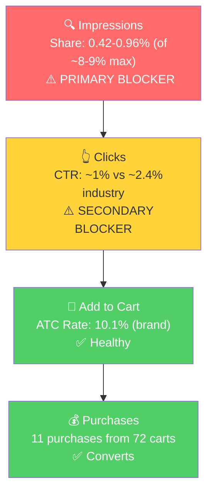

# Seller Central Audit: Goal Crazy

## Section 1: Catalog Assessment

| Priority | Product | 3-Mo Sales | 3-Mo Ad Spend | ROAS | TACoS | Organic Sales | Ad Sales % | Buy Box % | CVR | Trend |
|----------|---------|-----------|--------------|------|-------|---------------|-----------|-----------|-----|-------|
| P0 | Undated Planner 2025/2026 | $8,960 | $424 | 5.06 | 4.7% | $6,815 | 24% | 94% avg | 10.1% avg | Declining (seasonal) |

Goal Crazy is a single-product brand. The only revenue-generating product is the Undated Planner (B085TN9RTW), available in 6 color variations. Two other catalog items (Habit Cards, Undated Planner 2024/2025) are dead with $0 sales across all 3 months.

## Section 2: Qualitative Product Understanding (P0)

**Product:**
- 90-day undated guided planner and productivity journal in A5 format with PU leather hardcover
- Includes a built-in Goal Discovery Course, daily/weekly/monthly planning pages, reflection prompts, and 3 detachable habit card bookmarks
- Solves the "I want to get organized and achieve my goals but annual planners are overwhelming" problem
- Purchase motivation: desire for accountability and structured progress, often triggered by a new quarter, career transition, or feeling overwhelmed

**Customer:**
- Ambitious professionals, entrepreneurs, and students (25-45), both men and women
- People who have tried generic planners and want something more structured, with coaching built in

**Brand:**
- Registered, founder-led brand created by Jason VanDevere in 2019
- Multi-channel ecosystem: planner + Goal Discovery Course + podcast + coaching
- Website (goalcrazy.com), Instagram (@goal.crazy), Facebook, podcast on Apple/Spotify
- Brand vibe: Professional, motivational, substance-over-aesthetics. Positions as a coaching tool, not just stationery. Navy/gold color scheme. More "system for achievers" than trendy.

**Competitive Landscape:**

Price positioning: Avg mid-range goal planner ~$25-35 | P0: $34.95 | Upper end of mid-range

| Competitor | Key Product | Price | Differentiator |
|-----------|------------|-------|----------------|
| Clever Fox | Daily/Weekly Planner | $15-$39 | Strong Amazon presence, high reviews, aggressive discounting |
| BestSelf Co. | Self Journal | $15-$50 | Science-backed 13-week system, gratitude integration |
| Passion Planner | Undated Planner | $15-$35 | Design-forward, Instagram-aesthetic, strong influencer community |
| Erin Condren | LifePlanner | $35-$60+ | Premium market leader, fully customizable, 3M+ sold |

Goal Crazy's key differentiator is the integrated Goal Discovery Course and coaching ecosystem. Most competitors sell a product; Goal Crazy sells a system.

**Listing Quality:**

**Strengths:**
- 4.4 stars from 1,063 reviews (72% five-star). Strong social proof for the category.
- 5 well-structured bullets covering goal system, planning, materials, life balance, and habit cards
- Premium A+ content (7 image-only modules)
- 6 videos including seller content, influencer review, and detailed customer walkthroughs
- Brand store present

**Opportunities:**
- **Text-heavy images throughout the listing.** A+ content, gallery images, and brand story images all pack dense text into images. Shoppers scroll quickly and absorb visuals, not paragraphs baked into images. The brand owner has acknowledged this. Reworking these images to lead with visuals (product beauty shots, lifestyle usage, close-ups of premium materials) with minimal text callouts would significantly improve readability and conversion.
- **Main image shows the planner closed.** The core value proposition is the internal structure (goal discovery, habit tracker, daily pages), but the main image only shows the exterior. Showing the planner open with internal pages visible would better communicate differentiation and improve CTR.
- **Brand name missing from title** on the Black variant. Should lead with "Goal Crazy" for branded search discoverability.
- **Single lifestyle image.** Only one lifestyle shot (likely the founder). Adding diverse lifestyle imagery would strengthen emotional connection.

## Section 3: Quantitative Product Understanding (P0)

**Annual Trend:**

| Metric | Mar 2025 | Jun 2025 | Sep 2025 | Dec 2025 (Peak) | Jan 2026 | Feb 2026 |
|--------|----------|----------|----------|----------------|----------|----------|
| Total Sales | $3,509 | $3,495 | $3,727 | $5,008 | $2,868 | $1,083 |
| Sessions | 1,343 | 1,095 | 1,318 | 1,162 | 1,241 | 412 |
| CVR | 9.0% | 9.1% | 9.5% | 17.3% | 8.1% | 7.5% |
| Buy Box % | 99.6% | 99.6% | 83.0% | 100.0% | 83.2% | 100.0% |

- **Strong December peak** ($5K, 17.3% CVR) confirms New Year seasonality for the planner category. SQP data shows the same pattern: Tier 1 search volume triples in December.
- **Consistent organic base of $2.5-3.7K/mo through Mar-Nov 2025 with zero ad spend.** The product has genuine organic demand. Ads only started in December 2025.
- **Buy box instability:** Dropped from ~100% to ~83% starting August 2025, toggling since. When buy box is at 83%, roughly 1 in 6 sessions is lost to another seller.

**Rating Trajectory:** Slowly declining. 4.7 (2020) to 4.4 (2026). Gradual erosion, still competitive for the category.

**Sales Rank Trajectory:** Seasonal with recent improvement. Currently ~1,700-2,100 in the Planners subcategory, improving from ~2,500-2,900 in early February. Respectable rank even in the low season.

## Section 4: Market Opportunity (SQP)

**Tier Breakdown:**

- **Tier 1 (Hero):**
  - **Keywords:** goal planner, goal journal, goals journal, goal setting planner, goal setting journal, goals planner, goal tracker
  - **Rationale:** Queries where the customer is searching for a goal-oriented planner or journal. Goal Crazy's product is the direct answer to this intent.

- **Tier 2 (Core market):**
  - **Keywords:** undated planner, undated weekly planner, undated daily planner, daily planner undated, productivity planner
  - **Rationale:** Queries for the broader product type Goal Crazy competes in. The customer wants an undated or productivity planner. Larger market, more competition.

- **Tier 3 (Broad/adjacent):**
  - **Keywords:** planner, daily planner, journal, weekly planner
  - **Rationale:** Very high-volume, generic queries. Goal Crazy is one of thousands of results. Not a primary growth target.

**Market Sizing:**

| Tier | Monthly Search Volume | Monthly Add to Carts (Market) | Monthly Purchases (Market) | Est. Market Size ($/mo) |
|------|----------------------|-------------------------------|---------------------------|------------------------|
| Tier 1 | 16,305 | 1,092 | 271 | $32,760 |
| Tier 2 | 67,797 | 3,882 | 864 | $116,460 |
| Tier 3 | 1,107,670 | 81,117 | 25,908 | $2,433,510 |
| **Total P0** | **1,191,772** | **86,091** | **27,043** | **$2,582,730** |

**Blockers & Growth Path:**

| Tier | Impression Share | CTR (Brand vs Industry) | ATC Rate (Brand) | Primary Blocker | Growth Path |
|------|-----------------|------------------------|-----------------|-----------------|-------------|
| Tier 1 | 0.42-0.96% (of ~8-9% max) | ~1% vs ~2.4% | 10.1% (converts well) | Impression Share | PPC scaling: product converts on these queries (10.1% ATC rate from 713 clicks). Bid on goal planner/journal keywords. High confidence. |
| Tier 2 | 0.010% | N/A (92 clicks all-time) | Insufficient (1 purchase all-time) | Impression Share | Test and learn: launch small budgets on "productivity planner" and "undated planner." Scale only if CVR supports it. |
| Tier 3 | 0.0005% | N/A | N/A | Impression Share | Not a priority. Too broad, weak intent match. |

**ICAP Funnel (Tier 1, highest growth potential):**

- **Tier 1 is a confirmed, high-confidence opportunity.** All-time data (713 brand clicks, 72 cart adds, 11 purchases) proves the product converts on goal-specific queries at a 10.1% ATC rate. The blocker is purely visibility (0.42-0.96% impression share), not conversion.
- **Tier 2 relevance is uncertain.** The product is technically an undated planner, but the structured 90-day goal system may not match the intent of generic "undated planner" shoppers. Only 1 purchase from 92 clicks all-time. Recommend testing with small budgets before scaling.
- **CTR is a secondary blocker on Tier 1** (~1% brand vs ~2.4% industry). This ties directly to the main image opportunity: showing the planner open would better communicate differentiation on the search results page.

## Section 5: Ad Analysis

### Campaign Structure

**Finding: Zero non-branded manual campaigns exist.**

**Problem:**
- The account has only 3 campaigns. The only manual campaign ("Branded KWs") targets branded keywords exclusively. There are NO campaigns targeting Tier 1 or Tier 2 keywords.
- Total spend on Tier 1 + Tier 2 keywords over 90 days: $8.65 (22 clicks, 0 orders), all from incidental auto campaign traffic.
- This is the direct cause of the 0.42% impression share on Tier 1 and 0.01% on Tier 2.

**Solution:**
- Launch dedicated manual campaigns for Tier 1 keywords (goal planner, goal journal, goal setting planner, etc.)
- Launch dedicated manual campaigns for Tier 2 keywords (undated planner, productivity planner, etc.)
- 3-5 keywords per campaign, exact and phrase match

**Impact:**
- The entire Tier 1 ($33K/mo) and Tier 2 ($116K/mo) markets are currently untapped. Even capturing 2-3% purchase share on Tier 1 would represent meaningful revenue growth.

### Auto vs Manual Split

| Targeting Type | Clicks | Spend | Sales | ROAS | AOV | CPC | CVR |
|----------------|--------|-------|-------|------|-----|-----|-----|
| Automatic | 726 | $265.08 | $365.40 | 1.38 | $33.22 | $0.37 | 1.52% |
| Manual | 239 | $238.17 | $2,234.40 | 9.38 | $32.38 | $1.00 | 28.87% |

Manual outperforms auto by 6.8x on ROAS, but manual is 100% branded keywords. The comparison is misleading. Auto is the only non-branded channel and it's unprofitable (1.38 ROAS). The harvest-and-scale loop isn't happening: auto finds search terms, but no one extracts winners into manual campaigns.

### Campaign Profitability

| Campaign | Spend | Sales | ROAS | Clicks | Orders |
|----------|-------|-------|------|--------|--------|
| Booster All ASINs (Auto) | $265.08 | $365.40 | 1.38 | 726 | 11 |
| Pro all (Manual) | $21.44 | $0.00 | 0.00 | 10 | 0 |
| **Total unprofitable** | **$286.52** | | | | |

**Problem:** 57% of total spend ($287 of $503) goes to unprofitable campaigns.

**Solution:** Pause "Pro all" immediately. Optimize auto by negating branded terms and irrelevant search terms. Reallocate freed budget to new non-branded manual campaigns.

**Impact:** $287 reallocated at a conservative 3-4x ROAS on non-branded campaigns would generate $860-$1,148 in sales vs. the current $365. Net improvement: $495-$783 in additional sales from the same budget.

### Targeting Strategy

**Keyword vs Product Targeting:**

| Targeting Strategy | Clicks | Spend | Sales | ROAS | AOV | CPC | CVR |
|-------------------|--------|-------|-------|------|-----|-----|-----|
| Keyword Targeting | 928 | $491.50 | $2,570.85 | 5.23 | $32.54 | $0.53 | 8.51% |
| Product Targeting | 37 | $11.75 | $28.95 | 2.46 | $28.95 | $0.32 | 2.70% |

98% keyword-driven. Product targeting is negligible.

**Match Type Breakdown:**

| Match Type | Clicks | Spend | Sales | ROAS | AOV | CPC | CVR |
|------------|--------|-------|-------|------|-----|-----|-----|
| EXACT | 182 | $143.13 | $1,613.40 | 11.27 | $32.93 | $0.79 | 26.92% |
| PHRASE | 57 | $95.04 | $621.00 | 6.53 | $31.05 | $1.67 | 35.09% |

Both match types perform well, but this is entirely branded keywords. No BROAD match campaigns exist, meaning no keyword discovery is happening through manual campaigns.

### P0 Campaign Map

| Campaign | Spend | Sales | ROAS | Clicks | Orders |
|----------|-------|-------|------|--------|--------|
| Branded KWs | $216.73 | $2,234.40 | 10.31 | 229 | 69 |
| Booster All ASINs | $265.08 | $365.40 | 1.38 | 726 | 11 |
| Pro all | $21.44 | $0.00 | 0.00 | 10 | 0 |
| **Total** | **$503.25** | **$2,599.80** | **5.17** | **965** | **80** |

100% of ad spend is on P0 (single-product brand).

### Impression Share Blocker: No Targeted Spend on Tier 1/2 Keywords

Section 4 identified impression share as the primary blocker (0.42% on Tier 1, 0.01% on Tier 2). The PPC lever is bidding on the keywords where impression share is low. Here's what the ad data shows:

| Search Term | Tier | Spend (90 days) | Sales | Clicks | Orders |
|-------------|------|-----------------|-------|--------|--------|
| goal planner | Tier 1 | $2.43 | $0 | 6 | 0 |
| goal journal | Tier 1 | $0.41 | $0 | 1 | 0 |
| goal setting planner | Tier 1 | $0.41 | $0 | 1 | 0 |
| undated daily planner | Tier 2 | $2.05 | $0 | 5 | 0 |
| productivity planner 2026 | Tier 2 | $1.23 | $0 | 3 | 0 |
| undated planner | Tier 2 | $0.82 | $0 | 2 | 0 |
| **Total** | | **$8.65** | **$0** | **22** | **0** |

$8.65 total spend on Tier 1 + Tier 2 keywords over 90 days. All incidental auto traffic, not intentional targeting. 22 clicks is far too few to assess conversion potential. This confirms the SQP finding: the brand is not participating in its own market through PPC.

### Placement Opportunity

| Placement | Spend | Sales | ROAS | CTR | CVR |
|-----------|-------|-------|------|-----|-----|
| Top of Search | $155.41 | $1,955.85 | 12.59 | 13.14% | 22.99% |
| Rest of Search | $198.28 | $516.15 | 2.60 | 1.37% | 3.65% |
| Product Pages | $145.34 | $127.80 | 0.88 | 0.26% | 1.58% |

Top of Search dominates at 12.59 ROAS, 13% CTR, 23% CVR (heavily influenced by branded traffic). Product Pages is unprofitable (0.88 ROAS). New non-branded campaigns should launch with high Top of Search bid modifiers.

## Section 6: Action Plan

The primary blocker is impression share. The brand has zero presence on its market keywords through PPC. The first actions focus on launching targeted campaigns to fix this.

### Weeks 1-2: Immediate Actions (PPC Foundation)

- **Launch Tier 1 manual campaigns.** Create 2 campaigns targeting goal planner, goal journal, goal setting planner, goal setting journal, goals journal. Use exact + phrase match, 3-5 keywords per campaign, with high Top of Search bid modifiers (given the 12.59 ROAS on Top of Search placement).
- **Pause "Pro all" campaign.** $21 wasted on branded misspellings the phrase match in "Branded KWs" already covers.
- **Optimize auto campaign.** Negate branded terms (already handled by manual), negate clearly irrelevant search terms, reduce budget to $2-3/day as a discovery-only channel.
- **Keep "Branded KWs" running.** At 10.31 ROAS, this is a well-functioning branded defense campaign. No changes needed. Budget is appropriately small.

### Weeks 2-4: Short-Term Optimizations

- **Test Tier 2 keywords with small budgets.** Launch test campaigns for "productivity planner" (best intent fit) and "undated planner" (biggest volume). Conservative bids, $5-10/day. The goal is to collect enough clicks (50+) to assess whether the product converts on these broader queries before committing real budget. Scale only if CVR supports it.
- **Harvest auto campaign winners.** Review search terms from auto that generate conversions. Move winners into dedicated manual campaigns and negate from auto.
- **Begin listing content preparation.** Commission new images with reduced text-to-image ratios for A+, gallery, and brand story. Design a new main image showing the planner open with internal pages visible.
- **Add brand name to title** on variants missing it (quick fix, immediate SEO benefit for branded search).

### Weeks 4-6: Medium-Term Growth

- **Publish listing improvements.** New A+ content images, updated gallery with more lifestyle shots, brand story refresh. Monitor CVR impact week-over-week.
- **Scale Tier 1 campaigns** based on performance data from Weeks 1-4. Increase budgets on keywords with healthy ROAS. The goal is to push impression share on Tier 1 from 0.42% toward 3-5%.
- **Evaluate Tier 2 performance.** Tier 2 keywords (undated planner, productivity planner) face stiffer competition. Assess ROAS and CVR after 4 weeks of data. Scale winners, pause underperformers.

### Weeks 6-8: Scaling and Evaluation

- **Scale PPC on the improved listing.** With better images and A+ content, CVR should improve, making PPC more efficient. Increase budgets on proven keywords.
- **Launch broad match discovery campaign** on Tier 1/Tier 2 seed keywords to find long-tail variations that convert.
- **Evaluate buy box stability.** If buy box remains at 83% on some weeks, this remains a constraint that limits the ROI of any traffic increase. Flag for ongoing monitoring.
- **Prepare for seasonal ramp.** Planner demand builds from October and peaks in December. By Week 8 (late May), the foundation should be set for a strong Q4 push.

## Section 7: Insights & Questions for the Seller

**Insights:**

- **P0 (Undated Planner) generates $3K+/mo organically with zero search visibility.** The product has genuine demand from external channels (website, podcast, social). Any Amazon search visibility gained through PPC is purely additive, not cannibalistic. This is the strongest possible foundation for PPC scaling.
- **P0 (Undated Planner) has zero PPC presence on its market keywords.** Over 90 days, only $8.65 in ad spend reached Tier 1/Tier 2 search terms. The entire capturable market ($149K/mo across Tier 1 + Tier 2) is untapped. This is the single largest growth lever.
- **P0 (Undated Planner) converts well across the board.** 30% CVR on branded search, 23% in Top of Search placement, and 10.1% ATC rate on Tier 1 goal-specific queries (from 713 clicks all-time). The problem is purely visibility, not product-market fit or listing quality.
- **57% of ad spend ($287 of $503) goes to unprofitable campaigns.** The auto campaign burns $265 at 1.38 ROAS and "Pro all" wastes $21 at 0 ROAS. Reallocating this to targeted non-branded campaigns at even 3x ROAS would generate $860+ in sales vs. the current $365.
- **Listing images are text-heavy across A+, gallery, and brand story.** The brand owner has already acknowledged this. Reworking images to be visual-first with minimal text overlays would improve conversion, making PPC spend more efficient.

**Questions for the Seller:**

- **What changed in August 2025 that caused buy box to drop from ~100% to ~83%?** Was a new seller authorized, or did an unauthorized reseller appear? The buy box has been unstable since, directly suppressing CVR and sales.
- **Has the brand intentionally avoided non-branded keyword targeting, or is this a knowledge/resource gap?** The account structure suggests someone who set up basics (branded campaign + auto) but never built non-branded manual campaigns. Understanding whether this was deliberate (budget constraints, fear of low ROAS) or simply never attempted will help frame the engagement.
