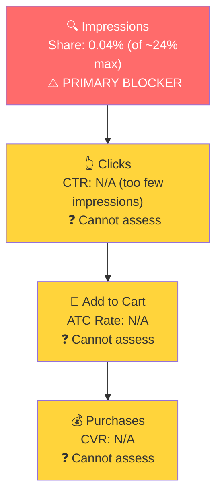

# SQP Analysis: P0 - Collagen Peptides Powder

## Tagging Rationale

**Tier 1 (Hero):** Queries where the customer is searching for exactly a multi-collagen peptides powder. P0's formula (Types I, II, III, V, X from bovine, marine, chicken) is the direct answer.
- multi collagen peptides (~45K/mo)
- multi collagen peptides powder
- multi collagen protein powder

**Tier 2 (Core market):** General collagen peptides and collagen powder queries. P0 competes alongside single-source collagen products (Vital Proteins, Sports Research) and other multi-collagen brands. Broader competitive set, same buyer need.
- collagen peptides (~550K/mo)
- collagen powder (~150K/mo)
- collagen peptides powder (~80K/mo)
- collagen for women
- collagen powder for women
- hydrolyzed collagen powder

**Tier 3 (Broad):** Single-word "collagen" and generic supplement queries. Extremely broad, includes gummies, capsules, liquids, creams. P0 is one of hundreds of product types in these results.
- collagen (~550K/mo)
- collagen supplements
- collagen for hair skin and nails
- best collagen powder

**Branded search:** "Healthy living" and "healthy living proteins" have negligible volume (~700-1,500/mo combined) and are not truly branded terms. "Healthy living" is a generic lifestyle phrase. The brand has no meaningful branded search presence on Amazon.

### Catalog Overlap Check

**Tier 1:** 3 products could rank (P0 Collagen Peptides Powder, P1 Multi Collagen Supplement, Multi Collagen with Creatine). Adjusted impression share cap: ~24-27%.

**Tier 2:** Up to 5 products could rank (all 3 collagen powders plus Bovine Collagen and Marine Collagen). Adjusted cap: ~40%+.

**Tier 3:** Same products, even broader. Adjusted cap: ~40%+.

In practice, the caps are irrelevant because impression share is near 0% across all tiers.

## Market Sizing

| Tier | Monthly Search Volume | Monthly Add to Carts (Market) | Monthly Purchases (Market) | Est. Market Size ($/mo) |
|------|----------------------|-------------------------------|---------------------------|------------------------|
| Tier 1 | ~44,000 | ~8,100 | ~2,500 | ~$284,000 |
| Tier 2 | ~856,000 | ~154,000 | ~65,000 | ~$5,390,000 |
| Tier 3 | ~557,000 | ~88,000 | ~35,300 | ~$3,080,000 |
| **Total P0** | **~1,457,000** | **~250,100** | **~102,800** | **~$8,754,000** |

*Estimated using $35 avg product price based on competitive landscape analysis (Micro Ingredients ~$35/lb, HLP ~$37/lb, market range $27-40/lb).*

The collagen supplement market on Amazon is massive. Even Tier 1 alone (multi-collagen specific queries) represents a $284K/month market. The total addressable market for P0 across all tiers exceeds $8.7M/month.

## Market Share and Potential

| Tier | Impression Share | Click Share | Cart Share | Purchase Share | Trend |
|------|-----------------|-------------|------------|---------------|-------|
| Tier 1 | 0.04% | 0.01% | ~0% | ~0.01% | Flat (near zero) |
| Tier 2 | ~0.001% | ~0.0004% | ~0.0005% | ~0.0006% | Flat (near zero) |
| Tier 3 | ~0.003% | ~0.001% | ~0.001% | ~0.002% | Flat (near zero) |

**Key observation:** HLP has effectively zero market share across every tier. The brand does not exist in Amazon search results for collagen queries. Current impression share on Tier 1 (the most relevant queries) is 0.04%, against an adjusted cap of ~24-27%. On Tier 2 and Tier 3, shares are even lower.

This is not a CTR or CVR problem. This is a visibility problem. The brand cannot convert traffic it doesn't get.

**Why is impression share so low?**
1. **Zero PPC:** No ad spend means no sponsored placements. The brand relies entirely on organic ranking.
2. **Low review count (121):** Amazon's organic algorithm favors products with thousands of reviews. Competitors have 10,000-80,000+ reviews.
3. **Buy box suppression on hero ASIN:** B07VMJ4PQS has 1-3% buy box. Amazon may deprioritize a listing where the brand owner doesn't hold the buy box in organic search results.

## Blockers & Growth Path

| Tier | Impression Share | CTR (Brand vs Industry) | CVR (Brand vs Industry) | Primary Blocker | Growth Path |
|------|-----------------|------------------------|------------------------|-----------------|-------------|
| Tier 1 | 0.04% (of ~24% max) | N/A (7 clicks, not significant) | N/A (1 purchase, not significant) | Impression Share | PPC scaling after buy box fix. Brand converts when visible but simply doesn't show up. |
| Tier 2 | ~0.001% (of ~40% max) | N/A (5 clicks, not significant) | N/A (1 purchase, not significant) | Impression Share | Same as Tier 1. Scale PPC on these queries once Tier 1 is established. |
| Tier 3 | ~0.003% (of ~40% max) | N/A (9 clicks, not significant) | N/A (3 purchases, not significant) | Impression Share | Deprioritize. Too broad with too much competition. Focus on Tier 1 and Tier 2 first. |

- CTR and CVR cannot be assessed because HLP gets fewer than 10 brand clicks per month across all tiers combined. There is simply no data to judge whether the listing converts well, because nobody sees it.
- The growth path for all tiers is the same: gain visibility through PPC. But this has a critical prerequisite (see Insights below).

*Funnel shown for Tier 1 (highest growth potential relative to market size). The entire funnel is blocked at the top: the brand gets virtually no impressions, so nothing downstream can be measured.*

## Insights

- **The $8.7M/month collagen market is completely untapped by HLP.** The brand has near-zero presence across all search tiers. This is both the biggest problem and the biggest opportunity. Even capturing 1% of Tier 1 alone would represent ~$2,800/month in additional revenue, roughly doubling current P0 sales.
- **PPC cannot be launched until the buy box is fixed on B07VMJ4PQS.** This is critical. If HLP bids on "multi collagen peptides" and wins an ad placement, the click sends the customer to a product page where the distributor holds the buy box. The customer would likely buy from the distributor, not HLP, making every PPC click wasted spend. The buy box recapture on the hero ASIN is the prerequisite for any PPC strategy.
- **Branded search volume is negligible.** "Healthy living proteins" does not register as a meaningful search term. This means the brand has very little brand recognition on Amazon. The current $1,000+/month in P0 sales is being driven by organic ranking (however low) and potentially repeat/DTC-referred customers, not by brand-aware shoppers searching for HLP by name.

## Things to Investigate Further

- **Check whether PPC on the smaller variants (Unflavored 10oz, Chocolate, Vanilla) is viable now.** These variants have 75-95% buy box. If PPC could drive traffic to these variants while the hero ASIN's buy box is being resolved, it would be a way to start gaining visibility without wasting spend on the distributor-dominated listing.

## Questions for the Seller

- **Do you have customers who find you through your website and then buy on Amazon?** With near-zero search visibility but still ~$1,000/month in P0 sales, the traffic must be coming from somewhere outside of Amazon search (direct URL, DTC website link, social media, word of mouth). Understanding the traffic source helps estimate how much of current revenue is at risk if the distributor issue is not resolved.
