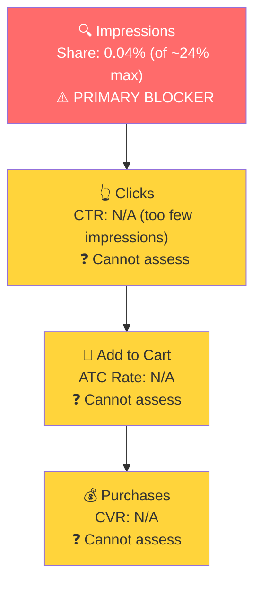

# Seller Central Audit: Healthy Living Proteins L.L.C.

## Section 1: Catalog Assessment

| Priority | Product | 3-Mo Sales | 3-Mo Ad Spend | ROAS | TACoS | Organic Sales | Ad Sales % | Buy Box % | CVR | Trend |
|----------|---------|-----------|--------------|------|-------|---------------|-----------|-----------|-----|-------|
| P0 | Collagen Peptides Powder | $3,254 | $0 | N/A | 0% | $3,254 (100%) | 0% | 66-71% | 10-16% | Growing |
| P1 | Multi Collagen Supplement | $1,200 | $0 | N/A | 0% | $1,200 (100%) | 0% | 92-100% | 14-28% | Growing |
| P2 | Hydrolyzed Bovine Collagen | $867 | $0 | N/A | 0% | $867 (100%) | 0% | 60-97% | 12-15% | Declining |
| P3 | Grass Fed Colostrum Powder | $240 | $0 | N/A | 0% | $240 (100%) | 0% | 47-100% | 8-13% | Declining |

**Not prioritized:** Multi Collagen with Creatine ($120, too new), Laundry Detergent Sheets ($49, non-core), Marine Collagen Peptides ($70, effectively dead), Teeth Whitening Powder ($14, dead).

**Key note:** This account runs zero advertising. All $5,800+ in quarterly revenue is 100% organic. The entire catalog is collagen-focused with two non-core outliers (laundry sheets, teeth whitening).

## Section 2: Qualitative Product Understanding (P0)

**Product:**
- Multi-source hydrolyzed collagen peptides powder (Types I, II, III, V, X), unflavored, 1 pound, 41 servings at 22g protein per serving
- Three protein sources: grass-fed bovine (Argentina), wild-caught marine fish, free-range chicken. This multi-source formula covers all five collagen types, a genuine differentiator vs single-source competitors.
- Solves collagen depletion that accelerates with age, supporting skin, joints, hair/nails, gut health, and bones
- Customers buy it because it replaces 2-3 single-source supplements with one product. Unflavored format blends into coffee/smoothies without changing taste.

**Customer:**
- Health-conscious adults 30-55, skewing female, focused on anti-aging and joint health
- Secondary audience: keto/paleo dieters (product is keto/paleo friendly)

**Brand:**
- Registered brand with Amazon Brand Store. "HLP Healthy Living Proteins LLC," Florida-based.
- Amazon-native with a DTC website (healthylivingproteins.com, Wix-based, professional but basic). No visible social media.
- Brand vibe: warm and approachable, gold/rose color palette, wellness-focused without being clinical.

**Competitive Landscape:**

Price positioning: Avg multi-collagen 1lb: ~$32-35 | P0: ~$37-40 | 10-15% above average

| Competitor | Product | Price (1 lb) | Rating | Reviews | Key Differentiator |
|-----------|---------|-------------|--------|---------|-------------------|
| Micro Ingredients | Multi Collagen + Biotin/HA/VitC | ~$35 | 4.5 | 10,000+ | Added biotin, HA, vitamin C. Massive review count. |
| Vital Proteins | Collagen Peptides (Bovine only) | ~$27 (20oz) | 4.6 | 80,000+ | Category leader. Single-source only. |
| Ancient Nutrition | Multi Collagen Protein | ~$40 | 4.5 | 20,000+ | Premium positioning, fermented. |
| Sports Research | Collagen Peptides (Bovine only) | ~$28 | 4.7 | 50,000+ | Organic certified, single source. |

HLP's multi-source formula is a real differentiator, but the review gap (121 vs 10,000-80,000) makes it nearly impossible to win on trust signals in search results.

**Listing Quality:**

**Strengths:**
- 4.5 star rating from 121 reviews (76% five-star). Healthy and improving.
- 7 images with lifestyle shots and back-of-pack. Main image has strong shelf presence.
- 4 videos including 2 seller-produced and 1 customer testimonial. Above average for the category.
- Subscribe & Save eligible. Brand Store present.

**Opportunities:**
- A+ content is minimal (2 modules, 2 images). Competitors have 5-7 modules. Missing: sourcing story module, multi-source vs single-source comparison, FAQ/trust module.
- Bullets are dense walls of text (avg 291 chars, readability score 32). No allcaps benefit leads. Mobile shoppers will skip these.

## Section 3: Quantitative Product Understanding (P0)

**Annual Trend:**

| Metric | Apr 2025 | Aug 2025 | Dec 2025 | Mar 2026 |
|--------|----------|----------|----------|----------|
| Total Sales | $1,843 | $1,532 | $847 | $1,320 |
| Sessions | 205 | 298 | 179 | 225 |
| CVR | 25.4% | 14.1% | 12.3% | 15.6% |
| Buy Box % | 76.3% | 93.0% | 63.1% | 71.4% |

- Sales declined 54% from peak ($1,843 in Apr 2025) to trough ($847 in Dec 2025), then recovered to $1,320 in Mar 2026. The decline tracks directly with buy box degradation.
- August 2025 was the only month with healthy buy box (93%) and was one of the strongest sales months ($1,532). When buy box dropped to 63% in December, sales hit their lowest point.

**Rating Trajectory:** Improving. Climbed from 4.3 to 4.5 over 2025, stable since Jul 2025.

**Sales Rank Trajectory:** Gradually declining. Collagen subcategory rank drifted from avg ~900 (mid-2025) to ~1,170 (Apr 2026), tracking with buy box deterioration.

## Section 4: Market Opportunity (SQP)

**Tier Breakdown:**

- **Tier 1 (Hero):**
  - **Keywords:** multi collagen peptides, multi collagen peptides powder, multi collagen protein powder
  - **Rationale:** Exact product type searches. P0's five-type, three-source formula is the direct answer. This is where HLP must win first.

- **Tier 2 (Core market):**
  - **Keywords:** collagen peptides, collagen powder, collagen peptides powder, collagen for women, collagen powder for women, hydrolyzed collagen powder
  - **Rationale:** General collagen queries where P0 competes alongside single-source products and other multi-collagen brands. Much larger market but broader competitive set.

- **Tier 3 (Broad/adjacent):**
  - **Keywords:** collagen, collagen supplements, collagen for hair skin and nails, best collagen powder
  - **Rationale:** Very broad queries including gummies, capsules, liquids, and creams. P0 is one of hundreds of results.

**Market Sizing:**

| Tier | Monthly Search Volume | Monthly Add to Carts (Market) | Monthly Purchases (Market) | Est. Market Size ($/mo) |
|------|----------------------|-------------------------------|---------------------------|------------------------|
| Tier 1 | ~44,000 | ~8,100 | ~2,500 | ~$284,000 |
| Tier 2 | ~856,000 | ~154,000 | ~65,000 | ~$5,390,000 |
| Tier 3 | ~557,000 | ~88,000 | ~35,300 | ~$3,080,000 |
| **Total P0** | **~1,457,000** | **~250,100** | **~102,800** | **~$8,754,000** |

*Estimated using $35 avg product price based on competitive landscape analysis.*

**Blockers & Growth Path:**

| Tier | Impression Share | CTR (Brand vs Industry) | CVR (Brand vs Industry) | Primary Blocker | Growth Path |
|------|-----------------|------------------------|------------------------|-----------------|-------------|
| Tier 1 | 0.04% (of ~24% max) | N/A (too few clicks) | N/A (too few clicks) | Impression Share | PPC scaling once buy box is fixed |
| Tier 2 | ~0.001% (of ~40% max) | N/A | N/A | Impression Share | Scale PPC after Tier 1 is established |
| Tier 3 | ~0.003% (of ~40% max) | N/A | N/A | Impression Share | Deprioritize. Focus Tier 1/2 first. |

HLP has essentially zero share across every tier. CTR and CVR cannot be assessed because the brand gets fewer than 10 clicks per month total across all collagen queries. This is not a conversion problem or a listing problem at this stage. It is purely a visibility problem.

**ICAP Funnel (Tier 1):**

- The brand has no branded search volume. "Healthy living proteins" does not register as a meaningful search term on Amazon.
- Despite near-zero search visibility, P0 still generates $1,000+/month. This revenue comes from customers finding the listing through means other than Amazon search (direct URL, DTC site referrals, repeat customers, or organic ranking on very long-tail queries not captured in SQP).

## Section 5: Ad Analysis

This seller runs zero Amazon PPC. There are no campaigns to analyze. The standard ad analysis (campaign structure, auto/manual split, profitability, targeting) does not apply.

**The absence of advertising is itself the finding.** HLP competes in an $8.7M/month market against brands spending tens of thousands per month on PPC, with zero ad investment. Combined with only 121 reviews vs competitors' 10,000-80,000, the brand has no path to gaining search visibility through organic ranking alone.

### Buy Box as a Growth Lever

**Finding: Recapturing the buy box on B07VMJ4PQS unlocks immediate revenue**

**Problem:**
- The hero child ASIN (Unflavored, 1 Pound) has 1-3% buy box. A distributor with a lower price holds the buy box.
- This ASIN receives 130-158 sessions/month (60-70% of all P0 traffic)
- Despite only 1-3% buy box, HLP still generates $640/month from this variant. Customers are actively navigating past the distributor's buy box to purchase from HLP.
- If 100 sessions/month are buying from the distributor instead of HLP (conservative estimate given the traffic volume and low buy box), that represents ~$3,500-4,000/month in lost revenue

**Solution:**
- Drive out the distributor (already in progress per seller conversation)
- Once the distributor's inventory is depleted, buy box should return to 90%+

**Impact:**
- Conservative estimate: $2,000-3,000/month in recovered revenue from this one ASIN, based on the Aug 2025 benchmark ($1,532 in sales when buy box was 93%) vs current run rate ($640/month at 1-3% buy box)
- This is incremental revenue with zero additional cost

### PPC Launch Sequencing

**Finding: PPC must wait for buy box resolution on the hero ASIN**

**Problem:**
- If PPC is launched now on Tier 1 keywords, clicks send customers to a product page where the distributor holds the buy box
- The customer likely buys from the distributor, meaning HLP pays for the click but the distributor gets the sale

**Solution:**
- Phase 1 (Weeks 1-2): Resolve distributor/buy box issue
- Phase 2 (Weeks 2-3): Launch small-budget auto campaign ($5-10/day) on variants with good buy box (Unflavored 10oz, Chocolate, Vanilla) to generate initial search term data
- Phase 3 (Weeks 3-4): Once hero ASIN buy box is at 90%+, launch manual campaigns on Tier 1 keywords
- Phase 4 (Weeks 5-8): Expand to Tier 2 keywords as Tier 1 campaigns stabilize

**Impact:**
- At a conservative 3x ROAS and $300/month ad spend on Tier 1 keywords alone: $900/month in ad-attributed sales
- Combined with buy box recovery ($2,000-3,000/month) and existing organic sales (~$1,000/month), P0 could reach $4,000-5,000/month within 8 weeks

## Section 6: Action Plan

The primary blocker is the **buy box on the hero ASIN**, followed by **zero PPC investment**. The first actions focus on removing the distributor, then building advertising from scratch. Listing improvements run in parallel.

### Weeks 1-2: Immediate Actions (Buy Box + Foundation)

- **Resolve distributor on B07VMJ4PQS.** This is the single highest-impact action. Cutting off supply to the distributor or enforcing MAP policy recaptures $2,000-3,000/month in lost revenue with zero additional cost. (Section 5: Buy Box as a Growth Lever)
- **Launch discovery auto campaign on secondary variants.** Start a $5-10/day auto campaign advertising the Unflavored 10oz, Chocolate, and Vanilla variants (which have 75-95% buy box). This generates search term data for the full PPC launch. (Section 5: PPC Launch Sequencing)
- **Restructure bullet points.** Current bullets average 291 characters with a readability score of 32. Rewrite all 5 bullets with allcaps benefit leads and 1-2 short supporting sentences each. This can be done while waiting for buy box resolution. (Section 2: Listing Opportunities)

### Weeks 2-4: Short-Term Optimizations (PPC Launch)

- **Launch manual Tier 1 campaigns once buy box is recaptured.** Target "multi collagen peptides," "multi collagen peptides powder," and "multi collagen protein powder" with exact match campaigns. Start at $10-15/day. (Section 4: Tier 1 Growth Path)
- **Harvest converting search terms from the auto discovery campaign.** Move top performers into dedicated manual exact campaigns. Negate them from auto to prevent duplicate spend. (Section 5: PPC Launch Sequencing)
- **Begin A+ content expansion.** Commission 3-5 additional A+ modules: sourcing story (bovine from Argentina, wild-caught marine, free-range chicken), multi-source vs single-source comparison chart, FAQ/trust module (third-party tested, USA facility, GMP certified). (Section 2: Listing Opportunities)

### Weeks 4-6: Medium-Term Growth (Scale + Listing Publish)

- **Publish expanded A+ content.** With new modules live, monitor CVR impact on the listing.
- **Scale Tier 1 campaigns based on performance data.** If ROAS is above 2.5x, increase daily budgets. If below 2x, review search terms and negate non-converters before scaling.
- **Launch Tier 2 keyword campaigns.** Expand PPC to "collagen peptides," "collagen powder," and "collagen peptides powder" with phrase and exact match campaigns. (Section 4: Tier 2 Growth Path)

### Weeks 6-8: Scaling and Evaluation

- **Optimize Tier 1 and Tier 2 campaigns.** By this point there should be 4-6 weeks of PPC data. Identify top-performing keywords, increase bids on high-ROAS terms, pause or negate underperformers.
- **Evaluate P1 (Multi Collagen Supplement).** P1 is growing ($300 to $600/month), has good buy box (92-100%), and high CVR (28% in March). If P0 PPC is profitable, extend the same keyword strategy to P1.
- **Assess branded defense need.** If branded search volume has increased (check SQP after 6-8 weeks of PPC), launch a small branded defense campaign to protect against competitors bidding on "healthy living proteins."

## Section 7: Insights & Questions for the Seller

**Insights:**

- **P0 (Collagen Peptides Powder) has two compounding growth blockers: a distributor stealing the buy box and zero advertising.** Together, these suppress revenue by an estimated $3,000-4,000/month. The buy box issue alone accounts for $2,000-3,000/month in lost sales (based on the Aug 2025 benchmark when buy box was 93%). The absence of PPC leaves the remaining $8.7M/month collagen market completely untapped.
- **The brand has genuine product-level loyalty despite zero visibility.** Customers navigate past the distributor's buy box to buy from HLP (generating $640/month at 1-3% buy box). This is a strong signal that the product itself performs well. Once the buy box is fixed and PPC drives traffic, the conversion infrastructure is already there.
- **P0's multi-source formula is a real competitive differentiator that the listing underutilizes.** Five collagen types from three sources vs competitors' single-source products. Neither the A+ content nor the bullets communicate why multi-source matters. A comparison module showing HLP's coverage vs single-source competitors would strengthen conversion.

**Questions for the Seller:**

- **What is the timeline for resolving the distributor situation?** The entire growth plan hinges on buy box recapture. If the distributor can be cut off within 2 weeks, the action plan stays on track. If it takes months, interim strategies (PPC on secondary variants, listing optimization) become more important to prevent further stagnation.
- **Have you run Amazon PPC in the past?** The ad data only covers 9 recent days. If there was historical advertising that was paused, understanding why helps calibrate the PPC recommendation (budget constraints vs poor results vs lack of expertise).
- **What is your monthly budget capacity for advertising?** A focused Tier 1 campaign needs $300-500/month minimum. Expanding to Tier 2 adds another $500-1,000/month. Understanding the budget envelope determines how aggressive the scaling can be.
- **Do customers find you through your website or social media and then buy on Amazon?** With near-zero Amazon search visibility, the current $1,000+/month in P0 sales must come from outside Amazon search. Understanding the source helps quantify the brand equity that exists independent of Amazon's algorithm.
