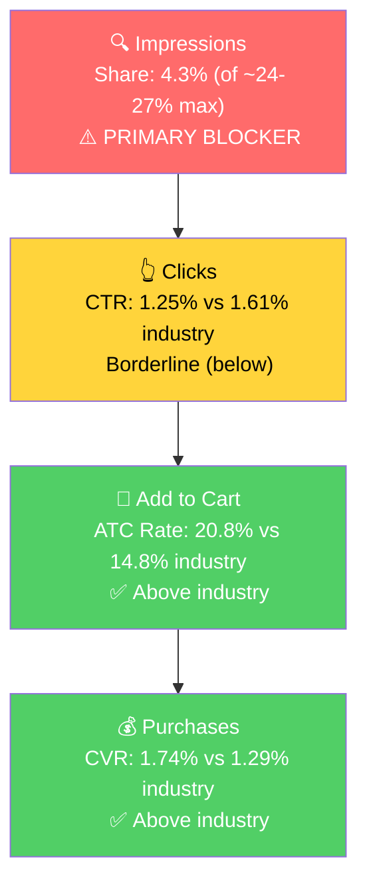

# Step 3: SQP Analysis - P0 (Cat Ears for Helmet)

## Headline

The single most important finding of this audit: **for the Cat Ears product, the Amazon keyword market splits into three tiers, each with a different growth role.** The brand already wins the tiny exact-intent query (Tier 1), is invisible but converts above industry in the mid-sized "helmet accessories" market (Tier 2, a visibility opportunity), and pulls real interest from a huge broad market but loses shoppers at the purchase step (Tier 3, a conversion opportunity).

## Tagging Rationale

- **Tier 1 (Hero, exact intent):** "cat ears for helmet", "ears for helmet". The shopper wants exactly this product. Helmet Flair already dominates these (it effectively created the niche). Small volume.
- **Tier 2 (Core market, helmet accessories):** "motorcycle helmet accessories", "helmet accessories". Riders specifically shopping to accessorize a helmet. Cat ears are one option among horns, stickers, mohawks, etc. This is the real, capturable growth market.
- **Tier 3 (Broad market):** "cat ears", "black cat ears", "motorcycle accessories", "bike accessories", "motorcycle helmets", "motorcycle", "ski helmet", "snowboard helmet", "airsoft". Enormous volume, and the brand already attracts real engagement here (e.g., on "motorcycle accessories" alone: ~3.7K brand clicks and ~875 brand cart-adds a year, a ~23% add-to-cart rate). The shoppers are interested; the gap is at the final purchase step. A real opportunity to unlock by improving conversion.

**Why this matters:** Tier 3 is where the volume is, and the brand is not invisible there, it earns clicks and cart-adds. The drop-off is at the cart-to-purchase step, which is a conversion problem (price positioning, listing, retargeting), not an intent or visibility problem. Within Tier 3, the pure costume slice ("cat ears" peaks to 1.1M every October for Halloween) converts worst and should not be chased with paid spend, but the broad rider-accessory terms carry genuine, conversion-gated demand. The brand's core customer is a rider, and rider demand peaks in spring/summer.

## Catalog Overlap (impression-share caps)

- **Tier 1:** Both the MagNeatOhz Cat Ears (P0) and the Softeez (foam) Cat Ears rank for "cat ears for helmet." 2 products → adjusted cap **~16%**.
- **Tier 2:** Nearly every Helmet Flair SKU is a "helmet accessory," so 3+ products rank. Adjusted cap **~24-27%**.
- **Tier 3:** Multiple products rank. Capturability here is gated by conversion (cart-to-purchase), not by impression cap.

## Market Sizing (12-month average)

| Tier | Monthly Search Volume | Monthly Add to Carts (Market) | Monthly Purchases (Market) | Est. Market Size ($/mo) |
|------|----------------------|-------------------------------|---------------------------|------------------------|
| Tier 1 (cat ears for helmet) | ~800 | ~76 | ~17 | ~$2,600 |
| Tier 2 (helmet accessories) | ~15,600 | ~934 | ~81 | ~$32,000 |
| Tier 3 (broad market) | ~1,300,000 | very large | very large | Large, conversion-gated (real demand, the lever is the cart-to-purchase rate) |

*Estimated using $34.50 avg product price (P0 list price). Tier 1 and Tier 2 are the precise, high-intent demand (~$35k/mo combined); Tier 3 is a much larger pool where the brand already earns clicks and cart-adds, so the upside there is unlocking conversion rather than buying visibility.*

**Key reframe:** Tier 1 and Tier 2 are the precise, high-intent search demand (~$35k/mo), and P0 already does ~$6.6k/mo. The bigger prize is Tier 3: a huge pool where the brand already pulls real interest (clicks and cart-adds) but loses shoppers at purchase. Growth comes from (a) more visibility in the Tier 2 helmet-accessory market, (b) better conversion on the Tier 3 broad demand, and (c) demand the brand creates outside of search (DTC, browse, repeat, branded).

## Market Share & Potential (last 3 months)

| Tier | Impression Share | Click Share | Cart Share | Purchase Share | Trend |
|------|-----------------|-------------|------------|---------------|-------|
| Tier 1 (cat ears for helmet) | ~15.5% (of ~16% cap) | ~19% | ~22% | ~14% | Stable, near cap |
| Tier 2 (helmet accessories) | ~4.3% (of ~24-27% cap) | ~3.6% | ~4.7% | ~4.5% | Flat |
| Tier 3 (broad market) | Low | Real clicks & cart-adds | Real cart-adds | Lags (conversion gap) | Flat |

- **Tier 1:** Helmet Flair owns its hero query, sitting right at the ~16% two-product impression cap. There is almost no headroom here and the volume is small. This tier is to be defended, not scaled.
- **Tier 2:** A visibility opportunity. The brand captures only ~4% of impressions against a ~24-27% ceiling, yet converts at or above industry when it does show up. Room to grow visibility several-fold.
- **Tier 3:** A conversion opportunity. The brand pulls real interest (clicks and cart-adds) from this huge pool but loses shoppers at purchase. Improving the cart-to-purchase rate (price positioning, listing, retargeting abandoned carts) turns this existing engagement into sales.

## Blockers & Growth Path (last 3 months, volume-weighted)

| Tier | Impression Share | CTR (Brand vs Industry) | CVR (Brand vs Industry) | Primary Blocker | Growth Path |
|------|-----------------|------------------------|------------------------|-----------------|-------------|
| Tier 1 | ~15.5% (of ~16% cap) | 2.81% vs 2.30% (above) | 2.48% vs 3.42% (≈, low base) | None - near cap | Defend. Already winning, small volume. Not a scale lever. |
| Tier 2 | 4.3% (of ~24-27% cap) | 1.25% vs 1.61% (below) | 1.74% vs 1.29% (above) | Impression share | **PPC scaling + organic.** Converts above industry once seen; just needs to be seen more. The core growth play. |
| Tier 3 | Low | at/near industry | below industry | Conversion rate | Real demand (clicks + cart-adds) already there; fix cart-to-purchase (price/listing/retargeting) to convert it. |

- **Tier 2 funnel detail:** brand add-to-cart rate is 20.8% vs 14.8% industry, and CVR is 1.74% vs 1.29% industry. The product clearly wins on the detail page against the broad helmet-accessory field. The only gap is CTR (1.25% vs 1.61%), a search-results-page issue tied to the technical main image (see Step 2). So the sequence is: scale impressions (PPC), fix the main image to lift CTR, and the above-industry conversion does the rest.
- **Tier 3 detail:** the brand earns real clicks and cart-adds here (e.g., ~875 cart-adds/yr on "motorcycle accessories" at a ~23% add-to-cart rate) but the cart-to-purchase rate is the blocker. Levers: price positioning, listing improvements, and retargeting abandoned carts (Brand Tailored Promotions). Also test product-targeting / Sponsored Display on actual helmet and motorcycle-gear listings to reach the rider at the moment of purchase. The pure costume slice ("cat ears" Halloween) is the one part not worth chasing with paid spend.

## ICAP Funnel - Tier 2 (highest-growth tier)

## Seasonality (confirmed)

The Step 1 seasonality hypothesis is confirmed, and the cause is now clear:
- **Tier 2 (helmet accessories) search volume peaks in spring/summer** (~21k in May 2025, falling to ~11-12k in winter, climbing back to ~17-18k by Mar-Apr 2026). This is riding season.
- **Helmet Flair's own sales follow the same curve** (P0 peaked in May 2025, troughed in winter, recovering now).
- **Tier 3 generic "cat ears" peaks in October** (Halloween) - the opposite of the brand's pattern, proving the costume market is a different market the brand does not actually serve.

Conclusion: Helmet Flair is a rider-seasonal brand, driven by spring/summer helmet-accessory demand. We are entering peak season now, which makes the next 8-12 weeks the highest-leverage window to scale Tier 2.

## Insights

- **P0 (Cat Ears) has effectively maxed out its exact-match query and is barely present in its true growth market.** It holds ~15.5% impression share on "cat ears for helmet" (at the ~16% two-product cap) but only ~4.3% on the ~$32k/mo "helmet accessories" market, where it converts above industry (ATC 20.8% vs 14.8%, CVR 1.74% vs 1.29%). The growth path is visibility on Tier 2, not more of Tier 1.
- **The broad market (Tier 3) is a conversion opportunity, not a dead end.** The brand already earns real clicks and cart-adds on broad terms (e.g., ~3.7K clicks and ~875 cart-adds/yr on "motorcycle accessories"), but loses shoppers at purchase. The lever is the cart-to-purchase rate (price, listing, retargeting). Separately, the specific generic terms that genuinely don't convert (costume "cat ears," "motorcycle helmet" helmet-buyers) are wasting paid spend and should be paused (see Step 4).
- **The high-intent search market is small (~$35k/mo) relative to the brand's actual sales,** which means a large share of demand is category-creating (DTC, browse, branded, repeat). This is a brand-building story as much as a keyword-capture story.

## Questions for the Seller

- **A large share of P0 (Cat Ears) sales does not trace to any high-volume search query.** Where do you see demand coming from - branded/word-of-mouth, your DTC site driving Amazon halo, repeat buyers, or browse/related-product placement? (Hypothesis: the product is category-defining, so people discover it by browsing helmets/accessories or via the brand, not by searching "cat ears for helmet." This shapes whether we lean into Sponsored Display/product targeting vs keyword campaigns.)
