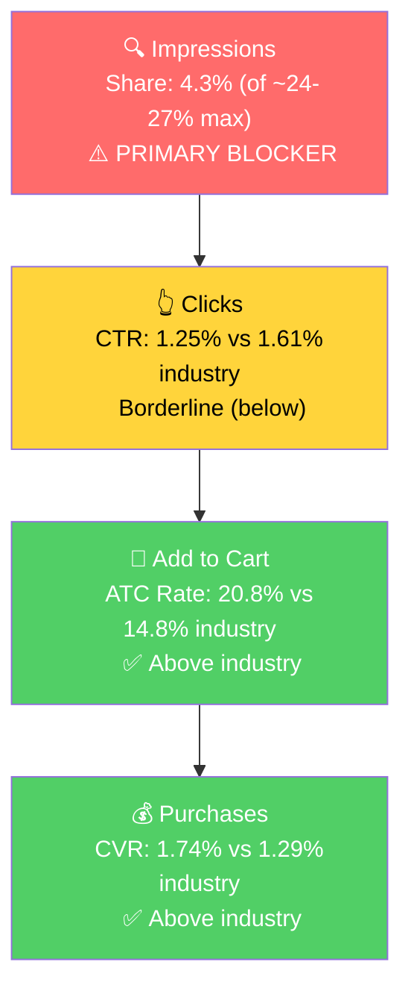

# Seller Central Audit - Helmet Flair

**The one-line thesis:** Helmet Flair is a healthy, growing, seasonal brand entering its spring/summer peak. The products convert well, but the advertising leans on generic keyword auctions instead of doubling down on what already works (product/placement targeting and Top of Search) and on converting the broad-market demand the brand already attracts. Rebalance the ad targeting, improve conversion on the high-traffic broad terms, and modernize the listing, and there is clear room to grow into peak season.

---

## Section 1: Market Opportunity (SQP)

The keyword market splits into three tiers, each with a different role in the growth plan.

**Tier Breakdown:**

- **Tier 1 (Hero):**
  - **Keywords:** cat ears for helmet, ears for helmet
  - **Rationale:** Exact intent. Helmet Flair already dominates these (it effectively created the niche). Small volume, defend what's won.
- **Tier 2 (Core market):**
  - **Keywords:** motorcycle helmet accessories, helmet accessories
  - **Rationale:** Riders specifically shopping to accessorize a helmet. The brand converts above industry here but is barely visible. The clearest visibility growth tier.
- **Tier 3 (Broad market):**
  - **Keywords:** cat ears, black cat ears, motorcycle accessories, bike accessories, motorcycle helmets, motorcycle, ski helmet, snowboard helmet, airsoft
  - **Rationale:** Enormous volume, and the brand already attracts real engagement here (e.g., on "motorcycle accessories" alone: ~3.7K brand clicks and ~875 brand cart-adds a year, a ~23% add-to-cart rate). The shoppers are interested. The gap is at the final step, the conversion (cart-to-purchase) rate. This is a real opportunity to unlock by improving conversion, not a dead end.

**Market Sizing (12-month average):**

| Tier | Monthly Search Volume | Monthly Add to Carts (Market) | Monthly Purchases (Market) | Est. Market Size ($/mo) |
|------|----------------------|-------------------------------|---------------------------|------------------------|
| Tier 1 (cat ears for helmet) | ~800 | ~76 | ~17 | ~$2,600 |
| Tier 2 (helmet accessories) | ~15,600 | ~934 | ~81 | ~$32,000 |
| Tier 3 (broad market) | ~1,300,000 | very large | very large | Large, conversion-gated (real demand, the lever is the cart-to-purchase rate) |

*Estimated using $34.50 avg product price. Tier 1 and Tier 2 are the precise, high-intent demand; Tier 3 is a much larger pool where the brand already earns clicks and cart-adds, so the upside is unlocking conversion rather than buying visibility.*

**Market Share & Potential (last 3 months):**

| Tier | Impression Share | Click Share | Cart Share | Purchase Share | Trend |
|------|-----------------|-------------|------------|---------------|-------|
| Tier 1 (cat ears for helmet) | ~15.5% (of ~16% cap) | ~19% | ~22% | ~14% | Near cap |
| Tier 2 (helmet accessories) | ~4.3% (of ~24-27% cap) | ~3.6% | ~4.7% | ~4.5% | Flat |
| Tier 3 (broad market) | Low | Real clicks & cart-adds | Real cart-adds | Lags (conversion gap) | Flat |

- **Tier 1:** Already winning at the ceiling. Defend.
- **Tier 2:** Big visibility headroom (4.3% of a ~24-27% cap) and the brand converts above industry when it shows up. The fastest, highest-confidence growth.
- **Tier 3:** The brand pulls real interest (clicks and cart-adds) from this huge pool, but loses shoppers at purchase. Improving conversion (price positioning, listing, retargeting abandoned carts) turns this engagement into sales.

**Blockers & Growth Path (last 3 months):**

| Tier | Visibility | CTR (Brand vs Industry) | CVR (Brand vs Industry) | Primary Blocker | Growth Path |
|------|-----------------|------------------------|------------------------|-----------------|-------------|
| Tier 1 | ~15.5% (of ~16% cap) | 2.81% vs 2.30% (above) | 2.48% vs 3.42% (≈) | None - near cap | Defend. Already winning. |
| Tier 2 | 4.3% (of ~24-27% cap) | 1.25% vs 1.61% (below) | 1.74% vs 1.29% (above) | Impression share | PPC scaling + product targeting. Converts above industry once seen. |
| Tier 3 | Low | at/near industry | below industry | **Conversion rate** | Real demand (clicks + cart-adds) is already there. Fix the cart-to-purchase rate (price positioning, listing, retargeting) to convert it. |

**ICAP Funnel - Tier 2 (clearest visibility-growth tier):**

**Seasonality (confirmed):** Tier 2 (helmet-accessory) search volume peaks in spring/summer, and the brand's own sales follow the same curve (peaked May 2025, troughed in winter, recovering now). Generic "cat ears" peaks in October (Halloween), a separate audience. Helmet Flair is rider-seasonal and entering peak now, so the next 8-12 weeks are the highest-leverage window to scale.

---

## Section 2: Ad Analysis

**Account totals (last 90 days):** Spend $8,070 | Sales $32,845 | ROAS 4.07.

### Campaign Structure

> **Finding: The account is fragmented into 1,143 enabled campaigns (653 actively spending), mostly single-keyword campaigns, and a large share target generic terms that convert poorly.**
>
> **Problem:** 1,143 campaigns for this spend level is unmanageable and spreads budget thin. The keyword campaigns are dominated by generic terms that lose money: "motorcycle helmet | exact" (ROAS 0.41-0.98), "full face helmet," "motorcycle accessory | exact" (0.54), "car devil horn" ($37 spend, 0 orders).
>
> **Solution:** Consolidate into a tight, themed structure (hero ASIN-targeting, helmet-accessory keywords, auto discovery, branded defense). Pause the generic keyword campaigns that aren't converting.
>
> **Impact:** Budget concentrates on the proven winners (product targeting and Top of Search) and removes the management overhead that lets losers run unnoticed.

### Auto vs Manual Split

| Targeting Type | Clicks | Spend | Sales | ROAS | AOV | CPC | CVR |
|----------------|--------|-------|-------|------|-----|-----|-----|
| Automatic | 5,256 | $1,675 | $3,445 | 2.06 | $34.45 | $0.32 | 1.90% |
| Manual | 13,331 | $6,396 | $29,400 | 4.60 | $33.30 | $0.48 | 6.62% |

Healthy. Manual drives 79% of spend at a strong 4.60 ROAS; auto is a smaller discovery channel. No action needed.

### Campaign Profitability

> **Problem:** ~$743 over 90 days is going to keyword campaigns below 1.5x ROAS with conclusive click volume, almost all generic helmet-buying terms. Another ~40 micro-campaigns spend $5-37 each at zero orders.
>
> **Solution:** Pause these campaigns and negate the generic terms ("motorcycle helmet," "full face helmet," "motorcycle accessory," "car devil horn").
>
> **Impact:** Reallocating that ~$743 to product targeting (6.24 ROAS) generates ~$4,600 in sales vs the ~$580 those campaigns produce now. Net gain ~$4,000 in sales over 90 days from the same budget.

### Targeting Strategy

**Keyword vs Product Targeting:**

| Targeting Strategy | Clicks | Spend | Sales | ROAS | AOV | CPC | CVR |
|-------------------|--------|-------|-------|------|-----|-----|-----|
| Keyword Targeting | 12,777 | $5,141 | $14,773 | 2.87 | $33.57 | $0.40 | 3.44% |
| Product Targeting | 5,885 | $2,972 | $18,547 | 6.24 | $33.30 | $0.50 | 9.46% |

> **Finding: Product targeting is more than 2x the ROAS of keyword targeting (6.24 vs 2.87) and nearly 3x the conversion rate (9.46% vs 3.44%), yet receives only 37% of the budget.**
>
> **Solution:** Shift budget from generic keyword campaigns toward product/ASIN targeting, and expand product targeting onto more relevant helmet and motorcycle-gear listings. This product sells by placement, not by winning generic keyword auctions.
>
> **Impact:** Moving even $1,500 from keyword targeting (2.87 ROAS) to product targeting (6.24 ROAS) lifts sales on that spend from ~$4,300 to ~$9,400, roughly $5,000 additional over the period.

**Match Type Breakdown:**

| Match Type | Clicks | Spend | Sales | ROAS | AOV | CPC | CVR |
|------------|--------|-------|-------|------|-----|-----|-----|
| EXACT | 4,466 | $2,129 | $6,305 | 2.96 | $33.90 | $0.48 | 4.16% |
| BROAD | 3,305 | $1,405 | $5,232 | 3.72 | $32.70 | $0.43 | 4.84% |

Broad outperforms exact because the exact-match keywords chosen are largely generic head terms that don't convert. The fix is keyword selection, which the consolidation above addresses.

### Product-Level (Cat Ears)

**Campaign Map:**

| Product | Spend | Sales | ROAS | Clicks | Orders |
|---------|-------|-------|------|--------|--------|
| Cat Ears | $2,796 | $12,232 | 4.38 | 6,180 | 362 |
| Large Devil Horns | $2,848 | $11,279 | 3.96 | 6,748 | 325 |
| Small Devil Horns | $1,836 | $7,060 | 3.84 | 4,331 | 203 |

Cat Ears is ~35% of account ad spend at a healthy 4.38 ROAS.

**Visibility lever (Tier 2):** The brand already converts on accessory-intent terms and via product targeting; it just underfunds them.

| Search Term / Target | Spend | Sales | ROAS | Orders |
|-----------|-------|-------|------|--------|
| helmet ear \| broad | $356.73 | $928.65 | 2.60 | 27 |
| helmet horn \| exact | $94.70 | $873.75 | 9.23 | 24 |
| devil horn \| broad | $153.21 | $768.55 | 5.02 | 28 |
| ASIN/product targeting (top campaigns) | $938 / $229 / $163 | $5,387 / $1,503 / $1,608 | 5.74 / 6.57 / 9.85 | - |

**Placement lever (CTR):**

| Placement | Spend | Sales | ROAS | CTR | CVR |
|-----------|-------|-------|------|-----|-----|
| Top of Search | $2,459 | $10,964 | 4.46 | 7.20% | 6.74% |
| Rest of Search | $3,497 | $6,765 | 1.93 | 0.93% | 2.36% |
| Product Pages | $2,150 | $4,623 | 2.15 | 0.74% | 2.67% |

> **Finding: Rest of Search consumes the most spend ($3,497) at the worst ROAS (1.93, 0.93% CTR), while Top of Search converts more than 2x better (4.46 ROAS, 6.74% CVR) on a 7.20% CTR but gets less budget.**
>
> **Solution:** Increase Top of Search bid modifiers and pull back Rest of Search exposure. Pair with the listing/image improvements below.
>
> **Impact:** Shifting ~$1,500 from Rest of Search to Top of Search lifts sales on that spend from ~$2,900 to ~$6,700, roughly $3,800 additional over the period.

**Branded defense:** The product-targeting campaigns on the brand's own and sibling listings post the account's best ROAS (5.7-9.9) and act as healthy cross-sell/defense. Keep them as is; no branded keyword scaling needed.

---

## Section 3: Action Plan (8 weeks)

The primary growth levers are: (1) visibility in the helmet-accessory market (Tier 2), where the brand converts above industry once seen, and (2) conversion on the large broad market (Tier 3), where the demand and clicks are already there but shoppers drop off at purchase. The plan front-loads the fast PPC reallocation, then builds the listing and conversion improvements that unlock the broader market. Timed to the spring/summer riding-season peak.

### Weeks 1-2: Immediate PPC Wins
- Pause the unprofitable generic-keyword campaigns and negate the terms ("motorcycle helmet," "full face helmet," "motorcycle accessory," "car devil horn"). Recovers ~$743+/90 days of waste. (Section 2)
- Reallocate that budget plus a slice of keyword spend into the product/ASIN-targeting campaigns (6.24 ROAS). (Section 2)
- Raise Top of Search bid modifiers; reduce Rest of Search exposure. (Section 2)

### Weeks 2-4: Consolidate Structure + Scale Winners
- Consolidate the 1,100+ single-keyword campaigns into a tight, themed structure. (Section 2)
- Scale the accessory-intent keywords that already convert ("helmet ear," "helmet horn," "devil horn") with dedicated budgets. (Section 2)
- Expand product targeting onto more relevant helmet and motorcycle-gear listings to grow Tier 2 visibility (currently 4.3% of a ~24-27% ceiling). (Section 1)
- Begin listing-content production (do not publish yet): a lifestyle main image showing the ears on a real helmet, image-led A+ content, and a 15-30s demo video. These directly target the CTR gap in Tier 2 and the conversion gap in Tier 3. (Section 1)

### Weeks 4-6: Publish Listing Improvements + Unlock Tier 3 Conversion
- Publish the new main image, A+ content, and video; monitor CTR and conversion. (Section 1)
- Continue scaling product targeting and Top of Search. (Section 2)
- Launch retargeting (Brand Tailored Promotions / abandoned-cart) and test Sponsored Display on helmet and motorcycle-gear listings to convert the Tier 3 demand (the shoppers who already click and add to cart but don't buy). (Section 1)

### Weeks 6-8: Scale into Peak + Evaluate Siblings
- Scale PPC on the improved listing through the spring/summer peak. (Section 1, 2)
- Apply the same playbook to the Large Devil Horns and Small Devil Horns products: they share the catalog, seasonality, and the helmet-accessory market.
- Maintain the branded-defense allocation; do not scale branded keywords. (Section 2)
