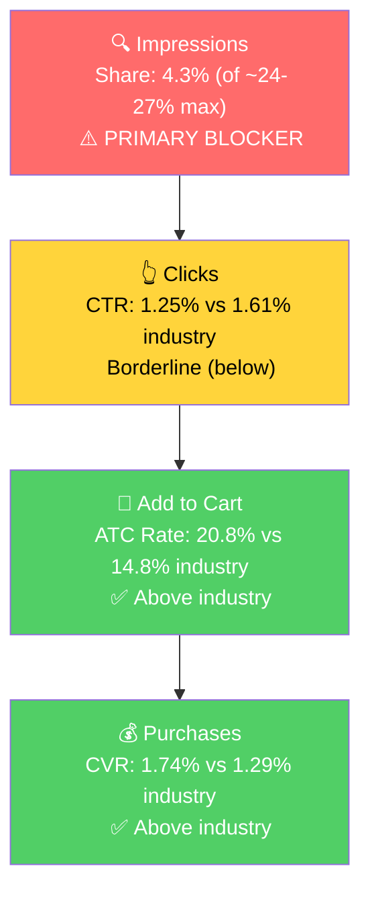

# Seller Central Audit - Helmet Flair

*Prepared for the second sales call. Self-contained: this is the only document you need to walk the brand owner through the account, the opportunity, and the plan.*

**The one-line thesis:** Helmet Flair is a healthy, growing, seasonal niche brand entering its spring/summer peak. Its products convert well, but its advertising leans on generic keyword auctions instead of doubling down on what already works (product/placement targeting and Top of Search) and on converting the broad-market demand the brand already attracts. Rebalance the ad targeting, improve conversion on the high-traffic broad terms, and modernize the listing, and there is clear room to grow into peak season.

---

## Section 1: Catalog Assessment

Helmet Flair sells novelty helmet accessories (cat ears, devil horns, unicorn horns, banana, corn cob) that attach to bike, motorcycle, ski, and airsoft helmets. Two lines: **MagNeatOhz** (magnetic, interchangeable, ~$30-35, where nearly all revenue sits) and **Softeez** (foam peel-and-stick, ~$15-20, small). Private label, made in USA, patent-pending magnetic system.

| Priority | Product | 3-Mo Sales | 3-Mo Ad Spend | ROAS | TACoS | Organic Sales | Ad Sales % | Buy Box % | CVR | Trend |
|----------|---------|-----------|--------------|------|-------|---------------|-----------|-----------|-----|-------|
| P0 | Cat Ears (MagNeatOhz) | $18,454 | $2,147 | 4.30 | 11.6% | $9,212 | 50.1% | ~80% | ~4.9% | Growing |
| P1 | Large Devil Horns (MagNeatOhz) | $17,370 | $2,354 | 3.86 | 13.6% | $8,293 | 52.3% | ~85.6% | ~4.3% | Growing (fastest) |
| P2 | Small Devil Horns (MagNeatOhz) | $12,652 | $1,371 | 3.99 | 10.8% | $7,185 | 43.2% | ~85.7% | ~5.1% | Growing |
| P3 | Extra Nubbins | $957 | $52 | 7.93 | 5.4% | $548 | 42.7% | ~100% | ~14% | Growing |

*Window: Feb-Apr 2026. Three MagNeatOhz hero SKUs drive ~85% of revenue, all follow the same spring-peak seasonal curve, all growing. The Softeez foam line and other tail SKUs (unicorn, banana, corn cob) are each under ~$500/mo and not prioritized. Note: P3 (Extra Nubbins) is a low-priced add-on (magnetic mounts) with exceptional ROAS/CVR; it reinforces the interchangeable-system ecosystem rather than being a standalone driver.*

P0 (Cat Ears) edges out P1 on trailing sales and best blended ROAS. P1 (Large Devil Horns) is growing fastest (+74% Feb to Apr) and is a very close second.

---

## Section 2: Qualitative Product Understanding (P0 - Cat Ears)

**Product:**
- A pair of magnetic, interchangeable cat ears that pop onto any helmet via a patented magnetic "Nubbin" system. Durable ABS, weatherproof, engineered to hold at highway speed. Made in USA (Ohio). ~$34.50, 6 colorways.
- Value: personalize a helmet without permanent adhesive; swap designs by mood or share with friends. Part of a wider flair ecosystem (one magnetic base, many designs).
- Purchase motivation: self-expression and fun, plus visibility on the road. Also a popular gift.

**Customer:** Motorcycle, dirt bike, bicycle, ski, snowboard, and skate helmet wearers, adults and kids. Two buyer types: the rider personalizing their own helmet (impulse, expressive) and the gift buyer.

**Brand:** Registered, established niche brand (Boulder CO, manufactured in Ohio, in market since ~2021). Patent-pending tech, professional Shopify site with bike and moto landing pages, DTC + Amazon. Vibe: playful, rebellious, fun-first.

**Competitive Landscape:**
- Price positioning: generic adhesive/clip-on novelty ears run ~$8-15 | Helmet Flair ~$34.50 | roughly 2-3x the budget field. Helmet Flair is the premium option.

| Competitor | Product | Positioning |
|-----------|---------|-------------|
| Moto Loot | Cat ears & horns for helmets | Direct novelty competitor |
| Generic/import brands | Adhesive / suction-cup ears | Budget (~$8-15), no interchangeability |
| Cat-Ears.com | Faux-fur wind-noise reducers | Adjacent, not direct (functional, not decorative) |

- Differentiator/moat: the patented magnetic, interchangeable system (buy the base, collect and swap designs). The weakness: a shopper sees a $34.50 product next to $10 stick-ons and needs a reason to pay up, and the listing does not currently tell that story.

**Listing Quality:**

*Strengths:*
- Title (144 chars, brand-led, "Made in USA," magnetic/interchangeable, key use cases). Good keyword coverage.
- 5 benefit-led bullets covering the magnetic system, compatibility, durable ABS, the ecosystem, and made-in-USA.

*Opportunities:*
- **Main image** is a technical studio shot (mechanism + "PATENT PENDING" stamp + color swatches), not a lifestyle hero. For an impulse novelty product this is the single highest-leverage CTR fix: show the ears mounted on a real helmet, ideally on a rider.
- **No A+ content.** A brand-registered product with a real story (patented swap system, made in USA, full design range) should have image-led A+ to justify the premium and cross-sell other flair.
- **No video.** The core selling point ("pop on/off magnetically, swap designs, holds at speed") is a motion concept that a 15-30s clip would demonstrate far better than stills, addressing the main buyer doubt (will it stay on?).
- **Rating ~4.2** (moderate). Headroom for a premium novelty; likely reflects some fit/staying-on complaints.

---

## Section 3: Quantitative Product Understanding (P0 - Cat Ears)

**Annual Trend:**

| Metric | May 2025 (peak) | Nov 2025 (trough) | Feb 2026 | Apr 2026 (latest) |
|--------|-----------------|-------------------|----------|-------------------|
| Total Sales | $11,219 | $4,963 | $5,347 | $6,640 |
| Sessions | 6,385 | 2,518 | 2,969 | 4,122 |
| CVR | 5.09% | 5.68% | 5.19% | 4.66% |

- **Seasonal, demand-driven.** Sales peaked May/June 2025, troughed in winter, and are recovering now as riding season returns. CVR is stable and healthy (~5%) all year, so the swings are a traffic/demand story, not a conversion problem.

**Rating Trajectory:** ~4.2, indeterminate trend (Keepa history not populated).
**Sales Rank Trajectory:** Strong within niche (#15-36 in "Helmet Hardware"); broad Automotive ~25-48k. Seasonality established from the session/sales curve above, confirmed by SQP (Section 4).

---

## Section 4: Market Opportunity (SQP)

**The key reframe:** For the Cat Ears product, the keyword market splits into three very different worlds, and only one is a real growth lever.

**Tier Breakdown:**

- **Tier 1 (Hero):**
  - **Keywords:** cat ears for helmet, ears for helmet
  - **Rationale:** Exact intent. Helmet Flair effectively created this niche and already dominates it. Small volume.
- **Tier 2 (Core market):**
  - **Keywords:** motorcycle helmet accessories, helmet accessories
  - **Rationale:** Riders shopping to accessorize a helmet. Cat ears are one option among horns, stickers, mohawks. The real, capturable growth market.
- **Tier 3 (Broad market):**
  - **Keywords:** cat ears, black cat ears, motorcycle accessories, bike accessories, motorcycle helmets, motorcycle, ski helmet, snowboard helmet, airsoft
  - **Rationale:** Enormous volume, and the brand already attracts real engagement here (e.g., on "motorcycle accessories" alone: ~3.7K brand clicks and ~875 brand cart-adds a year, a ~23% add-to-cart rate). The shoppers are interested. The gap is at the final step, the conversion (cart-to-purchase) rate. A real opportunity to unlock by improving conversion, not a dead end.

**Market Sizing (12-month average):**

| Tier | Monthly Search Volume | Monthly Add to Carts (Market) | Monthly Purchases (Market) | Est. Market Size ($/mo) |
|------|----------------------|-------------------------------|---------------------------|------------------------|
| Tier 1 | ~800 | ~76 | ~17 | ~$2,600 |
| Tier 2 | ~15,600 | ~934 | ~81 | ~$32,000 |
| Tier 3 | ~1,300,000 | very large | very large | Large, conversion-gated (real demand, the lever is the cart-to-purchase rate) |

*Estimated at $34.50 (P0 price). Tier 1 and Tier 2 are the precise, high-intent demand; Tier 3 is a much larger pool where the brand already earns clicks and cart-adds, so the upside is unlocking conversion rather than buying visibility.*

**Blockers & Growth Path (last 3 months):**

| Tier | Impression Share | CTR (Brand vs Industry) | CVR (Brand vs Industry) | Primary Blocker | Growth Path |
|------|-----------------|------------------------|------------------------|-----------------|-------------|
| Tier 1 | ~15.5% (of ~16% cap) | 2.81% vs 2.30% (above) | 2.48% vs 3.42% (≈) | None - near cap | Defend. Already winning, small volume. |
| Tier 2 | 4.3% (of ~24-27% cap) | 1.25% vs 1.61% (below) | 1.74% vs 1.29% (above) | Impression share | PPC scaling + product targeting. Converts above industry when seen. The core growth play. |
| Tier 3 | Low | at/near industry | below industry | Conversion rate | Real demand (clicks + cart-adds) already there; fix cart-to-purchase (price/listing/retargeting) to convert it. |

**ICAP Funnel - Tier 2 (highest-growth tier):**

- **Seasonality confirmed:** Tier 2 (helmet-accessory) search volume peaks in spring/summer, matching the brand's own sales curve. Generic "cat ears" peaks in October (Halloween), the opposite of the brand's pattern, proving the costume market is a different market. Helmet Flair is rider-seasonal, and we are entering peak now.
- **Two growth levers: visibility in Tier 2 and conversion in Tier 3.** The brand has maxed its exact-match query (Tier 1), is invisible in its true accessory market (Tier 2, where it converts above industry once seen), and pulls real interest from the huge broad market (Tier 3) but loses those shoppers at purchase. Win Tier 2 on visibility and Tier 3 on conversion.

---

## Section 5: Ad Analysis

**Account totals (ENABLED, last 90 days):** Spend $8,070 | Sales $32,845 | ROAS 4.07.

### Campaign Structure

> **Finding: The account is fragmented into 1,143 enabled campaigns (653 spending), mostly single-keyword campaigns, many targeting generic terms that cannot convert.**
>
> **Problem:** 1,100+ campaigns for a ~$2.7k/mo spend is unmanageable and spreads budget too thin. The keyword campaigns are dominated by intent-mismatched generics: "motorcycle helmet" (ROAS 0.41-0.98), "full face helmet," "motorcycle accessory" (0.54), "car devil horn" ($37, 0 orders), even "cat ear" broad. These are helmet-buyers and costume-shoppers, exactly the Tier 3 mismatch from Section 4.
>
> **Solution:** Consolidate into a tight structure (hero ASIN-targeting, helmet-accessory keywords, auto discovery, branded defense). Pause and negate the generic helmet-buyer and costume terms.
>
> **Impact:** Budget concentrates on proven winners (product targeting, Top of Search) and losers stop running unnoticed.

### Auto vs Manual Split

| Targeting Type | Clicks | Spend | Sales | ROAS | AOV | CPC | CVR |
|----------------|--------|-------|-------|------|-----|-----|-----|
| Automatic | 5,256 | $1,675 | $3,445 | 2.06 | $34.45 | $0.32 | 1.90% |
| Manual | 13,331 | $6,396 | $29,400 | 4.60 | $33.30 | $0.48 | 6.62% |

Healthy. Manual drives 79% of spend at 4.60 ROAS; auto is a smaller discovery channel. No action.

### Campaign Profitability

> **Problem:** ~$743 over 90 days goes to keyword campaigns below 1.5x ROAS with conclusive click volume (mostly "motorcycle helmet," "full face helmet," "motorcycle accessory," "car devil horn"). ~40 more micro-campaigns bleed $5-37 each at zero orders.
>
> **Solution:** Pause these and negate the generic terms.
>
> **Impact:** Reallocated to product targeting (6.24 ROAS) that ~$743 becomes ~$4,600 in sales vs ~$580 today. Net ~$4,000 over 90 days from the same budget.

### Targeting Strategy

**Keyword vs Product Targeting:**

| Targeting Strategy | Clicks | Spend | Sales | ROAS | AOV | CPC | CVR |
|-------------------|--------|-------|-------|------|-----|-----|-----|
| Keyword Targeting | 12,777 | $5,141 | $14,773 | 2.87 | $33.57 | $0.40 | 3.44% |
| Product Targeting | 5,885 | $2,972 | $18,547 | 6.24 | $33.30 | $0.50 | 9.46% |

> **Finding: Product targeting is 2x+ the ROAS and ~3x the CVR of keyword targeting, but gets only 37% of budget.**
>
> **Solution:** Shift budget toward product/ASIN targeting; expand onto more relevant helmet and motorcycle-gear listings. This is the PPC expression of the SQP finding that the product sells by placement, not generic search.
>
> **Impact:** Moving $1,500 from keyword (2.87) to product targeting (6.24) lifts sales on that spend from ~$4,300 to ~$9,400, roughly $5,000 additional.

**Match Type Breakdown:**

| Match Type | Clicks | Spend | Sales | ROAS | AOV | CPC | CVR |
|------------|--------|-------|-------|------|-----|-----|-----|
| EXACT | 4,466 | $2,129 | $6,305 | 2.96 | $33.90 | $0.48 | 4.16% |
| BROAD | 3,305 | $1,405 | $5,232 | 3.72 | $32.70 | $0.43 | 4.84% |

Broad beats exact because the exact keywords chosen are largely the generic head terms that don't convert. Fixed by keyword selection (covered by the consolidation above).

### Product Level (P0 - Cat Ears)

**P0 Campaign Map:**

| Product | Spend | Sales | ROAS | Clicks | Orders |
|---------|-------|-------|------|--------|--------|
| Cat Ears (P0) | $2,796 | $12,232 | 4.38 | 6,180 | 362 |
| Large Devil Horns (P1) | $2,848 | $11,279 | 3.96 | 6,748 | 325 |
| Small Devil Horns (P2) | $1,836 | $7,060 | 3.84 | 4,331 | 203 |

P0 is ~35% of account ad spend at a healthy 4.38 ROAS.

**Impression Share Blocker (Tier 2): Keyword & Product-Targeting Levers**

Section 4 named impression share on the helmet-accessory market as the growth path. The ad data shows the brand already converts on accessory-intent terms and via product targeting, it just underfunds them:

| Search Term / Target | Spend | Sales | ROAS | Orders |
|-----------|-------|-------|------|--------|
| helmet ear \| broad | $356.73 | $928.65 | 2.60 | 27 |
| helmet horn \| exact | $94.70 | $873.75 | 9.23 | 24 |
| devil horn \| broad | $153.21 | $768.55 | 5.02 | 28 |
| ASIN/product targeting (top campaigns) | $938 / $229 / $163 | $5,387 / $1,503 / $1,608 | 5.74 / 6.57 / 9.85 | - |

Accessory-intent and product-targeting terms convert; generics don't. Concentrate budget here.

**CTR Lever (Placement Distribution):**

| Placement | Spend | Sales | ROAS | CTR | CVR |
|-----------|-------|-------|------|-----|-----|
| Top of Search | $2,459 | $10,964 | 4.46 | 7.20% | 6.74% |
| Rest of Search | $3,497 | $6,765 | 1.93 | 0.93% | 2.36% |
| Product Pages | $2,150 | $4,623 | 2.15 | 0.74% | 2.67% |

> **Finding: Rest of Search eats the most spend at the worst ROAS (1.93, 0.93% CTR), while Top of Search converts 2x+ better (4.46 ROAS, 6.74% CVR, 7.2% CTR) on less budget.**
>
> **Solution:** Raise Top of Search bid modifiers, pull back Rest of Search. Pair with the lifestyle main-image fix (Section 2) to lift CTR further.
>
> **Impact:** Shifting ~$1,500 from Rest of Search to Top of Search lifts sales on that spend from ~$2,900 to ~$6,700, roughly $3,800 additional.

**Branded Defense:** Product-targeting campaigns on the brand's own/sibling ASINs post the account's best ROAS (5.7-9.9) and act as healthy cross-sell/defense. No disproportionate branded keyword spend. Keep as is.

---

## Section 6: Action Plan (8 weeks)

The growth levers are visibility in the helmet-accessory market (Tier 2), where the brand converts above industry once seen, and conversion in the broad market (Tier 3), where demand and clicks are already there but shoppers drop off at purchase. The plan front-loads PPC reallocation toward what already works (product targeting + Top of Search), removes the spend bleeding on low-converting generics, then builds the listing and conversion improvements that unlock the broader market. Timing is deliberate: we are entering the spring/summer riding-season peak.

### Weeks 1-2: Immediate PPC Wins
- Pause the unprofitable generic-keyword campaigns and negate the terms ("motorcycle helmet," "full face helmet," "motorcycle accessory," "car devil horn"). Recovers ~$743+/90 days of waste. (Section 5)
- Reallocate that budget plus a slice of keyword spend into the product/ASIN-targeting campaigns (6.24 ROAS). (Section 5)
- Raise Top of Search bid modifiers; reduce Rest of Search exposure. (Section 5)

### Weeks 2-4: Consolidate Structure + Scale Winners
- Consolidate the 1,100+ single-keyword campaigns into a tight, themed structure (hero ASIN-targeting, helmet-accessory keywords, auto discovery, branded defense). (Section 5)
- Scale the accessory-intent keywords that already convert ("helmet ear," "helmet horn," "devil horn") with dedicated budgets. (Section 5)
- Expand product targeting onto more relevant helmet and motorcycle-gear listings to grow Tier 2 impression share (currently 4.3% of a ~24-27% ceiling). (Section 4)
- Begin listing-content production (do not publish yet): shoot a lifestyle main image (ears on a helmet/rider), image-led A+ modules, and a 15-30s demo video. (Section 2)

### Weeks 4-6: Publish Listing Improvements + Unlock Tier 3 Conversion
- Publish the new main image, A+ content, and video for P0. Monitor CTR (the Tier 2 soft spot) and CVR. (Section 2, 4)
- Continue scaling product targeting and Top of Search based on the Weeks 1-4 results. (Section 5)
- Launch retargeting (Brand Tailored Promotions / abandoned-cart) and test Sponsored Display on helmet and motorcycle-gear listings to convert the Tier 3 demand (the shoppers who already click and add to cart but don't buy). (Section 4)

### Weeks 6-8: Scale into Peak + Evaluate Siblings
- Scale PPC on the improved listing through the spring/summer peak. (Section 3, 4)
- Apply the same playbook to P1 (Large Devil Horns) and P2 (Small Devil Horns): they share the catalog, seasonality, and the "helmet accessory" market, and P1 is growing fastest. (Section 1)
- Confirm a small branded-defense allocation remains in place; do not scale branded keywords. (Section 5)

---

## Section 7: Insights & Questions for the Seller

**Insights:**
- **P0 (Cat Ears) growth is a placement story, not a keyword story.** Product targeting runs 6.24 ROAS / 9.46% CVR vs 2.87 / 3.44% for keyword targeting, yet gets only 37% of budget. The brand converts above industry in its true helmet-accessory market (Tier 2) but holds just 4.3% impression share of a ~24-27% ceiling. Shift budget to product targeting and accessory-intent terms.
- **The broad market (Tier 3) is a conversion opportunity, not a dead end.** The brand already earns real clicks and cart-adds on broad terms (e.g., ~3.7K clicks and ~875 cart-adds/yr on "motorcycle accessories"), but loses shoppers at purchase. The lever is the cart-to-purchase rate (price positioning, listing, retargeting), not visibility. Separately, the specific generic terms that genuinely don't convert ("motorcycle helmet" helmet-buyers, costume "cat ears") are wasting ~$743+/90 days in paid spend and should be paused.
- **Top of Search is 2x+ more efficient than Rest of Search** (4.46 vs 1.93 ROAS) yet gets less budget; rebalancing placement modifiers is a fast efficiency gain.
- **The brand is rider-seasonal and entering peak now.** SQP confirms spring/summer demand; the next 8-12 weeks are the highest-leverage window to scale.

**Questions for the Seller:**
- **A large share of Cat Ears sales does not trace to any high-volume search query.** Where is that demand coming from, branded/word-of-mouth, your DTC site, repeat buyers, or browse? (This shapes how hard we lean into Sponsored Display/product targeting vs keyword campaigns.)
- **The account is split into 1,100+ single-keyword campaigns.** Was this built by a previous agency or tool, and is there any reporting dependency before we consolidate it? (Hypothesis: legacy SKAG sprawl, safe to consolidate.)
- **Ad data only goes back to Feb 21, 2026** (we retain ~90 days). Were you advertising before then, and what was the strategy/budget? (So we frame the history correctly rather than assuming ads started in February.)
