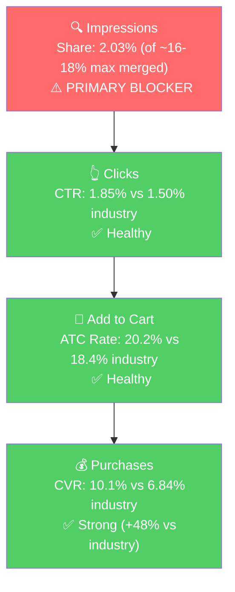

# Seller Central Audit - Hippo Outdoor (v2)

**What changed from v1:** v1 was centered on P0 (tarp accessories). v2 extends the analysis to P1 (Fly Fishing Magnifying Glasses) and P2 (Fly Fishing Sport Glasses family), which combined generate $5,422 in 3-mo sales vs $3,730 for P0. The most important new finding: **P1, P2, and a third standalone ASIN (B09SQB8WFV) are all variants of the same fly-fishing-glasses product family but are listed as three separate parents. Merging them is the single biggest structural lever in this audit.**

## Section 1: Catalog Assessment

| Priority | Product | 3-Mo Sales | 3-Mo Ad Spend | ROAS | TACoS | Organic Sales | Ad Sales % | Buy Box % | CVR (Mar) | Trend |
|----------|---------|-----------:|--------------:|-----:|------:|--------------:|-----------:|----------:|----------:|-------|
| P0 | Tarp Accessories (B0CM72RSS8) | $3,730 | $880 | 1.82 | 23.6% | $2,125 | 43.0% | 82.8%* | 8.9% | Declining |
| P1 | Fly Fishing Magnifying Glasses (B0CGHS9B6W) | $3,101 | $1,009 | 1.49 | 32.5% | $1,598 | 48.5% | 99.2% | 9.0% | Growing |
| P2 | Fly Fishing Sport Glasses (B0F5QHC9BW) | $2,321 | $543 | 2.58 | 23.4% | $921 | 60.3% | 98.8%* | 13.2% | Growing fast |
| P3 | Waders Catch Bag (B0FRMTF1MZ) | $749 | $126 | 1.67 | 16.8% | $539 | 28.0% | 100% | 3.6% | Volatile |

*P0 and P2 parent buy box percentages are both dragged by broken parent-shell ASINs (B0CM72RSS8 and B0F5QHC9BW themselves) sitting at 0% buy box with zero sales. Active children for both are at 99-100%. Same hygiene issue repeats in both parents.

**P1 + P2 combined: $5,422 3-mo sales on $1,552 ad spend (1.90 ROAS) - the fly-fishing-glasses family is the largest revenue cluster in the account once it's treated as one product.**

## Section 2: Catalog Structure (The Merge Thesis)

**Finding:** P1, P2, and B09SQB8WFV are all variants of the same fly-fishing-glasses product family, split across three separate parent ASINs:

| ASIN | Current parent | Variant description | 3-Mo Sales | Rating |
|------|---------------|---------------------|-----------:|-------:|
| B0CGHS9B6W | P1 parent (standalone) | Magnifier + clip-on nose + magnetic release 8295 | $3,101 | 3.6 |
| B09SQB8WFV | Standalone | Sport glasses + clip-on nose 8290 | $154 | 3.3 |
| B0F4R4YGCZ | P2 child | Sport + magnet release Orange | $934 | 3.9 |
| B0F4R3SPKL | P2 child | Sport + lanyard Orange | $492 | 5.0 |
| B0F4R4YR4Y | P2 child | Sport + magnet release 8276 | $386 | 3.9 |
| B0F4R3QQ7D | P2 child | Sport + lanyard Grey | $298 | 3.8 |
| B0F4R69LGK | P2 child | Sport + clip release 8270 | $208 | **1.8** |
| B0F5QHC9BW | P2 parent shell | Phantom listing (no A+, no video, 0% buy box) | $0 | null |

Same customer, same use case, same attachment system design, same model-number family (8290, 8276, 8270, 8295), same competitive set.

**Why merging is a growth lever:**
1. **Review pooling.** Current ratings range 1.8 to 5.0 across small fragmented pools. Merged, the combined rating displays across hundreds of reviews and the B0F4R69LGK 1.8 drag gets diluted by higher-rated siblings.
2. **Impression share consolidation.** A search impression currently shows one of Hippo's 3 parents at a time; the other two are invisible. Merged, the impression share cap for "fly fishing glasses" queries effectively doubles (Section 4 Tier 1 analysis).
3. **Variation selector as CVR lift.** Shoppers self-select magnifying vs sport vs clip vs magnet release on a merged listing. This is a native CVR boost on an already-strong funnel (Tier 1 brand CVR 10.1% vs industry 6.84%).
4. **Ad structure simplifies.** Today the "Fishing Glasses 2025" catch-all campaign mixes P1 and P2 children under one budget. A merged parent cleans this up (Section 5).
5. **SEO authority consolidates.** Three parents compete with each other for rank; one merged parent aggregates the combined velocity.
6. **P2 parent shell (B0F5QHC9BW) gets suppressed** as part of the merge, removing the parent-shell buy box drag.

**This merge is the single most impactful listing-ops action in the audit.** It sits as a Week 1-2 action in Section 6.

## Section 3: Qualitative Product Understanding

### P0 (Hero Child B09TB3FPKW - Grommet Reinforcement Tape, 10-Pack)

**Product:** 10-pack of self-adhesive, fiber-reinforced patches applied over existing tarp grommets/eyelets to stop them from tearing out. UV-resistant, -25 to +65 C, peel-and-stick. **Value prop:** a $10 fix that preserves a $50-200 tarp. **Customer:** older, practical, DIY. Boat/RV/farm/construction. **Competitive set:** Moose Supply, Gear Aid Tenacious Tape (direct tape), Edward Tools, 103-piece Grommet Kit (substitute). **Price:** ~$10.79, low end of the segment. **Differentiator (not owned in listing):** preventative, no-tools fix. Bullet 1 currently leads with "Unparalleled Strength" instead of the no-tools moat.

**Listing strengths:** keyword-rich title, 5 detailed bullets, 9-image gallery.
**Opportunities:** A+ content is text-heavy with typos ("euelet," "Rember that," "it's small investment"); rebuild as image-only. No video on a "peel-stick-done" demo-shaped product. Rating down 4.9 → 4.3 over 12 months (see Section 7 questions). Category is Arts & Crafts Tape; target shoppers live in Tools/Outdoors.

### P1 + P2 (Fly Fishing Glasses Family, merged)

**Product:** Two lens types (magnifying for tying flies, sport-polarized for seeing fish) built on a shared attachment system (clip-on nose, magnetic release, lanyard). One-hand-use is the core design principle. **Customer:** fly anglers, older-skew, destination fishing (trout/salmon streams). The "vest angler" who needs small, fast, lightweight accessories. **Competitive set:** FlipFocals, Fastflies ReadyReaders, Orvis for magnifiers; Smith Optics, Costa Del Mar ($80-200 premium) + Amazon long tail for polarized sport glasses. **Price:** ~$12-13 across the family. Aggressively underpriced in the sport-polarized segment; mid-market in magnifiers. Price is not the blocker.

**Listing strengths (across all 8 variants):** video present on all non-shell ASINs (2 videos each), A+ content present, 8-10 images, better-written bullets than the tarp line (especially on P2 children).
**Opportunities:** ratings are low (1.8 to 3.9) across the board, below healthy 4.3-4.5. P1 bullets read like slogans without supporting detail; apply P2 bullet pattern post-merge. P2 parent shell (B0F5QHC9BW) has no A+, no video, 0% buy box — remove on merge. Child B0F4R69LGK at 1.8 rating needs root cause review.

## Section 4: Quantitative Trend + Market Opportunity

### P0 (Tarp Accessories)

**Annual trend:**

| Metric | Jun 2025 (peak) | Sep 2025 (buy box event) | Dec 2025 | Mar 2026 |
|--------|----------------:|-------------------------:|---------:|---------:|
| Total Sales | $2,952 | $2,003 | $1,760 | $1,202 |
| Sessions | 1,762 | 1,266 | 1,078 | 1,143 |
| CVR | 14.1% | 13.6% | 17.1% | 8.9% |
| Buy Box % | 98.6% | 83.3% | 83.0% | 82.8% |

Peak May-Jul 2025, down ~60% to Mar 2026. Market peaks Oct-Nov (pre-winter tarp prep), so decline is **not seasonal**. Rating 4.9 → 4.3 over 12 months. Parent shell issue explains the buy box reading.

### P1 + P2 (Fly Fishing Glasses family, combined)

**Annual trend (P1 + P2 parents combined):**

| Metric | Jul 2025 (peak) | Nov 2025 (trough) | Jan 2026 | Mar 2026 |
|--------|----------------:|-------------------:|---------:|---------:|
| Combined Sales | $3,553 | $1,098 | $1,242 | $2,592 |
| Combined Sessions | 2,239 | 1,018 | 1,119 | 1,795 |

P1+P2 hit a steep low in Nov 2025 ($1,098) but have recovered fast: Mar 2026 is $2,592, up 112% from the trough and tracking toward the summer peak. **P2 in particular is growing 4.7x in 3 months (Jan $306 → Mar $1,433).** The merged family is not in decline - it is actively ramping.

### Market Opportunity (SQP)

**P0 Tier Structure:**
- Tier 1 (grommet/eyelet reinforcement intent): `grommets for tarps`, `tarp grommet kit`, `tarp grommet fasteners`, `tarp grommets`, `tarp fasteners for grommets`
- Tier 2 (tarp repair tape/patch intent): `tarp repair kit`, `tarp repair kit heavy duty`, `tarp repair tape`, `tarp patch kit`, `tarp tape`, `tarp tape heavy duty waterproof`
- Tier 3 (adjacent): `tarp accessories`

**P1+P2 Tier Structure (post-merge):**
- Tier 1 (fly-fishing-glasses specific): `fly fishing magnifying glasses`, `clip on magnifying glass`, `clip on magnifying glasses`, `fly fishing lanyard`, `magnifying eyeglasses`
- Tier 2 (fly fishing accessories broad): `fly fishing accessories`, `fly fishing tools`, `fly fishing gear`, `fly fishing equipment`, `fly fishing accessories and equipment`, `fly fishing tool kit`, `fly fishing gear and equipment`
- Tier 3 (broad adjacent): `fly fishing`, `fly fishing vest`, `fly fishing stuff`, `orvis fly fishing`, `fly fishing bag`

**Catalog overlap / adjusted impression share caps:**

| Product | Tier | Products ranking today | Cap now | Cap if merged |
|---------|------|------------------------|--------:|--------------:|
| P0 | Tier 1 | 2 (grommet tape + attachment points) | ~16-18% | (no change) |
| P0 | Tier 2 | 3 (grommet, repair, protection tape) | ~24-27% | (no change) |
| P1+P2 | Tier 1 | 1 effectively (P1 owns magnifier queries; P2 fragmented) | ~8-9% | **~16-18%** |
| P1+P2 | Tier 2 | 3 separate parents competing | ~24-27% | **~24-27% but coherent** |

**Market Sizing:**

*P0 pricing: ~$12 avg. P1/P2 pricing: ~$12 avg. Both are similar.*

| Product | Tier | Monthly Search Volume | Monthly Market Carts | Est. Market Size ($/mo) |
|---------|------|---------------------:|---------------------:|-----------------------:|
| P0 | Tier 1 | 5,652 | 667 | $8,000 |
| P0 | Tier 2 | 4,969 | 630 | $7,560 |
| P0 | Tier 3 | ~501 | ~40 | $480 |
| P1+P2 | Tier 1 | 5,774 | 509 | $6,100 |
| P1+P2 | Tier 2 | 47,554 | 2,990 | $35,880 (~$5-7k addressable) |
| P1+P2 | Tier 3 | 59,516 | ~2,320 | large but mostly unaddressable |

Tier 2 and Tier 3 for P1+P2 are large in raw numbers because "fly fishing accessories" and "fly fishing" are broad categories (rods, reels, flies, vests, nets all sit there). The realistic addressable subset for the glasses family inside Tier 2 is probably $5-7k/mo, not $36k.

**Blocker Analysis (3-mo, volume-weighted):**

| Product | Tier | Impression Share | CTR (Brand vs Ind) | CVR (Brand vs Ind) | Primary Blocker | Growth Path |
|---------|------|-----------------:|---------------------|---------------------|-----------------|-------------|
| P0 | Tier 1 | 1.80% (of ~16-18% max) | 1.91% vs 1.81% Healthy | 3.67% vs 12.98% (thin) | Impression Share | PPC scaling |
| P0 | Tier 2 | 0.76% (of ~24-27% max) | 1.05% vs 1.82% Blocker | Insufficient | Impression Share | PPC scaling, recover YoY collapse |
| P0 | Tier 3 | 0.67% | - | - | N/A (tiny) | Skip |
| **P1+P2** | **Tier 1** | **2.03% (of ~16-18% max if merged)** | **1.85% vs 1.50% Healthy** | **10.1% vs 6.84% Strong** | **Impression Share** | **PPC + Merge: funnel already strong, just scale traffic** |
| **P1+P2** | **Tier 2** | **0.70% (of ~24-27% max)** | **1.02% vs 1.91% Blocker** | 3.3% vs 3.63% on par | **CTR + Impression Share** | **Listing (bullets, main image) + PPC** |
| P1+P2 | Tier 3 | 0.27% | 0.94% vs 1.95% Blocker | - | Too broad | Skip |

**Key insight on P1+P2 Tier 1:** the funnel is already healthy - CTR above industry, CVR significantly above industry (10.1% vs 6.84%). The brand wins when it shows up. The only blocker is getting it to show up more. Merge + PPC on Tier 1 queries is pure upside with no listing work needed.

**Key insight on P1+P2 Tier 2:** the funnel breaks at the click stage. Brand CTR (1.02%) is nearly half of industry (1.91%). "Fly fishing accessories" is a crowded search results page where competitors have better main images, higher ratings, or clearer category positioning. A merged listing with pooled reviews (and the review boost that comes with it) is the most direct fix for this CTR gap.

**ICAP Funnel Visual (P1+P2 Tier 1 - highest-leverage tier):**

The P1+P2 Tier 1 funnel is as clean as it gets: every stage after impression is above industry. All of the recoverable growth is in impression volume, which is where the merge + PPC work directly apply.

## Section 5: Ad Analysis

Data window: Jan 11 - Apr 9, 2026 (89 days). Total account spend $2,970 → $5,940 sales → account ROAS 2.00.

### Account Level (same as v1)

- **Campaign structure:** catch-all campaigns pool multiple ASINs. Fishing Glasses 2025 ($1,480, 1.93 ROAS) mixes P1 and P2 children. Tarp Automatic ($624, 1.66 ROAS) mixes 4 P0 children. High-ROAS children (B0BGJ82Q64 at 3.92x, B0F4R4YGCZ at 3.58x) are starved inside these catch-alls.
- **Auto vs Manual split:** Manual 63% / Auto 37% at comparable ROAS. Healthy on the surface.
- **Campaign profitability:** 88% of spend runs at 1.66-1.98 ROAS. Near break-even on a $12 AOV product. Restructuring to 3-5x ROAS campaigns on winning children generates ~$713/mo in recoverable revenue from reallocation alone.
- **Keyword vs Product targeting:** Keyword $2,977 at 1.89 ROAS, Product $67 at **5.11 ROAS**. Product targeting is 2% of spend at best ROAS in the account. Huge underweight lever.
- **Match Type:** BROAD $1,438 at 1.84 ROAS (92% of spend); EXACT $66 at 2.57; PHRASE $59 at 3.10. Harvest-and-scale loop is not running.

### P0 Product Level (same as v1)

**Campaign map:** Tarp Automatic $624 / Tarp Unique $325 / Tarp 100-400 $66 (3.44 ROAS but starved). P0 = 34% of account spend.

**Blocker-specific finding - Impression Share (reinforcement cluster is the gold mine):**

| Search Term | Spend | Sales | ROAS | Clicks | Orders | CVR |
|-------------|------:|------:|-----:|-------:|-------:|----:|
| tarp grommet reinforcement | $15.13 | $105.70 | **6.99** | 25 | 9 | 36% |
| grommet reinforcement | $8.93 | $108.76 | **12.18** | 12 | 5 | 42% |
| tarp eyelet reinforcement | $5.38 | $40.95 | **7.61** | 8 | 3 | 38% |
| grommet reinforcement tape | $4.51 | $32.91 | **7.30** | 5 | 2 | 40% |
| tarp grommet kit | $53.38 | $42.88 | **0.80** | 73 | 4 | 5% |
| grommets for tarps | $48.02 | $65.87 | 1.37 | 59 | 5 | 8% |

Reinforcement cluster got $34 combined (90 days) at 7-12x ROAS, while substitute-intent "tarp grommet kit" at 0.80x got $53. Launching a dedicated EXACT campaign on the reinforcement cluster at $150/mo would generate **~$1,067/mo incremental sales**.

### P1+P2 Product Level

**Campaign map (fly-fishing-glasses family):**

| Campaign | Primary product | Spend | Sales | ROAS | Clicks | Orders |
|----------|-----------------|------:|------:|-----:|-------:|-------:|
| Fishing Glasses 2025 | P1 + P2 children mixed | $1,480 | $2,852 | 1.93 | 2,006 | 205 |
| Reading glasses - Auto Loose | P1 + P2 mixed | $199 | $394 | 1.98 | 507 | 29 |
| Fishing glasses - Auto Close | P2 children | $132 | $292 | 2.22 | 207 | 20 |
| Fishing glasses 2026-1 | P2 children | $13 | $50 | 3.79 | 21 | 4 |
| Auto 8290 2025 | B09SQB8WFV (standalone) | $4.57 | $141 | **30.78** | 67 | 11 |
| Auto 8299 / 8295-3 | dormant | ~$0 | $0 | 0 | ~1 | 0 |
| **P1+P2 Total** | | **$1,829** | **$3,729** | **2.04** | **2,809** | **269** |

P1+P2 = 62% of account spend. Hero P2 child B0F4R4YGCZ gets only $113 despite being the top-selling child (3.58x ROAS in Fishing Glasses 2025, 8.69x in Auto Close). B09SQB8WFV's Auto 8290 runs at 30.78x ROAS on $4.57 total spend - a near-free revenue stream the account has not noticed.

**Blocker-specific finding - Impression Share (Tier 1 magnifier queries are underspent):**

Top fly-fishing-related search terms (sorted by spend):

| Search Term | Tier | Spend | Sales | ROAS | Clicks | Orders | CVR |
|-------------|------|------:|------:|-----:|-------:|-------:|----:|
| fly fishing accessories | Tier 2 | $160.32 | $289.37 | 1.80 | 221 | 20 | 9% |
| fishing knot tying tool | Tier 1-adj | $62.89 | $69.85 | 1.11 | 67 | 5 | 7% |
| **fly fishing magnifying glasses** | **Tier 1 hero** | **$61.50** | **$225.42** | **3.67** | **105** | **17** | **16%** |
| fishing tools | Tier 2 | $58.35 | $137.70 | 2.36 | 68 | 10 | 15% |
| fly fishing tools | Tier 2 | $54.09 | $180.51 | **3.34** | 60 | 14 | 23% |
| fly fishing | Tier 3 | $53.25 | $146.67 | 2.75 | 84 | 9 | 11% |

The hero Tier 1 query "fly fishing magnifying glasses" runs at 3.67x ROAS / 16% CVR on only $62 of spend. "Fly fishing tools" at 3.34x ROAS / 23% CVR on $54 is similarly underfunded. Meanwhile "fly fishing accessories" (Tier 2, 1.80x ROAS) gets $160 - the most, at the worst efficiency of the top six.

> **Finding: P1/P2 (Fly Fishing Glasses) ad budget is upside-down.**
>
> **Problem:**
> - Tier 1 hero term "fly fishing magnifying glasses" gets $62 of spend (16% CVR, 3.67x ROAS).
> - Tier 2 broad term "fly fishing accessories" gets $160 (9% CVR, 1.80x ROAS).
> - The broad query has low CTR (Section 4 blocker analysis) and mediocre ROAS; the narrow query is the one actually paying off.
> - This is the same intent-mismatch pattern we saw on P0 (money flows to the broad / substitute query while the perfect-fit query starves).
>
> **Solution:**
> 1. Build a dedicated EXACT campaign on Tier 1 magnifier queries: `fly fishing magnifying glasses`, `clip on magnifying glass`, `clip on magnifying glasses`, `fly fishing lanyard`, `magnifying eyeglasses`. Seed at $150/mo.
> 2. Build a dedicated EXACT campaign on fly-fishing-tool queries: `fly fishing tools`, `fly fishing tool kit`, `fishing tools`, `fly fishing gear`. Seed at $150/mo.
> 3. Cap bids on `fly fishing accessories` (move budget down, not out - it's still positive ROAS).
> 4. Post-merge, point all these EXACT campaigns at the merged parent so the variation selector handles intent routing (shopper who searches "magnifying" auto-lands on magnifier variant).
>
> **Impact:**
> - Tier 1 cluster scaled from $62 to $400/90d at 3.67x ROAS: **+$1,241 sales/90d (~$414/mo).**
> - Fly fishing tools cluster scaled from $54 to $300/90d at 3.34x ROAS: **+$822 sales/90d (~$274/mo).**
> - Combined P1+P2 PPC recovery: **~$688/mo.**

**Structural note on the merge → ad structure:**

Today's "Fishing Glasses 2025" campaign targets 5 child ASINs across 2 parents. Post-merge it becomes one campaign targeting one parent, with ad groups for the three variation axes (lens type × attachment). Every dollar of the current $1,480 spend becomes traceable to a specific variant instead of being pooled. This is the cleanest way to surface which variant is actually underperforming (today that is obscured by the pooled reporting).

## Section 6: Action Plan (v2)

Primary structural actions: (a) fix the parent-shell ASINs on P0 and P2; (b) merge the fly-fishing-glasses family; (c) restructure catch-all campaigns. The merge is the biggest lever in the account and is a Week 1-2 action.

### Weeks 1-2: Immediate Actions

**Listing Ops (the new v2 additions):**
- **Begin the fly-fishing-glasses merge.** Submit variation theme (lens type + attachment) to Amazon to fold B0CGHS9B6W, B09SQB8WFV, and the B0F5QHC9BW children into one parent. Decide on a primary title and main image. Flag inventory implications before executing.
- **Suppress parent-shell ASINs B0CM72RSS8 and B0F5QHC9BW.** Both are 0% buy box, no sales, dragging parent-level reporting. Part of the merge cleanup.

**PPC (P0 tarp - same as v1):**
- Launch EXACT campaign on reinforcement cluster (`tarp grommet reinforcement`, `grommet reinforcement`, `grommet reinforcement tape`, `tarp eyelet reinforcement`, `tarp reinforcement tape`). $150/mo, pointed at B09TB3FPKW.
- Launch EXACT campaign on Tier 2 tarp hero terms (`tarp repair tape`, `tarp patch kit`, `tarp tape heavy duty waterproof`, `tarpaulin tape`). $150/mo.
- Negatives: `grommet kit` (non-tarp), `grommets for fabric`, `plastic grommets`, `grommet tool kit`, `tarp clips`, `tarp connectors`, `landscaping tarp`.
- Cap bids on `tarp grommet kit` (0.80 ROAS) and `grommets for tarps` (1.37 ROAS).
- Pause Safety chart - Auto ($53, 0.59 ROAS).

**PPC (P1+P2 fly fishing glasses - new in v2):**
- Launch EXACT campaign on Tier 1 magnifier queries (`fly fishing magnifying glasses`, `clip on magnifying glass`, `clip on magnifying glasses`, `fly fishing lanyard`, `magnifying eyeglasses`). $150/mo, initially pointed at B0CGHS9B6W; re-point to merged parent once merge completes.
- Launch EXACT campaign on fly-fishing-tools queries (`fly fishing tools`, `fly fishing tool kit`, `fishing tools`, `fly fishing gear`). $150/mo.
- Cap bids on `fly fishing accessories` inside the Fishing Glasses 2025 campaign (let EXACT terms pick up the volume).
- Expand the B09SQB8WFV Auto 8290 campaign budget from $4.57 total to $50/mo. At 30.78x ROAS on tiny spend, even partial scale-up is high-ROI (if the ROAS degrades past 3x, cap it).

### Weeks 2-4: Short-Term Optimizations

- **Complete the merge.** After variation theme is approved, migrate reviews, update titles/A+/images, verify buy box on all variants.
- Peel B0BGJ82Q64 (P0 Tarpaulin Repair Tape) out of Tarp Automatic into its own campaign at $150-200/mo (currently 3.92 ROAS on $45).
- Post-merge, **restructure the Fishing Glasses 2025 campaign** into variation-aware ad groups so each lens-type/attachment variant gets its own budget and bid control.
- Mine BROAD campaigns (Tarp Automatic, Fishing Glasses 2025) for additional high-converter terms; extract to EXACT.
- Launch product targeting campaign against 3-4 key competitors per product (P0: Moose Supply, Gear Aid, 103-piece kit, Edward Tools; P1+P2: FlipFocals, Fastflies, Orvis, Smith Optics). $100/mo each. Product targeting currently runs at 5.11x ROAS on 2% of spend.
- Begin A+ content redesign for P0 (image-only, no typos). Writing and mockups only.
- Prep video asset for P0 (peel-stick demo on a torn eyelet).
- **P1 bullet rewrite.** Apply the benefit-led pattern from P2's B0F4R4YGCZ bullets to the P1 listing before merge.

### Weeks 4-6: Medium-Term Growth

- Publish P0 A+ rebuild and video. Reorder P0 bullet 1 to lead with the no-tools / preventative angle.
- Monitor P0 Tier 2 CVR post-listing-update (primary leverage for substitute-consideration shoppers).
- Validate the merged fly-fishing-glasses listing: review aggregation visible, variation selector working, buy box stable on all variants, CVR improving in the Fishing Glasses ad reports.
- Continue scaling the EXACT campaigns from Weeks 1-4 that sustain 3x+ ROAS.

### Weeks 6-8: Scaling and Evaluation

- Scale the top 2-3 EXACT campaigns holding 3x+ ROAS. Double budgets where sustained.
- **Address child B0F4R69LGK's 1.8 rating.** Post-merge the display impact is diluted, but if the underlying issue is product-quality, a refresh may be needed. If review-content-only, flag for service team to work through seller support.
- Evaluate the golf line (near-zero sales, 0% buy box on two ASINs). Delete, rebuild, or leave.
- Position for Tier 1 seasonal peak on P0 (Oct-Nov tarp reinforcement search volume peak). Account should be structurally ready by then.

## Section 7: Insights & Questions for the Seller

**Insights (v2):**

- **Structural (new in v2): P1, P2, and B09SQB8WFV are variants of the same fly-fishing-glasses product family but are listed as three separate parents.** Merging them is the single biggest listing-ops lever in the audit: pooled reviews (smooths the 1.8-to-5.0 range into one healthier number), consolidated impression share on "fly fishing glasses" queries (Tier 1 cap doubles from ~8-9% to ~16-18%), cleaner ad structure, native CVR lift via variation selector, and SEO authority consolidation.
- **Both P0 and P2 have broken parent-shell ASINs** (B0CM72RSS8 and B0F5QHC9BW respectively) sitting at 0% buy box, zero sales, no A+ and no video. These are phantom listings from early setup. They drag parent-level reporting and need to be suppressed/merged.
- **P1+P2 Tier 1 funnel is already top-performing:** CTR (1.85% vs 1.50% industry), ATC rate (20.2% vs 18.4%), CVR (10.1% vs 6.84%) all above industry. The only blocker is impression share. This means scaling PPC on Tier 1 queries is pure upside with no listing fix prerequisite.
- **P0 (Grommet Reinforcement Tape): "Reinforcement"-intent search terms are the biggest untapped lever on the tarp side.** Four queries (tarp grommet reinforcement, grommet reinforcement, tarp eyelet reinforcement, grommet reinforcement tape) collectively got $34 in ad spend over 90 days at 7-12x ROAS and 36-42% CVR. Scale this cluster to $400/90d → ~$1,067/mo incremental.
- **P1+P2 (Fly Fishing Glasses): ad budget is upside-down.** The hero Tier 1 query "fly fishing magnifying glasses" (16% CVR, 3.67x ROAS) gets $62 of spend. The broad Tier 2 "fly fishing accessories" (9% CVR, 1.80x ROAS) gets $160. Rebalancing recovers ~$688/mo.
- **P0 (Grommet Reinforcement Tape): the 2025 revenue decline is not seasonal.** Market peaks Oct-Nov; the seller's revenue peaked May-Jul and declined through the market's peak season. Tier 2 brand impressions dropped 60% YoY - most likely a paid-visibility pullback during mid-2025 (ad history we cannot see).
- **Account-wide: harvest-and-scale loop is not running.** BROAD absorbs 92% of manual keyword spend at 1.84 ROAS while EXACT/PHRASE sit at 2.57/3.10 ROAS with $125 combined. Product targeting runs at 5.11 ROAS on 2% of spend.
- **Account-wide: catch-all campaigns starve winning children.** B0BGJ82Q64 at 3.92x gets $45 while B09TB3FPKW at 1.58x gets $439 inside the same Tarp Automatic campaign. B0F4R4YGCZ at 3.58-8.69x gets $113 while its Fishing Glasses 2025 peers burn spend at 1.50x.

**Questions for the Seller:**

1. **P1/P2 family:** Are B0CGHS9B6W (P1), B09SQB8WFV, and the B0F5QHC9BW children set up as separate parents for a specific reason (e.g., launched at different times, avoided variation for review-velocity tactics)? We plan to merge them; understanding the history helps us plan without breaking anything.
2. **Parent-shell pattern:** Both P0 (B0CM72RSS8) and P2 (B0F5QHC9BW) have phantom parent ASINs with 0% buy box, no A+, no video, zero sales. Is there a setup reason these exist? Were they initial placeholders that were never cleaned up when children were added? We want to make sure suppressing them won't orphan any history or break any external links.
3. **P2 child B0F4R69LGK (clip release 8270) is at 1.8 rating.** Product quality issue, specific bad-batch problem, or a handful of harsh reviews holding it down?
4. **P0 (Grommet Reinforcement Tape): Rating dropped from 4.9 to 4.3 over the past 12 months.** Has there been a supplier change, a batch quality issue, or recent negative reviews?
5. **P0 (Grommet Reinforcement Tape): Tier 2 brand impressions dropped from ~2,000/mo in Apr 2025 to ~700/mo in Mar 2026.** Ad data only goes back to Jan 2026. Did you pause or reduce spend on tarp-repair keyword campaigns during mid-2025? This looks like the primary driver of the revenue decline.
6. **Golf line (B0C24CJ5YT, B0C24DXC49, B0CRZ7PDTC, B0G4XCF364):** near-zero sales with two ASINs at 0% buy box. Intentional deprioritization, or broken listings?
7. **P3 (Waders Catch Bag):** $0 ad spend in February, $122 in March. Inventory pause, budget decision, or something else?
