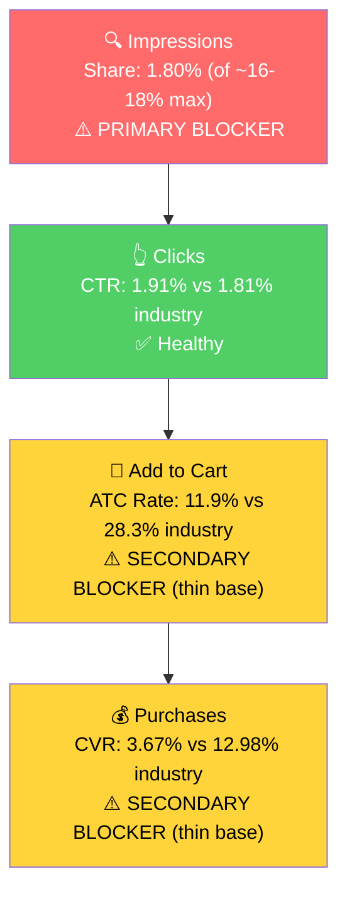

# Seller Central Audit - Hippo Outdoor

## Section 1: Catalog Assessment

| Priority | Product | 3-Mo Sales | 3-Mo Ad Spend | ROAS | TACoS | Organic Sales | Ad Sales % | Buy Box % | CVR (Mar) | Trend |
|----------|---------|-----------:|--------------:|-----:|------:|--------------:|-----------:|----------:|----------:|-------|
| P0 | Tarp Accessories (B0CM72RSS8) | $3,730 | $880 | 1.82 | 23.6% | $2,125 | 43.0% | 82.8%* | 8.9% | Declining |
| P1 | Fly Fishing Magnifying Glasses (B0CGHS9B6W) | $3,101 | $1,009 | 1.49 | 32.5% | $1,598 | 48.5% | 99.2% | 9.0% | Growing |
| P2 | Fly Fishing Sport Glasses (B0F5QHC9BW) | $2,321 | $543 | 2.58 | 23.4% | $921 | 60.3% | 98.8% | 13.2% | Growing fast |
| P3 | Waders Catch Bag (B0FRMTF1MZ) | $749 | $126 | 1.67 | 16.8% | $539 | 28.0% | 100% | 3.6% | Volatile |

*P0 parent buy box is dragged to 82.8% by a broken parent-shell ASIN (B0CM72RSS8 itself) at 0% buy box, zero sales. All 5 active children are at 99-100% buy box. See Section 2.

**Not prioritized:** The golf accessory line (B0C24CJ5YT, B0C24DXC49, B0CRZ7PDTC, B0G4XCF364, B0CNXNRTXG) produced under $15 in combined 3-mo sales; two have 0% buy box. Boat-safety stickers (B09Z9KYK31) and reading glasses (B0CM9M7ZWW) are similarly minor. The clip-on fishing glasses (B09SQB8WFV) sells small volume at 30x ROAS on ~$5 spend, effectively organic.

## Section 2: Qualitative Product Understanding (P0)

Hero child inside the P0 parent: **B09TB3FPKW - "HIPPO OUTDOOR Grommet Reinforcement Tape, 10-Pack (1220)."** Largest revenue contributor within the parent at ~47% share, 99.9% buy box, stable CVR 10-13%.

**Product:**
- 10-pack of self-adhesive, fiber-reinforced patches that apply over existing tarp grommets/eyelets to stop them from tearing out under load.
- Cross-woven fibers, UV-resistant, rated -25 to +65 C, peel-and-stick application.
- Value prop: a $10 fix that preserves a $50-200 tarp. The eyelet is the weakest point of any tarp and is usually the first thing to fail in a storm.
- Purchase motivation: preventative repair. Customers who already own the tarp and want to extend its life before the next storm or winter season.

**Customer:**
- Older, practical, DIY. Boat owners (the A+ copy leans heavily into boat use), RV/campground owners, farm, construction/job-site.
- Typical trigger: an eyelet ripped out after the last storm, or tarp going up for winter and they want insurance.

**Brand:**
- Registered brand, Swedish (Benares AB), with a legitimate DTC site at hippooutdoor.com.
- Amazon-first feel but real brand backbone. Product line is a narrow outdoor-accessories mix (tarp accessories, fly fishing, light golf).
- **Brand vibe:** utilitarian and practical. Not premium, not design-forward. Copy across the listing and A+ contains spelling and grammar errors ("euelet," "Rember that," "it's small investment in money and time"). Real operator, rough presentation.

**Competitive Landscape:**
- **Price positioning:** Category-average for a reinforcement patch / tarp-repair tape is $10-18. P0 runs at **~$10.79**. **Positioned at the low end** of the reinforcement-tape segment, well below the brass-grommet-kit segment ($15-25). Price is not the blocker.
- Two distinct competitive sets:

| Competitor | Approx Price | Set |
|-----------|-------------:|-----|
| Moose Supply Heavy Duty Tarp Repair Tape (B09ZFB2MRF) | ~$15 (2-pack) | Direct peel-and-stick tape |
| Gear Aid Tenacious Tape | $8-12 | Direct peel-and-stick tape (premium brand) |
| 103-piece Grommet Repair Kit (B002IN3J1E) | ~$15 | Substitute: brass grommets + tools |
| Edward Tools Grommet Kit | $12-20 | Substitute: brass grommets + tools |

- **Differentiator:** Hippo's product is the simplest fix - no tools, no new holes, applies over the existing grommet. "Reinforce before it breaks" is the real moat vs grommet kits (which require effort) and generic tape (which doesn't specifically reinforce the eyelet point).
- **Gap:** Hippo doesn't own the word "reinforce" or "preventative" in the title or lead bullet, even though that is the genuine point of difference.

**Listing Quality:**

**Strengths:**
- **Title** (162 chars, brand-led): includes "Grommet Reinforcement Tape," "Repair tarp Eyelets," "Tarpaulin Grommets kit," "Tarpaulins Protection," "10-Pack." All major keyword variants covered, no visible stuffing.
- **Bullets** (5 filled, detailed): cover strength, weather resilience, versatile applications (tents, greenhouses, pool covers, RV awnings), ease of application, and durability. Scannable "Benefit: explanation" format.
- **Image count** (9 images): complete gallery, better than most category competitors.

**Opportunities:**
- **A+ content is text-heavy and contains visible typos.** Six modules with paragraphs of copy alongside images. Typos: "euelet," "Rember that it," "it's small investment in money," "with out reinforcement." Per current best practice A+ should be image-only with any text baked into the graphics. Rebuild each module as a single designed image: (1) before/after of failed eyelet vs reinforced one, (2) 3-4 image application walkthrough, (3) use-case grid (boat cover, RV, tent, farm), (4) comparison vs brass grommet kits (no tools, no new holes), (5) comparison vs other Hippo tarp children.
- **No video.** The entire value prop is "peel, stick, done in 30 seconds." That is a video-shaped promise. A 20-30 second clip of a torn grommet area, patch going on, and the reinforced eyelet under rope tension answers the "does this actually hold?" hesitation that grommet-kit shoppers have about adhesive solutions.
- **Preventative messaging not owned in title or lead bullet.** Bullet 1 currently leads with "Unparalleled Strength." Reorder so bullet 1 leads with the no-tools / preventative angle (the real moat).
- **Category placement.** The ASIN is categorized under "Arts, Crafts & Sewing > Arts & Crafts Tape." Legitimate niche and it ranks well there (~500-900), but the target customer is shopping in Tools / Outdoors. Worth raising with the seller whether changing category is viable.

## Section 3: Quantitative Product Understanding (P0)

**Annual Trend:**

| Metric | Jun 2025 (peak) | Sep 2025 (buy box event) | Dec 2025 | Mar 2026 |
|--------|----------------:|-------------------------:|---------:|---------:|
| Total Sales | $2,952 | $2,003 | $1,760 | $1,202 |
| Sessions | 1,762 | 1,266 | 1,078 | 1,143 |
| CVR | 14.1% | 13.6% | 17.1% | 8.9% |
| Buy Box % | 98.6% | 83.3% | 83.0% | 82.8% |

- Peak was May-Jul 2025 (~$2,900/mo). Mar 2026 is ~$1,200/mo, a 60% decline from peak. The SQP data (see Section 4) shows that the market's actual peak is Oct-Nov, not summer - so this decline is **not primarily seasonal**. It is brand-specific.
- The **parent-level buy box drop in Sep 2025** (98% -> 83%) is driven entirely by the parent-shell ASIN (B0CM72RSS8 itself) sitting at 0% buy box and zero sales. All five active children remain at 99-100% buy box. This is a listing hygiene issue, not a MAP or competitive hijack problem, but it does distort parent-level reporting.

**Rating Trajectory:** Declining. 4.9 peak (Dec 2024), 4.8 (Jul 2025), 4.7 (Nov 2025), 4.3 (Jan 2026 and since). A slow 6-point slide over 12 months. Worth asking the seller about supplier/batch changes (see Section 7).

**Sales Rank Trajectory:** Stable in its niche subcategory (Arts & Crafts Tape). Fluctuates between rank ~470 and ~915 in April 2026. Consistent with steady demand at the current traffic level.

## Section 4: Market Opportunity (SQP)

**Tier Breakdown:**

- **Tier 1 (Hero - exact eyelet reinforcement intent):**
  - **Keywords:** grommets for tarps, tarp grommet kit, tarp grommet fasteners, tarp grommets, tarp fasteners for grommets
  - **Rationale:** The customer is searching for a solution to fix or reinforce tarp grommets. P0 is a direct answer.

- **Tier 2 (Core market - tarp repair tape/patches):**
  - **Keywords:** tarp repair kit, tarp repair kit heavy duty, tarp repair tape, tarp patch kit, tarp tape, tarp tape heavy duty waterproof
  - **Rationale:** Tarp repair intent broadly. P0 is one of several solutions (duct-tape-style repair tape, brass grommet kits, patch kits). Same "my tarp needs fixing" customer.

- **Tier 3 (Adjacent - tarp accessories):**
  - **Keywords:** tarp accessories
  - **Rationale:** Generic discovery searches. Volume is small; not a primary growth lever.

**Catalog overlap:** Multiple Hippo children under the P0 parent rank for tarp-related queries. Adjusted caps: Tier 1 ~16-18% (two products), Tier 2 ~24-27% (three products), Tier 3 ~8-9% (one product).

**Market Sizing:**

| Tier | Monthly Search Volume | Monthly Add to Carts (Market) | Monthly Purchases (Market) | Est. Market Size ($/mo) |
|------|---------------------:|------------------------------:|---------------------------:|-----------------------:|
| Tier 1 | 5,652 | 667 | 302 | $8,000 |
| Tier 2 | 4,969 | 630 | 303 | $7,560 |
| Tier 3 | ~501 | ~40 | ~15 | $480 |
| **Total P0** | **~11,122** | **~1,337** | **~620** | **~$16,040** |

*Estimated using $12 avg product price based on the competitive landscape in Section 2.*

**Blockers & Growth Path:**

| Tier | Impression Share | CTR (Brand vs Industry) | CVR (Brand vs Industry) | Primary Blocker | Growth Path |
|------|-----------------:|-------------------------|-------------------------|-----------------|-------------|
| Tier 1 | **1.80%** (of ~16-18% max) | 1.91% vs 1.81% (Healthy) | 3.67% vs 12.98% (thin data) | **Impression Share** | PPC scaling: brand CTR is at/above industry, the listing clicks when seen, it just isn't seen enough. |
| Tier 2 | **0.76%** (of ~24-27% max) | 1.05% vs 1.82% (Blocker, but small base) | Insufficient volume | **Impression Share** | PPC scaling: brand impressions are down 60% YoY on Tier 2 queries, tracking the revenue decline. Win impressions back first. |
| Tier 3 | 0.67% | Insufficient | Insufficient | N/A (tiny) | Skip as a primary lever. |

**ICAP Funnel Visual (Tier 1 - highest-growth tier):**

- The brand's share has been stable at 1.7-2.3% on Tier 1 all 12 months. Plenty of room to grow within the ~16-18% cap.
- Tier 2 brand impressions fell from ~2,000/mo (Apr 2025) to ~700/mo (Mar 2026). This tracks the P0 parent revenue decline (from $2,900 peak to $1,200 now) 1-to-1. The most likely cause is a pullback of paid impressions on Tier 2 queries; ad data only goes back to Jan 2026 so cannot be confirmed on the ad side. This is the main thing to diagnose with the seller.
- No meaningful branded search volume. A branded defense campaign is not needed yet.

## Section 5: Ad Analysis

Data window: Jan 11 - Apr 9, 2026 (89 days; ad data only goes back this far). Total account spend $2,970 → $5,940 sales → **account ROAS 2.00**.

### Account Level

**Campaign Structure**

> **Finding: Catch-all campaigns pool multiple child ASINs and starve the high-ROAS children inside them.**
>
> **Problem:**
> - Fishing Glasses 2025 ($1,480 spend, 1.93 ROAS) mixes 5 child ASINs across 2 parents. B0CGHS9B6W gets $1,008 at 1.50 ROAS while B0F4R4YGCZ at 3.58 ROAS gets only $85.
> - Tarp Automatic ($624, 1.66 ROAS) mixes 4 of the 6 P0 children. B0BGJ82Q64 at **3.92 ROAS** gets only $45 while B09TB3FPKW at 1.58 ROAS gets $439.
> - Tarp 100 - 400 ($66, **3.44 ROAS**) is the best-performing P0 campaign and gets the smallest budget.
>
> **Solution:**
> - Separate campaigns per child ASIN with dedicated budgets.
> - Scale the children hitting 3-4x ROAS; cap the ones at 1.2-1.5x until targeting or listing improves.
>
> **Impact:**
> - If B0BGJ82Q64 is peeled out of Tarp Automatic with $200/mo at its current 3.92 ROAS, and B09TB3FPKW is scaled back to $284/mo:
> - Current: $484 spend → $869 sales
> - After: $484 spend → $1,233 sales
> - **+$364 sales (+42%) on the same $484 budget, per 90-day window.**

**Auto vs Manual Split**

| Targeting Type | Clicks | Spend | Sales | ROAS | AOV | CPC | CVR |
|----------------|-------:|------:|------:|-----:|----:|----:|----:|
| Automatic | 1,812 | $1,086 | $2,196 | 2.02 | $14.94 | $0.60 | 8.11% |
| Manual | 2,696 | $1,884 | $3,744 | 1.99 | $14.34 | $0.70 | 9.68% |

Manual drives 63% of spend at comparable ROAS. Split is healthy on the surface. The deeper issue is under Match Type (below).

**Campaign Profitability**

> **Finding: The whole account flirts with unprofitability. $2,628 of $2,970 spend (88%) runs at 1.66-1.98 ROAS.**
>
> **Problem:**
> - Below 1.5x: Safety chart - Auto ($53, 0.59 ROAS), Campaign - 3/2/2026 ($22, 1.38) - small, $75 total waste.
> - Below 2.0x (the real issue): Tarp Automatic ($624, 1.66), Fishing Glasses 2025 ($1,480, 1.93), Tarp Unique ($325, 1.89), Reading glasses ($199, 1.98). Combined $2,628 at 1.86 ROAS on a ~$12 AOV product is break-even or slightly negative after COGS and Amazon fees.
>
> **Solution:** Restructure per Campaign Structure above. Peel winning child/keyword combos into dedicated 3-5x ROAS campaigns and pull budget out of the catch-alls.
>
> **Impact:** If 50% of the spend in the four big campaigns ($1,314) shifts to 3.5x ROAS campaigns, that $1,314 generates $4,600 vs the current $2,460 at 1.86 ROAS. **+$2,140 in sales per 90 days (~$713/mo) from reallocation alone.**

**Targeting Strategy**

Keyword vs Product Targeting:

| Targeting Strategy | Clicks | Spend | Sales | ROAS | AOV | CPC | CVR |
|-------------------|-------:|------:|------:|-----:|----:|----:|----:|
| Keyword Targeting | 4,379 | $2,977 | $5,628 | 1.89 | $14.32 | $0.68 | 8.97% |
| Product Targeting | 226 | $67 | $342 | **5.11** | $21.35 | $0.30 | 7.08% |

> **Finding: Product targeting runs at 5.11 ROAS with only 2% of spend.** When the brand shows up on competitor product pages, it converts at better than half the CPC of keyword targeting. Build product targeting campaigns against the 4 main competitors (Moose Supply, Gear Aid, Edward Tools, 103-piece kit) and run defensive ads on Hippo's own top children.

Match Type Breakdown:

| Match Type | Clicks | Spend | Sales | ROAS | AOV | CPC | CVR |
|------------|-------:|------:|------:|-----:|----:|----:|----:|
| EXACT | 81 | $66 | $169 | 2.57 | $15.34 | $0.81 | 13.58% |
| PHRASE | 81 | $59 | $182 | 3.10 | $12.98 | $0.72 | 17.28% |
| BROAD | 2,058 | $1,438 | $2,653 | 1.84 | $14.58 | $0.70 | 8.84% |

> **Finding: Harvest-and-scale loop is not running.** BROAD absorbs 92% of manual keyword spend at 1.84 ROAS and 8.84% CVR. EXACT and PHRASE have 1.4-1.7x better ROAS and ~2x better CVR but together receive only $125 over 90 days. The winning search terms surfacing inside BROAD have not been promoted into dedicated EXACT campaigns.
>
> **Solution:** Mine BROAD campaigns for top-converting search terms, launch EXACT campaigns for each, taper BROAD budget. This is the mechanism that solves the impression-share problem in Section 4.

### Product Level (P0)

**P0 Campaign Map**

| Campaign | Spend | Sales | ROAS | Clicks | Orders |
|----------|------:|------:|-----:|-------:|-------:|
| Tarp Automatic | $624 | $1,038 | 1.66 | 759 | 75 |
| Tarp Unique - 15 feb | $325 | $615 | 1.89 | 586 | 35 |
| Tarp 100 - 400 | $66 | $227 | 3.44 | 83 | 17 |
| **P0 Total** | **$1,015** | **$1,880** | **1.85** | **1,428** | **127** |

P0 = 34% of account spend and 32% of account ad sales. Hero child B09TB3FPKW gets ~$662 of the P0 spend.

**Impression Share Blocker: Tier 1/2 Keyword Spend vs. Intent-Match**

Section 4 identified impression share as the primary blocker on both Tier 1 and Tier 2. The PPC lever is: bid on the keywords where impression share is low. Search-term-level data shows a clear mismatch between intent and spend.

Tier 1 (grommet / eyelet reinforcement) top terms:

| Search Term | Spend | Sales | ROAS | Clicks | Orders | CVR |
|-------------|------:|------:|-----:|-------:|-------:|----:|
| tarp grommet reinforcement | $15.13 | $105.70 | **6.99** | 25 | 9 | 36% |
| grommet reinforcement | $8.93 | $108.76 | **12.18** | 12 | 5 | 42% |
| tarp eyelet reinforcement | $5.38 | $40.95 | **7.61** | 8 | 3 | 38% |
| grommet reinforcement tape | $4.51 | $32.91 | **7.30** | 5 | 2 | 40% |
| tarp grommet kit heavy duty | $23.21 | $69.84 | 3.01 | 29 | 4 | 14% |
| tarp grommet kit | $53.38 | $42.88 | **0.80** | 73 | 4 | 5% |
| grommets for tarps | $48.02 | $65.87 | 1.37 | 59 | 5 | 8% |

Tier 2 (tarp repair / tape / patch) top terms:

| Search Term | Spend | Sales | ROAS | Clicks | Orders |
|-------------|------:|------:|-----:|-------:|-------:|
| tarp repair tape | $2.85 | $53.91 | **18.92** | 5 | 1 |
| tarp patch kit heavy duty | $2.31 | $64.87 | **28.08** | 3 | 5 |
| tarp patch | $7.92 | $44.97 | 5.68 | 11 | 2 |
| tarp tape heavy duty waterproof | $8.79 | $31.91 | 3.63 | 13 | 4 |

> **Finding: The "reinforcement" cluster is the recoverable revenue.**
>
> **Problem:**
> - The four reinforcement-intent terms (tarp grommet reinforcement, grommet reinforcement, tarp eyelet reinforcement, grommet reinforcement tape) got combined **$34 of spend over 90 days** and returned $288 at 7-12x ROAS with 36-42% CVR.
> - At the same time, one substitute-intent term ("tarp grommet kit" - people searching for brass grommet *tools*, not reinforcement tape) consumed $53 and returned 0.80 ROAS.
> - The highest-intent Tier 2 terms ("tarp repair tape," "tarp patch kit heavy duty") each got $2-3 of spend despite returning 18-28x ROAS.
>
> **Solution:**
> 1. Build a dedicated EXACT match campaign on the reinforcement cluster: `tarp grommet reinforcement`, `grommet reinforcement`, `grommet reinforcement tape`, `tarp eyelet reinforcement`, `tarp reinforcement tape`. Target $100-200/mo as a starting cap.
> 2. Build a dedicated EXACT campaign on the Tier 2 hero terms: `tarp repair tape`, `tarp patch kit`, `tarp tape heavy duty waterproof`, `tarpaulin tape`, `tarp patch`. Target $100-200/mo.
> 3. Negate irrelevant terms: `grommet kit` (non-tarp), `grommets for fabric`, `plastic grommets`, `grommet tool kit`, `tarp clips`, `tarp connectors`, `landscaping tarp`, `camping tarp`.
> 4. Lower bids on `tarp grommet kit` (0.80 ROAS) and `grommets for tarps` (1.37 ROAS).
>
> **Impact:**
> - Reinforcement cluster scaled from $34/90d to $400/90d at ~8x avg ROAS: **$3,200 incremental sales/90 days (~$1,067/mo).**
> - Tier 2 EXACT cluster scaled from ~$25/90d to $400/90d at ~5x avg ROAS: **$2,000 incremental sales/90 days (~$667/mo).**
> - Combined: ~$1,700/mo in recoverable revenue from ad reallocation alone, which by itself closes about a third of the gap vs the P0 2025 peak.

## Section 6: Action Plan

The primary blocker across both Tier 1 and Tier 2 is impression share. The fastest lever is PPC (keyword spend reallocation). Listing levers (A+ rebuild, video) come after because they are slower to implement and amplify the PPC work.

### Weeks 1-2: Immediate Actions

The blocker is visibility on high-intent queries that today are funded at $2-15 each. Week 1-2 is entirely about re-pointing the existing ad budget at those queries.

- **Launch dedicated EXACT campaign** on the reinforcement-intent cluster: `tarp grommet reinforcement`, `grommet reinforcement`, `grommet reinforcement tape`, `tarp eyelet reinforcement`, `tarp reinforcement tape`. Seed at $150/mo, pointed at B09TB3FPKW. (Tied to Section 5 impression share finding.)
- **Launch dedicated EXACT campaign** on the Tier 2 hero cluster: `tarp repair tape`, `tarp patch kit`, `tarp tape heavy duty waterproof`, `tarpaulin tape`. Seed at $150/mo across B09TB3FPKW and B0BGJ82Q64.
- **Negate irrelevant terms** across current campaigns: `grommet kit` (non-tarp), `grommets for fabric`, `plastic grommets`, `grommet tool kit`, `tarp clips`, `tarp connectors`, `landscaping tarp`. (Section 5.)
- **Cap or lower bids** on `tarp grommet kit` (0.80 ROAS) and `grommets for tarps` (1.37 ROAS) inside Tarp Automatic. (Section 5.)
- **Pause Safety chart - Auto** ($53 at 0.59 ROAS - small but pure waste).
- **Fix the parent-shell ASIN B0CM72RSS8.** Either merge it into an active child or suppress it so it stops suppressing parent-level buy box reporting at 83%. (Section 2.)

### Weeks 2-4: Short-Term Optimizations

- **Peel B0BGJ82Q64 (Tarpaulin Repair Tape) out of Tarp Automatic** into its own campaign with $150-200/mo. Currently hitting 3.92 ROAS on $45; the budget starvation is the only reason it's not bigger. (Section 5 reallocation math.)
- **Peel B0F4R4YGCZ (fly fishing glasses, orange magnet) out of Fishing Glasses 2025** into its own campaign at $100-150/mo. Currently at 3.58-8.69 ROAS with tiny spend. (Note: this is P2 acceleration, not P0, but same structural issue.)
- **Mine Tarp Automatic and Fishing Glasses 2025 BROAD search terms.** Extract any additional converters (CVR > 10%, ROAS > 3x, 3+ clicks) into the new EXACT campaigns. (Section 5 harvest-and-scale finding.)
- **Launch product-targeting campaign** against Moose Supply (B09ZFB2MRF), Gear Aid Tenacious Tape, and the 103-piece Grommet Repair Kit (B002IN3J1E). Seed at $100/mo. Current product targeting is at 5.11 ROAS with only 2% of spend. (Section 5.)
- **Begin A+ content redesign (writing and mockups only, not yet published).** Rebuild the six text-heavy modules into image-only modules per Section 2. Content-side work only in this phase, publish in Weeks 4-6.
- **Prep video asset.** Script and shoot a 20-30 sec peel-stick demo clip on a torn tarp eyelet. Publish in Weeks 4-6.

### Weeks 4-6: Medium-Term Growth

- **Publish the A+ rebuild.** Image-only modules, including the "reinforcement before it breaks" framing that is absent from the current listing. (Section 2.)
- **Publish the video** in the listing. Addresses the main "does tape actually hold?" hesitation for substitute-set shoppers.
- **Reorder bullet 1** to lead with the no-tools / preventative angle instead of "Unparalleled Strength." (Section 2.)
- **Monitor CVR on Tier 2 terms.** Tier 2 is where the shopper is weighing substitutes (grommet kits vs tape), so listing quality matters most there. Expect a CVR lift on Tier 2 traffic after A+ and video go live; if it doesn't materialize, the deeper issue is product positioning.
- **Continue PPC scaling** on the winning EXACT campaigns from Weeks 1-4 based on measured ROAS, keeping each at 3x+ as a floor before adding budget.

### Weeks 6-8: Scaling and Evaluation

- **Scale the top 2-3 EXACT campaigns** that are holding 3x+ ROAS. Double the budget on the ones that sustain it.
- **Evaluate the golf product line.** Decide (with the seller) whether to delete, rebuild, or leave the 4-5 golf ASINs with 0 sales / 0% buy box. These are dead weight on the catalog today.
- **Begin P2 (Fly Fishing Sport Glasses) evaluation.** P2 is the cleanest growth story in the account (4.7x revenue growth in 3 months) and the natural next focus after P0 is stabilized.
- **Start positioning for Tier 1 seasonal peak.** Market search volume for tarp reinforcement peaks Oct-Nov. The account should be structurally ready by then.

## Section 7: Insights & Questions for the Seller

**Insights:**

- **P0 (Grommet Reinforcement Tape): "Reinforcement"-intent search terms are the biggest untapped lever in the account.** Four queries (tarp grommet reinforcement, grommet reinforcement, tarp eyelet reinforcement, grommet reinforcement tape) collectively received $34 of ad spend over 90 days and returned $288 at 7-12x ROAS with 36-42% CVR. The listing clicks and converts at the top of the market on these terms; it just isn't funded there.
- **P0 (Grommet Reinforcement Tape): the 2025 revenue decline is not seasonal.** Market search volume peaks Oct-Nov (pre-winter) and Aug-Oct for tarp repair; the seller's revenue peaked May-Jul and declined through the market's actual peak season. The decline tracks a 60% drop in Tier 2 impression share over the same 12 months, which points to a pullback in paid visibility on tarp repair queries.
- **P0 (Grommet Reinforcement Tape): the parent-level buy box at 82.8% is a reporting artifact**, not a real problem. The parent-shell ASIN (B0CM72RSS8 itself) sits at 0% buy box and zero sales. All five active children are at 99-100% buy box. This is a listing hygiene fix, not a MAP or competitive hijack situation.
- **Account-wide: the harvest-and-scale loop is not running.** BROAD match absorbs 92% of manual keyword spend at 1.84 ROAS while EXACT and PHRASE sit at 2.57 and 3.10 ROAS with $125 combined spend. The winning search terms inside BROAD campaigns have not been promoted to dedicated EXACT campaigns.
- **Account-wide: campaign structure is pooling too many ASINs per campaign.** High-ROAS children (e.g., B0BGJ82Q64 at 3.92 ROAS, B0F4R4YGCZ at 3.58-8.69 ROAS) are being starved inside catch-all campaigns. Peeling them into dedicated campaigns generates meaningful revenue on the existing budget.
- **Account-wide: product targeting is massively underweight.** 5.11 ROAS on 2% of spend means competitor conquesting and own-ASIN defense are nearly unused levers.

**Questions for the Seller:**

- P0 (Grommet Reinforcement Tape): Rating dropped from 4.9 to 4.3 over the past 12 months. Has there been a supplier change, a batch quality issue, or recent negative reviews that we should know about?
- P0 (Grommet Reinforcement Tape): Tier 2 (tarp repair/tape) brand impressions dropped from ~2,000/mo in April 2025 to ~700/mo in March 2026. Our ad data only goes back to January 2026, so we cannot see what changed. Did you pause or reduce spend on tarp-repair keyword campaigns during mid-2025? This looks like the primary driver of the revenue decline, and we want to confirm before building a plan around it.
- P0 (Grommet Reinforcement Tape): the parent shell ASIN (B0CM72RSS8, "Tarpaulin Protection Tape") has zero sales and 0% buy box but is still live. Is it an intentional placeholder, an old variant that was never cleaned up, or something we should merge/suppress?
- **Golf line (B0C24CJ5YT, B0C24DXC49, B0CRZ7PDTC, B0G4XCF364):** near-zero sales with two ASINs at 0% buy box. Intentional deprioritization, or listings that are broken without your knowing?
- P3 (Waders Catch Bag): $0 ad spend in February, $122 in March. Was February an inventory pause, a budget decision, or something else?
