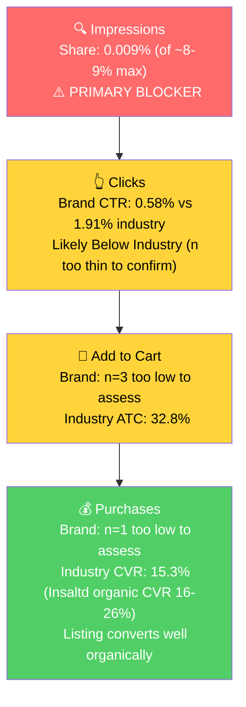

# Seller Central Audit — Insaltd™

**Hero ASIN:** B0GC18NZC4 (INSALTD Electrolytes — sugar-free, no-stevia hydration powder packets)
**Audit prepared:** 2026-04-30

## Headline

**Insaltd is a brand with a working product and an unbuilt distribution engine.** P0 has scaled from $192 in Jan to a $10K April run rate purely organically, with $0.44 in total Amazon ad spend and 0.009% impression share on its Tier 1 keywords. The product has a defensible wedge (LMNT-tier sodium content, no stevia), strong organic conversion (16-26% blended CVR), and a real off-Amazon brand (DTC at getinsaltd.com, Hyrox-athlete positioning, retail distribution, influencer partnerships). The single largest growth lever is launching Amazon PPC against Tier 1 search demand worth $2.18M/month at the market level. A 1% capture = $22K/month incremental at $5-7K/month spend; a 3% capture (still well below cap) = $65K+/month at $15-21K/month spend.

## 1. Catalog Assessment

| Priority | Product | 3-Mo Sales | 3-Mo Ad Spend | ROAS | TACoS | Organic Sales | Ad Sales % | Buy Box % | CVR | Trend |
|----------|---------|-----------|--------------|------|-------|---------------|-----------|-----------|-----|-------|
| P0 | Electrolytes (B0GC18NZC4) — new listing | $7,667 | $0 | n/a | 0% | $7,667 | 0% | ~96% | 16.7% | Growing |
| P1 | Sugar Free Electrolytes (B0CBCJQRM1) — old listing | $597 | $0.44 | n/a | 0% | $597 | 0% | ~62% | 7.0% | Declining (dead) |

**Why no P2/P3:** the catalog has only 2 parents, both for the same product line. The older parent is the same SKU set under a previous ASIN; it collapsed in Dec 2025 / Jan 2026 (buy box dropped to 51.7%, sessions surged to 2,208, CVR fell to 6.2%) and went to $0 in Feb 2026. The new parent (B0GC18NZC4) appears to be a deliberate relist starting Jan 2026.

**P0 hero child:** Variety Pack (B0GC1LNJ76, 12-stick pack at ~$20) accounts for 52% of P0's March revenue. Single-flavor 28-packs (Citrus, Mango Passionfruit, Lemon Ginger, Grapefruit) at ~$40 each carry the rest. Grapefruit underperforms in March (5.6% CVR vs 13-19% on other flavors).

## 2. Qualitative Product Understanding (P0)

**Product:**
- Sugar-free, stevia-free electrolyte powder packets, sold as single-flavor 28-packs and a 12-stick variety pack (3 each of Citrus, Mango Passionfruit, Grapefruit, Lemon Ginger).
- Per-serving: **900mg sodium, 300mg potassium, 100mg magnesium, 18mg calcium**. Same high-sodium tier as LMNT (1,000mg), well above mass-market hydration brands like Liquid IV (~500mg).
- Sweetened with **Glyvia™**, a proprietary blend of glycine (an amino acid) plus Reb M. Glycine doubles as a hydration co-factor.
- Zero calorie, zero sugar, gluten-free; safe for pregnant/breastfeeding per bullets.
- "2026 revamped formula" referenced in the bullets, focused on improved solubility.
- Subscribe & Save eligible.

**Customer:**
- Active health-conscious adults (~25-45) using electrolytes for keto, intermittent fasting, running, HIIT, brain fog. Brand's DTC site (getinsaltd.com) explicitly positions for **Hyrox athletes** (functional-fitness competition format).
- Core driver: customers who want LMNT-tier sodium without stevia. A customer-uploaded video on the older listing is titled *"Good frugal alternative to LMNT"*, which is the brand's natural market position.

**Brand:**
- Registered, trademarked, real DTC presence at **getinsaltd.com**, plus distribution through specialty retailers (NutriChem, Body Energy Club).
- Influencer-driven marketing off-Amazon: dedicated landing pages for Cole Shoults and Eminent Holistics; Amazon listings carry videos from Aidan Chin (running) and Sarah Beers (review).
- Brand vibe: athletic/functional with a cheeky tone (the wordplay "Insaltd" = "in-salted" / "insulted"). More approachable than LMNT, less clinical than Pedialyte.
- Brand Store on Amazon: Yes.

**Competitive Landscape:**

Price positioning: **LMNT 30-stick variety ~$45 ($1.50/serving) | Insaltd 12-stick variety ~$20 ($1.67/serving) | Insaltd 28-stick single ~$40 ($1.43/serving)**. Insaltd is at price parity with LMNT per serving and offers a smaller starter pack to reduce trial friction.

| Competitor | Key Product | Sodium | $/serving | Positioning |
|------------|-------------|--------|----------|-------------|
| LMNT | 30-stick variety | 1,000mg | $1.50 | Premium, paleo/keto, stevia |
| Liquid IV | Hydration Multiplier | ~500mg | $1.00 | Mass-market, sugar |
| Hydrant | Hydrate sticks | ~260mg | $1.00 | Mass-market, low sodium |
| Re-Lyte (Redmond) | Hydration | 810mg | $1.10 | Premium, real-salt purist |
| Drip Drop | ORS sticks | ~330mg | $0.85 | Medical/recovery |

Realistic competitive set in the high-sodium/clean-sweetener slot: LMNT, Re-Lyte, Insaltd. The "no stevia" claim is Insaltd's narrowest, most defensible wedge.

**Listing Quality:**

> Note: the Keepa snapshot returned `image_count = 0` for every Insaltd child ASIN, including the older listing that sold for 18 months. This is a Keepa data ingestion gap, not a real listing defect. Image quality should be verified visually before the call.

**Strengths:**
- **Bullets** (6, ~240 chars each, all-caps benefit headers): well-structured, lead with the brand's primary differentiator (glycine sweetener), include real product specs (sodium/potassium/magnesium amounts), and cover real use cases.
- **A+ Content:** Premium A+ with 7 image-only modules (alt text present, no standalone text modules — matches 2026 best practice).
- **Brand Store:** Active.
- **Title:** 186 chars, brand included, no keyword repetition, carries the major value props (sugar-free, no stevia, high potency, fasting, water additive).

**Opportunities:**
- **Video on the new parent (B0GC18NZC4)**: the older listing carried two seller-uploaded videos plus three influencer videos. Per the Keepa snapshot, the new listing's children currently show no videos. Existing assets need to be re-attached. 1-2 hour effort.
- **Rating trajectory** (see Section 3): 4.4 (Apr 10) → 3.7 (Apr 23). This is the listing's most material near-term risk. Specific cause needs investigation in recent 1-3 star reviews.

## 3. Quantitative Product Understanding (P0)

**Trajectory (B0GC18NZC4 only — listing launched Jan 2026):**

| Metric | Jan 2026 | Feb 2026 | Mar 2026 | Apr 2026 (3 weeks) |
|--------|---------|---------|---------|--------------------|
| Total Sales | $192 | $2,137 | $5,338 | $7,369 (run rate ~$10K/mo) |
| Sessions | 24 | 383 | 1,229 | ~1,317 |
| CVR | 20.8% | 18.0% | 16.4% | 22.0% |
| Buy Box % (child level) | 100% | 96.4% | 96.5% | ~96% |

- Sessions grew 50x in 3 months with zero ad investment. The listing has organic momentum independent of category seasonality (Q1 is the seasonal trough for hydration; the brand grew through it).
- Blended CVR consistently 16-26%, well above industry norms (~10-12% on broad electrolyte queries, 15.3% on Tier 1).
- Buy box at the child level is healthy (94-100%). Parent-level dips to 81-87% are dilution from a placeholder child ASIN; ignore at parent level.

**Rating Trajectory:** **Declining since mid-April.** Started at 4.4 stars on Apr 10, slid to 3.7 by Apr 23. The drop coincides with the late-March traffic surge — newer review cohorts are leaving lower ratings than early adopters. Single most important variable to stabilize before scaling PPC.

**Sales Rank Trajectory:** Improving. In the Electrolyte Replacements sub-category, rank moved from ~470 to ~390 over the last week of April. Listing is becoming structurally more competitive in its native category.

## 4. Market Opportunity (SQP)

### Tier Breakdown

- **Tier 1 (Hero):**
  - **Keywords:** electrolytes powder packets, electrolyte packets, sugar free electrolyte powder packets, electrolytes without stevia, zero sugar electrolytes, hydration packets, instant hydration packets
  - **Rationale:** Customer is searching for exactly an electrolyte/hydration powder packet, often with sugar-free or stevia-free intent. Insaltd is a direct answer.

- **Tier 2 (Core market):**
  - **Keywords:** electrolytes, electrolytes powder, electrolyte powder, electrolyte, electrolyte drink, hydration powder
  - **Rationale:** Broader category. Customer wants electrolytes without specifying packets or sugar-free. Insaltd is one of many viable answers.

- **Tier 3 (Adjacent):**
  - **Keywords:** keto electrolytes, intermittent fasting, running accessories, marathon essentials, iv hydration packets, glycine powder
  - **Rationale:** Use-case-driven (keto, fasting, running) and ingredient (glycine powder) queries where Insaltd is one possible solution.

- **Conquest (separate from tiers):** lmnt, lmnt electrolytes, ultima electrolytes, cure hydration, element electrolytes, nuun electrolytes, plus LMNT flavor variants. ~500K+ monthly searches combined where the brand has a defensible "no stevia" answer.

### Market Sizing

| Tier | Avg Monthly Search Vol (12-mo) | Avg Monthly Cart Adds (Q1) | Avg Monthly Purchases (Q1) | Est. Market Size ($/mo) |
|------|-------------------------------|----------------------------|----------------------------|------------------------|
| Tier 1 | ~484K | ~72.6K | ~33.8K | **~$2.18M** |
| Tier 2 | ~915K | ~123.3K | ~56.9K | **~$3.70M** |
| Tier 3 | ~30K | ~9K | ~4.4K | **~$270K** |
| **Total P0** | **~1.43M** | **~204.9K** | **~95.1K** | **~$6.15M / mo (~$74M / yr)** |

*Estimated using $30 average product price (mix of 12-stick variety packs and 28-stick singles), based on competitive landscape.*

### Blockers & Growth Path (Q1 2026, 3-month window)

| Tier | Impression Share | CTR (Brand vs Industry) | CVR (Brand vs Industry) | Primary Blocker | Growth Path |
|------|-----------------|-------------------------|-------------------------|-----------------|-------------|
| Tier 1 | **0.009%** (vs ~8% cap) → BLOCKER | 0.58% vs 1.91% (low n: 19 brand clicks Q1) | 5.3% vs 15.29% (n=1 — too thin) | **Impression Share** | PPC scaling on Tier 1 keywords. Listing CVR is strong organically; getting impressions is the entire fix. |
| Tier 2 | **0.002%** → BLOCKER | n/a (9 clicks Q1) | n/a | **Impression Share** | PPC scaling, secondary priority. Tier 2 is 1.7x larger; 0.5% capture = $18K/mo. |
| Tier 3 | **0.0005%** → BLOCKER | n/a | n/a | **Impression Share + intent fit** | Selective PPC. Mix of use-case + ingredient queries; test before scaling. |

### 12-Month Funnel: Brand vs Industry (Apr 2025 - Mar 2026)

The 3-month rates above are too thin for confident CTR/CVR comparison. Annual data unlocks Tier 1 with statistically meaningful volume, but with a critical caveat — most of the 12-month brand-side activity came from the **old listing (B0CBCJQRM1) before its Dec 2025 collapse**, not the new listing. Read the rates as describing the old listing.

**Tier 1 — 12-month volume-weighted rates**

| Metric | Brand | Industry | Gap | Brand n | Confidence |
|--------|-------|----------|-----|---------|------------|
| Impressions | 12,991 | 137.4M | 0.0095% share | — | — |
| **CTR** | **1.12%** | **1.89%** | **-41%** | 145 clicks | ✅ Statistically meaningful |
| **ATC rate** | **9.66%** | **32.35%** | **-70%** | 14 cart adds | Borderline but gap too large to be noise |
| **CVR** | **2.07%** | **14.71%** | **-86%** | 3 purchases | Thin in absolute terms; gap is directionally clear |

**Tier 2 — 12-month volume-weighted rates**

| Metric | Brand | Industry | Gap | Brand n | Confidence |
|--------|-------|----------|-----|---------|------------|
| Impressions | 3,873 | 258.0M | 0.0015% share | — | — |
| CTR | 0.83% | 1.77% | -53% | 32 clicks | Still too thin for confident comparison |
| ATC rate | 18.75% | 28.33% | -34% | 6 cart adds | Too thin |
| CVR | 12.5% | 12.74% | ~par | 4 purchases | Too thin |

**Tier 3 — 12-month:** 720 brand impressions, 3 brand clicks. Not analyzable.

**What this changes vs the 3-month read:**

1. **The old listing genuinely had CTR/CVR problems**, not only impression-share problems. CTR was 41% below industry, ATC 70% below, CVR 86% below. Combined with the Dec 2025 buy box collapse, this is consistent with a structurally underperforming listing. **It's likely part of why the seller relisted.**
2. **The new listing's organic PDP CVR (16-26% per Seller Analytics) is at or above industry CVR (14.71%)**, a sharp inversion of the old listing's SQP signal. The relist fixed real conversion problems, not just dodged a listing-health issue.
3. **PPC ROAS calibration changes:** scaling on the old listing would have wasted spend (CVR 86% below industry would have produced terrible ROAS). Scaling on the new listing should perform meaningfully better — provided the April rating slide (Section 3) is stabilized first, since a falling rating could push CVR back toward the old listing's profile.

### ICAP Funnel — Tier 1 (Highest Growth Potential)

**Reading the funnel:** the brand barely shows up (impression share 0.009% vs 8-9% cap). When it does show up, click rates *appear* below industry but the sample size (19 clicks across 3 months) is too thin to call it a CTR problem. Cart-add and purchase stages can't be assessed at all from SQP, but the listing's own organic CVR (16-26%) suggests conversion is genuinely healthy. **The funnel resolves into a single sentence: visibility is the problem, conversion isn't.**

**Additional context:**
- Brand growth ran counter to category seasonality in Q1 2026 — the brand scaled through the seasonal trough purely on listing momentum. Q2-Q3 is the seasonal hydration peak; PPC + seasonal tailwind compound.
- Branded volume on Insaltd's own name appears low in SQP, so a small (2-3%) defensive campaign on "insaltd" is sufficient. Growth comes from non-branded + conquest.

## 5. Ad Analysis

### Critical Limitation

**The seller has effectively no Amazon advertising activity.** Seller-analytics MCP shows 15 days of ad data with $0.44 total spend and 0 clicks. Metabase Campaign Analysis V1 returned zero rows for the seller across all spelling variants for the full year. There is no current ad infrastructure to optimize. This entire section is reframed from "what's broken" to "what to build."

### Account Level — What Needs to Exist

**Campaign Structure**

> **Finding: No campaign infrastructure exists. Build it.**
>
> **Problem:**
> - Zero active campaigns in 2025 or Q1 2026.
> - $0.44 total spend across 15 days of ad data.
> - Listing has been carrying 100% of P0's $5K-10K monthly run rate organically.
>
> **Solution:** Launch a 4-campaign starter mix on P0 (detail in P0 Campaign Map below).
>
> **Impact:**
> - Tier 1 monthly market = $2.18M cart-add value at industry CVR.
> - 1% Tier 1 cart-add capture at brand's likely PPC ROAS of 3-4x = +$22K/month sales at ~$5-7K monthly spend.
> - 3% Tier 1 capture (still well below 8-9% cap) = +$65K/month at ~$15-21K monthly spend.

**Auto vs Manual Split (recommended launch)**

| Phase | Auto | Manual SP (Keyword) | Manual SP (Product Targeting) | Sponsored Brands | Sponsored Display |
|-------|------|---------------------|-------------------------------|------------------|-------------------|
| Weeks 1-2 | 25% (discovery) | 40% (Tier 1 exact + phrase) | 15% (own-ASIN defense + light conquest) | 10% (brand store) | 10% (LMNT/Ultima conquest) |
| Weeks 4+ | 15% | 50% (graduated Tier 1 + Tier 2) | 15% | 10% | 10% |

The 25% auto allocation in Weeks 1-2 is for keyword discovery; the brand has no PPC history, so harvesting search terms from auto is non-trivial. After 2-3 weeks, harvested converters move to manual exact and auto ramps down.

**Targeting Strategy: Keyword Targeting**

Tier 1 keywords go into manual SP keyword campaigns split by match type:
- **Exact:** electrolyte packets, electrolytes powder packets, sugar free electrolyte powder packets, hydration packets, electrolytes without stevia, zero sugar electrolytes, instant hydration packets
- **Phrase:** same set, broader reach
- **Broad:** wait until week 4+ once exact/phrase prove targets

Tier 2 keywords (electrolytes, electrolytes powder, electrolyte drink, hydration powder) go into a separate campaign launched in week 3-4 once Tier 1 hits target ACoS.

**Targeting Strategy: Product Targeting**

Run Sponsored Display + Sponsored Products product-targeting on competitor ASINs:
- LMNT 30-stick variety + LMNT single-flavor 30-sticks (primary conquest target)
- Ultima Replenisher
- Liquid IV Hydration Multiplier (volume leader)
- Cure Hydration single-flavor packs
- Element Electrolytes
- Drip Drop ORS

Creative narrative: "no stevia, same sodium tier, same flavors as LMNT but cleaner sweetener." This was customer-validated by an existing video on the older listing titled *"Good frugal alternative to LMNT"*.

**Branded Defense (small, mandatory)**

2-3% budget on Insaltd's own name. Branded volume is low today, but without a defensive campaign, any competitor running conquest on "insaltd" can poach intended customers.

### Product Level (P0) — Recommended Campaign Map

| Campaign | Type | Targeting | Budget Share | Tier Mapping |
|----------|------|-----------|--------------|--------------|
| INSALTD - Auto Discovery | SP Auto | All match types | 25% (W1-2), 15% (W4+) | All tiers, harvest into manual |
| INSALTD - Tier 1 Exact | SP Manual Keyword | Exact match Tier 1 | 25% | Tier 1 — primary blocker |
| INSALTD - Tier 1 Phrase | SP Manual Keyword | Phrase match Tier 1 | 15% | Tier 1 |
| INSALTD - Tier 2 Conservative | SP Manual Keyword | Exact + phrase Tier 2 | 10% (W4+ ramp) | Tier 2 |
| INSALTD - Conquest SP | SP Product Targeting | Competitor ASINs | 10% | Conquest sub-lever |
| INSALTD - Conquest SD | Sponsored Display | LMNT / Ultima ASINs | 5% | Conquest |
| INSALTD - Brand Store | Sponsored Brands | Brand store + headline | 7% | Awareness |
| INSALTD - Branded Defense | SP Manual Keyword | "insaltd" + variants | 3% | Defense |

Recommended starting daily budget: **$150-250/day ($4.5-7.5K/month)**, scaling to **$500-700/day ($15-21K/month)** by week 8 as winners are identified.

### Blocker-Specific Findings

> **Impression Share Blocker: Tier 1 keyword visibility (the entire growth thesis)**
>
> Section 4 SQP showed impression share is the primary blocker on every tier (Tier 1 at 0.009% vs 8-9% cap). The PPC lever is bidding on the keywords where impression share is low.
>
> **Problem:**
> - 0.009% Tier 1 impression share — invisible.
> - 0 brand purchases on Tier 1 in Jan 2026 SQP.
> - Industry Tier 1 CVR is 15.29%. Brand listing organic CVR is 16-26% (Section 3). The brand should convert at or above industry rates from day one.
>
> **Solution:**
> - Launch Tier 1 exact-match SP campaigns at aggressive starting bids (top-of-search modifier +50%).
> - Day-part budgets for peak hydration purchase windows (early morning + early afternoon, refine after 2 weeks of data).
>
> **Impact:**
> - 0.5% Tier 1 cart-add share by month 3 = ~$11K/month incremental.
> - 2-3% by month 6 = $50-65K/month incremental.

> **CTR/CVR — Not the immediate issue, but listing prep matters before scaling**
>
> SQP rates are too thin (19 brand clicks Q1) to confirm CTR/CVR blockers. But two listing items will compound ad efficiency and need to be fixed in parallel:
>
> **Problem:**
> - Rating slid 4.4 → 3.7 in 13 days. Scaling PPC against a falling rating wastes spend.
> - New parent (B0GC18NZC4) is missing the seller-uploaded brand video that exists on the older parent.
>
> **Solution:**
> - Read the recent 1-3 star reviews on B0GC1LNJ76 to identify the rating-slide cause before scaling Tier 2 spend.
> - Re-attach the brand video and influencer videos to B0GC18NZC4 (1-2 hour effort).
>
> **Impact:**
> - 0.3-star rating recovery typically delivers 3-8% CVR improvement in this category. At month 3 traffic levels = $1-3K/month additional sales for zero added ad spend.

## 6. Action Plan

The single biggest growth lever is impression share, addressable through PPC. Listing fixes (rating, video) compound it. Plan is ~80% PPC build-out and 20% listing reinforcement, sequenced so listing prep is not a blocker for launching Tier 1 PPC.

### Weeks 1-2: PPC Launch + Listing Asset Re-Attachment

**The primary blocker is impression share, so the first actions focus on getting the brand visible on Tier 1.**

- Build account-level campaign infrastructure: Auto Discovery, Tier 1 Exact, Tier 1 Phrase, Brand Store, Branded Defense (Section 5 campaign map).
- Launch all 5 starter campaigns at **$150-250/day total** with top-of-search bid modifiers +50% on Tier 1 exact-match keywords.
- Re-attach the existing brand video ("Why You'll Love Getting Insaltd," 30-sec) and influencer videos (Aidan Chin, Sarah Beers) to the new parent B0GC18NZC4.
- Read the most recent 1-3 star reviews on B0GC1LNJ76 to diagnose the April rating slide. If reformulation feedback is the cause, escalate to formula or messaging change before scaling further.

### Weeks 2-4: Conquest + Search-Term Harvest

**Tier 1 is feeding signal; now expand into conquest and harvest auto for unexpected winners.**

- Launch Conquest SP and Conquest SD campaigns targeting LMNT, Ultima, Liquid IV, Cure, Element, Drip Drop ASINs. Creative emphasizes "no stevia, same sodium, cleaner sweetener."
- Harvest converting search terms from Auto Discovery and graduate them into Tier 1 Exact at higher bids.
- Begin drafting listing copy refresh (no publish yet) addressing any rating-slide root cause uncovered in Week 1-2.
- Investigate Grapefruit child (B0GBZ337FV) low CVR (5.6% in March vs 13-19% on other flavors) — likely a pricing or main-image issue at the variant level.

### Weeks 4-6: Tier 2 Ramp + Listing Improvements Live

**Tier 1 is producing measurable ROAS; expand the funnel and publish listing improvements.**

- Launch Tier 2 Conservative campaign (electrolytes, electrolytes powder, electrolyte drink, hydration powder) at exact + phrase match. Bid conservatively given Tier 2's higher competition.
- Publish listing copy refresh and any image/A+ updates triggered by rating analysis.
- Scale Tier 1 winners' budgets; pause non-converting keywords above 90 click threshold.
- Increase total daily budget to $300-400/day if Tier 1 is hitting target ROAS (3-4x).

### Weeks 6-8: Scale + Seasonality Prep

**Listing is improved, Tier 1 + 2 are running, conquest is producing intent traffic. Scale into the Q2-Q3 hydration peak.**

- Increase total daily budget to $500-700/day ($15-21K/month) on proven keywords.
- Test broad-match on harvested Tier 1 winners.
- Add Sponsored Brands video creative (using the re-attached brand video).
- Evaluate whether Grapefruit and other underperforming children warrant a creative or pricing fix.
- Prepare for Q2-Q3 hydration peak: typical category sees ~1.7x summer search volume lift on Tier 1. Stock and budget accordingly.

## 7. Insights & Questions for the Seller

### Insights

- **P0 (Electrolytes) is generating $5K-10K/month organically with $0 ad spend and 0.009% Tier 1 impression share.** This is the single largest growth lever in the audit and the headline finding for the call.
- **P0's CVR (16-26% organic) exceeds industry CVR on every relevant tier.** The listing converts when traffic arrives — adding paid traffic should compound, not dilute. PPC scaling is the right play.
- **P0 grew 28x in Q1 2026 against a category seasonal trough.** The brand has organic momentum independent of market tailwind. PPC + entering Q2-Q3 hydration peak compounds two upward forces.
- **The "no stevia + LMNT-tier sodium" wedge is genuinely defensible and customer-validated** (existing customer video literally calls Insaltd "a frugal alternative to LMNT"). This makes conquest on LMNT-branded queries a meaningful sub-lever, not just a commodity strategy.
- **The Variety Pack (B0GC1LNJ76) drives 52% of P0 revenue at a $20 price point.** Lower entry price reduces trial friction vs LMNT's $45 starter pack. This is the SKU to lead with in PPC creative.

### Questions for the Seller

- **What happened to the original listing (B0CBCJQRM1) in Dec 2025 / Jan 2026?** The listing was healthy at $3-6K/month for 18 months, then buy box collapsed to 51.7%, sessions surged to 2,208, CVR fell to 6.2%, and the listing went to $0. Was this a deliberate relist (creating B0GC18NZC4 fresh), or did something happen to the old listing (suppression, hijack, MAP issue)? The same risk applies to the new listing.
- **What drove the late-March traffic surge on P0?** Sessions jumped from 261 (week of Mar 22) to 1,306 (week of Mar 29) with no ad spend. Likely candidates: a creator post, press mention, or TikTok video. Knowing the source affects how we plan PPC scaling against organic momentum.
- **Why no Amazon ads to date?** Given the strong CVR and growing organic demand, the absence of any meaningful PPC is the most consequential gap. Is this intentional (budget, channel preference, prior bad experience), or just not a priority?
- **What caused the April rating slide (4.4 → 3.7)?** The drop coincides with the late-March traffic surge — newer cohorts are leaving lower ratings. Are you aware of recent customer feedback on the 2026 reformulation, or any flavor/portioning issue? This is the single most important variable to stabilize before scaling PPC.
- **Were the brand videos intentionally not migrated to the new parent (B0GC18NZC4)?** The older parent carried two seller-uploaded videos plus three influencer videos. Per the Keepa snapshot, the new listing's children have none.
- **What's the current monthly profit margin on the Variety Pack and the single-flavor 28-packs?** PPC scaling targets 3-4x ROAS at launch dropping to 12-15% TACoS at maturity. Without margin numbers, sustainable bid ceilings are guesswork.
- **What's an acceptable monthly ad spend ramp?** Recommendation is $4.5-7.5K/month at launch scaling to $15-21K/month by month 2-3. Need confirmation this fits the seller's cash position.
- **Is the Amazon shopper the same as the DTC/Hyrox shopper?** The off-Amazon brand leans hard into Hyrox and runner positioning. Determines whether to test the runner angle in PPC creative or stick to keto/fasting messaging.
