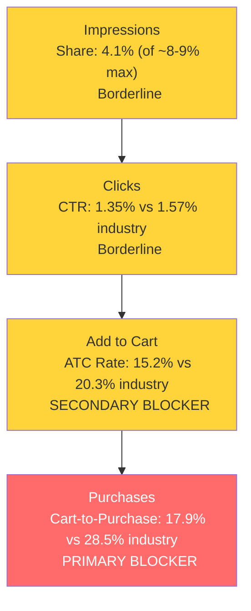

# Seller Central Audit - Magic AutoCare

**Date:** 2026-03-22
**Analysis Period:** Dec 2025 - Feb 2026 (3 months)
**Account Total (3-Mo):** $51,399 in sales / $17,816 in ad spend / TACoS 34.7%

---

## Section 1: Catalog Assessment

| Priority | Product | 3-Mo Sales | 3-Mo Ad Spend | ROAS | TACoS | Organic Sales | Ad Sales % | Buy Box % | CVR | Trend |
|----------|---------|-----------|--------------|------|-------|---------------|-----------|-----------|-----|-------|
| P0 | Graphene Ceramic Spray Coating | $30,447 | $6,025 | 1.83 | 19.8% | $19,431 | 36.2% | 98.9% | 5.6% | Growing |
| P1 | Diamond AI Coating | $8,486 | $4,476 | 1.10 | 52.7% | $3,562 | 58.0% | 99.5% | 1.4% | Growing |
| P2 | Graphene Coating for Cars | $5,451 | $3,227 | 0.82 | 59.2% | $2,794 | 48.7% | 95.5% | 2.6% | Volatile |
| P3 | Ceramic Coating PRO 10H | $2,958 | $1,738 | 0.79 | 58.8% | $1,593 | 46.1% | 93.1% | 3.3% | Declining |

**Not prioritized:** Graphene Leather Care ($1,828), Iron Remover ($608), Clay Bar ($568), Graphene Shampoo ($554), Prep Spray ($448), One Step Polish ($55). All too small for deep analysis. Clay Bar has a buy box issue (66% in Feb).

---

## Section 2: Qualitative Product Understanding (P0)

**Product:**
- Spray-on graphene ceramic coating for cars (16oz and 9oz variants). Provides up to one year of UV, scratch, and oxidation protection with hydrophobic finish.
- Combines graphene and SiO2 ceramic in a spray format. Claims to coat up to five cars per bottle. Includes microfiber cloth.
- Replaces the multi-step professional ceramic coating process with a spray-wipe-buff application that takes minutes.
- Customers buy it for DIY convenience: professional-looking gloss and protection without the $200+ professional detailing cost.

**Customer:**
- Car enthusiasts and everyday car owners who want their vehicle to look freshly detailed. Skews male, 25-55, DIY-oriented.
- Core purchase driver: combination of easy application and long-lasting results. They want protection and shine but won't spend hours on a multi-step process.

**Brand:**
- **Magic Shield** is a registered brand, not white-label. Consistent branding, packaging, and a ~10 SKU product line.
- Amazon-native, ~3 years old (EST. 2019), transitioning to DTC. Based in Calgary, Canada. Three web properties with professional design. Social media present on TikTok, Instagram, Facebook with modest followings. Listed on Walmart.com marketplace. No brick-and-mortar retail.
- **Brand vibe:** "Accessible pro-grade car care." Black and gold color scheme, premium feel. Positioned between mass-market (Turtle Wax, Meguiar's) and enthusiast-grade (Chemical Guys, CarPro).

**Competitive Landscape:**
- **Price positioning:** Avg 16oz graphene/ceramic spray: $25-35. Magic Shield 16oz: ~$32. Mid-tier positioning.

| Competitor | Key Product | Size | Price | Differentiator |
|-----------|------------|------|-------|---------------|
| Chemical Guys | HydroSlick Graphene Hypercoat | 16 oz | ~$45 | Massive brand recognition, ecosystem play |
| Adam's Polishes | Graphene Ceramic Spray | 12 oz | ~$38 | UV tracer tech (verify coverage), enthusiast community |
| Turtle Wax | Hybrid Solutions Pro Graphene Flex Wax | 16 oz | ~$25 | Legacy brand trust, widest retail distribution |
| Meguiar's | Hybrid Ceramic Spray Wax | 24 oz | ~$20 | Budget king, massive review count |

- Magic Shield lacks a unique differentiator vs. established competitors. Where it wins: strong review count (1,604 at 4.4 stars), mid-tier pricing, and a complete product ecosystem for cross-selling.

**Listing Quality:**

**Strengths:**
- **Rating:** 4.4 stars from 1,604 reviews. 70% five-star, only 8% negative. Strong social proof.
- **Video:** 5 videos including application demos and a brand video, with multiple over 30 seconds. Rare in this category.
- **Images:** 7 images with professional product photography.
- **Premium A+ Content:** 7 image modules with SEO-optimized alt text. Brand Store active.
- **Bullets:** 6 bullets covering key benefits (durability, ease, gloss, hydrophobic, versatility, pro results).

**Opportunities:**
- **A+ Content has zero text.** All 7 modules are image-only. No comparison tables, no FAQ, no feature explanations. Adding text modules would give undecided buyers more reason to convert, especially important on mobile where images may load slowly.
- **Title wastes characters on "LAST SO LONG!"** This marketing fluff occupies 14 characters that could hold a specific claim ("Up to 1 Year Protection") or an additional keyword.
- **Main image shows product on white background but no car visual.** Adding a glossy car finish or benefit badges could improve CTR on search results.

---

## Section 3: Quantitative Product Understanding (P0)

**Annual Trend:**

| Metric | Apr 2025 (Peak) | Oct 2025 (Buy Box Crash) | Dec 2025 (Winter Low) | Feb 2026 (Current) |
|--------|---------|---------|---------|---------|
| Total Sales | $26,457 | $18,536 | $6,058 | $13,390 |
| Sessions | 11,099 | 7,755 | 3,335 | 6,821 |
| CVR | 7.12% | 6.94% | 5.49% | 5.73% |
| Buy Box % | 96.94% | 66.27% | 98.88% | 98.59% |

- Strong seasonal pattern confirmed by both seller data and SQP market data. Spring peak, winter trough, currently in recovery. Feb is at $13.4K and trending up week-over-week.
- Buy box crash in Oct 2025 (66.27%) caused ~34% revenue loss while sessions and CVR held steady. Resolved by Nov. Root cause unknown.

**Rating Trajectory:** Stable at 4.3-4.4, slightly improved from 4.2 in mid-2024.

**Sales Rank Trajectory:** Seasonal, currently improving. Ranks #19-25 in Waterless Wash Treatments subcategory (strong positioning).

---

## Section 4: Market Opportunity (SQP)

**Tier Breakdown:**

- **Tier 1 (Hero):**
  - **Keywords:** graphene ceramic coating, graphene coating for cars, graphene coating
  - **Rationale:** Queries where the customer searches for the exact product type. These are graphene-specific coating queries where P0 is the direct answer.

- **Tier 2 (Core market):**
  - **Keywords:** ceramic coating for cars, ceramic coating
  - **Rationale:** The broader ceramic coating market. P0 competes here but against traditional ceramic liquids, professional kits, and established brands. 10x the volume of Tier 1.

- **Tier 3 (Broad/adjacent):**
  - **Keywords:** car wax, car wax spray
  - **Rationale:** General car protection queries. Not capturable. Zero purchases across 3 months. "Car wax" buyers want traditional wax products.

**Market Sizing:**

| Tier | Monthly Search Volume | Monthly Add to Carts (Market) | Monthly Purchases (Market) | Est. Market Size ($/mo) |
|------|----------------------|-------------------------------|---------------------------|------------------------|
| Tier 1 | ~11,000 | ~1,107 | ~311 | ~$35,400 |
| Tier 2 | ~106,800 | ~12,084 | ~3,671 | ~$386,700 |
| Tier 3 | ~58,350 | ~9,223 | ~4,011 | ~$295,100 |
| **Total P0** | **~176,150** | **~22,414** | **~7,993** | **~$717,200** |

**Blockers & Growth Path:**

| Tier | Impression Share | CTR (Brand vs Industry) | CVR (Brand vs Industry) | Primary Blocker | Growth Path |
|------|-----------------|------------------------|------------------------|-----------------|-------------|
| Tier 1 | 4.1% (of ~8-9% max) | 1.35% vs 1.57% (borderline) | 2.63% vs 5.81% (55% below) | **CVR** | Fix conversion, then scale PPC. Cart-to-purchase rate (17.9% vs 28.5% industry) is the key gap. |
| Tier 2 | 0.7% (very low) | 1.79% vs 1.94% (healthy) | 2.21% vs 6.33% (65% below) | **Impression Share + CVR** | Dual blocker. Scale PPC for visibility, but CVR also needs fixing. |
| Tier 3 | 0.1% | 1.17% vs 1.82% | 0% vs 12.89% | Not capturable | Product-intent mismatch. Skip. |

**ICAP Funnel Visual (Tier 1, highest growth potential):**

- The brand's SQP CVR (2.6%) is much lower than the on-page CVR (5.6% from Seller Analytics). This gap is partly because SQP is brand-level (includes P2 and P3 products diluting the rate) and partly because of the cart-to-purchase drop-off. Customers add to cart but abandon at a higher rate than industry, suggesting price comparison behavior.
- Tier 1 share is declining: impression share dropped from 4.8% to 3.7% over 3 months. Without intervention, the brand risks losing ground even on its hero keywords.
- Tier 2 is the massive untapped opportunity. At $387K/mo market size with only 0.7% impression share, even modest visibility gains translate to meaningful revenue.

---

## Section 5: Ad Analysis

### Account Level

**Auto vs Manual:**

| Targeting Type | Clicks | Spend | Sales | ROAS | AOV | CPC | CVR |
|----------------|--------|-------|-------|------|-----|-----|-----|
| Automatic | 4,087 | $3,557 | $4,813 | 1.35 | $43.36 | $0.87 | 2.72% |
| Manual | 10,253 | $14,255 | $17,820 | 1.25 | $45.58 | $1.39 | 3.81% |

Manual drives 80% of spend (correct pattern), but auto slightly outperforms on ROAS due to lower CPCs. Manual's higher CPC ($1.39 vs $0.87) erodes its conversion advantage.

**Keyword vs Product Targeting:**

| Targeting Strategy | Clicks | Spend | Sales | ROAS | AOV | CPC | CVR |
|-------------------|--------|-------|-------|------|-----|-----|-----|
| Keyword Targeting | 8,695 | $10,845 | $13,798 | 1.27 | $42.72 | $1.25 | 3.71% |
| Product Targeting | 5,645 | $6,968 | $8,836 | 1.27 | $49.36 | $1.23 | 3.17% |

Balanced split, identical ROAS. No reallocation needed.

**Match Type Breakdown:**

| Match Type | Clicks | Spend | Sales | ROAS | AOV | CPC | CVR |
|------------|--------|-------|-------|------|-----|-----|-----|
| EXACT | 2,976 | $4,504 | $5,141 | 1.14 | $45.90 | $1.51 | 3.76% |
| BROAD | 2,431 | $3,126 | $4,586 | 1.47 | $39.19 | $1.29 | 4.81% |
| PHRASE | 1,083 | $1,489 | $1,542 | 1.04 | $51.39 | $1.38 | 2.77% |

**Finding: Broad outperforms Exact by 29% on ROAS**

**Problem:**
- Broad: 1.47 ROAS, 4.81% CVR, $1.29 CPC
- Exact: 1.14 ROAS, 3.76% CVR, $1.51 CPC
- The exact match keywords are poorly chosen or over-bid. Amazon's algorithm is finding better-converting terms through broad match than the manually selected exact targets.

**Solution:**
- Mine broad match search term reports for high-ROAS terms
- Create dedicated exact match campaigns for those terms at controlled bids
- Reduce bids on underperforming exact keywords

**Impact:**
- The $4,504 in exact spend at 1.14 ROAS generates $5,141 in sales. At broad's 1.47 ROAS efficiency, the same spend would generate $6,621, a $1,480 improvement.

**Finding: $8,500+ in unprofitable non-P0 ad spend**

**Problem:**
- P1 (Diamond AI): $3,632 spend, ~0.87 blended ROAS
- P2 (Graphene Coating for Cars): $3,150 spend, ~0.76 blended ROAS
- P3 (Ceramic Coating PRO): $1,729 spend, ~0.72 blended ROAS
- Combined: $8,511 in spend generating $6,820 in sales. Net loss before product costs.

**Solution:**
- Pause worst offenders (campaigns below 0.75 ROAS)
- Reallocate to P0 campaigns, which run at 1.83 ROAS

**Impact:**
- $2,000+ in recoverable spend from sub-0.75 ROAS campaigns
- Reallocated to P0 at 1.83 ROAS: ~$3,660 in additional sales from the same budget

### Product Level (P0)

**P0 Campaign Map:**

| Campaign | Spend | Sales | ROAS | Clicks | Orders |
|----------|-------|-------|------|--------|--------|
| Universal-Graphene Spray Manual (9oz) | $2,480 | $4,532 | 1.83 | 2,403 | 135 |
| Graphene Spray-SP-Product Target (16oz) | $1,795 | $2,961 | 1.65 | 1,793 | 79 |
| Universal-Graphene Spray Auto (9oz) | $845 | $1,754 | 2.08 | 1,350 | 56 |
| Universal-Graphene Spray Manual (16oz) | $390 | $1,039 | 2.66 | 281 | 29 |
| Universal-Graphene Spray Auto (16oz) | $99 | $287 | 2.91 | 146 | 8 |
| Other P0 campaigns (combined) | $400 | $443 | 1.11 | | |
| **P0 Total** | **$6,009** | **$11,016** | **1.83** | | **321** |

P0 ad spend: $6,009 (34% of account). P0 ad sales: $11,016 (49% of account).

**Finding: 16oz variant is underfunded relative to performance**

**Problem:**
- 16oz ROAS: 2.66 (Manual), 2.91 (Auto)
- 9oz ROAS: 1.83 (Manual), 2.08 (Auto)
- 16oz gets $489 total spend vs 9oz gets $3,325
- The higher-priced, higher-margin variant converts better but gets 7x less budget

**Solution:**
- Increase bids and budget on 16oz campaigns
- Shift 20-30% of 9oz campaign budget to 16oz

**Impact:**
- $1,000 shifted from 9oz Manual (1.83 ROAS) to 16oz Manual (2.66 ROAS) would generate $2,660 vs $1,830, a $830 improvement from the same spend.

**Blocker-Specific Findings:**

The SQP analysis identified CVR as the primary blocker. On the ad side, the picture is more nuanced:

- P0's own keyword "graphene ceramic coating" converts at 5.36% CVR and 1.51 ROAS. This is healthy.
- The CVR problem appears primarily on Tier 2 keywords ("ceramic coating for cars" at 3.02%, "ceramic coating" at 2.05%) where the product competes against a different category (traditional ceramic coatings).
- "Car wax" (Tier 3) confirmed dead: $66 spend, 0 orders. Should be negated immediately.
- $1,094 in addressable wasted spend on non-converting search terms can be reallocated to high-ROAS terms.

---

## Section 6: Action Plan

The primary blocker is CVR (55-65% below industry), driven by cart-to-purchase drop-off on Tier 1 and low visibility + poor conversion on Tier 2. P0's core PPC campaigns are healthy (1.83 ROAS), so the strategy is: optimize ad efficiency first (quick wins), then fix listing content to improve CVR, then scale.

### Weeks 1-2: Immediate Actions (PPC Quick Wins)

The primary blocker is CVR, but the fastest wins are on the PPC efficiency side. These actions free up budget and improve ROAS before any listing changes.

- **Pause unprofitable non-P0 campaigns** below 0.75 ROAS (P2 Auto at 0.64, P2 CUSTOM-KEYWORD at 0.59, P3 Ceramic-Product Target at 0.51). Recovers ~$2,000 in budget.
- **Negate "car wax" and other confirmed non-converting search terms** across all campaigns. Stops $66+/period in waste.
- **Shift P0 budget toward 16oz variant.** Increase 16oz Manual/Auto campaign bids and daily budgets. The 16oz runs at 2.66-2.91 ROAS vs 9oz at 1.83-2.08.
- **Reallocate recovered budget to P0 campaigns.** Priority: Universal-Graphene Spray Manual (16oz) and Auto (16oz), which have proven ROAS but are underfunded.
- **Reduce bids on underperforming exact match keywords** that are dragging exact match ROAS (1.14) below broad match (1.47).

### Weeks 2-4: Short-Term Optimizations

- **Harvest broad match winners into exact campaigns.** Mine the broad match search term reports for terms converting above 1.5 ROAS. Create dedicated exact match campaigns with controlled bids. This fixes the broken harvest-and-scale loop.
- **Scale "graphene ceramic coating" and "graphene spray coating"** as dedicated Tier 1 exact match campaigns. These convert at 5.36% and 9.86% CVR respectively. They should get their own budgets and aggressive Top of Search modifiers.
- **Investigate and expand high-ROAS ASIN targets.** Product targeting on specific competitor ASINs (b0b94g13cn at 1.73 ROAS, b09q3mmq6p at 3.09 ROAS) is working. Identify these ASINs and expand to similar products.
- **Begin listing content preparation.** Draft A+ content text modules (comparison table: Graphene Spray vs Traditional Wax vs Professional Coating, FAQ addressing common objections, application instructions). Do not publish yet.

### Weeks 4-6: Medium-Term Growth (Listing + CVR Fix)

- **Publish A+ content text modules.** The current A+ is 7 image modules with zero text. Adding text addresses the CVR blocker by giving undecided buyers more information, especially on mobile.
- **Optimize main image.** Test a version with a glossy car visual or benefit badges ("Hydrophobic + UV Protection") to improve CTR on search results.
- **Optimize title.** Replace "LAST SO LONG!" with "Up to 1 Year Protection" or additional keywords. Small change, but title real estate is premium.
- **Monitor CVR impact** from listing changes. Compare brand CVR in SQP for the 2 weeks before vs. after listing updates.
- **Begin Tier 2 PPC scaling.** Once listing improvements are live and CVR starts improving, gradually increase bids on "ceramic coating for cars" and "ceramic coating." Start with low bids and Top of Search placement to test conversion on the improved listing.

### Weeks 6-8: Scaling and Evaluation

- **Scale PPC on improved listing.** If CVR improves after listing changes, increase budgets across P0 campaigns, especially on Tier 2 keywords where the $387K/mo market is barely tapped (0.7% impression share).
- **Evaluate P1 (Diamond AI Coating).** Now that P0 is optimized, assess whether P1 can be made profitable or if its $4,476 in quarterly ad spend should be further reduced.
- **Prepare for spring peak.** April is historically the peak month ($26K in P0 sales). Ensure PPC budgets are ramped and campaigns are structured to capture the seasonal demand increase.
- **Launch branded defense campaign** if not already running. Small budget (2-3% of total), targeting "magic shield" branded terms to prevent competitor poaching.

---

## Section 7: Insights & Questions for the Seller

**Insights:**

- **P0 (Graphene Ceramic Spray Coating) is a strong product in a large market with significant room to grow.** 1,604 reviews at 4.4 stars, healthy on-page CVR (5.6%), and the best ROAS in the account (1.83). The total addressable market is ~$717K/mo and the brand captures less than 2% of it.
- **The account's biggest problem is capital misallocation, not product weakness.** P0 generates 59% of sales but gets only 34% of ad spend. The $8,511 spent on P1/P2/P3 ads at sub-1.0 blended ROAS is the single largest drag on profitability. Fixing this alone would improve account-level ROAS from 1.27 to an estimated 1.6+.
- **P0 (Graphene Ceramic Spray Coating) 16oz variant is a hidden opportunity.** It runs at 2.66-2.91 ROAS across its campaigns but gets 7x less spend than the 9oz variant. Shifting budget here is the lowest-risk, fastest win available.
- **The CVR blocker from SQP is primarily a Tier 2 issue, not a P0 product issue.** P0 converts well on Tier 1 keywords (5.36% on "graphene ceramic coating"). The below-industry CVR shows up on broader "ceramic coating" queries where the product format (spray) competes against traditional liquids and kits that dominate those search results.
- **Spring ramp is starting now.** Both SQP search volume and P0 sales are trending up. The window to optimize campaigns and listing before peak season (Apr-Jun) is the next 4-6 weeks.

**Questions for the Seller:**

- **Is Perpetua managing the campaigns?** The campaign naming convention suggests automated management. If so, the harvest-and-scale loop (broad to exact) should be happening but isn't. Understanding the current setup informs whether we're optimizing within Perpetua or replacing it.
- **What happened with buy box in October 2025?** P0 (Graphene Ceramic Spray Coating) buy box dropped to 66.27% while all other metrics held steady. Was there a specific competitor, pricing event, or inventory issue? Has the root cause been resolved, or could it recur during the spring peak?
- **Is the seasonal pattern intentional?** Sales drop ~75% from peak to trough. Does the seller reduce ad spend in winter deliberately, or is this purely demand-driven? Understanding this helps calibrate the spring scaling strategy.
