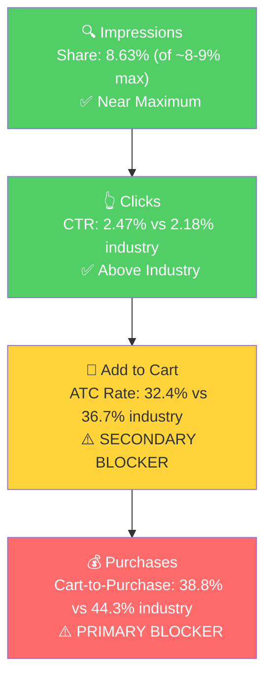

# Seller Central Audit: Maurice Piggy Park BBQ

**Date:** March 22, 2026
**Data Window:** December 2025 - February 2026 (3 complete months)
**Ad Data:** 111 days available (since November 27, 2025)

---

## Section 1: Catalog Assessment

| Priority | Product | 3-Mo Sales | 3-Mo Ad Spend | ROAS | TACoS | Organic Sales | Ad Sales % | Buy Box % | CVR | Trend |
|----------|---------|-----------|--------------|------|-------|---------------|-----------|-----------|-----|-------|
| P0 | Original Southern Gold | $15,289 | $3,362 | 3.35 | 22.0% | $4,027 | 73.7% | 84.1% | 16.5% | Growing |
| P1 | Grill Variety Set | $1,927 | $314 | 3.42 | 16.3% | $708 | 63.3% | 98.5% | 11.0% | Declining |
| P2 | Original (large format) | $540 | shared | -- | -- | ~$540 | -- | 61.9% | 9.9% | Flat |
| P3 | Grill Trio Variety Set | $404 | $0 | -- | -- | $404 | 0% | 94.4% | 20.9% | Declining |

*Note: P0 and P2 share the same ad campaigns due to an ASIN merge around September 2025. The $3,362 ad spend is attributed to both parents. P2 (B0FX4123MV) represents the pre-merge large format listing (1/2 gallon and 1 gallon sizes).*

**Products not prioritized:** Honey 18oz ($261, no ad spend), Hickory Red ($168, persistent buy box issues at 0-73%), Seasoning & Rub ($84), Hot Pepper ($30). Combined, these represent less than 6% of account revenue.

This is effectively a **single-product brand on Amazon.** P0 drives 82% of total sales. The variety sets (P1, P3) are gift-oriented SKUs that spiked in December and declined in Jan-Feb.

---

## Section 2: Qualitative Product Understanding (P0)

**Product:**
- Mustard-based (Carolina Gold) BBQ sauce, 18oz bottle. Sold in 1-pack, 2-pack, and 3-pack, plus Spicy, Hickory, and Vinegar flavor variants.
- Four-generation family recipe dating to 1953. Handcrafted in small batches at the West Columbia, SC smokehouse. Signature gold color from mustard base balanced with smoke, spice, and tang.
- Low calorie, low carb, low sugar, gluten-free, preservative-free. Bold BBQ flavor without the sugar bomb of mainstream sauces.

**Customer:**
- BBQ enthusiasts and home grillers seeking authentic regional BBQ. Customers who know South Carolina mustard BBQ culture or have visited Maurice's Piggie Park restaurant.
- Secondary: health-conscious consumers seeking lower-sugar BBQ sauce (keto/fitness-adjacent).
- Tertiary: gift/variety pack buyers (December spike on Grill Variety Set confirms this).

**Brand:**
- Registered brand with deep heritage. Maurice Bessinger (1930-2014) opened the original Piggie Park drive-in in 1953. By 1999, it was the largest BBQ operation in the US.
- Established, restaurant-first brand that expanded into retail and Amazon. Professional website (piggiepark.com) with e-commerce, Facebook (10K+ likes), Instagram, catering operation.
- **Brand vibe:** Traditional heritage Southern BBQ. Maurice's portrait on the label, "National Award Winning" badges, wood-grain design. Old-school American BBQ legacy, not modern artisan or trendy.

**Competitive Landscape:**
- **Price positioning:** Avg mustard BBQ sauce 18oz: ~$10 | P0 (Pack of 1): $12.89 | 29% above average

| Competitor | Size | Price | Positioning |
|-----------|------|-------|-------------|
| Lillie's Q Gold | 20oz | ~$10-12 | All-natural, gourmet, modern artisan |
| Cattlemen's Carolina Tangy Gold | 18oz | ~$5-8 | Budget, mass-market |
| Traeger Liquid Gold | 16oz | ~$8-10 | Grill brand crossover |
| Duke's Carolina Gold | 14oz | ~$8-10 | Strong Southern regional brand |

Maurice's differentiates on heritage ("since 1953," real restaurant, four-generation recipe) and health (low cal/carb/sugar). Priced at a premium, which is defensible but requires clear value communication on the listing.

**Listing Quality:**

**Strengths:**
- **Rating:** 4.7 stars, improved steadily from 4.0 in 2018. Strong trust signal.
- **Bullets:** 5 well-structured bullets covering heritage, flavor, health, origin, and versatility.
- **Subscribe & Save:** Enabled. Smart for a consumable, supports repeat purchases.

**Opportunities:**
- **A+ Content: Absent.** The biggest listing gap. Maurice's has a 70+ year heritage story, a real restaurant, and a distinctive regional identity. None of this appears below the fold. For a $12.89 product competing against $5-8 alternatives, the "why pay more" story must be told visually with heritage imagery, ingredient comparisons, and lifestyle photos.
- **Video: Absent.** The product's gold color and healthier profile are better demonstrated through video than still images. A 30-second clip showing the sauce on grilled meats and a quick nutrition comparison would address the "is this just mustard?" objection.
- **Main Image:** Functional but not optimized. The sauce bowl in front of the bottle makes the product look like plain mustard, which could confuse searchers browsing BBQ sauce results. Competitors show sauce on meat.

---

## Section 3: Quantitative Product Understanding (P0)

**Annual Trend:**

| Metric | May 2025 (Peak) | Sep 2025 (Trough) | Dec 2025 (Holiday) | Feb 2026 (Latest) |
|--------|----------------|-------------------|-------------------|-------------------|
| Total Sales | $5,240 | $3,306 | $5,101 | $5,437 |
| Sessions | 1,131 | 729 | 1,718 | 1,570 |
| CVR | 24.8% | 24.0% | 15.8% | 19.4% |
| Buy Box % | 93.9% | 76.5% | 85.2% | 84.1% |

- **Sales recovered via ad spend, not organic growth.** The Jun-Nov period saw sessions drop 35% as buy box fell from 94% to 73-77%. Dec-Feb sales recovered to $5K+ levels via a 4x increase in ad spend ($569 to $2,109/mo). CVR dropped from ~24% to ~16% as the higher-volume ad audience converts at lower rates.
- **Buy box is the central constraint.** Dropped from 93-94% (Apr-May) to 70-77% (Jun-Nov). Partially recovered to 83-85% (Dec-Feb) but remains well below the 95%+ healthy threshold.

**Rating Trajectory:** Improving. From 4.0 (2018) to 4.7 (current). Consistent upward trend over 7 years.

---

## Section 4: Market Opportunity (SQP)

**Tier Breakdown:**

- **Tier 1 (Hero):**
  - **Keywords:** carolina gold bbq sauce, mustard bbq sauce, gold bbq sauce, carolina mustard bbq sauce, south carolina bbq sauce, mustard bbq sauce south carolina, carolina gold barbecue sauce, southern gold bbq sauce, south carolina mustard bbq sauce
  - **Rationale:** Customer is searching for exactly a mustard-based or gold BBQ sauce. The product is the direct answer to the search.

- **Tier 2 (Core market):**
  - **Keywords:** carolina bbq sauce, carolina barbecue sauce, carolina gold, carolina gold sauce, carolina bbq, low sugar bbq sauce, barbecue sauce
  - **Rationale:** Broader Carolina BBQ or general BBQ sauce queries where the product is one option among several styles (vinegar, tomato, mustard).

- **Tier 3 (Broad/adjacent):**
  - **Keywords:** bbq sauce, sugar free bbq sauce
  - **Rationale:** Generic BBQ sauce market. Massive volume but the product competes against Sweet Baby Ray's, Stubb's, and hundreds of tomato-based sauces. Intent mismatch for a niche mustard sauce.

**Market Sizing:**

| Tier | Monthly Search Volume | Monthly Add to Carts (Market) | Monthly Purchases (Market) | Est. Market Size ($/mo) |
|------|----------------------|-------------------------------|---------------------------|------------------------|
| Tier 1 | 3,164 | 569 | 246 | $5,690 |
| Tier 2 | 41,565 | 13,760 | 7,504 | $137,600 |
| Tier 3 | 121,462 | 39,691 | 21,634 | $396,910 |
| **Total P0** | **166,191** | **54,020** | **29,384** | **$540,200** |

**Blockers & Growth Path:**

| Tier | Impression Share | CTR (Brand vs Industry) | CVR (Brand vs Industry) | Primary Blocker | Growth Path |
|------|-----------------|------------------------|------------------------|-----------------|-------------|
| Tier 1 | 8.63% (near max) | 2.47% vs 2.18% (Healthy) | 12.71% vs 16.49% (23% gap) | CVR | Listing fix + buy box: CVR gap driven by absent A+ content and 84% buy box. Fix listing, then maintain PPC spend. |
| Tier 2 | 0.41% (very low) | 1.18% vs 2.32%* | 11.68% vs 32.00%* | Impression Share | PPC scaling: "carolina bbq sauce" converts at 26.7% on ads. Scale PPC on this term. CTR/CVR data has low statistical significance (~50 clicks/3mo). |
| Tier 3 | 0.12% (invisible) | 0.75% vs 2.30% | 7.66% vs 32.11% | Not capturable | Intent mismatch. Skip for this ASIN. |

**ICAP Funnel Visual (Tier 1, highest growth potential):**

- **Tier 1 is near-saturated on visibility (8.63% impression share) with above-industry CTR.** The brand shows up on nearly every relevant search and gets clicked. The drop-off happens after the click: both ATC rate and cart-to-purchase rate are below industry.
- **The purchase share (8.0%) lags the click share (10.4%).** People click on Maurice's but don't convert at the expected rate. The buy box at 84% directly explains the cart-to-purchase gap: ~16% of add-to-cart actions may be attributed to another seller.
- **Tier 1 share has grown dramatically since October 2025** (from ~3.5% to 10.2% impression share), driven by the ad spend increase. The ads are successfully driving visibility.

---

## Section 5: Ad Analysis

### Account Level

**Auto vs Manual:**

| Targeting Type | Clicks | Spend | Sales | ROAS | AOV | CPC | CVR |
|----------------|--------|-------|-------|------|-----|-----|-----|
| Automatic | 3,191 | $2,401 | $7,539 | 3.14 | $17.13 | $0.75 | 13.8% |
| Manual | 1,458 | $1,336 | $5,064 | 3.79 | $17.28 | $0.92 | 20.1% |

Auto is overweight at 64% of spend. Manual outperforms on ROAS (3.79 vs 3.14) and CVR (20.1% vs 13.8%). The auto "complements" targeting burns $87 at 0.88 ROAS. Not a critical problem, as both auto and manual are profitable, but there's ~$325 in incremental sales available by shifting $500 from auto to manual.

**Keyword vs Product Targeting:**

| Targeting Strategy | Clicks | Spend | Sales | ROAS | AOV | CPC | CVR |
|-------------------|--------|-------|-------|------|-----|-----|-----|
| Keyword Targeting | 3,734 | $3,168 | $10,645 | 3.36 | $16.84 | $0.85 | 16.9% |
| Product Targeting | 899 | $555 | $1,957 | 3.53 | $19.38 | $0.62 | 11.2% |

Product targeting is underfunded at 15% of spend despite having better ROAS (3.53 vs 3.36), lower CPC ($0.62 vs $0.85), and higher AOV ($19.38 vs $16.84). The PAT Category campaign (5.31 ROAS) is the account's best performer.

**Match Type Breakdown:**

| Match Type | Clicks | Spend | Sales | ROAS | AOV | CPC | CVR |
|------------|--------|-------|-------|------|-----|-----|-----|
| EXACT | 1,021 | $1,082 | $3,791 | 3.50 | $16.41 | $1.06 | 22.6% |

Only EXACT match is used. Clean but limits keyword discovery. Adding BROAD or PHRASE campaigns on core keywords would expand the search term universe beyond what auto discovers.

### Product Level (P0)

**P0 Campaign Map:**

| Campaign | Spend | Sales | ROAS | Clicks | Orders |
|----------|-------|-------|------|--------|--------|
| Auto Discovery (P0 portion) | $2,087 | $6,320 | 3.03 | 2,791 | 405 |
| 1-PACK Exact | $453 | $1,592 | 3.51 | 464 | 109 |
| 2-PACK Exact | $325 | $1,595 | 4.90 | 280 | 91 |
| 3-PACK Exact | $248 | $442 | 1.78 | 214 | 23 |
| PAT Category (P0 portion) | $239 | $1,273 | 5.33 | 421 | 62 |
| Hero Exact | $9 | $39 | 4.09 | 9 | 2 |
| **Total P0** | **$3,361** | **$11,261** | **3.35** | **4,179** | **692** |

P0 receives 90% of total account ad spend.

**Finding: 3-PACK campaign is hemorrhaging money on "mustard bbq sauce"**

**Problem:**
- The 3-PACK campaign ($248 spend, 1.78 ROAS) is the weakest performer
- Within it, "mustard bbq sauce" EXACT: $72 spend, 56 clicks, **0 orders**
- The same keyword converts at 14.8% CVR on the 1-PACK and 45.3% on the 2-PACK
- The 3-PACK ($34.93) is too high a commitment for first-time buyers discovering the brand through "mustard bbq sauce"

**Solution:**
- Pause "mustard bbq sauce" and "south carolina bbq sauce" targeting on the 3-PACK
- Redirect that $78 to the 2-PACK campaign (4.90 ROAS)

**Impact:**
- $78 at 2-PACK's 4.90 ROAS = $382 in additional sales vs $0 currently

**Finding: Top of Search placement is underleveraged**

**Problem:**
- Top of Search: $1,341 spend, 3.81 ROAS, 22.0% CVR
- Rest of Search: $1,402 spend, 3.59 ROAS, 14.8% CVR
- Product Pages: $936 spend, 2.40 ROAS, 11.2% CVR
- Top of Search converts nearly 2x better than Product Pages but gets less spend

**Solution:**
- Increase Top of Search bid modifier by 25-50% on manual Exact campaigns
- This shifts budget from lower-performing placements to the highest-converting one

**Impact:**
- If $300 shifts from Product Pages (2.40 ROAS) to Top of Search (3.81 ROAS): $423 in additional sales from the same spend.

**Finding: ~$104 in wasted spend on irrelevant auto search terms**

**Problem:**
- Competitor brands (Duke's, Lillie's): $28 spent, 0 orders
- Wrong intent (gold sauce, hickory bbq sauce): $26 spent, 0 orders
- Vinegar intent mismatch (carolina bbq sauce vinegar): $14 spent, 1 order at 0.92 ROAS
- Low-converting ASIN targets: $22 spent, $13 sales

**Solution:** Add negative keywords: "dukes," "lillies," "vinegar," "hickory," "gold sauce." Negate the underperforming ASIN target.

**Impact:** $104/quarter saved, redirected to converting terms.

---

## Section 6: Action Plan

The primary blocker is **CVR on Tier 1** (driven by buy box at 84% and absent A+ content). The secondary opportunity is **Tier 2 PPC scaling** ("carolina bbq sauce" converts at 26.7% and 4.96 ROAS). The action plan addresses the CVR blocker first, then scales traffic.

### Weeks 1-2: Immediate PPC Optimizations

- **Resolve buy box.** Investigate what's causing the 84% buy box (other sellers? pricing? inventory?). This is the single highest-impact action. Every percentage point of buy box recovered translates to ~$50-100/mo in additional conversions at current traffic levels.
- **Negate irrelevant search terms** in auto campaign (competitor brands, wrong intent). Saves $104/quarter.
- **Pause "mustard bbq sauce" and "south carolina bbq sauce" on the 3-PACK campaign.** Redirect $78 to the 2-PACK.
- **Increase Top of Search bid modifier** by 30% on the 1-PACK and 2-PACK Exact campaigns to shift spend toward the highest-converting placement.
- **Negate "complements" targeting in auto** or reduce bids to minimum. Currently burning $87 at 0.88 ROAS.

### Weeks 2-4: Short-Term Scaling

- **Launch a BROAD match campaign** on "carolina gold bbq sauce" and "mustard bbq sauce" to discover new long-tail variations. Currently the only discovery channel is auto. Set conservative daily budget ($10/day) and harvest winners into Exact campaigns.
- **Scale the PAT Category campaign.** At 5.31 ROAS, it's the account's best performer but only gets $240 in 90 days. Increase daily budget by 50%.
- **Begin A+ Content development.** Draft the heritage story (Bessinger family, 1953, real restaurant), ingredient comparison (sugar/calorie comparison vs mainstream sauces), and lifestyle imagery (sauce on ribs, pulled pork, burgers).
- **Shift $500/month from auto to manual campaigns.** Manual outperforms auto by 21% on ROAS. Gradually reduce auto budget and increase 1-PACK and 2-PACK Exact budgets.

### Weeks 4-6: Listing Optimization

- **Publish A+ Content.** Heritage story + health comparison + lifestyle images. This addresses the Tier 1 CVR blocker.
- **Optimize main image.** Test an image showing the sauce on grilled meat instead of the isolated bottle, to improve CTR on non-branded searches where buyers don't recognize the gold bottle as BBQ sauce.
- **Launch Tier 2 PPC expansion.** Create a manual EXACT campaign for "carolina bbq sauce" (already converting at 26.7% CVR and 4.96 ROAS in search term data). Also test "barbecue sauce" in BROAD with tight negative keyword list.
- **Monitor CVR impact** from A+ content launch. Compare 2-week pre vs 2-week post CVR on Tier 1 keywords.

### Weeks 6-8: Scaling and Evaluation

- **Scale Tier 2 PPC** based on performance data from Weeks 4-6. If "carolina bbq sauce" manual campaign performs above 3.0 ROAS, increase budget.
- **Evaluate the 2-PACK as the default advertised product.** At 4.90 ROAS vs 3.51 for the 1-PACK, the 2-PACK is significantly more efficient. Consider making it the primary ad target.
- **Review grilling season prep.** Search volume peaks May-Jul. By Week 8 (mid-May), the listing should be optimized and campaigns scaled to capture the seasonal volume increase.
- **Assess P1 (Grill Variety Set).** If P0 optimization is on track, evaluate whether the Grill Variety Set (declining from $1,259 to $288/mo) needs intervention or is naturally seasonal.

---

## Section 7: Insights & Questions for the Seller

**Insights:**

- **P0 (Original) has saturated its hero keyword market but is leaving purchases on the table.** At 8.63% impression share on Tier 1 (near the 8-9% max) and above-industry CTR, the brand shows up and gets clicked. The bottleneck is what happens after the click. Buy box at 84% and no A+ content are the primary conversion killers.
- **P0 (Original) ad spend is compensating for organic ranking loss, not driving incremental growth.** TACoS tripled from 11% (Dec) to 39% (Feb) while total sales stayed roughly flat at ~$5K/mo. The seller is spending more to maintain the same revenue. This is unsustainable without fixing the underlying conversion issue.
- **The 2-PACK is the most efficient product.** At 4.90 ROAS vs 3.51 for the 1-PACK and 1.78 for the 3-PACK, the 2-PACK converts best across almost every keyword. It should be the primary ad focus.
- **"carolina bbq sauce" is the highest-potential growth keyword.** At 2,311 monthly search volume, 4.96 ROAS, and 26.7% CVR, it's already converting well from limited manual spend. Scaling this keyword is the clearest path to Tier 2 capture.
- **The campaign structure is clean and well-organized.** Unlike many accounts, this one has separate campaigns per pack size, reasonable target counts, and exact match targeting. The foundation is solid. The improvements are about optimization (budget allocation, placement modifiers, negations) rather than restructuring.

**Questions for the Seller:**

- "Buy box has been below 85% for most of the past year, dropping as low as 70% in June 2025. Are there other sellers on this listing, or is this a pricing/inventory issue? The buy box is the single biggest constraint on growth. Every percentage point below 100% means lost sales."
- "The 'Original' product exists under two parent ASINs (B0B6MFCXJ8 and B0FX4123MV). You mentioned ASINs were merged around September. Is the B0FX4123MV listing fully consolidated, or are there still active child ASINs under it? The old parent still shows a 61% buy box."
- "Are you currently working with an agency or managing ads in-house? The campaign structure is well-done. We want to understand what's been tried so far and build on the existing strategy."
- "P1 (Grill Variety Set) dropped from $1,259 in December to $288 in February. Is this purely seasonal (holiday gift set), or has something changed with the product or listing?"
