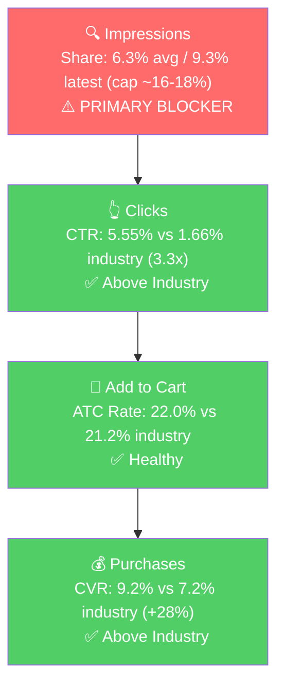

# Seller Central Audit - NutriGardens

## Section 1: Catalog Assessment

NutriGardens has 4 parent ASINs in the system but only **2 are commercially active**. Both active products are red spinach extract supplements, putting the brand effectively in one category with two SKUs.

| Priority | Product | 3-Mo Sales | 3-Mo Ad Spend | ROAS | TACoS | Organic Sales | Ad Sales % | Buy Box % | CVR | Trend |
|----------|---------|-----------|--------------|------|-------|---------------|-----------|-----------|-----|-------|
| P0 | RS400 Red Spinach (B0FVPCKVNY) | $14,193 | $720 | 7.60 | 5.1% | $8,721 | 38.6% | 98.3% | 20.9% | Growing |
| P1 | VitaSpinach (B0C6QJM2MG) | $11,939 | $1,034 | 3.32 | 8.7% | $8,484 | 28.7% | 98.4% | 22.6% | Flat / Slight Decline |
| P2 | B074JD3QG9 (no title in catalog) | $0 | $0 | n/a | n/a | $0 | n/a | n/a | n/a | Dead since May 2025 |
| P3 | Berry Boost (B0B8YZC6GM) | ~$0 | $0 | n/a | n/a | ~$0 | n/a | n/a | n/a | Dormant (1-2 units/mo) |

**P2** went to zero in May 2025 after running ~$1-2K/month through April 2025. Worth confirming with the seller whether this was discontinued or replaced by RS400 (which launched in Nov 2025 - timing fits a replacement narrative). **P3** (Berry Boost) is a brain/memory supplement that has essentially lost ranking. Product-level deep dives in Sections 2-5 focus on P0; findings will largely transfer to P1 since both are red spinach extract products.

## Section 2: Qualitative Product Understanding (P0)

**Product:**
- Red spinach extract powder delivering 400mg of dietary nitrate per 4.4g serving, 30 servings per 4.7oz tub.
- Single-ingredient formulation: red spinach extract only. No fillers, sugar, or stimulants. Vegan, non-GMO.
- Positioned as a "beet root alternative", claims 4-5x the nitrate per serving of beets.
- Mechanism: dietary nitrate converts to nitric oxide, which improves blood flow, oxygen efficiency, and endurance. Take 1-2 hours pre-workout.

**Customer:**
- Endurance and performance-focused athletes (cyclists, runners, lifters) who want a clean, plant-based pre-workout without caffeine or artificial stimulants.
- Secondary buyer: health-conscious consumers using nitric oxide boosters for cardiovascular support. This audience overlaps with VitaSpinach, creating internal cannibalization on shared keywords.
- Purchase driver: a natural, stimulant-free alternative to caffeinated pre-workouts and to messier beet root powders.

**Brand:**
- Real brand, not white-label. NutriGardens has been operating since 2012, family-operated, based in Portland, Oregon.
- DTC e-commerce at nutrigardens.com with active blog and educational content. Also sold via thefeed.com (a specialty endurance/cycling retailer), which is meaningful trust signal in the athlete community.
- Specialist positioning: the entire brand is plant-based nitrate nutrition. Only 3 products: VitaSpinach ($39.95), RS400 ($59.95), Beet Boost ($39.95, DTC only - not on Amazon).
- **Brand vibe:** clean, premium-clinical with a sport edge. Red and white palette, registered trademarks, "Olympic, professional, and collegiate coaches" social proof. Sits between a clinical supplement brand and a sports performance brand.

**Competitive Landscape:**

**Price positioning:** Avg red spinach 400mg powder (30 servings) on Amazon: $35-45. NutriGardens RS400: $58-59. **Roughly 30-45% above the segment average.** Premium positioning is consistent across DTC and Amazon.

| Competitor | Product | Format | Approx Price |
|------------|---------|--------|--------------|
| Resync | Red Spinach Extract | Powder | $40-50 |
| BioHealth Nutrition | Vitality Super Concentrated Red Spinach | Powder | $30-40 |
| Barlowe's Herbal Elixirs | OXYSTORM N.O. Explosion | Capsules | $25-35 |
| Red Spinach Company | RS400 | Powder | $35-50 (worth investigating - shared "RS400" naming suggests possible ingredient supplier connection) |

**Differentiators:** Sport-forward branding sets RS400 apart from the more cardiovascular framing of Resync and BioHealth. Brand story (chef-owned, family-operated, since 2012, athlete-trusted) is unique, but absent from the Amazon PDP.

**Listing Quality:**

**Strengths:**
- **Main image** clean white background with the red spinach leaves visible. Communicates premium and ingredient-led. CTR 3.3x industry on Tier 1 queries confirms this is working.
- **Title** at 185 characters, includes brand, smart positioning ("Beet Root Alternative"), covers nitrate count, performance, and pack size.
- **Bullets** 5 bullets present, all-caps first-word format for scannability.
- **8 images** (in line with category best practice). Subscribe & Save enabled.

**Opportunities:**
- **No A+ content.** This is the single biggest gap. A $58-60 premium supplement competing in a category of established brands needs A+ to defend the price: comparison module (red spinach vs beets), brand story (since 2012, athlete-trusted), usage visualization, and the science behind nitrate-to-nitric oxide conversion. All four exist on the DTC site and are completely absent from the Amazon PDP.
- **No video.** A 20-30 second clip showing scoop-to-water mixing and pre-training usage would resolve the implicit question "how do I take this" that pre-workout powder buyers ask.
- **Rating risk.** 4.0 stars currently, down from 4.6 in late April. The review count is very small (likely under 10), so each negative review swings the average 0.5-1.0 stars. Below 4.3 will materially hurt CTR as ad spend scales.
- **Bullet 5 wastes a slot.** "Crafted with Care in the USA" is generic. This slot should answer the buyer's most common pre-purchase question (likely "will it work for me, and how soon will I feel it?").
- **Description typo** ("atletic" instead of "athletic"). Minor but unprofessional for a premium-priced item.

## Section 3: Quantitative Product Understanding (P0)

**Annual Trend (RS400 launched Nov 2025):**

| Metric | Nov 2025 | Jan 2026 | Mar 2026 | Apr 2026 |
|--------|----------|----------|----------|----------|
| Total Sales | $879 | $2,335 | $4,910 | $5,446 |
| Sessions | 81 | 314 | 392 | 416 |
| Units | 28 | 40 | 85 | 94 |
| CVR | 34.6% | 12.7% | 21.7% | 22.6% |
| Buy Box % | 100% | 98.4% | 98.2% | 96.9% |
| Avg Price | $31.41 | $58.38 | $57.76 | $57.94 |

- **6x revenue scaling in 5 months** on a clean upward trajectory. Sessions, units, and CVR are all rising together. ROAS improved from 6.78 in Feb to 7.85-8.06 in Mar-Apr even as spend grew. A clear PMF moment.
- **Price doubled** from $31.41 (Nov launch) to $58 (Jan onward), where it stabilized. The Nov CVR of 34.6% was on a 28-unit base and is misleading. Post-stabilization 20-23% CVR is the real signal.
- **Buy box slipped** slightly from 100% (Nov-Dec) to 96.9% (April). Worth watching but not yet a constraint.

**Rating Trajectory:** Declining recently. 5.0 (Nov 2025) -> 4.8 (mid-April) -> 4.0 (late April). Driven by a tiny review base. Not a quality signal yet, but a CTR risk that compounds as scale exposes the 4.0 star badge to more shoppers.

**Sales Rank Trajectory:** Improving sharply. In Health & Household: 287K (early April) -> 115-145K (late April / early May). In Pre-Workout Powders: 421 -> 200-280. Matches the revenue scaling and confirms the product is finding traction.

## Section 4: Market Opportunity (SQP)

**Tier Breakdown:**

- **Tier 1 (Hero):**
  - **Keywords:** red spinach, red spinach extract, red spinach powder, red spinach supplement, red spinach extract powder, red spinach extract supplement, red spinach extract capsules, red spinach extract organic, best red spinach supplement, organic red spinach powder, red spinach nitric oxide supplement, red spinach nitrate supplements, nitric oxide red spinach, 400mg nitrate, red spinach extract oxystorm
  - **Rationale:** The customer is searching for red spinach extract specifically. P0 is the direct answer.

- **Tier 2 (Core market):**
  - **Keywords:** nitric oxide, nitric oxide booster, nitric oxide supplement, nitric oxide supplements for men, nitrate, beet root powder, beetroot powder, beetroot, beet root, beet powder, organic beet root powder, beetroot supplement, spinach powder
  - **Rationale:** The broader nitric oxide / beet root powder category. P0 positions explicitly as a "beet root alternative", so this is the natural expansion category.

- **Tier 3 (Broad / adjacent):**
  - **Keywords:** pre workout, pre workout powder for men, blood pressure, blood pressure supplements, high blood pressure supplements, heart health supplements, boost oxygen
  - **Rationale:** Adjacent intent. Pre-workout is a fit for RS400; blood pressure / heart health is a better fit for VitaSpinach (P1). Lower priority than Tiers 1 and 2.

**Catalog overlap adjustment:** Both RS400 and VitaSpinach rank for Tier 1 and Tier 2 queries. Adjusted impression share cap is **~16-18%** for both tiers, not the default ~8-9% single-product cap.

**Market Sizing (12 months, May 2025 - Apr 2026):**

| Tier | Monthly Search Volume | Monthly Add to Carts (Market) | Monthly Purchases (Market) | Est. Market Size ($/mo) |
|------|----------------------|-------------------------------|---------------------------|------------------------|
| Tier 1 | 1,354 | 136 | 43 | ~$5,700 |
| Tier 2 | 232,114 | 46,858 | 22,644 | ~$1,406,000 |
| Tier 3 | 331,210 | 37,955 | 19,076 | ~$1,139,000 |
| **Total P0-relevant** | ~564,700 | ~84,900 | ~41,800 | **~$2.55M / month** |

*Estimated using $42 avg price for Tier 1, $30 avg for Tier 2 and Tier 3, based on competitive landscape analysis.*

Tier 1 is small but growing fast (search volume scaled 4x over 12 months, 753/mo to 2,976/mo). This is not seasonal, it's a category in expansion. The brand's own revenue trajectory (RS400 6x in 5 months) matches the market tailwind.

**Blockers & Growth Path:**

| Tier | Impression Share | CTR (Brand vs Industry) | CVR (Brand vs Industry) | Primary Blocker | Growth Path |
|------|-----------------|------------------------|------------------------|-----------------|-------------|
| Tier 1 | 6.3% avg (9.3% latest, cap ~16-18%) | 5.55% vs 1.66% (3.3x) | 9.2% vs 7.2% (+28%) | Impression Share | PPC scaling - listing converts when visible. Bid up Tier 1 keywords; add Tier 1 terms to title/backend for organic. |
| Tier 2 | 0.01% (cap ~16-18%) | Too thin to read | N/A (2 carts in 3 months) | Impression Share | Test-and-learn paid bidding on "nitric oxide booster", "beet root powder", "nitric oxide supplement" at tight ACOS guardrails. Conversion at the $58 price point is unproven and must be validated before scaling. |
| Tier 3 | <0.01% | N/A | N/A | Impression Share + intent fit | Selective entry: pre-workout terms for RS400, blood pressure / heart health terms for VitaSpinach. Lower priority. |

**ICAP Funnel Visual (Tier 1 - the highest-opportunity tier):**

Reading the funnel: every stage after impressions is at or above industry. The brand converts whoever it shows to. Growth is locked behind impression share. The April jump (4.7% -> 9.3% impression share) shows the lever is responsive - the brand is roughly halfway to the catalog-adjusted cap.

**Tier 2 is the $1.4M/month untapped category.** Even capturing 1-2% of Tier 2 share would dwarf current Tier 1 capture in absolute dollars. The unanswered question: can the brand hold ~20% CVR at a $58 price point against $25-35 beet/NO competitors? That gets tested before scaling.

**Competitor conquesting note:** The brand already shows up and converts on Oxystorm-related queries (the most-searched competitor red spinach brand). Healthy, no fix needed. Slight bid increase is the only action.

## Section 5: Ad Analysis

**Account headline:** $1,843 total ad spend / $9,647 ad sales / **ROAS 5.24** across 22 campaigns (Feb 6 - May 5 2026).

### Account Level

**Campaign Structure**

The 22 campaigns include 12 zombie "SI -" prefixed campaigns spending under $10 each (likely artifacts from a prior agency setup). Active manual campaigns have 11-16 targets, which is reasonable for discovery. The two workhorse exact campaigns ("Exact - Isolation - Conversions - RS400" and "VitaSpinach", $525 and $465) carry the main traffic at modest ROAS (3.84 and 2.75). Cleanup work, not restructuring.

**Auto vs Manual Split**

| Targeting Type | Clicks | Spend | Sales | ROAS | AOV | CPC | CVR |
|----------------|--------|-------|-------|------|-----|-----|-----|
| Automatic | 226 | $180.26 | $3,337.00 | **18.51** | $55.62 | $0.80 | 26.55% |
| Manual | 768 | $1,625.12 | $6,270.45 | 3.86 | $50.57 | $2.12 | 16.15% |

> **Finding: The split is inverted. Auto generates 35% of revenue with 10% of spend at ROAS 18.51, while manual is at ROAS 3.86.**
>
> **Problem:**
> - Auto's ROAS is 4.8x manual's. CVR is 26.5% vs 16.1%. CPC is one-third of manual's.
> - The auto hero ("Automatic Campaign - 11/28/2025") alone did $2,678 in sales on $147 spend (ROAS 18.21) - a single campaign outperforming the rest of the account.
> - Amazon's algorithm has found converting search terms inside auto that have never been harvested into dedicated manual campaigns.
>
> **Solution:**
> - Mine the auto campaign search term reports, identify the top 5-10 converters, launch dedicated manual exact campaigns with controlled bids.
> - Negate harvested terms from auto so spend isn't duplicated.
>
> **Impact:** Moving top auto search terms to manual exact at ROAS 8-10 (vs current 18 with diminishing returns at scale): **~$3,000-5,000 incremental sales over 89 days at the same total ad budget.**

**Campaign Profitability**

| Campaign | Spend | Sales | ROAS | Clicks | Orders |
|----------|-------|-------|------|--------|--------|
| Campaign with presets - B0C6QJM2MG | $31.26 | $39.95 | 1.28 | 8 | 1 |
| SI - SP - red spinach - BA kws - broad | $365.24 | $619.25 | 1.70 | 72 | 14 |
| PT - Exact - VitaSpinach | $40.58 | $79.90 | 1.97 | 35 | 2 |
| **Total** | **$437.08** | **$739.10** | | | |

> **Problem:** $437 over 89 days is going to campaigns near or below the 1.5x ROAS floor. The biggest drag is "SI - SP - red spinach - BA kws - broad" - a broad-match campaign that has not been refined.
>
> **Solution:** Pause "Campaign with presets" (the better "Auto - Discovery - VitaSpinach" already exists). For the broad SI campaign, negate non-converting search terms (see negate list below); pause if it doesn't improve in 2 weeks.
>
> **Impact:** $437 reallocated to the auto hero at 50% of its current efficiency = **~$4,000 additional sales** over the same window.

**Targeting Strategy**

| Targeting Strategy | Clicks | Spend | Sales | ROAS | AOV | CPC | CVR |
|-------------------|--------|-------|-------|------|-----|-----|-----|
| Keyword Targeting | 922 | $1,768.41 | $9,187.90 | 5.20 | $52.50 | $1.92 | 18.98% |
| Product Targeting | 81 | $74.35 | $459.50 | 6.18 | $45.95 | $0.92 | 12.35% |

| Match Type | Clicks | Spend | Sales | ROAS | AOV | CPC | CVR |
|------------|--------|-------|-------|------|-----|-----|-----|
| EXACT | 600 | $1,148.82 | $4,532.30 | 3.95 | $50.92 | $1.91 | 14.83% |
| BROAD | 120 | $445.33 | $1,458.45 | 3.27 | $50.29 | $3.71 | 24.17% |
| PHRASE | 6 | $7.42 | $119.85 | 16.15 | $39.95 | $1.24 | 50.00% |

Broad CVR (24%) is higher than exact (15%), but broad CPC is 1.9x exact's, eroding ROAS. Same harvest-and-scale gap as auto vs manual: broad is finding good search terms, but they aren't being moved to dedicated exact campaigns where bidding could tighten.

**Placement Performance**

| Placement | Impressions | Clicks | CTR | Spend | Sales | ROAS | CVR |
|-----------|------------|--------|-----|-------|-------|------|-----|
| Top of Search | 6,407 | 722 | **11.27%** | $1,034.84 | $7,529.45 | **7.28** | 20.22% |
| Rest of Search | 12,673 | 113 | 0.89% | $197.71 | $799.25 | 4.04 | 12.39% |
| Product Pages | 71,568 | 167 | **0.23%** | $607.68 | $1,318.70 | **2.17** | 14.97% |

> **Finding: Top of Search is dramatically better at every funnel stage, but Product Pages absorbs 33% of spend at ROAS 2.17.**
>
> **Problem:** ToS CTR is 11.27%, Product Pages CTR is 0.23% (49x gap). ToS converts at ROAS 7.28, Product Pages at 2.17.
>
> **Solution:** Increase Top of Search bid modifier (+50% to +100%) on P0 campaigns. Reduce Product Pages bid adjustment to near-zero where not strategically defending an ASIN.
>
> **Impact:** Shifting $300 from Product Pages to ToS at the existing ROAS differential = **~$1,533 additional sales** over the same 89-day window with the same total budget.

### Product Level (P0)

**P0 Campaign Map**

| Campaign | Spend | Sales | ROAS | Clicks | Orders |
|----------|-------|-------|------|--------|--------|
| Exact - Isolation - Conversions - RS400 | $525.43 | $2,015.25 | 3.84 | 233 | 33 |
| Automatic Campaign - 11/28/2025 | $147.07 | $2,677.75 | **18.21** | 153 | 45 |
| Broad - Discovery - RS400 | $23.48 | $579.50 | **24.68** | 23 | 9 |
| PT - Exact - RS400 | $20.35 | $119.90 | 5.89 | 16 | 2 |
| Exact - Staging - RS400 | $17.24 | $199.80 | 11.59 | 12 | 4 |
| Exact - Isolation - RS400 | $7.60 | $119.90 | 15.78 | 4 | 1 |
| Auto - Discovery - RS400 | $7.33 | $59.95 | 8.18 | 15 | 1 |
| **RS400 Total** | **$748.50** | **$5,772.05** | **7.71** | 456 | 95 |

P0 absorbs 41% of total ad spend and generates 60% of ad sales. RS400 punches well above its budget share. The auto campaign and "Broad - Discovery" are the high-ROAS leaders at 18-25 ROAS, but combined they spend only $178. The Exact - Isolation workhorse takes 70% of P0 spend at the lowest P0 ROAS.

**Impression Share Blocker: Keyword Spend on Tier 1**

Section 4 identified impression share as the primary blocker on Tier 1 (6.3% vs ~16-18% adjusted cap). The PPC lever is bidding on the keywords where impression share is low.

| Search Term | Spend | Sales | ROAS | Clicks | Orders | CVR |
|-------------|-------|-------|------|--------|--------|-----|
| red spinach extract | $369.77 | $1,995.05 | 5.40 | 191 | 37 | 19.4% |
| red spinach supplement | $202.40 | $359.60 | 1.78 | 78 | 8 | 10.3% |
| red spinach | $140.67 | $1,178.75 | **8.38** | 141 | 25 | 17.7% |
| red spinach powder | $59.24 | $119.85 | 2.02 | 27 | 2 | 7.4% |
| red spinach extract powder | $24.98 | $239.75 | **9.60** | 19 | 5 | 26.3% |
| red spinach extract capsules | $6.25 | $59.95 | 9.59 | 4 | 1 | 25.0% |
| best red spinach supplement | $3.56 | $39.95 | 11.22 | 3 | 1 | 33.3% |

> **Problem:** Tier 1 keywords are massively underfunded. "red spinach" at ROAS 8.38 only gets $141 spend. "red spinach extract powder" at ROAS 9.60 gets $25. "best red spinach supplement" at ROAS 11 gets $4.
> The exception is "red spinach supplement" at ROAS 1.78 (CPC too high at $2.59, bidding too aggressively).
>
> **Solution:** Increase bids on the high-ROAS underfunded T1 winners. Reduce bid on "red spinach supplement" to bring CPC under $1.80. Add "400mg nitrate" and "red spinach supplements" as dedicated targets.
>
> **Impact:** Doubling spend on "red spinach" (to ~$280) at ROAS 7 (slight efficiency loss from 8.38) = ~$1,960 sales, $782 incremental. Combined across underfunded T1 winners: **~$1,500-2,000 incremental sales over 89 days**. This is the direct PPC lever for the impression share blocker. Tier 1 impression share moving from 6.3% toward the 16% cap will pull purchase share from 27% to ~40%+.

**Wasted Search Term Spend (Negate List)**

| Search Term | Spend | Clicks | Reason |
|-------------|-------|--------|--------|
| spinach | $36.18 | 5 | Vegetable intent (89% industry ATC rate) |
| spinach supplement | $28.87 | 6 | Too broad |
| spinach powder organic | $26.20 | 4 | Vegetable-leaning |
| nitric oxide powder | $22.90 | 7 | Tier 2 test, didn't convert |
| organic spinach powder | $18.41 | 3 | Vegetable-leaning |
| beet it sport nitrate 400 shot | $16.01 | 6 | Competitor brand |
| beetroot supplement | $12.00 | 4 | Tier 2 test, didn't convert |
| oxystorm ruby spinach extract | $9.30 | 10 | 10 clicks, 0 orders signals quality issue |

> **Solution:** Add the top 6 as exact-match negatives; add "spinach" as phrase negative on broad/auto campaigns.
>
> **Impact:** ~$170 saved over the next 89 days. Modest dollar amount; the bigger value is cleaner data on Tier 2 tests once vegetable intent is filtered.

## Section 6: Action Plan

The primary blocker is **Tier 1 impression share for P0 (RS400)**, with **auto/manual inversion** as the highest-leverage account-level fix. Both are PPC levers. The first two weeks focus entirely on PPC because the actions are fast and produce measurable results within days. Listing levers (A+ content, video) are built in parallel and published in weeks 4-6.

### Weeks 1-2: Immediate PPC Wins

The primary blocker is impression share on Tier 1 plus capital misallocation, so the first actions are bid increases on under-funded winning keywords, harvest of auto-driven converting search terms, and elimination of wasted spend.

- **Negate the 8 wasted search terms** ($36-$170 saved over 89 days, primarily cleaner data on T2 tests).
- **Pause "Campaign with presets - B0C6QJM2MG"** (1.28 ROAS, redundant to better auto campaign already running).
- **Clean up the 12 zombie "SI -" campaigns.**
- **Increase Top of Search bid modifier (+50-100%)** on the high-spend P0 campaigns (Exact - Isolation - Conversions - RS400, Auto - Discovery - RS400, Automatic Campaign - 11/28/2025). Reduce Product Pages bid adjustment to near-zero.
- **Increase bids on under-funded Tier 1 winners:** "red spinach" (ROAS 8.4), "red spinach extract powder" (ROAS 9.6), "best red spinach supplement" (ROAS 11). Target ~2x current spend.
- **Reduce bid on "red spinach supplement"** to bring CPC under $1.80.
- **Mine the auto campaign search term report (Automatic Campaign - 11/28/2025)** to identify the top 5-10 converters. This sets up Week 2-3.

### Weeks 2-4: Scale and Build

- **Launch dedicated manual exact campaigns** for the top converting search terms harvested from auto. Negate those terms from auto to avoid duplicate spend.
- **Split "Exact - Isolation - Conversions - RS400"** by intent - Tier 1 hero terms in one campaign at aggressive bids, broader supplement terms in a second campaign at moderate bids. Lets the high-CVR Tier 1 terms get more impression share without being constrained by the same daily budget as broader terms.
- **Begin Tier 2 paid testing** on "nitric oxide booster", "beet root powder", "nitric oxide supplement" - low daily budgets ($5-10/day each) with tight ACOS guardrails (30% max). Goal: measure CVR at the $58 price point against the broader category before deciding to scale.
- **Set up review velocity program for RS400** - enroll in Vine, configure post-purchase follow-up emails through the customer engagement tool. Rating is currently 4.0 on a tiny review base; this is the single most urgent listing risk.
- **Begin A+ content design** for RS400. Outline: science of red spinach vs beets (comparison chart), brand story (since 2012, family-operated, chef-owned), athlete-trust angle, usage visualization. Writing and assets only; not yet published.
- **Fix description typo** ("atletic" -> "athletic"). Rewrite Bullet 5 from generic "Made in USA" to address the buyer's question "will it work and how soon" (e.g., "Feel the Difference in 2-3 Workouts - Most athletes report noticeably better endurance and faster recovery within their first week of daily use").

### Weeks 4-6: Listing Improvements Go Live

- **Publish A+ content on RS400** (and VitaSpinach in parallel if scope allows).
- **Publish 20-30 second video** on RS400. Storyboard: scoop into water, athlete drinking 60-90 minutes pre-training, athlete training, post-training "feel the difference" caption. Same video can be cut shorter for video ads in Sponsored Brands.
- **Add Tier 1 keywords to title and backend** ("red spinach extract powder", "red spinach supplement", "best red spinach", "nitric oxide booster") for organic SEO.
- **Monitor CVR for 2 weeks** after listing publish. If CVR moves up by 2-3 percentage points (from 22% to 24-25%+), the listing changes worked and PPC can scale further.
- **Evaluate Tier 2 paid test results.** If CVR holds above 10% on at least one Tier 2 keyword cluster, scale that cluster up cautiously. If CVR is below 5% across the board, the brand's $58 price point doesn't survive in Tier 2 and the conclusion is "stay focused on Tier 1 for now".

### Weeks 6-8: Scale and Evaluate

- **Scale RS400 ad spend further** based on improved CVR from listing changes. Target Tier 1 impression share of 12-14% (still under the 16-18% cap, but a meaningful step up from 9%).
- **Apply A+/video framework to VitaSpinach.** VitaSpinach is the older product with worse ROAS (3.32) and a different cardiovascular angle - the listing is also likely underbuilt.
- **Decide on P2 (B074JD3QG9) and P3 (Berry Boost)** based on the answers from the seller (revive, replace, or wind down). If both are wound down, the catalog story for the next 6 months is RS400 + VitaSpinach scaling on the same red spinach foundation.
- **Plan for next phase:** if RS400 starts hitting the Tier 1 cap, the open question is whether to launch Beet Boost on Amazon (currently DTC only) or to look at non-Amazon channels.

## Section 7: Insights & Questions for the Seller

### Insights

- **P0 (RS400 Red Spinach) is finding product-market fit on a fast trajectory.** 6x revenue scaling in 5 months, sales rank halved in one month, ROAS 7-8 on a growing budget. Every quantitative signal except rating is up and to the right. The audit's central job is not to fix a broken account; it is to remove the friction holding back what is already working.
- **The single highest-leverage account-level finding is the inverted auto/manual split.** Auto is at ROAS 18.51 with 10% of spend. Manual is at ROAS 3.86 with 90%. The harvest-and-scale loop has not been closed. Mining the auto winning search terms into dedicated manual campaigns is the highest-impact Week 1 action and unlocks ~$3-5K incremental sales over the next 89 days at the same total budget.
- **The single highest-leverage P0 finding is impression share on Tier 1.** P0 converts Tier 1 traffic above industry at every funnel stage (CTR 3.3x, CVR +28%), but impression share is only 6.3% against a ~16-18% catalog-adjusted cap. PPC lever (bid up on the proven Tier 1 winners) plus listing lever (add Tier 1 terms to title/backend) is a near-deterministic path to roughly 2x the brand's purchase share over the next 8 weeks.
- **Tier 2 (nitric oxide / beet root, ~$1.4M / month) is the biggest untapped market.** P0's "beet root alternative" positioning was built for this expansion. The unanswered question is whether the listing converts at the brand's $58 price point against $25-35 competitors. The test costs $50-100/day for 2 weeks; the answer is either a 10x category expansion or a clear "stay focused on Tier 1" decision.
- **The premium price ($58 vs category avg $35-45) is not defended on the PDP.** The brand has all the assets to justify it (chef-owned, since 2012, athlete-trusted, single-ingredient formulation) but none of them surface above the bullets. A+ content and video are the levers to close this gap before scaling traffic further.
- **Rating is the one CTR drag on P0 (RS400) that, left alone, will throttle growth.** 4.0 stars on what looks like fewer than 10 reviews. As ad spend scales, the 4.0 badge will compound CTR damage. Review velocity (Vine, post-purchase) must lead the action plan.

### Questions for the Seller

- **P2 (B074JD3QG9) went to zero in May 2025** after running ~$1-2K/month through April 2025. Was it intentionally discontinued, did it go permanently out of stock, or was it suppressed? If discontinued, was RS400 (launched Nov 2025) effectively its replacement?
- **The auto campaign from Nov 28 2025 is your highest performer by ROAS (18.21).** Was that intentionally set up alongside the RS400 launch, and do you know which search terms are converting inside it?
- **Are you currently managing these campaigns, or is there an agency / freelancer involved?** The 12 "SI -" prefixed campaigns look like prior-agency artifacts that haven't been cleaned up - want to confirm the lineage before we propose pausing.
- **Rating dropped from 4.8 to 4.0 on RS400 in late April 2026 on what looks like a very small review base.** Are you aware of any product quality issues recently, or is this just review-count volatility? Are you actively running Vine or a post-purchase follow-up program?
- **RS400 price jumped from $31 to $58 between Nov and Jan.** Was the $31 a deliberate launch promo and $58 the intended steady-state price? Are there any planned price moves we should know about?
- **"Beet Boost" is on the DTC site but not on Amazon.** Is that intentional (DTC-exclusive), or is launching on Amazon in scope for this engagement?
