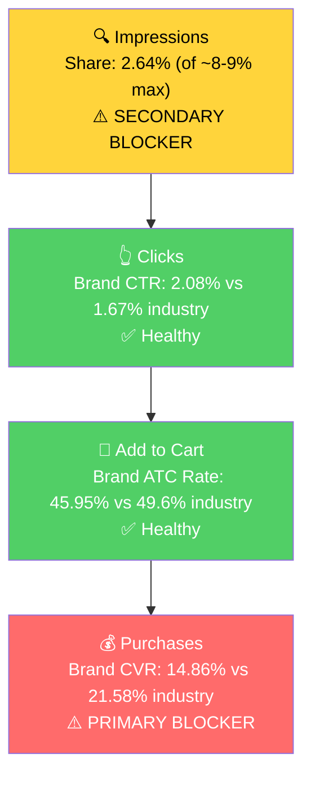

# Seller Central Audit - Olive Oil Lovers U.S.

## Quick Context

- 25-year-old Italian specialty food importer (Olio2go). Wholesaler model: imports Italian gourmet products and resells them on Amazon + Shopify.
- Catalog: 537 child ASINs across 497 parents. 274 had any sales in the last 3 months. The rest are dormant or dead.
- Revenue trajectory: ~$20k/month historically → $4-5k/month currently. Drop attributed to new competing sellers on shared listings (often the original importer itself) and stale listing content.
- **Only one exclusive brand:** Gragnano in Corsa IGP pasta (sole US importer). Everything else is a shared listing where Olive Oil Lovers competes for the buy box.
- **FBA constraints:** Olive oil and chocolate need climate control (Amazon FCs are not). Pasta, salt, taralli, vinegar are FBA-viable.
- **Supply constraints:** 1-month lead time from Italy, limited per-product quantities, 1-year shelf life on most items (pasta is 2 years). Seller confirmed they can serve 2-3x demand if growth happens over 4-5 months.
- **Almost no ads running** (one auto Sponsored Products vinegar campaign at ~$7/day). No brand registry done on most listings. Brand Analytics access confirmed.
- Landed COGS roughly 50% (~$16 on a $33 olive oil).

## Section 1: Catalog Assessment

| Priority | Product | 3-Mo Sales | 3-Mo Ad Spend | ROAS | TACoS | Organic Sales | Ad Sales % | Buy Box % | CVR | Trend |
|----------|---------|-----------|---------------|------|-------|---------------|------------|-----------|-----|-------|
| P0 | Selezione Tartufi Black Truffle Sea Salt 3.5oz (B001D6B0SG) | $1,562.94 | $0 | n/a | 0% | $1,562.94 | 0% | 10.3% (avg) | 8.2% (avg) | Growing strongly (Feb $105 → Apr $656) |
| P1 | Agrumato Lemon Olive Oil 6.76oz (B0C8926MS1) | $859.40 | $0 | n/a | 0% | $859.40 | 0% | 53.4% (avg) | 3.2% (avg) | Growing (Feb $87 → Apr $428) |
| P2 | Gragnano in Corsa IGP Pasta Line (11 SKUs, Fusilli B07YNBY8NV spearhead) | $133.89 | $0 | n/a | 0% | $133.89 | 0% | ~99% (uncontested) | 42.9% (Apr, on Fusilli) | Dormant but uncapped |
| P3 | Acetaia Cattani White Balsamic Vinegar 250ml 2-pack (B00D2WK03K) | $1,156.70 | $6.87 | $0 | 0.6% | $1,156.70 | 0% | 46.8% (avg) | 35.9% (avg) | Stable, Mar spike |

**Notes:**
- Buy Box % and CVR are 3-month averages. P0 in particular is improving each month (CVR 0.9% → 7.8% → 15.8%), so the average understates the current trajectory.
- ROAS and ad columns are mostly empty because total account ad spend over 3 months is under $200.
- Other products considered but not prioritized: Carlo Moro Pizzoccheri ($1,084 but declining hard, likely seasonal), Quattrociocchi Classico EVOO ($524 growing fast but olive oil FBA-hostile and only 2 months of data), Olio Beato EVOOs ($541 + $473, volatile and FBA-hostile), Terre di Puglia Tarallini ($633 with the cleanest fundamentals in the catalog but low ASP). The remaining ~270 active parents are sub-$200/3-mo with limited individual scaling potential.

## Section 2: Qualitative Product Understanding (P0)

**Product:**
- Glass-jar gourmet salt: sea salt blended with **10% dehydrated black truffle** from Italian forests, 3.5 oz / 100g
- The 10% black truffle concentration is unusually high. Most competitor truffle salts are 1-5% truffle. This is the headline differentiator the listing relies on.
- Solves the "I want truffle flavor without buying real truffles" problem. Sprinkled on popcorn, eggs, pasta, fries, mashed potatoes, risotto, grilled meats. Finishing salt, not cooking salt.
- People buy it as a small luxury upgrade for everyday cooking, or as a foodie/holiday gift.

**Customer:**
- Home cook who watches food content, knows what truffle is, and wants to recreate restaurant-style flavor at home. Also gift buyers and Italian-food enthusiasts.
- Purchase trigger is usually a specific dish - they saw truffle fries on a menu or Googled "what to put on popcorn" and ended up searching for truffle salt.

**Brand:**
- Selezione Tartufi is owned by **Italian Products Inc.**, a 20+ year old US-based Italian food importer (italianproducts.com). Olive Oil Lovers / Olio2go imports this brand from Italian Products and resells it.
- The listing is brand-registered (manufacturer A+ content), but the registered owner is Italian Products, NOT Olive Oil Lovers. **Brand control sits with the manufacturer.** This affects what we can change on the detail page in the next 8 weeks.
- **Brand vibe:** Old-world Italian, restrained, premium. Black label with a stylised tree-of-life logo on a small glass jar. No noisy taglines or marketing language on the jar. Reads "deli shelf" not "CPG aisle."

**Competitive Landscape:**

Average competitor $/oz is ~$3.30. P0 sits at $7.49/oz, **~2x the category average**.

| Brand | Closest Product | Size | Amazon Price | $/oz | Notes |
|-------|------------------|------|---------------|------|-------|
| **Selezione Tartufi (P0)** | Black Truffle Sea Salt 10% | 3.5 oz | $26.22 | $7.49 | 10% truffle concentration |
| TRUFF | Black Truffle Salt | 5.3 oz | $15-18 | $2.83-3.40 | Best-marketed brand on Amazon |
| Sabatino Tartufi | Truffle Salt with Sicilian Sea Salt | 4 oz | $13-16 | $3.25-4.00 | "Best overall" per review aggregators |
| Urbani | Italian Black Truffle Salt | 3.5 oz | $14-18 | $4.00-5.14 | Italian, premium positioning |
| Caravel Gourmet | Italian Black Truffle Sea Salt | 5 oz | $8-12 | $1.60-2.40 | Mid-market |
| Trader Joe's | Truffle Salt | 2.1 oz | ~$8 | $3.80 | Mass-market reference |

The 10% truffle concentration is genuinely 2-5x higher than category norms. If that claim is verifiable and detectable on the tongue, the premium price is defensible. If shoppers cannot tell, the price is a major CVR drag.

**Listing Quality:**

*Strengths:*
- **Main image:** Clean white background, premium black label, visible truffle flecks in the salt. Reads premium and trustworthy at thumbnail size.
- **Rating:** 4.6 stars, stable in the 4.3-4.6 band since 2019. No recent crashes, no hijack signal.
- **A+ content present and on-brand:** 4 manufacturer modules (brand logo, harvest story, "about Italian Products," comparison module pointing at 4 sister SKUs). The narrative is authentic-Italian-importer, which matches the price positioning.
- **Subscribe & Save enabled.** Recurring revenue lever exists.
- **10-year listing age** with consistent organic ranking - Amazon's algorithm has already validated this listing.

*Opportunities:*
- **Title under-sells the 10% concentration.** Current title buries "10%" mid-string with no context for why it matters. Suggested rewrite leads with origin and frames 10% in shopper-relevant terms (e.g., "5x More Than Standard").
- **Bullets are generic and skip the price justification.** All five bullets are variants of "use it on lots of foods" and "no preservatives." None explicitly address why the price is 2x.
- **A+ Content is standard, not Premium.** Premium A+ unlocks larger hero modules, video, and gives competitor-style visual punch. Manufacturer controls this.
- **No video.** Truffle salt is a sensory purchase - the buyer's hesitation is "will I actually taste it?" A 30-second clip of salt being sprinkled on popcorn or eggs resolves that hesitation directly.
- **Image set is light on lifestyle/use-case shots** (6 images total). Category leaders use eggs-with-truffle-salt, popcorn-with-truffle-salt, steak close-ups as appetite triggers.
- **No brand store** despite the listing being brand-registered.

## Section 3: Quantitative Product Understanding (P0)

**Annual Trend:**

| Metric | Sep 2025 (trough) | Nov 2025 (peak) | Jan 2026 (anomaly) | Apr 2026 (latest) |
|--------|-------------------|-----------------|---------------------|-------------------|
| Total Sales | $23 | $756 | $0 | $656 |
| Sessions | 459 | 540 | 44 | 158 |
| CVR % | 0.22% | 6.11% | 0.0% | 15.82% |
| Buy Box % | 0.0% | 23.3% | 3.5% | 16.8% |

- Sessions sit in a 400-650 band almost every month, which means the listing has stable organic visibility. Jan 2026 (44 sessions, $0 sales) was an anomaly - looks like a stockout or pricing event.
- **Revenue tracks buy box, not sessions.** Nov 2025 peak (BB 23%, revenue $756) and Sep 2025 trough (BB 0%, revenue $23) line up exactly. Sessions are not the constraint.
- CVR climbing across last six months (Oct 3.8% → Apr 15.8%). The listing is getting more efficient. Combined with chronically low buy box, any buy box gain compounds with above-trend CVR.

**Rating Trajectory:** Stable. 4.6 stars, oscillating 4.4-4.6 across rating updates back to 2016.

**Sales Rank Trajectory:** Stable. Sea Salt subcategory ranks cycle between ~205-430 in April with most readings in the 230-330 range. No collapse, no spike.

## Section 4: Market Opportunity (SQP)

**Important:** The seller's Brand Analytics SQP feed only covers their owned brand (Olio2go), which is registered for a narrow set of gift sets and specialty SKUs - NOT the wholesaler-resold ASINs like Selezione Tartufi. That means there is no truffle salt SQP data accessible.

The SQP step pivoted to the only Olio2go-owned ASIN with meaningful SQP signal: **B01N2Z8FQV (Naturally Dried Oregano from Sicily)**. The findings below are about the oregano product. They inform the broader "owned-brand" strategy for the action plan but do not directly size P0's market.

### Tier Breakdown (Oregano, B01N2Z8FQV)

- **Tier 1 (Hero - "Sicilian oregano" niche):**
  - **Keywords:** sicilian oregano, sicilian oregano from sicily, sicilian oregano dried, italian oregano from italy, oregano sicilian, oregano from sicily, oregano leaves naturally dried scilian, cutrera ibleo sicilian oregano
  - **Rationale:** Queries where shoppers are specifically looking for Sicilian / Italian-origin oregano. Product is the direct answer.
- **Tier 2 (Core market - "Dried oregano"):**
  - **Keywords:** oregano dried, organic sicilian oregano
  - **Rationale:** Broader dried-oregano searches where the brand can compete but is one option among many (McCormick, Simply Organic).
- **Tier 3 (Generic - "Oregano"):**
  - **Keywords:** oregano
  - **Rationale:** Category-defining single keyword. Most searchers want fresh herb, plants, or bulk culinary - not a $13 artisan jar.

### Market Sizing

| Tier | Avg Monthly Search Volume | Avg Monthly Add to Carts (Market) | Avg Monthly Purchases (Market) | Est. Market Size ($/mo) |
|------|---------------------------|------------------------------------|---------------------------------|--------------------------|
| Tier 1 | 1,234 | 327 | 142 | ~$4,250 |
| Tier 2 | 18,212 | 5,183 | 2,613 | ~$67,400 |
| Tier 3 | 70,150 | 26,689 | 15,029 | ~$346,950 |
| **Total** | **~89,600** | **~32,200** | **~17,780** | **~$418,600** |

*Estimated using $13 avg product price based on competitive landscape for premium Sicilian dried herbs.*

### Blockers & Growth Path

| Tier | Impression Share | CTR (Brand vs Industry) | CVR (Brand vs Industry) | Primary Blocker | Growth Path |
|------|------------------|-------------------------|-------------------------|-----------------|-------------|
| Tier 1 | 2.64% (of ~8-9% max) | 2.08% vs 1.67% (Healthy) | 14.86% vs 21.58% (31% gap) | **CVR**, with Impression Share secondary | Listing fix first, then PPC scale. Brand wins clicks at above-industry rate but loses ~31% of buyers between click and purchase. Fix the listing (bullets, A+, larger image set), then capture the 5-6pp of impression share headroom via PPC. |
| Tier 2 | 0.15% | n/a (data too thin) | n/a | **Impression Share** | Cold-start PPC opportunity. The same listing has to win Tier 2 clicks, so Tier 1 listing rebuild unlocks Tier 2 entry. |
| Tier 3 | 0.005% | n/a (1 click in 3 months) | n/a | **Intent mismatch** | Skip. "Oregano" generic intent is wrong fit for $13 25g artisan jar. |

### ICAP Funnel - Tier 1

- Olio2go-as-brand has effectively one organically winning SKU and one winning tier of queries. Everything else they own (gift sets, olive oils, thyme) shows near-zero impression share even on relevant queries.
- The Tier 1 listing has no bullets, no A+ content, no video, only 2 images. It is a 30-minute rebuild away from closing the CVR gap.
- The mis-categorization under "Produce > Fresh Vegetables" is likely suppressing organic eligibility for broader herb/spice queries. Worth re-categorising as a quick win.

## Section 5: Ad Analysis

### Account-Level Snapshot

The seller is running **one (1) ad campaign in the entire account**: an auto Sponsored Products campaign on vinegars at ~$7/day.

| Metric | Account Total (90 days) |
|--------|--------------------------|
| Active campaigns | 1 |
| Total ad spend | $653.92 |
| Total ad sales | $956.49 |
| ROAS | 1.46 (below 1.5 profitable threshold) |
| ACoS | 68.37% |

### Campaign Deep-Dive: SP Vinegar 16-jan-2025 b99aa1

One auto Sponsored Products campaign advertising **20 vinegar ASINs simultaneously**. All four spend buckets are Amazon auto-targeting types (close-match, loose-match, complements, substitutes). There is no manual keyword campaign anywhere in the account.

**Auto Target Type Breakdown:**

| Targeting | Impressions | Clicks | CTR | Spend | Sales | ROAS | CVR |
|-----------|-------------|--------|-----|-------|-------|------|-----|
| close-match | 75,796 | 259 | 0.34% | $345.99 | $491.86 | 1.42 | 5.41% |
| loose-match | 108,611 | 246 | 0.23% | $278.95 | $413.11 | 1.48 | 4.88% |
| complements | 13,628 | 25 | 0.18% | $23.81 | $51.52 | 2.16 | 8.00% |
| substitutes | 6,949 | 11 | 0.16% | $5.17 | $0.00 | 0.00 | 0.00% |

Loose-match (broadest, least relevant) gets 53% of impressions. Complements (best ROAS at 2.16x) gets 3.6% of spend. The auto algorithm is favouring the wrong buckets.

**Advertised Products (top by spend):**

| ASIN | Product | Spend | Sales | ROAS | CVR | Diagnosis |
|------|---------|-------|-------|------|-----|-----------|
| B004JC8II6 | Vincotto Vinegar, Raspberry | $232.98 | $128.64 | 0.55 | 3.09% | **Eating 36% of budget at sub-break-even** |
| B001YIV3OY | Badia a Coltibuono Red Wine Vinegar | $95.82 | $145.00 | 1.51 | 6.94% | Borderline profitable |
| B003YVODEG | (unnamed) | $66.71 | $29.00 | 0.43 | 1.69% | Unprofitable |
| B005XG9VLU | (unnamed) | $62.00 | $15.99 | 0.26 | 1.89% | Deeply unprofitable |
| B007W5OPQG | Gianni Calogiuri Fig Vincotto Balsamic | $38.78 | $213.66 | **5.51** | 20.69% | Strong winner |
| B003NY9NJO | Vincotto Calogiuri Fig Vincotto | $11.94 | $234.51 | **19.64** | 40.00% | **Best ROAS in account, starved of budget** |
| B0065MQAOM | Acetaia Cattani White Balsamic variant | $4.22 | $67.40 | **15.97** | 16.67% | Winner, starved |

**Top Search Term Performance:**

*Winning specialty searches (low spend, high ROAS - clear scaling opportunity):*
- vincotto fig vinegar: $5 spend, ROAS 7.12
- raspberry vinegar for salad: $2.63 spend, ROAS 8.15
- fig vinegar: $8.10 spend, ROAS 4.40
- fig vincotto: $4.29 spend, ROAS 5.00
- white wine vinegar: $8.08 spend, ROAS 2.79

*Generic terms bleeding budget:*
- balsamic vinegar: $75.97 spend, ROAS 0.38 (262% ACoS)
- raspberry vinegar: $71.27 spend, ROAS 0.30 (332% ACoS)

*Irrelevant search terms wasting spend (combined ~$55):*
- balsamic vinaigrette, raspberry vinaigrette, balsamic vinaigrette salad dressing (wrong intent - salad dressing not vinegar)
- bartenura moscato wine, arbor mist (wine brands)
- bristol farms (grocery store name)
- garum (Roman fish sauce)
- acetaia san giacomo, manicardi balsamic vinegar (competitor brands)

Roughly **30-35% of campaign spend is going to traffic that does not convert**.

### Finding: Restructure the one campaign

> **Problem:** One auto campaign is doing all the advertising for 20 different ASINs. Auto is meant for discovery only - find what works, then move into dedicated manual campaigns with controlled budgets and bids. None of that harvest-and-scale is happening. 36% of budget goes to B004JC8II6 at 0.55 ROAS. Meanwhile B003NY9NJO converts at 19.64 ROAS and gets $12.
>
> **Solution:**
> 1. **Pause the unprofitable ASINs:** B004JC8II6, B003YVODEG, B005XG9VLU, B00IHJ229S, B008SC6W2W, B0D7WWWYVB. Combined wasted spend ~$430 over 90 days.
> 2. **Launch manual exact-match campaigns** for winning specialty terms: "fig vinegar", "vincotto fig vinegar", "fig vincotto", "white wine vinegar", "raspberry vinegar for salad". Each gets its own campaign at $5-10/day so they actually capture impression share.
> 3. **Launch a manual product-targeting campaign** for the two top-ROAS ASINs (B003NY9NJO at 19.64x, B0065MQAOM at 15.97x) targeting competitor listings in the same category.
> 4. **Negate the irrelevant search terms** in the auto campaign (list above).
>
> **Impact:** Reallocating $230 from B004JC8II6 (0.55 ROAS) to manual campaigns built around proven 4-8x ROAS specialty terms produces, at a conservative 4x assumption, **~$920 in additional sales over 90 days from the same budget**, at a healthier account-level ROAS (~2.0x+).

### Wholesaler Buy Box - The Bigger Lever

Ad spend is a small lever for this seller because the entire account is doing ~$7/day. **Buy box is much bigger.**

**Account-level buy box** sits at **~45% across ~2,400 sessions/week**. More than half of session-attributed traffic ends up sending the customer to a competing seller on the same listing.

| Top ASIN | Apr 2026 Buy Box | Notable |
|----------|------------------|---------|
| Black Truffle Sea Salt | 16.83% | Chronic since at least May 2025. Revenue tracks BB perfectly across 12-month history. |
| Carlo Moro Pizzoccheri | 17.54% | Collapsed from 74% in March - new competing seller likely |
| Agrumato Lemon Olive Oil | 53.38% | "Galbasa" competitor explicitly running SP ads on this listing per the call |
| Acetaia Cattani White Balsamic | 55.17% | Sessions tiny but Apr CVR 68% - any BB gain = direct revenue |

The Black Truffle Sea Salt case shows it most clearly. 12 months of session data sits in the 400-650/month band, but revenue moves entirely with buy box. November (BB 23%) was the revenue peak. September (BB 0%) was the revenue floor. Sessions barely moved. **Buy box is the lever.**

**Three buy-box levers to pull:**

1. **Dynamic repricer.** Currently pricing is managed manually by Vally. A repricer (Sellerboard / Aura / Bqool / RepricerExpress) that tracks the buy box winner and price-matches within MAP/margin floors recovers buy box on price-driven losses. One-time integration.
2. **Defensive Sponsored Display + Sponsored Brand placements.** When the seller doesn't have the buy box organically, paid placements still capture click traffic that would otherwise go to a competitor on the same listing. The Agrumato listing is the textbook case - "Galbasa" is doing this to them; reverse it.
3. **Triage the catalogue.** Of 537 child ASINs, build three buckets: "winnable + worth winning" (e.g., Black Truffle Sea Salt - hold), "unwinnable but visible" (defensive ads only), "neither" (deprioritise to free up Vally's attention).

**Impact estimate:** Going from 45% to 65% account-level buy box on the same ~2,400 sessions/week, at the same per-session revenue rate, is roughly **+$620/week, +$2,700/month, +$32k/year**. Bigger than the entire current ad-spend lever, before any ad spend increase.

## Section 6: Action Plan

The primary blockers are: (a) buy box loss on wholesaler listings, (b) one structurally broken ad campaign, (c) listing-side CVR gaps on the few products they fully own. The first actions focus on stopping the bleeding (pause unprofitable ad spend, deploy a repricer) before scaling.

### Weeks 1-2: Immediate Actions (PPC + buy box bleeding)

- **Pause the unprofitable ASINs in the SP Vinegar campaign** (B004JC8II6, B003YVODEG, B005XG9VLU, B00IHJ229S, B008SC6W2W, B0D7WWWYVB). Frees up ~$430 of 90-day spend that was running below break-even.
- **Negate the 14 irrelevant search terms** in the auto campaign (salad dressing intent, wine brands, grocery store names, competitor brands).
- **Deploy a dynamic repricer** across the top 50 wholesaler ASINs by revenue. Start with the four hero ASINs (Black Truffle Sea Salt, Agrumato Lemon, Acetaia Cattani, Pizzoccheri) since they are losing the most revenue to buy-box churn. This alone should lift account-level buy box from ~45% toward 55-60% within 4 weeks.
- **Launch defensive Sponsored Display** on the Agrumato Lemon listing to counter the "Galbasa" attack named on the call.

### Weeks 2-4: Short-Term Optimizations (harvest the winning niche)

- **Launch manual exact-match campaigns** on the proven specialty search terms: "fig vinegar", "vincotto fig vinegar", "fig vincotto", "white wine vinegar", "raspberry vinegar for salad". $5-10/day per campaign so they actually capture impression share.
- **Launch a manual product-targeting campaign** for B003NY9NJO and B0065MQAOM targeting competitor balsamic/vincotto listings. These convert at 19.64x and 15.97x ROAS today with starved budgets.
- **Reduce loose-match bid** in the SP Vinegar auto campaign and let close-match + complements consume more share.
- **Start the listing rebuild for B01N2Z8FQV (Sicilian Oregano)** in parallel: write bullets, design A+ content modules, plan image set. Publish in Weeks 4-6 phase.
- **Triage the 537-ASIN catalogue** into the three buckets (winnable + worth defending / unwinnable but visible / deprioritise). Output: a working list of ~30-40 ASINs that get active attention.

### Weeks 4-6: Medium-Term Growth (listing rebuilds + brand registry)

- **Publish the rebuilt Sicilian Oregano listing** (B01N2Z8FQV) with proper bullets, A+ content, additional images, and re-categorise from Produce to Herbs & Spices. Expected impact: close the 31% CVR gap on Tier 1 queries.
- **Initiate Brand Registry on Gragnano in Corsa** pasta line. This is the seller's only exclusive brand and the registry is not done. Unlocks A+ content, Sponsored Brand ads, Brand Story, and protection against listing hijacking.
- **Co-pitch a Premium A+ upgrade for the Black Truffle Sea Salt listing** with Italian Products Inc. (brand owner). This is the seller's #1 revenue ASIN and the listing currently has standard A+ - Premium A+ is a meaningful CVR lift on a $26 luxury impulse purchase. Requires manufacturer coordination.
- **Launch Sponsored Products on the Sicilian Oregano listing** targeting Tier 1 terms once the listing is rebuilt. Test budget $5-10/day.

### Weeks 6-8: Scaling and Evaluation

- **Scale the proven manual vinegar campaigns** based on Week 2-4 performance data. Specialty terms with sustained 3x+ ROAS get budget increases.
- **Begin building out the Gragnano in Corsa pasta line** (P2): pick 2-3 SKUs from the line (Fusilli already shows life), rebuild listings with proper content, launch Sponsored Products on niche pasta queries (fusilli, paccheri, bucatini + brand modifiers).
- **Evaluate the buy-box impact** of the repricer rollout. By Week 8 we should see the account-level buy box trending toward 60%+. Anything not responding to repricing automation gets defensive ad treatment.
- **Plan Black Truffle Sea Salt ad launch.** This product currently has zero ad spend despite being the revenue leader. By Week 8 with the listing co-pitch in motion, we can layer in a small Sponsored Products test ($10/day) on truffle salt queries. Expect to learn fast since the listing already converts at 15.82% CVR when in the buy box.

## Section 7: Insights & Questions for the Seller

### Insights

- **Revenue is driven by buy box, not sessions, on the top wholesaler ASINs.** P0 (Black Truffle Sea Salt) shows 12 months of stable sessions but revenue swinging from $23 to $756 in lockstep with buy box %. Solving buy box is the dominant lever for the wholesaler portfolio.
- **The seller's only true moat (Gragnano in Corsa pasta) is producing $134/3-mo across 11 SKUs.** Brand registry is not done, ad spend is zero, listings are unbuilt. This is the largest greenfield opportunity in the audit and requires almost no defensive action - they own it.
- **The brand's defensible positioning - on both ads and search - is "authentic Italian importer" niche, not generic mainstream.** Winning ad ASINs are Vincotto/Fig/Calogiuri specialties. Winning search terms are "vincotto fig vinegar" not "balsamic vinegar." Winning SQP queries are "sicilian oregano" not "oregano." Strategy should lean entirely into named-Italian-regional queries.
- **One product (B004JC8II6 Vincotto Raspberry) is consuming 36% of total ad budget at 0.55 ROAS while the two top-converting products in the same campaign get $4-12 of budget.** Pure capital misallocation. Pausing it alone improves account ROAS meaningfully.
- **P0 (Black Truffle Sea Salt) has 10 years of organic equity at a 4.6 stable rating.** The listing has standard A+, no video, and a title that buries the 10% truffle differentiator. The CVR is climbing despite this (15.82% in April). Premium A+ + video + a sharper title is the highest-leverage detail-page rebuild in the catalogue.

### Questions for the Seller

- **Repricer:** Are you currently using any repricer (Sellerboard / Aura / Bqool / RepricerExpress), or is pricing being managed manually? If manual, that alone explains a large share of buy box loss across the catalog.
- **Gragnano in Corsa brand registry:** You're the sole US importer but brand registry hasn't been done. Is there a reason this hasn't been initiated, or has it just been on the to-do list? We can help kick it off.
- **Selezione Tartufi relationship:** The listing is registered to Italian Products Inc., not your account. What's your working relationship with them? Can you request listing changes (title, bullets, images, A+ upgrade), or do they own those decisions outright? This determines how much we can actually move on the truffle salt detail page.
- **January 2026 anomaly on Black Truffle Sea Salt:** 44 sessions, $0 sales, 3.5% buy box. Was this a stockout, a pricing event, a listing suppression, or something else?
- **Inventory on top-ROAS vinegars:** B003NY9NJO (Fig Vincotto) is converting at 40% CVR on tiny ad spend. Do you have meaningful inventory? Before we recommend scaling 10x+ we need to know supply can handle it.
- **Defensive ads on Agrumato:** "Galbasa" was named on the call as running ads on your Agrumato listing. Have you ever defended that listing with your own Sponsored Display, or has this gone unchallenged?
- **Of the 537 SKUs in the catalog, how many are you actively replenishing today vs. effectively retired?** We use this to prune the long tail and not waste analysis on dead listings.
- **Subscribe & Save on Black Truffle Sea Salt is enabled.** Do you have visibility into what share of current revenue is S&S recurring vs. one-time? S&S share is a strong lever for inventory pre-buys.
- **The Sicilian Oregano is listed under Produce > Fresh Vegetables instead of Herbs & Spices.** Was this a Day-1 setup error, or did Amazon force the category? Re-categorising likely opens organic eligibility for a wider keyword set.
