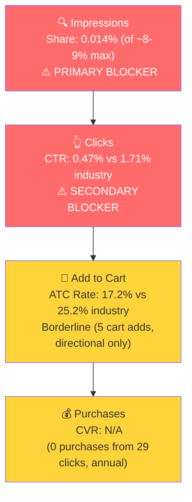

# SQP Analysis: P0 - Radon and Indoor Air Quality Monitor (SunRADON)

## Tagging Rationale

**Tier 1 (Hero):** Queries where the customer is searching specifically for a radon detection or monitoring device. P0 is the direct answer to the search.
- radon detector (~48K avg/mo)
- radon detector for home (~14K avg/mo)
- radon monitor (~2K avg/mo)
- continuous radon monitor (~1.2K avg/mo)
- home radon detector (~508 avg/mo)

**Tier 2 (Core market):** Queries combining radon with broader air quality monitoring. These match P0's multi-sensor value proposition exactly, but have very low search volume.
- air quality monitor indoor radon (~200/mo)
- radon air quality monitor (~133/mo)
- wifi radon monitor (~22/mo)
- air quality with radon (~24/mo)
- radon monitor plug in (~9/mo)
- air quality monitor indoor voc radon (~8/mo)

**Tier 3 (Broad/Adjacent):** Generic indoor air quality monitor queries. P0 IS an air quality monitor, but these searchers may want PM2.5, CO2, or other non-radon sensors. The competitive set is much broader (Airthings, Awair, IQAir, etc.), and the radon feature may not be the primary purchase driver for these customers.
- air quality monitor indoor (~30K avg/mo)
- air quality monitor (~30K avg/mo)

**Not tagged:** "radon test kit" (21-25K/mo) was excluded because the intent is fundamentally different. Radon test kits are $10-30 disposable short-term tests, while P0 is a $169 continuous monitor. The 10x price gap means P0 cannot realistically convert on this query. This is important context though: "radon test kit" represents a large adjacent market that P0 does not serve.

### Catalog Overlap Check

- P0 (Lüft, B0CDHFWJD1) is the consumer radon/air quality monitor at $169
- P1 (Model XP, B07QFS8YBZ) is the professional continuous radon monitor at $895

Both products could theoretically rank for "continuous radon monitor" and other Tier 1 queries. However, P1 sells 0-5 units/month and has extremely low sessions. In practice, the brand barely registers on any of these queries even with both products combined. Impression share cap remains at the default ~8-9% for Tier 1 and ~16-18% for "continuous radon monitor" specifically.

## Market Sizing

| Tier | Monthly Search Volume | Monthly Add to Carts (Market) | Monthly Purchases (Market) | Est. Market Size ($/mo) |
|------|----------------------|-------------------------------|---------------------------|------------------------|
| Tier 1 | 59,939 | 6,866 | 2,742 | $1,160,354 |
| Tier 2 | ~400 | ~9 | ~3 | ~$1,500 |
| Tier 3 | ~30,000 | ~2,643 | ~853 | $446,667 |
| **Total P0** | **~90,339** | **~9,518** | **~3,598** | **~$1,608,521** |

*Estimated using $169 avg product price based on P0 pricing and competitive landscape analysis.*

**Seasonality confirmed:** Tier 1 search volume peaks in fall/winter (Oct: 78K, Jan: 80K) and troughs in summer (Aug: 42K). This is a ~1.9x seasonal swing, consistent with radon testing behavior (homes sealed during heating season). The seller's revenue pattern from Step 1 (Oct 2025 peak at $8,493, Jul 2025 trough at $2,086) tracks this exactly. P0 is market-seasonal, and revenue fluctuations are driven by market demand, not brand-specific issues.

**Note on Tier 2:** The search volume is too low to be a meaningful standalone opportunity. The specific niche queries ("radon air quality monitor", "wifi radon monitor") represent a tiny fraction of the market. The real opportunity is in Tier 1 (pure radon) and Tier 3 (broad air quality).

## Market Share and Potential

| Tier | Impression Share | Click Share | Cart Share | Purchase Share | Trend |
|------|-----------------|-------------|------------|---------------|-------|
| Tier 1 | 0.014% | 0.004% | 0% | 0% | Flat (near zero) |
| Tier 2 | 0.36% | 0% | 0% | 0% | Flat (near zero) |
| Tier 3 | 0% | 0% | 0% | 0% | No data (invisible) |

The brand is essentially invisible across the entire search landscape. On Tier 1 queries alone, the addressable market is $1.16M/month, and SunRADON captures approximately 0% of it through search.

To put this in context: P0 sold $9,295 in March 2026 ($20,954 over 3 months), yet the Tier 1 market generates ~$2.7M in purchases monthly. The brand's entire revenue comes from the tiny sliver of customers who find the product outside of search (direct traffic, external referrals, or the handful of organic impressions).

## Blockers & Growth Path

| Tier | Impression Share | CTR (Brand vs Industry) | CVR (Brand vs Industry) | Primary Blocker | Growth Path |
|------|-----------------|------------------------|------------------------|-----------------|-------------|
| Tier 1 | 0.014% (of ~8-9% max) | 0.47% vs 1.71% (72% below, annual) | Insufficient data (0 purchases from 29 clicks, annual) | Impression Share | PPC scaling + CTR fix. Bid on all Tier 1 keywords to gain visibility, then address CTR gap via title rewrite, review accumulation, and Top of Search placement. |
| Tier 2 | 0.36% (of ~8-9% max) | Insufficient data | Insufficient data | Impression Share | Low volume, not a priority. Include in PPC campaigns as supplementary keywords. |
| Tier 3 | 0% (of ~8-9% max) | No data | No data | Impression Share | Longer-term opportunity. Broader competitive set, lower relevance. Address after Tier 1 share is established. |

**Note on time horizon:** 3-month data (Jan-Mar 2026) was insufficient for rate analysis (4 clicks, 0 purchases). Fell back to 12-month annual data (Apr 2025 - Mar 2026), which produced 29 clicks and 5 cart adds on Tier 1. This crosses the minimum threshold for CTR assessment but remains borderline for ATC rate and insufficient for CVR.

- **Tier 1 is the only tier that matters right now.** It has 40x the volume of Tier 2 and the search intent is a perfect match. The growth path is: first, gain visibility through PPC (the brand barely exists on search); second, address the CTR gap that will limit efficiency as impression share grows.

- **CTR is a secondary blocker on Tier 1.** Annual data shows brand CTR at 0.47% vs industry CTR at 1.71%, a 72% gap. When the brand does appear on search results, it gets clicked at less than a third the rate of competitors. This likely reflects the 4.0 rating (vs 4.3-4.5 for top competitors), low review count (58 vs thousands), and the clunky title (2.7 readability score). All of these suppress CTR on the search results page. This gap will limit ROAS as impression share scales, so it should be addressed in parallel with PPC scaling.

- **Tier 3 is a tertiary opportunity.** The market is large ($447K/mo), but the competitive set is much broader and the brand has zero presence. After establishing Tier 1 share and validating ad performance, Tier 3 keywords ("air quality monitor indoor", "air quality monitor") could be tested with PPC at lower bids.

- **CVR cannot be assessed from SQP data** even at the annual level (0 purchases from 29 brand clicks). The Seller Analytics data (7% CVR with ~150 sessions/week) and the ad data (11.32% CVR on Top of Search) suggest conversion is healthy when traffic arrives through the right channels, but we cannot compare brand vs industry search CVR. ATC rate (17.2% brand vs 25.2% industry) is directionally below industry but based on only 5 cart adds, so treat with caution.

*Funnel shown for Tier 1 using 12-month annual data (3-month data was insufficient). Impression share is the primary blocker. CTR is a confirmed secondary blocker at 72% below industry. ATC rate and CVR are directional only due to thin volume.*

## Insights

- P0 (Radon and Indoor Air Quality Monitor) operates in a $1.16M/month Tier 1 market with near-zero search visibility. The brand's current impression share of 0.014% means it appears in roughly 1 out of every 7,000 search impressions. This is the most extreme impression share gap in the audit, representing the single largest growth lever.
- The "radon test kit" market (21-25K searches/mo) is large and adjacent but fundamentally different in intent. At $10-30 per test vs $169 for P0, this is not a capturable market without a separate product. However, it indicates that many radon-concerned shoppers are defaulting to cheap test kits rather than continuous monitors, which could be an education/advertising opportunity.

## Things to Investigate Further

- P0 is running ads (Step 1 showed $731 in ad spend over 3 months), but SQP shows near-zero search visibility. Need to check in Step 4 which keywords the ads are actually targeting. If the ad spend is going to branded terms or irrelevant queries, it explains the disconnect.
- Tier 1 impression share was slightly higher in Oct 2025 (0.09%) vs Jan-Mar 2026 (0.014%). Check whether ad campaign changes or organic ranking shifts caused this decline.

## Questions for the Seller

- None. The SQP data tells a clear story: the product converts when found, but it is not being found. The solution is PPC scaling on Tier 1 keywords. No seller input is needed to act on this.
