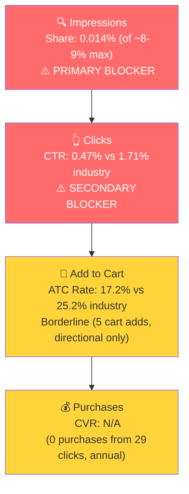

# Seller Central Audit: OneRADON

## Section 1: Catalog Assessment

| Priority | Product | 3-Mo Sales | 3-Mo Ad Spend | ROAS | TACoS | Organic Sales | Ad Sales % | Buy Box % | CVR | Trend |
|----------|---------|-----------|--------------|------|-------|---------------|-----------|-----------|-----|-------|
| P0 | Radon and Indoor Air Quality Monitor (B0CDHFWJD1) | $20,954 | $731 | 5.75 | 3.5% | $16,749 | 20.1% | 99.7% | 7.0% | Growing |
| P1 | Continuous Radon Monitor (B07QFS8YBZ) | $4,475 | $0 | N/A | 0% | $4,475 | 0% | 97.4% | 3.4% | Volatile |

P1 is a professional-grade continuous radon monitor priced at ~$895. It sells 0-5 units/month with no ad spend. Not a priority for investment.

## Section 2: Qualitative Product Understanding (P0)

**Product:**
- Plug-in indoor air quality monitor that continuously tracks radon, VOCs, eCO2, temperature, humidity, and air pressure
- Key differentiator: only multi-sensor radon monitor under $200. The comparable Airthings View Plus costs ~$330
- Solves the invisible threat of indoor air pollution. Radon is the #2 cause of lung cancer, and 1 in 15 homes have elevated levels
- Core purchase motivation: family health protection, especially in radon-prone regions

**Customer:**
- Health-conscious homeowners, particularly families with children. Marketing and A+ content lean into the parent/baby safety angle
- Desktop-heavy traffic (58-73%) suggests a research-driven purchase typical of $169 health/safety devices

**Brand:**
- **SunRADON** is the parent company, established 1985, market leader in professional radon testing (10M+ homes tested). **Lüft** is the consumer sub-brand launched in 2023
- Professional-first company expanding to consumer. Strong credibility signal: "Designed and Made in USA" with 4 decades of R&D
- Two websites: sunradon.com (professional) and luft-air.com (consumer DTC). Brand store on Amazon
- Brand vibe: clean, modern, approachable. Targets young families in bright, modern homes

**Competitive Landscape:**
- **Price positioning:** Avg multi-sensor radon monitor: ~$250 | P0: $169 | 32% below average

| Competitor | Price | Key Differentiator | Rating |
|-----------|-------|-------------------|--------|
| Airthings View Plus | ~$330 | Smart home integration, e-ink display, PM2.5 | 4.3 stars |
| Ecosense RadonEye RD200 | ~$174 | Fastest first reading, CNRPP certified | 4.3 stars |
| Airthings Corentium Home | ~$150 | Battery-powered, proven accuracy, simple | 4.5 stars |
| SafetySiren Pro4 | ~$179 | LCD display, no app required | 4.0 stars |

- P0's 4.0 rating (58 reviews) is the weakest in the competitive set. Airthings Corentium leads at 4.5 stars with thousands of reviews. Review count and rating are headwinds for CTR and CVR

**Listing Quality:**

**Strengths:**
- **A+ Content:** Premium, 6 image-only modules. Professionally designed with lifestyle photography, feature callouts baked into images, and persuasive data ("We spend 90% of our time indoors"). Excellent execution
- **Images:** 8 total. Main image clearly shows the device and mobile app side by side
- **Video:** 62-second product video present
- **Bullets:** 5 bullets with caps-first formatting, covering health motivation, radon stats, setup simplicity, and Made in USA
- **Brand store:** Present

**Opportunities:**
- **Title:** 183 characters with readability score of 2.7 (very low). "SunRADON luft - Radon and Indoor Air Quality Monitor, Portable Plugin Continuously Measures Also VOC, eCO2, Temperature, Pressure, and Humidity | Wi-Fi Connected | Mobile App Included" is technically complete but reads poorly. "Portable Plugin Continuously Measures Also" is clunky
- **Bullet length:** Individual bullets range 306-413 characters. Dense paragraphs that shoppers won't read. Tightening to 150-200 chars while preserving key messages would improve scannability
- **Rating trajectory:** Declining from 5.0 at launch (Nov 2023) to 4.0 currently. 19% of reviews are 1-2 stars. At $169 competing against 4.3-4.5 star products, this is a conversion headwind that PPC and listing optimization alone cannot fix
- **Review count:** 58 reviews is very low for this category. Competitors have thousands

## Section 3: Quantitative Product Understanding (P0)

**Annual Trend:**

| Metric | Jun 2025 | Oct 2025 (Peak) | Jan 2026 (Trough) | Mar 2026 (Latest) |
|--------|----------|----------------|-------------------|-------------------|
| Total Sales | $2,533 | $8,493 | $4,392 | $9,295 |
| Sessions | 270 | 724 | 575 | 746 |
| CVR | 6.3% | 8.8% | 5.4% | 7.5% |
| Buy Box % | 99.7% | 100% | 100% | 99.2% |

- P0 is market-seasonal. SQP search volume confirms a ~1.9x swing between summer trough and winter peak, matching the seller's revenue pattern exactly. Revenue fluctuations are driven by market demand (radon testing is highest during heating season when homes are sealed), not brand-specific issues.
- March 2026 ($9,295, 746 sessions) is the strongest month on record, suggesting growth on top of the seasonal recovery.

**Rating Trajectory:** Declining. From 5.0 at launch to 4.0 currently, stabilized in the 3.7-4.0 range since mid-2025.

**Sales Rank Trajectory:** Improving. Indoor Air Quality Meters subcategory rank improved from ~247 (Apr 2025) to ~73 (Apr 2026).

## Section 4: Market Opportunity (SQP)

**Tier Breakdown:**

- **Tier 1 (Hero):**
  - **Keywords:** radon detector, radon detector for home, radon monitor, continuous radon monitor, home radon detector
  - **Rationale:** Direct radon monitoring queries. The customer is searching for exactly the type of product P0 is. This is where the brand must win.

- **Tier 2 (Core market):**
  - **Keywords:** air quality monitor indoor radon, radon air quality monitor, wifi radon monitor, air quality with radon, radon monitor plug in, air quality monitor indoor voc radon
  - **Rationale:** Queries combining radon with broader air quality monitoring. Perfect match for P0's multi-sensor value prop, but very low search volume (~400/mo total).

- **Tier 3 (Broad/adjacent):**
  - **Keywords:** air quality monitor indoor, air quality monitor
  - **Rationale:** Generic air quality monitor queries. P0 competes here but against a much broader set of products (Airthings, Awair, IQAir). The radon feature is a differentiator, but not necessarily the primary purchase driver for these searchers.

**Market Sizing:**

| Tier | Monthly Search Volume | Monthly Add to Carts (Market) | Monthly Purchases (Market) | Est. Market Size ($/mo) |
|------|----------------------|-------------------------------|---------------------------|------------------------|
| Tier 1 | 59,939 | 6,866 | 2,742 | $1,160,354 |
| Tier 2 | ~400 | ~9 | ~3 | ~$1,500 |
| Tier 3 | ~30,000 | ~2,643 | ~853 | $446,667 |
| **Total P0** | **~90,339** | **~9,518** | **~3,598** | **~$1,608,521** |

*Estimated using $169 avg product price based on competitive landscape analysis.*

**Blockers & Growth Path:**

| Tier | Impression Share | CTR (Brand vs Industry) | CVR (Brand vs Industry) | Primary Blocker | Growth Path |
|------|-----------------|------------------------|------------------------|-----------------|-------------|
| Tier 1 | 0.014% (of ~8-9% max) | 0.47% vs 1.71% (72% below, annual) | Insufficient data (0 purchases from 29 clicks) | Impression Share + CTR | PPC scaling with placement optimization (Top of Search). CTR gap driven by 4.0 rating, 58 reviews, weak title. Address in parallel. |
| Tier 2 | 0.36% (of ~8-9% max) | Insufficient data | Insufficient data | Impression Share | Low volume, include as supplementary keywords |
| Tier 3 | 0% (invisible) | No data | No data | Impression Share | Secondary opportunity after Tier 1 is established |

**ICAP Funnel Visual:**

*Funnel shown for Tier 1 using 12-month annual data (3-month data was insufficient). Impression share is the primary blocker. CTR is a confirmed secondary blocker at 72% below industry, driven by the 4.0 rating (vs 4.3-4.5 competitors), 58 reviews (vs thousands), and low-readability title.*

- The addressable Tier 1 market is $1.16M/month. P0 captures approximately 0% of it through search. The entire $20,954 in quarterly sales comes from the handful of customers who find the product outside of search, plus a small auto campaign.
- "radon test kit" (21-25K searches/mo) is a large adjacent market, but the intent is for $10-30 disposable tests, not a $169 continuous monitor. Not capturable without a separate product.

## Section 5: Ad Analysis

### Account Level

**Campaign Structure**

Two campaigns total, both advertising P0:

| Campaign | Spend | Sales | ROAS | Clicks | Orders |
|----------|-------|-------|------|--------|--------|
| AD\|Luft\|Auto | $448 | $4,036 | 9.01 | 328 | 23 |
| AD\|Luft\|Manual-Exact | $363 | $676 | 1.86 | 138 | 4 |

> **Finding: Manual campaign's budget is consumed by one underperforming keyword**
>
> **Problem:**
> - "radon detector for home" (EXACT) absorbs $327 of $363 manual budget (90%) at 1.03 ROAS
> - 109 clicks, 2 orders, 1.83% CVR vs. auto campaign's 7.01% CVR
> - Remaining keywords are budget-starved: "radon detector" got $24, "air quality monitor" got zero clicks
>
> **Solution:**
> - Isolate keywords into separate campaigns with dedicated budgets and lower bids
> - Test "radon detector" and "air quality monitor" properly (17 and 0 clicks respectively is not enough data)
>
> **Impact:**
> - $163 reallocated from "radon detector for home" to the auto campaign at 9.01 ROAS = $1,469 in additional sales

**Auto vs Manual Split**

| Targeting Type | Clicks | Spend | Sales | ROAS | AOV | CPC | CVR |
|----------------|--------|-------|-------|------|-----|-----|-----|
| Automatic | 328 | $448 | $4,036 | 9.01 | $175 | $1.37 | 7.01% |
| Manual | 138 | $363 | $676 | 1.86 | $169 | $2.63 | 2.90% |

> **Finding: Auto drives 86% of ad sales at 4.8x the ROAS of manual**
>
> **Problem:**
> - The harvest-and-scale loop is broken. Amazon's algorithm is finding converting terms in auto, but they have never been extracted into manual campaigns with dedicated budgets
> - Manual CPC ($2.63) is nearly double auto CPC ($1.37), while converting at less than half the rate
>
> **Solution:**
> - Mine auto search terms, identify top converters, launch dedicated manual campaigns
> - Negate harvested terms from auto to avoid bid duplication

**Campaign Profitability**

No campaigns below 1.5x ROAS at the campaign level. However, targeting-level analysis reveals "radon detector for home" at 1.03 ROAS is the source of inefficiency within the manual campaign.

**Targeting Strategy**

**Keyword vs Product Targeting:**

| Targeting Strategy | Clicks | Spend | Sales | ROAS | AOV | CPC | CVR |
|-------------------|--------|-------|-------|------|-----|-----|-----|
| Keyword Targeting | 456 | $806 | $4,712 | 5.84 | $175 | $1.77 | 5.92% |
| Product Targeting | 10 | $5 | $0 | 0.00 | - | $0.50 | 0% |

**Match Type Breakdown:**

| Match Type | Clicks | Spend | Sales | ROAS | AOV | CPC | CVR |
|------------|--------|-------|-------|------|-----|-----|-----|
| EXACT | 138 | $363 | $676 | 1.86 | $169 | $2.63 | 2.90% |

Only EXACT match is used. No PHRASE or BROAD campaigns exist, meaning zero keyword discovery is happening through manual campaigns. All discovery relies on the auto campaign.

### Product Level (P0)

**P0 Campaign Map**

| Campaign | Spend | Sales | ROAS | Clicks | Orders |
|----------|-------|-------|------|--------|--------|
| AD\|Luft\|Auto | $448 | $4,036 | 9.01 | 328 | 23 |
| AD\|Luft\|Manual-Exact | $363 | $676 | 1.86 | 138 | 4 |
| **Total P0** | **$811** | **$4,712** | **5.81** | **466** | **27** |

100% of ad spend goes to P0. No other products are being advertised.

**Impression Share Blocker: Keyword Spend vs. Tier 1 Queries**

Section 4 identified impression share as the primary blocker on Tier 1 (0.014% of ~8-9% max). The PPC lever is bidding on the keywords where impression share is low. Here's what the ad data shows.

| Search Term | Tier | Spend | Sales | ROAS | Clicks | Orders | CVR |
|-------------|------|-------|-------|------|--------|--------|-----|
| radon detector for home | Tier 1 | $269 | $338 | 1.26 | 91 | 2 | 2.20% |
| radon detector | Tier 1 | $20 | $0 | 0.00 | 14 | 0 | 0% |
| indoor air quality monitor | Tier 3 | $33 | $169 | 5.16 | 17 | 1 | 5.88% |
| radon monitor | Tier 1 | $4 | $0 | 0.00 | 2 | 0 | 0% |
| air quality monitor indoor radon | Tier 2 | $5 | $169 | 32.01 | 3 | 1 | 33% |

The brand IS spending on Tier 1 keywords, but the CVR on manual exact targeting (1.85%) is dramatically lower than auto CVR (7.01%). The placement data explains why.

**Impression Share Blocker: Placement Distribution**

| Placement | Spend | Sales | ROAS | CTR | CVR | Clicks |
|-----------|-------|-------|------|-----|-----|--------|
| Top of Search | $112 | $2,177 | 19.36 | 6.87% | 11.32% | 106 |
| Rest of Search | $297 | $1,859 | 6.25 | 0.44% | 6.18% | 178 |
| Product Pages | $401 | $676 | 1.68 | 0.23% | 2.20% | 182 |

> **Finding: 49% of ad spend goes to Product Pages at 1.68 ROAS, while Top of Search converts at 19.36 ROAS with only 14% of budget**
>
> **Problem:**
> - Product Pages: $401 spend (49.5%), 1.68 ROAS, 2.20% CVR
> - Top of Search: $112 spend (13.9%), 19.36 ROAS, 11.32% CVR
> - The manual campaign's "radon detector for home" keyword at $3.00 CPC is almost certainly landing on Product Pages, explaining its 1.03 ROAS
>
> **Solution:**
> - Set Top of Search bid modifier to +100-200% on both campaigns
> - Reduce CPC on "radon detector for home" to lower Product Page placement
>
> **Impact:**
> - Doubling Top of Search spend from $112 to $225 at even half the current ROAS (9.7x) would generate ~$2,183 in additional sales
> - Reducing Product Pages spend by $150 saves $150 while losing only ~$252 in sales (1.68 ROAS)
> - Net: ~$1,931 additional sales from the same total budget

## Section 6: Action Plan

The primary blocker is **impression share**. P0 operates in a $1.16M/month Tier 1 market and is virtually invisible on search. The product converts well when found (7% organic CVR, 11.32% CVR on Top of Search ads). The growth path is PPC scaling combined with placement optimization to make the product visible on the keywords that matter.

### Weeks 1-2: Immediate Actions (PPC Restructuring)

- **Restructure the manual campaign.** Isolate "radon detector for home", "radon detector", and "air quality monitor" into separate manual exact campaigns with dedicated daily budgets ($10-15/day each). Lower the CPC on "radon detector for home" from $3.00 to $1.50-2.00 to reduce Product Page placements
- **Set Top of Search bid modifier to +150%** on all campaigns. Top of Search delivers 19.36 ROAS vs 1.68 on Product Pages. Shifting spend to this placement is the fastest ROAS improvement
- **Harvest auto campaign winners.** Extract "indoor air quality monitor" (5.16 ROAS), "luft radon detector" (20.10 ROAS), and "luft air quality monitor" (68.70 ROAS) into dedicated manual campaigns. Negate these terms from auto
- **Launch branded defense campaign.** "luft" and branded variants convert at 14-50% CVR. Create a small branded exact match campaign ($5/day) to protect this traffic. Currently handled by auto, which is inefficient

### Weeks 2-4: Short-Term Optimizations (Keyword Expansion)

- **Add PHRASE and BROAD match campaigns** for Tier 1 keywords. Currently only EXACT match exists, providing zero keyword discovery through manual campaigns. Launch "radon detector" and "radon monitor" as PHRASE match with moderate bids ($1.50 CPC) to discover long-tail variations
- **Scale Top of Search winners.** Monitor the restructured campaigns from Weeks 1-2. For any keyword achieving >3x ROAS on Top of Search, increase daily budget by 50%
- **Negate irrelevant search terms** from the auto campaign: "smart home", "homekit", "radon fan kit", "radon mitigation system", "vacation rental noise monitor" and similar non-converting terms

### Weeks 4-6: Medium-Term Growth (Listing + Scaling)

- **Title rewrite.** Improve readability (currently 2.7/100) while maintaining keyword coverage. Suggested direction: lead with "Radon and Indoor Air Quality Monitor" (the primary search term), make the 6-in-1 value prop punchy, remove clunky phrasing
- **Bullet optimization.** Tighten from 300-400 chars to 150-200 chars per bullet. Lead with benefits, follow with one supporting sentence. Current bullets are substantive but too dense to scan
- **Test Tier 3 keywords.** Launch a low-bid ($1.00 CPC) BROAD match campaign for "air quality monitor" and "indoor air quality monitor". The auto campaign already validated this space (5.16 ROAS on "indoor air quality monitor"). These are high-volume queries (~30K/mo each) that could significantly expand reach
- **Monitor CVR impact** from listing changes before scaling further

### Weeks 6-8: Scaling and Evaluation

- **Scale Tier 1 PPC** based on 6 weeks of performance data. By this point, the restructured campaigns should have enough data to identify the highest-ROAS keywords for aggressive scaling
- **Evaluate the rating trajectory.** With only 58 reviews, each new review materially impacts the star rating. If the trend stabilizes at 4.0+, the product is viable for long-term scaling. If it continues declining below 4.0, this becomes the binding constraint that limits the ceiling regardless of PPC investment
- **Assess Tier 3 campaign performance.** If broad air quality monitor queries convert at >3x ROAS, scale those campaigns. This unlocks a $447K/month market
- **Evaluate P1** (Professional Continuous Radon Monitor) for potential. At $895 with 0-5 units/month, it may serve a professional niche that does not benefit from Amazon PPC. If the seller confirms it's active, assess separately

## Section 7: Insights & Questions for the Seller

**Insights:**

- P0 (Radon and Indoor Air Quality Monitor) sits in a $1.16M/month Tier 1 market with 0.014% impression share. The brand is invisible on search despite having a product that converts at 7% CVR organically and 11.32% CVR on Top of Search ads. The growth opportunity is enormous and the path is clear: PPC scaling with placement optimization.
- The current ad setup has a structural problem: the auto campaign (9.01 ROAS, 23 orders) massively outperforms the manual campaign (1.86 ROAS, 4 orders). The harvest-and-scale loop is broken. Fixing campaign structure and placement allocation alone could double ad-attributed sales from the same $811 monthly budget.
- P0's competitive positioning is strong. It is the only multi-sensor radon monitor under $200 (Airthings View Plus costs $330 for similar capability), backed by a 40-year professional brand (SunRADON). The value proposition is clear, and the brand credibility is genuine.
- Seasonality is confirmed by SQP data: radon search volume peaks 1.9x in fall/winter vs. summer. The seller's revenue follows the same curve. This is market-driven, not brand-specific. Ad budgets should be increased in Q4 and Q1 to capture peak demand.

**Questions for the Seller:**

- P0's rating has declined from 5.0 to 4.0 over its lifetime, with 19% of reviews at 1-2 stars. Are there known product quality issues, accuracy complaints, or app reliability problems driving the negative reviews? This is the one risk factor that could limit the ceiling regardless of PPC investment.
- P1 (Continuous Radon Monitor, $895) has zero ad spend and 0-5 units/month. Is this product being phased out, or does it serve a professional customer segment that is marketed through other channels?
