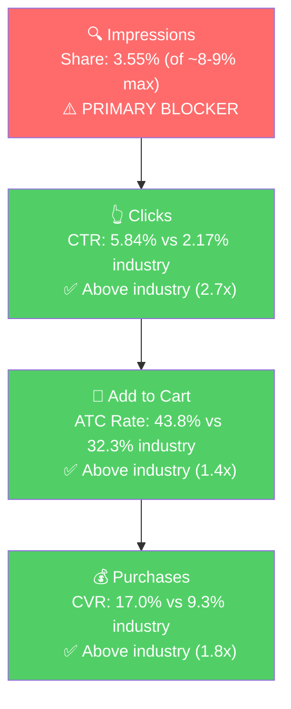

# SQP Analysis: P0 - Face Cleansers (Cucumber + Calendula)

## Tagging Rationale

**Tier 1 (Hero):** Queries where the customer is searching for exactly a cucumber or calendula face cleanser. The product is the direct answer to the search.
- Keywords: cucumber face wash, cucumber face cleanser, calendula face wash, cucumber facial cleanser, face wash cucumber, cucumber cleanser, calendula face cleanser, calendula cleanser, cucumber face soap, calendula facial cleanser

**Tier 2 (Core market):** Queries for natural, gentle, vegan, or organic face cleansers. The product fits the intent but competes against CeraVe, Cetaphil, Kiehl's, and hundreds of other brands. Much larger market but much harder to capture.
- Keywords: natural face wash, natural face cleanser, all natural face wash, natural facial cleanser, all natural face cleanser, gentle face cleanser, gentle face wash, aloe face wash, vegan face wash, natural face wash for women, plant based face wash

**Tier 3 (Broad):** Generic queries like "face wash", "face cleanser", "facial cleanser", "face wash for women". These have 100K-600K monthly search volume, but Sapo has near-zero traction and will not realistically compete for these terms with its current brand scale. Tagged for reference but not a growth lever today.

**Catalog Overlap Check:**
- Tier 1: Cucumber-specific queries (60% of tier volume) match only the Cucumber cleanser. Calendula-specific queries (30%) match only the Calendula cleanser. No overlap on most queries, so cap remains ~8-9% per query.
- Tier 2: Both cleansers could rank for "natural face cleanser", "gentle face wash", etc. Adjusted cap: ~16-18%.

## Market Sizing

12-month annual window (Apr 2025 - Feb 2026, 11 months of data).

| Tier | Monthly Search Volume | Monthly Add to Carts (Market) | Monthly Purchases (Market) | Est. Market Size ($/mo) |
|------|----------------------|-------------------------------|---------------------------|------------------------|
| Tier 1 | ~1,283 | ~196 | ~60 | ~$1,958 |
| Tier 2 | ~38,867 | ~7,244 | ~2,603 | ~$72,367 |
| Tier 3 | ~230,000+ | ~50,000+ | ~20,000+ | ~$500K+ |
| **Total P0 (Tier 1+2)** | **~40,150** | **~7,440** | **~2,663** | **~$74,325** |

*Estimated using $9.99 avg product price based on Sapo's price point. Market-wide average is higher (~$12-15), which would make the market larger.*

**Seasonality:** Tier 1 search volume is relatively stable (975-1,783/mo), with no clear seasonal pattern. Tier 2 grew significantly from ~15K (Apr 2025) to ~48-51K (Nov 2025 - Jan 2026), though some of this may be category growth rather than seasonality. The P0 revenue decline noted in Step 1 is not market-driven on Tier 1 queries, which held steady. The decline is brand-specific (losing visibility).

## Market Share and Potential

3-month window (Jan-Feb 2026, 2 months of data available).

| Tier | Impression Share | Click Share | Cart Share | Purchase Share | Trend |
|------|-----------------|-------------|------------|---------------|-------|
| Tier 1 | 3.55% | 9.40% | 12.85% | 17.36% | Stable |
| Tier 2 | 0.06% | 0.05% | 0.04% | 0.03% | Flat (negligible) |
| Tier 3 | <0.01% | <0.01% | <0.01% | <0.01% | N/A |

**Key observations:**
- Tier 1 funnel is exceptionally strong: the brand captures 3.55% of impressions but converts those into 17.36% of purchases. This means when the product shows up, it wins disproportionately.
- Tier 2 is essentially zero. The brand is invisible on natural/gentle/vegan face cleanser queries, despite these being highly relevant to the product.
- The Tier 2 market is ~37x larger than Tier 1. Even capturing 1% purchase share on Tier 2 would roughly double P0's revenue.

## Blockers & Growth Path

**Blocker detection (volume-weighted averages):**

**Tier 1 (3-month window, Jan-Feb 2026):**
- Brand CTR: 5.84% vs Industry CTR: 2.17% (brand is 2.7x industry)
- Brand ATC Rate: 43.8% vs Industry ATC Rate: 32.3% (brand is 1.4x industry)
- Brand CVR: 17.0% vs Industry CVR: 9.3% (brand is 1.8x industry)

**Tier 2 (annual fallback, Apr 2025 - Feb 2026, 191 brand clicks):**

The 3-month window had only 28 brand clicks, insufficient for rate analysis. Falling back to the full 11-month annual window, which has 191 brand clicks, 67 cart adds, and 15 purchases. This is sufficient.

- Brand CTR: 1.11% vs Industry CTR: 1.50% (brand is 74% of industry, slightly below)
- Brand ATC Rate: 35.1% vs Industry ATC Rate: 41.5% (brand is 84% of industry, slightly below)
- Brand CVR: 7.85% vs Industry CVR: 14.78% (brand is 53% of industry, significantly below)
- Brand Cart-to-Purchase: 22.4% vs Industry: 35.6% (brand is 63% of industry)

The CVR gap is the standout finding. The brand converts at roughly half the industry rate on Tier 2 queries. The drop-off happens at both the ATC stage (35% vs 42%) and the cart-to-purchase stage (22% vs 36%). This means the product loses shoppers both on the listing page (they don't add to cart) and after adding to cart (they don't complete the purchase).

**Likely explanation:** On Tier 2 queries like "natural face cleanser" or "gentle face wash," Sapo competes against established brands (CeraVe, Cetaphil, Kiehl's) with thousands of reviews and larger bottles. The 4 oz size at $9.99 may look small next to 6-8 oz competitors at $12-15. The ingredient-label bullet format doesn't differentiate the product. Low review count reduces trust. The cart-to-purchase drop-off (22% vs 36%) could indicate price sensitivity at checkout or comparison shopping after adding to cart.

| Tier | Impression Share | CTR (Brand vs Industry) | CVR (Brand vs Industry) | Primary Blocker | Growth Path |
|------|-----------------|------------------------|------------------------|-----------------|-------------|
| Tier 1 | 3.55% (of ~8-9% max) | 5.84% vs 2.17% (Healthy) | 17.0% vs 9.3% (Healthy) | Impression Share | PPC scaling: brand converts at 2x industry when visible. Bid on cucumber/calendula cleanser queries to increase impression share from 3.55% toward 8-9% cap. |
| Tier 2 | 0.06% (of ~16-18% max) | 1.11% vs 1.50% (Borderline) | 7.85% vs 14.78% (Blocker, 47% gap) | Impression Share + CVR | Low impression share AND poor CVR. Before scaling Tier 2 PPC, fix the listing (bullets, A+ content) to close the CVR gap. More clicks at 53% of industry CVR burns money. Fix listing first, test with small PPC budget, then scale only if CVR improves. |
| Tier 3 | <0.01% | N/A | N/A | Not capturable | Skip. Brand scale is too small to compete on "face wash" (605K vol). Revisit only if Tier 1+2 are maxed out. |

### ICAP Funnel: Tier 1 (Hero)

**Tier 1 story:** P0 has a healthy product that the market wants. When shoppers see it on Tier 1 queries, they click it 2.7x more than average, add to cart 1.4x more, and buy 1.8x more. The entire funnel is above industry at every stage. The only problem is that it barely shows up (3.55% impression share). This is the ideal PPC scaling scenario: more impressions = more sales, at a predictable rate.

**Tier 2 story:** Different picture. The brand barely shows up (0.06% impression share), AND when it does show up on broader "natural face cleanser" type queries, it converts at roughly half the industry rate (7.85% vs 14.78% CVR). This is the "low impression share + poor CVR" pattern from the ICAP framework. Before scaling Tier 2 impressions, CVR must be addressed first, because more clicks with poor conversion just burns money. Cross-referencing with Product Understanding (Step 2e): the listing has fixable gaps (ingredient-label bullets, minimal A+ content, no cross-sell or comparison modules). The CVR gap is likely solvable through listing optimization, but should be fixed before spending on Tier 2 PPC.

## Insights

- **P0 (Face Cleansers) is under-visible on Tier 1, not under-performing.** The 55% revenue decline from Apr 2025 to Mar 2026 is an impression share / visibility problem on the hero queries. The product converts at 1.8x industry when it appears on Tier 1.
- **Tier 2 is a $72K/mo market, but the brand has a CVR problem there.** Sapo has 0.06% impression share AND converts at 53% of industry. This is not a simple "just bid on these keywords" opportunity. The listing needs to be competitive against CeraVe, Cetaphil, and Kiehl's before scaling Tier 2 PPC. Fix the listing first, then test.
- **Branded queries are a meaningful signal of brand equity.** The "sapo" query alone has ~1,000 monthly search volume with strong conversion. This is a real brand, not a commodity product.

## Things to Investigate Further

- **Is the seller bidding on Tier 1 queries (cucumber face wash, calendula face wash)?** If yes, the low impression share despite ad spend suggests either budget is too low or bids are not competitive. If no, this is the lowest-hanging fruit. Check ad search term reports in Step 4.
- **Are any Tier 2 queries being targeted in current campaigns?** The brand started running ads in Jan 2026 but impression share on Tier 2 is still 0.06%. Need to see what the current campaigns are actually targeting.

## Questions for the Seller

(None. The data tells a clear story. The questions from Step 1 about why ads started in January remain relevant.)
