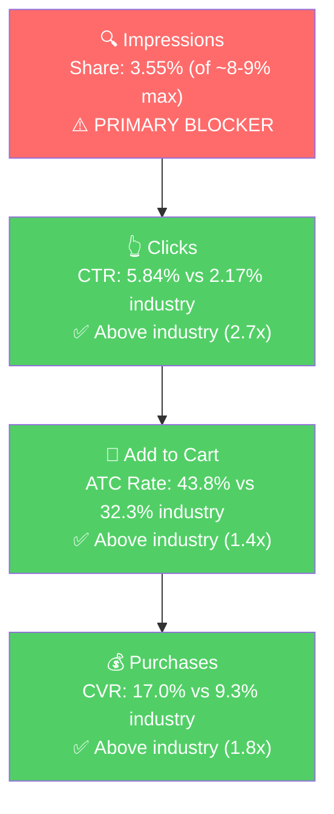

# Seller Central Audit: Sapo All Natural

## Section 1: Catalog Assessment

| Priority | Product | 3-Mo Sales | 3-Mo Ad Spend | ROAS | TACoS | Organic Sales | Ad Sales % | Buy Box % | CVR | Trend |
|----------|---------|-----------|--------------|------|-------|---------------|-----------|-----------|-----|-------|
| P0 | Face Cleansers (Cucumber + Calendula) | $5,184 | $473 | 1.77 | 9.1% | $4,347 (83.8%) | 16.2% | ~99% | Cuc 29% / Cal 10% | Declining |
| P1 | All Natural Face Cream | $899 | $42 | 3.81 | 4.7% | $739 (82.2%) | 17.8% | ~99% | ~12% | Declining |
| P2 | Hydrating Night Cream | $340 | $9 | 4.35 | 2.7% | $300 (88.2%) | 11.8% | ~93% | ~15% | Declining |
| P3 | Bakuchiol Face Serum | $220 | $24 | 5.42 | 10.7% | $90 (40.9%) | 59.1% | ~96% | ~7% | Growing |

**Note:** Cucumber and Calendula Cleansers are the same product in different scents, merged as P0. Cucumber accounts for ~77% of combined revenue.

**Not prioritized:** Vitamin C Serum ($220, declining), Milk Tea Body Lotion ($140, sub-2% CVR, burning ad spend), Cooling Peptide Eye Gel ($100, 2.5% CVR). These three products collectively contribute less than 7% of revenue with poor conversion.

## Section 2: Qualitative Product Understanding (P0)

**Product:**
- Natural face cleanser in a 4 oz pump bottle. Cucumber variant is a gel wash; Calendula variant is a creamy wash.
- Key ingredients: cucumber/calendula extract, aloe vera, coconut oil, neem, vitamin C, hyaluronic acid. Sulfate-free, paraben-free, vegan, cruelty-free (Leaping Bunny certified).
- Solves the "gentle daily cleanse" need for people who want to avoid harsh chemicals without paying $25-40 for a premium natural cleanser.
- Purchase motivation: affordable entry to natural skincare at $9.99.

**Customer:**
- Budget-conscious women (25-45) looking for clean/natural skincare. Daily AM/PM use. Subscribe & Save enabled.

**Brand:**
- Registered brand, founded 2017 by Dao in San Francisco. Family-owned, ~9 years old.
- Amazon-native, expanded to Shopify DTC (sapoallnatural.com), Walmart.com, and Faire wholesale. Leaping Bunny and PETA certified. Minority-owned.
- Social presence is small (~3K Instagram followers) but the brand has a professional website and consistent visual identity.
- **Brand vibe:** Clean, approachable, earthy. Tagline: "Good skin care should be affordable." Not luxury. Calm and natural with packaging color-coded per variant.

**Competitive Landscape:**

- **Price positioning:** Avg natural face cleanser: ~$12-15/4oz. P0: $9.99/4oz. ~25-30% below mid-range. However, the 4 oz bottle is smaller than category standard (5-8 oz), making per-ounce cost ($2.50) actually mid-range.

| Competitor | Product | Price | Size | Rating | Reviews |
|-----------|---------|-------|------|--------|---------|
| APRILSKIN | Calendula Low pH Gel Cleanser | $13.50 | 6.76 oz | 4.4 | 5,000+ |
| Yes To | Cucumbers Daily Gentle Milk Cleanser | $7-9 | 6 oz | 4.1 | 3,000+ |
| Kiehl's | Calendula Deep Cleansing Face Wash | $32-38 | 7.8 oz | 4.6 | 8,000+ |
| 100% PURE | Cucumber Cloud Foam Cleanser | $28-32 | 5 oz | 4.3 | 500+ |

Main competitive gap is review count and brand recognition, not price or product quality. Cucumber's 4.5 rating is competitive with market leaders.

**Listing Quality:**

**Strengths:**
- 11 videos on Cucumber (seller, influencer, customer content). Genuinely impressive for a small brand. Strong competitive advantage for a product where texture and feel matter.
- Clean, professional main images with clear branding and color-coded variants
- A+ content present on both listings with ingredient modules and before/after video
- Subscribe & Save enabled, appropriate for a daily-use consumable
- Cucumber rating at 4.5 stars on an improving trajectory (was 4.1 in 2021)

**Opportunities:**
- **Cucumber bullets need a rewrite.** All 5 follow "Ingredient Name: Properties" format. No benefit-led structure, no allcaps headers. They read like a supplement label, not selling points. Calendula's bullets are actually better written (benefit-first).
- **A+ content is minimal.** Only 4 modules, images reused from gallery. Missing: cross-sell module (cleanser > serum > cream routine), comparison chart (Cucumber vs Calendula), trust/certification module (Leaping Bunny, PETA, Made in USA).
- **Calendula rating dropped from 4.4 to 4.2 in March 2026.** Recent decline after a period of improvement. At 4.2, it's a conversion headwind vs Cucumber's 4.5.
- **Calendula title is 169 chars (too long).** Will truncate on mobile before key selling points appear.

## Section 3: Quantitative Product Understanding (P0)

**Annual Trend:**

| Metric | Apr 2025 (Peak) | Sep 2025 (Trough) | Jan 2026 (Ads Start) | Mar 2026 (Latest) |
|--------|----------------|-------------------|---------------------|-------------------|
| Total Sales (Cucumber) | $2,498 | $1,388 | $1,449 | $1,119 |
| Sessions | 751 | 452 | 582 | 386 |
| CVR | 33.4% | 31.4% | 25.4% | 29.3% |
| Buy Box % | 100% | 99.3% | 97.2% | 98.6% |

- Cucumber revenue declined 55% from peak ($2,498 to $1,119) over 12 months. This is a traffic/visibility problem: sessions dropped from 751 to 386.
- CVR dipped when ads started (25.4% in Jan vs ~35% organic-only) as expected, because paid traffic converts lower. Product still converts well when people land on it.

**Rating Trajectory:** Cucumber: Stable at 4.5 (improving long-term). Calendula: Declined from 4.4 to 4.2 in March 2026. Worth monitoring.

**Sales Rank Trajectory:** Cucumber ranges ~930-1,470 in Face Washes subcategory (mid-range, moderate volatility). Calendula ranges ~1,400-2,900 (worse, more volatile).

## Section 4: Market Opportunity (SQP)

**Tier Breakdown:**

- **Tier 1 (Hero):**
  - **Keywords:** cucumber face wash, cucumber face cleanser, calendula face wash, cucumber facial cleanser, face wash cucumber, cucumber cleanser, calendula face cleanser, calendula cleanser, cucumber face soap, calendula facial cleanser
  - **Rationale:** Queries where the customer is searching for exactly what Sapo sells. These are the must-win keywords.

- **Tier 2 (Core market):**
  - **Keywords:** natural face wash, natural face cleanser, all natural face wash, natural facial cleanser, all natural face cleanser, gentle face cleanser, gentle face wash, aloe face wash, vegan face wash, natural face wash for women, plant based face wash
  - **Rationale:** The broader natural/gentle/vegan cleanser market. Same customer need, but the product competes against many brands. 37x larger than Tier 1.

- **Tier 3 (Broad):**
  - **Keywords:** face wash, face cleanser, facial cleanser, face wash for women
  - **Rationale:** Generic cleanser queries with 100K-600K monthly volume. Not capturable at current brand scale.

**Market Sizing:**

| Tier | Monthly Search Volume | Monthly Add to Carts (Market) | Monthly Purchases (Market) | Est. Market Size ($/mo) |
|------|----------------------|-------------------------------|---------------------------|------------------------|
| Tier 1 | ~1,283 | ~196 | ~60 | ~$1,958 |
| Tier 2 | ~38,867 | ~7,244 | ~2,603 | ~$72,367 |
| Tier 3 | ~230,000+ | ~50,000+ | ~20,000+ | ~$500K+ |
| **Total P0 (Tier 1+2)** | **~40,150** | **~7,440** | **~2,663** | **~$74,325** |

*Estimated using $9.99 avg product price based on Sapo's price point.*

**Blockers & Growth Path:**

| Tier | Impression Share | CTR (Brand vs Industry) | CVR (Brand vs Industry) | Primary Blocker | Growth Path |
|------|-----------------|------------------------|------------------------|-----------------|-------------|
| Tier 1 | 3.55% (of ~8-9% max) | 5.84% vs 2.17% (Healthy, 2.7x) | 17.0% vs 9.3% (Healthy, 1.8x) | Impression Share | PPC scaling: converts at 2x industry when visible. Scale "cucumber face wash" bidding from $12/3mo to $150+/3mo. |
| Tier 2 | 0.06% (of ~16-18% max) | 1.11% vs 1.50% (Borderline) | 7.85% vs 14.78% (Blocker, 47% gap) | Impression Share + CVR | Low impression share AND poor CVR (53% of industry). Fix listing first (bullets, A+ content), then test PPC. Don't scale until CVR improves. |
| Tier 3 | <0.01% | N/A | N/A | Not capturable | Skip. Revisit only if Tier 1+2 are maxed. |

*Tier 2 rates use annual data (11 months, 191 brand clicks) because the 3-month window had insufficient volume (28 clicks).*

**ICAP Funnel Visual (Tier 1):**

- **Tier 1:** The entire funnel is above industry at every stage. The only problem is visibility. This is the ideal PPC scaling scenario.
- The brand was 100% organic until January 2026. Tier 1 search volume has been stable (~1,283/mo) while sessions declined, confirming the decline is brand-specific visibility loss, not market contraction.
- **Tier 2:** Different story. The brand barely shows up (0.06%) AND converts at roughly half the industry rate (7.85% vs 14.78% CVR) when it does. This is the "low impression share + poor CVR" pattern: CVR must be fixed before scaling PPC, because more clicks at 53% of industry CVR burns money. The listing has fixable gaps (ingredient-label bullets, minimal A+ content) that likely explain the CVR gap. Fix listing first, then test Tier 2 PPC.

## Section 5: Ad Analysis

### Account Level

**Campaign Structure**

36 active campaigns for 8 products. 17 "Brands SP" campaigns spent $17.52 total over 3 months for $29.98 in sales. These add clutter with no meaningful contribution and should be consolidated or paused.

**Auto vs Manual Split**

| Targeting Type | Clicks | Spend | Sales | ROAS | AOV | CPC | CVR |
|----------------|--------|-------|-------|------|-----|-----|-----|
| Automatic | 320 | $140.47 | $229.83 | 1.64 | $13.52 | $0.44 | 5.31% |
| Manual | 1,006 | $512.21 | $1,038.59 | 2.03 | $12.36 | $0.51 | 8.35% |

Manual drives 78% of spend at 2.03 ROAS, outperforming auto. Directionally healthy, though auto ROAS is dragged down by Calendula Auto (0.29 ROAS).

**Campaign Profitability**

> **Finding: 58% of ad spend ($379 of $653) goes to unprofitable campaigns**
>
> **Problem:**
> - Calendula Master Ad SP: $194 spend, 1.08 ROAS (below 1.5x break-even)
> - Trending Competitors: $85 spend, 0.94 ROAS
> - Calendula Auto 2025: $69 spend, 0.29 ROAS (146 clicks, 2 orders)
> - Eye Serum + Vitamin C Master: $31 spend, $0 sales
>
> **Solution:** Pause Calendula Auto entirely. Restructure Calendula Master (negate non-cleanser terms). Pause Eye Serum and Vitamin C Master campaigns. Reallocate to Cucumber campaigns.
>
> **Impact:** $110+ reallocated to Cucumber at 3.09 ROAS = ~$340 in additional sales from the same budget.

**Targeting Strategy**

**Keyword vs Product Targeting:**

| Targeting Strategy | Clicks | Spend | Sales | ROAS | AOV | CPC | CVR |
|-------------------|--------|-------|-------|------|-----|-----|-----|
| Keyword Targeting | 994 | $467.12 | $948.73 | 2.03 | $12.82 | $0.47 | 7.44% |
| Product Targeting | 315 | $177.17 | $299.71 | 1.69 | $11.99 | $0.56 | 7.94% |

**Match Type Breakdown:**

| Match Type | Clicks | Spend | Sales | ROAS | AOV | CPC | CVR |
|------------|--------|-------|-------|------|-----|-----|-----|
| EXACT | 254 | $134.92 | $199.80 | 1.48 | $10.52 | $0.53 | 7.48% |
| PHRASE | 224 | $103.30 | $359.73 | 3.48 | $14.39 | $0.46 | 11.16% |
| BROAD | 209 | $87.85 | $99.40 | 1.13 | $9.94 | $0.42 | 4.78% |

> **Finding: Exact match underperforms phrase match (1.48 vs 3.48 ROAS)**
>
> **Problem:** Exact match gets the most spend ($135) but delivers the worst ROAS (1.48). Phrase match converts at 11.16% vs exact's 7.48%. The exact keywords are not the right keywords, and winning search terms from phrase have never been harvested.
>
> **Solution:** Mine top-converting search terms from phrase campaigns. Launch dedicated exact match campaigns for the winners. Negate from phrase to prevent duplicate spend.

### Product Level (P0)

**P0 Campaign Map**

| Campaign | Variant | Spend | Sales | ROAS | Clicks | Orders |
|----------|---------|-------|-------|------|--------|--------|
| Calendula Master Ad SP | Calendula | $191.18 | $209.79 | 1.10 | 366 | 20 |
| Cucumber Master Ad SP | Cucumber | $131.90 | $409.59 | 3.11 | 241 | 37 |
| Calendula Auto 2025 | Calendula | $68.38 | $9.99 | 0.15 | 145 | 2 |
| Cucumber Auto 072923 | Cucumber | $41.26 | $99.91 | 2.42 | 90 | 10 |
| Others (Trending, Sapo KWs) | Both | $38.97 | $109.39 | 2.81 | 73 | - |
| **Total P0** | | **$471.69** | **$838.67** | **1.78** | **915** | |

P0 gets 72% of total account ad spend. Within P0, Cucumber ($174 spend, 3.16 ROAS) outperforms Calendula ($260 spend, 0.85 ROAS) by every metric.

**Impression Share Blocker: Keyword Spend vs. Tier 1 Queries**

Section 4 identified impression share as the primary blocker on Tier 1 (3.55% of ~8-9% max). The PPC lever is bidding on the keywords where impression share is low. Here's what the ad data shows:

| Search Term | Tier | Spend (3mo) | Sales | ROAS | Clicks | Orders |
|-------------|------|------------|-------|------|--------|--------|
| cucumber face wash | Tier 1 | $11.77 | $89.41 | **7.60** | 20 | 8 |
| aloe vera face wash | Tier 2 | $2.38 | $19.98 | **8.39** | 4 | 1 |
| face wash | Tier 3 | $7.20 | $9.99 | 1.39 | 12 | 1 |
| calendula face wash | Tier 1 | $4.62 | $0.00 | 0.00 | 8 | 0 |
| natural face wash | Tier 2 | $1.98 | $0.00 | 0.00 | 4 | 0 |

"Cucumber face wash" converts at 7.60 ROAS (40% CVR) on only $11.77 over 3 months. This is $3.92/month on the hero query. For context, the SQP data shows ~$2K/mo addressable market on Tier 1, and the brand has only 3.55% impression share. Increasing spend on this query is the single highest-ROI action available.

Meanwhile, the Calendula campaigns are spending on irrelevant terms:

| Search Term | Spend (3mo) | Sales | ROAS | Relevance |
|-------------|------------|-------|------|-----------|
| calendula soap | $40.75 | $19.98 | 0.49 | Bar soap, not face cleanser |
| jabon de calendula | $11.26 | $0.00 | 0.00 | Generic calendula soap (Spanish) |
| calendula cream | $10.59 | $0.00 | 0.00 | Moisturizer, not cleanser |
| **Total irrelevant** | **$62.60** | **$19.98** | **0.32** | |

$63 spent on non-cleanser queries that should be negated immediately.

**Placement Optimization**

| Placement | Spend | Sales | ROAS | CTR | CVR |
|-----------|-------|-------|------|-----|-----|
| Top of Search | $31.88 (5%) | $299.77 (24%) | **9.40** | 1.93% | **31.34%** |
| Rest of Search | $255.45 (39%) | $489.55 (39%) | 1.92 | 0.63% | 7.71% |
| Product Pages | $352.41 (54%) | $459.12 (37%) | 1.30 | 0.06% | 5.44% |

> **Finding: Top of Search converts at 31% CVR / 9.4x ROAS but gets only 5% of spend**
>
> **Problem:** Product Pages receives 54% of spend but delivers only 1.30 ROAS. Top of Search delivers 9.40 ROAS but receives only 5% of spend.
>
> **Solution:** Increase Top of Search bid modifier to 50-100% on P0 campaigns. Shift $50-100 from Product Pages to Top of Search.
>
> **Impact:** Every $1 moved from Product Pages to Top of Search nets ~$8 in incremental sales. Shifting $50 nets ~$405 in additional sales.

## Section 6: Action Plan

The primary blocker on **Tier 1 is impression share**: the product converts excellently when visible (1.8x industry CVR), but barely shows up. On **Tier 2, it's impression share + CVR**: the brand barely shows up AND converts at half the industry rate when it does. This means Tier 1 is a pure PPC scaling play (Weeks 1-2), while Tier 2 requires listing fixes before PPC investment (Weeks 2-6). The budget misallocation between Cucumber and Calendula is addressed in parallel.

### Weeks 1-2: Immediate Actions (PPC Quick Wins)

- **Pause Calendula Auto 2025** (saves $69/3mo). 146 clicks, 2 orders, 0.29 ROAS. This campaign is burning cash.
- **Negate irrelevant search terms** from Calendula Master: "calendula soap," "calendula cream," "jabon de calendula," "organic calendula soap." Saves $63/3mo.
- **Increase Top of Search bid modifier** to 75% on Cucumber Master Ad SP and Calendula Master Ad SP. Top of Search converts at 31% CVR / 9.4x ROAS vs Product Pages at 5.4% / 1.3x.
- **Create a dedicated exact match campaign for "cucumber face wash"** with $5-10/day budget. This query converts at 7.60 ROAS but only gets $4/month currently.
- **Scale "Sapo Keywords for all products $.02"** to $1-2/day. Currently at $3.47/3mo with 20.16 ROAS. This is the branded defense campaign.
- **Pause Eye Serum Master Ad SP and Vitamin C Master Ad SP** ($31 combined, $0 sales).

### Weeks 2-4: Short-Term Optimizations + Listing Prep

- **Harvest winning search terms from phrase match campaigns.** Phrase match achieves 3.48 ROAS vs exact's 1.48. Mine the top-converting search terms from phrase and launch dedicated exact match campaigns.
- **Begin listing content preparation (required before Tier 2 PPC).** The SQP annual data shows Tier 2 CVR at 53% of industry (7.85% vs 14.78%). Scaling Tier 2 PPC with the current listing would burn money. Fix first:
  - Rewrite Cucumber cleanser bullets (currently ingredient-label format, should be benefit-led)
  - Draft A+ content expansion: cross-sell module (cleanser > serum > cream routine), Cucumber vs Calendula comparison chart, trust/certification module (Leaping Bunny, PETA, Made in USA)
  - These fixes directly address the ATC rate gap (35% vs 42% industry) by making the listing more compelling to broader-intent shoppers
- **Consolidate "Brands SP 1-17" campaigns.** Pause or merge the 17 campaigns that are spending $17.52 total. They're adding clutter without contribution.

### Weeks 4-6: Listing Improvements + Tier 2 Testing

- **Publish Cucumber listing improvements.** Updated bullets, expanded A+ content, Cucumber vs Calendula comparison module to help shoppers pick the right variant.
- **Launch Tier 2 keyword test campaigns AFTER listing is updated.** Create phrase match campaigns for "natural face cleanser," "gentle face wash," "vegan face wash," "aloe face wash." Start at $3-5/day each. The SQP data shows a $72K/mo market, but CVR must be validated post-listing-fix before scaling. Track CVR closely against the 14.78% industry benchmark.
- **Evaluate Calendula Master Ad SP performance** after negations and Top of Search modifier. If ROAS improves above 1.5x, continue. If still below, reduce budget further and shift to Cucumber.
- **Monitor Calendula rating.** The drop from 4.4 to 4.2 in March needs watching. If it continues declining, it will hurt conversion further and make Calendula ad spend even less viable.

### Weeks 6-8: Scaling and Evaluation

- **Scale PPC on Cucumber Tier 1** based on Weeks 1-6 data. With Top of Search optimization and dedicated keyword campaigns, Cucumber should be approaching the 8-9% impression share cap on Tier 1.
- **Evaluate Tier 2 CVR post-listing-fix.** If the listing improvements have closed the CVR gap (target: >10% CVR, up from 7.85%), begin scaling Tier 2 budgets to $10-15/day. If CVR remains below industry, assess whether the product can realistically compete on these broader queries or whether the growth ceiling is Tier 1 only.
- **Assess P1 (All Natural Face Cream) for next phase.** $899/3mo with 3.81 ROAS on $42 ad spend. Currently underfunded relative to its conversion potential.
- **Consider Calendula strategy decision:** Based on 8 weeks of data, make a go/no-go call on whether Calendula justifies continued ad investment, or whether budget should fully consolidate behind Cucumber.

## Section 7: Insights & Questions for the Seller

**Insights:**

- **P0 (Face Cleansers) is under-visible, not under-performing.** The product converts at 1.8x industry CVR on Tier 1. The 55% revenue decline over 12 months is an impression share problem, not a product problem. SQP confirms Tier 1 search volume has been stable while the brand's visibility has dropped.
- **$132 of the $653 ad budget (20%) is directly wasted.** $69 on Calendula Auto (0.29 ROAS) + $63 on irrelevant Calendula search terms (calendula soap, calendula cream). This money generates $20 in sales and should generate $400+ if reallocated to Cucumber at its proven 3.09-7.60 ROAS.
- **Top of Search placement is the fastest win.** 31% CVR at 9.4x ROAS, yet it receives only 5% of spend. Increasing the Top of Search bid modifier is a single-setting change that immediately improves the entire account's ROAS.
- **Tier 2 (natural/gentle/vegan cleanser) is a $72K/mo market, but the brand has a CVR problem there.** Annual SQP data (191 clicks) shows 7.85% CVR vs 14.78% industry (a 47% gap). The brand barely shows up AND doesn't convert well when it does. This changes the Tier 2 growth path: listing fixes must come before PPC scaling. The CVR gap is likely fixable (weak bullets, minimal A+ content), but must be addressed first to avoid burning ad spend.
- **The Calendula variant is dragging down the combined P0.** 10% CVR vs Cucumber's 29%, 4.2 vs 4.5 stars, 0.85 vs 3.16 ad ROAS. It receives more ad spend ($260) than Cucumber ($174) despite worse performance on every metric.

**Questions for the Seller:**

- **What prompted starting ads in January 2026?** The brand was fully organic for at least 18 months prior. Was this a response to declining organic traffic, or a proactive growth decision? Understanding the motivation helps us calibrate the ad scaling strategy.
- **Is the Calendula cleanser strategically important beyond revenue?** The data suggests shifting ad budget entirely to Cucumber. But if Calendula has higher margins, is a customer favorite for retention, or has a specific growth plan, we'd approach differently.
- **Has a larger bottle size been considered?** At 4 oz, Sapo is smaller than the 5-8 oz category standard. Per-ounce cost is mid-range despite the low sticker price. A larger bottle could improve perceived value on the search results page and potentially improve CTR.
