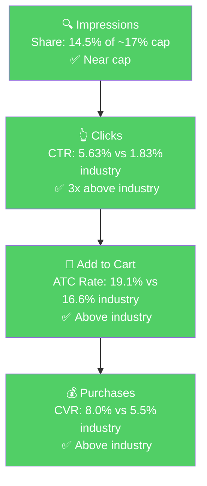

# Seller Central Audit - SnoreStop USA

## Executive Summary

SnoreStop USA is a pet-only Amazon catalog (dog and cat anti-snoring tablets and sprays) belonging to the Snore Stop brand, which has been a human anti-snoring brand since 1995. On Amazon, the account runs on ~$2,000/month in revenue, 83% of which comes from a single hero ASIN: the **Chewable Tablets (P0)**.

The central finding of this audit is unusual: **P0 has already captured most of the addressable pet-snoring search demand on Amazon.** The brand holds 64% of category purchases at near-cap impression share, with CTR 3x the industry benchmark and CVR above industry. There is no traditional PPC unlock: no hidden impression share, no CTR gap, no CVR gap. The market itself is the ceiling, not the brand.

What this means for the engagement: growth from Amazon search will be modest and comes from internal efficiency (restructuring campaigns, negating human-intent keywords, shifting spend to Top of Search) rather than from unlocking a new demand pool. The bigger growth levers are listing-side (fixing the 3.3-star rating, strengthening the main image) and off-Amazon (category awareness, DTC). Our 8-week plan is therefore heavier on PPC housekeeping and listing improvements than on aggressive spend scaling.

## Section 1: Catalog Assessment

| Priority | Product | 3-Mo Sales | 3-Mo Ad Spend | ROAS | TACoS | Organic Sales | Ad Sales % | Buy Box % | CVR | Trend |
|----------|---------|-----------|--------------|------|-------|---------------|-----------|-----------|-----|-------|
| P0 | SnoreStop for Pets 20 Chewable Tablets (B004GW338E) | $4,848 | $657 | 2.24 | 13.5% | $3,378 (70%) | 30% | 98.1% | 32.3% | Revenue stable, traffic down ~60% YoY, price up 50% |
| P1 | Snore Stop for Pets 40 Sprays (B000FL43XY) | $704 | $143 | 0.72 | 20.3% | $601 (85%) | 15% | 98.4% | 15.4% | Declining, ads unprofitable (ACoS 138%) |
| P2 | Snore Stop for Pets 40 Sprays 3-Pack (B0D31XJPC3) | $280 | $0 | N/A | 0% | $280 (100%) | 0% | 100% | 10.6% | Organic-only, flat low volume |
| P3 | SnoreStop for Pets 20 Chewable Tablets 3-Pack (B0D3FHV5QL) | $160 | $0 | N/A | 0% | $160 (100%) | 0% | 100% | 21.1% | Launched Feb 2026, low volume |

**Not prioritized:**
- B0D4JK6VMW and B0D4JKP7SH are duplicate listings for the spray and tablets respectively. They have essentially zero traffic and zero sales. Likely created by mistake or for a re-launch attempt that never took off. Recommend consolidation.

## Section 2: Qualitative Product Understanding (P0)

**Product:**
- Homeopathic chewable tablets that claim to reduce snoring in dogs and cats by opening constricted airways and reducing inflammation
- Natural ingredients (Nux vomica, Belladonna, Hydrastis Canadensis, Teucrium marum at homeopathic potencies), HPUS-registered, NDC 61152-190-02, manufactured in FDA-regulated US labs
- Value prop: the only dedicated pet anti-snoring solution on Amazon. Device-free, no sedatives, advertised to show results within 5 nights.
- Purchase motivation: owners losing sleep because their pet snores loudly. Low-risk $15 at-home remedy before escalating to the vet.

**Customer:**
- Pet owners (mostly dog owners) whose pet's snoring disrupts their sleep
- Skews toward owners of brachycephalic breeds (bulldogs, pugs, Boston terriers, shih tzus) and senior or overweight pets
- Looking for a natural, low-commitment first-line solution

**Brand:**
- Snore Stop / Green Pharmaceuticals, established 1995 (30+ years)
- Core business is human anti-snoring products (oral spray, tablets, allergy formula). Pet line is an extension.
- Registered brand: professional DTC site ([snorestop.com](https://snorestop.com)), Amazon brand store, NDC-registered, HPUS-registered
- **Brand vibe:** Clinical, pharmacy-style. Blue/yellow medical aesthetic. Reads "trusted pharmacy product" rather than "modern pet wellness brand."

**Competitive Landscape:**

Price positioning: Avg pet snoring remedy: $15-25 | P0: $14.99 | Mid-to-low end, category-defining with very few direct competitors.

| Competitor | Product | Positioning |
|-----------|---------|-------------|
| PetWellbeing | Respir-Gold drops | Broader respiratory support, not snoring-specific |
| BestLife4Pets | Homeopathic pet supplements | Small brand, similar homeopathic approach |
| NaturVet | Broad pet supplement line | Large general brand, adjacent at best |

Key observation: pet snoring is a narrow niche and SnoreStop is effectively the only branded product dedicated to it. This is a moat, but the pond is small.

**DTC vs Amazon price gap:** The DTC site sells pet tablets as $39.99 bundles while Amazon sells the single box at $14.99. Worth confirming whether MAP is in place.

**Listing Quality:**

**Strengths:**
- **A+ Content:** 4 image-only modules aligned with current best practice. Covers product visual, benefits, "why pets snore," and ingredients/made in USA.
- **Video:** 4 videos including seller, vendor ("Green Pharmaceuticals"), and customer content. For a skeptical purchase, seeing real pets and a vet explainer is strong social proof.
- **Subscribe & Save enabled**, appropriate for a consumable supplement.
- **Brand Store** is live.

**Opportunities:**
- **Rating (3.3 stars, 323 reviews, 30% 1-star):** The single biggest conversion headwind. Stable at 3.2-3.4 for 5 years with a bimodal distribution (41% 5-star / 30% 1-star), characteristic of a homeopathic remedy that works for some pets and not others. Any ad or SEO investment is being spent driving shoppers to a listing they will deprioritize at the decision moment.
- **Main image:** Plain product-box shot with a small monochrome dog/cat illustration. In a below-4-star environment, the main image needs to carry more weight. Specific fixes: warmer lifestyle cue instead of the small illustration, a trust badge ("Since 1995" or "Homeopathic | Made in USA"), and more prominent "20 Tablets" callout.
- **Bullets (5 bullets, 399 characters total):** Extremely short - longest bullet is 113 characters, best practice is 200+. Missing the three purchase-objection answers shoppers need: (1) will this work for my breed, (2) how to dose and when to expect results, (3) what "homeopathic" means and why it's safe.
- **Images:** No before/after or in-use imagery. A "Night 1 vs Night 5" visual would reinforce the 5-night results claim.
- **Title:** 172 characters but keyword-salad in the back half. Readable on mobile up front but scannability drops off quickly. Can be restructured without losing SEO.

## Section 3: Quantitative Product Understanding (P0)

**Annual Trend:**

| Metric | Q1 2025 (Jan-Mar) | Q2 2025 (Apr-Jun) | Q3 2025 (Jul-Sep) | Q4 2025 (Oct-Dec) | Q1 2026 (Jan-Mar) |
|--------|-----------|-----------|-----------|-----------|-----------|
| Total Sales | $1,550/mo | $1,630/mo | $1,345/mo | $1,515/mo | $1,710/mo |
| Sessions | 780/mo | 425/mo | 265/mo | 390/mo | 370/mo |
| Avg Price | $10.05 | $13.35 | $14.95 | $14.71 | $14.27 |
| CVR | 20% | 31% | 34% | 27% | 33% |
| Buy Box % | 98.8% | 88.8% | 96.4% | 84.8% | 97.5% |

- **Price increase in Q2 2025:** Moved from $10.05 to ~$15 between April and June 2025. Sessions dropped from 868 (Jan) to 270 (June), a ~70% traffic decline in 6 months. CVR roughly doubled, so revenue held steady while traffic fell.
- **Buy box dips:** May 2025 (74.7%), November 2025 (72.4%), December 2025 (83.1%). On a private-label brand with no competing sellers, these dips are consistent with MAP-related suppression from sudden price changes.

**Rating Trajectory:** Stable, persistently low. Oscillating 3.1 to 3.5 for five years, currently 3.3. Not declining, just stuck. Bimodal 41% 5-star / 30% 1-star distribution.

**Sales Rank Trajectory:** Stable but volatile within a narrow band. In Herbal Supplements the rank swings #221 to #375 daily; in broader Pet Supplies it floats #33k-56k. No directional trend and no clean seasonal signal in the last 30 days of Keepa data.

## Section 4: Market Opportunity (SQP)

**Tier Breakdown:**

- **Tier 1 (Hero):**
  - **Keywords:** snore stopper for dogs, anti snoring for dogs, dog snoring relief, stop dog snoring, dog snoring, cat snoring
  - **Rationale:** Queries where the customer is explicitly searching for a dog or cat snoring remedy. P0 is the direct answer.

- **Tier 2 (Core market):**
  - **Keywords:** dog nasal congestion relief, nasal spray for dogs, dog nasal spray, cpap for dogs, nasal drops for cats
  - **Rationale:** Pet nasal and breathing-related queries. The brand shows up because it offers a spray variant, but the tablets are not the direct answer.

- **Tier 3 (Broad):**
  - **Keywords:** pet snoring, pet snoring relief, snoring for pets
  - **Rationale:** General "pet snoring" (not species-specific). Very low volume.

- **Excluded:** Human-snoring queries (`snore stopper`, `anti snore`, etc.) dominate the raw brand query set with ~50k+ monthly searches but cannot be converted by P0 (a pet-only product).

**Market Sizing:**

| Tier | Monthly Search Volume | Monthly Add to Carts (Market) | Monthly Purchases (Market) | Est. Market Size ($/mo) |
|------|----------------------|-------------------------------|---------------------------|------------------------|
| Tier 1 (Pet Snoring) | 711 | 51 | 19 | ~$765 |
| Tier 2 (Pet Nasal/Breathing) | 1,884 | 205 | 89 | ~$3,075 |
| Tier 3 (Broad Pet Snoring) | 2 | 1 | <1 | ~$15 |
| **Total P0 capturable (Tier 1 only)** | **711** | **51** | **19** | **~$765** |

*Estimated using $15 avg product price based on competitive landscape analysis.*

**Blockers & Growth Path:**

| Tier | Impression Share | CTR (Brand vs Industry) | CVR (Brand vs Industry) | Primary Blocker | Growth Path |
|------|-----------------|------------------------|------------------------|-----------------|-------------|
| Tier 1 | 14.5% (of ~17% cap) | 5.63% vs 1.83% (3x healthy) | 8.0% vs 5.5% (healthy) | None. Market size. | **Maxed out.** Near impression share cap, winning the funnel. Further growth requires expanding the category, not more spend. |
| Tier 2 | 2.0% (of ~17% cap) | 2.38% vs 1.70% (healthy) | 0% vs 10.3% (blocker) | CVR / intent mismatch | **Not capturable.** Homeopathic tablets don't match nasal spray / CPAP intent. Skip. |
| Tier 3 | n/a | n/a | n/a | Too small | Ignore. |

**ICAP Funnel Visual (Tier 1):**

The funnel is all green. This is the "Maxed Out Potential" pattern: the brand is already near the impression share cap on the only capturable tier, and beating industry at every stage of the funnel. Growth from Amazon search is ceiling-bound at the market size, not at any brand funnel metric.

**Context notes:**
- **Session decline is not a demand problem.** Tier 1 search volume has been flat-to-growing over the past 12 months while the seller's sessions dropped ~50%. The likely cause is the Q2 2025 price jump from $10 to $15 combined with the low rating, not a shrinking market.
- **The Amazon-addressable market for P0 is ~$765/mo.** Even at 100% share, the upside over today's revenue is small. True growth for the brand will come from category expansion (demand creation), rating improvement, or channel mix (DTC/retail).
- **Branded search volume is tiny** (~90 cart adds/year), so branded defense can stay at 2-3% of ad spend. Do not scale branded as a growth lever.

## Section 5: Ad Analysis

**Total account ad spend (90 days): $842**. P0 absorbs 83% of it ($699) at a healthy 2.22 ROAS. The account runs 4 campaigns, most spend concentrated in a single overstuffed broad-match campaign.

### Campaign Structure

> **Finding: One broad-match campaign absorbs 96% of all ad spend, with narrower high-ROAS keywords starved of budget.**
>
> **Problem:**
> - `M-G: All products - Broad Match` holds $808 of $842 total spend. Inside it, a single broad-match keyword `+snore` eats 86% of its budget at ROAS 1.86.
> - Narrow, high-ROAS targets sit in the same campaign with trivial budget:
>
> | Targeting | Match Type | Spend | Sales | ROAS |
> |-----------|-----------|-------|-------|------|
> | `+snore` | BROAD | $694.28 | $1,289.22 | 1.86 |
> | `anti snore tablets for pets` | BROAD | $14.05 | $66.63 | 4.74 |
> | `snore stop dogs` | EXACT | $13.09 | $100.59 | **7.68** |
> | (`M-G: Pet chewable tablets` exact campaign) | EXACT | $9.95 | $74.95 | **7.53** |
>
> **Solution:** Break out the top 3-5 proven exact-match terms (`snore stop dogs`, `stop dog snoring`, `anti snoring for dogs`) into dedicated campaigns with independent budgets. Fund the existing tablets exact campaign properly. Narrow the `+snore` broad so it stops leaking to human-intent clicks.
>
> **Impact:** Shifting $100 from `+snore` broad (ROAS 1.86) to `snore stop dogs` exact (ROAS 7.68) or equivalents turns $186 of sales into $400. Net gain of ~$215 in sales per $100 of reallocated spend. Scaled across the top 3-5 terms, the compounded effect is $400-600/quarter in additional sales.

### Auto vs Manual Split

| Targeting Type | Clicks | Spend | Sales | ROAS | AOV | CPC | CVR |
|----------------|--------|-------|-------|------|-----|-----|-----|
| Automatic | 35 | $23.28 | $10.83 | 0.47 | $10.83 | $0.67 | 2.86% |
| Manual | 732 | $818.82 | $1,647.15 | 2.01 | $15.11 | $1.12 | 14.89% |

Manual drives 97% of spend. Auto is vestigial - too small to function as discovery, unprofitable at current size. Recommend pausing or properly funding for discovery (~$100-200/month).

### Campaign Profitability

> **Finding: The spray product (P1) is burning budget inside the shared broad-match campaign.**
>
> **Problem:** When the `M-G: All products - Broad Match` campaign is split by advertised product, the tablets (P0) run at ROAS 2.18 but the spray (P1) runs at ROAS 0.72. The spray alone has consumed $142 for $103 in sales over 90 days. ACoS 139% - ad cost exceeds product revenue before accounting for COGS.
>
> **Solution:** Stop advertising the spray through the shared campaign. Either pause spray ads or move the spray into its own small-budget exact-match campaign on pet-specific spray terms so its performance can be isolated.
>
> **Impact:** $142 of unprofitable 90-day spend recovered. Reallocated to the tablets campaign at its 2.18 ROAS, that $142 would generate ~$310 instead of $103. Net gain of ~$207 per 90 days.

### Targeting Strategy

**Keyword vs Product Targeting:**

| Targeting Strategy | Clicks | Spend | Sales | ROAS | AOV | CPC | CVR |
|-------------------|--------|-------|-------|------|-----|-----|-----|
| Keyword Targeting | 738 | $823.12 | $1,647.15 | 2.00 | $15.11 | $1.12 | 14.77% |
| Product Targeting | 29 | $18.98 | $10.83 | 0.57 | $10.83 | $0.65 | 3.45% |

**Match Type Breakdown:**

| Match Type | Clicks | Spend | Sales | ROAS | AOV | CPC | CVR |
|------------|--------|-------|-------|------|-----|-----|-----|
| EXACT | 68 | $71.42 | $250.49 | **3.51** | $19.27 | $1.05 | 19.12% |
| BROAD | 664 | $747.40 | $1,396.66 | 1.87 | $14.55 | $1.13 | 14.46% |
| PHRASE | 0 | $0.00 | $0.00 | n/a | n/a | n/a | n/a |

Exact match is 1.9x more profitable than broad but gets only 9% of spend. Phrase match is not being used at all. Reallocating $200 from broad to exact campaigns on proven terms would generate roughly $700 in sales instead of $374, a $326 net gain per 90 days.

### Product-Level (P0)

**P0 Campaign Map**

| Campaign | Spend | Sales | ROAS | Clicks | Orders |
|----------|-------|-------|------|--------|--------|
| M-G: All products - Broad Match | $680.01 | $1,479.75 | 2.18 | 593 | 98 |
| M-G: Pet chewable tablets (Exact) | $9.95 | $74.95 | 7.53 | 11 | 4 |
| A-G: All (Auto) | $9.15 | $0.00 | 0.00 | 14 | 0 |
| **Total P0** | **$699.11** | **$1,554.70** | **2.22** | **618** | **102** |

**P0 has no traditional funnel blocker to solve via PPC.** Step 3 established this: impression share is near cap, CTR is 3x industry, CVR is above industry. The PPC opportunity for P0 is therefore internal efficiency, which breaks into three levers.

#### Internal Efficiency Lever 1: Shift Placement Budget to Top of Search

> **Problem:** Placement spend is misallocated.
>
> | Placement | Spend | Sales | ROAS | CTR | CVR |
> |-----------|-------|-------|------|-----|-----|
> | Top of Search | $550.28 | $1,434.78 | **2.61** | 13.78% | 17.28% |
> | Product Pages | $104.58 | $182.39 | 1.74 | 0.04% | 13.68% |
> | Rest of Search | $180.95 | $40.81 | **0.23** | 1.03% | 2.65% |
>
> Top of Search delivers 82% of sales at 2.61 ROAS. Rest of Search burns $181 at 0.23 ROAS.
>
> **Solution:** Increase the Top of Search bid modifier; reduce modifiers on Rest of Search.
>
> **Impact:** Shifting $150 from Rest of Search to Top of Search turns $35 of sales into ~$392. Net gain of ~$357 per 90 days.

#### Internal Efficiency Lever 2: Harvest Proven Search Terms into Exact-Match Campaigns

> **Problem:** The highest-converting P0 search terms are trapped inside the broad-match campaign.
>
> | Search Term | Spend | Sales | ROAS | Orders |
> |-------------|-------|-------|------|--------|
> | stop dog snoring | $33.32 | $134.91 | 4.05 | 9 |
> | anti snoring for dogs | $34.02 | $119.92 | 3.52 | 8 |
> | snorestop for dogs | $6.21 | $59.96 | 9.66 | 4 |
> | dog snore stop | $9.55 | $55.80 | 5.84 | 4 |
>
> **Solution:** Launch dedicated exact-match campaigns for these terms.
>
> **Impact:** Top 3 terms produced $311 in sales at 4.22 blended ROAS on $77 of spend. Tripling their budget to $230 yields ~$970, a net gain of ~$660 per 90 days.

#### Internal Efficiency Lever 3: Negate Irrelevant Search Terms

> **Problem:** Broad match is leaking spend to human-intent queries (the brand is pet-only) and product-mismatch queries (beds, not supplements).
>
> | Category | Examples | Wasted Spend (90 days) |
> |----------|----------|----------------------|
> | Human-intent | snoring solution, anti snoring devices, how to stop snoring, anti snoring mouthpiece, z3 pro anti snoring device | ~$44 |
> | Dog bed / furniture | anti snoring dog bed, bed for snoring dog | ~$9 |
> | Low-ROAS relevant | anti snore for dogs (ROAS 0.67), dog snoring (ROAS 0.86) | ~$40 of underperforming spend |
>
> **Solution:** Add human-intent and bed-related terms as campaign-level negatives. Lower bids (not negate) on the underperforming but relevant queries.
>
> **Impact:** ~$93 per 90 days redirected to proven exact-match terms at ~4.22 ROAS generates ~$390 in sales instead of ~$18. Net gain of ~$370 per 90 days.

## Section 6: Action Plan

The defining blocker for this account is **that there is no traditional blocker** on P0. The Amazon-search funnel is already winning, so Weeks 1-4 focus on PPC housekeeping (capture the efficiency gains identified above) and Weeks 4-8 focus on listing improvements to lift the 3.3-star rating headwind and better prepare the listing for any future category-level demand growth.

### Weeks 1-2: Immediate PPC Housekeeping

Primary focus: recover wasted spend and shift dollars toward what already works. These are low-risk, high-certainty actions.

- **Negate irrelevant search terms** in `M-G: All products - Broad Match`: add all 8 human-intent terms (`snoring solution`, `anti snoring devices`, `anti snoring mouthpiece`, `z3 pro anti snoring device`, `how to stop snoring`, `how to stop snoring while sleeping`, `anti snoring`, `anti snore device`) and both bed-related terms (`anti snoring dog bed`, `bed for snoring dog`) as campaign-level negatives.
- **Pause spray advertising in the shared campaign.** Isolate the spray to a new $5-10/day exact-match campaign targeting only pet-spray-specific terms (`dog nasal spray`, `dog snoring spray`) so its performance stays visible but doesn't contaminate the tablets campaign.
- **Pause or resize `A-G: All` auto campaign.** At $23 over 90 days it is too small to discover anything. Either pause outright or raise budget to $100-200/month with an explicit weekly search-term review cadence.
- **Increase Top of Search bid modifier** on `M-G: All products - Broad Match`. Target the ratio so Top of Search grows from 65% toward 80% of campaign spend.

Estimated 90-day recovery from these actions alone: ~$300-400 in incremental sales from the same budget.

### Weeks 2-4: Scale Proven Winners into Exact-Match Campaigns

Build on what's already converting. Use the 90-day winners identified in Section 5.

- **Launch 3 new exact-match campaigns,** one for each of: `stop dog snoring`, `anti snoring for dogs`, `snore stop dogs`. Starting budget $5-7/day each.
- **Launch 1 phrase-match campaign** for `dog snoring` and `dog snore` variants to capture long-tail variations that broad is currently picking up expensively.
- **Properly fund the existing `M-G: Pet chewable tablets` exact campaign.** Raise daily budget so it can actually spend (currently it is at $0.11/day run rate, ROAS 7.53 is unscalable at this size).
- **Begin listing content prep:** draft new bullet copy and gather images for the main-image rework (publish in weeks 4-6).

### Weeks 4-6: Listing Improvements Published

Move to the listing levers. Rating is slow; main image and bullets are fast.

- **Publish new main image** with a warmer lifestyle cue (dog or cat sleeping peacefully instead of the current small monochrome illustration), a visible "Since 1995" or "Homeopathic | Made in USA" trust badge, and a clearer "20 Tablets" callout.
- **Publish new bullets.** Five bullets, 180-220 characters each, covering: (1) safety and homeopathic explanation, (2) breeds and scenarios where it helps most (bulldogs, pugs, senior pets), (3) dosage and 5-night results expectation, (4) natural ingredients and USA manufacturing, (5) subscribe and save value or bundle cross-sell.
- **Begin systematic review solicitation.** Set up a flow for Subscribe & Save customers to receive a review request after 30 days of use. Target moving the rating from 3.3 toward 3.5-3.6 over the following 6-12 months.

### Weeks 6-8: Evaluate and Expand

- **Evaluate the week 1-4 PPC changes.** Review the new exact campaigns: which terms scaled, which stalled, which new search terms showed up inside the new campaigns that should be harvested.
- **Assess CVR impact from listing changes.** Is the tablet listing converting better on incoming traffic? Compare Feb-Mar baseline CVR (32%) vs post-listing CVR.
- **Discuss category-expansion play with seller.** Because Amazon-search is ceiling-bound, longer-term growth depends on expanding demand. Explore: content marketing to educate owners on pet snoring, veterinarian partnership content, repositioning angles (pet allergy / pet sleep wellness). These are outside the 8-week window but belong in the conversation.
- **Do not scale spray ads further** unless the seller signals a specific strategic reason. Given the rating and ROAS trajectory, the spray may be better off depressed on Amazon while resources flow into the tablets.

## Section 7: Insights & Questions for the Seller

### Insights

- **P0 (Tablets) is carrying the brand on Amazon and has already captured most of the addressable pet-snoring search demand.** 83% of ad spend, 81% of revenue, near-cap impression share on Tier 1 with 3x industry CTR and above-industry CVR. This is the "Maxed Out Potential" pattern: the market, not the brand, is the ceiling.
- **The 3.3-star rating is the biggest conversion headwind** and the single listing lever most likely to compound in the background. It has been stable for 5 years and won't move in one quarter, but every 0.1 star of improvement lifts CTR on the search results page where the listing is already outperforming an equivalent peer would be at 4.2 stars.
- **The session decline is a price-and-listing story, not a market decline.** Tier 1 search volume has held up or grown over 12 months. The ~50% session drop since Q1 2025 coincides almost perfectly with the tablet price jump from $10 to $15 and with the buy box dips in May, November, and December 2025.
- **P1 (Spray) is burning budget.** $143 of 90-day ad spend at ROAS 0.72 is not a scale problem, it is a structural mismatch between CPC, AOV, and CVR. This spend should be diverted or paused immediately.
- **The single biggest in-campaign PPC unlock is placement.** Top of Search is at 2.61 ROAS and Rest of Search is at 0.23. Moving $150 across placements captures ~$350 in quarterly sales with no new budget.

### Questions for the Seller

- **Price strategy:** You moved P0 (Tablets) from ~$10 to ~$15 between April and June 2025. What drove that decision, and were you expecting the ~50% traffic decline that followed? Is there flexibility to test a $12.99 price point to see if traffic rebounds without fully giving up the margin gain?
- **Buy box dips:** P0 saw buy box drop to 74.7% in May 2025, 72.4% in November 2025, and 83.1% in December 2025. For a private-label listing with no obvious competing sellers, the most likely cause is MAP-related suppression after sudden price changes. Were there promotions, price tests, or channel actions in those months?
- **Rating strategy:** The rating has been at ~3.3 for five years with a bimodal 41% 5-star / 30% 1-star distribution. Is there an active plan to address this (responding to negatives, routing happy customers to reviews, Vine, reformulation)? Any insight from the 1-star reviews we should be aware of?
- **Duplicate listings:** B0D4JK6VMW and B0D4JKP7SH look like duplicates of the active spray and tablets ASINs but have zero traffic. What were they created for, and can they be consolidated or removed?
- **DTC vs Amazon pricing:** The DTC site appears to sell the pet tablets in a $39.99 bundle while Amazon sells the single box at $14.99. Is there an intentional channel differentiation, and is a MAP policy in place?
- **Historical ad strategy:** Our ad data only covers 90 days (the Amazon retention window). How long have the current campaigns been running? If the overstuffed broad-match campaign and shared spray advertising have been in place for 12 months, the compounded wasted spend is significantly larger than what the 90-day view shows.
- **Growth expectations on Amazon:** Given the Amazon-addressable market for pet-snoring queries is ~$765/mo and the brand is already capturing most of it, what is your growth hypothesis for P0 on Amazon? Is there a category-expansion play you are counting on (pet allergy, pet sleep, pet respiratory), or is Amazon expected to plateau while DTC and retail drive growth?
