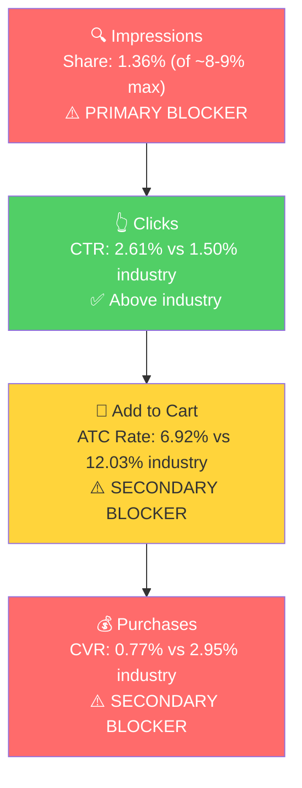

# SQP Analysis: SortJoy (P0 - Sculpted Storage Bins + Lids)

## Critical Context

SortJoy's Amazon sales are almost entirely driven by branded search. The top queries generating cart adds are: "sortjoy" (311 carts), "sort joy bins" (123), "sortjoy bins" (116), "sort joy" (73). The first non-branded query with meaningful brand cart adds is "felt storage bins with lids" at just 20 carts over 11 months.

This means SortJoy is functioning as a DTC brand that happens to be on Amazon, not as an Amazon-native brand. Customers find SortJoy through their website, Anthropologie, Crate & Barrel, or social media, then search for "SortJoy" on Amazon to buy. There is virtually zero discovery happening through category search on Amazon.

## Tagging Rationale

- **Tier 1 (Hero):** Queries where the customer is searching for exactly a felt storage bin, including with lids. These are the most direct match for P0. Queries: felt storage bins with lids, felt storage bins, felt storage bin, felt storage bin with lid, sculpted felt storage bin, sculpted felt storage bin with lid, felt bins with lids, felt bin with lid.
- **Tier 2 (Core market):** Broader felt storage/organizer queries where P0 is one option among several. Queries: felt basket, felt baskets for storage, felt bin, felt bins, felt drawer organizer, grey felt storage bins, felt basket with lid.
- **Tier 3 (Broad/adjacent):** General storage queries (storage baskets, storage bins, organizer bins, etc.) where felt bins are a small subset of the results. SortJoy has effectively zero presence here (< 0.001% impression share). These queries are massive in volume but not capturable without significant organic authority or substantial ad spend.

## Market Sizing (12-month average, Mar 2025 - Feb 2026)

| Tier | Monthly Search Volume | Monthly Add to Carts (Market) | Monthly Purchases (Market) | Est. Market Size ($/mo) |
|------|----------------------|-------------------------------|---------------------------|------------------------|
| Tier 1 | ~3,600 | ~190 | ~40 | ~$9,500 |
| Tier 2 | ~5,950 | ~393 | ~97 | ~$19,650 |
| Tier 3 | ~80,000+ | ~5,000+ | ~1,200+ | ~$250,000+ |
| **Total P0 Addressable (T1+T2)** | **~9,550** | **~583** | **~137** | **~$29,150** |

Market sizing uses ~$50 as the average transaction value across the felt storage category (blended average of singles at $20-30 and sets at $80-160).

**Key observation:** The felt-specific market (Tier 1 + Tier 2) is relatively small at ~$29K/mo. Tier 3 is 10x larger but consists of generic storage queries where SortJoy would compete against plastic bins, fabric bins, and woven baskets. At P0's $160 price point, capturing Tier 3 traffic requires a very compelling listing to justify the premium over $15-25 generic alternatives.

**Seasonality:** Tier 2 shows a clear seasonal pattern: volume ramps from ~4,000/mo in spring to ~9,600/mo in January (New Year organization peak), then drops. Tier 1 is steadier at 2,500-5,300/mo. This aligns with the P0 annual sales trend from Step 1, where Dec-Jan were the strongest months.

## Market Share and Potential (Dec 2025 - Feb 2026)

| Tier | Impression Share | Click Share | Cart Share | Purchase Share | Trend |
|------|-----------------|-------------|------------|---------------|-------|
| Tier 1 | 1.36% | 2.37% | 1.36% | 0.6% | Declining (1.95% to 0.74% impression share) |
| Tier 2 | 0.41% | 0.36% | 0.21% | 0% | Declining (0.56% to 0.28% impression share) |
| Tier 3 | ~0.0001% | ~0.001% | 0% | 0% | Non-existent |

- SortJoy's share is declining across all tiers. On Tier 1, impression share dropped from 1.95% in Dec to 0.74% in Feb. On Tier 2, it went from 0.56% to 0.28%.
- Click share is slightly higher than impression share on Tier 1 (2.37% vs 1.36%), meaning when SortJoy shows up, it gets clicked at an above-average rate. The product is visually appealing in search results.
- Cart and purchase share are near zero across all tiers. The brand is barely converting from non-branded search.
- **The growth ceiling on Tier 1 alone is small** (~$9,500/mo total market). Even at a 20% purchase share (ambitious for a single brand), that's ~$1,900/mo. The real opportunity is Tier 2 at ~$19,650/mo market size.

## Blockers & Growth Path

**3-month volume-weighted rates (Dec 2025 - Feb 2026):**

| Tier | Impression Share | CTR (Brand vs Industry) | CVR (Brand vs Industry) | Primary Blocker | Growth Path |
|------|-----------------|------------------------|------------------------|-----------------|-------------|
| Tier 1 | 1.36% (of ~8-9% max) | 2.61% vs 1.50% | 0.77% vs 2.95% | Impression Share + CVR | Fix listing first (CVR gap), then scale with PPC |
| Tier 2 | 0.41% (of ~8-9% max) | 1.48% vs 1.58% | 0% vs 3.93% | Impression Share | Not enough data to assess CVR (38 clicks total). PPC needed for visibility. |
| Tier 3 | ~0% | N/A | N/A | Not capturable | Skip for now. Revisit after T1/T2 traction. |

**Tier 1 detail:** This matches the "low impression share + poor CVR" pattern. SortJoy barely shows up (1.36% impression share), and when it does get clicked, it converts at 0.77% vs the industry's 2.95%. CTR is actually above industry (2.61% vs 1.50%), which is a positive signal: the main image and title are attractive enough to earn clicks. The problem is after the click. With no reviews, no A+ content, no video, and duplicate bullets on a $160 product, shoppers are not converting. **The listing must be fixed before scaling PPC.** Running ads on this listing would burn money: more clicks at 0.77% CVR just means more wasted spend.

**Tier 2 detail:** With only 38 brand clicks over 3 months and zero purchases, the rate data is too thin for reliable blocker detection. The primary issue is visibility: 0.41% impression share means the brand essentially doesn't exist on these queries. PPC would be needed to gain initial visibility, but the same listing quality concerns from Tier 1 apply. Fix the listing first.

## Insights

- **SortJoy is almost entirely a branded-search brand on Amazon.** Over 90% of their SQP cart adds come from branded queries ("sortjoy", "sort joy bins", etc.). Non-branded discovery is near zero. This means every sale on Amazon currently starts somewhere else (DTC website, retail, social media, word of mouth). Amazon is a purchase channel, not a discovery channel.
- **The addressable non-branded market for P0 is ~$29K/mo (Tier 1 + Tier 2).** This is a niche market, not a massive category. However, SortJoy currently captures close to 0% of it. Even modest capture (5-10% purchase share) would represent meaningful growth on top of the branded baseline.
- **CTR is a strength.** On Tier 1, brand CTR (2.61%) exceeds industry CTR (1.50%). The product's visual appeal in search results is working. The problem starts after the click, on the product detail page.
- **CVR is the conversion bottleneck.** On Tier 1, brand CVR (0.77%) is 74% below industry (2.95%). This aligns directly with the listing quality gaps identified in Product Understanding: zero reviews on a $160 product, no A+ content, no video, and weak bullets.

## Things to Investigate Further

- Since there is no ad data, the blocker analysis is purely organic. When PPC is launched, the impression share and CTR dynamics will change. Initial PPC campaigns should target Tier 1 queries first to validate whether the listing can convert with paid traffic.

## Questions for the Seller

- Branded search drives nearly all Amazon sales. How much of this comes from DTC customers redirecting to Amazon vs organic Amazon branded search? Understanding this helps assess how much of the current revenue is "borrowed" from other channels.
