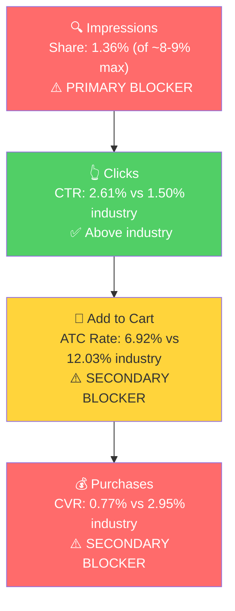

# Seller Central Audit: SortJoy

## Section 1: Catalog Assessment

| Priority | Product | 3-Mo Sales | Avg Sessions/Mo | CVR | Buy Box % | Trend |
|----------|---------|-----------|-----------------|-----|-----------|-------|
| P0 | Sculpted Storage Bins + Lids (3pcs) | $4,149 | 473 | 1.8% | 92.3% | Declining |
| P1 | Extra Large Sculpted Bins (3pcs) | $2,112 | 119 | 3.6% | 54.1% | Volatile |
| P2 | Long Sculpted Felt Storage Bins (3pcs) | $2,040 | 457 | 7.3% | 92.5% | Declining |
| P3 | Sculpted Storage Bins (3pcs, no lids) | $1,516 | 120 | 3.3% | 96.3% | Volatile |

**Note:** SortJoy is not running any advertising. All metrics above are 100% organic. The ad-related columns (Ad Spend, ROAS, TACoS, Ad Sales %) are omitted because there is no ad data.

**Products not prioritized:** 17 of 25 products generated less than $600 each over the 3-month window. Several products hit $0 in sales despite having sessions. The Felt Large Storage Bins ($1,254) is the only growing product but has a ~49% buy box. Clip-On Pantry Labels ($720) is the highest-traffic product (426 sessions/mo in Feb) but buy box dropped from 99% to 50%.

## Section 2: Qualitative Product Understanding (P0)

**Product:**
- Set of 3 sculpted felt storage bins with matching lids (12.5" x 12.5" x 11.63"). Lids double as trays.
- Made from recycled PET felt (70-80% post-consumer recycled plastic). Machine washable, soft, won't scratch surfaces.
- Solves the problem of organizing closets, pantries, and shelving while maintaining a modern, decorative aesthetic.
- Buyers want to organize without introducing ugly plastic bins. The sculpted shape and neutral tones make these bins something you display, not hide.

**Customer:**
- Women 25-45, invested in home aesthetics, follows home organization content. Willing to pay premium for products that look good and align with sustainability values.
- Purchase triggers: moving, closet/pantry reorganization, upgrading from cheap plastic bins. Seasonal peak in January (New Year organization).

**Brand:**
- Registered brand, founded 2021 by Stefani Herr (professional organizer) and Alexa Cohn (interior designer). Women-founded, sustainability-focused.
- DTC-first brand expanding into retail. Sells on sortjoy.com, Anthropologie, Crate & Barrel, Kassatex. Amazon is a secondary channel.
- Partners with CleanHub for ocean-bound plastic recovery. Professional website, clear brand story, credible in the home organization space.
- Brand vibe: Minimalist, modern, intentional. Earthy neutral tones. "Elevated everyday" aesthetic.

**Competitive Landscape:**

Price positioning: Avg premium felt bin with lid: ~$50-85/bin | P0: ~$53/bin ($160/set of 3) | Competitive within the premium segment

| Competitor | Product | Price | Key Differentiator |
|-----------|---------|-------|-------------------|
| Folden Lane | Sculpted Felt Bins with Lids & Dividers (4-pack) | $179-229 ($45-57/bin) | Includes removable dividers, stackable lids |
| Thuma | Felt Bins | $75-85/bin | Furniture ecosystem play (fits Thuma shelving) |
| Welaxy | Felt Storage Bin with Lid | ~$20-30/bin | Container Store exclusive, mass-market |
| Horderly | Eco Felt Bins | ~$35-50/bin | Professional organizer brand, bucket design |

SortJoy sits in the mid-premium tier. Key differentiator is the "sculpted" shape that holds its form (vs floppy felt bins). Gap: no dividers (Folden Lane includes them).

**Listing Quality:**

**Strengths:**
- Images (9 total): Clean, minimalist main image. The sculpted shape comes through clearly. Good visual count.

**Opportunities:**
- **Rating: Zero reviews.** The most critical issue. A $160 product with no social proof faces an enormous conversion barrier. This alone likely explains the CVR collapse.
- **Title:** 174 characters of keyword stuffing. The sustainability angle and "sculpted" design benefit are absent. Dimensions get cut off on mobile.
- **Bullets:** 6 bullets, but bullets 2 and 4 are nearly identical (both list the same use cases). The recycled material story and "lids as trays" value prop are buried.
- **A+ Content: Absent.** A premium product from a brand with a compelling founder story, sustainability credentials, and retail partnerships. A+ content with lifestyle imagery and a comparison module would significantly justify the price point.
- **Video: Absent.** The product's key differentiator (sculpted = holds shape) cannot be demonstrated without video.

## Section 3: Quantitative Product Understanding (P0)

**Annual Trend:**

| Metric | Mar 2025 | Jul 2025 | Dec 2025 | Jan 2026 | Feb 2026 |
|--------|----------|----------|----------|----------|----------|
| Total Sales | $638 | $2,394 | $2,713 | $1,436 | $0 |
| Sessions | 184 | 176 | 401 | 768 | 249 |
| CVR | 2.17% | 8.52% | 4.24% | 1.17% | 0.0% |
| Buy Box % | 95.3% | 97.4% | 98.9% | 92.4% | 85.8% |

- P0 grew steadily from $638/mo in Mar to a peak of $2,713 in Dec, then collapsed to $0 in Feb despite 249 sessions. This is a conversion problem, not a traffic problem.
- Buy box erosion (99% to 86%) contributes but doesn't fully explain zero sales. The more likely driver is the lack of reviews on a $160 product: early sales likely came from DTC customers who already knew the brand, but as that source plateaued, Amazon-native shoppers (who rely on reviews) would not convert.

**Rating Trajectory:** No rating data available. Zero reviews.

**Sales Rank Trajectory:** Insufficient data (one data point: rank 97,778 in Storage & Organization, Mar 2025).

## Section 4: Market Opportunity (SQP)

**Critical context:** Over 90% of SortJoy's Amazon cart adds come from branded search ("sortjoy", "sort joy bins"). Non-branded discovery is near zero. Amazon is currently a purchase channel, not a discovery channel.

**Tier Breakdown:**

- **Tier 1 (Hero):**
  - **Keywords:** felt storage bins with lids, felt storage bins, felt storage bin, felt storage bin with lid, sculpted felt storage bin, sculpted felt storage bin with lid, felt bins with lids, felt bin with lid
  - **Rationale:** Exact product match queries. When someone searches for a felt storage bin with a lid, P0 is the direct answer.

- **Tier 2 (Core market):**
  - **Keywords:** felt basket, felt baskets for storage, felt bin, felt bins, felt drawer organizer, grey felt storage bins, felt basket with lid
  - **Rationale:** Broader felt storage/organizer queries where P0 is one option among several. Larger volume than Tier 1 but more competitive.

- **Tier 3 (Broad/adjacent):**
  - **Keywords:** storage baskets, storage basket, organizer bins, storage bins, decorative storage bins, closet storage bins, cube storage bins
  - **Rationale:** General storage queries where felt bins are a small subset. Massive volume but SortJoy has effectively zero presence and capturing share at a $160 price point against $15-25 alternatives is not realistic without significant authority.

**Market Sizing:**

| Tier | Monthly Search Volume | Monthly Add to Carts (Market) | Monthly Purchases (Market) | Est. Market Size ($/mo) |
|------|----------------------|-------------------------------|---------------------------|------------------------|
| Tier 1 | ~3,600 | ~190 | ~40 | ~$9,500 |
| Tier 2 | ~5,950 | ~393 | ~97 | ~$19,650 |
| Tier 3 | ~80,000+ | ~5,000+ | ~1,200+ | ~$250,000+ |
| **Total P0 Addressable (T1+T2)** | **~9,550** | **~583** | **~137** | **~$29,150** |

**Blockers & Growth Path:**

| Tier | Impression Share | CTR (Brand vs Industry) | CVR (Brand vs Industry) | Primary Blocker | Growth Path |
|------|-----------------|------------------------|------------------------|-----------------|-------------|
| Tier 1 | 1.36% (of ~8-9% max) | 2.61% vs 1.50% | 0.77% vs 2.95% | Impression Share + CVR | Fix listing (CVR gap), then PPC scaling |
| Tier 2 | 0.41% (of ~8-9% max) | 1.48% vs 1.58% | 0% vs 3.93% | Impression Share | Listing fix first, then PPC for visibility |
| Tier 3 | ~0% | N/A | N/A | Not capturable | Skip. Revisit after T1/T2 traction. |

Tier 1 has a dual blocker: the brand barely shows up (1.36% impression share) AND doesn't convert when it does (0.77% vs 2.95% industry CVR). CTR is actually above industry (2.61% vs 1.50%), meaning the main image earns clicks in search results. The breakdown happens on the product detail page. Before scaling traffic with PPC, the listing must be fixed: reviews are the #1 priority, followed by A+ content and video.

Tier 2 has the same structural issue but with even less visibility (0.41%). With only 38 brand clicks over 3 months, the conversion data is too thin to draw conclusions. PPC is needed for initial visibility, but only after listing improvements.

**ICAP Funnel (Tier 1):**

- SortJoy's branded search baseline (~$2,000-4,000/mo across the whole account) represents customers who already know the brand. The non-branded market opportunity (T1+T2 at ~$29K/mo) is currently untapped.
- Seasonal volume peaks in Jan (New Year organization). Tier 2 search volume nearly doubles from Oct to Jan. PPC campaigns should be running before that seasonal ramp.

## Section 5: Ad Analysis

**SortJoy is not running any Amazon advertising.** There is no ad data to analyze.

This is the simplest and most impactful finding of the audit: a premium DTC brand with strong retail partnerships, a compelling product, and a recognized name is generating zero non-branded discovery on Amazon because they are not advertising and their listing is not optimized to convert cold traffic.

The growth path is straightforward but sequenced:

**Finding: Zero advertising on a brand with untapped non-branded market potential**

**Problem:**
- SortJoy's entire Amazon business relies on branded search, which depends on external channels (DTC, retail, social) driving awareness
- The addressable non-branded market (Tier 1 + Tier 2) is ~$29K/mo, and SortJoy captures ~0% of it
- Without PPC, the brand has 1.36% organic impression share on its most relevant queries

**Solution:**
- Phase 1 (Weeks 1-4): Fix the listing to make it conversion-ready (reviews, A+ content, video, bullets)
- Phase 2 (Weeks 4-8): Launch structured PPC campaigns targeting Tier 1 queries first, then expand to Tier 2
- Start with exact match on hero keywords, then expand to phrase/broad as data accumulates

**Impact:**
- Even modest capture of the non-branded market (5-10% purchase share on Tier 1 + Tier 2) would add ~$1,500-3,000/mo in incremental sales
- At a reasonable 3x ROAS, this would require ~$500-1,000/mo in ad spend
- Combined with fixing the listing for branded traffic conversion (the $0 in Feb problem), total revenue recovery could be significant

## Section 6: Action Plan

The primary blocker is CVR (listing quality), with impression share as the secondary blocker (no advertising). The action plan focuses on fixing the listing first, then scaling traffic.

### Weeks 1-2: Immediate Actions (Listing Foundation)

The primary blocker is CVR on the product detail page. Before any traffic scaling, the listing must be able to convert.

- **Enroll P0 in Amazon Vine** to generate initial reviews. Zero reviews on a $160 product is the single biggest conversion barrier. Target 15-20 reviews. If Vine is not available, explore review request campaigns through Amazon's "Request a Review" button on existing orders.
- **Rewrite P0 bullets.** Current bullets have a duplicate (bullets 2 and 4 are identical). Rewrite to lead with: (1) Sculpted design that holds its shape, (2) Recycled PET material / sustainability, (3) Machine washable and soft, (4) Lids double as trays, (5) Dimensions and fit guide, (6) Set of 3 value proposition.
- **Optimize P0 title.** Remove keyword stuffing. Add "Recycled Felt" and "Machine Washable" to communicate value props visible in search results. Keep dimensions.
- **Fix buy box issues across the catalog.** 6+ products have buy box below 60%. Investigate whether unauthorized resellers or pricing policy is the cause. This is an account-level issue affecting all products, not just P0.

### Weeks 2-4: Short-Term Optimizations (Content Creation)

- **Create A+ content for P0.** Lifestyle images showing the bins in styled closets, pantries, nurseries, and living rooms. Include a comparison module (SortJoy vs generic plastic bins vs fabric bins). Feature the founder story and sustainability credentials. This content exists on sortjoy.com and Anthropologie, so assets should be available.
- **Produce a product video for P0.** 30-60 second clip demonstrating: sculpted shape holds form, lids used as trays, machine washable material, before/after organization transformation. The DTC brand likely has existing video assets that can be repurposed.
- **Set up a Brand Store on Amazon** (if not already present). SortJoy has a strong brand story that should be represented on Amazon. The Brand Store becomes a landing page for Sponsored Brands campaigns later.

### Weeks 4-6: Medium-Term Growth (PPC Launch)

The listing is now conversion-ready (reviews accumulating, A+ live, video uploaded). Time to drive traffic.

- **Launch Tier 1 PPC campaigns.** Start with exact match on hero keywords: "felt storage bins with lids," "felt storage bins," "felt bin with lid," "sculpted felt storage bin." Conservative daily budget ($20-30/day). Monitor CVR closely. If CVR is above 2% (approaching industry average), scale. If below, pause and investigate.
- **Launch branded defense campaign.** Small budget (2-3% of total ad spend) on "sortjoy" and "sort joy" keywords. Currently no one is bidding on SortJoy's brand name, but as the brand grows on Amazon, competitors will start. Protect the branded traffic that drives the majority of current sales.
- **Begin keyword harvesting.** Run an auto campaign alongside the manual campaigns. Let Amazon discover which queries convert for SortJoy. Review search term reports weekly and graduate converting terms to manual campaigns.

### Weeks 6-8: Scaling and Evaluation

- **Expand to Tier 2 queries** if Tier 1 ROAS is healthy. Add "felt basket," "felt bins," "felt drawer organizer," "felt baskets for storage" as new manual campaigns.
- **Evaluate P1 and P2 for listing optimization.** Apply the same playbook (bullets, A+, video) to the next priority products if the P0 results are promising.
- **Assess Sponsored Brands and Sponsored Display.** Once the Brand Store is live, run Sponsored Brands ads on Tier 1 queries to capture top-of-search real estate with lifestyle imagery. Consider Sponsored Display retargeting for shoppers who viewed P0 but didn't purchase.
- **Review and resolve buy box issues.** By Week 8, the root cause of the account-wide buy box crisis should be identified and actively being addressed. Track whether buy box recovery correlates with sales recovery.

## Section 7: Insights & Questions for the Seller

**Insights:**

- **P0 (Sculpted Bins + Lids) collapsed from $2,713 to $0 between Dec and Feb despite 249 sessions.** The root cause is most likely the lack of reviews combined with weak listing content. Early sales were driven by customers who already knew SortJoy (branded search), but as the brand exhausted its existing customer base on Amazon, cold traffic from category search could not convert without social proof.
- **SortJoy functions as a DTC brand on Amazon, not an Amazon-native brand.** Over 90% of Amazon cart adds come from branded search. The non-branded felt storage market (~$29K/mo) is almost completely untapped. This is both the biggest problem (no discovery) and the biggest opportunity (the entire category is open for capture).
- **Account-wide buy box crisis.** 6+ products have buy box below 60%, several that were at 100% just months ago. This affects revenue across the catalog and needs immediate investigation.
- **CTR is a strength.** On Tier 1 queries, SortJoy's CTR (2.61%) is nearly double the industry average (1.50%). The product's visual appeal works in search results. The problem is entirely on the product detail page.

**Questions for the Seller:**

- Multiple products have buy box below 50%, including several that were at 100% as recently as Aug 2025. Are there unauthorized resellers or other 3P sellers on these listings? Has there been a change in fulfillment method?
- P0 went from $2,713 in Dec to $0 in Feb despite sessions. Has there been a pricing change, stock issue, or listing suppression on this product?
- No advertising is running. Is this intentional, or has there been a past attempt that was paused? What has held the brand back from launching PPC?
- Branded search drives nearly all Amazon sales. How much of this comes from DTC customers redirecting to Amazon vs organic branded search? Understanding this helps assess how dependent the Amazon channel is on other channels.
- P0 has zero reviews. Has there been any effort to generate reviews (Vine, follow-up emails, inserts)? Satisfied customers exist through DTC and retail, but none are reviewing on Amazon.
