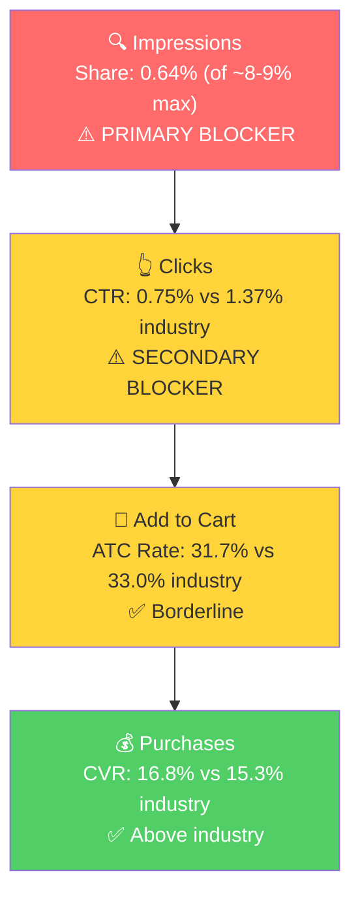

# SQP Analysis: P0 - Sport Mouth Guards (2 Pack)

## Tagging Rationale

- **Tier 1 (Hero):** Generic mouth guard/mouthguard queries where the customer is searching for any type of mouth guard. The product is a direct answer. Queries: mouth guard, mouthguard, mouth piece, sports mouthguards, mouth pieces.
- **Tier 2 (Core market):** Football-specific queries, the single largest sport segment for mouth guards. Highly seasonal (peaks Aug for back-to-school/football season). Queries: football mouth guard, mouth guard football, mouthguard football, football mouthguard, mouth pieces football, football mouth piece, youth mouth guard football.
- **Tier 3 (Adjacent):** Boxing/combat sports. Smaller but year-round market. Query: boxing mouthguard.

**Excluded from P0 tagging:** "mouth guard for grinding teeth at night," "mouth guard for sleeping," and related dental night guard queries. These are high volume (80-147k/mo) but relate to a different product category (night guards, not sport mouth guards). The brand does appear on these queries because it sells other products (Teeth Mouth Guards 4 Pack), but they are not P0-relevant.

## Market Sizing

12-month averages (Feb 2025 - Jan 2026):

| Tier | Monthly Search Volume | Monthly Add to Carts (Market) | Monthly Purchases (Market) | Est. Market Size ($/mo) |
|------|----------------------|-------------------------------|---------------------------|------------------------|
| Tier 1 | 153,241 | 18,226 | 8,743 | $182,260 |
| Tier 2 | 136,339 | 13,112 | 4,609 | $131,120 |
| Tier 3 | 8,372 | 877 | 312 | $8,770 |
| **Total P0** | **297,952** | **32,215** | **13,664** | **$322,150** |

Market size estimated at ~$10 avg product price (P0 price point).

**Seasonality:** Tier 2 is extremely seasonal. Search volume swings from 33k (Jan) to 504k (Aug), a 15x difference. This aligns with football season and back-to-school. Tier 1 is more stable (112k-204k range), and Tier 3 is steady year-round (6-10k). The P0 annual trend from Step 1 (sales peak in Apr and Aug) correlates with these seasonal patterns: the April peak likely comes from spring sports starting, while the August peak aligns with Tier 2 football season demand.

## Market Share and Potential

3-month averages (Nov 2025 - Jan 2026):

| Tier | Impression Share | Click Share | Cart Share | Purchase Share | Trend |
|------|-----------------|-------------|------------|---------------|-------|
| Tier 1 | 0.64% | 0.35% | 0.34% | 0.38% | Stable |
| Tier 2 | 0.28% | 0.14% | 0.11% | 0.14% | Stable |
| Tier 3 | 0.29% | 0.14% | 0.24% | 0.23% | Improving |

The brand's share is extremely low across all tiers. On Tier 1 (the largest and most year-round market), the brand captures only 0.38% of purchases. With a theoretical max impression share of ~8-9%, the brand is using less than 8% of its potential visibility. This is the largest untapped growth opportunity.

Tier 2 share is even lower (0.14% purchase share), but this is partially explained by the seasonal window: Nov-Jan is the off-season for football queries. Share during peak season (Jul-Sep) is higher, with the brand reaching ~0.5-1% impression share.

## Blockers & Growth Path

3-month averages (Nov 2025 - Jan 2026):

| Tier | Impression Share | CTR (Brand vs Industry) | CVR (Brand vs Industry) | Primary Blocker | Growth Path |
|------|-----------------|------------------------|------------------------|-----------------|-------------|
| Tier 1 | 0.64% (of ~8-9% max) | 0.75% vs 1.37% (45% below) | 16.8% vs 15.3% (above) | Impression Share | PPC scaling + listing image fix: product converts above industry when visible, needs more visibility and better CTR to maximize traffic |
| Tier 2 | 0.28% (of ~8-9% max) | 0.63% vs 1.22% (48% below) | 8.5% vs 8.0% (above)* | Impression Share | PPC scaling: seasonal opportunity, concentrate spend Jul-Sep for football season. CTR fix (images) helps year-round |
| Tier 3 | 0.29% (of ~8-9% max) | 0.91% vs 1.55% (low base) | N/A (too few clicks) | Impression Share | Low priority: small market ($8.8k/mo), but converts when visible. Minimal PPC spend to test |

*Tier 2 CVR is based on small samples (5-17 brand clicks/month in off-season). Treat with caution. In peak season (Aug), the brand had 68 clicks with ~7.4% CVR vs 9.9% industry CVR, closer to but still below industry.

**Key finding: Impression share is the primary blocker across all tiers.** The brand barely shows up in search results (0.28-0.64% impression share vs a max of ~8-9%). When it does show up, it gets clicked less than industry average (CTR is 45-48% below), but those who click convert at or above industry rates. This is the classic "low impression share + decent CVR" pattern: the product works, it just needs more visibility.

**The CTR gap is the secondary blocker.** At 45% below industry on Tier 1, the listing is losing potential clicks even when it does appear. This connects directly to the listing quality finding from Step 2: only 2 images, basic main image with no lifestyle context, no sport branding. Fixing the images would improve CTR, which compounds with any impression share gains from PPC.

## Insights

- P0 (Sport Mouth Guards) has a $322k/mo total addressable market across all tiers, but captures only 0.38% of Tier 1 purchases and 0.14% of Tier 2. The brand is essentially invisible in a large market where the product performs well.
- CVR is consistently at or above industry. The product converts. The problem is entirely top-of-funnel: visibility (impression share) and listing appeal (CTR). This makes PPC scaling a high-confidence lever because spending more on these keywords should generate proportional sales.
- Tier 2 (football) is a $131k/mo market with a 15x seasonal swing. The Aug-Sep peak is where the brand should concentrate Tier 2 ad spend. Off-season football spending should be minimal.

## Things to Investigate Further

- Check ad campaign data: is the brand bidding on "mouth guard," "mouthguard," "sports mouthguard," and football variants? If not, the impression share problem is simply that no one turned on the ads for these terms.
- Verify whether the CTR gap is driven by the main image or by ad placement. If most impressions come from Product Pages (low CTR placement), increasing Top of Search bid modifiers could improve CTR without any listing changes.

## Questions for the Seller

