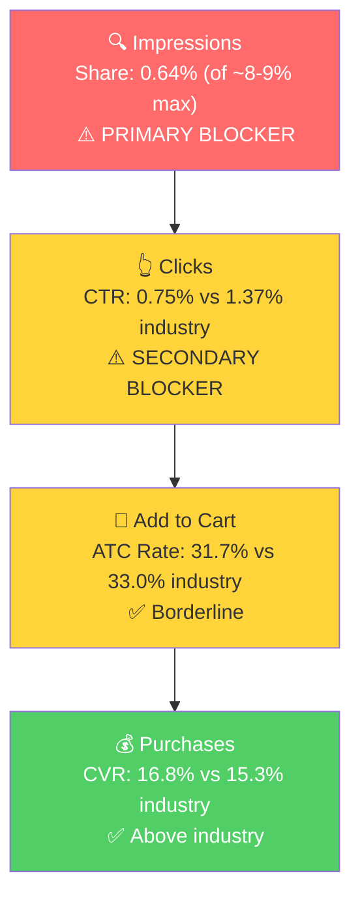

# Seller Central Audit: Sparkling White Smiles

## Section 1: Catalog Assessment

| Priority | Product | 3-Mo Sales | 3-Mo Ad Spend | ROAS | TACoS | Organic Sales | Ad Sales % | Buy Box % | CVR | Trend |
|----------|---------|-----------|--------------|------|-------|---------------|-----------|-----------|-----|-------|
| P0 | Sport Mouth Guards - 2 Pack | $16,492 | $5,432 | 1.50 | 32.9% | $9,316 | 49.4% | ~100% | 21.3% | Declining |
| P1 | Pearldent Dental Foam | $4,438 | $3,086 | 0.63 | 69.5% | $2,499 | 43.7% | ~99% | 19.2% | Declining |
| P2 | Appliance Cleaner | $3,343 | $29 | 11.4 | 0.9% | $3,013 | 9.9% | ~98% | 61.0% | Declining |
| P3 | Teeth Sensitivity Kit | $3,362 | $13,619 | 0.45 | 405% | -$2,959 | 181.3% | 70% | 3.9% | Growing* |

*Teeth Sensitivity Kit was essentially dead in Dec ($224 sales, 9.7% buy box). Growth is from a near-zero base, entirely ad-funded at a 0.45x ROAS.

**Not prioritized:** 9 of 13 products have zero sales. Teeth Mouth Guards 4 Pack ($250), Sparkling White Smiles 4 Pack ($220), and Teeth Whitening Trays ($70) had minimal sales and no ad spend. The remaining products (Ice Roller, LED Teeth Tray, Nose Vents, Teeth Retainer Bath, Activated Charcoal Powder) are dead.

## Section 2: Qualitative Product Understanding (P0)

**Product:**
- Clear boil-and-bite sport mouth guard sold as a 2-pack with a vented carrying case
- BPA-free, latex-free, no color additives, thick cushioning base for shock absorption
- Value prop: affordable teeth and jaw protection for athletes across all contact sports
- Purchase motivation: parents equipping young athletes for sports seasons, or adult athletes needing a reliable, budget option. The 2-pack format is convenient (backup or sibling use)

**Customer:**
- Parents of youth athletes (football, basketball, lacrosse, hockey) and adult athletes in combat sports (boxing, MMA, wrestling)
- Purchase driven by mandatory/recommended mouth protection at an accessible price

**Brand:**
- Sparkling White Smiles is a registered dental lab brand with 20+ years of experience, primarily selling custom teeth whitening trays and dental night guards ($60-180 on their DTC site sparklingwhitesmiles.com)
- Sport mouth guards are a secondary product line. The brand's identity is dental/clinical, not athletic, creating a mismatch with the sport mouth guard customer who expects signals around athletic performance
- Brand vibe: clinical and functional, not sporty or athletic

**Competitive Landscape:**
- Price positioning: Avg branded 2-pack sport mouth guard: ~$12-15 | P0: ~$9.99 | 25-30% below average
- P0 competes at the budget end, primarily against Oral Mart

| Competitor | Key Product | Price | Rating | Reviews | Differentiator |
|-----------|------------|-------|--------|---------|----------------|
| Shock Doctor | Gel Max Power | $12-26 | 4.3 | 30,000+ | Industry leader, NFL-endorsed |
| SISU | Aero Guard | $20-30 | 4.4 | 5,000+ | Ultra-thin, premium, dental warranty |
| Oral Mart | Sports Mouth Guard | $8-15 | 4.2 | 15,000+ | Wide color range, youth-focused |
| SAFEJAWZ | Dual Layer | $10-20 | 4.3 | 8,000+ | Custom designs, dual-layer |

**Listing Quality:**

**Strengths:**
- Rating: 4.2 stars from 3,275 reviews (60% five-star). Credible social proof for a budget product.
- All 5 bullet slots used. Safety messaging (BPA/latex-free) and sport use cases present.
- Buy box: 100% throughout the year. No competitive seller pressure.

**Opportunities:**
- **Images: Only 2 images.** The single most critical listing gap. The main image is a bare product on white with no lifestyle context, scale reference, or branding. Competitors use 7+ images showing the guard being worn, the molding process, the carrying case, and safety infographics. With only 2 images, the listing is leaving massive CTR and conversion potential on the table.
- **A+ Content:** Present but minimal (1 module, 1 image, 116 words). Reads like extended bullet copy. For a product where fit and comfort are the #1 purchase concern, the A+ should include lifestyle imagery, a step-by-step molding guide, and a comparison chart.
- **Title:** Does not contain the brand name. Keyword-stuffed with no sport-specific terms (football, boxing, MMA). Reads as a feature list rather than a scannable title.
- **No Brand Store.** No brand-produced video.

## Section 3: Quantitative Product Understanding (P0)

**Annual Trend:**

| Metric | Apr 2025 (Peak) | Aug 2025 (2nd Peak) | Sep 2025 (Trough) | Feb 2026 (Current) |
|--------|----------------|--------------------|--------------------|-------------------|
| Total Sales | $10,442 | $9,083 | $5,940 | $4,300 |
| Sessions | 4,110 | 4,209 | 3,087 | 1,853 |
| CVR | 26.4% | 21.8% | 19.7% | 23.4% |
| Buy Box % | 99.9% | 99.9% | 100% | 100% |

- P0 shows a seasonal pattern with peaks in spring (Apr, sports season) and late summer (Aug, back-to-school/football). Feb 2026 is the lowest point in the 12-month window, with sessions (1,853) well below even the previous Sep trough (3,087). This is sharper than normal seasonality.
- CVR is stable and healthy (19-23%). The product converts well when traffic arrives. The problem is traffic, not conversion.

**Rating Trajectory:** Stable at 4.2 stars since 2020. Brief dip to 4.1 in early Jan 2026, recovered within 10 days.

**Sales Rank Trajectory:** Ranks #50-67 in the Mouthguards subcategory (early March 2026). Rank data is too recent for long-term assessment.

## Section 4: Market Opportunity (SQP)

**Tier Breakdown:**

- **Tier 1 (Hero):**
  - **Keywords:** mouth guard, mouthguard, mouth piece, sports mouthguards, mouth pieces
  - **Rationale:** Generic sport mouth guard queries where the customer is searching for any type of mouth guard. P0 is a direct answer.

- **Tier 2 (Core market):**
  - **Keywords:** football mouth guard, mouth guard football, mouthguard football, football mouthguard, mouth pieces football, football mouth piece, youth mouth guard football
  - **Rationale:** Football-specific queries, the largest sport segment. Extremely seasonal (15x volume swing, peaks in Aug). Same customer need but sport-specific.

- **Tier 3 (Adjacent):**
  - **Keywords:** boxing mouthguard
  - **Rationale:** Boxing/combat sport queries. Smaller year-round market. P0 lists boxing in its bullet copy but has minimal presence.

**Market Sizing:**

| Tier | Monthly Search Volume | Monthly Add to Carts (Market) | Monthly Purchases (Market) | Est. Market Size ($/mo) |
|------|----------------------|-------------------------------|---------------------------|------------------------|
| Tier 1 | 153,241 | 18,226 | 8,743 | $182,260 |
| Tier 2 | 136,339 | 13,112 | 4,609 | $131,120 |
| Tier 3 | 8,372 | 877 | 312 | $8,770 |
| **Total P0** | **297,952** | **32,215** | **13,664** | **$322,150** |

**Blockers & Growth Path:**

| Tier | Impression Share | CTR (Brand vs Industry) | CVR (Brand vs Industry) | Primary Blocker | Growth Path |
|------|-----------------|------------------------|------------------------|-----------------|-------------|
| Tier 1 | 0.64% (of ~8-9% max) | 0.75% vs 1.37% (45% below) | 16.8% vs 15.3% (above) | Impression Share | PPC scaling + image fix: converts above industry, needs more visibility and better CTR |
| Tier 2 | 0.28% (of ~8-9% max) | 0.63% vs 1.22% (48% below) | 8.5% vs 8.0% (above)* | Impression Share | PPC scaling: concentrate Jul-Sep for football season |
| Tier 3 | 0.29% (of ~8-9% max) | 0.91% vs 1.55% | N/A (low base) | Impression Share | Low priority: small market, minimal PPC to test |

*Tier 2 CVR based on small off-season samples. In peak season (Aug), brand had ~7.4% CVR vs 9.9% industry.

**ICAP Funnel Visual (Tier 1):**

- The brand captures only 0.38% of Tier 1 purchases and 0.14% of Tier 2 in a $322k/mo total market. It is essentially invisible.
- CVR is consistently at or above industry. The product converts. The problem is entirely top-of-funnel: visibility (impression share) and listing appeal (CTR).
- Tier 2 is extremely seasonal (33k vol in Jan vs 504k in Aug). Football season PPC spend should be concentrated Jul-Sep.

## Section 5: Ad Analysis

### Account Level

**Finding: 61.5% of ad spend goes to a product with 0.46x ROAS**

**Problem:**
- The Teeth Sensitivity Kit ("Remin Gel" campaign) consumed $13,619 in 90 days, which is 61.5% of total account ad spend ($22,167). It generated only $6,097 in ad sales at a 0.46x ROAS.
- Meanwhile, the Sport Mouth Guard's best keywords ("sports mouth guards" at 3.78x ROAS, "mouth guard" at 2.97x ROAS) are underfunded because they share a single 76-keyword campaign.

**Solution:**
- Pause the Remin Gel campaign immediately. The Teeth Sensitivity Kit has a 3.9% overall CVR. No amount of ad spend will fix a product/listing conversion problem.
- Reallocate budget to P0's proven keywords in restructured, dedicated campaigns.

**Impact:**
- $13,619 in savings over 90 days. At the P0 high-ROAS keywords' average ROAS (~3.0x), this spend would generate ~$40,857 in sales vs the $6,097 currently generated. Net improvement: ~$34,760 in additional sales from the same budget.

**Auto vs Manual:**

| Targeting Type | Clicks | Spend | Sales | ROAS | AOV | CPC | CVR |
|----------------|--------|-------|-------|------|-----|-----|-----|
| Automatic | 68 | $29 | $330 | 11.30 | $15.70 | $0.43 | 30.88% |
| Manual | 10,444 | $12,004 | $11,833 | 0.99 | $12.27 | $1.15 | 9.23% |

The auto campaign converts at 30.88% CVR with 11.3x ROAS but receives <0.3% of the budget. Manual campaigns are collectively at 0.99 ROAS, meaning every dollar spent on manual returns less than a dollar. The harvest-and-scale loop is completely absent: winning auto search terms have never been extracted into manual exact match campaigns.

**Keyword vs Product Targeting:**

| Targeting Strategy | Clicks | Spend | Sales | ROAS | AOV | CPC | CVR |
|-------------------|--------|-------|-------|------|-----|-----|-----|
| Keyword Targeting | 17,984 | $22,138 | $16,211 | 0.73 | $13.80 | $1.23 | 6.53% |
| Product Targeting | 0 | $0 | $0 | N/A | N/A | N/A | N/A |

No product targeting exists. 100% of spend is keyword-based.

**Match Type Breakdown:**

| Match Type | Clicks | Spend | Sales | ROAS | AOV | CPC | CVR |
|------------|--------|-------|-------|------|-----|-----|-----|
| BROAD | 16,562 | $19,133 | $14,422 | 0.75 | $13.21 | $1.16 | 6.59% |
| PHRASE | 1,331 | $2,881 | $1,859 | 0.65 | $20.43 | $2.16 | 6.84% |
| EXACT | 159 | $153 | $260 | 1.70 | $19.99 | $0.96 | 8.18% |

Exact match has the best ROAS (1.70x), lowest CPC ($0.96), and highest CVR (8.18%) but receives less than 1% of budget. BROAD consumes 86% of spend at 0.75x ROAS.

### Product Level (P0)

**P0 Campaign Map:**

| Campaign | Spend | Sales | ROAS | Clicks | Orders |
|----------|-------|-------|------|--------|--------|
| Sport Mouth Guard | $5,432 | $8,155 | 1.50 | 5,555 | 786 |

P0 gets 24.5% of total ad spend but generates 54.8% of all ad sales.

**Finding: 67% of all ad spend goes to Product Pages at 0.36x ROAS**

**Problem:**
- Product Pages placement receives $14,842 (67% of total spend) but generates only $5,396 in sales at 0.36x ROAS with 3.08% CVR
- Top of Search converts at 16.24% CVR (5.3x better) and 1.55x ROAS but gets only 17% of spend

| Placement | Spend | Sales | ROAS | CTR | CVR |
|-----------|-------|-------|------|-----|-----|
| Top of Search | $3,811 (17%) | $5,915 | 1.55 | 7.75% | 16.24% |
| Rest of Search | $3,499 (16%) | $5,230 | 1.49 | 1.15% | 8.53% |
| Product Pages | $14,842 (67%) | $5,396 | 0.36 | 0.69% | 3.08% |

**Solution:**
- Add a Top of Search bid modifier (50-100%) to shift spend toward the highest-converting placement.

**Impact:**
- Redirecting $5,000 from Product Pages to Top of Search would generate an estimated $7,750 in sales (at 1.55x ROAS) vs $1,800 (at 0.36x ROAS). Net improvement: ~$5,950 in additional sales.

**Finding: $1,465 wasted on non-converting keywords in P0 campaign**

**Problem:**
- 7 keywords in the Sport Mouth Guard campaign spent $1,465 with below-1.0 ROAS
- "warm and form mouth piece" spent $472 with zero orders. "bruxism guard" ($73 spend, $20 sales) is an irrelevant keyword (bruxism = teeth grinding, not sport)

| Targeting | Spend | Sales | ROAS | Orders |
|-----------|-------|-------|------|--------|
| warm and form mouth piece | $472 | $0 | 0.00 | 0 |
| lite bite mouthguard | $348 | $170 | 0.49 | 17 |
| warm and form mouth guard | $216 | $145 | 0.67 | 14 |
| warm and form mouthguard | $206 | $70 | 0.34 | 7 |
| sports mouthguard | $124 | $90 | 0.73 | 9 |
| bruxism guard | $73 | $20 | 0.27 | 2 |
| boil and bite mouthpiece | $27 | $0 | 0.00 | 0 |

**Solution:** Negate these keywords and reallocate to high-ROAS keywords.

**Finding: High-ROAS keywords are starved in the 76-keyword campaign**

| Targeting | Spend | Sales | ROAS | Orders |
|-----------|-------|-------|------|--------|
| sports mouth guards | $422 | $1,593 | 3.78 | 144 |
| lifting mouth guard | $37 | $120 | 3.28 | 12 |
| mouth guard | $294 | $874 | 2.97 | 82 |
| teeth protector | $117 | $294 | 2.51 | 30 |
| clear mouth guards | $53 | $120 | 2.24 | 12 |
| mouth piece | $49 | $100 | 2.02 | 10 |

**Solution:** Extract these into dedicated exact match campaigns with 3x current spend.

**Impact:** "sports mouth guards" at 3.78x ROAS with 3x spend ($1,266) would generate ~$4,785 in sales. "mouth guard" at 2.97x ROAS with 3x spend ($882) would generate ~$2,619. Combined: ~$4,800 in additional sales from restructuring alone.

## Section 6: Action Plan

The primary blocker is impression share (the brand is invisible in a $322k/mo market). The secondary blocker is CTR (listing images). The action plan prioritizes PPC restructuring first (fastest impact), followed by listing improvements.

### Weeks 1-2: Immediate Actions (PPC Quick Wins)

**The primary blocker is impression share, so the first actions focus on getting the brand visible on its highest-converting keywords.**

- **Pause the Remin Gel campaign.** Immediately stop the $4,916/90-day bleed on the Teeth Sensitivity Kit. This alone will improve account ROAS overnight.
- **Negate wasted keywords** in the Sport Mouth Guard campaign: "warm and form mouth piece," "warm and form mouth guard," "warm and form mouthguard," "lite bite mouthguard," "bruxism guard," "boil and bite mouthpiece." Saves $1,465/quarter.
- **Create 3 new exact match campaigns** from the P0 high-ROAS keywords:
  - Campaign 1: "sports mouth guards," "sports mouthguard," "sports mouthguards" (proven 3.78x ROAS)
  - Campaign 2: "mouth guard," "mouthguard," "mouth piece" (proven 2.97x ROAS)
  - Campaign 3: "clear mouth guard," "clear mouthguard," "clear mouth guards" (proven 1.71-2.24x ROAS)
- **Add Top of Search bid modifier** (50-100%) on all P0 campaigns to shift spend from Product Pages (0.36x ROAS) to Top of Search (1.55x ROAS).
- **Increase auto campaign budget** from ~$10/mo to $100-150/mo. At 11.3x ROAS, this is the safest scaling lever available.

### Weeks 2-4: Short-Term Optimizations

- **Scale the new exact match campaigns** based on Week 1-2 performance data. Target $1,500-2,000/mo combined spend on the three new campaigns.
- **Mine auto campaign search terms.** Extract the converting terms from the auto campaign ("Oral Guard 3 Month") and create manual campaigns for them.
- **Launch a product targeting campaign** for P0, targeting top competitor ASINs (Shock Doctor, Oral Mart). Start with a small test budget ($200/mo).
- **Begin listing content preparation:** Commission 5-7 product images (main image with lifestyle context, molding process, carrying case, size comparison, infographic with BPA-free/safety messaging). Write optimized title including brand name and sport-specific keywords ("football," "boxing," "MMA").
- **Restructure PearlDent Foam campaign:** Reduce from 43 targets to the top 5-10 by ROAS. Test at $300/mo.

### Weeks 4-6: Medium-Term Growth

- **Publish new listing images and updated title.** Monitor CTR impact in SQP data (expect 2-4 week lag).
- **Create A+ Content:** Lifestyle imagery of athletes wearing the guard, step-by-step molding guide, comparison chart vs competitors, safety certification callouts.
- **Prepare football season campaigns** (launching in July): Create dedicated football keyword campaigns ("football mouth guard," "youth mouth guard football," "mouthguard football") with exact and phrase match. These should be ready to activate by late June.
- **Monitor CVR impact** from listing changes. If CVR improves, increase PPC spend proportionally.

### Weeks 6-8: Scaling and Evaluation

- **Scale PPC on the improved listing.** With better images driving higher CTR, the same ad spend should generate more clicks and sales.
- **Launch football season campaigns** if timeline aligns (late June/early July).
- **Evaluate P1 (Pearldent Dental Foam):** If the restructured campaign shows improved ROAS (above 1.5x), consider expanding. If not, reduce spend further.
- **Assess Appliance Cleaner (P2):** With the auto campaign scaled, evaluate whether additional manual campaigns are justified for this high-CVR product.
- **Create Brand Store** to reinforce brand identity and enable cross-sell between sport mouth guards, dental night guards, and whitening products.

## Section 7: Insights & Questions for the Seller

**Insights:**

- P0 (Sport Mouth Guards) operates in a $322k/mo market but captures less than 0.5% of purchases. The product converts above industry average when visible. The entire growth opportunity is about getting the product in front of more shoppers, which is solvable through PPC restructuring and listing image improvements.
- The account's biggest problem is not the hero product. It's that 61.5% of ad spend ($13,619 in 90 days) goes to the Teeth Sensitivity Kit at a 0.46x ROAS. Pausing this single campaign and reallocating to P0's proven keywords could generate an estimated $35,000+ in additional sales from the same ad budget.
- The listing's 2-image gap is directly connected to the 45% CTR shortfall vs industry. Competitors use 7+ images. Fixing the images is the highest-impact listing change available.
- 67% of all ad spend lands on Product Pages at 0.36x ROAS while Top of Search converts at 16.24% CVR (5.3x better). A simple Top of Search bid modifier would shift spend to the most profitable placement.

**Questions for the Seller:**

- The Remin Gel campaign (Teeth Sensitivity Kit) has spent $13,619 in 90 days at 0.46x ROAS. Was this an intentional product launch push, or has the campaign been running unchecked? The product has a 3.9% overall CVR, suggesting a fundamental product/listing issue rather than an advertising problem.
- The listing has only 2 product images. Is this intentional, or were images lost at some point? Most competitors in the mouthguard category use 7+ images. Has professional product photography been considered?
- Nine of 13 products in the catalog have zero sales. Are these discontinued, or are there plans to revive any of them?
- Appliance Cleaner converts at 61% CVR and is nearly 100% organic, but sessions are declining (144 to 84 over 3 months). Is this product being phased out, or is it a core product worth investing in?
